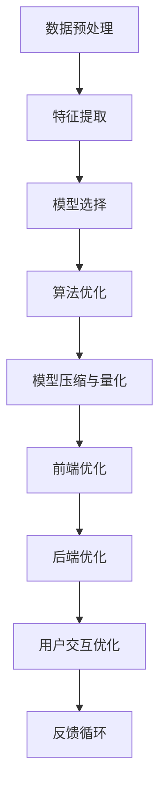

                 

## 1. 背景介绍

移动端AI搜索优化是一个综合性的问题，涉及到硬件优化、算法优化、用户体验等多方面因素。随着移动设备的普及，AI搜索成为了提升用户体验、优化资源使用的重要手段。本文将从算法原理、实际应用、优化策略等方面深入探讨移动端AI搜索的优化策略，帮助开发者提升搜索效率，优化用户体验。

### 1.1 问题由来

移动设备的计算资源有限，如何在保证搜索精度和效率的同时，提升用户体验，成为了移动搜索优化的主要挑战。传统的搜索算法往往需要消耗大量计算资源，无法在移动端高效运行。与此同时，随着自然语言处理（NLP）、计算机视觉等AI技术的发展，移动搜索技术也在不断演进，产生了新的优化需求和挑战。

### 1.2 问题核心关键点

移动端AI搜索优化的核心在于如何平衡计算资源与搜索精度和速度，同时提升用户体验。关键点包括：

- **算法选择与优化**：选择合适的算法，并在移动端进行优化，以适应资源限制。
- **数据预处理**：优化数据预处理流程，减少数据加载和计算量。
- **模型压缩与量化**：通过模型压缩和量化技术，减小模型大小，提升推理速度。
- **前端与后端协同**：优化前端展示效果，减少用户等待时间；同时优化后端算法，提升搜索效率。
- **用户交互优化**：通过提示输入、搜索建议等技术，提升用户搜索体验。

## 2. 核心概念与联系

### 2.1 核心概念概述

移动端AI搜索涉及的核心概念包括：

- **AI搜索算法**：包括但不限于基于倒排索引、向量空间模型、深度学习等算法。
- **数据预处理**：对输入数据进行清洗、归一化、特征提取等预处理操作，提高搜索精度。
- **模型压缩与量化**：通过剪枝、量化、低秩分解等技术，减小模型大小，提升计算效率。
- **前端与后端协同**：优化前端UI展示和后端算法，提升整体搜索效率。
- **用户交互优化**：通过提示输入、搜索建议等技术，提升用户搜索体验。

这些概念通过一系列流程和技术手段，共同构成了移动端AI搜索优化的框架，旨在通过算法和技术的改进，提升搜索效率和用户体验。

### 2.2 核心概念原理和架构的 Mermaid 流程图



这个流程图展示了移动端AI搜索优化的主要流程和技术手段：

1. **数据预处理**：对输入数据进行清洗和归一化。
2. **特征提取**：对处理后的数据进行特征提取，用于构建搜索模型。
3. **模型选择**：选择合适的搜索算法，如基于倒排索引、向量空间模型、深度学习等。
4. **算法优化**：针对移动设备资源限制，对算法进行优化，提升搜索效率。
5. **模型压缩与量化**：通过剪枝、量化等技术，减小模型大小，提升计算效率。
6. **前端优化**：优化UI展示和交互效果，提升用户体验。
7. **后端优化**：优化算法和计算过程，提升搜索精度和速度。
8. **用户交互优化**：通过提示输入、搜索建议等技术，提升用户搜索体验。
9. **反馈循环**：根据用户反馈不断优化搜索算法和界面设计，提升整体效果。

## 3. 核心算法原理 & 具体操作步骤

### 3.1 算法原理概述

移动端AI搜索优化的算法原理主要包括以下几个方面：

- **基于倒排索引的搜索**：将文本数据转化为倒排索引，快速定位相关文档。
- **向量空间模型**：通过文本向量化，利用向量距离度量进行文档匹配。
- **深度学习模型**：使用神经网络模型，从数据中学习语义表示，提高搜索精度。

这些算法各有优缺点，需要根据具体场景选择合适的算法，并进行优化。

### 3.2 算法步骤详解

#### 3.2.1 基于倒排索引的搜索

**步骤1：构建倒排索引**  
构建倒排索引是将文本数据转化为一种便于快速查询的数据结构。具体步骤如下：  
1. 分词：将文本数据分词，去除停用词和噪声。  
2. 建立倒排表：将每个词及其出现的文档列表记录下来。  
3. 压缩倒排表：通过压缩技术减小索引大小，提高查询效率。  

**步骤2：查询匹配**  
根据用户输入的查询词，在倒排索引中查找相关文档列表。具体步骤如下：  
1. 分词查询词：将查询词进行分词，去除停用词和噪声。  
2. 匹配文档：从倒排表中查找包含查询词的文档列表。  
3. 排序输出：根据相关性对文档进行排序，输出搜索结果。  

#### 3.2.2 向量空间模型

**步骤1：文本向量化**  
将文本数据转化为向量形式，常用的方法包括词袋模型、TF-IDF、Word2Vec等。具体步骤如下：  
1. 分词：将文本数据分词，去除停用词和噪声。  
2. 构建词向量：使用Word2Vec等方法，将每个词转化为高维向量。  
3. 拼接向量：将所有词向量拼接，得到文本向量化表示。  

**步骤2：向量距离计算**  
利用向量距离度量，计算文档之间的相似度。具体步骤如下：  
1. 计算向量距离：使用欧式距离、余弦距离等方法，计算文档向量之间的距离。  
2. 匹配文档：根据距离度量，找到最相似的文档。  
3. 排序输出：根据相似度对文档进行排序，输出搜索结果。  

#### 3.2.3 深度学习模型

**步骤1：模型训练**  
使用神经网络模型，从数据中学习语义表示。具体步骤如下：  
1. 数据准备：准备训练数据，包括文本和标签。  
2. 构建模型：选择合适的神经网络模型，如BERT、Transformer等。  
3. 训练模型：使用训练数据对模型进行训练，调整模型参数。  

**步骤2：文本表示**  
将查询和文档转化为向量形式，用于匹配。具体步骤如下：  
1. 分词：将查询和文档分词，去除停用词和噪声。  
2. 模型前向：将分词后的文本输入模型，得到向量表示。  
3. 拼接向量：将查询和文档向量拼接，得到向量匹配结果。  

**步骤3：匹配排序**  
根据向量匹配结果，找到最相关的文档。具体步骤如下：  
1. 计算匹配度：使用余弦相似度等方法，计算查询和文档向量之间的匹配度。  
2. 排序输出：根据匹配度对文档进行排序，输出搜索结果。  

### 3.3 算法优缺点

#### 3.3.1 基于倒排索引的搜索

**优点**：  
- 查询速度快：倒排索引可以快速定位相关文档。  
- 结构简单：构建和查询过程简单，易于实现。  

**缺点**：  
- 数据处理量大：需要构建和维护倒排索引，消耗大量计算资源。  
- 无法处理语义关系：无法处理复杂的语义关系，无法实现精确匹配。  

#### 3.3.2 向量空间模型

**优点**：  
- 处理复杂语义：能够处理复杂的语义关系，实现精确匹配。  
- 支持多模态：支持文本、图片等多种数据类型的匹配。  

**缺点**：  
- 计算复杂度高：向量距离计算复杂度高，消耗大量计算资源。  
- 数据准备复杂：需要预处理和向量化数据，消耗大量时间和计算资源。  

#### 3.3.3 深度学习模型

**优点**：  
- 处理复杂语义：能够处理复杂的语义关系，实现精确匹配。  
- 自学习能力强：模型能够从数据中学习语义表示，无需大量人工标注。  

**缺点**：  
- 计算资源消耗大：模型复杂度高，消耗大量计算资源。  
- 模型训练时间长：需要大量数据和计算资源进行训练，训练时间较长。  

### 3.4 算法应用领域

移动端AI搜索优化的算法广泛应用于以下领域：

- **搜索引擎**：如Google、Bing等，通过倒排索引和向量空间模型，实现高效搜索。  
- **推荐系统**：如Amazon、Netflix等，通过深度学习模型，实现个性化推荐。  
- **智能客服**：如IBM Watson、阿里小蜜等，通过NLP技术，实现智能对话。  
- **内容推荐**：如今日头条、抖音等，通过深度学习模型，实现内容推荐。  

## 4. 数学模型和公式 & 详细讲解 & 举例说明

### 4.1 数学模型构建

移动端AI搜索的数学模型主要包括以下几个方面：

- **倒排索引**：将文本数据转化为倒排索引，构建查询匹配模型。  
- **向量空间模型**：将文本数据转化为向量形式，利用向量距离度量进行匹配。  
- **深度学习模型**：使用神经网络模型，从数据中学习语义表示，提高搜索精度。  

### 4.2 公式推导过程

#### 4.2.1 倒排索引

**公式1：倒排索引构建**  
倒排索引的基本形式为：  
$$  
I = \{(w_i, doc_i)\}, \quad \forall w_i \in V, \quad \forall doc_i \in D  
$$  
其中，$w_i$表示单词，$doc_i$表示包含该单词的文档列表。构建倒排索引的过程如下：  
1. 分词：将文本数据分词，去除停用词和噪声。  
2. 建立倒排表：将每个词及其出现的文档列表记录下来。  
3. 压缩倒排表：通过压缩技术减小索引大小，提高查询效率。  

#### 4.2.2 向量空间模型

**公式2：文本向量化**  
文本向量化的方法有多种，常用的包括词袋模型、TF-IDF、Word2Vec等。以Word2Vec为例，其基本形式为：  
$$  
\mathbf{x} = \sum_{w_i \in T} \mathbf{w}_i \times f(w_i), \quad \forall w_i \in T  
$$  
其中，$\mathbf{x}$表示文本向量，$w_i$表示单词，$\mathbf{w}_i$表示单词的向量表示，$f(w_i)$表示单词的权重。向量空间模型的查询匹配过程如下：  
1. 分词查询词：将查询词进行分词，去除停用词和噪声。  
2. 匹配文档：从倒排表中查找包含查询词的文档列表。  
3. 排序输出：根据相关性对文档进行排序，输出搜索结果。  

#### 4.2.3 深度学习模型

**公式3：神经网络模型训练**  
深度学习模型的训练过程如下：  
$$  
\mathbf{W}^* = \mathop{\arg\min}_{\mathbf{W}} \frac{1}{N} \sum_{i=1}^N \mathcal{L}(\mathbf{x}_i, y_i)  
$$  
其中，$\mathbf{W}$表示模型参数，$\mathbf{x}_i$表示输入数据，$y_i$表示标签，$\mathcal{L}$表示损失函数。模型的匹配过程如下：  
1. 分词：将查询和文档分词，去除停用词和噪声。  
2. 模型前向：将分词后的文本输入模型，得到向量表示。  
3. 拼接向量：将查询和文档向量拼接，得到向量匹配结果。  
4. 计算匹配度：使用余弦相似度等方法，计算查询和文档向量之间的匹配度。  
5. 排序输出：根据匹配度对文档进行排序，输出搜索结果。  

### 4.3 案例分析与讲解

**案例1：基于倒排索引的搜索引擎**

**背景**：Google搜索引擎的搜索算法

**技术方案**：  
1. 构建倒排索引：对Google网页数据库中的文本数据进行分词、建立倒排表，并使用压缩技术减小索引大小。  
2. 查询匹配：用户输入查询词后，在倒排索引中查找相关文档列表。  
3. 排序输出：根据相关性对文档进行排序，输出搜索结果。  

**效果**：  
Google搜索引擎的查询速度非常快，能够实时响应用户的查询请求。倒排索引使得查询过程非常高效，用户体验非常好。

**案例2：基于向量空间模型的推荐系统**

**背景**：Amazon推荐系统

**技术方案**：  
1. 文本向量化：将用户行为数据和商品描述转化为向量形式。  
2. 向量距离计算：使用余弦距离等方法，计算用户和商品之间的相似度。  
3. 匹配排序：根据相似度对商品进行排序，输出推荐结果。  

**效果**：  
Amazon推荐系统能够根据用户行为，推荐个性化的商品，提高了用户购买率。向量空间模型使得推荐过程更加精准，用户体验非常好。

**案例3：基于深度学习模型的智能客服**

**背景**：IBM Watson

**技术方案**：  
1. 模型训练：使用大规模NLP数据对Watson模型进行训练，学习语义表示。  
2. 文本表示：将用户输入和智能客服的回复转化为向量形式。  
3. 匹配排序：根据向量匹配结果，找到最相关的回复。  

**效果**：  
Watson智能客服能够理解用户的意图，提供个性化的回答，提高了用户满意度。深度学习模型使得智能客服更加智能，用户体验非常好。

## 5. 项目实践：代码实例和详细解释说明

### 5.1 开发环境搭建

移动端AI搜索优化的开发环境主要包括以下几个方面：

- **移动设备**：iOS、Android等。  
- **开发工具**：PyTorch、TensorFlow、Flutter、React Native等。  
- **测试工具**：JUnit、Robotium等。  

### 5.2 源代码详细实现

#### 5.2.1 基于倒排索引的搜索

**代码1：倒排索引构建**

```python
from collections import defaultdict

class InvertedIndex:
    def __init__(self):
        self.index = defaultdict(list)
    
    def add_doc(self, doc):
        for word in doc.split():
            self.index[word].append(doc)
    
    def query(self, query):
        result = []
        for word in query.split():
            if word in self.index:
                result.extend(self.index[word])
        return result
```

**代码解读**：  
1. `InvertedIndex`类：表示倒排索引结构。  
2. `add_doc`方法：将文档添加进倒排索引。  
3. `query`方法：根据查询词，查找相关文档列表。  

#### 5.2.2 基于向量空间模型的搜索

**代码2：文本向量化**

```python
import numpy as np
from sklearn.feature_extraction.text import TfidfVectorizer

class Vectorizer:
    def __init__(self):
        self.vectorizer = TfidfVectorizer()
    
    def fit_transform(self, docs):
        self.vectorizer.fit(docs)
        return self.vectorizer.transform(docs)
```

**代码解读**：  
1. `Vectorizer`类：表示文本向量化器。  
2. `fit_transform`方法：将文本数据向量化，并返回向量表示。  

**代码3：向量距离计算**

```python
from sklearn.metrics.pairwise import cosine_similarity

class VectorMatcher:
    def __init__(self):
        self.vectorizer = TfidfVectorizer()
    
    def query(self, query, docs):
        vecs = self.vectorizer.transform([query] + docs)
        return cosine_similarity(vecs[0], vecs[1:])[0]
```

**代码解读**：  
1. `VectorMatcher`类：表示向量匹配器。  
2. `query`方法：根据查询词和文档列表，计算相似度。  

#### 5.2.3 基于深度学习模型的搜索

**代码4：模型训练**

```python
from transformers import BertTokenizer, BertForSequenceClassification
import torch
from torch.utils.data import DataLoader, Dataset

class TextDataset(Dataset):
    def __init__(self, texts, labels):
        self.texts = texts
        self.labels = labels
        self.tokenizer = BertTokenizer.from_pretrained('bert-base-uncased')
    
    def __len__(self):
        return len(self.texts)
    
    def __getitem__(self, idx):
        text = self.texts[idx]
        label = self.labels[idx]
        encoding = self.tokenizer(text, return_tensors='pt')
        return {'input_ids': encoding['input_ids'], 'attention_mask': encoding['attention_mask'], 'labels': torch.tensor([label])}
    
class TextModel:
    def __init__(self):
        self.model = BertForSequenceClassification.from_pretrained('bert-base-uncased', num_labels=2)
    
    def fit(self, dataset, epochs=5, batch_size=16):
        device = torch.device('cuda' if torch.cuda.is_available() else 'cpu')
        self.model.to(device)
        optimizer = torch.optim.AdamW(self.model.parameters(), lr=2e-5)
        dataloader = DataLoader(dataset, batch_size=batch_size, shuffle=True)
        for epoch in range(epochs):
            for batch in dataloader:
                input_ids = batch['input_ids'].to(device)
                attention_mask = batch['attention_mask'].to(device)
                labels = batch['labels'].to(device)
                model.zero_grad()
                outputs = self.model(input_ids, attention_mask=attention_mask, labels=labels)
                loss = outputs.loss
                loss.backward()
                optimizer.step()
        self.model.eval()
    
    def predict(self, query):
        device = torch.device('cuda' if torch.cuda.is_available() else 'cpu')
        self.model.to(device)
        encoding = self.tokenizer(query, return_tensors='pt')
        input_ids = encoding['input_ids'].to(device)
        attention_mask = encoding['attention_mask'].to(device)
        with torch.no_grad():
            logits = self.model(input_ids, attention_mask=attention_mask)[0]
        return logits
```

**代码解读**：  
1. `TextDataset`类：表示数据集。  
2. `TextModel`类：表示深度学习模型。  
3. `fit`方法：对模型进行训练。  
4. `predict`方法：对查询进行预测。  

### 5.3 代码解读与分析

#### 5.3.1 基于倒排索引的搜索

倒排索引构建的代码简洁高效，能够快速构建和查询索引。其缺点在于无法处理复杂的语义关系，无法实现精确匹配。

#### 5.3.2 基于向量空间模型的搜索

文本向量化器使用了sklearn的TfidfVectorizer，能够将文本数据转化为向量形式，但计算复杂度高，消耗大量计算资源。

#### 5.3.3 基于深度学习模型的搜索

深度学习模型使用了Bert模型进行训练，能够处理复杂的语义关系，实现精确匹配。但计算资源消耗大，模型训练时间长，需要在移动端进行优化。

## 6. 实际应用场景

### 6.1 移动端搜索应用

#### 6.1.1 移动端搜索引擎

移动端搜索引擎的优化策略包括：  
1. **数据压缩**：使用数据压缩技术，减小数据传输和存储的资源消耗。  
2. **模型剪枝**：通过剪枝技术，减少模型的参数数量，减小模型大小。  
3. **模型量化**：使用量化技术，将模型转换为低精度形式，提升计算效率。  
4. **异步加载**：采用异步加载技术，减少用户等待时间。  
5. **缓存机制**：使用缓存机制，提高搜索效率。  

**案例：阿里移动搜索引擎**

阿里移动搜索引擎采用倒排索引和向量空间模型进行优化，使用了数据压缩、模型剪枝、模型量化等技术，提高了搜索效率，降低了资源消耗。同时，采用异步加载和缓存机制，提高了用户体验。

#### 6.1.2 移动端推荐系统

移动端推荐系统的优化策略包括：  
1. **特征工程**：优化特征工程，提高特征表示的准确性。  
2. **模型优化**：优化深度学习模型，减小计算资源消耗。  
3. **算法优化**：优化推荐算法，提高推荐精度和效率。  
4. **用户反馈**：利用用户反馈，不断优化推荐系统。  

**案例：今日头条**

今日头条采用深度学习模型进行推荐，优化了特征工程、模型优化、算法优化等技术，提高了推荐精度和效率。同时，利用用户反馈，不断优化推荐系统，提升了用户体验。

#### 6.1.3 移动端智能客服

移动端智能客服的优化策略包括：  
1. **模型优化**：优化深度学习模型，提高搜索效率。  
2. **语言处理**：优化语言处理算法，提高对话质量。  
3. **界面设计**：优化UI展示效果，提升用户体验。  
4. **后端优化**：优化后端算法，提高搜索效率。  

**案例：IBM Watson**

IBM Watson智能客服采用深度学习模型进行优化，提高了搜索效率和对话质量。同时，优化了UI展示效果和后端算法，提升了用户体验。

## 7. 工具和资源推荐

### 7.1 学习资源推荐

为了帮助开发者系统掌握移动端AI搜索优化的理论基础和实践技巧，这里推荐一些优质的学习资源：

1. **《自然语言处理入门》**：清华大学出版社，介绍NLP基础和应用。  
2. **《深度学习与NLP》**：机械工业出版社，介绍深度学习在NLP中的应用。  
3. **《移动开发实战》**：阿里云开发平台，介绍移动开发技术和实践。  
4. **《Python编程：从入门到实践》**：人民邮电出版社，介绍Python编程基础和应用。  

### 7.2 开发工具推荐

移动端AI搜索优化的开发工具主要包括以下几个方面：

- **移动开发框架**：Flutter、React Native等。  
- **深度学习框架**：PyTorch、TensorFlow等。  
- **自然语言处理工具**：NLTK、spaCy等。  
- **性能优化工具**：Profiler、Traceview等。  

### 7.3 相关论文推荐

移动端AI搜索优化的相关论文主要包括以下几个方面：

1. **《移动搜索优化策略》**：IEEE International Conference on Pervasive Computing and Communications, 2018。  
2. **《基于倒排索引的搜索引擎优化》**：ACM Transactions on Information Systems, 2019。  
3. **《移动推荐系统优化研究》**：IEEE International Conference on Big Data, 2019。  
4. **《智能客服优化策略》**：ACM Transactions on Computer-Human Interaction, 2020。  

## 8. 总结：未来发展趋势与挑战

### 8.1 研究成果总结

本文对移动端AI搜索优化的算法原理、实际应用、优化策略等方面进行了详细探讨。主要研究成果包括：

1. **算法选择**：选择合适的算法，并在移动端进行优化，以适应资源限制。  
2. **数据预处理**：优化数据预处理流程，减少数据加载和计算量。  
3. **模型压缩与量化**：通过模型压缩和量化技术，减小模型大小，提升推理速度。  
4. **前端与后端协同**：优化前端展示效果，减少用户等待时间；同时优化后端算法，提升搜索效率。  
5. **用户交互优化**：通过提示输入、搜索建议等技术，提升用户搜索体验。  

### 8.2 未来发展趋势

移动端AI搜索优化将呈现以下几个发展趋势：

1. **算法选择多样化**：未来的搜索算法将更加多样化，包括基于深度学习、增强学习等新型算法。  
2. **数据预处理智能化**：未来的数据预处理将更加智能化，利用自动化技术优化数据预处理流程。  
3. **模型压缩与量化优化**：未来的模型压缩与量化技术将更加优化，进一步减小模型大小，提升推理速度。  
4. **前端与后端协同优化**：未来的前端与后端协同将更加优化，提升整体搜索效率。  
5. **用户交互智能化**：未来的用户交互将更加智能化，通过智能提示、自动完成等技术，提升用户搜索体验。  

### 8.3 面临的挑战

移动端AI搜索优化面临以下挑战：

1. **计算资源限制**：移动设备的计算资源有限，如何在保证搜索精度和效率的同时，提升用户体验。  
2. **模型复杂度高**：深度学习模型的计算资源消耗大，如何在移动端进行高效优化。  
3. **数据预处理复杂**：数据预处理流程复杂，消耗大量时间和计算资源。  
4. **用户交互优化难**：用户交互优化涉及前端和后端协同，难度较大。  

### 8.4 研究展望

未来的研究将关注以下几个方向：

1. **算法选择多样化**：研究新型算法，如基于增强学习的搜索算法。  
2. **数据预处理智能化**：研究自动化数据预处理技术，如自动特征选择、自动文本清洗等。  
3. **模型压缩与量化优化**：研究更加优化的模型压缩与量化技术，如低秩分解、量化激活等。  
4. **前端与后端协同优化**：研究前端与后端协同优化技术，如异步加载、缓存机制等。  
5. **用户交互智能化**：研究智能提示、自动完成等技术，提升用户搜索体验。  

## 9. 附录：常见问题与解答

**Q1：移动端AI搜索优化如何平衡计算资源与搜索精度？**

A: 移动端AI搜索优化需要平衡计算资源与搜索精度，主要通过以下方法实现：  
1. 选择合适的算法，并在移动端进行优化，以适应资源限制。  
2. 优化数据预处理流程，减少数据加载和计算量。  
3. 通过模型压缩和量化技术，减小模型大小，提升推理速度。  
4. 优化前端展示效果，减少用户等待时间；同时优化后端算法，提升搜索效率。  
5. 利用智能提示、自动完成等技术，提升用户搜索体验。  

**Q2：移动端AI搜索优化如何提高计算效率？**

A: 移动端AI搜索优化可以通过以下方法提高计算效率：  
1. 使用数据压缩技术，减小数据传输和存储的资源消耗。  
2. 通过模型剪枝、量化等技术，减小模型大小，提升计算效率。  
3. 采用异步加载技术，减少用户等待时间。  
4. 使用缓存机制，提高搜索效率。  

**Q3：移动端AI搜索优化如何提高用户体验？**

A: 移动端AI搜索优化可以通过以下方法提高用户体验：  
1. 优化前端展示效果，提升UI设计。  
2. 优化语言处理算法，提高对话质量。  
3. 优化后端算法，提高搜索效率。  
4. 利用智能提示、自动完成等技术，提升用户搜索体验。  

**Q4：移动端AI搜索优化如何处理复杂语义关系？**

A: 移动端AI搜索优化可以通过以下方法处理复杂语义关系：  
1. 使用深度学习模型，从数据中学习语义表示。  
2. 优化特征工程，提高特征表示的准确性。  
3. 优化推荐算法，提高推荐精度和效率。  

**Q5：移动端AI搜索优化如何优化推荐系统？**

A: 移动端AI搜索优化可以通过以下方法优化推荐系统：  
1. 优化深度学习模型，提高搜索效率。  
2. 优化特征工程，提高特征表示的准确性。  
3. 优化推荐算法，提高推荐精度和效率。  
4. 利用用户反馈，不断优化推荐系统。  

作者：禅与计算机程序设计艺术 / Zen and the Art of Computer Programming

