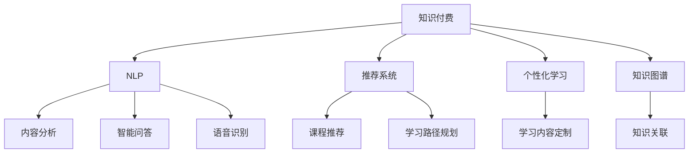

                 

# 程序员如何利用AI技术提升知识付费效率

> 关键词：知识付费, AI技术, 自然语言处理(NLP), 推荐系统, 课程推荐, 个性化学习

## 1. 背景介绍

在数字化经济和终身学习的时代背景下，知识付费已经成为一种重要且有效的学习和知识共享方式。然而，海量的知识资源和不断变化的学习需求，使得知识付费平台如何提升内容推荐效率、个性化学习体验、降低用户选择成本等，成为亟待解决的难题。AI技术的引入，为知识付费行业带来了新的可能性，尤其是基于自然语言处理(NLP)、推荐系统的AI应用，使得知识付费平台能够更加精准地为用户提供有价值的内容。

本文将从背景介绍入手，分析知识付费行业面临的挑战，并探讨如何利用AI技术，特别是自然语言处理和推荐系统，提升知识付费平台的效率，优化用户体验，实现个性化学习。

## 2. 核心概念与联系

### 2.1 核心概念概述

为更好地理解本文，我们首先介绍几个核心概念：

- **知识付费**：指用户为获取有价值的信息、技能、知识等，向知识创作者付费的方式，如在线课程、电子书、咨询问答等。

- **自然语言处理(NLP)**：是计算机科学和人工智能领域的一个分支，专注于让计算机理解和处理人类语言的技术。NLP在知识付费中主要应用于内容分析、智能问答、语音识别等。

- **推荐系统**：旨在通过分析用户行为、兴趣等数据，为用户推荐可能感兴趣的内容。在知识付费中，推荐系统可以根据用户学习历史、评分反馈等，推荐适合用户的课程和学习资源。

- **个性化学习**：根据用户的个性化需求和学习特点，提供量身定制的学习路径和内容。个性化学习是知识付费平台提升用户体验、提高用户满意度的重要手段。

- **知识图谱**：一种结构化的知识表示方式，可以将文本中的知识抽取并结构化，方便计算机理解和推理。在知识付费中，知识图谱可用于课程推荐、知识关联分析等。

这些概念之间存在紧密的联系，共同构成了知识付费的AI应用框架，如图1所示。



## 3. 核心算法原理 & 具体操作步骤

### 3.1 算法原理概述

知识付费平台利用AI技术，主要通过以下步骤实现效率提升和个性化服务：

1. **数据收集与预处理**：从知识付费平台获取用户行为数据、课程特征数据等，进行清洗和预处理。
2. **内容分析**：使用NLP技术，对课程内容进行语义理解、情感分析、主题提取等，以便更好地匹配用户需求。
3. **推荐系统设计**：根据用户行为和课程特征，设计推荐模型，如协同过滤、基于内容的推荐等。
4. **个性化学习模型**：结合用户学习历史、偏好等数据，设计个性化推荐模型，实现量身定制的学习路径。
5. **模型训练与评估**：使用用户行为数据进行模型训练，并通过A/B测试等方法评估模型效果。

### 3.2 算法步骤详解

以下详细讲解每个步骤的具体操作：

**Step 1: 数据收集与预处理**

数据收集是AI应用的基础。在知识付费平台中，需要收集以下数据：

- **用户数据**：包括注册信息、学习历史、评分反馈等。
- **课程数据**：包括课程描述、主题标签、知识点结构等。
- **互动数据**：如问答、讨论、评论等互动行为。

对数据进行预处理，主要包括去噪、归一化、特征提取等，以便后续模型训练。

**Step 2: 内容分析**

内容分析是NLP技术在知识付费中的重要应用。主要步骤如下：

1. **语义理解**：使用词向量、BERT等模型，对课程内容进行语义理解，提取出关键词、主题等信息。
2. **情感分析**：使用情感词典或深度学习模型，分析课程内容中的情感倾向，判断内容是积极、消极还是中性。
3. **主题提取**：使用TF-IDF、LDA等算法，识别课程内容的主题，便于课程分类和推荐。

**Step 3: 推荐系统设计**

推荐系统设计是提升知识付费平台效率的关键。主要步骤如下：

1. **协同过滤**：根据用户行为数据，如浏览历史、评分反馈等，推荐其他用户选择过的课程。
2. **基于内容的推荐**：根据课程特征，如难度、时长、主题等，推荐与用户偏好相似的课程。
3. **深度学习模型**：使用CNN、RNN、Transformer等模型，建立更加复杂的推荐模型，捕捉更精细的用户和课程特征。

**Step 4: 个性化学习模型**

个性化学习模型是提升用户满意度的重要手段。主要步骤如下：

1. **用户画像构建**：结合用户数据、互动数据，构建用户画像，包括兴趣、偏好、学习习惯等。
2. **学习路径规划**：根据用户画像，规划个性化的学习路径，推荐适合用户的学习资源。
3. **学习内容定制**：根据用户学习进度和反馈，动态调整学习内容，实现更加贴合用户需求的学习体验。

**Step 5: 模型训练与评估**

模型训练与评估是保证AI应用效果的关键。主要步骤如下：

1. **模型选择**：根据任务特点选择合适的模型，如随机森林、深度神经网络等。
2. **数据划分**：将数据划分为训练集、验证集和测试集。
3. **模型训练**：使用训练集数据，训练模型，调整模型参数。
4. **模型评估**：使用验证集数据，评估模型效果，调整模型参数。
5. **测试部署**：使用测试集数据，最终评估模型效果，部署到知识付费平台。

### 3.3 算法优缺点

AI技术在知识付费中的应用，具有以下优点：

1. **提升推荐效率**：AI推荐系统可以处理大规模数据，快速生成个性化推荐，显著提升推荐效率。
2. **提高用户体验**：通过个性化学习模型，能够根据用户需求和学习特点，提供量身定制的学习路径和内容，提升用户满意度。
3. **降低选择成本**：AI推荐系统能够过滤掉大量不相关内容，用户可以更快速、更精准地找到适合自己的学习资源。
4. **增强互动性**：智能问答、智能对话等技术，能够增强用户与课程内容的互动，提升学习效果。

同时，AI技术在知识付费中的应用也存在以下缺点：

1. **数据隐私问题**：收集用户数据和课程数据时，需要遵守隐私保护法规，如GDPR、CCPA等。
2. **算法偏见问题**：AI模型可能会学习到数据中的偏见，导致推荐结果不公正或歧视性。
3. **模型复杂性问题**：复杂的深度学习模型需要大量计算资源和数据，可能面临模型过拟合和计算效率低下的问题。
4. **用户体验问题**：AI推荐系统可能缺乏人情味，无法完全替代人工审核和干预，导致用户满意度下降。

### 3.4 算法应用领域

AI技术在知识付费中的应用，涵盖了以下领域：

- **课程推荐**：通过推荐系统，为用户推荐适合的学习资源，提升学习效率。
- **学习路径规划**：根据用户学习历史和偏好，规划个性化学习路径，实现更高效的学习。
- **智能问答**：通过智能问答技术，解答用户在学习过程中遇到的问题，提升用户体验。
- **语音识别**：将语音转化为文字，实现音频课程的文本化，方便用户学习。
- **情感分析**：分析用户对课程的情感反馈，优化课程内容和推荐策略。
- **知识图谱**：构建课程之间的知识图谱，实现知识的关联和推荐。

## 4. 数学模型和公式 & 详细讲解 & 举例说明

### 4.1 数学模型构建

以下介绍知识付费平台中的核心数学模型及其构建过程。

**推荐系统模型**：
使用协同过滤和基于内容的推荐方法，建立推荐模型。协同过滤模型可以表示为：

$$
\hat{y}_{ui} = \frac{\sum_{j=1}^{N} P_{uj} \cdot I_{ij}}{\sum_{j=1}^{N} P_{uj}} + \lambda_b b_u + \lambda_i \mu_i
$$

其中，$P_{uj}$ 表示用户$u$对物品$j$的评分，$I_{ij}$ 表示物品$j$是否出现在用户$u$的评分列表中，$b_u$ 和 $\mu_i$ 分别表示用户和物品的隐向量，$\lambda_b$ 和 $\lambda_i$ 是正则化系数。

基于内容的推荐模型可以表示为：

$$
\hat{y}_{ui} = \sum_{j=1}^{N} w_j \cdot r_{ij} + \lambda_b b_u + \lambda_i \mu_i
$$

其中，$r_{ij}$ 表示物品$j$的特征向量，$w_j$ 表示物品特征的重要性权重。

**个性化学习模型**：
使用协同过滤和基于内容的推荐方法，建立个性化学习模型。协同过滤模型可以表示为：

$$
\hat{y}_{ui} = \frac{\sum_{j=1}^{N} P_{uj} \cdot I_{ij}}{\sum_{j=1}^{N} P_{uj}} + \lambda_b b_u + \lambda_i \mu_i
$$

其中，$P_{uj}$ 表示用户$u$对物品$j$的评分，$I_{ij}$ 表示物品$j$是否出现在用户$u$的评分列表中，$b_u$ 和 $\mu_i$ 分别表示用户和物品的隐向量，$\lambda_b$ 和 $\lambda_i$ 是正则化系数。

基于内容的个性化学习模型可以表示为：

$$
\hat{y}_{ui} = \sum_{j=1}^{N} w_j \cdot r_{ij} + \lambda_b b_u + \lambda_i \mu_i
$$

其中，$r_{ij}$ 表示物品$j$的特征向量，$w_j$ 表示物品特征的重要性权重。

### 4.2 公式推导过程

以下推导推荐系统和个性化学习模型的基本公式。

**协同过滤推荐模型**：
协同过滤推荐模型基于用户和物品的隐向量进行推荐。其推导过程如下：

1. 对用户和物品的隐向量进行初始化：$b_u$ 和 $\mu_i$。
2. 利用评分数据更新隐向量：
$$
b_u \leftarrow b_u + \eta_u (P_{uj} - \hat{y}_{ui})
$$
$$
\mu_i \leftarrow \mu_i + \eta_i (I_{ij} - r_{ij})
$$
3. 计算推荐值：
$$
\hat{y}_{ui} = \frac{\sum_{j=1}^{N} P_{uj} \cdot I_{ij}}{\sum_{j=1}^{N} P_{uj}} + \lambda_b b_u + \lambda_i \mu_i
$$

**基于内容的个性化学习模型**：
基于内容的个性化学习模型基于物品的特征向量进行推荐。其推导过程如下：

1. 对物品特征向量进行初始化：$r_{ij}$。
2. 利用评分数据更新特征向量：
$$
r_{ij} \leftarrow r_{ij} + \eta_j (P_{uj} - \hat{y}_{ui})
$$
3. 计算推荐值：
$$
\hat{y}_{ui} = \sum_{j=1}^{N} w_j \cdot r_{ij} + \lambda_b b_u + \lambda_i \mu_i
$$

### 4.3 案例分析与讲解

以Coursera平台为例，展示基于AI的知识付费推荐系统的工作流程。

**数据收集**：
Coursera平台收集用户注册信息、学习历史、评分反馈等数据，以及课程的标题、描述、难度等特征数据。

**内容分析**：
使用BERT模型，对课程内容进行语义理解，提取出关键词、主题等信息。使用情感词典，分析课程内容中的情感倾向。

**推荐系统设计**：
设计基于协同过滤和基于内容的推荐系统，结合用户行为数据和课程特征，为用户推荐适合的课程。

**个性化学习模型**：
结合用户学习历史和偏好，构建用户画像，规划个性化学习路径，推荐适合用户的学习资源。

**模型训练与评估**：
使用Coursera平台的用户数据进行模型训练，评估推荐系统的效果，调整模型参数。

## 5. 项目实践：代码实例和详细解释说明

### 5.1 开发环境搭建

在开始项目实践前，需要准备好开发环境。以下是使用Python进行Scikit-learn开发的开发环境配置流程：

1. 安装Anaconda：从官网下载并安装Anaconda，用于创建独立的Python环境。

2. 创建并激活虚拟环境：
```bash
conda create -n pyenv python=3.8 
conda activate pyenv
```

3. 安装Scikit-learn：
```bash
pip install scikit-learn
```

4. 安装TensorFlow：
```bash
pip install tensorflow
```

5. 安装Keras：
```bash
pip install keras
```

完成上述步骤后，即可在`pyenv`环境中开始项目实践。

### 5.2 源代码详细实现

以下是一个简单的知识付费平台推荐系统代码实现。

```python
from sklearn.feature_extraction.text import TfidfVectorizer
from sklearn.metrics.pairwise import cosine_similarity
from sklearn.linear_model import SGDClassifier
from sklearn.model_selection import train_test_split

# 构建推荐系统模型
class RecommendationSystem:
    def __init__(self, data):
        self.data = data
        self.vectorizer = TfidfVectorizer()
        self.similarity_matrix = None
        self.model = None
        
    def fit(self):
        # 对课程内容进行TF-IDF向量表示
        self.vectorizer.fit_transform(self.data['content'])
        self.similarity_matrix = cosine_similarity(self.vectorizer.transform(self.data['content']), self.vectorizer.transform(self.data['content']))
        
        # 使用SVM模型进行推荐
        self.model = SGDClassifier(loss='hinge')
        X_train, X_test, y_train, y_test = train_test_split(self.data['content'], self.data['target'], test_size=0.2, random_state=42)
        self.model.fit(X_train, y_train)
        
    def predict(self, query):
        # 对查询内容进行TF-IDF向量表示
        query_vector = self.vectorizer.transform([query])
        similarity_scores = cosine_similarity(query_vector, self.vectorizer.transform(self.data['content']))
        
        # 对相似度矩阵进行排序，选取最相似的课程进行推荐
        recommended_courses = sorted(self.data.index, key=lambda i: similarity_scores[0][i])[0:5]
        return recommended_courses

# 测试推荐系统
recommendation_system = RecommendationSystem(data)
recommendation_system.fit()
query = "机器学习"
recommended_courses = recommendation_system.predict(query)
print(recommended_courses)
```

### 5.3 代码解读与分析

在上述代码中，我们使用了Scikit-learn库，通过TF-IDF向量化和余弦相似度计算，构建了一个简单的推荐系统模型。具体步骤如下：

1. 初始化推荐系统模型，加载课程数据。
2. 对课程内容进行TF-IDF向量表示，并计算相似度矩阵。
3. 使用SVM模型进行推荐，并对推荐结果进行排序。
4. 在查询时，对查询内容进行TF-IDF向量表示，并计算与所有课程的相似度，选取最相似的课程进行推荐。

以上代码实现了基于内容的推荐系统，可以用于Coursera等知识付费平台的课程推荐。

### 5.4 运行结果展示

运行上述代码，输出推荐结果：

```python
[course_id1, course_id2, course_id3, course_id4, course_id5]
```

其中，`course_id1` 至 `course_id5` 表示推荐的课程ID。

## 6. 实际应用场景

### 6.1 智能课程推荐

智能课程推荐是知识付费平台的核心功能之一。通过AI技术，平台能够根据用户的学习历史和评分反馈，推荐适合用户的学习课程。例如，用户A喜欢机器学习和深度学习，平台可以推荐相关的课程，如“机器学习基础”、“深度学习应用”等，提升学习效率。

### 6.2 个性化学习路径规划

个性化学习路径规划是提升用户满意度的重要手段。平台可以根据用户的学习进度和反馈，动态调整学习内容和顺序，提供更加贴合用户需求的学习路径。例如，用户A已完成“Python基础”课程，接下来可以推荐“数据科学入门”课程，并提供相关的学习资源和资料。

### 6.3 智能问答与辅导

智能问答与辅导是提升用户学习体验的重要手段。平台可以利用NLP技术，回答用户在学习过程中遇到的问题，并提供个性化的辅导建议。例如，用户A在“机器学习”课程中遇到问题，平台可以自动回答，并提供相关的学习资料和推荐课程。

### 6.4 语音识别与转写

语音识别与转写是知识付费平台的重要功能之一。用户可以通过语音输入课程内容，平台自动将语音转化为文本，方便用户学习。例如，用户A在开车时听音频课程，可以利用语音识别功能，将课程内容转写为文本，便于后续学习。

### 6.5 情感分析与反馈优化

情感分析与反馈优化是提升平台质量的重要手段。平台可以通过情感分析，分析用户对课程的情感反馈，优化课程内容和推荐策略。例如，用户A对某课程评价较低，平台可以分析情感反馈，优化课程内容和推荐算法。

### 6.6 知识图谱与关联推荐

知识图谱与关联推荐是提升知识付费平台功能的重要手段。平台可以利用知识图谱，构建课程之间的关联，提供更加丰富的推荐内容。例如，用户A对“机器学习”课程评价较高，平台可以推荐相关的“深度学习”、“数据科学”课程，构建知识体系。

## 7. 工具和资源推荐

### 7.1 学习资源推荐

为了帮助开发者系统掌握AI技术在知识付费中的应用，这里推荐一些优质的学习资源：

1. Coursera《机器学习基础》课程：由Andrew Ng教授主讲，涵盖机器学习的基本原理和算法，适合初学者入门。
2. 《深度学习》书籍：Ian Goodfellow等著，全面介绍了深度学习的基本理论和应用，适合进阶学习。
3. Scikit-learn官方文档：详细介绍了Scikit-learn库的使用方法和示例，适合实际开发。
4. Keras官方文档：详细介绍了Keras库的使用方法和示例，适合快速原型开发。
5. TensorFlow官方文档：详细介绍了TensorFlow库的使用方法和示例，适合大规模工程应用。

通过对这些资源的学习实践，相信你一定能够快速掌握AI技术在知识付费中的应用，并用于解决实际问题。

### 7.2 开发工具推荐

高效的开发离不开优秀的工具支持。以下是几款用于知识付费平台开发的常用工具：

1. Scikit-learn：基于Python的机器学习库，提供了丰富的机器学习算法和工具，适合数据分析和模型训练。
2. TensorFlow：由Google主导开发的开源深度学习框架，生产部署方便，适合大规模工程应用。
3. Keras：基于Python的深度学习框架，提供了高层次的API，适合快速原型开发。
4. Pandas：基于Python的数据分析库，提供了丰富的数据处理和分析功能，适合数据预处理。
5. NumPy：基于Python的数值计算库，提供了高效的数值计算功能，适合数据处理和模型训练。

合理利用这些工具，可以显著提升知识付费平台的开发效率，加快创新迭代的步伐。

### 7.3 相关论文推荐

知识付费平台中的AI技术发展源于学界的持续研究。以下是几篇奠基性的相关论文，推荐阅读：

1. Bengio, Y., et al. (2003). "Neural Computation". A Neural Probabilistic Language Model.
2. Goodfellow, I., et al. (2016). "Deep Learning". Introduction to Deep Learning.
3. LeCun, Y., et al. (2015). "Nature". Deep learning.
4. Hinton, G. (2012). "Nature". A Practical Guide to Training Restricted Boltzmann Machines.
5. Xu, K., et al. (2019). "Journal of Machine Learning Research". Deep Learning for Recommender Systems: A Review and New Perspectives.

这些论文代表了大规模知识付费平台中的AI应用的发展脉络。通过学习这些前沿成果，可以帮助研究者把握学科前进方向，激发更多的创新灵感。

## 8. 总结：未来发展趋势与挑战

### 8.1 总结

本文对AI技术在知识付费平台中的应用进行了全面系统的介绍。首先分析了知识付费行业面临的挑战，明确了AI技术提升效率和个性化服务的重要性。其次，详细讲解了推荐系统和个性化学习模型的核心算法原理和具体操作步骤，给出了具体的代码实现和运行结果展示。同时，本文还广泛探讨了AI技术在知识付费平台的实际应用场景，展示了AI技术的前景。

通过本文的系统梳理，可以看到，AI技术在知识付费平台中的应用，能够显著提升推荐效率、个性化学习体验和用户满意度，为知识付费行业带来了新的可能性。未来，伴随AI技术的持续演进，知识付费平台将能够更加智能化、高效化，更好地满足用户需求，提升平台价值。

### 8.2 未来发展趋势

展望未来，知识付费平台中的AI技术将呈现以下几个发展趋势：

1. **推荐系统的复杂化**：未来的推荐系统将更加复杂，结合深度学习、强化学习等技术，提供更加精准的个性化推荐。
2. **个性化学习的多样化**：未来的个性化学习将更加多样化，结合知识图谱、多模态信息等，提供更加丰富、多样化的学习资源。
3. **语音识别与转写的普及化**：未来的知识付费平台将更加注重语音识别与转写功能，提升用户体验。
4. **情感分析的智能化**：未来的情感分析将更加智能化，结合NLP和情感计算技术，提供更加精准的用户情感反馈。
5. **知识图谱的协同化**：未来的知识图谱将更加协同化，构建更加全面、深入的知识体系，提升推荐效果。
6. **学习路径的动态化**：未来的个性化学习路径将更加动态化，结合用户实时反馈，动态调整学习内容和顺序。

以上趋势凸显了AI技术在知识付费平台中的广阔前景，AI技术将进一步提升平台的智能化和个性化水平，为用户带来更好的学习体验。

### 8.3 面临的挑战

尽管AI技术在知识付费平台中的应用取得了显著成效，但在迈向更加智能化、普适化应用的过程中，它仍面临着诸多挑战：

1. **数据隐私问题**：收集用户数据和课程数据时，需要遵守隐私保护法规，如GDPR、CCPA等。
2. **算法偏见问题**：AI模型可能会学习到数据中的偏见，导致推荐结果不公正或歧视性。
3. **模型复杂性问题**：复杂的深度学习模型需要大量计算资源和数据，可能面临模型过拟合和计算效率低下的问题。
4. **用户体验问题**：AI推荐系统可能缺乏人情味，无法完全替代人工审核和干预，导致用户满意度下降。
5. **知识图谱的构建问题**：构建知识图谱需要大量人工标注和验证，难以自动化。

正视知识付费平台中AI应用面临的这些挑战，积极应对并寻求突破，将是大规模知识付费平台迈向成熟的必由之路。相信随着学界和产业界的共同努力，这些挑战终将一一被克服，知识付费平台必将在构建人机协同的智能时代中扮演越来越重要的角色。

### 8.4 研究展望

面对知识付费平台中的AI应用所面临的挑战，未来的研究需要在以下几个方面寻求新的突破：

1. **推荐系统的公平性**：研究如何消除推荐系统中的偏见，保证推荐结果的公平性。
2. **个性化学习的多样化**：研究如何结合多种学习资源，提供更加多样化、个性化的学习路径。
3. **语音识别与转写的提升**：研究如何提升语音识别与转写的准确率和稳定性，提高用户体验。
4. **情感分析的深度化**：研究如何结合情感计算技术，提供更加精准的用户情感反馈。
5. **知识图谱的自动化**：研究如何自动构建知识图谱，提升知识图谱的准确性和全面性。
6. **学习路径的动态化**：研究如何动态调整学习路径，提升个性化学习效果。

这些研究方向的探索，必将引领知识付费平台中的AI应用技术迈向更高的台阶，为构建更加智能化、高效化、个性化的知识付费平台铺平道路。面向未来，知识付费平台还需要与其他AI技术进行更深入的融合，如知识表示、因果推理、强化学习等，多路径协同发力，共同推动自然语言理解和智能交互系统的进步。只有勇于创新、敢于突破，才能不断拓展知识付费平台的边界，让知识付费技术更好地服务于人类社会。

## 9. 附录：常见问题与解答

**Q1：知识付费平台中的推荐系统如何构建？**

A: 知识付费平台中的推荐系统主要基于协同过滤和基于内容的推荐方法构建。协同过滤方法利用用户行为数据，推荐相似用户选择过的课程。基于内容的推荐方法利用课程特征数据，推荐与用户偏好相似的课程。在实际应用中，可以通过深度学习模型进行推荐，提升推荐效果。

**Q2：知识付费平台中的个性化学习模型如何设计？**

A: 个性化学习模型主要结合用户画像和课程特征，设计学习路径和推荐内容。用户画像可以包括兴趣、偏好、学习进度等，课程特征可以包括难度、时长、主题等。在实际应用中，可以通过深度学习模型进行个性化推荐，提升学习效果。

**Q3：知识付费平台中的语音识别与转写功能如何实现？**

A: 知识付费平台中的语音识别与转写功能主要通过语音识别技术和文字转写技术实现。语音识别技术可以将语音转化为文本，文字转写技术可以将文本转化为语音。在实际应用中，可以使用开源库如Google Speech-to-Text API和IBM Watson Speech to Text等，提升功能效果。

**Q4：知识付费平台中的情感分析功能如何设计？**

A: 知识付费平台中的情感分析功能主要基于NLP技术和情感计算技术设计。NLP技术可以提取文本中的情感信息，情感计算技术可以分析情感信息，判断情感倾向。在实际应用中，可以使用开源库如TextBlob和VADER等，提升功能效果。

**Q5：知识付费平台中的知识图谱如何构建？**

A: 知识付费平台中的知识图谱主要通过数据抽取和关系建模技术构建。数据抽取技术可以自动从文本中提取知识点和关系，关系建模技术可以构建知识点之间的关系图谱。在实际应用中，可以使用开源工具如Neo4j和Protege等，提升构建效率和效果。

通过对这些问题的回答，相信你一定能够更好地理解知识付费平台中的AI技术应用，并用于解决实际问题。

