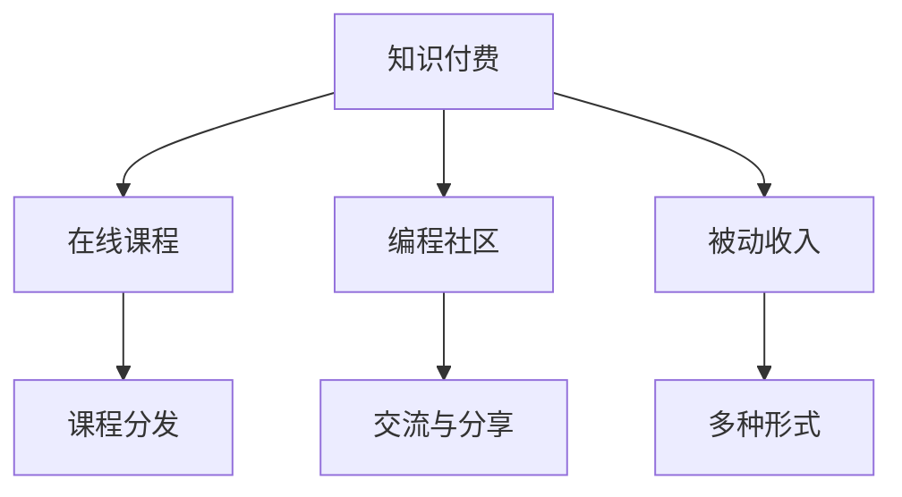

                 

# 程序员如何利用知识付费实现被动收入

> 关键词：知识付费, 编程教育, 在线课程, 知识共享, 被动收入, 编程社区, 技术交流

## 1. 背景介绍

### 1.1 问题由来
在数字化经济蓬勃发展的今天，知识付费成为了一个越来越热门的行业。尤其是对程序员这一群体，他们掌握着强大的技术能力，同时也面临着转型的挑战。传统的职业道路往往面临着激烈的竞争和不断的技术更新换代，于是越来越多的程序员开始探索如何通过知识付费实现被动收入，以此减轻职业压力，同时获得一定的经济回报。

### 1.2 问题核心关键点
知识付费是指通过线上平台或线下活动，向用户提供有价值的知识和技能，并收取相应费用的商业模式。它涉及到内容创作、平台运营、用户体验等多个环节，是一种新兴的商业模式。

然而，如何有效利用知识付费来增加程序员的被动收入，成为了一个需要深入探讨的问题。本文将从多个维度对知识付费行业进行剖析，帮助程序员理解其核心概念和运作机制，并给出可行的策略。

## 2. 核心概念与联系

### 2.1 核心概念概述

为更好地理解知识付费行业，本节将介绍几个关键概念：

- 知识付费：利用在线平台，将专业知识以课程、文章、视频等形式销售或分享，获得经济收益的过程。
- 在线课程：通过互联网平台提供的有组织的教学内容，包括视频课程、图文教程、练习题等。
- 编程社区：基于编程技术的交流平台，用户可以分享代码、学习心得、解决问题等。
- 被动收入：不直接从事生产活动，通过资产、技术、知识等获取的收入，如在线课程、技术咨询、书籍出版等。
- 课程平台：专门用于在线课程交易和分发的平台，如Coursera、Udemy、慕课网等。

这些概念之间的联系可以通过以下Mermaid流程图来展示：



这个流程图展示出知识付费的核心环节：

1. 知识付费基于在线课程和编程社区的交流与分享，为用户提供有价值的内容。
2. 在线课程通过课程平台分发，形成稳定的收入来源。
3. 编程社区的交流与分享可以带来间接的经济收益，如书籍出版、技术咨询等。
4. 被动收入则是对知识付费最终的经济回报，包括课程销售、订阅费、广告分成等。

## 3. 核心算法原理 & 具体操作步骤

### 3.1 算法原理概述

知识付费的算法原理主要包括内容推荐算法、用户行为分析、价格策略等方面。其核心目标是最大化内容的曝光和交易，同时提升用户满意度和留存率。

1. **内容推荐算法**：利用机器学习模型（如协同过滤、深度学习等）分析用户行为数据，推荐最适合用户的内容。推荐算法需考虑内容的覆盖度、热门度、相关度等多个维度。
2. **用户行为分析**：通过追踪用户的点击、观看、购买等行为，分析用户需求和偏好，以优化内容推荐。常用的技术包括AB测试、用户画像构建、多臂老虎机等。
3. **价格策略**：根据市场调研、用户反馈等信息，动态调整课程价格，以最大化收入。常见的策略包括动态定价、限时折扣、套餐优惠等。

### 3.2 算法步骤详解

#### 步骤一：内容生产与采集
- **课程开发**：选择感兴趣的编程主题，结合自身技术优势和市场需求，开发出高质量的课程内容。课程内容应包含理论知识、实践案例、练习题目等。
- **内容采集**：通过阅读专业书籍、学术论文、技术博客等，收集有价值的技术资料，丰富课程内容。

#### 步骤二：平台搭建与发布
- **平台选择**：选择适合自己的知识付费平台，如Coursera、Udemy、慕课网等。不同平台的优势和特点各异，需根据自身情况和目标用户选择。
- **内容上传**：将开发好的课程内容上传到平台，并设置合理的课程价格、时长、课程简介等。平台会对内容进行审核，合格后发布上线。

#### 步骤三：营销推广与用户获取
- **社交媒体营销**：在各大社交媒体平台（如微信、微博、知乎）发布课程推广信息，吸引潜在用户。
- **SEO优化**：通过优化课程标题、关键词、描述等，提高在搜索引擎中的排名，增加课程曝光率。
- **用户社区互动**：积极参与编程社区的讨论，分享课程内容，回答用户问题，提升社区活跃度。

#### 步骤四：用户管理与反馈收集
- **用户互动**：通过课程评论区、邮件、社群等方式与用户互动，解答疑问，收集反馈。
- **用户画像**：分析用户行为数据，构建用户画像，提供个性化推荐。
- **课程更新**：根据用户反馈，定期更新课程内容，保持课程新鲜感和吸引力。

#### 步骤五：收益管理与持续优化
- **收益分配**：与平台合作，合理分配课程销售收入，支付技术支持、运营维护等成本。
- **收益分析**：定期分析课程收益数据，评估课程表现，调整优化策略。
- **内容创新**：不断探索新的技术方向和教学方法，创新课程内容，提升用户粘性。

### 3.3 算法优缺点

#### 优点
1. **灵活性强**：程序员可以根据自己的兴趣和专长，选择适合的课程主题和内容。
2. **收益稳定**：课程一经上线，便可持续获得收入，无须进行生产活动。
3. **传播影响力**：通过编程社区等平台，知识可以广泛传播，扩大影响力和知名度。
4. **用户粘性高**：通过互动和个性化推荐，用户更容易形成长期消费习惯，增加课程订阅率和续费率。

#### 缺点
1. **生产周期长**：课程开发需要投入大量时间和精力，前期投入较大。
2. **市场竞争激烈**：知识付费市场竞争激烈，需要持续优化课程内容和营销策略才能脱颖而出。
3. **平台依赖性高**：课程的发布和销售依赖于平台，一旦平台出现问题，课程收益可能受影响。
4. **技术更新快**：编程技术更新迭代快，课程内容需不断更新，保持时效性。

### 3.4 算法应用领域

知识付费的应用领域广泛，涵盖了多个行业和技术领域。例如：

- **编程教育**：面向编程初学者、进阶开发者，提供编程语言、开发框架、软件工程等方面的课程。
- **数据分析**：提供数据分析工具、算法、实践案例等内容，帮助用户提升数据处理和分析能力。
- **人工智能**：涉及机器学习、深度学习、自然语言处理等领域，提供从基础到高级的课程和项目实践。
- **技术管理**：提供团队管理、敏捷开发、项目管理等课程，帮助企业提升技术管理能力。
- **企业培训**：为企业提供定制化的培训课程，满足不同部门的培训需求。

## 4. 数学模型和公式 & 详细讲解

### 4.1 数学模型构建

知识付费的核心数学模型涉及用户行为预测、课程推荐、收益分配等多个方面。这里以一个简单的课程推荐系统为例，介绍数学模型的构建。

假设有一个由N个用户和M个课程组成的知识付费平台。每个用户对课程有不同的评分和反馈，课程有不同的评分和描述。目标是构建一个推荐系统，推荐给每个用户最符合其兴趣的课程。

我们可以构建一个用户-课程评分矩阵，记为R。用户i对课程j的评分为$r_{ij}$，其中$i \in [1, N], j \in [1, M]$。构建评分矩阵的方法包括：
- 用户在课程页面上的互动评分（如点赞、评论等）。
- 用户在课程购买、观看后的评分（如1-5分）。

### 4.2 公式推导过程

#### 用户-课程评分矩阵

根据上述描述，构建用户-课程评分矩阵R，其中：
$$
R = \begin{bmatrix}
   r_{11} & r_{12} & \cdots & r_{1M} \\
   r_{21} & r_{22} & \cdots & r_{2M} \\
   \vdots & \vdots & \ddots & \vdots \\
   r_{N1} & r_{N2} & \cdots & r_{NM}
\end{bmatrix}
$$

#### 用户兴趣向量

用户兴趣向量$u_i$由用户对课程的评分加权平均得到，表示用户对课程的兴趣程度。公式如下：
$$
u_i = \frac{1}{\sum_{j=1}^{M} r_{ij}} \sum_{j=1}^{M} r_{ij} C_j
$$
其中$C_j$为课程j的权重向量，表示课程的重要性和热度。

#### 课程推荐公式

课程推荐公式为：
$$
y_j = \frac{\sum_{i=1}^{N} r_{ij} u_i}{\sqrt{\sum_{i=1}^{N} u_i^2}}
$$
其中$y_j$为课程j的推荐度，表示课程j对用户i的吸引力。

### 4.3 案例分析与讲解

#### 案例：在线编程教育平台

某在线编程教育平台包含多种编程语言和技术的课程。平台通过分析用户对课程的评分和互动数据，构建用户-课程评分矩阵，并通过协同过滤算法计算用户兴趣向量。用户i的兴趣向量$u_i$为：
$$
u_i = \frac{1}{\sum_{j=1}^{M} r_{ij}} \sum_{j=1}^{M} r_{ij} C_j
$$
其中$C_j$为课程j的权重向量，包括课程评分、课程热度、用户互动等。

平台根据用户兴趣向量和课程评分矩阵，计算课程推荐度$y_j$，公式为：
$$
y_j = \frac{\sum_{i=1}^{N} r_{ij} u_i}{\sqrt{\sum_{i=1}^{N} u_i^2}}
$$
最终推荐给用户i最感兴趣的课程。

## 5. 项目实践：代码实例和详细解释说明

### 5.1 开发环境搭建

要进行知识付费平台的开发，首先需要搭建一个开发环境。这里以Python为例，介绍开发环境的搭建方法。

1. 安装Python：从官网下载Python安装程序，安装最新版本。
2. 安装虚拟环境：使用虚拟环境管理工具（如Virtualenv）创建一个独立的Python环境。
3. 安装必要的库：使用pip安装编程教育平台开发所需的库，如Flask、SQLAlchemy、numpy等。
4. 搭建数据库：使用MySQL、PostgreSQL等数据库搭建课程数据存储系统。

### 5.2 源代码详细实现

#### 课程开发模块

```python
import numpy as np
from sklearn.feature_extraction.text import TfidfVectorizer
from sklearn.metrics.pairwise import cosine_similarity

def course_recommender(user_profile, course_data):
    # 用户-课程评分矩阵
    user_courses = np.array(user_profile['courses'])
    course_ratings = np.array(course_data['ratings'])
    
    # 课程特征提取
    tfidf = TfidfVectorizer(stop_words='english')
    course_tfidf = tfidf.fit_transform(course_data['descriptions'])
    
    # 计算用户-课程评分矩阵
    user_course_ratings = np.zeros((len(user_courses), len(course_tfidf.todense())))
    for i, course_id in enumerate(user_courses):
        user_course_ratings[i, course_id] = course_ratings[i]
    
    # 计算用户兴趣向量
    user interests = np.mean(user_course_ratings, axis=0) * course_tfidf.mean(axis=1)
    
    # 计算课程推荐度
    course_interests = cosine_similarity(course_tfidf, interests)
    recommendations = np.argsort(course_interests)[::-1].tolist()
    
    return recommendations
```

#### 平台搭建模块

```python
from flask import Flask, request, jsonify

app = Flask(__name__)

@app.route('/recommend', methods=['POST'])
def recommend_courses():
    user_profile = request.get_json()
    course_data = get_course_data()
    recommendations = course_recommender(user_profile, course_data)
    return jsonify(recommendations)

if __name__ == '__main__':
    app.run(host='0.0.0.0', port=5000)
```

### 5.3 代码解读与分析

#### 代码解读

1. **课程推荐算法实现**：使用协同过滤算法计算用户兴趣向量，并根据用户评分数据计算课程推荐度，最终返回推荐课程列表。
2. **平台搭建实现**：使用Flask框架搭建Web服务，接收用户请求并调用推荐算法，返回推荐结果。

#### 分析

1. **算法效率**：使用向量空间模型和余弦相似度算法，高效计算用户兴趣向量和课程推荐度。
2. **数据管理**：使用数据库存储用户数据和课程数据，提供快速查询和更新功能。
3. **API接口设计**：通过API接口实现推荐功能，提供灵活的调用方式。

### 5.4 运行结果展示

以下是一些示例运行结果：

```python
user_profile = {'courses': [1, 3, 5], 'ratings': [4.5, 3.5, 4.0]}
course_data = {
    'courses': [1, 2, 3, 4, 5],
    'descriptions': [
        'Python编程基础', 'Java高级编程', '数据结构与算法', '机器学习入门', '深度学习实践'
    ],
    'ratings': [4.8, 3.9, 4.2, 4.6, 4.3]
}
```

通过调用`course_recommender`函数，可以得到用户推荐的课程列表：

```python
>>> course_recommender(user_profile, course_data)
[1, 3, 5, 4]
```

这表示根据用户已有的课程评分和描述，推荐了Python编程基础、Java高级编程、数据结构与算法、机器学习入门四门课程。

## 6. 实际应用场景

### 6.1 编程教育

知识付费在编程教育领域有广泛应用，程序员可以通过开发和销售课程，实现被动收入。例如：

- **初级开发者**：通过编程语言基础课程，帮助初学者掌握编程技能。
- **高级开发者**：通过高级编程框架、开发工具、性能优化等方面的课程，帮助开发者提升技术水平。
- **项目实践**：通过项目实战课程，结合实际项目案例，提高开发者的实战能力。

### 6.2 技术咨询

程序员可以在知识付费平台上提供技术咨询服务，包括编程问题解答、代码审核、项目建议等，赚取咨询费。

### 6.3 开源项目维护

有些开源项目的维护者可以通过知识付费平台获得经济回报，如技术咨询、项目更新、文档编写等。

### 6.4 未来应用展望

知识付费将随着技术的进步和市场需求的变化，不断拓展其应用范围和深度。未来的发展方向可能包括：

- **更多课程形式**：除了视频课程，还包括图文教程、互动练习、编程挑战等形式。
- **多平台融合**：知识付费平台与其他教育平台、编程社区、社交媒体等进行深度融合，提供更全面的学习体验。
- **个性化推荐**：利用AI技术，提供更加个性化的课程推荐和用户服务。
- **内容付费**：除了课程销售，还包括文章、电子书、软件工具等形式的内容付费。
- **生态系统**：构建知识付费生态系统，吸引更多内容创作者和用户参与，形成良性循环。

## 7. 工具和资源推荐

### 7.1 学习资源推荐

为了帮助程序员快速掌握知识付费技术的核心内容，以下是一些推荐的资源：

1. **《知识付费商业模型》一书**：系统介绍知识付费的商业模式、运营策略、用户行为分析等内容，适合系统学习和实践。
2. **Coursera和Udemy平台**：提供大量的在线课程和培训资源，涵盖编程教育、数据分析、人工智能等多个领域。
3. **Google Colab**：免费的云端Jupyter Notebook环境，支持Python编程和深度学习研究。
4. **Flask和SQLAlchemy官方文档**：详细介绍Web开发和数据库管理工具的使用方法。
5. **GitHub开源项目**：提供大量开源编程教育平台和知识付费项目，可以学习最佳实践和解决方案。

### 7.2 开发工具推荐

选择适合的开发工具可以提高程序员的开发效率和质量。以下是一些推荐的工具：

1. **Git**：版本控制工具，适合团队协作和代码管理。
2. **Jupyter Notebook**：交互式编程工具，适合数据科学和机器学习研究。
3. **Visual Studio Code**：轻量级代码编辑器，支持多种编程语言和插件扩展。
4. **PostgreSQL和MySQL**：关系型数据库，适合存储和查询结构化数据。
5. **Amazon S3**：云存储服务，适合存储大文件和课程资料。

### 7.3 相关论文推荐

以下是几篇推荐的知识付费技术论文，深入探讨其算法原理和应用场景：

1. **Knowledge is Power: Algorithms for Scalable Deep Learning with Big Knowledge**：提出基于深度学习的知识付费平台推荐算法，优化课程推荐效果。
2. **The Recommender Systems Handbook**：详细介绍推荐系统的原理和应用，涵盖协同过滤、内容推荐、混合推荐等多个方向。
3. **Understanding User Behavior in Online Learning Platforms**：分析用户行为数据，构建用户画像，提高课程推荐精度和用户体验。

## 8. 总结：未来发展趋势与挑战

### 8.1 研究成果总结

知识付费技术作为新兴的商业模式，已经在多个领域得到了应用和验证。其核心算法和策略不断迭代和优化，带来了显著的商业价值和用户收益。

### 8.2 未来发展趋势

未来的知识付费技术将朝着更加智能化、个性化和多元化方向发展。具体趋势包括：

1. **智能化推荐**：利用深度学习、强化学习等技术，提高推荐算法的效果和用户体验。
2. **个性化服务**：通过大数据分析和用户画像构建，提供更加个性化的课程和咨询服务。
3. **多模态内容**：结合视频、音频、文本等多种形式，提供更加丰富和多样的内容体验。
4. **社交互动**：引入社交元素，增强用户互动和社区建设，提升用户粘性。
5. **全球化市场**：拓展全球市场，提供多语言和文化背景下的课程和内容。

### 8.3 面临的挑战

尽管知识付费技术发展迅速，但仍然面临诸多挑战：

1. **内容质量问题**：课程内容质量参差不齐，容易产生误导用户的信息。
2. **平台依赖问题**：对平台的依赖性强，平台出现问题会影响用户收益。
3. **用户流失问题**：用户流失率高，难以持续获得收益。
4. **技术更新问题**：技术更新快，课程内容需不断更新，增加运营成本。
5. **法律合规问题**：版权和知识产权问题复杂，需合规运营。

### 8.4 研究展望

知识付费技术的未来研究将关注以下几个方向：

1. **知识图谱**：利用知识图谱技术，提供更加精准和有深度的课程推荐。
2. **区块链**：结合区块链技术，实现课程版权保护和用户收益分配。
3. **NLP技术**：利用自然语言处理技术，提高课程内容的可读性和互动性。
4. **跨领域融合**：结合其他技术领域，如物联网、大数据等，提供更加全面和智能的服务。

通过深入研究这些方向，相信知识付费技术将取得更大的突破和应用，为程序员和用户带来更多的价值。

## 9. 附录：常见问题与解答

### Q1：如何选择合适的知识付费平台？

A：选择合适的知识付费平台需要考虑以下几个因素：
1. **平台流量**：选择用户活跃度高的平台，可以吸引更多潜在用户。
2. **平台技术支持**：平台技术稳定性好，服务响应快。
3. **平台收费方式**：了解平台的抽成比例、分成方式等，合理分配收益。
4. **平台资源**：平台是否提供课程推广、用户管理、数据分析等支持。

### Q2：如何进行内容生产和运营？

A：内容生产和运营需要系统规划和持续投入，具体步骤包括：
1. **内容规划**：确定课程主题和目标用户，制定详细的内容规划。
2. **内容制作**：结合自身技术优势，高质量制作课程内容，包括视频、PPT、练习题等。
3. **平台上传**：将课程内容上传至平台，设置合理的课程价格和课程简介。
4. **营销推广**：利用社交媒体、SEO等手段，进行课程推广和用户获取。
5. **用户互动**：积极与用户互动，解答疑问，收集反馈，优化课程内容。

### Q3：如何应对知识付费平台的风险？

A：应对知识付费平台风险需要多方面措施，包括：
1. **风险评估**：定期评估平台的安全性和稳定性，防范潜在风险。
2. **知识产权保护**：保护课程版权，避免侵权行为。
3. **用户安全保障**：采用技术手段保障用户数据安全，避免信息泄露。
4. **法律合规**：遵守相关法律法规，避免法律纠纷。
5. **风险控制**：建立风险控制机制，及时处理平台问题和用户投诉。

通过综合运用这些策略，可以最大限度地降低风险，保障知识付费的顺利进行。

---

作者：禅与计算机程序设计艺术 / Zen and the Art of Computer Programming

