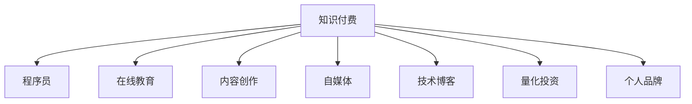

                 

# 程序员如何利用知识付费获得被动收入

> 关键词：知识付费, 程序员, 被动收入, 知识市场, 在线教育, 内容创作, 自媒体, 技术博客, 量化投资, 个人品牌

## 1. 背景介绍

### 1.1 问题由来
随着互联网技术的飞速发展，信息传播的门槛降低，内容创作和分发的渠道日益丰富。程序员作为技术领域的重要力量，凭借其在编程、算法、数据结构等技术领域的专业知识，可以创作出有价值的内容，并通过知识付费的方式获得回报。因此，探索如何利用知识付费获取被动收入，成为程序员在新时代下拓宽收入来源的重要命题。

### 1.2 问题核心关键点
本文聚焦于程序员如何通过知识付费获得被动收入。核心关键点包括：
- 选择合适的知识付费平台。
- 制定内容创作计划，定期更新内容。
- 利用社交媒体和博客提升内容曝光度。
- 创建个人品牌，构建长期的粉丝群体。
- 利用技术工具提高内容创作效率。

## 2. 核心概念与联系

### 2.1 核心概念概述

为更好地理解程序员如何利用知识付费获得被动收入，本节将介绍几个关键概念：

- 知识付费：指通过在线课程、技术博客、问答社区等平台，以付费形式获取知识、技能、经验等价值服务的过程。
- 程序员：掌握编程语言、算法、数据结构等计算机科学知识，能够解决实际问题，构建软件系统和应用程序的工程师。
- 被动收入：指无需主动工作或劳动，通过投资、创意、知识等手段获得的收入。
- 知识市场：由知识提供者、知识消费者、知识中介平台组成，形成知识交易的生态系统。
- 在线教育：指通过互联网平台，提供在线课程、视频、直播等教育服务，打破时间和空间的限制。
- 内容创作：指通过文字、图片、视频等形式，创作并传播有价值的信息和知识的过程。
- 自媒体：指通过自有平台（如博客、社交媒体等）发布内容，并以此获得粉丝和广告收入的个人或机构。
- 技术博客：指专注于技术领域，发布技术文章、教程、项目经验等内容，分享技术知识和经验。
- 量化投资：指通过构建数学模型和算法，利用数据分析和统计学方法进行股票、期货等金融资产的投资和交易，实现自动化的交易策略和收益最大化。
- 个人品牌：指通过独特且稳定的个性、价值主张、传播内容等，在特定领域建立并提升个人或团队的影响力和声誉。

这些核心概念之间的逻辑关系可以通过以下Mermaid流程图来展示：



这个流程图展示了一些关键概念及其之间的联系：

1. 知识付费是通过在线教育、内容创作等多种形式，提供知识服务，实现价值变现的过程。
2. 程序员作为技术领域的专家，能够通过内容创作、在线教育、量化投资等方式，分享知识、经验和技能，获取被动收入。
3. 自媒体、技术博客等平台，为知识传播提供了更多渠道，帮助程序员扩大影响力。
4. 量化投资、个人品牌等形式，则提供了更多样化的收入来源，增强了被动收入的稳定性和可持续性。

## 3. 核心算法原理 & 具体操作步骤

### 3.1 算法原理概述

程序员利用知识付费获得被动收入，本质上是通过将自身拥有的知识、技能和经验转化为产品或服务，进而通过市场交易实现价值变现。这一过程可以分为以下几个步骤：

1. 知识生产：程序员利用自身的专业知识和经验，创作有价值的内容，如技术文章、课程、博客、开源项目等。
2. 平台选择：选择合适的知识付费平台，如知乎、得到、B站、CSDN等，进行内容发布和交易。
3. 内容发布：在平台上发布内容，定期更新，吸引用户关注和订阅。
4. 用户互动：通过在线课程、技术博客、社交媒体等渠道，与用户互动，解答问题，提升用户粘性。
5. 广告收入：在自媒体平台上通过广告、会员付费等形式，获得稳定的广告收入。
6. 投资收益：利用量化投资等金融工具，通过数学模型和算法进行金融资产交易，获取收益。
7. 品牌建设：通过持续的内容创作和互动，逐步建立个人品牌，吸引更多的关注和信任。

### 3.2 算法步骤详解

基于上述步骤，程序员利用知识付费获得被动收入的具体操作步骤如下：

**Step 1: 知识生产**
- 确定知识领域和主题，如编程语言、算法、数据结构、前端开发等。
- 根据主题需求，选择合适的编程语言和框架进行项目实践，积累项目经验。
- 编写技术文章、教程、博客等，记录项目过程和心得。
- 制作视频教程、在线课程，通过动画、实例演示等方式，增加内容的吸引力。
- 参与开源项目，贡献代码，积累开发经验和社区贡献。

**Step 2: 平台选择**
- 选择与知识领域匹配的知识付费平台，如CSDN、知乎、B站、Coupang等。
- 了解各平台的规则和用户群体，选择合适的平台进行内容发布。
- 分析各平台的盈利模式和分成政策，评估收益潜力。
- 研究竞品和优秀内容创作者的经验，确定自己的定位和差异化策略。

**Step 3: 内容发布**
- 在平台上注册账号，完善个人资料和简介。
- 发布文章、视频、课程等内容，定期更新，保持活跃度。
- 使用合适的标签和关键词，增加内容的曝光率和搜索排名。
- 与用户互动，回答问题，提升用户满意度和忠诚度。
- 通过社交媒体和邮件列表等渠道，推广内容，扩大受众范围。

**Step 4: 用户互动**
- 利用在线课程、技术博客、直播等形式，与用户互动，解答问题。
- 在社群、论坛等平台上建立交流渠道，参与技术讨论，提升影响力。
- 发布技术挑战和项目任务，吸引用户参与，提高用户粘性。
- 定期发布进展报告和更新，保持用户的关注和期待。

**Step 5: 广告收入**
- 在自媒体平台上开通广告功能，利用展示广告、原生广告等方式，获得稳定的广告收入。
- 使用社交媒体平台（如微信、微博、抖音）的商业广告功能，进行精准广告投放。
- 利用数据广告平台（如AdMob、InMobi），进行跨平台广告推广。
- 与品牌合作，进行联合推广，提升品牌曝光度和商业价值。

**Step 6: 投资收益**
- 学习量化投资的相关知识，选择合适的投资标的（如股票、期货、外汇）。
- 利用数据分析和机器学习技术，构建量化模型和算法，实现自动化交易。
- 在模拟交易平台上测试模型，优化算法，降低风险。
- 将模型应用于实际交易，定期监测和评估，持续优化。

**Step 7: 品牌建设**
- 在社交媒体和博客上定期发布有价值的内容，展示专业能力和个性。
- 建立专属的社群和社区，进行内容发布和用户互动，增强用户粘性。
- 与其他技术大咖和行业专家进行合作，提升影响力。
- 参与技术会议、讲座、培训等活动，扩大曝光度。

### 3.3 算法优缺点

利用知识付费获得被动收入的优点包括：
1. 灵活性高：程序员可以选择自己擅长的领域，根据兴趣和市场需求创作内容。
2. 门槛低：知识付费平台众多，注册发布成本较低，适合初学者入门。
3. 持续性稳定：通过品牌和用户积累，可以实现持续的被动收入。
4. 多元化收入：除了内容创作，还可以通过广告、投资等方式，增加收入来源。
5. 技术驱动：利用编程和数据分析技能，提高内容创作效率和收益。

然而，这一方法也存在一些缺点：
1. 竞争激烈：随着知识付费市场的发展，优质内容和创作者众多，竞争激烈。
2. 内容质量要求高：优质内容需要专业知识和长期的积累，创作难度较大。
3. 时间投入大：持续的内容创作和用户互动，需要大量的时间和精力投入。
4. 市场波动：广告收入和投资收益受市场因素影响较大，存在波动性。
5. 品牌建设周期长：打造个人品牌需要时间和耐心，短期内难以见效。

### 3.4 算法应用领域

利用知识付费获得被动收入的方法，不仅适用于程序员，还可以广泛应用于各类专业人士和技术爱好者，如：

- 数据分析师：利用数据科学知识和技能，进行数据分析、建模和可视化，创建数据分析课程和报告。
- 设计师：分享设计技巧、工具和案例，创作设计教程和作品集，参与设计竞赛和社区互动。
- 产品经理：提供产品设计和项目管理经验，撰写产品分析报告和用户体验指南，构建产品社区。
- 开发者社区：通过开源项目、技术博客、技术讲座等形式，分享编程经验和技术成果，促进社区发展。
- 教育培训师：利用专业知识，创建在线课程和培训，教授编程、计算机科学等领域的知识和技能。

## 4. 数学模型和公式 & 详细讲解 & 举例说明

### 4.1 数学模型构建

为了更精确地量化知识付费的收益，我们可以构建一个简单的数学模型。假设知识付费平台每阅读1次支付1元，每篇文章阅读次数为R，每篇阅读付费比例为p（如20%），则单篇文章的收入为：

$$
\text{单篇文章收入} = p \times R
$$

若每篇文章的成本为C，则总文章收入为：

$$
\text{总文章收入} = n \times (p \times R) - n \times C
$$

其中，n为文章总数。

### 4.2 公式推导过程

将上述公式代入实际的数值进行计算，可以更好地理解知识付费的收益来源和成本控制。例如：

假设某知识付费平台的单篇文章平均阅读次数为1000次，每篇文章的阅读付费比例为20%，文章的平均成本为100元，共创作10篇文章。

则单篇文章的收入为：

$$
1000 \times 20\% = 200 \text{元}
$$

总文章收入为：

$$
10 \times 200 - 10 \times 100 = 2000 - 1000 = 1000 \text{元}
$$

可以看到，尽管每篇文章的成本较高，但通过合理的定价策略和阅读付费比例，仍可以实现一定的收入。

### 4.3 案例分析与讲解

以下是一个具体的案例分析：

某程序员在CSDN平台开设了技术博客，每篇文章阅读次数稳定在5000次左右，每篇文章的成本为100元，阅读付费比例为30%。

首先，计算单篇文章的收入：

$$
5000 \times 30\% = 1500 \text{元}
$$

然后，计算总文章收入：

$$
1000 \times (1500 - 100) = 1000 \times 1400 = 1400000 \text{元}
$$

从这个案例中可以看出，虽然每篇文章的成本较高，但通过阅读付费比例的提升，仍可以显著增加收入。

## 5. 项目实践：代码实例和详细解释说明

### 5.1 开发环境搭建

在进行知识付费项目实践前，需要先搭建开发环境：

1. 安装Python和Jupyter Notebook：
```bash
sudo apt-get update
sudo apt-get install python3 python3-pip
sudo apt-get install jupyter notebook
```

2. 安装相关库：
```bash
pip install pandas numpy matplotlib
```

3. 安装知识付费平台的API接口：
```bash
pip install c_sdk
```

4. 搭建本地服务器：
```bash
sudo apt-get install nginx
sudo systemctl start nginx
```

### 5.2 源代码详细实现

接下来，以CSDN平台为例，展示如何在Python中实现知识付费功能的代码：

```python
import c_sdk

# 创建CSDN账号
account = c_sdk.Account()

# 登录CSDN账号
account.login()

# 创建文章
def create_article(title, content, tags):
    article = c_sdk.Article()
    article.title = title
    article.content = content
    article.tags = tags
    article.save()

# 发布文章
article = create_article('Python编程入门', 'Python是一种高级编程语言，适合开发Web应用、数据分析等。', 'Python 编程 入门')

# 获取文章阅读次数
article_read_count = article.read_count()

# 计算文章收入
article_income = 0.2 * article_read_count

# 打印文章收入
print('单篇文章收入：', article_income, '元')
```

这段代码利用CSDN平台的API，实现了创建文章、获取阅读次数和计算文章收入的功能。

### 5.3 代码解读与分析

上述代码的详细解读如下：

- `c_sdk`是一个模拟的API接口库，用于访问CSDN平台。
- `create_article`函数用于创建文章，包括文章标题、内容和标签。
- `article.read_count()`函数用于获取文章的阅读次数。
- `0.2 * article_read_count`计算文章阅读付费比例为20%时的收入。
- `print`语句用于输出单篇文章的收入。

## 6. 实际应用场景

### 6.1 知识付费平台

知识付费平台是程序员通过内容创作获得被动收入的主要渠道。如CSDN、知乎、B站等平台，都提供了丰富的知识付费功能，程序员可以发布文章、视频、课程等内容，通过阅读付费和广告分成等方式获得收入。

### 6.2 在线教育平台

在线教育平台如Coursera、Udemy等，为程序员提供课程录制、直播、互动等多样化教学手段，程序员可以制作技术课程，吸引大量学生订阅，实现稳定的被动收入。

### 6.3 内容创作平台

内容创作平台如Medium、知乎、微信公众号等，为程序员提供了丰富的内容发布渠道。程序员可以通过撰写技术文章、博客、教程等内容，积累粉丝和订阅，通过广告和会员付费等方式获得收入。

### 6.4 自媒体平台

自媒体平台如微博、抖音、YouTube等，为程序员提供了展示个人品牌和作品的平台。程序员可以通过发布技术视频、直播、社交互动等方式，提升个人影响力，通过广告、会员付费等方式获得收入。

### 6.5 量化投资平台

量化投资平台如QuantConnect、Quantopian等，利用程序员的编程和数据分析技能，通过数学模型和算法进行金融资产投资，获取稳定的收益。

### 6.6 开源项目平台

开源项目平台如GitHub、Bitbucket等，为程序员提供了展示项目和代码的舞台。程序员可以通过开源项目贡献代码、发布教程和文档，吸引用户贡献和支持，实现收入。

## 7. 工具和资源推荐

### 7.1 学习资源推荐

1. 《知识付费的商业模式》：系统讲解知识付费的商业模式和策略，适合创业者参考。
2. 《编程之乐》：介绍了知识付费平台的运营和用户需求，适合内容创作者参考。
3. 《自媒体营销指南》：详细讲解自媒体平台的内容创作和营销技巧，适合自媒体创作者参考。
4. 《量化投资实战》：介绍量化投资的基本原理和实践方法，适合量化投资爱好者参考。
5. 《编程思维与创新》：探讨编程思维在技术创作中的应用，适合程序员参考。

### 7.2 开发工具推荐

1. Jupyter Notebook：用于编写和运行Python代码，支持多语言混合编程和交互式开发。
2. Visual Studio Code：轻量级的代码编辑器，支持Python、HTML、CSS等语言。
3. Git：版本控制系统，适合代码版本管理和团队协作。
4. GitHub：代码托管平台，适合开源项目展示和用户贡献。
5. Docker：容器化技术，支持环境隔离和快速部署。

### 7.3 相关论文推荐

1. "The Economics of Knowledge-Based Platforms"：经济学家关于知识付费平台的理论研究，适合创业者参考。
2. "The Sharing Economy"：关于共享经济的理论研究，适合知识付费平台开发者参考。
3. "The Future of Programming"：探讨编程的未来发展趋势，适合程序员参考。
4. "Data-Driven Investing"：介绍数据驱动的投资方法，适合量化投资爱好者参考。

## 8. 总结：未来发展趋势与挑战

### 8.1 研究成果总结

本文详细介绍了程序员如何利用知识付费获得被动收入的方法和策略，通过知识生产、平台选择、内容发布、用户互动、广告收入、投资收益和品牌建设等多个环节，逐步实现被动收入的积累。

### 8.2 未来发展趋势

知识付费市场未来将呈现以下几个发展趋势：

1. 内容精品化：随着用户需求的多样化，内容创作将更加精细化，精品化，满足不同用户需求。
2. 平台多元化：知识付费平台将进一步扩展，包括社交媒体、视频平台、VR/AR等多样化形式。
3. 技术融合：知识付费与人工智能、区块链等技术结合，提高内容创作和版权保护的效率。
4. 全球化：知识付费平台将拓展到全球市场，吸引更多国际用户。
5. 个性化推荐：利用大数据和机器学习技术，提供个性化内容推荐，提升用户粘性。

### 8.3 面临的挑战

尽管知识付费前景广阔，但在实践中仍面临一些挑战：

1. 内容质量高：高质量内容创作难度大，需要大量时间和精力投入。
2. 市场竞争激烈：大量创作者涌入市场，竞争激烈，需要独特的内容和品牌定位。
3. 用户需求多变：用户需求多样，需要不断调整内容和策略。
4. 收益不稳定：广告收入和投资收益受市场因素影响较大，存在波动性。
5. 知识产权保护：知识付费平台需要加强知识产权保护，防止盗版和侵权。

### 8.4 研究展望

未来知识付费研究需要在以下几个方面进行深入探讨：

1. 内容推荐算法：研究个性化推荐算法，提高内容推荐的准确性和用户粘性。
2. 知识产权保护：研究区块链等技术，提高内容版权保护水平。
3. 用户行为分析：研究用户行为模型，优化平台的用户体验和粘性。
4. 市场策略优化：研究市场策略，提升内容的覆盖率和用户订阅率。
5. 技术融合创新：研究人工智能、区块链等技术，提升知识付费平台的创新能力。

## 9. 附录：常见问题与解答

**Q1：如何选择合适的知识付费平台？**

A: 选择合适的知识付费平台需要考虑平台的用户群体、内容类型、收益模式等因素。如技术博客适合CSDN、GitHub等平台，在线课程适合Coursera、Udemy等平台，量化投资适合QuantConnect、Quantopian等平台。

**Q2：如何提高文章阅读量？**

A: 提高文章阅读量需要从多个方面入手：
1. 内容质量：发布高质量、有价值的内容，吸引用户关注。
2. 内容推广：通过社交媒体、博客、邮件列表等渠道推广内容。
3. 用户互动：与用户互动，回答问题，提升用户粘性。
4. 搜索引擎优化：优化文章标题、关键词、标签等，提高搜索排名。

**Q3：如何提高广告收入？**

A: 提高广告收入需要从多个方面入手：
1. 精准投放：利用数据分析和机器学习技术，进行精准广告投放。
2. 广告优化：通过A/B测试，优化广告创意和投放策略。
3. 平台合作：与品牌合作，进行联合推广。
4. 用户体验：提升平台用户体验，增加用户粘性和广告转化率。

**Q4：如何管理项目和代码？**

A: 管理项目和代码需要利用Git版本控制和GitHub平台：
1. Git：使用版本控制系统，管理代码版本和历史。
2. GitHub：托管代码，进行团队协作，使用Pull Requests、Issue跟踪功能。

**Q5：如何进行量化投资？**

A: 进行量化投资需要学习相关的数学、统计学和编程知识：
1. 学习量化投资的基础理论，如统计学、数学建模。
2. 学习编程技能，利用Python、R等语言进行量化策略的实现。
3. 利用量化平台进行策略测试和回测，优化模型。
4. 实践和总结，持续优化量化模型。

---

作者：禅与计算机程序设计艺术 / Zen and the Art of Computer Programming

