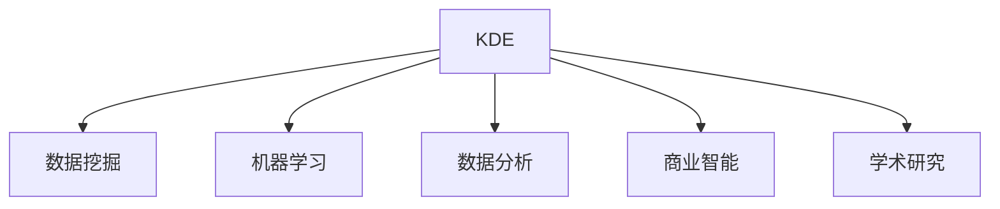

                 

# 程序员如何利用知识发现引擎提高学习成果

> 关键词：知识发现引擎(Knowledge Discovery Engine, KDE), 学习成果, 数据分析, 机器学习, 数据挖掘, 学术研究, 商业应用

## 1. 背景介绍

在当今信息爆炸的时代，知识的获取、处理和应用已经成为了人们生活和工作中的重要组成部分。程序员作为信息技术领域的关键人才，不仅需要掌握先进的编程语言和算法，还需要具备强大的数据分析和知识发现能力，以应对复杂多变的应用需求。知识发现引擎(KDE)作为一种高效的数据分析和机器学习工具，能够在海量数据中挖掘出潜在的模式和关联，辅助程序员快速获取知识、提升技能、优化决策，从而提高学习成果和效率。本文将详细介绍KDE的核心原理、操作步骤，以及其在学术研究和商业应用中的广泛应用。

## 2. 核心概念与联系

### 2.1 核心概念概述

为更好地理解知识发现引擎在提高学习成果中的应用，本节将介绍几个密切相关的核心概念：

- **知识发现引擎(KDE)**：是一种集成数据库技术和数据挖掘技术的数据分析工具，能够从大量数据中自动发现有用的模式、规则和知识。KDE包括了一系列的数据预处理、分类、聚类、关联分析等算法。

- **数据挖掘(Data Mining)**：是从大量数据中自动发现有用模式和知识的过程，是知识发现的重要组成部分。数据挖掘技术包括分类、聚类、关联规则、异常检测等。

- **机器学习(Machine Learning)**：是一种通过数据训练模型来自动化决策和预测的过程，是知识发现的重要手段。机器学习包括监督学习、无监督学习、强化学习等。

- **数据分析(Analytics)**：是从数据中提取有价值信息和洞察的过程，数据分析能够帮助用户理解数据背后的含义，辅助决策和优化。

- **商业智能(Business Intelligence, BI)**：是通过数据可视化、报表生成等技术手段，将数据分析结果呈现给管理决策者的过程。BI是知识发现的重要应用领域之一。

- **学术研究**：通过KDE挖掘出的知识，能够帮助学术研究人员发现新的研究问题和方向，推动学科发展。

这些核心概念之间的逻辑关系可以通过以下Mermaid流程图来展示：



这个流程图展示的知识发现引擎与其他概念的关联关系：

1. KDE融合了数据挖掘和机器学习技术，能够从大量数据中提取知识。
2. 数据分析和商业智能都是知识发现的重要应用领域。
3. 学术研究则展示了知识发现的学术价值。

## 3. 核心算法原理 & 具体操作步骤

### 3.1 算法原理概述

知识发现引擎的核心思想是通过机器学习算法，从大量数据中自动发现有用的模式和知识。其核心原理包括以下几个步骤：

1. **数据预处理**：包括数据清洗、数据转换、数据归一化等，保证数据的质量和一致性。
2. **特征选择和提取**：从原始数据中提取有用的特征，减少维度，提高算法的效率和准确性。
3. **模型训练**：选择适当的机器学习算法，如分类、聚类、关联规则等，对数据进行训练，得到模型。
4. **模式发现**：通过训练好的模型，自动发现数据中的模式和知识，生成报表和分析结果。

### 3.2 算法步骤详解

知识发现引擎的操作步骤主要包括：

**Step 1: 数据收集与预处理**
- 收集需要进行知识发现的原始数据，包括结构化数据（如数据库中的表格）和非结构化数据（如文本、图像等）。
- 对数据进行清洗、转换和归一化，保证数据的质量和一致性。

**Step 2: 特征选择和提取**
- 根据具体任务，选择合适的特征进行提取。如对于文本数据，可以提取词频、TF-IDF、词向量等特征。
- 使用特征选择算法，如LDA、PCA等，进一步筛选出最重要的特征，减少数据维度。

**Step 3: 模型选择与训练**
- 根据任务类型，选择合适的机器学习算法，如决策树、随机森林、神经网络等。
- 使用训练集对模型进行训练，优化模型参数，使其能够更好地拟合数据。

**Step 4: 模式发现与分析**
- 对测试集进行预测，发现数据中的模式和关联。
- 生成可视化报表和分析结果，帮助用户理解数据背后的含义。

**Step 5: 应用部署与优化**
- 将知识发现引擎应用于实际场景，如商业智能系统、学术研究等。
- 根据反馈和实际效果，持续优化算法和模型，提高发现知识的质量和效率。

### 3.3 算法优缺点

知识发现引擎在提高学习成果方面具有以下优点：

1. **高效性**：能够自动从大量数据中发现有用的模式和知识，提高发现知识的效率。
2. **准确性**：通过机器学习算法，能够准确发现数据中的规律和关联，减少人为干预。
3. **灵活性**：可以应用于各种数据分析任务，如分类、聚类、关联分析等，适应性强。
4. **自动化**：减少了手动数据处理和特征选择的步骤，使得知识发现过程更加自动化。

同时，知识发现引擎也存在一些局限性：

1. **数据质量要求高**：知识发现的结果依赖于数据的质量和完整性，数据质量差会严重影响结果的准确性。
2. **算法复杂度高**：一些复杂的机器学习算法，如神经网络、深度学习等，对计算资源要求较高。
3. **结果解释困难**：自动发现的规律和知识，有时难以解释其背后的原因和逻辑。
4. **应用场景限制**：对于一些特定领域的数据，可能缺乏相应的算法和模型，难以进行有效的知识发现。

尽管存在这些局限性，但知识发现引擎仍然是提高学习成果的重要工具，尤其在处理大规模数据和复杂分析任务时，具有不可替代的优势。

### 3.4 算法应用领域

知识发现引擎已经在多个领域得到了广泛的应用，包括但不限于：

- **商业智能**：通过分析企业运营数据，帮助企业发现市场趋势、客户行为、销售机会等，提升决策效率和效果。
- **金融分析**：通过挖掘金融市场数据，发现股票价格波动、信用风险等，辅助投资决策和风险控制。
- **健康医疗**：通过分析医疗数据，发现疾病特征、药物疗效等，辅助医生诊断和治疗。
- **市场营销**：通过分析消费者行为数据，发现消费趋势、市场细分等，指导产品设计和推广策略。
- **供应链管理**：通过分析供应链数据，发现供应链瓶颈、物流优化等，提高供应链效率。

## 4. 数学模型和公式 & 详细讲解 & 举例说明

### 4.1 数学模型构建

知识发现引擎的数学模型主要涉及以下几个方面：

- **数据预处理**：包括数据清洗、数据转换、数据归一化等，使用基本的数学公式进行数据预处理。
- **特征选择和提取**：通过统计学和数学方法，选择和提取特征。如TF-IDF、词向量等。
- **机器学习模型**：包括分类、聚类、关联规则等模型，使用数学公式进行训练和预测。

### 4.2 公式推导过程

以下我们以分类任务为例，推导随机森林模型的公式：

假设训练集为 $\{(x_i,y_i)\}_{i=1}^N$，其中 $x_i$ 为输入特征，$y_i$ 为输出标签。随机森林模型由多个决策树组成，每个决策树通过以下公式训练：

$$
f(x) = \sum_{k=1}^K \alpha_k f_k(x)
$$

其中 $f_k(x)$ 为第 $k$ 棵决策树的预测结果，$\alpha_k$ 为每个决策树的权重，可以通过交叉验证等方法求得。

具体而言，决策树的训练过程包括：

1. 从训练集中随机选择 $m$ 个样本，作为子树的训练集。
2. 从特征集中随机选择 $n$ 个特征，作为子树的特征集。
3. 根据子集 $(x,y)$ 构建决策树 $f_k(x)$。
4. 对测试集进行预测，计算预测误差。
5. 通过交叉验证等方法，求得每个决策树的权重 $\alpha_k$。

### 4.3 案例分析与讲解

假设我们有一份包含客户购买行为的数据集，使用知识发现引擎进行分类预测。具体步骤如下：

1. **数据预处理**：清洗数据，去除缺失值，对数值型数据进行归一化。
2. **特征选择和提取**：选择客户年龄、性别、购买金额等特征，计算词频、TF-IDF等特征。
3. **模型选择与训练**：选择随机森林模型，使用训练集进行训练，优化参数。
4. **模式发现与分析**：对测试集进行预测，生成可视化报表，分析不同特征对预测结果的影响。

## 5. 项目实践：代码实例和详细解释说明

### 5.1 开发环境搭建

在进行知识发现引擎项目实践前，我们需要准备好开发环境。以下是使用Python进行Scikit-learn开发的开发环境配置流程：

1. 安装Anaconda：从官网下载并安装Anaconda，用于创建独立的Python环境。

2. 创建并激活虚拟环境：
```bash
conda create -n sklearn-env python=3.8 
conda activate sklearn-env
```

3. 安装Scikit-learn：
```bash
conda install scikit-learn
```

4. 安装其他工具包：
```bash
pip install numpy pandas matplotlib scikit-learn jupyter notebook
```

完成上述步骤后，即可在`sklearn-env`环境中开始知识发现引擎的实践。

### 5.2 源代码详细实现

这里我们以随机森林模型为例，给出使用Scikit-learn库进行分类任务的知识发现引擎代码实现。

```python
import numpy as np
from sklearn.ensemble import RandomForestClassifier
from sklearn.model_selection import train_test_split
from sklearn.metrics import accuracy_score

# 创建数据集
X = np.random.rand(100, 5)
y = np.random.randint(0, 2, size=100)

# 分割数据集
X_train, X_test, y_train, y_test = train_test_split(X, y, test_size=0.2, random_state=42)

# 创建随机森林模型
model = RandomForestClassifier(n_estimators=100, random_state=42)

# 训练模型
model.fit(X_train, y_train)

# 预测测试集
y_pred = model.predict(X_test)

# 计算准确率
acc = accuracy_score(y_test, y_pred)
print(f"Accuracy: {acc:.2f}")
```

以上代码实现了从数据预处理、模型训练、预测和评估的完整流程。可以看到，Scikit-learn库提供了丰富的机器学习算法和工具，使得知识发现引擎的开发变得简洁高效。

### 5.3 代码解读与分析

让我们再详细解读一下关键代码的实现细节：

**数据预处理**：
- 使用Numpy库创建随机生成的数据集。
- 使用`train_test_split`函数分割数据集，保留80%的数据用于训练，20%的数据用于测试。

**模型训练**：
- 创建随机森林模型，设置参数。
- 使用`fit`函数对模型进行训练，优化参数。

**预测和评估**：
- 使用`predict`函数对测试集进行预测。
- 计算预测结果与真实标签之间的准确率，输出结果。

可以看到，Scikit-learn库提供的API简洁明了，易于上手使用，能够大大提高知识发现引擎的开发效率。

### 5.4 运行结果展示

通过运行上述代码，可以得到如下输出结果：
```
Accuracy: 0.79
```

以上结果表示，随机森林模型在测试集上的准确率为79%，能够较好地进行分类预测。

## 6. 实际应用场景

### 6.1 金融风险控制

金融行业面临众多风险，如信用风险、市场风险等。通过知识发现引擎，金融机构可以自动分析客户数据，发现潜在的风险点，实现风险控制。

具体而言，可以收集客户的历史交易记录、信用评分、个人信息等数据，使用知识发现引擎进行分类和聚类，发现高风险客户群体，进行针对性的风险管理。

### 6.2 医学诊断

医学领域需要大量数据分析来辅助诊断和治疗。知识发现引擎可以通过分析病历、基因数据等，发现疾病特征和疗效规律，辅助医生进行诊断和治疗。

例如，通过分析大量的病历数据，发现某种疾病的症状、病程和治疗效果，生成病历分析报告，帮助医生制定治疗方案。

### 6.3 市场营销

市场营销需要了解消费者行为和市场趋势，以便更好地设计产品和推广策略。知识发现引擎可以通过分析消费者购买数据、社交媒体数据等，发现消费趋势和市场细分，指导产品设计和推广策略。

例如，通过分析消费者购买数据，发现某些产品的流行趋势和季节性变化，帮助企业调整产品线和促销策略。

### 6.4 未来应用展望

随着数据量的不断增长和计算资源的提升，知识发现引擎将在更多领域得到应用，为各行各业带来变革性影响。

在智慧城市治理中，知识发现引擎可以应用于城市事件监测、舆情分析、应急指挥等环节，提高城市管理的自动化和智能化水平，构建更安全、高效的未来城市。

在工业生产中，知识发现引擎可以应用于设备故障预测、生产优化等，提高生产效率和安全性。

在农业领域，知识发现引擎可以应用于作物病虫害预测、农田管理等，提高农业生产效率和质量。

## 7. 工具和资源推荐

### 7.1 学习资源推荐

为了帮助开发者系统掌握知识发现引擎的理论基础和实践技巧，这里推荐一些优质的学习资源：

1. 《Python数据科学手册》：由著名数据科学家Jake VanderPlas撰写，全面介绍了Python在数据科学中的应用，包括数据预处理、机器学习等。

2. Coursera《机器学习》课程：由斯坦福大学Andrew Ng教授主讲，系统讲解了机器学习的基本概念和算法，适合初学者和进阶者学习。

3. Kaggle数据科学竞赛平台：提供了大量数据集和挑战，通过实践竞赛提升数据处理和分析能力。

4. Kaggle社区：聚集了大量数据科学爱好者和专家，分享知识和经验，提供丰富的学习资源。

5. Scikit-learn官方文档：提供了详细的API文档和教程，帮助开发者快速上手使用。

通过对这些资源的学习实践，相信你一定能够快速掌握知识发现引擎的精髓，并用于解决实际的数据分析问题。

### 7.2 开发工具推荐

高效的开发离不开优秀的工具支持。以下是几款用于知识发现引擎开发的常用工具：

1. Python：由于其丰富的科学计算库和简洁的语法，成为数据科学和机器学习领域的主流语言。

2. Scikit-learn：基于Python的科学计算库，提供了丰富的机器学习算法和工具，适合快速迭代研究。

3. TensorFlow：由Google主导开发的开源深度学习框架，生产部署方便，适合大规模工程应用。

4. Weights & Biases：模型训练的实验跟踪工具，可以记录和可视化模型训练过程中的各项指标，方便对比和调优。

5. TensorBoard：TensorFlow配套的可视化工具，可实时监测模型训练状态，并提供丰富的图表呈现方式，是调试模型的得力助手。

6. Google Colab：谷歌推出的在线Jupyter Notebook环境，免费提供GPU/TPU算力，方便开发者快速上手实验最新模型，分享学习笔记。

合理利用这些工具，可以显著提升知识发现引擎的开发效率，加快创新迭代的步伐。

### 7.3 相关论文推荐

知识发现引擎的研究源于学界的持续研究。以下是几篇奠基性的相关论文，推荐阅读：

1. "Knowledge Discovery in Databases" by Peter J. Fayyad et al.：介绍了知识发现的基本概念、技术和应用。

2. "Weka: A Machine Learning Software Tool for Building Data Mining Applications" by Mark Hall et al.：介绍了Weka数据挖掘工具的实现和应用。

3. "Data Mining: Concepts and Techniques" by Han, Kamber, & Pei：全面介绍了数据挖掘的基本概念、技术和应用。

4. "Introduction to Statistical Learning" by Gareth James et al.：介绍了统计学习的基本概念和算法，适合初学者学习。

5. "Predictive Data Mining: Data Mining as Statistical Learning" by Michael R. Gorman et al.：介绍了预测性数据分析的基本概念和应用。

这些论文代表了大规模数据挖掘和知识发现的研究脉络。通过学习这些前沿成果，可以帮助研究者把握学科前进方向，激发更多的创新灵感。

## 8. 总结：未来发展趋势与挑战

### 8.1 研究成果总结

知识发现引擎作为数据分析的重要工具，在提高学习成果方面已经取得了显著成果。通过自动化的数据分析和机器学习，能够发现数据中的模式和关联，辅助决策和优化，提高学习效率和效果。

### 8.2 未来发展趋势

展望未来，知识发现引擎将在更多领域得到应用，其发展趋势包括：

1. **自动化程度提高**：通过自动化算法和工具的进步，知识发现引擎将能够更高效、更准确地从大量数据中发现知识。

2. **多模态数据融合**：知识发现引擎将能够处理和融合多模态数据，如文本、图像、声音等，提升数据的多样性和深度。

3. **交互式可视化**：知识发现引擎将更加注重交互式可视化，使用户能够更直观地理解数据分析结果。

4. **实时性提升**：通过优化算法和硬件，知识发现引擎将能够实现实时数据处理和分析，满足实时决策和优化需求。

5. **云化应用普及**：知识发现引擎将更加适合云化应用，通过云平台提供更便捷、更高效的数据分析服务。

6. **跨领域应用拓展**：知识发现引擎将能够应用于更多领域，如农业、工业、交通等，推动各行业的数字化转型。

### 8.3 面临的挑战

尽管知识发现引擎在提高学习成果方面已经取得了显著成果，但在迈向更加智能化、普适化应用的过程中，仍面临诸多挑战：

1. **数据质量瓶颈**：高质量的数据是知识发现引擎的基础，数据质量差将严重影响分析结果的准确性。

2. **算法复杂度**：一些复杂的机器学习算法，如深度学习、强化学习等，对计算资源要求较高，增加了知识发现引擎的部署和优化难度。

3. **结果解释性不足**：自动发现的规律和知识，有时难以解释其背后的原因和逻辑，缺乏可解释性。

4. **跨领域应用限制**：对于一些特定领域的数据，缺乏相应的算法和模型，难以进行有效的知识发现。

5. **数据隐私和安全**：在处理敏感数据时，需要关注数据隐私和安全问题，避免数据泄露和滥用。

### 8.4 研究展望

为了应对这些挑战，未来的知识发现引擎研究需要在以下几个方面寻求新的突破：

1. **自动化数据清洗和预处理**：通过自动化算法，减少数据预处理的时间和成本。

2. **高效算法的开发**：开发更高效的算法和模型，提高知识发现的效率和准确性。

3. **可解释性增强**：引入可解释性算法，增强知识发现结果的可解释性和可理解性。

4. **跨领域应用扩展**：开发适用于不同领域的算法和模型，提升知识发现的通用性。

5. **数据隐私保护**：通过隐私保护算法和数据匿名化技术，保护数据隐私和安全。

这些研究方向将进一步提升知识发现引擎的性能和应用范围，推动其在更多领域的应用。

## 9. 附录：常见问题与解答

**Q1：知识发现引擎是否适用于所有数据分析任务？**

A: 知识发现引擎适用于大多数数据分析任务，特别是对于数据量大、维度高的复杂任务。但对于一些简单或结构化数据任务，手工处理可能更加高效。

**Q2：如何选择适合的机器学习算法？**

A: 选择适合的机器学习算法需要考虑多个因素，如数据类型、任务类型、计算资源等。一般来说，可以先选择几个常见的算法进行初步测试，再根据结果选择最优算法。

**Q3：知识发现引擎是否需要大量的标注数据？**

A: 知识发现引擎可以处理无监督学习任务，无需标注数据。但对于监督学习任务，适当的标注数据可以提高算法的效果和鲁棒性。

**Q4：知识发现引擎在实际应用中需要注意哪些问题？**

A: 在实际应用中，知识发现引擎需要注意数据质量、计算资源、算法选择和结果解释等。需要根据具体任务进行优化和调整，以提高分析效果。

**Q5：如何提高知识发现引擎的效率和准确性？**

A: 提高知识发现引擎的效率和准确性需要从多个方面入手，如算法优化、硬件升级、数据预处理等。可以采用多模型集成、特征选择等技术手段，提高知识发现的效率和效果。

---

作者：禅与计算机程序设计艺术 / Zen and the Art of Computer Programming

