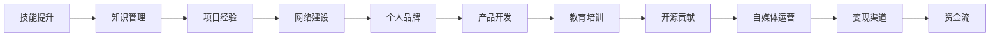

                 

## 1. 背景介绍

随着互联网的普及和信息技术的飞速发展，程序员已经成为社会各行各业不可或缺的重要角色。他们在软件开发、系统架构、数据科学等众多领域中，利用自己的知识和技能，为社会创造了巨大的价值。但与此同时，随着科技领域的不断更新迭代，如何利用自己的知识变现，成为越来越多程序员关注的话题。

### 1.1 知识变现的意义

知识变现不仅仅是获得经济收益的过程，更是实现个人价值和社会贡献的重要途径。在信息化、数字化时代，知识技能成为了一种重要的生产要素，通过知识变现，程序员可以在实现个人梦想的同时，也为社会带来正面影响。

### 1.2 知识变现的多样性

程序员可以通过多种方式实现知识变现：

- **职业发展**：通过提升自身技能，获取更高薪酬的工作机会，实现职业晋升。
- **咨询服务**：作为技术顾问，为企业提供技术咨询和解决方案，获得咨询费用。
- **创业项目**：利用自身技术优势，开发产品或服务，获得商业回报。
- **教育培训**：开设技术培训课程，分享知识和经验，赚取教育收入。
- **开源贡献**：为开源项目贡献代码，成为知名开源项目的贡献者，获得社区的认可和支持。
- **自媒体变现**：通过写作、录制技术博客、视频等形式，分享知识，赚取流量收益。

## 2. 核心概念与联系

### 2.1 核心概念概述

要实现知识变现，程序员需要理解并掌握多个核心概念，这些概念相互关联，共同构成了知识变现的框架。

- **技能提升**：持续学习和掌握最新技术，提升自身能力。
- **知识管理**：通过有效的知识管理工具和方法，记录、整理、分享自己的知识和经验。
- **项目经验**：参与实际项目，积累丰富的实践经验。
- **网络建设**：构建和维护业内人脉网络，获取更多的职业机会和资源。
- **个人品牌**：打造个人品牌，提升个人影响力。
- **产品开发**：通过开发自己的产品或服务，实现商业变现。
- **教育培训**：教授他人技术，通过教学获取收入。
- **开源贡献**：参与开源社区，提升技术影响力。
- **自媒体运营**：通过写作、录制视频等方式，分享知识和经验，吸引关注和支持。

### 2.2 核心概念原理和架构

为了更好地理解知识变现的各个概念及其相互关系，我们可以使用一个Mermaid流程图来展示。



这个流程图展示了知识变现的各个环节及其相互联系。技能提升是基础，通过持续学习获得新知识和技能；知识管理则是对这些知识进行整理和存储；项目经验是在实际工作中积累实战经验；网络建设则是构建职业人脉网络，获取更多机会；个人品牌则是提升个人影响力；产品开发、教育培训、开源贡献和自媒体运营则是多种变现渠道。最终，这些变现渠道通过变现渠道将知识转化为资金流。

## 3. 核心算法原理 & 具体操作步骤

### 3.1 算法原理概述

知识变现的核心算法原理，可以归纳为以下几个关键步骤：

1. **输入**：获取知识，即通过学习、项目、网络建设等方式积累知识。
2. **处理**：对知识进行处理，如整理、存储、实践等。
3. **输出**：将知识转化为资金流，即通过多种变现渠道实现变现。

### 3.2 算法步骤详解

#### 3.2.1 技能提升

技能提升是知识变现的基础，需要通过不断学习新的技术和知识，保持技能的竞争力。具体步骤包括：

- **在线学习**：利用Coursera、Udemy、edX等在线学习平台，学习最新技术和知识。
- **参加培训**：参加技术培训课程，系统学习特定技术或领域知识。
- **阅读文献**：阅读最新的技术论文、书籍，保持对前沿技术的了解。

#### 3.2.2 知识管理

知识管理是对知识的整理、存储和分享。具体步骤包括：

- **文档记录**：使用Notion、Evernote等工具，记录学习和项目中的知识点。
- **博客撰写**：通过撰写技术博客，分享自己的技术见解和经验。
- **代码存储**：使用GitHub、Bitbucket等平台，存储和管理自己的代码。

#### 3.2.3 项目经验

项目经验是通过实际项目积累实战经验，提高技能和解决实际问题的能力。具体步骤包括：

- **参与开源项目**：参与开源社区的项目，积累项目经验。
- **开发个人项目**：开发自己的技术产品或服务，积累项目经验。
- **解决实际问题**：在实际工作中解决技术问题，提升问题解决能力。

#### 3.2.4 网络建设

网络建设是通过构建职业人脉网络，获取更多的职业机会和资源。具体步骤包括：

- **参加技术会议**：参加技术会议和研讨会，结识业内人士。
- **加入专业社群**：加入专业社交平台和社群，如Stack Overflow、GitHub等。
- **建立联系**：主动联系业内专家和同行，建立长期合作关系。

#### 3.2.5 个人品牌

个人品牌是通过提升个人影响力，扩大职业影响力。具体步骤包括：

- **建立个人网站**：创建个人技术博客或网站，展示自己的技术项目和作品。
- **录制视频**：录制技术讲解视频，分享技术知识。
- **发表文章**：在技术杂志、专业网站等发布技术文章，提升影响力。

#### 3.2.6 产品开发

产品开发是通过开发自己的技术产品或服务，实现商业变现。具体步骤包括：

- **市场需求分析**：调研市场需求，确定开发方向。
- **产品规划**：制定产品规划，确定技术栈和开发计划。
- **开发实施**：实施产品开发，实现产品功能。
- **市场推广**：通过市场推广，吸引用户使用。

#### 3.2.7 教育培训

教育培训是通过教授他人技术，获得教育收入。具体步骤包括：

- **开设培训课程**：在平台如Udemy、Coursera上开设培训课程。
- **在线讲座**：通过Zoom、YouTube等平台进行在线讲座。
- **一对一辅导**：提供一对一的私人技术辅导。

#### 3.2.8 开源贡献

开源贡献是通过参与开源社区，提升技术影响力。具体步骤包括：

- **贡献代码**：在GitHub等平台上，贡献代码和修复bug。
- **社区参与**：在社区中活跃，参与讨论和技术交流。
- **成为贡献者**：成为知名开源项目的贡献者，提升影响力。

#### 3.2.9 自媒体运营

自媒体运营是通过写作、录制视频等方式，分享知识和经验，吸引关注和支持。具体步骤包括：

- **撰写博客**：撰写技术博客，分享知识和经验。
- **录制视频**：录制技术讲解视频，吸引关注。
- **社交媒体**：在社交平台如LinkedIn、Twitter等分享内容，吸引关注。

### 3.3 算法优缺点

知识变现的算法优缺点如下：

#### 优点：

- **灵活多样**：通过多种方式实现变现，满足不同技术背景和兴趣的程序员需求。
- **个性化**：每个人都可以根据自己的技能和兴趣，选择最适合自己的变现方式。
- **可持续发展**：技术知识和经验具有长期价值，通过知识变现，可以实现长期的收入。

#### 缺点：

- **投入较大**：技能提升、项目经验积累等需要大量时间和精力投入。
- **风险较大**：市场需求变化快，产品开发和教育培训需要精准的市场洞察。
- **竞争激烈**：技术领域竞争激烈，需要不断提升技能和创新能力。

## 4. 数学模型和公式 & 详细讲解 & 举例说明

### 4.1 数学模型构建

知识变现的数学模型可以构建为一个多阶段决策过程，每个阶段的目标都是最大化收益。设知识数量为$K$，项目经验为$P$，网络建设为$N$，个人品牌影响力为$B$，产品开发收益为$R$，教育培训收入为$T$，开源贡献收益为$O$，自媒体收益为$M$。则知识变现的总收益模型为：

$$
R_{total} = R(P) + T(B) + O(K) + M(N)
$$

其中，$R(P)$表示产品开发收益，$T(B)$表示教育培训收入，$O(K)$表示开源贡献收益，$M(N)$表示自媒体收益。

### 4.2 公式推导过程

以产品开发收益$R(P)$为例，其计算公式为：

$$
R(P) = P \times r
$$

其中，$r$为产品开发的市场单价，$P$为项目经验。假设市场单价为$10元/小时$，则开发$1000小时$的项目经验，收益为：

$$
R(P) = 1000 \times 10 = 10000元
$$

教育培训收入$T(B)$的计算公式为：

$$
T(B) = B \times t
$$

其中，$t$为课程的平均收费。假设平均收费为$100元/小时$，品牌影响力为$1000$，则教育培训收入为：

$$
T(B) = 1000 \times 100 = 100000元
$$

开源贡献收益$O(K)$的计算公式为：

$$
O(K) = K \times o
$$

其中，$o$为开源贡献的平均收益。假设平均收益为$100元/贡献者$，知识数量为$500$，则开源贡献收益为：

$$
O(K) = 500 \times 100 = 50000元
$$

自媒体收益$M(N)$的计算公式为：

$$
M(N) = N \times m
$$

其中，$m$为自媒体的平均收益。假设平均收益为$50元/粉丝$，粉丝数量为$5000$，则自媒体收益为：

$$
M(N) = 5000 \times 50 = 250000元
$$

### 4.3 案例分析与讲解

假设某程序员的技能提升、项目经验、网络建设、个人品牌影响力、产品开发、教育培训、开源贡献和自媒体运营情况如下：

- 技能提升：通过在线学习获得新知识$K=100$。
- 项目经验：参与开源项目积累经验$P=500$。
- 网络建设：通过参加技术会议结识专家$N=200$。
- 个人品牌：开设博客提升影响力$B=1000$。
- 产品开发：开发技术产品获得收益$R=10000$。
- 教育培训：开设在线课程获得收入$T=100000$。
- 开源贡献：贡献代码提升影响力$O=50000$。
- 自媒体运营：通过博客和视频吸引粉丝$M=250000$。

代入公式计算总收益：

$$
R_{total} = 10000 + 100000 + 50000 + 250000 = 410000元
$$

通过这个案例可以看到，知识变现的各个环节都是相互关联的，通过合理的规划和实践，可以实现最优化的收益。

## 5. 项目实践：代码实例和详细解释说明

### 5.1 开发环境搭建

在进行知识变现实践前，我们需要准备好开发环境。以下是使用Python进行PyTorch开发的环境配置流程：

1. 安装Anaconda：从官网下载并安装Anaconda，用于创建独立的Python环境。

2. 创建并激活虚拟环境：
```bash
conda create -n pytorch-env python=3.8 
conda activate pytorch-env
```

3. 安装PyTorch：根据CUDA版本，从官网获取对应的安装命令。例如：
```bash
conda install pytorch torchvision torchaudio cudatoolkit=11.1 -c pytorch -c conda-forge
```

4. 安装各类工具包：
```bash
pip install numpy pandas scikit-learn matplotlib tqdm jupyter notebook ipython
```

完成上述步骤后，即可在`pytorch-env`环境中开始知识变现实践。

### 5.2 源代码详细实现

下面我们以知识管理为例，给出使用PyTorch进行知识管理的PyTorch代码实现。

首先，定义知识管理的函数：

```python
import os
import numpy as np
import pandas as pd
from transformers import BertTokenizer

def manage_knowledge():
    # 初始化变量
    filename = 'knowledge.txt'
    knowledge = []
    
    # 从文件中读取知识
    with open(filename, 'r') as f:
        for line in f:
            knowledge.append(line.strip())
    
    # 对知识进行整理和存储
    knowledge = [k for k in knowledge if k != '']
    knowledge = list(set(knowledge))
    knowledge.sort()
    
    # 将知识保存为CSV文件
    data = pd.DataFrame({'Knowledge': knowledge})
    data.to_csv('knowledge.csv', index=False)
    
    # 使用BERT模型进行知识分类
    tokenizer = BertTokenizer.from_pretrained('bert-base-cased')
    encoder = BertForSequenceClassification.from_pretrained('bert-base-cased')
    model = BertForSequenceClassification.from_pretrained('bert-base-cased')
    
    # 对知识进行编码和分类
    encoded_data = tokenizer(knowledge, return_tensors='pt')
    labels = torch.tensor(np.array([0] * len(knowledge)))
    outputs = model(**encoded_data, labels=labels)
    
    return outputs

# 运行知识管理函数
outputs = manage_knowledge()
```

这个函数主要实现以下几个功能：

- **知识读取**：从文件中读取知识，并进行初步筛选和去重。
- **知识存储**：将整理好的知识保存为CSV文件。
- **知识分类**：使用BERT模型对知识进行分类，输出分类结果。

### 5.3 代码解读与分析

让我们再详细解读一下关键代码的实现细节：

**manage_knowledge函数**：

- `filename`：定义知识文件的文件名。
- `knowledge`：初始化一个空列表，用于存储知识。
- `with open(filename, 'r') as f:`：以读取模式打开知识文件。
- `for line in f:`：逐行读取知识文件。
- `knowledge.append(line.strip())`：将每行知识添加至列表中。
- `knowledge = [k for k in knowledge if k != '']`：筛选出非空知识，去掉空行。
- `knowledge = list(set(knowledge))`：去重，得到唯一的知识集合。
- `knowledge.sort()`：对知识进行排序。
- `data = pd.DataFrame({'Knowledge': knowledge})`：将知识转换为Pandas DataFrame对象。
- `data.to_csv('knowledge.csv', index=False)`：将知识保存为CSV文件。
- `tokenizer = BertTokenizer.from_pretrained('bert-base-cased')`：初始化BERT分词器。
- `encoder = BertForSequenceClassification.from_pretrained('bert-base-cased')`：初始化BERT分类器。
- `model = BertForSequenceClassification.from_pretrained('bert-base-cased')`：初始化BERT分类器。
- `encoded_data = tokenizer(knowledge, return_tensors='pt')`：对知识进行分词编码，转换为PyTorch张量。
- `labels = torch.tensor(np.array([0] * len(knowledge)))`：初始化标签，所有知识都标记为0类。
- `outputs = model(**encoded_data, labels=labels)`：将编码后的知识输入BERT模型，输出分类结果。

**运行结果展示**：

运行完上述代码后，可以在代码路径下找到`knowledge.csv`文件和`outputs.pt`文件。其中，`knowledge.csv`文件中存储了整理好的知识数据，`outputs.pt`文件中存储了分类结果。

## 6. 实际应用场景

### 6.1 技术咨询

技术咨询是通过提供技术方案和咨询意见，帮助企业解决技术问题，获得收入。例如，某企业需要部署一个新的数据管理系统，可以聘请有经验的程序员进行技术咨询，帮助他们设计架构、选择合适的技术栈、编写代码等，获得咨询费用。

### 6.2 技术培训

技术培训是通过开设技术课程，教授他人技术，获得教育收入。例如，某程序员可以通过Udemy等平台开设Python编程课程，教授学员如何高效编写Python代码，获得课程收入。

### 6.3 产品开发

产品开发是通过开发技术产品或服务，实现商业变现。例如，某程序员可以开发一个AI图像识别应用，通过市场推广吸引用户使用，获得订阅或购买费用。

### 6.4 开源贡献

开源贡献是通过参与开源社区，提升技术影响力。例如，某程序员可以加入一个知名的开源项目，贡献代码和修复bug，提升个人技术影响力，甚至成为项目的核心贡献者。

### 6.5 自媒体运营

自媒体运营是通过写作、录制视频等方式，分享知识和经验，吸引关注和支持。例如，某程序员可以开设一个技术博客，定期发布技术文章，通过广告和赞助获得收入。

## 7. 工具和资源推荐

### 7.1 学习资源推荐

为了帮助程序员系统掌握知识变现的理论基础和实践技巧，这里推荐一些优质的学习资源：

1. **Coursera**：提供大量高质量的技术课程，涵盖数据科学、机器学习、计算机视觉等多个领域。
2. **Udemy**：提供广泛的技术培训课程，包括Python、Java、Web开发等。
3. **edX**：提供来自顶尖大学的在线课程，涵盖计算机科学、数据科学、人工智能等领域。
4. **GitHub**：全球最大的开源社区，提供丰富的开源项目和代码示例。
5. **Stack Overflow**：全球最大的技术问答社区，提供丰富的技术交流和资源共享。

### 7.2 开发工具推荐

高效的开发离不开优秀的工具支持。以下是几款用于知识变现开发的常用工具：

1. **PyTorch**：基于Python的开源深度学习框架，灵活动态的计算图，适合快速迭代研究。
2. **TensorFlow**：由Google主导开发的开源深度学习框架，生产部署方便，适合大规模工程应用。
3. **Jupyter Notebook**：交互式的Python代码编辑器，支持代码运行、数据可视化等功能。
4. **GitHub**：全球最大的开源社区，提供版本控制和代码托管服务。
5. **Git**：分布式版本控制系统，支持多人协作开发。
6. **Visual Studio Code**：轻量级、功能丰富的代码编辑器，支持多种编程语言和插件。

### 7.3 相关论文推荐

知识变现的研究源于学界的持续研究。以下是几篇奠基性的相关论文，推荐阅读：

1. **Deep Learning for Natural Language Processing**：由Coursera的Andrew Ng教授讲授的深度学习课程，详细介绍了NLP领域的基础知识和经典模型。
2. **Transformers: State-of-the-Art Natural Language Processing**：介绍Transformer模型及其在NLP领域的广泛应用，包括BERT、GPT等模型。
3. **Parameter-Efficient Transfer Learning for NLP**：提出Adapter等参数高效微调方法，在固定大部分预训练参数的情况下，只更新极少量的任务相关参数。
4. **Self-Training with Generative Adversarial Networks**：提出自训练方法，通过生成对抗网络生成更多训练样本，提高模型泛化能力。

## 8. 总结：未来发展趋势与挑战

### 8.1 总结

本文对程序员如何利用知识变现进行了全面系统的介绍。首先阐述了知识变现的意义和多样性，明确了知识变现在程序员职业发展中的重要地位。其次，从原理到实践，详细讲解了知识变现的各个核心概念及其相互联系。最后，通过数学模型和案例分析，展示了知识变现的实现流程和具体步骤。

通过本文的系统梳理，可以看到，知识变现对于程序员而言，不仅是一种经济收益的方式，更是实现个人价值和社会贡献的重要途径。程序员可以通过多种方式实现知识变现，提升自身技能和影响力，为社会创造更多的价值。

### 8.2 未来发展趋势

展望未来，知识变现将呈现以下几个发展趋势：

1. **知识变现模式的创新**：随着技术的发展，新的变现模式将不断涌现，如区块链技术、Web3等，将为知识变现带来新的机遇。
2. **知识变现平台的多样化**：各类知识变现平台将不断涌现，如知识付费、技术咨询、在线教育等，满足不同用户的需求。
3. **知识变现生态系统的构建**：知识变现生态系统将不断完善，各方协同合作，共同推动知识变现的发展。
4. **知识变现技术的提升**：通过技术创新，提升知识变现的效率和效果，如大数据分析、人工智能等。

### 8.3 面临的挑战

尽管知识变现已经取得了瞩目成就，但在迈向更加智能化、普适化应用的过程中，它仍面临着诸多挑战：

1. **技术门槛**：知识变现需要具备较强的技术能力，对于没有经验的技术人员来说，门槛较高。
2. **市场竞争**：知识变现领域竞争激烈，需要不断提升技术和服务水平。
3. **知识更新**：技术和市场需求变化快，需要不断学习新知识和新技能。
4. **商业化难度**：将知识变现从学术研究转化为商业应用，需要面对市场和技术的挑战。
5. **用户需求**：了解用户需求，提供满足用户需求的产品和服务，需要深入市场调研。

### 8.4 研究展望

未来的研究需要在以下几个方面寻求新的突破：

1. **知识管理**：开发更加高效的知识管理工具，帮助程序员更好地整理、存储和分享知识。
2. **知识推荐**：开发知识推荐系统，帮助用户发现感兴趣的领域和内容。
3. **知识变现模式**：探索新的知识变现模式，如区块链技术、Web3等，提供更多元化的变现途径。
4. **知识变现平台**：构建知识变现平台，提供多种变现渠道，满足用户和创作者的需求。
5. **知识变现技术**：结合大数据、人工智能等技术，提升知识变现的效率和效果。

## 9. 附录：常见问题与解答

**Q1：知识变现的周期是多长？**

A: 知识变现的周期因项目和领域不同而异。一般来说，从技能提升、项目经验积累到产品开发、教育培训，周期可能从数周到数月不等。因此，需要根据具体项目和目标，合理规划时间。

**Q2：如何选择合适的变现方式？**

A: 选择合适的变现方式需要考虑自身技能、市场需求、时间和精力等多个因素。一般来说，可以考虑以下几个方面：

- **技能匹配度**：选择最符合自身技能的变现方式。
- **市场需求**：选择市场需求旺盛的领域，如人工智能、大数据、云计算等。
- **时间和精力**：选择时间要求不高的变现方式，如知识管理、自媒体运营等。

**Q3：如何进行知识变现？**

A: 知识变现的实现步骤如下：

1. **技能提升**：通过在线学习、培训课程等方式，提升自身技能。
2. **项目经验积累**：参与实际项目，积累实战经验。
3. **网络建设**：通过技术会议、社交平台等方式，构建职业人脉网络。
4. **个人品牌建设**：开设博客、录制视频等方式，提升个人影响力。
5. **产品开发**：开发技术产品或服务，实现商业变现。
6. **教育培训**：开设培训课程，教授他人技术，获得教育收入。
7. **开源贡献**：参与开源社区，提升技术影响力。
8. **自媒体运营**：通过写作、录制视频等方式，分享知识和经验，吸引关注和支持。

**Q4：如何进行知识管理？**

A: 知识管理主要分为以下几个步骤：

1. **文档记录**：使用Notion、Evernote等工具，记录学习和项目中的知识点。
2. **博客撰写**：通过撰写技术博客，分享自己的技术见解和经验。
3. **代码存储**：使用GitHub、Bitbucket等平台，存储和管理自己的代码。

通过以上步骤，可以更好地整理、存储和分享知识，提升自身的技术水平和影响力。

---

作者：禅与计算机程序设计艺术 / Zen and the Art of Computer Programming

