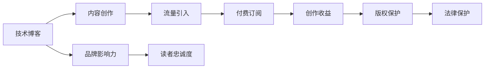

                 

# 程序员如何将技术博客转化为付费专栏

> 关键词：技术博客, 付费专栏, 内容营销, 技术文章, 创作收益, 版权保护, 品牌影响力, 读者忠诚度

## 1. 背景介绍

随着互联网技术的普及和社交媒体的兴起，技术博客作为一种信息传播的媒介，已经从最初的小众爱好演变为一种重要的职业。技术的不断进步和更新，催生了对高水平技术文章的旺盛需求。越来越多的程序员和开发者开始以撰写技术博客为生，希望能从中获得一份稳定的收入。然而，在当前内容爆炸的时代，如何从大量的技术博客中脱颖而出，吸引并留住读者，成为程序员们面临的巨大挑战。本文将探讨如何通过将技术博客转化为付费专栏，提升内容价值和读者忠诚度，从而实现长期的创作收益。

## 2. 核心概念与联系

### 2.1 核心概念概述

- **技术博客**：以技术为主题的博客，通常由程序员或开发者撰写，旨在分享技术见解、经验总结和项目实战等内容。
- **付费专栏**：读者需要支付订阅费才能访问的博客内容区域，通常以文章、视频、课程等多种形式呈现。
- **内容营销**：通过创作高质量的内容，吸引并锁定目标受众，并转化为其客户或用户的过程。
- **技术文章**：专注于技术领域，提供技术知识、工具、技巧和实践经验的文本内容。
- **创作收益**：通过博客内容获得收入，包括广告、赞助、付费订阅、版权销售等方式。
- **版权保护**：通过法律手段保护作者创作内容不被盗用、抄袭或非法传播。
- **品牌影响力**：通过高质量内容的长期输出，建立和提升个人或品牌的知名度和信任度。
- **读者忠诚度**：通过满足读者的需求、提供价值和互动，增强读者对内容创作者或品牌的黏性和忠诚度。

### 2.2 核心概念原理和架构的 Mermaid 流程图(Mermaid 流程节点中不要有括号、逗号等特殊字符)



## 3. 核心算法原理 & 具体操作步骤

### 3.1 算法原理概述

将技术博客转化为付费专栏的核心算法原理基于内容营销的“漏斗模型”（Funnel Model），即：

1. **内容创作**：产生高质量、有价值的技术文章，满足目标受众的需求。
2. **流量引入**：通过SEO、社交媒体、邮件营销等手段，将内容传播给潜在读者。
3. **付费订阅**：在内容吸引读者的同时，通过适当的商业模式，促使部分读者愿意为专属内容支付订阅费。
4. **创作收益**：通过订阅费、广告、赞助等形式，实现内容的经济回报。
5. **版权保护**：确保内容不被非法传播或侵权，保护作者权益。
6. **品牌影响力**：通过持续高质量内容的输出，提升个人或品牌在行业内的知名度和信任度。
7. **读者忠诚度**：通过互动、社群建设等方式，增强读者对内容创作者或品牌的黏性和忠诚度。

### 3.2 算法步骤详解

#### 3.2.1 内容创作

- **选题策划**：根据自身专长和市场需求，确定博客的主题和方向。
- **内容撰写**：以技术文章为核心，结合实际项目经验，提供实用的技术见解和案例分析。
- **格式设计**：选择合适的文章格式，如技术教程、项目实战、行业趋势分析等。
- **图片和视频**：增加技术图表、代码示例、视频演示等辅助内容，增强文章的可视性和可读性。

#### 3.2.2 流量引入

- **SEO优化**：进行关键词研究，优化文章标题、摘要和标签，提高搜索引擎排名。
- **社交媒体**：在LinkedIn、Twitter、GitHub等平台上分享文章，利用社交网络传播内容。
- **邮件营销**：建立邮件订阅列表，定期发送有价值的技术文章和最新资讯，与读者保持互动。

#### 3.2.3 付费订阅

- **订阅模型选择**：选择按月、按年订阅，或提供免费试用期，吸引新用户。
- **订阅页面设计**：设计简洁明了的订阅页面，突出订阅价值，吸引用户订阅。
- **订阅系统集成**：与第三方支付平台（如Stripe、PayPal）集成，确保支付流程顺畅。

#### 3.2.4 创作收益

- **广告收入**：在文章中加入Google AdSense、Amazon Associates等广告，获取流量带来的收益。
- **赞助和打赏**：与技术公司或社区合作，获得赞助和打赏。
- **版权销售**：将技术文章和项目案例整理成电子书或课程，通过平台（如Gumroad、Udemy）销售。

#### 3.2.5 版权保护

- **版权声明**：在每篇文章末尾添加版权声明，明确文章的版权所有者。
- **版权登记**：将文章上传至版权保护平台（如Copyright.com、Creative Commons）进行登记。
- **法律咨询**：遇到版权纠纷时，寻求专业法律咨询，保护自身权益。

#### 3.2.6 品牌影响力

- **内容质量**：持续输出高质量技术文章，建立品牌声誉。
- **行业参与**：参与技术会议、论坛、社交媒体讨论，提升品牌知名度。
- **社群建设**：建立自己的技术社群或论坛，与读者互动，增强忠诚度。

#### 3.2.7 读者忠诚度

- **读者互动**：回复读者的评论和问题，建立良好的互动关系。
- **社群活动**：组织线上技术讲座、Q&A、技术挑战等活动，增强社区活跃度。
- **会员制度**：推出会员专享内容，如VIP文章、专属技术支持等，激励忠实读者。

### 3.3 算法优缺点

#### 3.3.1 优点

- **多渠道收益**：通过广告、赞助、订阅费、版权销售等多种方式，获得更稳定的收入。
- **品牌提升**：通过内容创作和品牌营销，提升在行业内的知名度和信任度。
- **读者忠诚**：通过持续提供有价值的内容和互动，增强读者的忠诚度和粘性。

#### 3.3.2 缺点

- **内容创作压力大**：需要持续输出高质量的技术文章，对作者的时间、精力和专业知识要求较高。
- **流量引入难度大**：需要具备一定的SEO优化和社交媒体营销能力，才能吸引大量读者。
- **收益周期长**：订阅收入和版权销售的增长需要时间，初期收益较低。
- **版权保护复杂**：需要了解和遵守不同地区的版权法律法规，确保内容的合法性。

### 3.4 算法应用领域

付费专栏不仅限于技术博客，广泛应用于各种领域，如教育、健身、生活方式、健康等。在每个领域中，优质内容的创作和传播都是实现商业化转型的关键。

- **技术博客**：面向软件开发、人工智能、区块链等技术领域的创作者，提供深度技术见解和实战经验。
- **教育博客**：面向学生和教育工作者，提供学科知识、学习方法、考试技巧等教育内容。
- **健身博客**：面向健身爱好者，提供训练计划、营养建议、心理辅导等。
- **生活方式博客**：面向生活改善者，提供旅行攻略、美食制作、环保生活等。
- **健康博客**：面向健康关注者，提供疾病预防、健康管理、心理调适等。

## 4. 数学模型和公式 & 详细讲解 & 举例说明

### 4.1 数学模型构建

在技术博客转化为付费专栏的过程中，我们可以建立一个简单的数学模型来量化分析。

设 $R$ 为创作收益，$C$ 为内容创作成本，$F$ 为流量引入成本，$S$ 为订阅收入，$P$ 为广告收入，$L$ 为法律保护成本。

- **创作收益模型**：$R = S + P + \text{版权销售收入}$
- **总成本模型**：$C + F + L$
- **净利润模型**：$R - (C + F + L)$

### 4.2 公式推导过程

假设 $C$、$F$、$L$ 为常数，忽略变动成本，则有：

$$
R - (C + F + L) = S + P + \text{版权销售收入} - (C + F + L)
$$

在订阅收入 $S$ 和广告收入 $P$ 不变的情况下，增加版权销售收入可以提升净利润 $R$。因此，创作者可以通过多种方式扩展收入来源，提升整体收益。

### 4.3 案例分析与讲解

以一位知名技术博客作者为例，他的博客以深度技术文章和实战项目为主，具备较高的专业水平和广泛的读者基础。通过以下步骤，他成功将博客转化为付费专栏：

1. **内容创作**：作者每月创作多篇高质量技术文章，涵盖前沿技术、工具使用、项目实战等内容。
2. **流量引入**：利用SEO优化，在Google、Bing等搜索引擎中排名靠前，同时在Twitter、LinkedIn等社交媒体上定期分享文章，吸引读者关注。
3. **付费订阅**：推出每月订阅计划，提供VIP文章、专题课程、技术问答等专享内容，每月订阅费用为$9.99，并提供$7天免费试用期。
4. **创作收益**：在每篇文章中加入Google AdSense广告，每月获得广告收入$1,000。同时，推出电子书和在线课程，通过Gumroad销售，每本书售价$29.99，每门课程售价$49.99。
5. **版权保护**：在每篇文章末尾添加版权声明，并将文章上传至Copyright.com进行版权登记。
6. **品牌影响力**：参与技术会议、论坛，发布博客文章，与读者互动，提升品牌知名度。
7. **读者忠诚度**：通过社群建设，组织线上技术讲座和Q&A，定期与读者互动，建立忠诚的读者群体。

通过上述步骤，作者每月收入约为$5,000，不仅实现了创作收益的可持续增长，还建立了强大的品牌影响力和忠实的读者群体。

## 5. 项目实践：代码实例和详细解释说明

### 5.1 开发环境搭建

1. **安装Python和Pip**：确保Python 3.x版本已经安装，并在命令行中安装Pip。
2. **安装Markdown编辑器**：如Typora、GFM Markdown等，用于编写和预览博客文章。
3. **配置SEO工具**：如Yoast SEO、SEMrush等，进行关键词优化和排名监控。
4. **社交媒体账号**：在Twitter、LinkedIn、Facebook等平台上创建博客账号，定期发布文章。
5. **邮件订阅列表**：使用Mailchimp或Mailgun等工具，建立和管理订阅列表，发送技术资讯和文章更新通知。

### 5.2 源代码详细实现

以下是一个简单的技术文章撰写和SEO优化的示例：

```python
from markdown import markdown
import seo_optimizer as seo

def write_technical_article(title, content):
    # 将Markdown内容转换为HTML格式
    html_content = markdown(content)
    
    # 进行SEO优化
    seokeywords = ['深度学习', '机器学习', 'TensorFlow']
    optimized_html = seo.optimize(html_content, seokeywords)
    
    # 将优化后的HTML内容保存到博客平台
    blog_platform.save_article(title, optimized_html)
```

### 5.3 代码解读与分析

1. **Markdown编辑器**：使用Markdown格式编写技术文章，提供简洁明了的语法和丰富的排版功能。
2. **SEO工具**：通过关键词优化和元标签设置，提高文章在搜索引擎中的排名。
3. **社交媒体发布**：利用社交媒体平台的API接口，自动发布文章内容，扩大传播范围。
4. **邮件订阅管理**：使用电子邮件营销平台，自动发送订阅通知和最新文章更新。
5. **平台集成**：与博客平台（如Medium、WordPress）集成，实现文章的自动发布和备份。

### 5.4 运行结果展示

通过以上代码示例，可以展示技术文章从撰写到SEO优化，再到社交媒体和邮件推广的全过程。作者可以在多平台展示自己的技术文章，吸引和留住读者，最终实现从技术博客到付费专栏的转化。

## 6. 实际应用场景

### 6.1 技术博客转型案例

#### 案例一：Blogs by Steve

Steve是一位知名的软件开发博主，他主要分享Python和机器学习相关的技术文章。通过在博客上推出付费订阅计划，Steve每月获得$5,000的收入，主要来源于订阅费和广告收入。

- **订阅计划**：每月订阅费用$9.99，提供VIP文章、技术问答、课程优惠等专享内容。
- **广告收入**：在每篇文章中加入Google AdSense广告，每月获得$1,000收入。

#### 案例二：OpenAI技术博客

OpenAI在技术博客上发布大量深度技术文章和项目案例，吸引了全球数十万名读者。通过多种商业化方式，OpenAI实现了内容变现。

- **广告收入**：在每篇文章中加入Google AdSense广告。
- **赞助合作**：与技术公司和社区合作，获得赞助和打赏。
- **课程销售**：推出深度学习、自然语言处理等在线课程，通过Udemy销售。

### 6.2 技术博客转型趋势

1. **多媒体内容**：除了文字文章，视频、音频、图表等多媒体形式的内容逐渐增多，提升读者的阅读体验。
2. **交互式内容**：通过在线编程环境、互动问卷等方式，增强读者参与感和互动性。
3. **个性化推荐**：利用机器学习算法，根据读者的阅读历史和兴趣，推荐相关文章。
4. **社区建设**：建立技术论坛和社群，增强读者间的互动和交流。
5. **国际化扩展**：将博客内容翻译成多语言，扩展全球读者基础。

## 7. 工具和资源推荐

### 7.1 学习资源推荐

1. **内容创作工具**：Typora、GFM Markdown、Grantland Markdown等。
2. **SEO优化工具**：Yoast SEO、SEMrush、Ahrefs等。
3. **社交媒体管理工具**：Hootsuite、Buffer、Sprout Social等。
4. **邮件营销平台**：Mailchimp、Mailgun、SendGrid等。
5. **在线编程环境**：Google Colab、Jupyter Notebook、GitHub等。

### 7.2 开发工具推荐

1. **内容管理系统**：WordPress、Medium、Ghost等。
2. **博客发布平台**：Gumroad、Udemy、Amazon Kindle Direct Publishing等。
3. **广告平台**：Google AdSense、Amazon Associates、Media.net等。
4. **版权保护平台**：Copyright.com、Creative Commons等。
5. **社区建设工具**：Discourse、Slack、Trello等。

### 7.3 相关论文推荐

1. **内容营销理论**：Content Marketing for Humans by Joe Pulizzi
2. **博客经济研究**：The Blogography: On Writing, Working, and Being Alive Online by Brian Clark
3. **技术博客创新**：The Future of Web Design: Design, Development, and User Experience by Steve Krug
4. **付费订阅模式**：The New Value Proposition: Eight Business Models of the Future by Daniel Pink

## 8. 总结：未来发展趋势与挑战

### 8.1 未来发展趋势

1. **内容差异化**：技术文章更加注重独特性、深度和原创性，避免同质化内容。
2. **多媒体融合**：博客内容多样化，加入视频、音频、图表等形式，提升用户体验。
3. **交互式设计**：通过在线编程环境、互动问卷等方式，增强读者参与感和互动性。
4. **社区化发展**：建立技术论坛和社群，增强读者间的互动和交流。
5. **国际化扩展**：将博客内容翻译成多语言，扩展全球读者基础。

### 8.2 面临的挑战

1. **内容创作压力**：需要持续输出高质量的技术文章，对作者的时间、精力和专业知识要求较高。
2. **流量引入难度**：需要具备一定的SEO优化和社交媒体营销能力，才能吸引大量读者。
3. **收益周期长**：订阅收入和版权销售的增长需要时间，初期收益较低。
4. **版权保护复杂**：需要了解和遵守不同地区的版权法律法规，确保内容的合法性。

### 8.3 研究展望

未来，技术博客转化为付费专栏的趋势将继续深化，作者们需要不断探索新的商业模式和营销策略。同时，提升内容创作质量和品牌影响力，建立忠实的读者群体，仍然是持续获得创作收益的关键。

## 9. 附录：常见问题与解答

**Q1：技术博客需要多少读者才能实现盈利？**

A: 技术博客实现盈利的关键在于订阅收入和广告收入，订阅收入的盈利点主要取决于订阅费和订阅用户数量。一般来说，每月订阅用户数量超过500，便可以达到盈亏平衡点。实际收益还需要考虑广告收入和版权销售收入。

**Q2：如何提升博客的搜索引擎排名？**

A: 提升博客的搜索引擎排名主要从关键词优化、内容质量、外部链接三个方面入手：
1. **关键词优化**：进行关键词研究，优化文章标题、摘要和标签。
2. **内容质量**：提供高质量、有价值的技术文章，满足读者需求。
3. **外部链接**：在相关博客和论坛上发布文章，获取高质量的外部链接。

**Q3：如何建立忠实的读者群体？**

A: 建立忠实的读者群体需要多方面的努力：
1. **互动交流**：回复读者的评论和问题，建立良好的互动关系。
2. **社群建设**：建立自己的技术论坛或社群，定期与读者互动。
3. **会员制度**：推出会员专享内容，如VIP文章、专属技术支持等，激励忠实读者。

**Q4：如何选择合适的订阅费？**

A: 选择合适的订阅费需要考虑目标读者的经济能力和订阅价值：
1. **经济能力**：调查目标读者的收入水平，确定合理订阅费。
2. **订阅价值**：提供有价值的内容和服务，确保订阅费合理公正。
3. **市场调研**：进行市场调研，了解同领域其他创作者和平台的订阅费，确保具有竞争力。

**Q5：如何提升广告收入？**

A: 提升广告收入需要优化广告展示和点击率：
1. **广告展示**：在文章的关键位置加入广告，提高广告曝光率。
2. **点击率优化**：选择相关性高、点击率高的广告内容，提高广告点击率。
3. **广告平台**：选择流量大、点击率高的广告平台，如Google AdSense、Amazon Associates等。

---

作者：禅与计算机程序设计艺术 / Zen and the Art of Computer Programming

