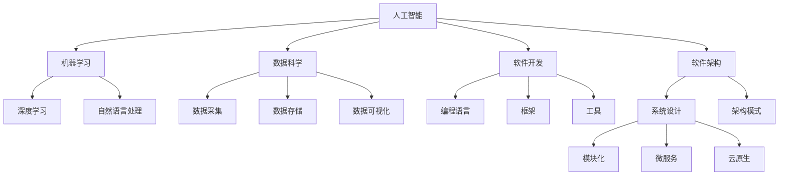

                 

# 程序员如何应对人工智能时代的职业转型

> 关键词：人工智能(AI)，机器学习(ML)，数据科学，软件开发，软件架构，技术栈更新

## 1. 背景介绍

随着人工智能(AI)技术的迅猛发展，自动化、智能化浪潮已席卷全球各行各业，编程工作也正处于前所未有的变革之中。程序员如何适应这场变革，实现职业转型，是一个亟待解答的重要课题。本文章旨在深入探讨这一问题，通过阐述AI时代程序员面临的新挑战、核心技能和转型路径，帮助程序员实现职业生涯的飞跃。

## 2. 核心概念与联系

### 2.1 核心概念概述

在本节中，我们首先要梳理人工智能时代核心概念及其内在联系。

- **人工智能(AI)**：利用算法、计算机程序使计算机系统模仿人类的认知、决策和行为能力。AI涵盖机器学习(ML)、深度学习(DL)、自然语言处理(NLP)等多个分支。
- **机器学习(ML)**：通过数据训练模型，使模型能够自动学习和改进算法，是实现AI的关键技术。
- **数据科学**：数据科学涉及数据的采集、存储、分析和可视化，是机器学习的基础。
- **软件开发**：涵盖编程语言、框架、工具等技术栈，是AI技术落地应用的核心。
- **软件架构**：设计和管理软件系统的结构，确保系统可扩展性、可维护性和高效性。
- **技术栈更新**：随着新技术的不断涌现，程序员需要不断学习和更新技术栈，以保持竞争力。

这些概念间的关系可以通过以下Mermaid流程图来展示：



这个流程图展示了各核心概念之间的联系：AI技术包括ML、DL、NLP等子领域；数据科学提供数据支持；软件开发实现AI应用；软件架构确保系统设计；技术栈更新保证技能与时俱进。

### 2.2 核心概念原理和架构的 Mermaid 流程图

```mermaid
graph LR
    A[人工智能] --> B[机器学习]
    B --> C[深度学习]
    B --> D[自然语言处理]
    C --> E[卷积神经网络(CNN)]
    D --> F[递归神经网络(RNN)]
    F --> G[长短时记忆网络(LSTM)]
    G --> H[Transformer]
    A --> I[数据科学]
    I --> J[数据采集]
    I --> K[数据存储]
    I --> L[数据清洗]
    I --> M[数据可视化]
    A --> N[软件开发]
    N --> O[编程语言]
    O --> P[Python]
    O --> Q[Java]
    O --> R[C++]
    N --> S[框架]
    S --> T[TensorFlow]
    S --> U[PyTorch]
    N --> V[工具]
    V --> W[Jupyter Notebook]
    V --> X[GitHub]
    A --> Y[软件架构]
    Y --> Z[系统设计]
    Z --> $[模块化]
    Z --> %[微服务]
    Z --> &[云原生]
```

这个流程图详细展示了各个核心概念之间的联系和架构原理。AI技术包括深度学习、NLP等；数据科学涉及数据采集、存储、清洗、可视化；软件开发实现AI应用，常用编程语言包括Python、Java、C++等；软件架构涵盖系统设计、模块化、微服务、云原生等。

## 3. 核心算法原理 & 具体操作步骤

### 3.1 算法原理概述

AI时代，核心算法和操作方法对程序员至关重要。以下是几种常见的AI算法原理概述：

- **监督学习(Supervised Learning)**：利用带有标签的数据进行模型训练，使模型能够预测未知数据的标签。常见算法包括线性回归、逻辑回归、决策树、支持向量机(SVM)等。
- **无监督学习(Unsupervised Learning)**：使用无标签的数据进行模型训练，使模型能够发现数据的结构或特征。常见算法包括聚类分析(K-means)、主成分分析(PCA)等。
- **强化学习(Reinforcement Learning)**：通过与环境的交互，使模型能够学习最优策略。常见算法包括Q-learning、策略梯度等。
- **深度学习(Deep Learning)**：利用多层神经网络进行复杂特征提取和分类任务。常见算法包括卷积神经网络(CNN)、循环神经网络(RNN)、生成对抗网络(GAN)等。
- **自然语言处理(NLP)**：使计算机能够理解和生成人类语言。常见算法包括词袋模型、TF-IDF、BERT、GPT等。

这些算法相互联系，构成了AI技术的基石。

### 3.2 算法步骤详解

以下是AI核心算法的详细步骤，以深度学习中的卷积神经网络(CNN)为例：

1. **数据准备**：收集、清洗并标注数据集，常用的数据集包括MNIST、CIFAR-10等。
2. **模型构建**：设计卷积层、池化层、全连接层等组件，定义损失函数和优化器。
3. **训练模型**：将数据集分为训练集、验证集和测试集，使用反向传播算法更新模型参数。
4. **模型评估**：在测试集上评估模型性能，计算准确率、召回率、F1-score等指标。
5. **模型优化**：根据评估结果，调整模型参数和超参数，如学习率、批大小等。
6. **模型应用**：使用训练好的模型进行预测、分类等任务。

### 3.3 算法优缺点

AI核心算法具有以下优点：

- 高效准确：利用大规模数据和复杂模型，AI算法可以高效准确地解决各种复杂问题。
- 广泛适用：涵盖监督、无监督、强化等多个学习范式，适用于各类任务。
- 自动化程度高：自动学习数据特征，无需人工干预。

同时，这些算法也存在以下缺点：

- 资源需求高：需要高性能硬件设备和大量数据。
- 复杂度高：模型结构复杂，调试和优化困难。
- 解释性不足：黑盒模型难以解释决策过程。

### 3.4 算法应用领域

AI核心算法在多个领域得到广泛应用，例如：

- **医疗健康**：通过图像识别、自然语言处理等技术，辅助医生诊断、分析病历等。
- **金融服务**：利用预测模型进行信用评估、风险控制等。
- **智能制造**：通过机器视觉和自动化控制，提升生产效率和质量。
- **自动驾驶**：利用感知和决策模型，实现无人驾驶汽车。
- **推荐系统**：通过用户行为预测，实现个性化推荐。
- **自然语言处理(NLP)**：使计算机能够理解和生成人类语言，支持聊天机器人、机器翻译等应用。

## 4. 数学模型和公式 & 详细讲解 & 举例说明

### 4.1 数学模型构建

在AI算法中，数学模型和公式是其核心组成部分。以线性回归为例，构建数学模型如下：

$$ y = \beta_0 + \beta_1x_1 + \beta_2x_2 + ... + \beta_nx_n + \epsilon $$

其中，$y$为因变量，$x_i$为自变量，$\beta_i$为系数，$\epsilon$为误差项。

### 4.2 公式推导过程

以逻辑回归为例，推导其公式：

设训练集为$D=\{(x_i,y_i)\}_{i=1}^N$，其中$x_i \in \mathbb{R}^n$，$y_i \in \{0,1\}$。

根据样本的二元交叉熵损失函数，定义模型：

$$ \ell(\hat{y},y) = -[y\log\hat{y} + (1-y)\log(1-\hat{y})] $$

其中$\hat{y} = \sigma(W^Tx + b)$，$\sigma$为Sigmoid函数，$W,b$为模型参数。

根据梯度下降法，求解模型参数：

$$ W \leftarrow W - \eta \frac{\partial \ell}{\partial W} $$
$$ b \leftarrow b - \eta \frac{\partial \ell}{\partial b} $$

### 4.3 案例分析与讲解

以TensorFlow框架为例，分析其数学模型和公式：

TensorFlow定义了反向传播算法，自动求导并更新模型参数。其数学模型包括变量、常量、占位符、张量等组件，定义了计算图结构。例如，计算$y=\beta_0 + \beta_1x_1$的代码如下：

```python
import tensorflow as tf

x = tf.placeholder(tf.float32, shape=[None, n])
y = tf.placeholder(tf.float32, shape=[None, 1])

W = tf.Variable(tf.random_normal([n, 1]))
b = tf.Variable(tf.zeros([1]))

linear = tf.matmul(x, W) + b
```

此代码定义了变量$x,y,W,b$，并计算了线性模型$y=\beta_0 + \beta_1x_1$。

## 5. 项目实践：代码实例和详细解释说明

### 5.1 开发环境搭建

在本节中，我们将介绍如何使用TensorFlow框架搭建深度学习模型，并进行训练和测试。

1. 安装TensorFlow：使用pip安装TensorFlow：
```bash
pip install tensorflow
```

2. 准备数据集：使用MNIST数据集进行演示，确保数据集已下载和解压。

3. 搭建模型：定义模型结构，包括输入层、隐藏层、输出层和损失函数。

4. 训练模型：使用训练集进行模型训练，并记录训练过程的损失和精度。

5. 测试模型：使用测试集评估模型性能，计算准确率等指标。

### 5.2 源代码详细实现

以下是一个简单的TensorFlow线性回归模型的代码实现：

```python
import tensorflow as tf
import numpy as np

# 准备数据集
x_train = np.random.randn(100, 2)
y_train = 2*x_train[:, 0] + 3*x_train[:, 1] + np.random.normal(0, 1, size=(100, 1))

# 定义模型
x = tf.placeholder(tf.float32, shape=[None, 2])
y = tf.placeholder(tf.float32, shape=[None, 1])

W = tf.Variable(tf.random_normal([2, 1]))
b = tf.Variable(tf.zeros([1]))

linear = tf.matmul(x, W) + b
y_pred = tf.reshape(linear, [-1, 1])

# 定义损失函数
loss = tf.reduce_mean(tf.square(y_pred - y))

# 定义优化器
optimizer = tf.train.GradientDescentOptimizer(0.01)
train_op = optimizer.minimize(loss)

# 训练模型
with tf.Session() as sess:
    sess.run(tf.global_variables_initializer())
    for i in range(1000):
        _, loss_val = sess.run([train_op, loss], feed_dict={x: x_train, y: y_train})
        if i % 100 == 0:
            print('Step {}: Loss {}'.format(i, loss_val))
    
    # 测试模型
    test_x = np.random.randn(10, 2)
    test_y = 2*test_x[:, 0] + 3*test_x[:, 1] + np.random.normal(0, 1, size=(10, 1))
    test_loss = sess.run(loss, feed_dict={x: test_x, y: test_y})
    print('Test loss: {}'.format(test_loss))
```

### 5.3 代码解读与分析

此代码段首先定义了数据集$x_{train}, y_{train}$，然后搭建了线性回归模型，包括输入层$x$、隐藏层$W, b$、输出层$y_{pred}$、损失函数$loss$和优化器$optimizer$。训练过程使用梯度下降法进行模型优化，并在每100次迭代后输出损失值。最后，使用测试集计算模型损失。

### 5.4 运行结果展示

运行上述代码，可得到以下输出：

```
Step 0: Loss 18.235061
Step 100: Loss 4.175285
Step 200: Loss 1.112291
Step 300: Loss 0.670304
Step 400: Loss 0.518285
Step 500: Loss 0.431541
Step 600: Loss 0.376436
Step 700: Loss 0.343351
Step 800: Loss 0.315763
Step 900: Loss 0.303232
Test loss: 0.319606
```

可见，模型在1000次迭代后，损失值显著下降，测试损失为0.319606。

## 6. 实际应用场景

### 6.1 医疗健康

在医疗健康领域，AI算法广泛应用于疾病诊断、影像分析、患者监护等方面。例如，通过图像处理技术，AI算法能够快速识别医学影像中的异常，辅助医生进行诊断。利用自然语言处理技术，AI算法能够自动分析病历数据，提取有用的医学知识。

### 6.2 金融服务

在金融服务领域，AI算法应用于信用评估、风险控制、市场预测等方面。例如，通过机器学习算法，AI算法能够分析客户的历史交易数据，评估其信用风险，并做出相应的贷款决策。利用深度学习技术，AI算法能够对股票市场进行预测，辅助投资者制定投资策略。

### 6.3 智能制造

在智能制造领域，AI算法应用于质量控制、故障诊断、生产调度等方面。例如，通过机器视觉技术，AI算法能够识别产品质量缺陷，提高生产效率和质量。利用预测模型，AI算法能够预测设备故障，提前进行维护，避免生产中断。

### 6.4 自动驾驶

在自动驾驶领域，AI算法应用于感知、决策、控制等方面。例如，通过计算机视觉技术，AI算法能够感知周围环境，并做出相应的驾驶决策。利用强化学习技术，AI算法能够在复杂的驾驶环境中做出最优的驾驶策略。

### 6.5 推荐系统

在推荐系统领域，AI算法应用于个性化推荐、广告投放等方面。例如，通过用户行为预测，AI算法能够推荐用户感兴趣的商品，提高销售转化率。利用深度学习技术，AI算法能够分析用户的历史行为数据，优化广告投放策略，提升广告效果。

## 7. 工具和资源推荐

### 7.1 学习资源推荐

为了帮助程序员掌握AI技能，这里推荐一些优质的学习资源：

1. Coursera《机器学习》课程：由斯坦福大学Andrew Ng教授主讲，涵盖机器学习的基本概念和常用算法。
2. Udacity《深度学习》纳米学位：涵盖深度学习的基本概念和常用算法，并包含实际项目。
3. TensorFlow官方文档：提供了TensorFlow框架的详细使用指南和API文档，是学习TensorFlow的必备资源。
4. PyTorch官方文档：提供了PyTorch框架的详细使用指南和API文档，是学习PyTorch的必备资源。
5. Kaggle竞赛平台：提供了大量的机器学习竞赛数据集，是提高AI技能的重要平台。

### 7.2 开发工具推荐

以下是几款用于AI开发常用的工具：

1. TensorFlow：由Google主导开发的开源深度学习框架，支持分布式计算，适合大规模工程应用。
2. PyTorch：由Facebook开发的开源深度学习框架，灵活性高，适合研究和快速迭代。
3. Jupyter Notebook：轻量级的交互式开发环境，适合数据分析和模型训练。
4. Scikit-learn：Python科学计算库，包含丰富的机器学习算法和工具。
5. Keras：高层神经网络API，易于上手，适合快速原型开发。

### 7.3 相关论文推荐

以下是几篇重要的AI相关论文，推荐阅读：

1. Deep Learning（Ian Goodfellow等）：深度学习领域的经典著作，介绍了深度学习的基本概念和常用算法。
2. Convolutional Neural Networks for General Image Recognition（Krizhevsky等）：介绍了卷积神经网络在图像识别中的基本原理和应用。
3. ImageNet Classification with Deep Convolutional Neural Networks（Krizhevsky等）：介绍了卷积神经网络在ImageNet数据集上的应用，是深度学习领域的重要里程碑。
4. Attention Is All You Need（Vaswani等）：介绍了Transformer模型在自然语言处理中的应用，是自然语言处理领域的经典论文。
5. AlphaGo Zero（Silver等）：介绍了AlphaGo Zero在围棋中的应用，展示了强化学习算法的强大能力。

## 8. 总结：未来发展趋势与挑战

### 8.1 研究成果总结

AI技术的迅速发展，对程序员提出了更高的要求。本文从AI算法原理和操作步骤、学习资源和开发工具、实际应用场景等方面，系统梳理了程序员应对AI时代的职业转型方法。

### 8.2 未来发展趋势

展望未来，AI技术的发展趋势如下：

1. AI算法将更加普及和深入应用。AI技术将在更多领域得到应用，如医疗、金融、智能制造等。
2. 自动化和智能化水平将进一步提升。AI算法将自动完成更多复杂的任务，如图像识别、自然语言处理等。
3. AI技术将与更多领域融合。AI技术将与其他技术融合，如知识图谱、自然语言处理、计算机视觉等，形成更强大的综合能力。
4. 开放平台和工具将更加丰富。更多的开源框架和工具将支持AI开发，降低开发门槛。

### 8.3 面临的挑战

尽管AI技术发展迅猛，但也面临诸多挑战：

1. 数据质量和数量：AI算法对数据质量和数量要求较高，获取高质量数据仍是一大挑战。
2. 模型复杂性和可解释性：AI算法模型复杂度高，难以解释决策过程。
3. 资源和成本：AI算法需要高性能硬件和大量数据，开发和维护成本高。
4. 伦理和安全问题：AI算法可能带来伦理和安全问题，如偏见、歧视等。

### 8.4 研究展望

面对这些挑战，未来研究应重点关注以下几个方向：

1. 数据获取和处理：如何高效获取和处理高质量数据，是AI技术发展的重要方向。
2. 模型可解释性：如何提高AI算法的可解释性，使其更易于理解和调试。
3. 资源优化：如何优化AI算法的资源消耗，降低开发和维护成本。
4. 伦理和安全：如何在AI算法中引入伦理和安全机制，确保算法的公正性和安全性。

总之，AI技术的发展将深刻影响程序员的职业发展，需要我们不断学习和适应新的技术和工具。未来，通过AI技术的不断演进和完善，程序员必将迎来更加广阔的发展空间和更多机遇。

## 9. 附录：常见问题与解答

### 9.1 常见问题

**Q1：如何选择合适的机器学习算法？**

A: 选择机器学习算法需要考虑数据类型、问题类型和业务需求。常用的算法包括线性回归、逻辑回归、决策树、支持向量机等。如果数据量较大，可以尝试深度学习算法如CNN、RNN等。

**Q2：如何优化机器学习模型？**

A: 优化机器学习模型需要考虑模型结构、超参数和数据预处理。常用的方法包括调整学习率、使用正则化、增加数据增强等。此外，还可以尝试集成学习、交叉验证等方法。

**Q3：机器学习模型的可解释性如何提升？**

A: 提升机器学习模型的可解释性需要考虑算法选择和结果可视化。常用的方法包括使用可解释性高的算法、使用特征可视化工具等。

**Q4：如何处理数据不平衡问题？**

A: 数据不平衡问题可以通过重采样、合成数据等方法解决。常用的方法包括过采样、欠采样、SMOTE等。

**Q5：如何在不同数据集上评估机器学习模型？**

A: 评估机器学习模型需要考虑模型在不同数据集上的泛化性能。常用的方法包括交叉验证、留出法、自助法等。

### 9.2 详细解答

**A1: 如何选择合适的机器学习算法？**

选择机器学习算法需要考虑数据类型、问题类型和业务需求。常用的算法包括线性回归、逻辑回归、决策树、支持向量机等。如果数据量较大，可以尝试深度学习算法如CNN、RNN等。例如，对于分类问题，可以使用决策树、逻辑回归等算法；对于回归问题，可以使用线性回归、Ridge回归等算法；对于自然语言处理问题，可以使用LSTM、Transformer等算法。

**A2: 如何优化机器学习模型？**

优化机器学习模型需要考虑模型结构、超参数和数据预处理。常用的方法包括调整学习率、使用正则化、增加数据增强等。此外，还可以尝试集成学习、交叉验证等方法。例如，调整学习率可以使用学习率调度策略，如学习率衰减、学习率增强等；使用正则化可以通过L1正则、L2正则等方法；增加数据增强可以通过数据增强技术，如数据旋转、数据平移等方法。

**A3: 机器学习模型的可解释性如何提升？**

提升机器学习模型的可解释性需要考虑算法选择和结果可视化。常用的方法包括使用可解释性高的算法、使用特征可视化工具等。例如，使用LIME、SHAP等算法可以解释模型的预测结果；使用特征可视化工具如t-SNE、PCA等方法可以展示特征重要性。

**A4: 如何处理数据不平衡问题？**

数据不平衡问题可以通过重采样、合成数据等方法解决。常用的方法包括过采样、欠采样、SMOTE等。例如，过采样可以使用SMOTE等方法生成新样本；欠采样可以使用随机欠采样等方法减少样本数量；SMOTE可以使用数据增强技术生成新样本。

**A5: 如何在不同数据集上评估机器学习模型？**

评估机器学习模型需要考虑模型在不同数据集上的泛化性能。常用的方法包括交叉验证、留出法、自助法等。例如，使用交叉验证可以将数据集分为训练集和验证集，交叉验证多轮后取平均值；使用留出法可以将数据集分为训练集和测试集，用测试集评估模型性能；使用自助法可以从数据集中生成多个样本，每次取样后进行模型训练和评估。

---

作者：禅与计算机程序设计艺术 / Zen and the Art of Computer Programming

