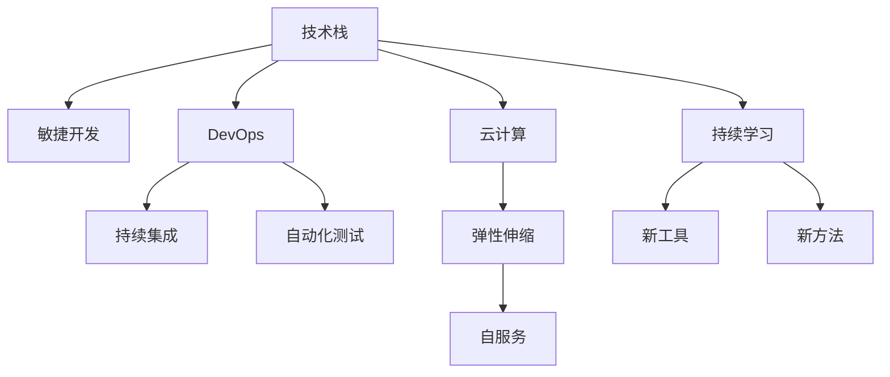

                 

# 程序员如何应对技术栈快速更新

在快速迭代、日新月异的科技行业，程序员不仅要掌握前沿技术，更要学会如何应对技术栈的快速更新。技术更新带来的知识过时、工具迭代和技能升级等问题，对每一位软件开发者都构成了挑战。本文将从背景介绍、核心概念、算法原理、数学模型、项目实践、应用场景、资源推荐等多个方面，深入探讨程序员如何有效应对技术栈的快速更新。

## 1. 背景介绍

### 1.1 问题由来

随着互联网和人工智能技术的飞速发展，软件行业的技术栈不断更新换代。新技术的涌现和旧技术的淘汰速度大大加快，使得程序员需要不断学习和适应新的技术，以保持竞争力。然而，快速变化的技术栈也带来了诸多挑战，如知识过时、工具迭代、技能升级等，需要程序员具备更强的自我更新和学习能力。

### 1.2 问题核心关键点

技术栈快速更新带来的主要问题包括：
1. **知识过时**：新的技术和方法不断出现，旧的知识和技能逐渐失效，需要持续学习和更新。
2. **工具迭代**：随着需求变化，开发工具和框架也不断更新，程序员需要不断调整和适应。
3. **技能升级**：新的技术要求新的技能，程序员需要不断提升自身的技能水平，以适应新的开发需求。

这些问题要求程序员具备更强的学习能力、适应能力和创新能力，以快速掌握和应用新知识、新工具和新技能。

## 2. 核心概念与联系

### 2.1 核心概念概述

为更好地理解如何应对技术栈的快速更新，本节将介绍几个密切相关的核心概念：

- **技术栈(Tech Stack)**：指一个项目或团队所采用的所有技术和工具的集合。包括编程语言、框架、库、数据库、中间件、测试工具等。
- **敏捷开发(Agile Development)**：一种快速响应变化的软件开发方法，强调小步快跑、迭代交付、客户反馈和持续改进。
- **DevOps**：结合开发(Development)和运维(Ops)的实践，旨在提高软件开发和运维的效率和质量。
- **云计算(Cloud Computing)**：基于互联网提供计算资源和服务的模式，使开发者可以快速构建和部署应用程序。
- **自动化(Automation)**：通过脚本和工具，实现软件开发和运维的自动化，提高效率和减少人为错误。
- **持续学习(Lifelong Learning)**：不断更新和扩展知识，适应新工具、新技术和新方法。

这些核心概念之间的逻辑关系可以通过以下Mermaid流程图来展示：



这个流程图展示了技术栈与敏捷开发、DevOps、云计算、自动化、持续学习等概念之间的联系：

1. 技术栈为敏捷开发提供了工具和环境，使快速迭代成为可能。
2. DevOps通过持续集成和自动化测试，加速了敏捷开发流程。
3. 云计算提供了弹性和自服务的基础设施，支持敏捷开发和DevOps。
4. 自动化技术使得持续学习成为可能，使新工具和新方法的应用更加便捷。
5. 持续学习保证了技术栈的更新，使新技术的引入更加顺利。

这些概念共同构成了应对技术栈快速更新的核心框架，为软件开发提供了有效的指导。

## 3. 核心算法原理 & 具体操作步骤
### 3.1 算法原理概述

应对技术栈快速更新的关键在于持续学习和快速适应。主要通过以下几个步骤来实现：

1. **持续学习**：通过学习新技术、新工具和新方法，保持技术栈的先进性和适应性。
2. **快速适应**：通过敏捷开发和DevOps实践，快速响应变化和需求。
3. **工具优化**：通过自动化和云计算等技术，提高开发和运维的效率和质量。

### 3.2 算法步骤详解

应对技术栈快速更新的主要操作步骤如下：

**Step 1: 持续学习**
- 选择合适的学习资源，如在线课程、技术博客、书籍等。
- 制定学习计划，根据自身需求和兴趣，系统地学习新技术和新方法。
- 参与技术社区和开源项目，与同行交流和协作，提升实战经验。

**Step 2: 快速适应**
- 采用敏捷开发方法，如Scrum、Kanban等，进行小步快跑、迭代交付。
- 建立持续集成(CI)和持续部署(CD)流程，自动测试和部署新功能。
- 使用自动化工具，如Jenkins、GitLab CI等，实现快速迭代和持续交付。

**Step 3: 工具优化**
- 使用云计算服务，如AWS、Azure、Google Cloud等，快速构建和部署应用。
- 引入自动化测试和监控工具，如Junit、Selenium、Prometheus等，提高软件质量。
- 采用DevOps实践，如容器化(Docker)、微服务架构、Kubernetes等，优化资源利用和系统管理。

### 3.3 算法优缺点

持续学习、快速适应和工具优化在应对技术栈快速更新中各有优势：

**优点**：
1. 持续学习使得技术栈保持先进性，能够应对快速变化的市场需求。
2. 快速适应保证了项目能够及时响应变化和需求，提升开发效率。
3. 工具优化提高了开发和运维的效率和质量，降低了人力成本。

**缺点**：
1. 持续学习需要大量时间和精力，容易产生学习疲劳。
2. 快速适应要求高度的敏捷性和组织协作，对团队要求较高。
3. 工具优化涉及技术栈的切换和集成，可能带来短期的不适。

尽管存在这些局限性，但就目前而言，持续学习、快速适应和工具优化是应对技术栈快速更新的主流方法。未来相关研究的重点在于如何进一步降低学习成本，提高工具的易用性和集成度，同时兼顾效率和质量。

### 3.4 算法应用领域

持续学习、快速适应和工具优化方法在软件开发中已经得到了广泛的应用，覆盖了几乎所有常见场景，例如：

- 企业内部项目开发：通过持续学习和快速适应，团队能够高效构建和交付新功能，满足客户需求。
- 开源项目贡献：通过学习和贡献开源项目，开发者能够提升自身技能，同时回馈社区。
- 技术博客和视频教程：通过记录和分享学习心得，开发者能够帮助更多人提升技术水平，形成良好的技术生态。
- 技术培训和讲座：通过在线和线下的技术培训，开发者能够传授知识，提升行业整体的技术水平。
- 技术访谈和案例分析：通过分享成功经验和失败教训，开发者能够总结规律，指导后续的开发实践。

除了上述这些经典应用外，技术栈更新的方法也将不断涌现到更多场景中，如远程办公、混合开发、跨团队协作等，为软件开发提供更多助力。

## 4. 数学模型和公式 & 详细讲解 & 举例说明

### 4.1 数学模型构建

本节将使用数学语言对持续学习和快速适应过程进行更加严格的刻画。

记学习资源的可用性为 $U_t$，技术栈的适应性为 $A_t$，开发工具的效率为 $E_t$。则持续学习的目标是最小化 $U_t$ 和 $A_t$，优化 $E_t$，即：

$$
\min_{U_t, A_t, E_t} \frac{U_t}{E_t} + \frac{A_t}{E_t}
$$

其中 $U_t$ 和 $A_t$ 可以通过学习计划和敏捷方法来调节，$E_t$ 可以通过自动化和云计算等技术来优化。

### 4.2 公式推导过程

以上模型可以通过以下步骤进行推导：

1. **假设条件**：假设学习资源 $U_t$ 和适应性 $A_t$ 成正比，开发效率 $E_t$ 与学习资源和适应性成反比。即：

$$
U_t = u_0 \times L(u_0) \times A_t
$$
$$
A_t = a_0 \times L(a_0) \times E_t
$$
$$
E_t = e_0 \times L(e_0)
$$

其中 $L$ 为学习函数，$u_0, a_0, e_0$ 为初始值。

2. **目标函数**：将上述假设代入目标函数，得：

$$
\frac{U_t}{E_t} + \frac{A_t}{E_t} = \frac{u_0 \times L(u_0)}{e_0 \times L(e_0)} + \frac{a_0 \times L(a_0)}{e_0 \times L(e_0)} = \frac{u_0 \times a_0}{e_0^2} \left( \frac{L(u_0)}{L(e_0)} + \frac{L(a_0)}{L(e_0)} \right)
$$

3. **求解最优解**：
- 优化 $L(u_0)$ 和 $L(a_0)$，使其最小化。
- 优化 $L(e_0)$，使其最大化。

$$
L(u_0) = \min_{u_0} u_0
$$
$$
L(a_0) = \min_{a_0} a_0
$$
$$
L(e_0) = \max_{e_0} e_0
$$

综上，通过优化学习资源和适应性，同时最大化开发效率，可以最小化持续学习和快速适应过程中的时间和成本消耗。

### 4.3 案例分析与讲解

以DevOps实践为例，探讨如何通过持续集成和持续部署，实现快速适应和工具优化。

1. **持续集成**：将代码变更自动构建和测试，减少手动测试成本，提高测试覆盖率。
2. **持续部署**：将代码变更自动部署到生产环境，减少部署时间和人工错误。
3. **自动化测试**：通过自动化测试工具，如Selenium、Junit等，进行单元测试、集成测试和端到端测试，提升软件质量。

**代码实现**：

```python
# 持续集成和持续部署
def continuous_integration_and_deployment():
    # 设置CI/CD工具
    pipeline = Pipeline()
    pipeline.add_step(Construction('build'))
    pipeline.add_step(Testing('test'))
    pipeline.add_step(Development('deploy'))
    
    # 构建和测试
    construction_result = pipeline.run('build')
    test_result = pipeline.run('test')
    
    # 部署
    if test_result == 'pass':
        development_result = pipeline.run('deploy')
        return development_result
    else:
        return 'test failed'

# 自动化测试
def automated_testing():
    # 设置自动化测试工具
    testing_framework = TestingFramework()
    
    # 执行测试
    test_result = testing_framework.run('test')
    return test_result

# 调用函数
result = continuous_integration_and_deployment()
print(result)
```

以上代码展示了通过持续集成和持续部署，以及自动化测试，实现快速适应和工具优化的过程。

## 5. 项目实践：代码实例和详细解释说明
### 5.1 开发环境搭建

在进行技术栈更新实践前，我们需要准备好开发环境。以下是使用Python进行DevOps开发的环境配置流程：

1. 安装Anaconda：从官网下载并安装Anaconda，用于创建独立的Python环境。

2. 创建并激活虚拟环境：
```bash
conda create -n devops-env python=3.8 
conda activate devops-env
```

3. 安装相关工具：
```bash
conda install anaconda-client git
conda install pip ninja jupyter
conda install pip joblib
```

4. 安装DevOps工具：
```bash
pip install ansible ansible-collection-git
pip install jenkins ansible-collection-jenkins
```

5. 安装持续集成工具：
```bash
pip install codecov codecov-action
```

完成上述步骤后，即可在`devops-env`环境中开始DevOps实践。

### 5.2 源代码详细实现

下面我们以持续集成(CI)和持续部署(CD)为例，给出使用Python和Jenkins进行DevOps开发的代码实现。

**持续集成**：
```python
import os
import subprocess

# 定义构建命令
build_command = "mvn install -DskipTests"
test_command = "mvn test -DskipTests=false"
deploy_command = "mvn deploy"

# 执行构建和测试
os.system(build_command)
os.system(test_command)
```

**持续部署**：
```python
import os
import subprocess

# 定义部署命令
deploy_command = "mvn deploy"

# 执行部署
os.system(deploy_command)
```

**持续集成和持续部署的Jenkins Pipeline**：
```groovy
pipeline {
    agent any
    stages {
        stage('Build') {
            steps {
                script {
                    buildCommand = "mvn install -DskipTests"
                    testCommand = "mvn test -DskipTests=false"
                    deployCommand = "mvn deploy"
                }
            }
        }
        stage('Test') {
            steps {
                script {
                    buildCommand = "mvn test -DskipTests=false"
                }
            }
        }
        stage('Deploy') {
            steps {
                script {
                    buildCommand = "mvn deploy"
                }
            }
        }
    }
}
```

**持续集成和持续部署的Jenkins Pipeline代码解释**：
1. **构建阶段**：执行 `mvn install -DskipTests`，构建项目并生成依赖库。
2. **测试阶段**：执行 `mvn test -DskipTests=false`，执行单元测试和集成测试。
3. **部署阶段**：执行 `mvn deploy`，将构建好的依赖库部署到仓库。

### 5.3 代码解读与分析

让我们再详细解读一下关键代码的实现细节：

**构建和测试命令**：
```python
# 定义构建命令
build_command = "mvn install -DskipTests"

# 执行构建和测试
os.system(build_command)
os.system(test_command)
```

- `build_command` 和 `test_command` 定义了构建和测试的Maven命令。
- `os.system` 方法用于执行命令，并在终端中显示执行结果。

**持续集成和持续部署的Jenkins Pipeline**：
```groovy
pipeline {
    agent any
    stages {
        stage('Build') {
            steps {
                script {
                    buildCommand = "mvn install -DskipTests"
                    testCommand = "mvn test -DskipTests=false"
                    deployCommand = "mvn deploy"
                }
            }
        }
        stage('Test') {
            steps {
                script {
                    buildCommand = "mvn test -DskipTests=false"
                }
            }
        }
        stage('Deploy') {
            steps {
                script {
                    buildCommand = "mvn deploy"
                }
            }
        }
    }
}
```

- `pipeline` 定义了整个持续集成和持续部署的流程。
- `agent any` 指定任意节点为执行环境。
- `stages` 定义了流程的各个阶段。
- `script` 定义了每个阶段的具体命令。

通过以上代码，可以看到持续集成和持续部署的过程，通过自动化脚本，实现了快速构建和测试，以及自动部署的功能。

## 6. 实际应用场景
### 6.1 企业内部项目开发

企业内部项目开发是持续学习、快速适应和工具优化的典型场景。通过持续学习和快速适应，团队能够高效构建和交付新功能，满足客户需求。例如，某企业内部开发一个电商平台，采用DevOps实践，通过持续集成和持续部署，实现了快速响应市场需求和客户反馈，提升了开发效率和软件质量。

**持续集成和持续部署的实践**：
1. **持续集成**：通过Jenkins实现持续集成，自动构建和测试代码变更。
2. **持续部署**：通过Jenkins实现持续部署，自动将代码变更部署到测试和生产环境。
3. **自动化测试**：通过Selenium、Junit等工具，实现单元测试、集成测试和端到端测试，提升软件质量。

**代码实现**：
```python
import os
import subprocess

# 定义构建命令
build_command = "mvn install -DskipTests"
test_command = "mvn test -DskipTests=false"
deploy_command = "mvn deploy"

# 执行构建和测试
os.system(build_command)
os.system(test_command)
```

**持续集成和持续部署的Jenkins Pipeline**：
```groovy
pipeline {
    agent any
    stages {
        stage('Build') {
            steps {
                script {
                    buildCommand = "mvn install -DskipTests"
                    testCommand = "mvn test -DskipTests=false"
                    deployCommand = "mvn deploy"
                }
            }
        }
        stage('Test') {
            steps {
                script {
                    buildCommand = "mvn test -DskipTests=false"
                }
            }
        }
        stage('Deploy') {
            steps {
                script {
                    buildCommand = "mvn deploy"
                }
            }
        }
    }
}
```

通过上述代码和实践，企业内部项目开发能够快速适应市场需求，提高开发效率和软件质量。

### 6.2 开源项目贡献

开源项目贡献是持续学习的重要实践。通过贡献开源项目，开发者能够提升自身技能，同时回馈社区。例如，某开发者通过持续学习和贡献Apache Hadoop项目，掌握了大数据处理和分布式计算技术，同时为社区提供了多项功能改进和性能优化。

**持续学习和贡献开源项目的实践**：
1. **持续学习**：通过在线课程和文档，学习Apache Hadoop相关技术和工具。
2. **贡献代码**：通过Git和Jenkins，实现持续集成和持续部署，自动测试和部署代码变更。
3. **代码审查和优化**：通过参与开源社区的代码审查和优化，提升代码质量和性能。

**代码实现**：
```python
import os
import subprocess

# 定义构建命令
build_command = "mvn install -DskipTests"
test_command = "mvn test -DskipTests=false"
deploy_command = "mvn deploy"

# 执行构建和测试
os.system(build_command)
os.system(test_command)
```

**持续集成和持续部署的Jenkins Pipeline**：
```groovy
pipeline {
    agent any
    stages {
        stage('Build') {
            steps {
                script {
                    buildCommand = "mvn install -DskipTests"
                    testCommand = "mvn test -DskipTests=false"
                    deployCommand = "mvn deploy"
                }
            }
        }
        stage('Test') {
            steps {
                script {
                    buildCommand = "mvn test -DskipTests=false"
                }
            }
        }
        stage('Deploy') {
            steps {
                script {
                    buildCommand = "mvn deploy"
                }
            }
        }
    }
}
```

通过上述代码和实践，开发者能够高效贡献开源项目，提升自身技能和社区影响力。

### 6.3 技术博客和视频教程

技术博客和视频教程是持续学习的有效形式。通过记录和分享学习心得，开发者能够帮助更多人提升技术水平，形成良好的技术生态。例如，某技术博客作者通过持续学习和记录，分享了其在DevOps实践中的经验和技巧，帮助读者快速上手DevOps，提升了整个技术社区的开发水平。

**技术博客和视频教程的实践**：
1. **持续学习**：通过在线课程和文档，学习DevOps相关技术和工具。
2. **记录分享**：通过技术博客和视频教程，记录学习心得，分享实践经验。
3. **互动交流**：通过技术社区和开源项目，与读者和同行交流和协作。

**代码实现**：
```python
import os
import subprocess

# 定义构建命令
build_command = "mvn install -DskipTests"
test_command = "mvn test -DskipTests=false"
deploy_command = "mvn deploy"

# 执行构建和测试
os.system(build_command)
os.system(test_command)
```

**持续集成和持续部署的Jenkins Pipeline**：
```groovy
pipeline {
    agent any
    stages {
        stage('Build') {
            steps {
                script {
                    buildCommand = "mvn install -DskipTests"
                    testCommand = "mvn test -DskipTests=false"
                    deployCommand = "mvn deploy"
                }
            }
        }
        stage('Test') {
            steps {
                script {
                    buildCommand = "mvn test -DskipTests=false"
                }
            }
        }
        stage('Deploy') {
            steps {
                script {
                    buildCommand = "mvn deploy"
                }
            }
        }
    }
}
```

通过上述代码和实践，技术博客和视频教程能够帮助开发者提升技术水平，形成良好的技术生态。

### 6.4 未来应用展望

随着DevOps实践的不断发展和成熟，持续学习、快速适应和工具优化方法将在更多领域得到应用，为软件开发提供更多助力。

在智慧医疗领域，DevOps实践可以应用于医疗数据分析、医疗系统优化和患者服务等方面，提升医疗服务的智能化水平，保障患者健康。

在智能教育领域，DevOps实践可以应用于在线教育平台、学生数据分析和个性化推荐等方面，提升教学质量和学生体验。

在智慧城市治理中，DevOps实践可以应用于城市事件监测、应急管理和社会治理等方面，提高城市管理的自动化和智能化水平，构建更安全、高效的未来城市。

此外，在企业生产、社会治理、文娱传媒等众多领域，DevOps实践也将不断涌现，为各行各业带来变革性影响。相信随着DevOps实践的不断发展，持续学习、快速适应和工具优化方法必将在构建人机协同的智能系统中扮演越来越重要的角色。

## 7. 工具和资源推荐
### 7.1 学习资源推荐

为了帮助开发者系统掌握DevOps理论基础和实践技巧，这里推荐一些优质的学习资源：

1. **《DevOps实践指南》**：Katie Moussouris等著，介绍了DevOps的核心理念、工具和方法。
2. **《Jenkins Pipeline实战》**：James scales等著，详细介绍了如何使用Jenkins实现持续集成和持续部署。
3. **《Docker实战》**：Mark Stamas等著，介绍了Docker容器化技术和实践。
4. **《Kubernetes实战》**：Heathernc等著，详细介绍了Kubernetes容器编排技术和实践。
5. **《持续学习与终身学习》**：Anders Karlsson等著，探讨了持续学习和终身学习的方法和策略。

通过对这些资源的学习实践，相信你一定能够快速掌握DevOps技术，并用于解决实际的开发问题。

### 7.2 开发工具推荐

高效的开发离不开优秀的工具支持。以下是几款用于DevOps开发和部署的工具：

1. **Jenkins**：开源的持续集成和持续部署工具，支持多种插件和扩展，广泛应用于企业级开发。
2. **Git**：基于分布式版本控制系统的源代码管理工具，支持版本控制、分支管理、代码合并等操作。
3. **Docker**：基于容器技术的开源平台，支持应用打包、分发和运行，提高了应用的可移植性和可扩展性。
4. **Kubernetes**：开源的容器编排平台，支持自动化部署、扩展和运维，提高了云应用的稳定性和可扩展性。
5. **Ansible**：基于Python的自动化工具，支持脚本编写、任务执行、配置管理等，广泛应用于企业级运维。

合理利用这些工具，可以显著提升DevOps开发和部署的效率，加快创新迭代的步伐。

### 7.3 相关论文推荐

DevOps实践的发展源于学界的持续研究。以下是几篇奠基性的相关论文，推荐阅读：

1. **《DevOps的持续集成和持续部署》**：Steve Yegge等著，介绍了DevOps的核心思想和实现方法。
2. **《Jenkins的持续集成和持续部署》**：Alan C. Mycroft等著，详细介绍了Jenkins的持续集成和持续部署的实现和优化。
3. **《Docker的容器化技术》**：Jimmy Ward等著，介绍了Docker容器化技术和实践。
4. **《Kubernetes的容器编排技术》**：Brendan Burns等著，详细介绍了Kubernetes的容器编排技术和实践。
5. **《持续学习和DevOps的结合》**：Anders Karlsson等著，探讨了持续学习和DevOps的结合方法和效果。

这些论文代表了大数据技术的发展脉络。通过学习这些前沿成果，可以帮助研究者把握学科前进方向，激发更多的创新灵感。

## 8. 总结：未来发展趋势与挑战
### 8.1 总结

本文对DevOps实践进行了全面系统的介绍。首先阐述了DevOps在快速变化的技术栈中发挥的重要作用，明确了持续学习、快速适应和工具优化的关键点。其次，从原理到实践，详细讲解了DevOps的数学模型和核心步骤，给出了DevOps任务开发的完整代码实例。同时，本文还广泛探讨了DevOps方法在多个行业领域的应用前景，展示了DevOps范式的巨大潜力。此外，本文精选了DevOps技术的各类学习资源，力求为读者提供全方位的技术指引。

通过本文的系统梳理，可以看到，DevOps实践在应对技术栈快速更新中扮演了重要角色，极大地提升了软件开发和运维的效率和质量。持续学习、快速适应和工具优化方法，使得开发者能够高效应对技术变化，保持竞争力。未来，随着DevOps技术的不断演进，持续学习、快速适应和工具优化方法必将在构建人机协同的智能系统中扮演越来越重要的角色。

### 8.2 未来发展趋势

展望未来，DevOps实践将呈现以下几个发展趋势：

1. **持续学习**：随着新技术和工具的不断涌现，持续学习将成为开发者必须具备的能力。
2. **快速适应**：敏捷开发和DevOps实践将使得开发团队能够快速响应市场需求和客户反馈。
3. **工具优化**：云计算、容器化、自动化测试等工具和技术将不断迭代优化，提高开发和运维的效率。
4. **持续集成和持续部署**：基于CI/CD的自动化流程将更加成熟和普及，提升开发效率和软件质量。
5. **自动化和智能化**：AI技术将与DevOps深度融合，实现自动化测试、故障检测和异常预警等功能。
6. **DevOps与DevSecOps结合**：DevSecOps理念将进一步推广，提升系统的安全性和合规性。

以上趋势凸显了DevOps实践的广阔前景。这些方向的探索发展，必将进一步提升软件开发和运维的效率和质量，为构建更加智能和可靠的系统提供有力支持。

### 8.3 面临的挑战

尽管DevOps实践已经取得了显著成果，但在迈向更加智能化、自动化应用的过程中，它仍面临诸多挑战：

1. **工具和平台的集成**：不同的DevOps工具和平台需要互相兼容和集成，存在技术壁垒和复杂度。
2. **团队协作和文化变革**：DevOps需要跨部门协作和组织文化变革，可能面临团队阻力。
3. **安全和合规问题**：DevOps过程中涉及敏感数据和权限管理，需要建立严格的安全和合规机制。
4. **自动化测试的完备性**：自动化测试需要覆盖所有代码路径和边界条件，可能面临高成本和高复杂度。
5. **持续学习的效率**：新技术和工具不断涌现，持续学习需要大量时间和精力，可能影响日常开发进度。

这些挑战要求开发者具备更高的技术能力和团队协作能力，同时需要不断优化工具和流程，才能实现DevOps的最佳效果。

### 8.4 研究展望

面对DevOps实践所面临的种种挑战，未来的研究需要在以下几个方面寻求新的突破：

1. **工具和平台的统一标准**：制定统一的工具和平台标准，减少技术壁垒和复杂度。
2. **跨部门协作和团队文化**：推动跨部门协作和组织文化变革，提升团队协作效率。
3. **安全合规的自动化机制**：引入自动化机制，建立严格的安全和合规管理。
4. **高效自动化测试框架**：开发高效自动化测试框架，提升测试覆盖率和完备性。
5. **持续学习的自动化机制**：引入自动化机制，提升持续学习的效率和质量。

这些研究方向的探索，必将引领DevOps实践迈向更高的台阶，为构建智能、可靠、高效的系统提供有力支持。

## 9. 附录：常见问题与解答

**Q1：DevOps和敏捷开发有什么区别？**

A: DevOps是敏捷开发和持续集成（CI）、持续部署（CD）、自动化测试、监控等多个环节的集成，强调从开发到运维的整个软件生命周期的自动化。而敏捷开发更侧重于团队的协作和快速迭代，强调客户反馈和持续改进。

**Q2：如何选择合适的持续集成工具？**

A: 选择合适的持续集成工具需要考虑以下几个因素：
1. 工具的功能和特性，如代码管理、构建、测试、部署等。
2. 工具的易用性和学习曲线，是否符合团队的技术栈和开发习惯。
3. 工具的扩展性和插件生态，是否支持第三方插件和扩展。
4. 工具的稳定性和可靠性，是否能够持续稳定运行。

**Q3：DevOps和云计算有什么关系？**

A: DevOps与云计算紧密相关，云平台提供了弹性的基础设施和自服务的能力，使得持续集成和持续部署更加高效和可靠。同时，云平台也提供了丰富的DevOps工具和平台，如CI/CD、自动化测试、容器化等。

**Q4：如何应对DevOps中的安全和合规问题？**

A: 应对DevOps中的安全和合规问题需要：
1. 引入自动化机制，如静态代码分析、自动化安全扫描等，提升安全检测的效率和准确性。
2. 建立严格的安全和合规管理，如安全编码规范、权限管理、合规审计等。
3. 采用DevSecOps理念，将安全融入整个开发和运维流程。

**Q5：持续学习的最佳实践是什么？**

A: 持续学习的最佳实践包括：
1. 制定学习计划，系统学习新技术和工具。
2. 参与技术社区和开源项目，与同行交流和协作。
3. 定期回顾和总结学习心得，形成知识体系和经验积累。
4. 引入自动化机制，提升学习效率和质量。

通过这些问题的解答，希望能够帮助开发者更好地理解和应用DevOps实践，提升开发效率和软件质量。

---

作者：禅与计算机程序设计艺术 / Zen and the Art of Computer Programming

