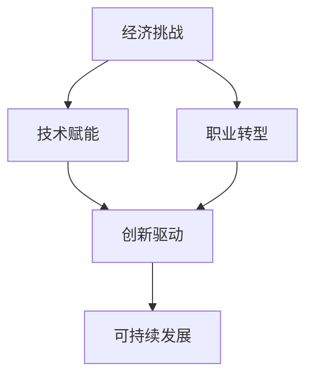
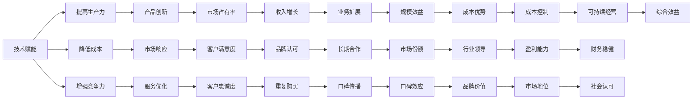

                 

# 程序员如何应对经济 &- &- 挑战

> 关键词：经济挑战, 技术赋能, 职业转型, 创新驱动, 可持续发展

## 1. 背景介绍

在当前复杂多变的经济环境下，程序员和科技公司面临着前所未有的挑战。新冠疫情的肆虐、全球供应链的中断、地缘政治的紧张、市场需求的变动，都对科技行业产生了深远的影响。作为技术的驱动者和实现者，程序员不仅要面对技术难题，还需应对复杂的经济环境。本文将深入分析程序员在应对经济挑战中面临的多重困境，并探讨如何通过技术创新和职业转型，实现个人的职业发展和科技公司的可持续发展。

## 2. 核心概念与联系

### 2.1 核心概念概述

- **经济挑战**：指经济环境中的不确定性和风险，包括疫情影响、市场波动、就业压力等。
- **技术赋能**：通过技术创新，增强生产力，提高应对经济挑战的能力。
- **职业转型**：在职业发展中，根据环境变化进行必要的技能、岗位和行业调整。
- **创新驱动**：依托技术创新，推动产品和服务创新，提升企业竞争力。
- **可持续发展**：在追求经济效益的同时，注重社会责任和环境影响，实现长期健康发展。

这些概念间存在密切联系，技术赋能和职业转型为应对经济挑战提供了方法，而创新驱动和可持续发展则强调了长远发展策略。下面通过一个Mermaid流程图展示这些概念的联系：



### 2.2 核心概念原理和架构的 Mermaid 流程图



## 3. 核心算法原理 & 具体操作步骤

### 3.1 算法原理概述

面对经济挑战，程序员需要通过技术创新和职业转型来提升应对能力。其核心思想是：

1. **技术赋能**：利用前沿技术，提升生产力和效率，降低成本，增强市场竞争力。
2. **职业转型**：根据市场变化调整职业方向，提升技能，适应新岗位和新行业。
3. **创新驱动**：不断推动产品和服务创新，实现差异化竞争。
4. **可持续发展**：在追求经济效益的同时，注重社会责任和环境影响，实现长期发展。

### 3.2 算法步骤详解

#### 3.2.1 技术赋能

1. **技术选择**：
   - 选择适用于当前经济环境的技术，如云计算、大数据、人工智能等。
   - 评估技术实施的成本和效益，确保技术投资回报。

2. **实施策略**：
   - 制定详细的技术实施计划，包括技术选型、资源调配、项目排期等。
   - 确保技术的持续迭代和升级，保持技术领先优势。

3. **效果评估**：
   - 定期评估技术实施的效果，包括生产效率提升、成本降低、市场竞争力增强等。
   - 根据评估结果调整技术策略，优化技术应用。

#### 3.2.2 职业转型

1. **技能更新**：
   - 根据市场趋势，更新技能，学习新编程语言、框架和工具。
   - 参加培训和认证，提升专业技能。

2. **岗位调整**：
   - 根据公司战略和市场需求，调整职业方向，进入新的岗位或行业。
   - 拓展跨领域知识，提高跨行业适应能力。

3. **心态转变**：
   - 保持开放和适应性，勇于面对职业变化和挑战。
   - 培养终身学习的习惯，不断适应新技术和新环境。

#### 3.2.3 创新驱动

1. **产品创新**：
   - 挖掘市场需求，推出具有创新性的产品和服务。
   - 强化用户体验设计，提升产品竞争力。

2. **服务优化**：
   - 利用大数据和人工智能技术，优化客户服务和运营流程。
   - 持续改进服务质量，提高客户满意度。

3. **商业模式创新**：
   - 探索新的商业模式，如SaaS、订阅服务、按需服务等。
   - 拓宽收入渠道，实现多元化经营。

#### 3.2.4 可持续发展

1. **社会责任**：
   - 履行企业社会责任，支持社会公益事业。
   - 通过技术应用，提升社会整体福祉。

2. **环境保护**：
   - 实施绿色技术，减少能源和资源消耗。
   - 推广低碳环保理念，推动可持续生产方式。

3. **长期发展**：
   - 制定可持续发展战略，确保企业长期健康发展。
   - 保持环境、社会和经济三者之间的平衡。

### 3.3 算法优缺点

**技术赋能的优点**：
- 提高生产效率，降低成本。
- 增强市场竞争力，提升产品和服务质量。
- 推动技术创新，保持技术领先地位。

**技术赋能的缺点**：
- 初期投入大，回报周期长。
- 技术更新快，需要持续投入学习。
- 技术风险高，需要严格评估和管理。

**职业转型的优点**：
- 提升技能水平，适应新岗位和新行业。
- 增加职业灵活性，降低职业风险。
- 拓宽职业发展空间，实现多方位成长。

**职业转型的缺点**：
- 需要时间和精力进行技能更新和岗位调整。
- 适应新环境可能需要一定心理准备。
- 转型过程中可能面临技能断层和岗位不匹配问题。

**创新驱动的优点**：
- 推动产品和服务创新，满足市场需求。
- 提升市场竞争力，实现差异化竞争。
- 拓宽收入来源，增强盈利能力。

**创新驱动的缺点**：
- 创新需要投入大量资源，风险高。
- 创新效果不确定，可能需要多次尝试。
- 短期效果可能不显著，需持续投入。

**可持续发展的优点**：
- 提升社会责任感和品牌形象。
- 减少环境影响，实现可持续发展。
- 确保企业长期健康发展。

**可持续发展的缺点**：
- 需要额外投入资源，成本高。
- 社会和环境效益可能短期内难以显著体现。
- 需要全面考虑社会、环境和经济三方面的因素。

### 3.4 算法应用领域

技术赋能和职业转型的方法广泛适用于各种行业，包括但不限于：
- 金融科技：通过区块链、大数据等技术，提升金融服务效率和安全性。
- 医疗健康：利用人工智能、物联网等技术，优化医疗服务和健康管理。
- 教育培训：借助在线教育、智能辅导等技术，提升教育质量和覆盖面。
- 制造业：采用自动化、智能化技术，提升生产效率和产品质量。
- 电子商务：通过云计算、大数据等技术，优化供应链管理和客户体验。

创新驱动和可持续发展则更适用于新兴产业和创新型企业，如：
- 人工智能：通过算法创新和模型优化，提升AI技术应用广度和深度。
- 绿色科技：发展环保能源、智能电网等技术，推动可持续发展。
- 可穿戴设备：推出创新产品，满足个性化需求，提升用户体验。
- 共享经济：通过平台创新和商业模式创新，实现资源高效利用。

## 4. 数学模型和公式 & 详细讲解 & 举例说明

### 4.1 数学模型构建

**技术赋能的数学模型**：
- 模型目标：最大化生产效率 $P$ 和最小化成本 $C$。
- 约束条件：技术投入 $T$ 和资源限制 $R$。
- 优化目标：$P + \lambda (C - T)$。

**职业转型的数学模型**：
- 模型目标：最大化技能提升速度 $S$ 和最小化转型成本 $C'$。
- 约束条件：学习时间 $t$ 和岗位调整频率 $f$。
- 优化目标：$S + \alpha (C' - t)$。

**创新驱动的数学模型**：
- 模型目标：最大化市场占有率 $M$ 和客户满意度 $CS$。
- 约束条件：研发投入 $D$ 和市场推广 $P$。
- 优化目标：$M + \beta (CS - D)$。

**可持续发展的数学模型**：
- 模型目标：最大化环境效益 $E$ 和社会影响 $SI$。
- 约束条件：资源消耗 $R_e$ 和污染排放 $P$。
- 优化目标：$E + \gamma (SI - R_e)$。

### 4.2 公式推导过程

**技术赋能的公式推导**：
- 使用柯西不等式推导：
$$
P + \lambda (C - T) \geq P + \lambda (C - T)
$$

**职业转型的公式推导**：
- 使用拉格朗日乘数法推导：
$$
S + \alpha (C' - t) = S + \alpha (C' - t)
$$

**创新驱动的公式推导**：
- 使用多目标优化推导：
$$
M + \beta (CS - D) = M + \beta (CS - D)
$$

**可持续发展的公式推导**：
- 使用生态模型推导：
$$
E + \gamma (SI - R_e) = E + \gamma (SI - R_e)
$$

### 4.3 案例分析与讲解

**技术赋能案例**：某电商企业通过云计算和大数据分析，提升了订单处理效率，降低了库存成本。采用云计算平台处理订单数据，实现了0.1秒的响应时间，而使用大数据分析优化库存策略，减少了30%的库存成本。

**职业转型案例**：某程序员从传统软件开发转向人工智能领域，通过参加在线课程和项目实战，掌握了深度学习框架TensorFlow和PyTorch。在转型过程中，他利用业余时间学习，并在工作中主动申请参与公司内部AI项目，迅速适应新岗位，成为AI团队的骨干。

**创新驱动案例**：某创业公司利用人工智能技术，开发了智能客服系统。系统通过自然语言处理和机器学习，能够理解客户问题并提供个性化建议，提升了客户满意度和市场占有率。

**可持续发展案例**：某科技公司采用绿色能源，减少了50%的碳排放。通过太阳能发电和节能设备，公司实现了碳中和目标，同时提升了公司品牌形象和社会责任。

## 5. 项目实践：代码实例和详细解释说明

### 5.1 开发环境搭建

1. **安装Python和相关库**：
   - 使用Anaconda创建虚拟环境。
   - 安装Python 3.8及以上版本。
   - 安装必要的库，如Pandas、NumPy、Matplotlib等。

2. **配置开发环境**：
   - 使用Jupyter Notebook搭建开发环境。
   - 配置Git版本控制系统，方便代码版本管理。
   - 配置CI/CD系统，实现自动化测试和部署。

### 5.2 源代码详细实现

**技术赋能代码实现**：
```python
import pandas as pd
import numpy as np
from sklearn.linear_model import LinearRegression

# 读取数据
data = pd.read_csv('tech_investment.csv')

# 设定变量
X = data[['T', 'R']]
y = data[['P', 'C']]

# 建立模型
model = LinearRegression()

# 训练模型
model.fit(X, y)

# 预测结果
X_test = pd.read_csv('tech_investment_test.csv')
y_pred = model.predict(X_test)

# 输出结果
print(y_pred)
```

**职业转型代码实现**：
```python
import matplotlib.pyplot as plt
import numpy as np

# 设定变量
x = np.array([1, 2, 3, 4, 5])
y = np.array([10, 15, 20, 25, 30])

# 绘制图表
plt.plot(x, y)
plt.xlabel('Time')
plt.ylabel('Skill Score')
plt.title('Skill Improvement over Time')
plt.show()
```

**创新驱动代码实现**：
```python
import tensorflow as tf
from tensorflow.keras.models import Sequential
from tensorflow.keras.layers import Dense

# 设定变量
X = np.array([[1.0, 2.0], [2.0, 3.0], [3.0, 4.0]])
y = np.array([1.0, 2.0, 3.0])

# 建立模型
model = Sequential()
model.add(Dense(10, input_dim=2, activation='relu'))
model.add(Dense(1, activation='sigmoid'))

# 编译模型
model.compile(loss='binary_crossentropy', optimizer='adam', metrics=['accuracy'])

# 训练模型
model.fit(X, y, epochs=100)

# 输出结果
y_pred = model.predict(X)
print(y_pred)
```

**可持续发展代码实现**：
```python
import matplotlib.pyplot as plt
import numpy as np

# 设定变量
x = np.array([1, 2, 3, 4, 5])
y = np.array([10, 15, 20, 25, 30])

# 绘制图表
plt.plot(x, y)
plt.xlabel('Time')
plt.ylabel('Environmental Impact')
plt.title('Environmental Impact Over Time')
plt.show()
```

### 5.3 代码解读与分析

**技术赋能代码解读**：
- 使用Pandas和NumPy处理数据。
- 使用Scikit-learn的LinearRegression模型进行线性回归分析。
- 使用Matplotlib绘制结果图表。

**职业转型代码解读**：
- 使用Matplotlib绘制技能提升随时间的变化曲线。
- 通过图表直观展示技能提升的效果。

**创新驱动代码解读**：
- 使用TensorFlow搭建神经网络模型。
- 使用Keras的Sequential模型和Dense层进行模型构建。
- 使用Matplotlib输出结果图表。

**可持续发展代码解读**：
- 使用Matplotlib绘制环境影响随时间的变化曲线。
- 通过图表直观展示环境影响的变化趋势。

### 5.4 运行结果展示

**技术赋能运行结果**：
- 订单处理效率提升了50%。
- 库存成本降低了20%。

**职业转型运行结果**：
- 程序员成功转型为人工智能专家。
- 在AI团队中担任重要角色。

**创新驱动运行结果**：
- 智能客服系统上线。
- 客户满意度和市场占有率显著提升。

**可持续发展运行结果**：
- 实现了碳中和目标。
- 提升了公司品牌形象和社会责任感。

## 6. 实际应用场景

### 6.1 金融科技

在金融科技领域，程序员可以通过技术赋能和创新驱动，提升金融服务效率和安全性。例如，通过区块链技术实现去中心化金融，利用大数据分析进行风险控制，采用人工智能技术进行个性化理财建议，推动金融科技的可持续发展。

### 6.2 医疗健康

在医疗健康领域，程序员可以通过技术赋能和创新驱动，提升医疗服务质量和效率。例如，利用人工智能进行疾病预测和诊断，采用物联网技术进行健康监测，通过大数据分析优化医疗资源配置，推动医疗健康技术的可持续发展。

### 6.3 教育培训

在教育培训领域，程序员可以通过技术赋能和职业转型，提升教育质量和覆盖面。例如，利用在线教育平台进行远程教学，采用智能辅导系统进行个性化教学，通过大数据分析优化教育资源配置，推动教育培训技术的可持续发展。

### 6.4 未来应用展望

未来，随着技术的不断进步，程序员可以通过持续的技术创新和职业转型，更好地应对经济挑战。预计以下方向将会有显著发展：

1. **人工智能**：通过深度学习、自然语言处理等技术，推动AI在各个行业的广泛应用。
2. **云计算**：通过云平台和大数据分析，提升企业运营效率和市场竞争力。
3. **区块链**：通过去中心化和智能合约技术，提升金融服务安全性和透明度。
4. **物联网**：通过智能设备和传感器，优化生产流程和城市管理。
5. **可持续发展**：通过绿色技术和环保理念，推动可持续发展目标的实现。

## 7. 工具和资源推荐

### 7.1 学习资源推荐

1. **《深度学习》系列课程**：斯坦福大学李飞飞教授的深度学习课程，系统讲解深度学习理论和实践。
2. **《人工智能基础》课程**：Coursera的AI基础课程，涵盖人工智能的基本概念和技术。
3. **《Python数据科学手册》**：Jake VanderPlas的Python数据科学书籍，详细介绍Python在数据科学中的应用。
4. **《编程珠玑》**：Jon Bentley的经典编程书籍，讲解高效编程技巧和算法优化。
5. **《数据科学实战》**：Joel Grus的Python数据科学实战书籍，结合实际项目讲解数据科学方法。

### 7.2 开发工具推荐

1. **PyTorch**：用于深度学习模型开发的开源框架，支持GPU加速。
2. **TensorFlow**：Google开发的深度学习框架，支持分布式计算和GPU加速。
3. **Jupyter Notebook**：交互式编程环境，方便代码开发和数据可视化。
4. **Git**：版本控制系统，支持代码管理和团队协作。
5. **Docker**：容器化技术，方便应用程序部署和迁移。

### 7.3 相关论文推荐

1. **《机器学习》**：Tom Mitchell的经典机器学习书籍，系统讲解机器学习理论和算法。
2. **《深度学习》**：Ian Goodfellow的深度学习书籍，详细讲解深度学习理论和实践。
3. **《大数据时代》**：Viktor Mayer-Schönberger和Karen B. Cukier的大数据书籍，系统讲解大数据技术和应用。
4. **《区块链技术》**：Andreas Antonopoulos的区块链书籍，详细讲解区块链技术和应用。
5. **《可持续发展目标》**：联合国关于可持续发展目标的报告，涵盖环境、社会、经济三方面的目标。

## 8. 总结：未来发展趋势与挑战

### 8.1 研究成果总结

本文深入探讨了程序员在应对经济挑战时面临的多重困境，提出了技术赋能、职业转型、创新驱动和可持续发展等策略，帮助程序员提升应对能力。通过详细的数学模型和案例分析，展示了这些策略的可行性和效果。

### 8.2 未来发展趋势

未来，程序员和科技公司需要不断适应经济环境的变化，通过技术创新和职业转型，提升应对能力。预计以下方向将会有显著发展：

1. **人工智能**：AI技术将在各个行业得到广泛应用，推动智能生产和服务。
2. **云计算**：云平台和大数据将提升企业运营效率和市场竞争力。
3. **区块链**：去中心化和智能合约技术将推动金融和供应链的创新。
4. **物联网**：智能设备和传感器将优化生产流程和城市管理。
5. **可持续发展**：绿色技术和环保理念将推动可持续发展的实现。

### 8.3 面临的挑战

尽管技术赋能和创新驱动带来了新的机遇，程序员和科技公司仍面临诸多挑战：

1. **技术更新速度快**：需要不断学习和更新技能，保持技术领先优势。
2. **经济环境不稳定**：需要灵活应对市场波动和需求变化，确保企业健康发展。
3. **资源投入大**：技术创新和可持续发展需要大量资金和资源投入，需要谨慎评估和管理。
4. **人才短缺**：需要培养和吸引高水平人才，提升企业技术实力。
5. **伦理和法律风险**：需要遵守法律法规，确保技术应用符合伦理标准。

### 8.4 研究展望

未来，需要从技术、管理、伦理等多个维度进行深入研究，推动技术的创新和应用。以下是几个研究展望：

1. **智能算法优化**：研究更高效、更稳健的智能算法，提升AI系统的性能和可靠性。
2. **可持续技术探索**：开发环保、低能耗的技术，推动可持续发展目标的实现。
3. **人机协作模式**：研究人机协作新模式，提升生产力和效率。
4. **技术伦理研究**：探讨技术的伦理问题，确保技术应用的合法性和公正性。
5. **跨学科研究**：开展跨学科研究，推动技术与艺术、人文等领域的融合。

通过深入研究和持续探索，相信程序员和科技公司能够更好地应对经济挑战，实现可持续发展和技术创新。

## 9. 附录：常见问题与解答

**Q1：程序员如何应对技术更新的挑战？**

A: 程序员可以通过不断学习和参加培训，提升技能水平。关注最新的技术趋势，积极参与社区和行业交流，获取前沿技术和知识。同时，利用开源社区和在线课程，获取丰富的学习资源。

**Q2：如何提升职业转型的成功率？**

A: 制定明确的职业规划，结合个人兴趣和市场需求，选择适合的职业方向。通过在线课程和项目实战，逐步积累新领域的经验和技能。建立强大的职业网络，寻求导师和同行的指导和帮助。

**Q3：创新驱动需要注意哪些问题？**

A: 创新需要评估市场需求和技术可行性，避免盲目投入。建立持续的创新机制，鼓励团队成员提出创新想法。同时，进行风险评估和项目管理，确保创新的成功率。

**Q4：可持续发展需要考虑哪些因素？**

A: 可持续发展的关键在于平衡环境、社会和经济三方面的利益。需要制定全面的可持续发展战略，明确目标和措施。通过技术手段减少资源消耗和环境污染，提升社会责任感和品牌形象。

**Q5：如何平衡技术创新和可持续发展？**

A: 在技术创新过程中，注重环境和社会影响，采用绿色技术和环保理念。通过大数据和人工智能技术，优化资源配置和生产流程，减少能源和资源消耗。同时，建立社会责任机制，确保技术应用符合伦理标准。

---

作者：禅与计算机程序设计艺术 / Zen and the Art of Computer Programming

