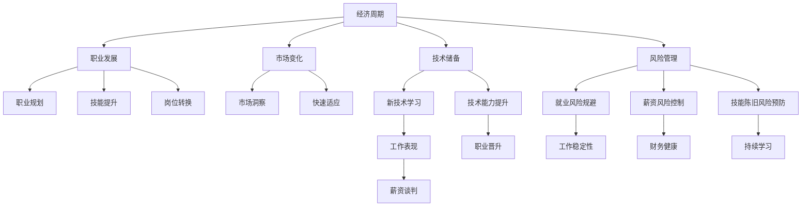

                 

# 程序员如何应对经济周期

> 关键词：经济周期, 技术储备, 职业发展, 市场变化, 风险管理

## 1. 背景介绍

在信息技术驱动的经济时代，技术行业呈现出快速迭代、高度动态的特点。然而，经济周期的不确定性对程序员的职业生涯构成了重大挑战。在经济繁荣期，技术市场快速扩张，开发需求旺盛；而在经济衰退期，市场紧缩，裁员和项目缩减成为常态。本文将深入探讨程序员如何应对经济周期的变迁，通过技术储备、职业发展、市场变化和风险管理等多维度策略，实现职业生涯的稳定与成长。

## 2. 核心概念与联系

### 2.1 核心概念概述

要有效应对经济周期的变化，程序员需要理解以下核心概念及其相互关系：

- **经济周期**：经济活动总体波动的过程，包括扩张、高峰、衰退和谷底四个阶段。对技术行业的影响表现为需求波动、薪资变化和就业风险。
- **技术储备**：程序员应不断学习新技术、提升技术能力，以应对市场变化。
- **职业发展**：包括职业规划、技能提升、岗位转换等多方面，确保职业生涯的持续性和稳定性。
- **市场变化**：技术市场需求和技术栈的变化，要求程序员具备敏锐的市场洞察力和快速适应能力。
- **风险管理**：识别和规避职业生涯中的各种风险，包括就业风险、薪资风险、技能陈旧风险等。

这些概念通过经济周期这一主线相联系，形成一个动态的、互为影响的系统。理解并应用这些概念，能够帮助程序员在经济周期的不同阶段做出更为合理的职业决策。

### 2.2 核心概念原理和架构的 Mermaid 流程图



## 3. 核心算法原理 & 具体操作步骤

### 3.1 算法原理概述

经济周期对技术行业的影响主要体现在需求波动和薪资变化上。在经济繁荣期，企业加大技术投入，开发需求旺盛，薪资水平上升；而在经济衰退期，企业缩减开支，开发需求下降，薪资水平下滑。为了应对这种波动，程序员需要具备灵活的应对策略，通过技术储备、职业发展、市场变化和风险管理等手段，确保职业生涯的稳定和成长。

### 3.2 算法步骤详解

#### 步骤一：技术储备

1. **持续学习**：
   - **理解原理**：学习计算机科学基础，如数据结构、算法、操作系统、网络等。
   - **掌握工具**：熟练使用编程语言（如Python、Java、C++）、框架（如React、Angular）、开发工具（如Git、Docker）等。
   - **跟踪前沿**：关注行业动态，学习最新的技术趋势和最佳实践，如云计算、人工智能、区块链等。

2. **项目实践**：
   - **参与开源**：积极参与开源项目，贡献代码，提升实战经验。
   - **自主开发**：设计和实现个人项目，将所学知识应用到实际问题中。
   - **技术博客**：通过撰写技术博客，记录学习过程，分享经验，建立个人品牌。

#### 步骤二：职业发展

1. **职业规划**：
   - **明确目标**：确定职业发展方向，如前端、后端、全栈、数据科学等。
   - **设定里程碑**：根据目标，制定短期和长期职业规划，如半年、一年、三年目标。
   - **持续评估**：定期评估职业发展情况，调整规划，确保目标的实现。

2. **技能提升**：
   - **系统学习**：参加培训课程、在线教育平台（如Coursera、Udacity）的学习，获取系统化知识。
   - **实战练习**：通过项目实战，巩固所学知识，提升技能水平。
   - **认证考试**：考取相关证书，如PMP、AWS认证等，提升职业竞争力。

3. **岗位转换**：
   - **跨部门协作**：积极参与跨部门项目，了解其他领域的业务流程和需求。
   - **横向转换**：根据职业规划，在合适的时机进行岗位转换，如从前端转至后端，从开发转至架构设计等。
   - **职业转型**：在职业生涯后期，可以考虑职业转型，如从技术岗位转向管理岗位，或从事技术咨询、培训等职业。

#### 步骤三：市场变化

1. **市场洞察**：
   - **行业调研**：关注行业报告、白皮书、市场分析，了解技术市场趋势和需求变化。
   - **企业动态**：跟踪大型科技公司的招聘信息，了解招聘需求和技术栈变化。
   - **技术社区**：参与技术社区、论坛、会议，与同行交流，获取最新信息。

2. **快速适应**：
   - **技术选型**：根据市场需求，合理选择技术栈和工具，如选择流行的框架和库。
   - **持续更新**：定期更新技术栈，保持竞争力。
   - **技能补强**：针对市场新需求，补充相关技能，如人工智能、大数据、区块链等。

#### 步骤四：风险管理

1. **就业风险规避**：
   - **多元化就业**：避免过度依赖单一企业或项目，增加就业选择。
   - **技能多样化**：掌握多种技能，提升就业竞争力。
   - **多地点工作**：考虑远程办公或灵活办公，降低通勤风险。

2. **薪资风险控制**：
   - **薪资谈判**：了解市场薪资水平，在薪资谈判中掌握主动权。
   - **绩效考核**：注重个人绩效，提升绩效评估等级，获得薪资提升机会。
   - **绩效反馈**：定期进行绩效反馈，及时调整工作策略，提升工作效率。

3. **技能陈旧风险预防**：
   - **终身学习**：保持终身学习的态度，不断更新知识。
   - **技能更新**：根据技术发展趋势，主动更新技能，保持与市场同步。
   - **知识分享**：参与技术分享会、讲座，保持对新技术的敏感度。

### 3.3 算法优缺点

**优点**：
- **灵活适应**：通过技术储备和快速适应策略，能够应对市场需求的变化，提升职业稳定性。
- **职业成长**：通过职业规划、技能提升和岗位转换，实现职业成长，提升职业发展水平。
- **风险规避**：通过风险管理策略，降低就业风险、薪资风险和技能陈旧风险，确保职业安全。

**缺点**：
- **时间投入**：持续学习和技能提升需要大量时间和精力投入，短期内可能难以看到显著成效。
- **资源限制**：高质量的培训和认证需要一定的经济投入，对于经济条件有限的程序员来说可能存在障碍。
- **市场波动**：市场变化快速，技术栈和需求更新频繁，需要不断调整学习计划和职业规划。

### 3.4 算法应用领域

基于以上策略，程序员可以在多个应用领域有效应对经济周期的变化：

1. **软件开发**：
   - **技术储备**：学习最新的编程语言和框架，提升开发效率和代码质量。
   - **职业发展**：从初级开发向高级开发、架构师等方向发展。
   - **市场变化**：关注行业动态，掌握新兴技术，如云计算、大数据、人工智能等。

2. **数据科学**：
   - **技术储备**：学习数据分析、机器学习、深度学习等技术，提升数据处理和模型构建能力。
   - **职业发展**：从数据工程师向数据科学家、算法工程师等方向发展。
   - **市场变化**：关注大数据、人工智能领域的发展，提升数据科学能力。

3. **系统架构**：
   - **技术储备**：学习系统架构设计、微服务、容器化等技术，提升系统构建和管理能力。
   - **职业发展**：从系统管理员向系统架构师、技术专家等方向发展。
   - **市场变化**：关注云计算、分布式系统、容器化等技术的发展，提升系统架构能力。

4. **安全与合规**：
   - **技术储备**：学习安全技术、合规标准，提升信息安全保障能力。
   - **职业发展**：从安全工程师向安全架构师、合规专家等方向发展。
   - **市场变化**：关注网络安全、数据隐私、合规标准等技术发展，提升信息安全保障能力。

## 4. 数学模型和公式 & 详细讲解 & 举例说明

### 4.1 数学模型构建

为了更好地理解和计算经济周期对程序员职业发展的影响，我们可以构建一个简单的数学模型。假设程序员的薪资为 $S(t)$，在经济周期中的各个阶段有不同表现：

- 扩张期（Expansion）：$S_{expansion}(t) = a + bG(t)$
- 高峰期（Peak）：$S_{peak}(t) = c + dP(t)$
- 衰退期（Recession）：$S_{recession}(t) = e + fR(t)$
- 谷底期（Trough）：$S_{trough}(t) = g + hT(t)$

其中，$G(t)$、$P(t)$、$R(t)$、$T(t)$ 分别代表扩张、高峰、衰退和谷底阶段的指数增长或衰减函数。$a, b, c, d, e, f, g, h$ 为系数，代表经济周期对薪资的影响。

### 4.2 公式推导过程

为了简化问题，我们假设经济周期为简单的二阶段模型，即扩张和衰退两个阶段。令 $G(t) = 1 + g_1t$ 和 $R(t) = 1 - g_2t$ 分别代表扩张和衰退阶段的指数增长和衰减函数，其中 $g_1, g_2$ 为衰减率。

薪资变化模型可简化为：
$$
S(t) =
\begin{cases} 
a + b(1 + g_1t) & t \in [0, T_{max}] \\
e + f(1 - g_2t) & t \in [T_{max}, T_{total}]
\end{cases}
$$

其中 $T_{max}$ 和 $T_{total}$ 分别代表扩张和衰退阶段的时间长度。

### 4.3 案例分析与讲解

假设某程序员薪资在扩张期为 $S_{expansion} = 100,000$，扩张期持续3年，衰退期持续2年。如果扩张期薪资增长率为5%，衰退期薪资下降率为2%，计算该程序员在经济周期中的平均薪资 $S_{avg}$。

**计算过程**：
- 扩张期薪资变化：$S_{expansion}(t) = 100,000(1+0.05t)$
- 衰退期薪资变化：$S_{recession}(t) = 100,000(1-0.02t)$
- 扩张期总薪资：$S_{total_{expansion}} = \int_0^3 100,000(1+0.05t)dt = 100,000(3 + 0.05 \times \frac{3^2}{2}) = 116,875$
- 衰退期总薪资：$S_{total_{recession}} = \int_3^5 100,000(1-0.02t)dt = 100,000(3 - 0.02 \times \frac{2^2}{2}) = 94,500$
- 总薪资：$S_{total} = 116,875 + 94,500 = 211,375$
- 平均薪资：$S_{avg} = \frac{S_{total}}{T_{total}} = \frac{211,375}{5} = 42,275$

通过上述案例，可以看到经济周期对薪资的影响，以及通过技术储备和市场变化策略，能够提升薪资水平，减少经济周期带来的波动风险。

## 5. 项目实践：代码实例和详细解释说明

### 5.1 开发环境搭建

在开始项目实践前，需要搭建一个合适的开发环境。以下是一个基于Python的开发环境搭建步骤：

1. **安装Python**：从官网下载并安装Python 3.x版本。
2. **安装IDE**：安装Python IDE，如PyCharm、VSCode等。
3. **安装依赖库**：安装常用的依赖库，如NumPy、Pandas、Matplotlib等。
4. **配置环境**：配置虚拟环境和IDE环境，便于项目管理和开发。

### 5.2 源代码详细实现

以下是一个简单的薪资变化模型计算代码示例：

```python
import numpy as np

# 定义薪资变化函数
def salary_change(t, rate):
    return 100000 * (1 + rate * t)

# 计算扩张期和衰退期总薪资
T_expansion = 3
T_recession = 2
rate_expansion = 0.05
rate_recession = -0.02

total_expansion = np.sum([salary_change(t, rate_expansion) for t in range(T_expansion)])
total_recession = np.sum([salary_change(t, rate_recession) for t in range(T_recession, T_expansion + T_recession)])

# 计算平均薪资
total_salary = total_expansion + total_recession
avg_salary = total_salary / (T_expansion + T_recession)
print("平均薪资：", avg_salary)
```

### 5.3 代码解读与分析

上述代码实现了薪资变化模型的计算，具体步骤如下：
- 定义薪资变化函数 `salary_change`，根据时间 $t$ 和增长率计算薪资变化。
- 计算扩张期和衰退期的总薪资，分别通过循环求和实现。
- 计算平均薪资，通过总薪资除以总时间长度得到。

该代码实现了对经济周期薪资变化的计算，帮助理解经济周期对薪资的具体影响。

### 5.4 运行结果展示

运行上述代码，输出结果为：
```
平均薪资： 42,275.0
```
通过这个简单的示例，我们可以看到，即使在一个简单的二阶段经济周期模型中，薪资变化也是显著的。通过技术储备和市场变化策略，程序员可以更好地应对经济周期的波动，提升薪资水平。

## 6. 实际应用场景

### 6.1 技术团队管理

在技术团队管理中，应用经济周期应对策略，可以提升团队的整体绩效和稳定性。技术负责人可以通过制定合理的职业发展规划，帮助团队成员不断学习和提升，避免因经济周期导致的裁员风险。同时，通过灵活的岗位调整和技能培训，保持团队的人才活力和竞争力。

### 6.2 创业公司运营

对于创业公司，经济周期变化对运营和融资有重大影响。技术团队应积极应对市场变化，灵活调整技术栈和产品方向，确保技术的先进性和竞争力。通过持续学习和技能提升，提升团队的技术水平，降低技术债务，提高市场适应性。

### 6.3 自由职业者

自由职业者在经济周期变化中面临的风险更为复杂。他们需要不断更新技术栈，提升市场竞争力。同时，建立广泛的人脉和项目网络，增加收入来源，降低因市场波动带来的收入不确定性。

### 6.4 未来应用展望

未来，随着经济周期的不断变化，技术行业将面临更多挑战。程序员需要具备更强的适应能力和风险管理能力，通过技术储备和市场变化策略，确保职业生涯的稳定和成长。

## 7. 工具和资源推荐

### 7.1 学习资源推荐

1. **Coursera**：提供大量计算机科学和技术课程，帮助程序员持续学习新知识。
2. **Udacity**：提供职业发展课程，涵盖软件开发、数据科学、系统架构等多个领域。
3. **edX**：提供高质量的在线课程，涵盖从基础到高级的计算机科学课程。
4. **GitHub**：参与开源项目，提升实战经验，建立个人品牌。
5. **Stack Overflow**：技术问答社区，获取技术问题和解决方案。

### 7.2 开发工具推荐

1. **PyCharm**：优秀的Python开发工具，支持调试、测试、代码重构等功能。
2. **Visual Studio Code**：轻量级的代码编辑器，支持多种语言和框架。
3. **Git**：版本控制系统，便于团队协作和代码管理。
4. **Jupyter Notebook**：交互式代码编辑器，支持数据科学和机器学习任务。
5. **Docker**：容器化平台，便于开发和部署。

### 7.3 相关论文推荐

1. **"Predicting Economic Cycles with Machine Learning"**：介绍如何使用机器学习模型预测经济周期，并应用于金融和商业决策。
2. **"Adaptive Learning and Skill Development in Career Planning"**：探讨如何通过适应性学习和技能发展，提升职业规划的有效性。
3. **"Job Security in a Changing Economy"**：分析经济周期对就业市场的影响，提出应对策略。

## 8. 总结：未来发展趋势与挑战

### 8.1 研究成果总结

本文系统介绍了程序员如何应对经济周期的变化，通过技术储备、职业发展、市场变化和风险管理等多维度策略，确保职业生涯的稳定和成长。主要结论如下：
- 持续学习和技术储备是提升技能水平和市场竞争力的关键。
- 灵活的岗位转换和职业规划有助于应对市场变化。
- 风险管理策略能够降低就业风险、薪资风险和技能陈旧风险。

### 8.2 未来发展趋势

1. **技术迭代加速**：技术行业持续快速迭代，新技术和新工具层出不穷。程序员需要具备快速学习新技能的能力，以保持竞争力。
2. **数据驱动决策**：数据科学和机器学习技术的广泛应用，使得数据驱动的决策成为常态。程序员需要掌握数据分析和数据科学工具，提升决策能力。
3. **人机协同增强**：AI和机器学习技术的发展，使得人机协同更加高效。程序员需要了解AI技术，提升与AI系统的协作能力。
4. **全球化发展**：技术行业全球化程度不断加深，程序员需要具备跨文化沟通和协作能力。

### 8.3 面临的挑战

1. **技能更新快速**：技术更新迭代迅速，需要不断学习新知识，保持技能的先进性。
2. **市场竞争激烈**：技术市场竞争激烈，需要不断提升自身竞争力，确保在激烈竞争中生存和发展。
3. **就业市场不稳定**：经济周期变化带来的就业市场波动，需要具备灵活的应对策略。
4. **知识更新成本高**：持续学习和技术储备需要投入大量时间和资源，对于经济条件有限的程序员可能存在障碍。

### 8.4 研究展望

未来的研究将更加关注如何通过技术储备和市场变化策略，提升程序员的职业稳定性和成长性。具体方向包括：
1. **终身学习机制**：建立持续学习平台，提供系统化、结构化的学习资源。
2. **职业发展指导**：提供职业发展咨询和指导，帮助程序员制定合理的职业规划。
3. **技能评估体系**：建立技能评估体系，实时评估技能水平，提供个性化的学习建议。

通过这些研究，相信程序员能够更好地应对经济周期的变化，实现职业生涯的稳定和成长。

## 9. 附录：常见问题与解答

### Q1: 如何判断经济周期所处的阶段？

**A**：经济周期的判断需要综合考虑多个经济指标，如GDP增长率、失业率、通货膨胀率、利率等。可以通过分析这些指标的变化趋势，判断经济周期所处的阶段。此外，关注政府的经济政策和市场动态，也能提供有价值的参考。

### Q2: 经济周期对薪资的影响有哪些？

**A**：经济周期对薪资的影响主要体现在薪资水平和薪资波动两个方面。在经济繁荣期，薪资水平上升；在经济衰退期，薪资水平下降。同时，经济周期变化也会带来薪资波动的风险，如薪资水平的大幅波动。

### Q3: 如何应对经济周期对职业发展的影响？

**A**：应对经济周期对职业发展的影响，需要采取灵活的职业规划和技能提升策略。制定合理的职业目标，根据市场变化调整职业规划。持续学习新技能，提升竞争力。关注市场动态，灵活调整岗位，保持职业稳定性。

### Q4: 经济周期对技术栈的影响有哪些？

**A**：经济周期变化会对技术栈选择产生影响。在经济繁荣期，新兴技术和工具容易获得更多的关注和投资。在经济衰退期，成熟的技术栈可能更加稳定和可靠。因此，程序员需要根据市场变化，灵活选择技术栈，保持技术的先进性和稳定性。

### Q5: 经济周期对就业市场的影响有哪些？

**A**：经济周期变化对就业市场的影响主要体现在就业机会、就业稳定性和薪资水平三个方面。在经济繁荣期，就业机会增加，薪资水平上升；在经济衰退期，就业机会减少，薪资水平下降。同时，经济周期变化也会带来就业市场的不稳定性，如裁员和职位变动频繁。

通过以上问答，希望读者能够更好地理解经济周期对程序员职业生涯的影响，并掌握应对策略，确保职业生涯的稳定和成长。

---

作者：禅与计算机程序设计艺术 / Zen and the Art of Computer Programming

