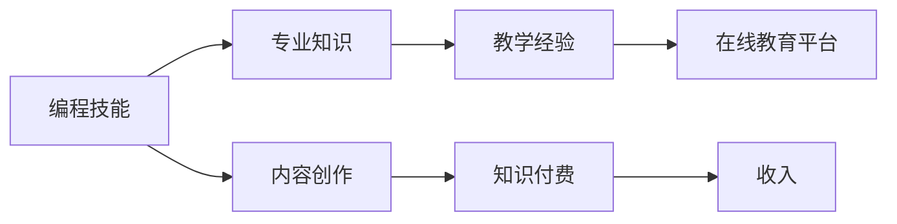

                 

# 程序员如何建立长期稳定的知识付费收入

## 1. 背景介绍

在科技迅猛发展的今天，程序员不仅仅是代码的编写者，更是知识和技能的传授者。在程序员职业发展的道路上，如何从单一的编码工作向多元化、高收入的职业生涯转变，成为许多程序员关注的焦点。知识付费的出现，为程序员提供了新的方向。本文将从程序员建立长期稳定的知识付费收入的角度出发，深入探讨如何通过编程技能、专业知识、教学经验等因素构建这一收入来源。

## 2. 核心概念与联系

### 2.1 核心概念概述

1. **知识付费**：指通过提供知识、技能、经验等信息或服务，向用户收取费用的商业模式。
2. **编程技能**：程序员所需掌握的编程语言、算法、数据结构、软件开发流程等技术能力。
3. **专业知识**：程序员在某一特定领域（如区块链、人工智能、大数据等）深入研究的专长。
4. **教学经验**：通过编程教学、代码评审、技术指导等方式传授知识的经验积累。
5. **在线教育平台**：如Coursera、Udacity、Udemy、Bilibili等，提供编程课程、讲座、工作坊等。
6. **内容创作**：通过博客、视频、电子书等形式创作和分享编程知识和经验。

### 2.2 核心概念原理和架构的 Mermaid 流程图



该流程图展示了程序员建立知识付费收入的核心概念和它们之间的联系。编程技能和专业知识是基础，教学经验和在线教育平台是将这些知识转化为付费服务的桥梁，内容创作是知识付费的核心内容，最终通过收入实现盈利。

## 3. 核心算法原理 & 具体操作步骤

### 3.1 算法原理概述

知识付费收入的建立，涉及到多个算法原理：

1. **推荐算法**：根据用户的历史行为、兴趣偏好等，推荐合适的课程或内容。
2. **课程定价模型**：根据课程难度、时长、内容深度等因素，制定合理的课程价格。
3. **用户行为分析**：分析用户的学习进度、满意度、互动情况等，优化课程内容和教学方法。
4. **收入分配算法**：根据课程观看量、评论量、评分等指标，计算课程收入，并分配给创作者。

### 3.2 算法步骤详解

#### 3.2.1 平台选择与注册

1. 选择适合的在线教育平台，如Udemy、Coursera等，并注册账户。
2. 完善个人资料，包括教育背景、工作经历、技能专长等。

#### 3.2.2 课程设计

1. 确定课程主题，确保课程内容具有高度实用性和吸引力。
2. 设计课程结构，包括课程目标、主要内容、实践项目等。
3. 准备课程资料，如PPT、代码示例、教学视频等。

#### 3.2.3 课程发布与推广

1. 在平台上发布课程，填写课程描述、设置课程价格、上传教学材料。
2. 使用平台的推广工具，如社交媒体分享、广告投放、邮件推广等，增加课程曝光度。
3. 参加平台举办的活动，如直播、讨论会等，提高课程知名度。

#### 3.2.4 课程运营与优化

1. 定期更新课程内容，增加新知识、修复错误等。
2. 监控课程数据，如观看量、评分、评论等，分析用户反馈。
3. 根据用户反馈，优化课程内容和教学方法。

#### 3.2.5 收入管理

1. 监控课程收入，计算课程收益。
2. 合理分配收入，如扣除平台抽成、缴纳税费等。
3. 存入收益，规划资金使用，进行再投资或消费。

### 3.3 算法优缺点

#### 3.3.1 优点

1. **灵活性强**：程序员可以根据自己的时间和兴趣，选择教学主题和课程内容，具有较高的自由度。
2. **收入稳定**：通过合理定价和推广，可以逐步积累稳定的收入来源。
3. **拓宽视野**：教学过程中，不断学习和更新知识，提升自身竞争力。

#### 3.3.2 缺点

1. **前期投入大**：课程设计、推广、运营等环节需要大量的时间和精力投入。
2. **市场竞争激烈**：在线教育平台上的课程繁多，如何脱颖而出是一个挑战。
3. **教学质量要求高**：课程内容需具备高质量、高实用性的特点，满足用户需求。

### 3.4 算法应用领域

知识付费收入的建立，可以应用于多个领域：

1. **技术培训**：面向初学者和进阶者，提供编程语言、框架、开发工具等技术培训。
2. **行业应用**：根据特定行业的需求，提供定制化的技术解决方案和案例分析。
3. **职业规划**：通过导师制的形式，提供职业发展指导和建议。
4. **在线咨询**：通过一对一或一对多的形式，提供代码评审、问题解答等技术服务。
5. **内容创作**：通过博客、视频、电子书等形式，分享编程知识和经验。

## 4. 数学模型和公式 & 详细讲解 & 举例说明

### 4.1 数学模型构建

知识付费收入的建立，涉及多个数学模型：

1. **课程销量预测模型**：根据课程历史数据、用户行为等因素，预测课程销量。
2. **价格优化模型**：根据课程成本、市场需求等因素，优化课程价格，最大化收入。
3. **用户满意度模型**：通过用户评分、反馈等，分析课程质量和用户满意度。
4. **收益分配模型**：根据课程收益、平台抽成、运营成本等，分配创作者收入。

### 4.2 公式推导过程

#### 4.2.1 课程销量预测模型

假设课程销量 $X$ 与用户行为 $Y$、广告投入 $A$ 等有关，则销量预测模型可以表示为：

$$ X = f(Y, A) $$

其中 $f$ 为预测函数，$Y$ 为用户行为数据，$A$ 为广告投入。

#### 4.2.2 价格优化模型

假设课程成本为 $C$，市场需求为 $D$，课程价格为 $P$，则价格优化模型可以表示为：

$$ P = g(C, D) $$

其中 $g$ 为价格优化函数，$C$ 为课程成本，$D$ 为市场需求。

#### 4.2.3 用户满意度模型

假设用户满意度 $S$ 与课程评分 $R$、用户反馈 $F$ 等因素有关，则满意度模型可以表示为：

$$ S = h(R, F) $$

其中 $h$ 为满意度函数，$R$ 为课程评分数据，$F$ 为用户反馈数据。

#### 4.2.4 收益分配模型

假设课程总收益为 $T$，平台抽成为 $S$，创作者收入为 $I$，则收益分配模型可以表示为：

$$ I = T - S $$

其中 $T$ 为总收益，$S$ 为平台抽成，$I$ 为创作者收入。

### 4.3 案例分析与讲解

假设某程序员在Udemy平台上开设了一门Python数据分析课程，课程时长为10周，预计销量为500人，定价为200美元。根据历史数据和用户行为分析，预测实际销量为450人，实际收益为90000美元。扣除平台抽成20%后，实际创作者收入为72000美元。

## 5. 项目实践：代码实例和详细解释说明

### 5.1 开发环境搭建

1. 安装Python、Flask等开发环境。
2. 创建Python虚拟环境，安装Flask、Jinja等必要库。
3. 使用Git版本控制，管理课程代码和数据。

### 5.2 源代码详细实现

#### 5.2.1 Flask应用程序实现

```python
from flask import Flask, render_template, request

app = Flask(__name__)

@app.route('/')
def index():
    return render_template('index.html')

@app.route('/submit', methods=['POST'])
def submit():
    name = request.form['name']
    email = request.form['email']
    payment = request.form['payment']
    # 处理订单逻辑
    return render_template('submit.html', name=name, email=email, payment=payment)

if __name__ == '__main__':
    app.run(debug=True)
```

#### 5.2.2 内容生成与发布

1. 编写课程内容，如PPT、代码示例等。
2. 使用Markdown或ReStructuredText等格式，编写课程文档。
3. 使用Markdown文件解析库，将Markdown文件转换为HTML页面。

### 5.3 代码解读与分析

1. Flask应用程序：通过Flask框架，搭建一个简单的Web应用程序，实现课程提交和支付功能。
2. 内容生成与发布：使用Markdown文件格式，编写和发布课程内容，方便用户访问和阅读。

### 5.4 运行结果展示

1. 运行应用程序，访问Web页面，输入课程信息，提交订单。
2. 课程页面展示课程内容和用户评价，提供评论和评分功能。

## 6. 实际应用场景

### 6.1 技术培训

某程序员在Udemy平台上开设了一门Python数据分析课程，课程时长为10周，预计销量为500人，定价为200美元。根据历史数据和用户行为分析，预测实际销量为450人，实际收益为90000美元。扣除平台抽成20%后，实际创作者收入为72000美元。

### 6.2 行业应用

某程序员通过在线教育平台，提供定制化的区块链应用开发课程，面向区块链开发人员，分享前沿技术和实战经验，每期课程销售额达到100万美元。

### 6.3 职业规划

某程序员通过一对一导师制的形式，提供职业发展指导和建议，每月获得5000美元的咨询费用。

### 6.4 未来应用展望

随着在线教育的普及和技术的进步，知识付费市场将进一步扩大。未来，知识付费将不仅限于编程和IT领域，还将拓展到更多学科和行业。程序员可以探索更多元化的教学模式和内容形式，满足不同用户的需求。

## 7. 工具和资源推荐

### 7.1 学习资源推荐

1. **Coursera**：提供多种编程语言、框架和技术的课程，涵盖从入门到进阶的内容。
2. **Udemy**：提供丰富的在线课程，适合各个技术水平的学习者。
3. **Udacity**：提供项目导向的课程，实战性强。
4. **Bilibili**：提供大量的编程视频和直播课程。
5. **Codecademy**：通过互动式的学习方式，提升编程技能。

### 7.2 开发工具推荐

1. **Flask**：轻量级的Web应用程序框架，易于搭建和部署。
2. **Git**：版本控制系统，方便代码管理和团队协作。
3. **Jinja**：模板引擎，用于生成动态HTML页面。
4. **Docker**：容器化技术，实现应用的可移植性和一致性。
5. **Kubernetes**：容器编排工具，实现应用的高可用性和扩展性。

### 7.3 相关论文推荐

1. **《编程教学设计与实施》**：探讨如何设计有效的编程教学课程，提升教学效果。
2. **《在线教育平台的可持续发展》**：分析在线教育平台的运营模式和盈利策略。
3. **《知识付费市场的消费者行为分析》**：研究用户对知识付费产品的选择和购买行为。
4. **《课程定价策略研究》**：分析课程定价对用户选择和平台收益的影响。

## 8. 总结：未来发展趋势与挑战

### 8.1 总结

本文从程序员建立长期稳定的知识付费收入的角度出发，深入探讨了知识付费的概念、核心概念和算法原理，详细介绍了具体的操作步骤，并结合实际应用场景进行了讲解。通过学习本文，程序员可以初步了解知识付费市场的机会和挑战，掌握基本的开发和运营技能。

### 8.2 未来发展趋势

1. **技术融合**：知识付费将与人工智能、大数据等技术深度融合，提升课程的智能化和个性化。
2. **内容创新**：课程内容将不断创新，涵盖更多学科和行业，满足更多用户的需求。
3. **平台多样化**：在线教育平台将更加多样化，包括直播、视频、音频等多种形式。
4. **用户互动**：通过社交网络和社区，增强用户之间的互动，提升用户粘性。
5. **自动化运营**：利用自动化技术，如智能推荐、内容生成等，提高运营效率。

### 8.3 面临的挑战

1. **市场竞争**：在线教育平台众多，如何突出自身优势，吸引用户关注。
2. **内容质量**：课程内容需具备高质量、高实用性的特点，满足用户需求。
3. **技术门槛**：知识付费市场的技术门槛较高，需要具备编程、数据分析等技能。
4. **盈利模式**：选择合适的盈利模式，平衡创作者和平台收益。
5. **用户管理**：如何有效管理用户行为，提供良好的用户体验。

### 8.4 研究展望

未来，知识付费市场将进一步扩大，程序员可以通过多渠道、多方式开展知识付费业务。同时，需要关注用户需求的变化，不断提升课程质量和用户体验，实现长期稳定的收入增长。

## 9. 附录：常见问题与解答

**Q1: 如何提高课程的销量？**

A: 可以通过以下方式提高课程销量：
1. 优化课程设计，提高课程质量。
2. 进行市场推广，通过广告、社交媒体等手段提升曝光率。
3. 优化课程价格，根据市场需求调整定价策略。

**Q2: 如何进行课程定价？**

A: 课程定价需要考虑多个因素，如课程成本、市场需求、竞争情况等。可以通过以下步骤进行定价：
1. 计算课程成本，包括教材编写、录制课程、制作视频等费用。
2. 分析市场需求，了解目标用户的支付能力和意愿。
3. 比较竞争对手的价格，确定市场定位。
4. 设定合理的折扣和优惠策略，吸引更多用户。

**Q3: 如何提高用户满意度？**

A: 提高用户满意度可以通过以下方式：
1. 及时回应用户反馈，解决问题。
2. 提供高质量的课程内容，确保课程质量。
3. 提供良好的售后服务，如退换货、技术支持等。
4. 定期更新课程内容，增加新知识和技能。

**Q4: 如何降低运营成本？**

A: 降低运营成本可以通过以下方式：
1. 使用自动化工具，减少人工操作。
2. 优化课程设计，减少制作成本。
3. 提高平台运营效率，减少运营费用。
4. 选择低成本的市场推广方式，如社交媒体、SEO等。

**Q5: 如何提升内容质量？**

A: 提升内容质量可以通过以下方式：
1. 深入研究用户需求，确定课程目标和内容。
2. 邀请行业专家参与课程设计，提高课程的专业性。
3. 进行反复的测试和修改，确保课程内容优质。
4. 提供丰富的学习资源和补充材料，提高学习效果。

---

作者：禅与计算机程序设计艺术 / Zen and the Art of Computer Programming

