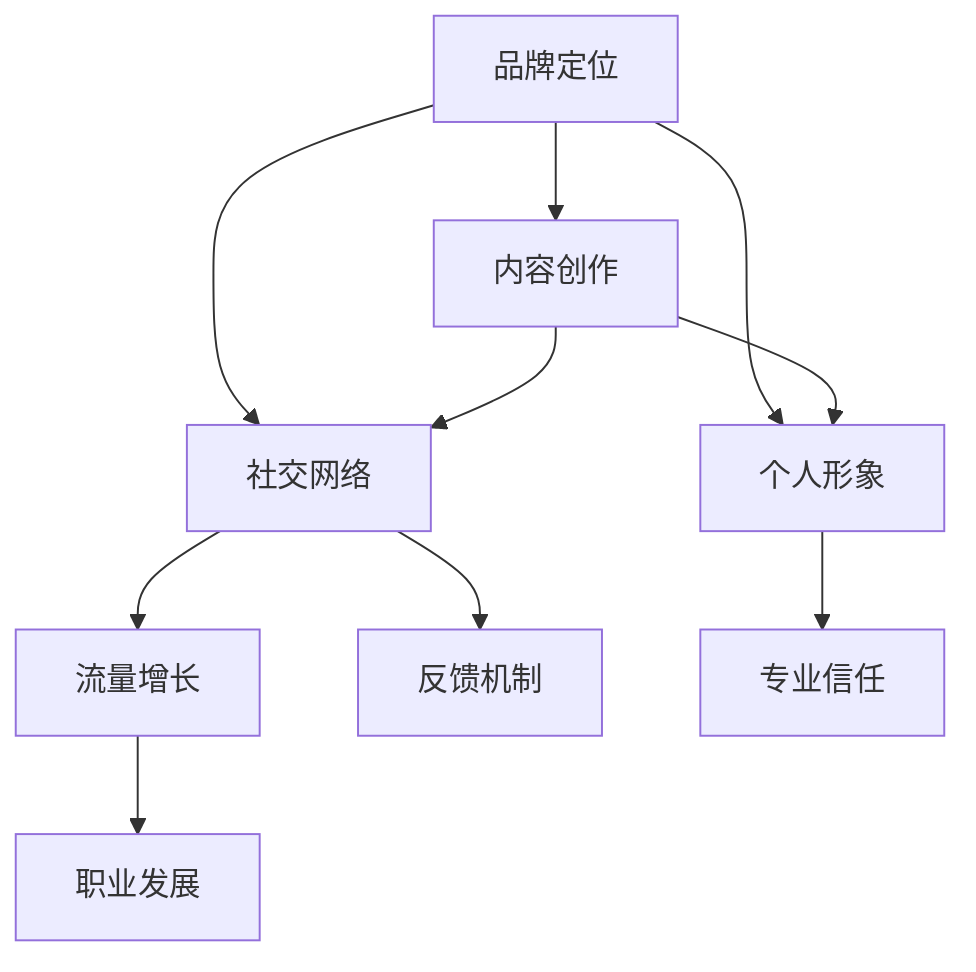
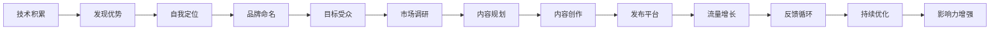

                 

## 1. 背景介绍

在信息爆炸的互联网时代，程序员不再是传统的"幕后英雄"，而是越来越多地走到前台，成为技术驱动创新的主导力量。个人品牌IP的打造，成为了程序员职业发展的关键。通过建立个人品牌，不仅可以提升职业竞争力，还能获得更多的职业发展机会。

本文将从品牌定位、内容创作、社交网络、个人形象等多个维度，详细解析程序员如何打造个人品牌IP。希望通过系统性的思考和实践，帮助每一位程序员走出职业低谷，实现自我突破。

## 2. 核心概念与联系

### 2.1 核心概念概述

在讨论如何打造个人品牌IP之前，首先需要明确几个核心概念：

- **品牌定位**：个人品牌定位是指确定自己在技术领域的特定角色和优势，建立起独特的品牌形象。
- **内容创作**：包括编程技术分享、行业分析、技术评论等内容创作，是个人品牌IP的核心输出。
- **社交网络**：利用社交平台，如GitHub、知乎、LinkedIn等，建立影响力，与同行交流互动。
- **个人形象**：打造专业、亲和、有价值的个人形象，提升公众认知度。

这些核心概念通过以下Mermaid流程图展示了其联系：



品牌定位提供方向，内容创作充实内容，社交网络扩展影响力，个人形象提升可信度，最终实现职业发展的良性循环。

### 2.2 核心概念原理和架构的 Mermaid 流程图



## 3. 核心算法原理 & 具体操作步骤

### 3.1 算法原理概述

程序员打造个人品牌IP的过程，本质上是一个数据驱动、优化迭代的算法过程。以下将详细介绍这一过程的原理和具体操作步骤：

- **输入**：程序员的技术积累、行业经验、社交网络等。
- **处理**：基于目标受众和市场调研，制定内容策略。
- **输出**：个人品牌IP的形成，通过内容创作、社交互动等手段，提升品牌知名度和影响力。

### 3.2 算法步骤详解

**Step 1: 自我定位**

- 列出自己的技术特长、项目经验、兴趣爱好等。
- 分析行业内主要竞争者，找到自身的差异化优势。
- 确定目标受众，如技术新手、同行业专家等，并制定详细的用户画像。

**Step 2: 内容创作**

- 基于自我定位和目标受众，规划内容主题，如技术教程、行业分析、案例研究等。
- 持续更新内容，保持活跃度，确保用户粘性。
- 内容创作中应注重质量，避免低质量内容损害个人品牌形象。

**Step 3: 社交网络建设**

- 选择适合自己内容的社交平台，如GitHub、知乎、LinkedIn等。
- 积极参与社区讨论，与同行建立联系，扩展人脉。
- 利用社交网络进行内容推广，提升内容曝光率。

**Step 4: 个人形象塑造**

- 在社交网络中维护专业形象，避免发布不专业或不当内容。
- 建立并维护个人网站或博客，提供更全面、深入的技术分享。
- 参加行业会议和技术沙龙，提升公开曝光率。

**Step 5: 持续优化**

- 通过数据分析，了解用户反馈，持续优化内容策略。
- 定期更新内容，保持品牌活力。
- 监测品牌影响力变化，及时调整方向。

### 3.3 算法优缺点

**优点**：
- 通过数据驱动和优化迭代，可以更科学地提升个人品牌IP。
- 多渠道输出，有助于扩大品牌影响力。
- 可以持续优化，不断提升品牌价值。

**缺点**：
- 需要大量时间和精力投入，特别是初期内容创作阶段。
- 需要持续监测和优化，存在一定工作量。
- 可能面临网络上的负面反馈，需要妥善处理。

### 3.4 算法应用领域

个人品牌IP的打造可以应用于多个领域：

- **技术开发**：通过分享技术经验、参与开源项目，提升技术影响力。
- **行业咨询**：基于行业分析、技术评论，提供有价值的见解，影响决策者。
- **职业发展**：通过提升个人品牌，获取更多的职业发展机会，如讲座、培训、招聘等。

## 4. 数学模型和公式 & 详细讲解 & 举例说明

### 4.1 数学模型构建

假设个人品牌影响力 $I$ 由内容质量 $C$、社交活跃度 $S$、个人形象 $P$ 三部分构成。则可以构建如下数学模型：

$$ I = C \times S \times P $$

其中，$C$、$S$、$P$ 均取值在 [0, 1] 区间内，表示对应的实际值对理想值的贡献度。

### 4.2 公式推导过程

根据上式，可以推导出以下公式：

$$ \frac{\partial I}{\partial C} = S \times P $$
$$ \frac{\partial I}{\partial S} = C \times P $$
$$ \frac{\partial I}{\partial P} = C \times S $$

表明内容质量、社交活跃度、个人形象三者缺一不可，且相互影响。

### 4.3 案例分析与讲解

以某知名程序员为例，假设其初始状态为：

- $C = 0.6$：内容质量较高，输出稳定
- $S = 0.5$：在GitHub、知乎等平台上活跃，有一定粉丝基础
- $P = 0.7$：专业形象良好，口碑较好

通过一段时间的优化，假设其各项指标分别提升到：

- $C = 0.8$：内容质量进一步提升，覆盖更多技术细节
- $S = 0.6$：在社交网络平台活跃度保持稳定，开始参与更高层次的讨论
- $P = 0.8$：个人形象更加专业，加入行业协会，参与讲座

此时，品牌影响力 $I$ 可计算为：

$$ I = C \times S \times P = 0.8 \times 0.6 \times 0.8 = 0.384 $$

提升显著，从0.6提升到0.384。

## 5. 项目实践：代码实例和详细解释说明

### 5.1 开发环境搭建

**Step 1: 建立GitHub仓库**

```bash
git clone https://github.com/yourusername/yourproject.git
cd yourproject
git checkout -b develop
```

**Step 2: 安装依赖**

```bash
pip install flake8 black
```

**Step 3: 设置编辑器和IDE**

建议使用VSCode或PyCharm等IDE，配置环境变量，支持Python和相关库。

### 5.2 源代码详细实现

以下是一个简单的博客网站构建示例，使用Jinja2模板引擎：

```python
from flask import Flask, render_template
app = Flask(__name__)

@app.route('/')
def index():
    return render_template('index.html')

@app.route('/about')
def about():
    return render_template('about.html')

if __name__ == '__main__':
    app.run(debug=True)
```

### 5.3 代码解读与分析

代码中，通过Flask框架构建了一个简单的博客网站。路由部分定义了两个页面，即主页和关于页面。使用Jinja2模板引擎，可以更灵活地生成HTML页面。

### 5.4 运行结果展示

运行代码，启动服务器，访问 http://127.0.0.1:5000/ 和 http://127.0.0.1:5000/about 即可访问生成的页面。

## 6. 实际应用场景

### 6.1 个人技术博客

在GitHub Pages或CNAME域名下建立个人技术博客，定期发布技术分享、项目案例、行业分析等内容，提升技术影响力。

### 6.2 技术社区贡献

积极参与开源项目，如在GitHub上提交代码、撰写文档、参与讨论等，提升社区贡献度。

### 6.3 行业活动参与

参加行业会议、技术沙龙、线下活动等，提高公开曝光率，结识业内专家和同行。

### 6.4 未来应用展望

随着技术发展和社交网络的普及，未来个人品牌IP的打造将更加多样化。例如：

- **视频平台**：通过YouTube、Bilibili等视频平台，分享技术讲解、项目演示，提升亲和力。
- **社交媒体**：利用微博、微信等社交媒体，进行日常技术分享和互动，扩展影响力。
- **播客节目**：开设技术播客节目，邀请行业专家、同行业者进行深入交流，提升品牌影响力。

## 7. 工具和资源推荐

### 7.1 学习资源推荐

1. **博客平台**：Medium、博客园等，提供技术分享和社区交流的平台。
2. **视频平台**：YouTube、Bilibili等，发布技术讲解、项目演示的视频内容。
3. **社交平台**：Twitter、LinkedIn等，与同行建立联系，扩大影响力。
4. **开源社区**：GitHub、Apache等，参与开源项目，提升技术影响力。

### 7.2 开发工具推荐

1. **IDE**：VSCode、PyCharm等，支持Python开发，提供丰富的插件和扩展。
2. **版本控制**：Git、SVN等，便于版本管理和协作。
3. **CI/CD工具**：Jenkins、GitHub Actions等，自动化构建、测试、部署，提高开发效率。

### 7.3 相关论文推荐

1. **内容策略研究**：《内容营销中的数字影响力：理论与实践》
2. **社交网络分析**：《社交网络分析：理论、方法与应用》
3. **个人品牌打造**：《打造个人品牌：实践指南》

## 8. 总结：未来发展趋势与挑战

### 8.1 研究成果总结

本文从品牌定位、内容创作、社交网络、个人形象等多个维度，探讨了程序员如何打造个人品牌IP。通过系统性的思考和实践，能够有效提升个人技术影响力，为职业发展提供支持。

### 8.2 未来发展趋势

未来个人品牌IP的打造将更加数字化、社交化、多样化：

- **数字化**：利用大数据和人工智能技术，进行用户行为分析，优化内容策略。
- **社交化**：社交网络平台的多样化使用，使得品牌影响力的拓展更加全面。
- **多样化**：视频、播客、社交媒体等多种渠道的结合，提升品牌亲和力。

### 8.3 面临的挑战

尽管个人品牌IP的打造有诸多益处，但仍面临以下挑战：

- **时间管理**：需要平衡技术积累、内容创作、社交互动等任务，避免顾此失彼。
- **内容质量**：保持高质量内容的持续输出，避免低质量内容损害品牌形象。
- **隐私保护**：在社交网络中保持个人隐私安全，避免不当信息泄露。

### 8.4 研究展望

未来，个人品牌IP的打造将更多地结合人工智能和大数据技术，通过自动化的内容推荐、用户画像分析等手段，提升品牌影响力。同时，如何建立更加透明、可信、个性化的品牌形象，将是未来的研究重点。

## 9. 附录：常见问题与解答

**Q1: 如何确定品牌定位？**

A: 结合自身技术特长和行业需求，明确目标受众和优势。例如，技术专家可以通过深度技术分享和行业分析，定位为技术顾问；开发者可以通过开源贡献和项目分享，定位为开发实战专家。

**Q2: 如何保持内容创作的持续性和质量？**

A: 制定详细的内容计划，定期更新，保持活跃度。同时，不断学习新技术和行业动态，提升内容质量。

**Q3: 如何选择社交平台？**

A: 根据内容特点和目标受众选择平台。如技术类内容适合在GitHub、知乎、Stack Overflow等技术社区分享；软技能类内容适合在LinkedIn、微博等社交平台上推广。

**Q4: 如何应对负面反馈？**

A: 及时回应和处理负面反馈，保持开放和透明的态度。同时，可以借助技术手段，如情感分析，提前识别潜在负面内容，及时处理。

---

作者：禅与计算机程序设计艺术 / Zen and the Art of Computer Programming

