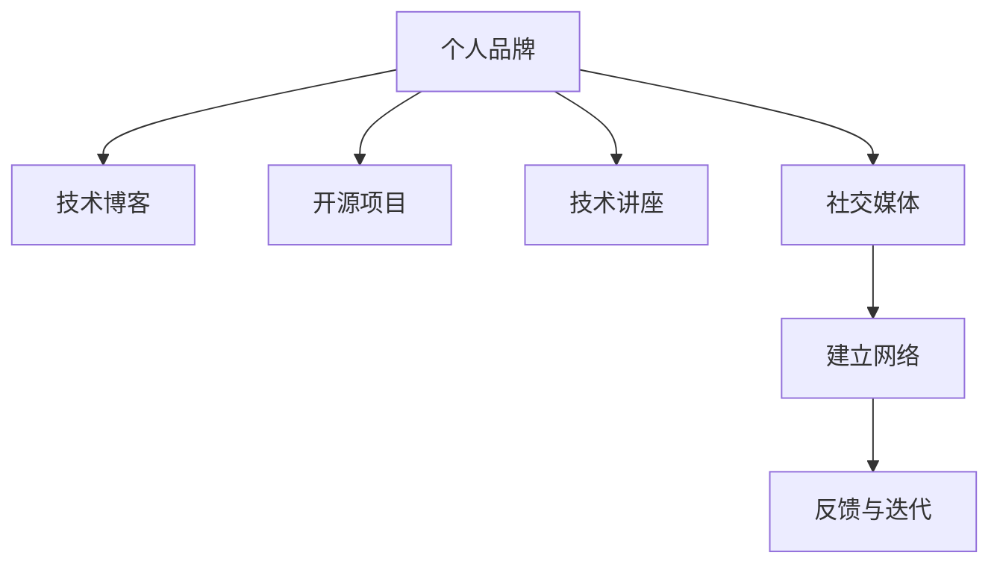

                 

# 程序员如何打造个人影响力生态

## 1. 背景介绍

在当今数字化时代，程序员作为技术创新的核心力量，正面临前所未有的机遇与挑战。如何在繁杂的技术海洋中脱颖而出，成为行业的引领者，是每个程序员都需要深思的问题。打造个人影响力生态，不仅意味着获取更多的职业发展机会，更是在技术和思想层面上对个人能力的提升和扩展。本文将从背景、核心概念与联系、核心算法原理与具体操作步骤、数学模型和公式、项目实践、实际应用场景、工具和资源推荐、总结、未来发展趋势与挑战以及常见问题与解答等方面，深入探讨程序员如何有效打造个人影响力生态。

## 2. 核心概念与联系

### 2.1 核心概念概述

为了构建个人影响力生态，首先需要明确几个核心概念：

- **个人品牌 (Personal Brand)**：程序员的个人品牌是其专业技能、经验、价值观、社交互动和公共形象的综合体现。良好的个人品牌能够吸引同行和业界的注意，为职业发展开辟更多机会。

- **技术博客 (Tech Blog)**：通过撰写技术博客，程序员可以分享专业知识和最新技术动态，建立自己在某一领域的权威地位。博客不仅展示了编程技能，也反映了思考深度和创新能力。

- **开源项目 (Open Source Project)**：参与开源项目不仅能够提升技术实力，还能展示团队合作能力和项目管理经验。开源项目成果常成为个人技术影响力的重要证明。

- **技术讲座 (Tech Talks)**：通过技术讲座，程序员可以将知识传授给他人，加强行业影响力。讲座的互动环节有助于扩大个人影响力，建立广泛的人脉网络。

- **社交媒体 (Social Media)**：利用社交媒体平台，程序员可以发布专业见解、分享技术动态，并与行业内其他专业人士进行互动。积极参与讨论、回答问题，有助于提高个人知名度和影响力。

### 2.2 核心概念原理和架构的 Mermaid 流程图



## 3. 核心算法原理 & 具体操作步骤

### 3.1 算法原理概述

打造个人影响力生态的核心理念是通过不断学习和分享，提升个人在技术社区中的地位。这涉及到了多方面的算法和原理，包括但不限于：

- **数据收集与处理**：利用爬虫技术收集技术社区中的热门话题和问题，分析热门技术趋势和知识难点。
- **知识提取与组织**：通过自然语言处理技术，从技术博客、开源项目、论文等来源中提取关键知识，并进行分类组织。
- **内容生成与发布**：使用生成对抗网络(GAN)等算法生成高质量的技术文章，通过个人博客、社交媒体等渠道发布。
- **互动与反馈**：利用情感分析、话题分类等技术，分析社区中的反馈和互动数据，进行持续改进。

### 3.2 算法步骤详解

1. **数据收集与处理**
   - 使用Python的requests和BeautifulSoup库，爬取技术社区如Stack Overflow、GitHub、Medium上的热门帖子和项目信息。
   - 将收集到的数据存储到数据库中，如MySQL或PostgreSQL，并进行初步清洗和预处理。

2. **知识提取与组织**
   - 使用自然语言处理库NLTK或spaCy，对技术博客、论文等文本数据进行分词、词性标注、命名实体识别等处理。
   - 使用TF-IDF或word2vec等技术，提取文本中的关键词和概念，并进行分类组织。

3. **内容生成与发布**
   - 使用GAN或语言模型如GPT-3生成高质量的技术文章，并通过个人博客或社交媒体发布。
   - 使用Twitter API等接口，将生成的文章自动发布到Twitter上，利用标签和主题提升曝光率。

4. **互动与反馈**
   - 利用情感分析和话题分类技术，分析社区中的反馈和互动数据。
   - 根据分析结果，调整内容生成策略和发布频率，提升用户互动率。

### 3.3 算法优缺点

**优点**：
- **高效学习**：通过收集和处理大量数据，可以快速掌握技术趋势和难点。
- **内容丰富**：生成对抗网络和高性能语言模型能够生成高质量的技术文章，内容丰富多样。
- **广泛曝光**：利用社交媒体等渠道，能够将技术文章广泛传播，吸引更多关注。

**缺点**：
- **数据隐私**：在数据收集过程中，需要注意用户隐私和版权问题。
- **内容同质化**：如果不加以控制，内容生成算法可能会过度生产类似内容，降低多样性。
- **技术门槛高**：算法实现和使用过程需要一定的技术积累，门槛较高。

### 3.4 算法应用领域

个人影响力生态的打造，不仅适用于个人开发者，同样适用于技术团队和公司。通过团队协作和技术共享，可以更高效地提升团队的整体技术实力，并提升团队在行业中的地位。

## 4. 数学模型和公式 & 详细讲解 & 举例说明

### 4.1 数学模型构建

在知识提取与组织阶段，可以使用TF-IDF算法对文本数据进行处理。TF-IDF（Term Frequency-Inverse Document Frequency）是一种常用的文本挖掘技术，用于衡量一个词在文档中的重要性和在语料库中的频率。

$$
TF(w) = \frac{n_w}{\sum_{j=1}^n n_{wj}}
$$

$$
IDF(w) = \log \frac{N}{\sum_{j=1}^N n_{wj}}
$$

$$
TF-IDF(w) = TF(w) \cdot IDF(w)
$$

其中，$n_w$表示词$w$在文档中出现的次数，$n_{wj}$表示词$w$在语料库中所有文档中出现的次数，$N$表示语料库中文档的总数。

### 4.2 公式推导过程

在内容生成与发布阶段，可以采用生成对抗网络(GAN)生成技术文章。GAN由两个神经网络构成：生成器(G)和判别器(D)。生成器尝试生成逼真的文章，而判别器尝试区分生成的文章和真实的文章。通过对抗训练，生成器不断改进生成文章的质量。

$$
G(x): Z \rightarrow X
$$

$$
D(x): X \rightarrow \{0,1\}
$$

其中，$x$表示真实文章，$Z$表示噪声向量，$X$表示生成的文章。判别器$D(x)$的输出概率分布为$P(D(x)=1|x)$和$P(D(x)=0|x)$，表示真实文章和生成文章被正确识别的概率。

### 4.3 案例分析与讲解

以生成一篇关于TensorFlow的技术文章为例：

1. **数据收集**：使用Python爬虫从Medium上爬取关于TensorFlow的热门文章。
2. **数据处理**：使用NLTK库进行分词、词性标注等处理，并使用TF-IDF算法提取关键词。
3. **内容生成**：使用GPT-3模型生成高质量的文章，包含TensorFlow的基础知识、应用场景、最新进展等。
4. **发布与反馈**：通过个人博客和Twitter发布文章，利用情感分析技术分析读者反馈，调整文章风格和内容。

## 5. 项目实践：代码实例和详细解释说明

### 5.1 开发环境搭建

为了进行项目实践，需要搭建一个Python开发环境，并安装必要的库。以下是详细的步骤：

1. 安装Python：选择3.8.x或3.9.x版本。
2. 安装虚拟环境工具：例如virtualenv或conda。
3. 创建虚拟环境：
   ```
   virtualenv env
   source env/bin/activate
   ```
4. 安装相关库：
   ```
   pip install requests beautifulsoup4 nltk tensorflow
   ```

### 5.2 源代码详细实现

以下是一个Python脚本的示例，用于从Medium上爬取TensorFlow相关文章，并进行简单的文本处理和情感分析。

```python
import requests
from bs4 import BeautifulSoup
from nltk.corpus import stopwords
from nltk.tokenize import word_tokenize
from nltk.sentiment import SentimentIntensityAnalyzer

# 获取Medium文章列表
def get_articles(url):
    response = requests.get(url)
    soup = BeautifulSoup(response.text, 'html.parser')
    articles = []
    for link in soup.find_all('a', class_='link'):
        title = link.text
        url = link['href']
        articles.append((title, url))
    return articles

# 文章文本处理
def process_article(title, url):
    response = requests.get(url)
    soup = BeautifulSoup(response.text, 'html.parser')
    content = soup.find('p', class_='rich-text-body')
    text = content.text.strip()
    words = word_tokenize(text)
    stop_words = set(stopwords.words('english'))
    filtered_words = [word for word in words if word.lower() not in stop_words]
    return filtered_words

# 情感分析
def analyze_sentiment(words):
    analyzer = SentimentIntensityAnalyzer()
    sentiment = analyzer.polarity_scores(' '.join(words))
    return sentiment['compound']

# 爬取文章并处理
def main():
    articles = get_articles('https://medium.com/search?q=tensorflow')
    for article in articles:
        title, url = article
        words = process_article(title, url)
        sentiment = analyze_sentiment(words)
        print(f'{title}\t{sentiment}')

if __name__ == '__main__':
    main()
```

### 5.3 代码解读与分析

该Python脚本的主要功能包括：

1. **获取Medium文章列表**：使用requests和BeautifulSoup库获取Medium上关于TensorFlow的文章列表。
2. **文章文本处理**：使用NLTK库进行文本分词和停用词过滤，去除无关内容。
3. **情感分析**：使用NLTK库的情感分析模块，计算文章的情感得分。
4. **输出结果**：将处理后的文章标题和情感得分输出到控制台。

## 6. 实际应用场景

个人影响力生态的应用场景非常广泛，包括但不限于：

- **技术博客**：建立个人技术博客，定期发布原创技术文章，展示专业技能和深度思考。
- **开源项目**：参与开源项目，通过GitHub展示技术实力和团队协作能力。
- **技术讲座**：在公司内部或技术社区举办技术讲座，分享知识，提升个人影响力。
- **社交媒体**：通过Twitter、LinkedIn等社交媒体平台，分享技术动态，与业内人士互动。

## 7. 工具和资源推荐

### 7.1 学习资源推荐

1. **GitHub**：GitHub是开源项目的聚集地，也是展示技术实力的重要平台。
2. **Medium**：Medium是一个技术博客平台，可以快速发布高质量的技术文章。
3. **Stack Overflow**：Stack Overflow是一个问答社区，通过回答问题和提问，可以提升个人知名度。
4. **Python官方文档**：Python官方文档提供了丰富的库和框架，是学习编程语言的重要资源。
5. **Coursera**：Coursera提供了多门计算机科学和技术相关课程，涵盖机器学习、深度学习、数据科学等领域。

### 7.2 开发工具推荐

1. **Jupyter Notebook**：Jupyter Notebook是一个交互式编程环境，适合进行数据处理、模型训练和结果展示。
2. **Git**：Git是一个版本控制系统，用于管理和共享代码。
3. **Markdown**：Markdown是一种轻量级的文本标记语言，适合编写技术博客和文档。
4. **Twitter API**：Twitter API用于发布和检索推文，提高文章曝光率。

### 7.3 相关论文推荐

1. **Deep Learning**（Ian Goodfellow等）：深入介绍了深度学习的基础理论和应用实践，是理解人工智能技术的必备书籍。
2. **Python Machine Learning**（Sebastian Raschka等）：讲解了Python在机器学习中的应用，适合编程语言和技术栈结合的读者。
3. **Natural Language Processing with PyTorch**（Erich Elsinger等）：介绍了PyTorch在自然语言处理中的应用，适合实践者和研究者参考。

## 8. 总结：未来发展趋势与挑战

### 8.1 研究成果总结

通过不断学习和分享，程序员可以提升个人在技术社区中的地位，打造个人影响力生态。技术博客、开源项目、技术讲座和社交媒体平台是构建个人影响力生态的重要工具。

### 8.2 未来发展趋势

未来，个人影响力生态的构建将更加依赖于人工智能和机器学习技术。例如：

1. **自动化内容生成**：利用GAN等生成对抗网络，自动生成高质量技术文章，减少人力成本。
2. **智能推荐系统**：通过推荐算法，提升文章曝光率，提高读者互动率。
3. **情感分析和话题分类**：使用自然语言处理技术，分析用户反馈，优化内容生成策略。

### 8.3 面临的挑战

尽管个人影响力生态构建充满机遇，但也面临以下挑战：

1. **内容同质化**：大量相同主题的文章可能导致读者疲劳，内容多样性需要更多关注。
2. **数据隐私**：在数据收集和处理过程中，需要注意用户隐私和版权问题。
3. **技术门槛高**：构建个人影响力生态需要掌握多种技术和工具，门槛较高。

### 8.4 研究展望

未来，个人影响力生态的构建将更加依赖于人工智能和机器学习技术。例如：

1. **自动化内容生成**：利用GAN等生成对抗网络，自动生成高质量技术文章，减少人力成本。
2. **智能推荐系统**：通过推荐算法，提升文章曝光率，提高读者互动率。
3. **情感分析和话题分类**：使用自然语言处理技术，分析用户反馈，优化内容生成策略。

## 9. 附录：常见问题与解答

**Q1: 如何提高文章曝光率？**

A: 利用Twitter API等接口，自动发布文章到社交媒体平台，利用标签和话题提升曝光率。

**Q2: 如何避免内容同质化？**

A: 定期更新博客内容，引入新的技术点和应用案例，保持内容的多样性和新颖性。

**Q3: 如何平衡内容质量和数量？**

A: 注重文章深度和创新性，避免过多重复性内容，提升文章质量。

**Q4: 如何处理用户隐私和版权问题？**

A: 在数据收集和处理过程中，遵守隐私保护法规，获取用户同意，避免侵犯版权。

通过本文的系统梳理，可以看到，程序员打造个人影响力生态需要不断学习和分享，提升个人在技术社区中的地位。技术博客、开源项目、技术讲座和社交媒体平台是构建个人影响力生态的重要工具。未来，随着人工智能和机器学习技术的发展，个人影响力生态的构建将更加依赖于这些先进技术，带来更多的机遇和挑战。

