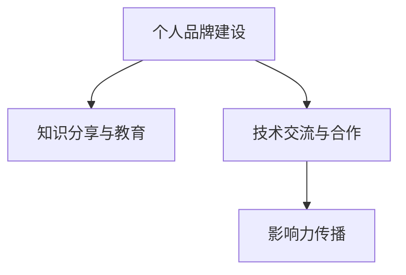

                 

# 程序员如何打造个人影响力生态

在信息技术迅猛发展的今天，程序员已经不再只是代码的编写者，更是技术生态的构建者和影响力传播的引领者。个人品牌和影响力的塑造，对于技术人来说既是个人发展的需求，也是企业和社会对技术精英的期待。本文将探讨如何通过一系列的技术、工具、社交等策略，帮助程序员打造个人影响力生态，实现从技术匠人到行业领袖的蜕变。

## 1. 背景介绍

### 1.1 问题由来

在信息爆炸的时代，互联网为个人提供了无限展示自我、表达见解的平台。程序员作为知识工作者，具有天然的表达需求和技术优势。如何通过技术影响他人，塑造专业形象，提升社会影响力，成为许多技术人共同关心的话题。特别是在技术社区活跃的当下，技术的突破与传播显得尤为关键。

### 1.2 问题核心关键点

在打造个人影响力生态的过程中，我们需要解决以下几个核心问题：
- **技术深度与广度**：如何在深度挖掘某一技术领域的同时，广泛涉猎多个相关技术，形成多维度的知识体系。
- **内容生产与传播**：如何持续产出优质内容，并通过各类渠道传播，提升内容影响力和个人品牌。
- **社交互动与协作**：如何利用社交媒体、专业论坛等平台，建立稳固的社交网络，与行业内的其他技术人进行深度互动。
- **知识分享与教学**：如何将自身掌握的技术知识以易懂、实用的方式分享给他人，促进技术生态的健康成长。

### 1.3 问题研究意义

构建个人影响力生态对于个人成长和企业发展具有重要意义：
- **个人品牌提升**：塑造专业形象，提升在技术圈中的知名度和影响力。
- **技术传承与创新**：将技术知识普及化，促进技术传播和创新，带动整个技术生态的进步。
- **职业发展**：借助个人影响力获得更多的职业机会，包括讲师、技术顾问、企业领导等职位。
- **企业价值提升**：通过个人品牌带动企业知名度，吸引更多的技术人才和投资。

## 2. 核心概念与联系

### 2.1 核心概念概述

为了更好地理解如何打造个人影响力生态，我们先列举一些核心概念：

- **个人品牌建设**：通过持续的技术输出、社交互动、教学活动，塑造个人专业形象，提升品牌知名度。
- **知识分享与教育**：将专业知识以文章、视频、课程等形式分享给更广泛的技术人群，推动知识传播和技术普及。
- **技术交流与合作**：利用社交媒体、技术论坛等平台，与同行建立联系，进行技术交流和合作。
- **影响力传播**：通过高质量的内容、社区活跃度、社交影响力，扩散个人品牌和影响力。

这些概念通过以下Mermaid流程图展示：



这个流程图展示了个人品牌建设的路径和关键步骤，包括知识分享与教育，技术交流与合作，以及影响力传播三个相互促进的环节。

## 3. 核心算法原理 & 具体操作步骤

### 3.1 算法原理概述

个人影响力生态的打造是一个系统工程，涉及到内容生产、社交互动、知识传播等多个维度。核心算法原理主要包括：

- **内容推送与优化**：利用推荐算法和优化技术，将高质量内容推送给目标用户，提升内容的可见性和影响力。
- **社交网络分析**：通过社交图谱分析，识别关键人物和社交圈，提升个人在社交网络中的地位。
- **知识图谱构建**：利用知识图谱技术，构建个人知识体系和专家网络，帮助用户进行快速检索和知识导航。
- **影响力指标评估**：设计多维度影响力指标，如文章阅读量、社交媒体关注度、课程参与率等，用于评估个人影响力的提升效果。

### 3.2 算法步骤详解

以下是个人影响力生态打造的详细操作步骤：

**Step 1: 内容创作与发布**
- 确定主题方向，选择目标受众，如Python编程、区块链技术等。
- 制定内容计划，如每周发布一篇博客、每月录制一次视频等。
- 利用Markdown、LaTeX等工具创作优质文章，使用代码高亮、图表插入等技术提升内容质量。
- 选择合适平台发布，如GitHub、知乎、Medium、Bilibili等，确保内容能被广泛传播。

**Step 2: 社交互动与协作**
- 注册并活跃于各大技术社区和社交平台，如Stack Overflow、Twitter、LinkedIn等。
- 定期参与讨论，分享内容，建立专业人脉。
- 加入技术群或论坛，与同行交流，获取反馈和建议。
- 关注并互动知名技术博主和社区意见领袖，扩大社交影响力。

**Step 3: 知识分享与教育**
- 在技术博客、Medium等平台发布文章，介绍技术知识、项目案例、经验总结等。
- 在YouTube、Bilibili等视频平台发布教程和讲座，提供实战演示和代码示例。
- 利用Coursera、Udemy等在线教育平台开设课程，系统化传授技术知识。
- 编写开源项目，通过GitHub协作机制，吸引更多开发者参与贡献。

**Step 4: 影响力评估与优化**
- 跟踪内容阅读量、点赞量、评论量等指标，评估内容的受欢迎程度。
- 分析社交媒体关注度、互动率等指标，了解社交影响力的提升情况。
- 收集用户反馈和建议，调整内容策略和互动方式。
- 定期进行影响力评估，识别关键改进点，优化个人品牌建设路径。

### 3.3 算法优缺点

个人影响力生态打造的方法有其优点和局限性：

**优点**：
- **效率高**：通过系统化的内容生产、社交互动、知识传播，快速提升个人品牌和影响力。
- **覆盖广**：借助各类技术平台，实现内容的广泛传播和社交网络的全面覆盖。
- **自我提升**：持续的知识分享和教学活动，促进个人技术的深度学习和经验积累。

**缺点**：
- **资源需求大**：需要投入大量时间和精力进行内容创作和社交互动，对个人精力要求较高。
- **效果不确定**：内容传播效果和社交影响力受多种因素影响，存在一定的不确定性。
- **行业依赖**：过于依赖特定技术领域，跨领域的知识普及和影响力扩展可能受限。

### 3.4 算法应用领域

个人影响力生态打造的范式适用于广泛的技术场景，包括但不限于以下领域：

- **软件开发**：如Python、JavaScript、Java等编程语言的技术传播。
- **数据科学**：如数据挖掘、机器学习、大数据等领域的知识普及。
- **区块链技术**：如智能合约、共识机制、隐私保护等技术教育。
- **人工智能**：如深度学习、自然语言处理、计算机视觉等技术的知识传播。
- **网络安全**：如加密算法、安全协议、漏洞利用等技术分享。
- **云计算**：如云计算架构、容器技术、微服务架构等技术推广。

## 4. 数学模型和公式 & 详细讲解 & 举例说明

### 4.1 数学模型构建

假设影响个人影响力的关键因素为技术水平（T）、社交互动（S）、内容质量（C）和知识广度（K）。我们可以建立如下数学模型：

$$
\text{Influence} = f(T, S, C, K)
$$

其中，$f$表示非线性函数，$T$、$S$、$C$、$K$分别代表技术水平、社交互动、内容质量和知识广度。

### 4.2 公式推导过程

为了简化问题，我们可以假设$f$为线性函数，然后推导出影响力的线性模型：

$$
\text{Influence} = aT + bS + cC + dK + e
$$

其中$a$、$b$、$c$、$d$和$e$为模型的系数，需要通过数据拟合得到。

以内容质量$C$为例，假设每篇文章的阅读量为$R$，点赞量为$P$，评论量为$C$，则内容质量$C$可以表示为：

$$
C = \alpha \log(R) + \beta \log(P) + \gamma \log(C)
$$

### 4.3 案例分析与讲解

以一个程序员在技术博客平台上的影响力提升为例：
- 技术水平（T）：通过不断学习、实践和项目经验积累，提升技术深度和广度。
- 社交互动（S）：通过在技术社区和社交平台上积极参与讨论，发表文章，扩大社交网络。
- 内容质量（C）：通过优化文章结构、增加互动元素（如代码示例、图表等），提升内容质量和吸引力。
- 知识广度（K）：通过学习和传播跨领域知识，构建多维度的知识体系，提升自身技术竞争力。

通过上述方法，该程序员可以逐步提升其在技术生态中的影响力。

## 5. 项目实践：代码实例和详细解释说明

### 5.1 开发环境搭建

以下是基于Python的开发者环境搭建流程：

1. **安装Python**：
   - 下载并安装最新版本的Python，如Python 3.8。
   - 添加Python到系统环境变量，配置开发环境。

2. **安装开发工具**：
   - 安装Jupyter Notebook，用于创建交互式笔记本。
   - 安装Markdown和LaTeX等文本处理工具。
   - 安装GitHub客户端，方便代码版本控制和协作。

3. **设置代码库**：
   - 创建一个Git仓库，用于存储个人博客和开源项目。
   - 添加README.md文件，介绍项目内容和使用方法。
   - 配置GitHub Pages，将博客内容部署到GitHub托管。

### 5.2 源代码详细实现

以下是一个简单的博客发布脚本，用于生成和发布Markdown文章：

```python
import os
import jinja2

# 定义模板文件路径
template_path = os.path.join(os.getcwd(), 'templates')

# 定义博客目录
blog_dir = os.path.join(os.getcwd(), 'blog')

# 定义模板
template_loader = jinja2.FileSystemLoader(searchpath=template_path)
template_env = jinja2.Environment(loader=template_loader)

# 读取博客内容
with open(os.path.join(blog_dir, 'blog.md'), 'r') as f:
    content = f.read()

# 渲染博客模板
with open(os.path.join(blog_dir, 'blog.html'), 'w') as f:
    f.write(template_env.from_string(content).render())
```

该脚本将Markdown格式的文章内容渲染为HTML格式，并保存至博客目录。

### 5.3 代码解读与分析

脚本的关键步骤如下：
- 通过Jinja2模板引擎，将Markdown内容转换为HTML格式。
- 使用文件读写操作，生成博客页面文件。
- 脚本简洁高效，适合新手学习和快速上手。

### 5.4 运行结果展示

运行该脚本后，生成的HTML文件可以在浏览器中打开，如下所示：

```html
<h1>My First Blog Post</h1>
<p>Welcome to my first blog post! Here, I'll share some insights about my latest project.</p>
```

通过这个简单的代码实例，可以看到代码实现的基本思路和关键技术，为初学者提供了一个良好的入门工具。

## 6. 实际应用场景

### 6.1 智能编程助手

智能编程助手是一个集技术分享、项目协作、问题解答于一体的技术平台。程序员可以通过撰写博客、分享代码、参与讨论等方式，构建自己的影响力生态。

**具体应用**：
- 在技术博客上发布最新的编程技巧、项目案例和经验总结。
- 在开源项目中贡献代码，并与同行进行协作。
- 在社区讨论区回答问题，解决其他程序员的技术问题。

**成功案例**：
- 知乎上的@CSDN博客作者，通过撰写高质量的技术文章，累计粉丝数超过10万，成为知名的技术博主。
- GitHub上的@Kalle-he，通过开源项目吸引了众多开发者参与，构建了一个活跃的编程社区。

### 6.2 在线教育平台

在线教育平台如Coursera、Udemy等，为技术人提供了教学和知识传播的舞台。通过视频课程、实战教程等方式，将专业知识传递给更广泛的学习者。

**具体应用**：
- 开设技术课程，录制视频教程，讲解技术原理和实战应用。
- 制作实战项目，提供代码示例和实战演示，帮助学员上手实践。
- 发布学习笔记和经验总结，帮助学员理解和掌握技术难点。

**成功案例**：
- Udemy上的@Al Sweigart，通过Python课程和实战项目，累计销售超过10万份课程，成为最受欢迎的编程老师之一。
- Coursera上的@Andrew Ng，通过机器学习课程，吸引了全球数百万学员，成为教育界和学术界的楷模。

### 6.3 开源社区

开源社区如GitHub、Stack Overflow等，为技术人提供了展示自我、贡献代码和交流互动的平台。通过参与开源项目，可以积累经验和名声，提升个人品牌。

**具体应用**：
- 在GitHub上创建和管理项目，贡献代码和文档。
- 在Stack Overflow上回答问题，解决其他程序员的技术问题。
- 与其他开发者合作，共同完成复杂项目，提升技术水平和团队协作能力。

**成功案例**：
- GitHub上的@Linus Torvalds，通过管理Linux内核项目，成为操作系统领域的权威人物。
- Stack Overflow上的@Jeff Atwood，通过解答技术问题，吸引了全球数百万程序员关注，成为技术社区的活跃分子。

### 6.4 未来应用展望

随着技术的不断发展，个人影响力生态也将迎来更多创新和机遇：
- **跨平台融合**：将技术内容通过多平台发布，提升内容的可见性和传播范围。
- **AI技术应用**：利用AI技术生成内容摘要、推荐系统、情感分析等，优化内容传播和社交互动。
- **区块链技术**：通过区块链技术，实现内容版权保护和激励机制，保护作者的知识产权。
- **元宇宙应用**：在虚拟现实和增强现实平台上，进行技术分享和互动，拓展技术生态的空间。
- **多语言支持**：利用机器翻译技术，将技术内容翻译成多种语言，拓展全球技术人的覆盖范围。

## 7. 工具和资源推荐

### 7.1 学习资源推荐

为了帮助程序员构建个人影响力生态，以下是一些优秀的学习资源推荐：

1. **技术博客和网站**：
   - 博客园：中国最大的技术社区，汇聚大量程序员分享经验和技术。
   - Medium：全球知名的内容发布平台，专注于高质量的技术文章。
   - GitHub Pages：提供免费的博客托管服务，适合开发者展示技术成果。

2. **在线课程和教程**：
   - Coursera：提供世界顶级大学和企业的在线课程，涵盖多种技术领域。
   - Udemy：提供实用的技术课程和实战教程，适合快速上手和深入学习。
   - Pluralsight：提供深入的技术培训和实战案例，帮助程序员提升技能。

3. **技术社区和论坛**：
   - Stack Overflow：全球最大的程序员问答社区，提供技术问题的解决方案。
   - GitHub：全球最大的开源社区，提供代码协作和项目分享的平台。
   - Reddit：涵盖多个技术领域的讨论社区，提供丰富的技术资源和交流平台。

### 7.2 开发工具推荐

以下是一些常用且高效的工具，帮助程序员构建个人影响力生态：

1. **Markdown编辑器**：
   - Typora：简单易用的Markdown编辑器，支持多平台使用。
   - MarkdownPad：功能强大的Markdown编辑器，支持语法高亮和代码高亮。

2. **在线编程环境**：
   - Jupyter Notebook：交互式编程环境，支持Python、R等多种语言。
   - Google Colab：免费的在线Jupyter Notebook环境，支持GPU和TPU计算。

3. **项目管理工具**：
   - Trello：基于看板的项目管理工具，支持团队协作和任务分配。
   - Asana：功能丰富的项目管理工具，适合复杂项目的协调和管理。

### 7.3 相关论文推荐

以下是几篇影响深远的技术论文，推荐程序员阅读：

1. **《如何建立强大的个人品牌》**：探讨了个人品牌建立的关键因素和策略，提供了实用的建议和案例分析。
2. **《社交媒体对个人影响力提升的影响》**：研究了社交媒体对个人品牌传播的贡献，提供了实证研究和统计数据。
3. **《技术博客对开发者职业发展的推动作用》**：分析了技术博客对开发者职业发展的正面影响，提供了实证研究和数据分析。
4. **《编程社区对程序员社交网络构建的影响》**：探讨了编程社区对程序员社交网络的构建作用，提供了实证研究和数据分析。

## 8. 总结：未来发展趋势与挑战

### 8.1 研究成果总结

本文探讨了程序员如何通过技术、工具、社交等策略，构建个人影响力生态，提升个人品牌和影响力。通过内容创作、社交互动、知识传播等多维度的努力，程序员可以逐步建立稳固的技术生态，实现职业发展和价值提升。

### 8.2 未来发展趋势

个人影响力生态的未来发展趋势包括：
- **多平台融合**：通过多平台发布内容，提升内容的可见性和传播范围。
- **AI技术应用**：利用AI技术优化内容生成、推荐系统和情感分析，提升内容质量和社交互动效果。
- **区块链技术**：通过区块链技术保护内容版权和激励机制，提升内容创作的积极性和质量。
- **元宇宙应用**：在虚拟现实和增强现实平台上进行技术分享和互动，拓展技术生态的空间。
- **多语言支持**：利用机器翻译技术，将技术内容翻译成多种语言，拓展全球技术人的覆盖范围。

### 8.3 面临的挑战

尽管个人影响力生态有诸多优势，但也面临一些挑战：
- **资源和时间投入**：需要大量时间和精力进行内容创作和社交互动，对个人精力要求较高。
- **内容质量不确定**：内容传播效果和社交影响力受多种因素影响，存在一定的不确定性。
- **跨领域难度**：过于依赖特定技术领域，跨领域的知识普及和影响力扩展可能受限。

### 8.4 研究展望

未来的研究需要在以下几个方面寻求新的突破：
- **内容自动化生成**：利用自然语言生成技术，自动生成高质量的技术文章和代码示例，提升内容产出效率。
- **社交网络分析**：通过社交图谱分析，识别关键人物和社交圈，提升社交网络的影响力和覆盖面。
- **知识图谱构建**：利用知识图谱技术，构建个人知识体系和专家网络，提升技术传播和知识导航的效果。
- **跨平台协作**：通过多平台协作机制，提升内容创作和社交互动的效率和效果。

## 9. 附录：常见问题与解答

**Q1: 如何提升个人品牌和影响力？**

A: 通过持续的内容创作、社交互动、知识分享和教学活动，建立专业形象和社交网络。利用各大技术平台，广泛传播高质量内容，积极参与讨论和互动，积累更多的关注和粉丝。

**Q2: 如何选择适合的内容创作平台？**

A: 根据内容类型和目标受众选择平台。例如，技术博客适合发布深入的技术文章，GitHub适合分享开源项目，Stack Overflow适合回答问题。

**Q3: 如何利用AI技术优化个人影响力生态？**

A: 利用AI技术生成内容摘要、推荐系统和情感分析，提升内容质量和传播效果。例如，使用自然语言生成技术自动生成文章，利用推荐系统推广高质量内容，利用情感分析了解用户反馈和兴趣点。

**Q4: 如何平衡时间和精力投入？**

A: 制定明确的内容计划和社交策略，合理分配时间和精力。利用工具和技术自动化内容创作和社交互动，提升效率。同时，也要注重身心健康，避免过度劳累。

**Q5: 如何应对跨领域的知识普及挑战？**

A: 通过学习跨领域的知识和技术，构建多维度的知识体系。参加不同领域的项目和活动，积累跨领域的知识和经验。利用知识图谱技术，进行跨领域的知识导航和探索。

---

作者：禅与计算机程序设计艺术 / Zen and the Art of Computer Programming

