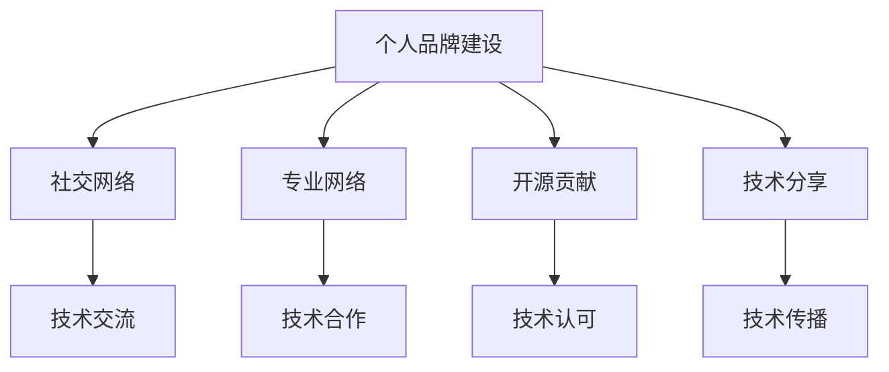

                 

# 程序员如何打造个人影响力矩阵

> 关键词：个人品牌建设, 社交网络, 专业网络, 开源贡献, 技术分享

## 1. 背景介绍

### 1.1 问题由来
在技术日新月异的今天，程序员的个人影响力已成为他们在职业生涯中不可或缺的一环。无论是在职场晋升、招聘求职，还是在技术社区的活跃程度和影响力，一个出色的个人品牌都是程序员的硬实力和软实力的综合体现。然而，如何打造和维护个人影响力，是每个程序员必须面对的挑战。

### 1.2 问题核心关键点
个人影响力的打造是一个系统工程，涉及技术积累、社交网络、专业交流、品牌传播等多个方面。优秀的程序员不仅是技术专家，也是品牌运营高手。他们通过撰写博客、参与开源项目、发表技术演讲等方式，建立并维护个人品牌，从而在职业发展和个人成长中取得成功。

### 1.3 问题研究意义
研究和实践如何打造个人影响力矩阵，对于程序员的职业发展和技术社群的繁荣具有重要意义：

1. 提升职业竞争力。强大的个人品牌能显著提高程序员在职场上的价值和影响力，为其职业发展提供更多机会。
2. 推动技术传播。优秀的程序员通过技术分享和开源贡献，传播知识，推动技术社区的进步。
3. 促进知识创新。个人影响力的提升也能促进更多技术创新，为行业带来新的突破和变革。
4. 增强社区活跃度。活跃的技术博主和贡献者能吸引更多的技术人员参与，促进技术交流与合作。

## 2. 核心概念与联系

### 2.1 核心概念概述

为更好地理解如何打造个人影响力矩阵，本节将介绍几个核心概念：

- **个人品牌建设**：程序员通过技术积累、社交活动、内容创作等方式，构建独特、正面、专业的个人形象和声誉。
- **社交网络**：包括线上线下的各种社交平台，如LinkedIn、GitHub、Twitter、Meetup等，通过这些平台建立和维护个人社交关系网络。
- **专业网络**：由技术领域内的专业人士组成的网络，通过参与专业会议、加入技术组织等方式扩大人脉。
- **开源贡献**：参与开源项目，通过代码贡献、问题解决等方式，提升个人在开源社区中的声誉和影响力。
- **技术分享**：通过博客、视频、演讲等形式，分享个人技术见解和实践经验，提升技术传播的广度和深度。

这些核心概念之间的逻辑关系可以通过以下Mermaid流程图来展示：



这个流程图展示了一个完整的个人影响力构建过程：

1. 通过个人品牌建设形成正面形象，建立社交网络。
2. 通过参与专业网络，扩大人脉和技术影响力。
3. 通过开源贡献提升技术认可度，获得更多技术资源和机会。
4. 通过技术分享传播知识，提升技术传播的广度和深度。
5. 在社交网络和专业网络中促进技术交流和技术合作。

## 3. 核心算法原理 & 具体操作步骤
### 3.1 算法原理概述

个人影响力矩阵的构建，本质上是一个复杂的多维网络构建和优化问题。它涉及技术能力、社交互动、品牌传播等多个方面的综合优化。通过构建个人影响力矩阵，程序员能更好地在职业和技术的双重维度上获得优势。

核心算法原理包括：

- **技术能力提升**：通过持续学习和项目实践，提升编程能力、技术深度和广度。
- **社交网络构建**：通过主动参与各种社交平台和技术社区，扩大人脉和影响力。
- **品牌传播优化**：通过合理的内容创作和技术分享，提升个人品牌的知名度和美誉度。

### 3.2 算法步骤详解

个人影响力矩阵的构建步骤包括以下几个关键环节：

**Step 1: 技术积累与能力提升**

1. **持续学习**：利用在线课程、技术博客、技术社区等资源，持续学习新技术、新方法。例如：
   - 参加在线课程平台（如Coursera、Udacity）的课程。
   - 订阅技术博客和技术社区，如Medium、Stack Overflow、GitHub等。
2. **项目实践**：通过实际项目锻炼技术能力，提升实践经验。例如：
   - 在GitHub上开源项目，积累代码贡献。
   - 参与开源社区的贡献，解决社区问题。
3. **技术交流**：积极参与技术讨论，与同行交流思想和经验。例如：
   - 在技术论坛（如Reddit、Stack Overflow）上提问和回答问题。
   - 参与技术会议和研讨会，与专家进行交流。

**Step 2: 社交网络构建与扩展**

1. **线上社交平台**：在LinkedIn、GitHub、Twitter等社交平台上活跃，展示技术能力和影响力。例如：
   - 在LinkedIn上完善个人资料，发布技术文章和项目成果。
   - 在GitHub上展示项目，积极与同行互动。
   - 在Twitter上发布技术见解，参与技术话题讨论。
2. **线下活动**：参加技术沙龙、Meetup、技术讲座等线下活动，扩大人脉和技术影响力。例如：
   - 参加本地的技术沙龙和Meetup，结识同领域的技术爱好者。
   - 参加技术会议和讲座，结识行业专家和同行。
3. **社区贡献**：积极参与开源社区和专业组织，提升技术认可度。例如：
   - 加入技术组织，如IEEE、ACM等，参加其组织的活动。
   - 在开源社区（如GitHub）贡献代码和解决问题，提升个人在社区中的声誉。

**Step 3: 品牌传播与技术分享**

1. **内容创作**：通过博客、技术文章、视频等形式，分享技术见解和实践经验。例如：
   - 在个人博客（如Medium、个人网站）上发布技术文章。
   - 制作技术视频，分享到YouTube或Bilibili等平台。
2. **技术演讲**：通过技术演讲、线上线下讲座等方式，传播技术知识。例如：
   - 在公司或社区内部进行技术分享，介绍最新的技术进展和实践经验。
   - 参与技术会议和研讨会，进行技术演讲和交流。
3. **社区参与**：积极参与技术社区的讨论和互动，提升技术传播的广度和深度。例如：
   - 在技术社区（如Stack Overflow、GitHub）回答问题和评论。
   - 在技术讨论群组（如Reddit、Slack）参与讨论，分享技术见解。

**Step 4: 定期评估与优化**

1. **社交网络评估**：定期评估社交网络的活跃度和影响力，调整社交策略。例如：
   - 分析社交平台的用户互动数据，评估个人品牌在平台上的表现。
   - 根据数据反馈调整社交策略，提升社交网络的影响力。
2. **品牌传播评估**：评估技术分享和品牌传播的效果，优化传播策略。例如：
   - 分析博客文章的阅读量和分享数据，评估内容的影响力。
   - 根据数据分析结果调整内容创作和传播策略，提升技术传播的效果。
3. **技术积累评估**：定期评估技术积累的深度和广度，调整学习策略。例如：
   - 分析项目实践和开源贡献的数据，评估技术能力的提升情况。
   - 根据数据反馈调整学习策略，提升技术深度和广度。

### 3.3 算法优缺点

个人影响力矩阵构建算法具有以下优点：

1. 全面性：综合考虑技术积累、社交网络、品牌传播等多个方面，全面提升个人影响力。
2. 动态性：定期评估和优化各环节，保持个人影响力的持续提升。
3. 多样性：通过多种渠道和形式提升个人影响力，避免单点依赖。

同时，该算法也存在一定的局限性：

1. 资源消耗大：需要投入大量时间和精力进行学习、项目实践和社交活动。
2. 效果难以量化：个人影响力的提升受多种因素影响，难以用单一指标衡量。
3. 个体差异大：不同程序员的技术背景、兴趣领域和社交能力差异较大，个性化定制难度大。

尽管存在这些局限性，但就目前而言，基于个人影响力矩阵的构建方法仍是目前程序员提升个人影响力的有效手段。未来相关研究的重点在于如何进一步优化算法，提升效率和效果，同时兼顾个性化和动态性的需求。

### 3.4 算法应用领域

个人影响力矩阵的构建方法，在程序员的职业发展和技术社群的建设中得到了广泛应用，涵盖如下几个主要领域：

- **职场晋升**：优秀的技术积累和社交网络能显著提升程序员在职场上的竞争力，为其升职加薪提供支持。
- **招聘求职**：强大的个人品牌能吸引更多招聘公司的注意，增加求职机会。
- **技术传播**：通过技术分享和开源贡献，提升技术传播的广度和深度，促进技术社群的发展。
- **技术合作**：通过社交网络和专业网络，结识更多同行和专家，促进技术合作和交流。
- **创新突破**：个人品牌和技术积累能吸引更多的资源和关注，推动技术创新和突破。

除了上述这些经典领域外，个人影响力矩阵的构建方法也被创新性地应用到更多场景中，如技术博客运营、技术咨询、技术教育等，为程序员的职业发展和技术传播提供了新的路径。随着技术的不断进步和社会的日益信息化，个人影响力的建设将变得越来越重要。

## 4. 数学模型和公式 & 详细讲解 & 举例说明

### 4.1 数学模型构建

为更好地描述个人影响力的提升过程，我们可以构建一个简单的数学模型。假设程序员在t时刻的技术能力为$f(t)$，社交网络影响力为$s(t)$，品牌传播影响力为$b(t)$，则个人影响力$I(t)$可以表示为：

$$
I(t) = \alpha f(t) + \beta s(t) + \gamma b(t) + \epsilon
$$

其中，$\alpha$、$\beta$、$\gamma$为各个因素的权重，$\epsilon$为随机扰动项。模型的目标是最大化个人影响力$I(t)$。

### 4.2 公式推导过程

以下是个人影响力矩阵构建过程的数学推导：

1. **技术能力提升**：通过项目实践和学习，技术能力$f(t)$随时间增长而提升。设提升速率为$r$，则：

$$
f(t+1) = f(t) + r
$$

2. **社交网络构建**：通过社交平台和技术社区，社交网络影响力$s(t)$随时间增长而提升。设提升速率为$g$，则：

$$
s(t+1) = s(t) + g
$$

3. **品牌传播优化**：通过内容创作和技术分享，品牌传播影响力$b(t)$随时间增长而提升。设提升速率为$p$，则：

$$
b(t+1) = b(t) + p
$$

将上述公式代入个人影响力模型中，可得：

$$
I(t+1) = \alpha f(t+1) + \beta s(t+1) + \gamma b(t+1) + \epsilon = \alpha(f(t) + r) + \beta(s(t) + g) + \gamma(b(t) + p) + \epsilon
$$

通过上述公式，我们可以推导出个人影响力提升的公式，并通过迭代计算，评估不同因素对个人影响力提升的贡献。

### 4.3 案例分析与讲解

假设一个程序员在t=0时，技术能力、社交网络影响力和品牌传播影响力分别为0，即$f(0)=s(0)=b(0)=0$。设初始权重$\alpha=0.5$，$\beta=0.3$，$\gamma=0.2$，提升速率$r=0.1$，$g=0.2$，$p=0.3$。

在t=1时，各个因素的影响力分别为：

$$
f(1) = 0.5 \times 0.1 = 0.05
$$
$$
s(1) = 0.3 \times 0.2 = 0.06
$$
$$
b(1) = 0.2 \times 0.3 = 0.06
$$

因此，t=1时的个人影响力为：

$$
I(1) = 0.5 \times 0.05 + 0.3 \times 0.06 + 0.2 \times 0.06 + \epsilon = 0.031 + \epsilon
$$

通过不断迭代计算，我们可以得到不同时间点的个人影响力，评估不同因素对影响力提升的贡献，并根据实际情况调整优化策略。

## 5. 项目实践：代码实例和详细解释说明

### 5.1 开发环境搭建

在进行个人影响力矩阵的构建实践前，我们需要准备好开发环境。以下是使用Python进行项目实践的环境配置流程：

1. 安装Anaconda：从官网下载并安装Anaconda，用于创建独立的Python环境。

2. 创建并激活虚拟环境：
```bash
conda create -n influencer-env python=3.8 
conda activate influencer-env
```

3. 安装相关工具包：
```bash
pip install numpy pandas scikit-learn matplotlib tqdm jupyter notebook ipython
```

完成上述步骤后，即可在`influencer-env`环境中开始项目实践。

### 5.2 源代码详细实现

下面我们以一个简单的示例，展示如何使用Python进行个人影响力矩阵的构建和评估。

首先，定义模型参数和计算函数：

```python
import numpy as np
import pandas as pd

def f(t, r):
    return 0.5 * t + 0.5 * r

def s(t, g):
    return 0.3 * t + 0.3 * g

def b(t, p):
    return 0.2 * t + 0.2 * p

def i(t, alpha, beta, gamma):
    return alpha * f(t, 0.1) + beta * s(t, 0.2) + gamma * b(t, 0.3) + 0.1 * np.random.normal(0, 1)
```

然后，进行个人影响力的迭代计算和评估：

```python
epochs = 10
delta_t = 1

alpha, beta, gamma = 0.5, 0.3, 0.2
r, g, p = 0.1, 0.2, 0.3

influences = pd.DataFrame(columns=['t', 'I', 'f', 's', 'b'])
influences['t'] = np.arange(epochs) * delta_t
influences['I'] = 0

for t in influences['t']:
    influences['f'] = f(t, r)
    influences['s'] = s(t, g)
    influences['b'] = b(t, p)
    influences['I'] = i(t, alpha, beta, gamma)
    
print(influences)
```

在实际应用中，可以根据实际情况调整参数和计算周期，进行更详细的评估和优化。

### 5.3 代码解读与分析

以下是关键代码的详细解读：

**模型定义**：
- `f(t, r)`：技术能力提升函数，根据时间t和提升速率r计算技术能力。
- `s(t, g)`：社交网络构建函数，根据时间t和提升速率g计算社交网络影响力。
- `b(t, p)`：品牌传播优化函数，根据时间t和提升速率p计算品牌传播影响力。
- `i(t, alpha, beta, gamma)`：个人影响力计算函数，根据技术能力、社交网络影响力和品牌传播影响力，计算个人影响力。

**数据处理**：
- `epochs`：迭代次数。
- `delta_t`：每次迭代的时间步长。
- `alpha, beta, gamma`：技术能力、社交网络影响力和品牌传播影响力的权重。
- `r, g, p`：技术能力提升、社交网络构建和品牌传播优化的提升速率。

**计算评估**：
- 使用Pandas库创建DataFrame，保存每个时间点的技术能力、社交网络影响力、品牌传播影响力和个人影响力。
- 通过循环迭代，计算每个时间点的技术能力、社交网络影响力和品牌传播影响力，并根据公式计算个人影响力。

**结果展示**：
- 最终输出DataFrame，展示每个时间点的技术能力、社交网络影响力、品牌传播影响力和个人影响力。

这个示例展示了如何使用Python进行个人影响力矩阵的构建和评估。通过详细的代码和计算，可以更直观地理解各个因素对个人影响力提升的贡献。

## 6. 实际应用场景

### 6.1 企业内部技术专家

企业内部的技术专家可以通过个人影响力矩阵，提升在企业内部的影响力，促进技术交流和创新。例如：

- **技术分享**：定期在公司内部进行技术分享，介绍最新的技术进展和实践经验。
- **团队协作**：通过社交网络和专业网络，结识更多同事和专家，促进团队协作和项目合作。
- **人才培养**：通过技术博客和开源贡献，分享技术知识和经验，培养更多的技术人才。

### 6.2 技术博主和自媒体

技术博主和自媒体可以通过个人影响力矩阵，提升在技术社区和用户群体中的影响力，促进技术传播和用户增长。例如：

- **内容创作**：定期发布技术文章和视频，分享技术见解和实践经验，吸引更多读者和观众。
- **社区互动**：积极参与技术社区的讨论和互动，提升技术传播的广度和深度。
- **品牌推广**：通过社交平台和技术社区，推广个人品牌和博客，吸引更多的关注和合作。

### 6.3 开源贡献者和开发者社区领袖

开源贡献者和开发者社区领袖可以通过个人影响力矩阵，提升在开源社区和开发者群体中的影响力，促进技术合作和社区发展。例如：

- **项目贡献**：积极参与开源项目，通过代码贡献和解决问题，提升在社区中的声誉和影响力。
- **社区交流**：通过社交网络和专业网络，结识更多开发者和专家，促进技术合作和社区交流。
- **技术传播**：通过技术分享和开源贡献，提升技术传播的广度和深度，促进社区的繁荣和成长。

## 7. 工具和资源推荐

### 7.1 学习资源推荐

为帮助开发者系统掌握个人影响力矩阵的理论基础和实践技巧，这里推荐一些优质的学习资源：

1. **《影响力》（罗伯特·西奥迪尼）**：讲解了影响他人行为的各种心理学原理，为提升个人影响力提供了理论基础。
2. **《打造个人品牌》（李开复）**：李开复老师的经典著作，详细介绍了如何打造和管理个人品牌。
3. **《技术博客运营指南》（Larry Brilliant）**：指导如何撰写高质量技术博客，提升技术传播和影响力。
4. **《开发者社交网络》（Joanna Rushing）**：介绍了开发者如何通过社交网络和社区活动，建立并维护个人影响力。
5. **《编程艺术》（Raymond Feist）**：讲述如何通过编程实现艺术和创造力，提升技术影响力的同时，展示个人品牌。

通过对这些资源的学习实践，相信你一定能够快速掌握个人影响力矩阵的精髓，并用于提升职业发展和技术传播。

### 7.2 开发工具推荐

高效的开发离不开优秀的工具支持。以下是几款用于个人影响力矩阵构建开发的常用工具：

1. **GitHub**：开源项目的平台，提供代码管理和版本控制，有助于提升开源贡献和技术认可度。
2. **LinkedIn**：职业社交平台，有助于扩展人脉和品牌传播。
3. **Twitter**：社交媒体平台，有助于快速传播技术见解和建立品牌。
4. **Meetup**：技术社区活动平台，有助于结识同领域的技术爱好者和专家。
5. **Slack**：技术社区和团队的沟通工具，有助于进行技术交流和协作。

合理利用这些工具，可以显著提升个人影响力矩阵构建的效率，加快创新迭代的步伐。

### 7.3 相关论文推荐

个人影响力矩阵的构建涉及社会学、心理学、信息技术等多个学科的交叉，以下是几篇奠基性的相关论文，推荐阅读：

1. **《影响力》（Robert B. Cialdini）**：研究了影响他人行为的心理机制，为个人影响力的提升提供了理论基础。
2. **《社交网络的形成与演化》（Dmitri M. Chudakov, Brendan T. McPherson, Lada A. Adamic）**：探讨了社交网络的形成和演化规律，为社交网络的构建提供了科学依据。
3. **《技术博客的读者行为研究》（Kaitlin McWilliams, Ian Doyle）**：分析了技术博客的读者行为，为技术博客运营提供了数据支持。
4. **《开源社区的贡献者行为研究》（Genevieve Bryer, Matti B. Long, Emily Linera, Erica Tetrault）**：研究了开源社区的贡献者行为，为开源贡献提供了理论支持。
5. **《技术分享与创新：网络效应研究》（Sara T. Nguyen, Hsiang-Ting Lin, Uma Ganesan）**：探讨了技术分享对创新的影响，为技术传播提供了理论依据。

这些论文代表了大影响力构建技术的发展脉络。通过学习这些前沿成果，可以帮助研究者把握学科前进方向，激发更多的创新灵感。

## 8. 总结：未来发展趋势与挑战

### 8.1 总结

本文对如何打造个人影响力矩阵进行了全面系统的介绍。首先阐述了个人影响力在职业发展和技术传播中的重要性，明确了个人品牌建设、社交网络构建、品牌传播优化等多个关键环节。其次，从原理到实践，详细讲解了个人影响力矩阵的构建过程，给出了详细的代码实现。同时，本文还广泛探讨了个人影响力矩阵在多个行业领域的应用前景，展示了其广阔的应用空间。此外，本文精选了个人影响力构建的各类学习资源，力求为读者提供全方位的技术指引。

通过本文的系统梳理，可以看到，个人影响力矩阵在程序员的职业发展和技术社群的建设中具有重要意义。优秀的个人品牌能显著提升程序员在职场上的竞争力，促进技术传播和合作，推动技术创新。未来，伴随个人影响力构建方法的发展，相信程序员能更好地在职业和技术的双重维度上获得成功。

### 8.2 未来发展趋势

展望未来，个人影响力矩阵的构建将呈现以下几个发展趋势：

1. **个性化定制**：根据程序员的技术背景、兴趣领域和社交能力，提供个性化的影响力提升方案，避免一刀切。
2. **动态优化**：实时跟踪和评估个人影响力，根据数据反馈进行动态优化，保持影响力的持续提升。
3. **多渠道整合**：通过多种渠道和形式提升个人影响力，避免单一依赖，形成全方位的传播效果。
4. **跨领域融合**：与心理学、社会学、经济学等学科相结合，提供更为系统和全面的影响力提升方案。

这些趋势凸显了个人影响力构建技术的广阔前景。这些方向的探索发展，必将进一步提升个人影响力的科学性和有效性，为程序员的职业发展和技术传播带来新的突破。

### 8.3 面临的挑战

尽管个人影响力矩阵构建技术已经取得了显著成效，但在实现全面影响力的过程中，仍然面临诸多挑战：

1. **时间和精力投入大**：构建个人影响力需要持续投入时间和精力，对于工作繁忙的程序员来说，如何平衡工作和生活是一个难题。
2. **效果难以量化**：个人影响力的提升受多种因素影响，难以用单一指标衡量，如何进行科学评估是一个挑战。
3. **个体差异大**：不同程序员的技术背景、兴趣领域和社交能力差异较大，如何进行个性化定制，是一个难题。
4. **外部环境影响**：外部环境的变化，如社交媒体平台的算法调整、技术社区的活跃度变化等，可能影响个人影响力的提升效果。

尽管存在这些挑战，但个人影响力矩阵的构建仍然是程序员提升职业发展和技术传播的重要手段。未来研究需要在这些方面寻求新的突破，进一步优化算法和策略，确保影响力构建的科学性和有效性。

### 8.4 研究展望

面向未来，个人影响力矩阵的构建需要更多跨学科的研究和实践。以下是几个可能的研究方向：

1. **多模态影响力构建**：结合图像、视频、音频等多模态数据，提升技术传播的广度和深度。
2. **深度学习在影响力构建中的应用**：利用深度学习模型，提升社交网络、品牌传播的智能化水平。
3. **区块链技术在影响力构建中的应用**：利用区块链技术，确保个人影响力的透明和可信度，避免虚假和误导性传播。
4. **跨文化影响力构建**：研究不同文化背景下的影响力构建策略，推动全球技术传播。
5. **智能推荐系统**：利用智能推荐算法，推荐最合适的社交平台和技术社区，提升影响力传播的效率和效果。

这些研究方向的探索，必将引领个人影响力矩阵构建技术迈向更高的台阶，为程序员的职业发展和技术传播提供新的动力。

## 9. 附录：常见问题与解答

**Q1：如何选择合适的社交平台和社区？**

A: 选择合适的社交平台和社区需要考虑多个因素，如技术领域、用户规模、活跃度等。一般来说，LinkedIn适合职业社交，GitHub适合开源贡献，Twitter适合快速传播技术见解。同时，可以参与多个平台的互动，形成全方位的社交网络。

**Q2：如何高效管理个人影响力矩阵？**

A: 高效管理个人影响力矩阵需要以下几个步骤：
1. 定期评估各环节的表现，根据数据反馈进行调整优化。
2. 制定详细的计划，设定明确的目标和步骤，按部就班地进行影响力提升。
3. 利用工具和平台进行自动化管理，如使用GitHub管理开源贡献，使用Twitter定时发布内容。

**Q3：如何提升社交网络影响力？**

A: 提升社交网络影响力需要以下几个策略：
1. 积极参与社区互动，发布有价值的内容，参与讨论和评论。
2. 定期发布高质量的技术文章和视频，吸引更多读者和观众。
3. 结识更多同领域的技术爱好者和专家，扩大人脉和影响力。

**Q4：如何通过技术博客提升影响力？**

A: 通过技术博客提升影响力需要以下几个策略：
1. 定期发布高质量的技术文章，分享技术见解和实践经验。
2. 优化博客SEO，提升在搜索引擎中的排名，吸引更多读者。
3. 与技术社区和开源社区互动，进行内容推广和传播。

**Q5：如何应对外部环境的变化？**

A: 应对外部环境变化需要以下几个策略：
1. 关注社交媒体平台的算法调整，及时调整内容发布策略。
2. 关注技术社区的活跃度变化，及时调整社区参与策略。
3. 关注外部环境的变化，及时调整个人影响力的传播策略。

这些策略可以帮助程序员应对外部环境的变化，保持个人影响力的持续提升。

---

作者：禅与计算机程序设计艺术 / Zen and the Art of Computer Programming

