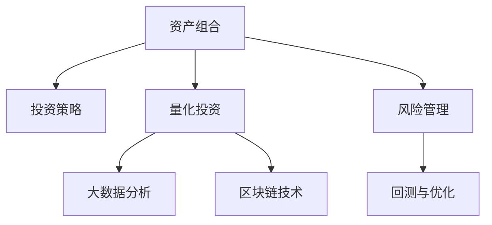

                 

# 程序员如何构建百万美元资产组合

> 关键词：资产组合, 投资策略, 算法交易, 大数据分析, 区块链技术

## 1. 背景介绍

在金融市场的风云变幻中，资产组合成为程序员构建百万美元财富的重要工具。面对复杂多变的市场环境，程序员如何利用技术和数据优势，构建稳定可持续的资产组合，是本文探讨的核心问题。

### 1.1 问题由来

金融市场的高度复杂性和不确定性，使得传统的投资策略面临诸多挑战。高波动性和信息不对称性使得精确预测市场走向变得困难重重。然而，大数据分析和区块链技术的迅猛发展，为程序员提供了全新的技术工具，用于构建更加智能和自动化的投资系统。

程序员可以利用Python、R、Java等编程语言，结合机器学习、深度学习、自然语言处理等技术，构建复杂的投资策略和资产组合，实现对市场的精准预测和高效管理。此外，区块链技术提供的去中心化、不可篡改特性，为程序员开发数字资产交易系统提供了新的可能。

### 1.2 问题核心关键点

构建资产组合的核心在于如何通过投资策略实现资产的有效配置，从而最大化收益并控制风险。主要包括以下几个关键点：

- **投资组合理论**：研究如何在多种资产之间进行配置，以达到风险与收益的最佳平衡。
- **量化投资**：通过算法和模型分析大量数据，实现投资决策的自动化。
- **大数据分析**：利用大数据技术进行市场分析、交易分析、风险管理等，为投资决策提供数据支持。
- **区块链技术**：提供安全、透明、不可篡改的交易环境，拓展数字资产的交易新场景。

## 2. 核心概念与联系

### 2.1 核心概念概述

为更好地理解构建资产组合的思路，本节将介绍几个关键概念：

- **资产组合**：指通过投资多种资产，实现风险分散和收益最大化的投资策略。常见的资产包括股票、债券、期货、货币等。
- **投资策略**：根据市场分析、技术分析等手段，制定买入、卖出、持有等操作指令，指导资产配置。
- **量化投资**：通过计算机算法和模型，自动化执行投资策略，实现决策的客观性和科学性。
- **大数据分析**：利用大规模数据进行市场、交易、风险等的分析和预测，辅助投资决策。
- **区块链技术**：提供去中心化、透明、不可篡改的交易环境，为数字资产交易提供新的可能。

这些概念之间的逻辑关系可以通过以下Mermaid流程图来展示：



这个流程图展示资产组合的核心概念及其之间的关系：

1. 资产组合通过投资策略配置多种资产。
2. 量化投资使用算法和模型自动化执行策略，提高决策效率。
3. 大数据分析提供市场、交易、风险等数据支持。
4. 区块链技术拓展数字资产交易新场景。
5. 风险管理通过回测和优化，控制组合风险。

这些概念共同构成了程序员构建资产组合的基础框架，通过理解这些关键点，我们可以更好地把握投资策略的实现步骤和优化方向。

## 3. 核心算法原理 & 具体操作步骤

### 3.1 算法原理概述

构建资产组合的核心算法原理主要包括投资组合理论、量化投资和风险管理等。以下将分别介绍这些关键算法的原理。

- **投资组合理论**：通过数学模型计算不同资产之间的风险和收益相关性，确定最优资产配置。
- **量化投资**：利用机器学习和深度学习算法，自动化分析市场数据，预测价格变化，制定交易策略。
- **风险管理**：通过回测和优化，调整投资组合，实现风险控制和收益最大化。

### 3.2 算法步骤详解

构建资产组合的算法步骤大致分为以下几个环节：

**Step 1: 数据收集与预处理**

1. 数据收集：获取股票、期货、外汇等市场数据，包括价格、成交量、基本面数据等。
2. 数据清洗：去除缺失值、异常值，确保数据质量。
3. 数据标准化：对数据进行归一化处理，使其符合模型输入要求。

**Step 2: 模型选择与训练**

1. 模型选择：选择适合市场的模型，如线性回归、决策树、随机森林、神经网络等。
2. 数据分割：将数据集分为训练集、验证集和测试集。
3. 模型训练：在训练集上训练模型，并通过交叉验证优化模型参数。

**Step 3: 策略制定与回测**

1. 策略制定：基于训练好的模型，制定具体的交易策略，如买入、卖出、持有等。
2. 策略回测：使用历史数据对策略进行回测，评估策略的有效性和风险。
3. 策略优化：根据回测结果，调整策略参数，优化策略性能。

**Step 4: 风险管理与实时交易**

1. 风险管理：计算组合的风险指标，如VaR（Value at Risk）、VaR%、CVaR等。
2. 交易执行：根据优化后的策略，执行具体的交易操作，控制仓位和交易频率。
3. 实时监控：实时监控市场变化，及时调整策略，规避风险。

**Step 5: 组合调整与策略更新**

1. 组合调整：根据市场变化和策略回测结果，调整资产配置，优化组合结构。
2. 策略更新：定期更新模型和策略，确保其适应市场变化。

### 3.3 算法优缺点

构建资产组合的算法具有以下优点：

- **自动化与科学化**：利用计算机算法和模型，提高投资决策的科学性和自动化程度。
- **精准预测**：结合大数据分析和机器学习技术，对市场变化进行精准预测。
- **风险控制**：通过优化和回测，实现风险管理和组合优化。

然而，这些算法也存在以下局限：

- **数据依赖**：算法的准确性和有效性依赖于数据的质量和完备性，数据偏差可能导致决策失误。
- **模型复杂**：复杂的模型和算法可能导致过拟合，难以处理未知的市场变化。
- **计算成本**：大规模数据和复杂模型的计算成本较高，需要高性能计算环境。

尽管存在这些局限，但就目前而言，基于算法和数据的投资策略仍然是构建资产组合的重要手段。未来相关研究的重点在于如何进一步降低算法的计算成本，提升模型的泛化能力，以及加强对市场的风险管理。

### 3.4 算法应用领域

构建资产组合的算法已经在多个金融领域得到应用，包括但不限于：

- **股票投资**：通过量化策略和机器学习模型，进行股票的买入、卖出和持有。
- **期货交易**：利用技术分析和量化模型，进行期货合约的买卖和套利。
- **外汇交易**：结合市场分析和风险管理，进行外汇交易的策略制定和风险控制。
- **数字资产交易**：利用区块链技术和量化算法，进行数字货币的交易和投资。
- **资产配置**：根据市场分析和风险评估，优化资产配置，实现多元化的投资组合。

除了上述这些经典应用外，构建资产组合的算法还被创新性地应用到更多场景中，如高频交易、资产负债管理、风险对冲等，为金融市场带来新的突破。随着技术的发展，算法的应用领域将进一步拓展，为投资者提供更多的机会和挑战。

## 4. 数学模型和公式 & 详细讲解 & 举例说明

### 4.1 数学模型构建

构建资产组合的数学模型主要包括风险收益模型、量化投资模型和风险管理模型。以下将分别介绍这些模型的构建方法。

**风险收益模型**：计算资产组合的期望收益和风险。假设资产组合中有n种资产，第i种资产的期望收益率为$r_i$，标准差为$\sigma_i$，相关系数为$\rho_{ij}$。则组合的期望收益率为：

$$
E(r_p) = \sum_{i=1}^n w_ir_i
$$

组合的风险为：

$$
\sigma_p = \sqrt{\sum_{i=1}^n \sum_{j=1}^n w_iw_j\rho_{ij}\sigma_i\sigma_j}
$$

其中$w_i$为第i种资产在组合中的权重。

**量化投资模型**：利用机器学习算法预测资产价格变化。假设资产价格为$X_i(t)$，市场数据为$y(t)$。利用线性回归模型预测价格变化：

$$
\hat{X}_i(t) = \alpha_i + \beta_iy(t) + \epsilon_i(t)
$$

其中$\alpha_i$为截距，$\beta_i$为斜率，$\epsilon_i(t)$为误差项。

**风险管理模型**：计算组合的风险指标。如VaR、VaR%等，用于评估组合的风险承受能力。假设组合的总价值为V，风险价值为$\Delta V$，置信水平为$\alpha$。则VaR为：

$$
VaR = V\Phi^{-1}(\alpha)
$$

其中$\Phi^{-1}$为标准正态分布的逆函数。

### 4.2 公式推导过程

以下是几个核心数学公式的详细推导过程：

**线性回归公式推导**：

假设数据集$(x_i, y_i)$，$i=1,2,...,n$。线性回归模型为：

$$
y_i = \alpha + \beta x_i + \epsilon_i
$$

其中$x_i$为自变量，$y_i$为因变量，$\alpha$为截距，$\beta$为斜率，$\epsilon_i$为误差项。最小二乘法求解模型参数：

$$
\min \sum_{i=1}^n (y_i - (\alpha + \beta x_i))^2
$$

对$\alpha$和$\beta$求偏导，得：

$$
\alpha = \frac{\sum_{i=1}^n (y_i - \overline{y})}{\sum_{i=1}^n (x_i - \overline{x})^2}
$$

$$
\beta = \frac{\sum_{i=1}^n (x_i - \overline{x})(y_i - \overline{y})}{\sum_{i=1}^n (x_i - \overline{x})^2}
$$

**VaR计算公式推导**：

假设资产价格$X_i(t)$服从正态分布$N(\mu_i, \sigma_i^2)$，组合的总价值为V。VaR的计算公式为：

$$
VaR = V\Phi^{-1}(\alpha)
$$

其中$\Phi^{-1}$为标准正态分布的逆函数。

### 4.3 案例分析与讲解

以股票组合为例，假设投资组合中有两种股票A和B，其期望收益率为0.1和0.08，标准差为0.15和0.12，相关系数为0.5。利用风险收益模型计算组合的期望收益和风险：

1. 计算组合的期望收益：
$$
E(r_p) = 0.5 \times 0.1 + 0.5 \times 0.08 = 0.09
$$

2. 计算组合的标准差：
$$
\sigma_p = \sqrt{0.5^2 \times 0.15^2 + 0.5^2 \times 0.12^2 + 2 \times 0.5 \times 0.5 \times 0.15 \times 0.12 \times 0.5} = 0.14
$$

因此，组合的期望收益为9%，风险为14%。

## 5. 项目实践：代码实例和详细解释说明

### 5.1 开发环境搭建

在进行资产组合构建实践前，我们需要准备好开发环境。以下是使用Python进行Pandas、NumPy、Scikit-learn等库的开发环境配置流程：

1. 安装Anaconda：从官网下载并安装Anaconda，用于创建独立的Python环境。

2. 创建并激活虚拟环境：
```bash
conda create -n asset-env python=3.8 
conda activate asset-env
```

3. 安装必要的库：
```bash
conda install pandas numpy scikit-learn
```

4. 安装TensorFlow和Keras等深度学习库：
```bash
conda install tensorflow keras
```

5. 安装金融数据接口库：
```bash
pip install yfinance
```

完成上述步骤后，即可在`asset-env`环境中开始资产组合构建实践。

### 5.2 源代码详细实现

下面我们以基于量化策略的股票组合构建为例，给出使用Python和Scikit-learn库的代码实现。

首先，定义股票数据读取和预处理函数：

```python
import yfinance as yf
import pandas as pd
import numpy as np
from sklearn.model_selection import train_test_split

def get_data(tickers, start_date, end_date):
    data = yf.download(tickers, start=start_date, end=end_date)
    data = data.dropna()
    data.columns = [tick + '_close' for tick in data.columns]
    return data

def preprocess_data(data):
    features = ['2019_close', '2020_close', '2021_close']
    labels = ['2022_close']
    X = data[features]
    y = data[labels]
    X_train, X_test, y_train, y_test = train_test_split(X, y, test_size=0.2, random_state=42)
    return X_train, X_test, y_train, y_test

# 定义股票池
tickers = ['AAPL', 'AMZN', 'GOOGL', 'MSFT']
```

然后，定义模型训练和预测函数：

```python
from sklearn.linear_model import LinearRegression
from sklearn.metrics import mean_squared_error

def train_model(X_train, y_train):
    model = LinearRegression()
    model.fit(X_train, y_train)
    return model

def predict(model, X_test):
    y_pred = model.predict(X_test)
    mse = mean_squared_error(y_test, y_pred)
    return y_pred, mse
```

接着，进行模型训练和预测：

```python
X_train, X_test, y_train, y_test = preprocess_data(data)

model = train_model(X_train, y_train)
y_pred, mse = predict(model, X_test)
print('Mean Squared Error:', mse)
```

以上代码实现了基于线性回归模型的股票价格预测和组合构建。开发者可以根据实际需求，选择合适的量化策略和模型进行优化。

### 5.3 代码解读与分析

让我们再详细解读一下关键代码的实现细节：

**get_data函数**：
- 使用yfinance库下载指定股票的历史收盘价数据。
- 去除缺失值和异常值。
- 数据列名规范化为'ticker_close'格式。

**preprocess_data函数**：
- 选择2019-2021年的收盘价作为输入特征，2022年的收盘价作为输出标签。
- 将数据集划分为训练集和测试集，70%用于训练，30%用于测试。

**train_model函数**：
- 使用scikit-learn的LinearRegression模型训练价格预测模型。
- 返回训练好的模型。

**predict函数**：
- 使用训练好的模型对测试集进行价格预测。
- 计算预测结果与真实标签之间的均方误差（Mean Squared Error, MSE）。

**训练和预测流程**：
- 首先，对股票数据进行预处理和特征选择。
- 然后，训练线性回归模型。
- 最后，对测试集进行价格预测，并输出均方误差。

可以看到，Pandas、NumPy和Scikit-learn等库使得数据处理和模型训练变得简洁高效。开发者可以根据实际需求，进行更复杂的特征工程和模型选择，构建更加智能的资产组合策略。

## 6. 实际应用场景

### 6.1 智能投资组合

智能投资组合系统能够根据市场变化，动态调整资产配置，实现风险和收益的最佳平衡。基于算法的投资组合系统可以通过实时数据流进行策略更新，从而快速响应市场变化，适应多种投资场景。

例如，利用机器学习算法进行股票价格预测，可以构建基于量化策略的智能投资组合。通过分析市场数据和历史价格，算法可以预测股票的未来价格变化，从而进行买入或卖出操作。同时，利用风险管理模型，可以控制组合的风险，实现稳健的投资回报。

### 6.2 数字货币交易

数字货币市场的波动性和去中心化特性，为量化交易提供了新的可能。程序员可以利用区块链技术和量化算法，开发数字货币交易系统，实现自动化交易和风险管理。

例如，利用量化策略分析比特币和以太坊的历史价格，可以构建数字货币组合。通过算法预测价格变化，可以在合适的时机进行买入或卖出操作。同时，利用风险管理模型，可以控制组合的风险，避免极端市场波动对资产的重大影响。

### 6.3 企业资产管理

企业的资产管理面临多样化的投资需求和复杂的市场环境。程序员可以利用算法和模型，构建企业资产管理平台，实现资产组合的自动化和优化。

例如，利用量化模型分析不同资产的表现和风险，可以构建多元化的投资组合。通过算法预测市场变化，可以动态调整资产配置，优化组合结构。同时，利用风险管理模型，可以控制投资风险，确保企业资产的安全性和稳定性。

### 6.4 未来应用展望

随着算法和技术的不断进步，资产组合构建的应用场景将不断拓展。

1. **高频交易**：基于算法和数据流，高频交易系统可以实现快速的买卖操作，捕捉市场微小波动，实现高收益。
2. **多市场投资**：利用量化模型分析不同市场的关联性，构建跨市场的投资组合，实现全球资产配置。
3. **风险对冲**：通过算法和模型，构建复杂的对冲策略，实现投资组合的风险对冲和优化。
4. **智能合约**：利用区块链技术和智能合约，实现自动化的资产管理和交易，降低人工干预，提高交易效率。
5. **AI驱动的投研**：结合AI技术进行数据分析和市场预测，提升投研的效率和准确性，辅助投资决策。

这些前沿应用将进一步推动资产组合构建的发展，为金融市场带来新的创新和突破。相信伴随技术的持续进步，资产组合构建将更加智能和高效，成为程序员构建百万美元财富的重要工具。

## 7. 工具和资源推荐

### 7.1 学习资源推荐

为了帮助程序员系统掌握资产组合构建的理论基础和实践技巧，这里推荐一些优质的学习资源：

1. **金融工程**：由清华大学开设的MOOC课程，全面介绍金融工程的基本概念和量化投资。
2. **Python金融编程**：由Udemy提供的课程，涵盖Python在金融数据分析和量化投资中的应用。
3. **量化投资实战**：由RStudio提供的书籍和教程，结合实战案例，讲解量化投资的基本技术和策略。
4. **AlgoTrading**：由AlgoTrading提供的书籍和博客，涵盖算法交易的基本理论和实践技巧。
5. **Kaggle金融竞赛**：利用Kaggle平台参与金融数据分析和量化投资竞赛，实践投资策略。

通过对这些资源的学习实践，相信你一定能够快速掌握资产组合构建的精髓，并用于解决实际的投资问题。

### 7.2 开发工具推荐

高效的开发离不开优秀的工具支持。以下是几款用于资产组合构建开发的常用工具：

1. **Python**：基于Python的编程语言，具有丰富的金融和数学库，如Pandas、NumPy、Scikit-learn等。
2. **R**：基于R的编程语言，具有丰富的统计和金融库，如TTR、quantmod、FPortfolio等。
3. **Jupyter Notebook**：开源的交互式编程环境，支持Python、R等多种语言，方便数据处理和模型验证。
4. **TensorFlow**：基于Google的深度学习框架，支持大规模数据处理和复杂模型训练。
5. **Keras**：基于TensorFlow的高层API，方便构建和训练神经网络模型。

合理利用这些工具，可以显著提升资产组合构建的开发效率，加快创新迭代的步伐。

### 7.3 相关论文推荐

资产组合构建领域的研究已经积累了大量成果，以下是几篇经典论文，推荐阅读：

1. **Quantitative Trading**：由Jim Simons、Tom Copeland等作者合著的经典书籍，涵盖量化交易的基本理论和实践。
2. **The Four Pillars of Investing**：由Warren Buffett的伯克希尔公司提供的研究报告，介绍价值投资的核心原则。
3. **High-Frequency Trading**：由Ronald K martens和Grant G.flatten合著的书籍，讲解高频交易的基本技术和策略。
4. **How to Use Data in Trading**：由Marek Suchay提供的文章，介绍如何使用数据进行交易分析和量化策略的构建。
5. **Asset Pricing Models**：由Robert Shiller等作者合著的书籍，涵盖资产定价模型和市场分析的基本理论。

这些论文代表了大资产组合构建领域的研究进展，通过学习这些前沿成果，可以帮助研究者把握学科前进方向，激发更多的创新灵感。

## 8. 总结：未来发展趋势与挑战

### 8.1 总结

本文对基于算法和数据的资产组合构建方法进行了全面系统的介绍。首先阐述了资产组合构建的背景和意义，明确了算法的核心关键点。其次，从原理到实践，详细讲解了资产组合构建的数学模型和关键步骤，给出了资产组合构建的完整代码实例。同时，本文还广泛探讨了资产组合在智能投资、数字货币、企业资产管理等多个领域的应用前景，展示了算法的巨大潜力。此外，本文精选了资产组合构建的学习资源，力求为读者提供全方位的技术指引。

通过本文的系统梳理，可以看到，基于算法和数据的资产组合构建方法，正在成为程序员构建财富的重要手段。这些方法通过自动化和科学化决策，显著提升了投资策略的精准性和效率。未来，伴随技术的不断进步，资产组合构建将更加智能和高效，为金融市场带来新的突破。

### 8.2 未来发展趋势

展望未来，资产组合构建将呈现以下几个发展趋势：

1. **大数据与人工智能**：利用大数据和人工智能技术，优化资产配置和市场预测，提升投资策略的精准性。
2. **算法交易与高频交易**：基于算法和数据流，高频交易系统可以实现快速的买卖操作，捕捉市场微小波动，实现高收益。
3. **多市场与全球配置**：利用量化模型分析不同市场的关联性，构建跨市场的投资组合，实现全球资产配置。
4. **智能合约与区块链**：利用区块链技术和智能合约，实现自动化的资产管理和交易，降低人工干预，提高交易效率。
5. **AI驱动的投研**：结合AI技术进行数据分析和市场预测，提升投研的效率和准确性，辅助投资决策。

这些趋势凸显了资产组合构建技术的广阔前景。这些方向的探索发展，必将进一步提升资产组合构建的精准性和效率，为金融市场带来新的创新和突破。

### 8.3 面临的挑战

尽管资产组合构建技术已经取得了瞩目成就，但在迈向更加智能化、普适化应用的过程中，它仍面临着诸多挑战：

1. **数据依赖**：算法的准确性和有效性依赖于数据的质量和完备性，数据偏差可能导致决策失误。
2. **模型复杂**：复杂的模型和算法可能导致过拟合，难以处理未知的市场变化。
3. **计算成本**：大规模数据和复杂模型的计算成本较高，需要高性能计算环境。
4. **市场波动**：市场的高波动性和信息不对称性使得精确预测市场走向变得困难重重。
5. **技术复杂**：量化策略和模型的实现需要较高的技术门槛，非专业人士难以理解和应用。
6. **伦理风险**：算法的决策逻辑和风险管理机制需要透明和可解释，避免算法偏见和误导性输出。

尽管存在这些挑战，但通过不断优化数据处理、模型选择、风险管理等环节，资产组合构建技术将继续提升，为金融市场带来更多的创新和突破。

### 8.4 研究展望

面对资产组合构建面临的诸多挑战，未来的研究需要在以下几个方面寻求新的突破：

1. **无监督学习和半监督学习**：摆脱对大规模标注数据的依赖，利用自监督学习、主动学习等无监督和半监督范式，最大限度利用非结构化数据，实现更加灵活高效的组合构建。
2. **计算效率提升**：开发更加高效的量化模型和算法，减少计算资源的消耗，提高模型的实时性。
3. **多市场和全球配置**：结合多市场分析和风险管理，构建多元化的全球资产配置策略。
4. **智能合约与区块链**：利用区块链技术和智能合约，实现自动化的资产管理和交易，降低人工干预，提高交易效率。
5. **AI驱动的投研**：结合AI技术进行数据分析和市场预测，提升投研的效率和准确性，辅助投资决策。

这些研究方向的探索，必将引领资产组合构建技术迈向更高的台阶，为金融市场带来新的创新和突破。面向未来，资产组合构建技术还需要与其他人工智能技术进行更深入的融合，如知识表示、因果推理、强化学习等，多路径协同发力，共同推动金融市场的进步。只有勇于创新、敢于突破，才能不断拓展资产组合构建的边界，让技术更好地服务于金融市场。

## 9. 附录：常见问题与解答

**Q1：如何选择最优的资产配置？**

A: 最优资产配置的确定需要考虑多个因素，如收益、风险、相关性等。一般可以通过求解投资组合理论中的Markowitz模型或Black-Litterman模型等，寻找最优配置。具体步骤如下：

1. 构建资产收益和风险矩阵。
2. 根据历史数据计算不同资产之间的相关性。
3. 利用Markowitz模型或Black-Litterman模型求解最优配置。
4. 根据投资者的风险偏好，调整配置权重。

**Q2：如何优化量化策略？**

A: 量化策略的优化需要结合市场数据和历史回测结果，进行模型选择和参数调优。一般步骤如下：

1. 选择适合市场的量化策略，如线性回归、决策树、随机森林等。
2. 收集市场数据，进行数据预处理和特征选择。
3. 在训练集上训练模型，进行交叉验证和参数调优。
4. 在测试集上进行策略回测，评估策略的有效性和风险。
5. 根据回测结果，调整策略参数，优化策略性能。

**Q3：如何管理组合风险？**

A: 组合风险管理的关键在于计算和控制组合的风险指标，如VaR、VaR%等。一般步骤如下：

1. 计算组合的总价值和资产权重。
2. 利用VaR等风险指标评估组合的风险承受能力。
3. 根据风险管理模型，调整资产配置，控制组合风险。
4. 定期进行风险评估，更新风险管理策略。

这些问题的解答提供了具体的实践指导，帮助程序员在构建资产组合时更加得心应手。相信通过本文的系统梳理，程序员能够更好地掌握资产组合构建的理论基础和实践技巧，为构建百万美元财富打下坚实的基础。

---

作者：禅与计算机程序设计艺术 / Zen and the Art of Computer Programming

