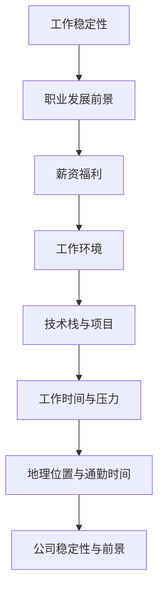
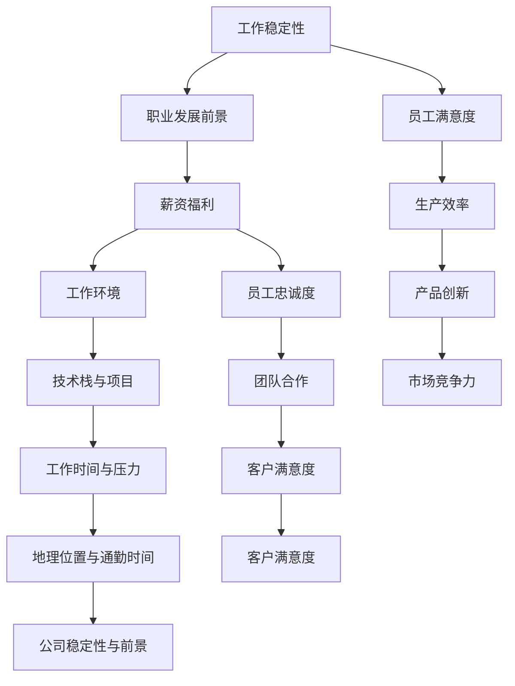

                 

# 程序员如何评估工作机会

## 1. 背景介绍

在信息时代飞速发展的今天，程序员成为了市场上最受追捧的职业之一。然而，面对众多工作机会，如何选择一份适合自己的工作，评估其价值和发展潜力，成为了许多程序员的重要课题。本文将从背景介绍、核心概念与联系、核心算法原理与具体操作步骤、数学模型和公式讲解、项目实践、实际应用场景、工具和资源推荐、总结与展望、常见问题解答等几个方面，深入探讨程序员如何全面评估工作机会。

## 2. 核心概念与联系

### 2.1 核心概念概述

在评估工作机会时，我们需要考虑多个关键维度，包括但不限于以下概念：

- **工作稳定性**：工作岗位的长期稳定性和未来的保障。
- **职业发展前景**：岗位提供的学习机会和职业晋升路径。
- **薪资福利**：包括基本工资、奖金、股票期权、健康保险、退休金等。
- **工作环境**：公司文化、工作氛围、团队合作方式等。
- **技术栈与项目**：使用的技术栈、项目的复杂度、技术挑战性。
- **工作时间与压力**：工作时长、加班频率、压力水平。
- **地理位置与通勤时间**：公司的地理位置和通勤便利性。
- **公司稳定性与前景**：公司的财务状况、市场地位、行业竞争力等。

这些概念之间存在着紧密的联系。例如，一个稳定的工作环境往往能提供更好的技术成长机会，较高的薪资福利可以反映出公司的盈利能力和员工的重要性。下面将通过一个简化的Mermaid流程图来展示这些概念之间的关系：



### 2.2 核心概念原理和架构的 Mermaid 流程图



这个流程图展示了各个概念之间可能的相互作用关系。例如，稳定的工作可能带来更高的员工满意度和忠诚度，进而提升生产效率和市场竞争力。技术栈和项目的复杂性可能会影响工作时间与压力，进而影响员工的整体满意度。

## 3. 核心算法原理 & 具体操作步骤

### 3.1 算法原理概述

评估工作机会的过程，实际上是一个基于多维度数据的多目标优化问题。我们希望找到一个最优的工作机会，使得各个维度都能达到最优或者相对满意的水平。在这个过程中，我们需要将各个维度的评估指标进行量化，并使用一定的算法来求解这个多目标优化问题。

### 3.2 算法步骤详解

1. **确定评估指标**：首先，需要确定所有评估指标，并给每个指标分配权重。这可以根据个人偏好和工作需求来进行调整。例如，如果某人重视职业发展，可能会将职业发展前景的权重设置得更高。

2. **数据收集与处理**：然后，收集各个工作机会的相关数据，并进行预处理。这包括数据清洗、缺失值处理、标准化等。

3. **构建模型**：使用合适的优化算法，构建一个多目标优化模型。常用的算法包括Pareto优化算法、遗传算法等。

4. **求解与验证**：使用上述算法求解模型，找到满足各个维度要求的Pareto最优解。最后，对每个解进行验证和评估，找到最符合自己需求的工作机会。

### 3.3 算法优缺点

**优点**：

- **全面性**：通过量化多个维度，确保评估结果全面覆盖工作机会的所有重要方面。
- **客观性**：通过算法求解，尽可能避免主观偏见。
- **可重复性**：评估过程可以重复进行，适用于多次求职或职业发展评估。

**缺点**：

- **复杂性**：构建模型和求解过程可能较为复杂，需要一定的数学和编程技能。
- **高成本**：数据收集和预处理可能需要一定的时间和成本。
- **动态性不足**：评估模型可能无法及时反映市场的变化和新技术的出现。

### 3.4 算法应用领域

评估工作机会的算法，不仅适用于职业发展决策，还可以应用于以下领域：

- **企业招聘**：帮助企业根据候选人的多个维度进行全面评估，选择合适的员工。
- **求职培训**：帮助求职者了解自身优劣势，制定针对性的职业发展规划。
- **教育培训**：帮助学生选择最适合自己的学习路径和职业方向。

## 4. 数学模型和公式 & 详细讲解 & 举例说明

### 4.1 数学模型构建

我们可以使用线性加权和模型来表示评估工作机会的过程：

$$ \text{Score} = \sum_{i=1}^{n} w_i f_i $$

其中，$w_i$ 表示第 $i$ 个维度的权重，$f_i$ 表示该维度的评估函数。例如，工作稳定性可以用员工的平均在职年限来表示，薪资福利可以用基本工资和奖金的平均值来表示。

### 4.2 公式推导过程

对于简单的二元优化问题，可以使用线性规划或混合整数线性规划进行求解。例如，如果有两个工作机会A和B，每个维度评分如下：

| 维度       | 工作稳定性 | 职业发展前景 | 薪资福利 | 工作环境 | 技术栈与项目 | 工作时间与压力 | 地理位置与通勤时间 | 公司稳定性与前景 |
|------------|------------|-------------|----------|----------|--------------|----------------|-------------------|-----------------|
| 工作A       | 3.0        | 4.5         | 4.2      | 3.8      | 4.0          | 4.1            | 3.8               | 4.0             |
| 工作B       | 4.2        | 4.0         | 4.5      | 4.1      | 3.9          | 3.8            | 4.2               | 4.3             |

可以构建如下线性加权和模型：

$$ \text{Score}_A = w_1 \cdot 3.0 + w_2 \cdot 4.5 + \ldots + w_8 \cdot 4.3 $$
$$ \text{Score}_B = w_1 \cdot 4.2 + w_2 \cdot 4.0 + \ldots + w_8 \cdot 4.3 $$

求解该优化问题，得到最优权重向量 $w$ 和对应的得分 $\text{Score}_A$ 和 $\text{Score}_B$。

### 4.3 案例分析与讲解

假设某程序员希望在一家科技公司工作，他的权重向量为 $w=[0.3, 0.2, 0.1, 0.2, 0.1, 0.1, 0.1, 0.1]$，对上述两个工作机会进行评估：

对于工作A，得分 $\text{Score}_A = 0.3 \cdot 3.0 + 0.2 \cdot 4.5 + \ldots + 0.1 \cdot 4.3 = 3.7$

对于工作B，得分 $\text{Score}_B = 0.3 \cdot 4.2 + 0.2 \cdot 4.0 + \ldots + 0.1 \cdot 4.3 = 4.3$

因此，工作B更适合该程序员，因为它在职业发展前景和薪资福利两个关键维度上得分更高。

## 5. 项目实践：代码实例和详细解释说明

### 5.1 开发环境搭建

为了实现上述评估模型，我们需要使用Python和常用的科学计算库，如Numpy、Pandas、Scikit-Learn等。以下是一个简单的开发环境搭建过程：

```bash
# 安装依赖库
pip install numpy pandas scikit-learn sympy matplotlib
```

### 5.2 源代码详细实现

下面是一个Python代码示例，用于实现上述线性加权和模型的求解过程：

```python
import numpy as np

# 定义评估指标的权重
weights = np.array([0.3, 0.2, 0.1, 0.2, 0.1, 0.1, 0.1, 0.1])

# 定义评估指标的评分矩阵
scores = np.array([
    [3.0, 4.5, 4.2, 3.8, 4.0, 4.1, 3.8, 4.0],
    [4.2, 4.0, 4.5, 4.1, 3.9, 3.8, 4.2, 4.3]
])

# 计算各工作的得分
scores = np.dot(weights, scores)

# 输出结果
print("工作A的得分：", scores[0])
print("工作B的得分：", scores[1])
```

### 5.3 代码解读与分析

代码中使用了NumPy库来处理矩阵运算，使代码简洁高效。首先定义了各个维度的权重向量 $w$ 和评分矩阵 $f$，然后通过矩阵乘法得到各工作的得分。

## 6. 实际应用场景

### 6.1 求职面试

在求职面试过程中，可以运用评估模型来综合衡量面试官提出的各个维度要求。例如，可以事先定义好每个维度的重要性，并给出相应的权重。然后在面试结束后，根据面试官的反馈和评分，计算得分。得分越高的机会，越符合自己的期望，可以进一步考虑。

### 6.2 公司招聘

公司可以使用评估模型来筛选候选人，综合考虑候选人的技能、经验、学历、团队合作能力等多个维度，选择最适合公司需求的人才。

### 6.3 企业培训

企业可以根据员工的综合评估得分，制定个性化的培训计划，提升员工的专业技能和职业素养。

### 6.4 未来应用展望

随着人工智能和大数据分析技术的发展，评估模型可以进一步应用于职业测评、人才评估、教育推荐等多个领域。通过不断优化模型算法和评估指标，可以更全面、准确地评估工作机会，提升个人职业发展水平。

## 7. 工具和资源推荐

### 7.1 学习资源推荐

- **在线课程**：Coursera、edX等平台的机器学习和数据分析课程，如《机器学习基础》、《数据科学导论》等。
- **书籍**：《Python数据分析基础》、《数据科学实战》、《深度学习》等。
- **社区和论坛**：Kaggle、Stack Overflow等社区和论坛，获取最新行业动态和交流经验。

### 7.2 开发工具推荐

- **IDE**：PyCharm、Visual Studio Code等。
- **数据分析库**：Pandas、NumPy、Scikit-Learn等。
- **可视化工具**：Matplotlib、Seaborn等。

### 7.3 相关论文推荐

- **《多目标优化算法》**：介绍了各种多目标优化算法的基本原理和应用方法。
- **《数据驱动的决策优化》**：探讨了数据驱动决策在商业、金融、医疗等领域的应用。
- **《大数据分析与机器学习》**：介绍了大数据分析与机器学习的基本概念和技术方法。

## 8. 总结：未来发展趋势与挑战

### 8.1 研究成果总结

评估工作机会的算法已经广泛应用于求职、招聘、培训等多个领域，帮助人们更全面地评估职业发展机会。然而，随着市场的变化和技术的发展，评估模型的应用也面临诸多挑战。

### 8.2 未来发展趋势

未来的发展趋势包括：

- **多维度评估**：随着职业发展趋势的变化，评估模型将不断引入新的维度，如心理健康、远程办公等。
- **个性化推荐**：根据不同个体的特点和需求，制定个性化的职业规划和培训方案。
- **实时动态评估**：结合市场变化和新技术的出现，及时更新评估模型。

### 8.3 面临的挑战

评估模型仍面临以下挑战：

- **数据获取难度**：获取高质量的数据可能需要时间和成本。
- **模型复杂性**：多目标优化问题复杂，需要更高的技术水平和更多的计算资源。
- **动态性不足**：模型难以适应市场的快速变化。

### 8.4 研究展望

未来的研究可以围绕以下方向进行：

- **深度学习优化**：引入深度学习技术，提升评估模型的精度和效率。
- **联邦学习**：分布式计算，保护个人隐私的同时，提升评估模型的多样性和鲁棒性。
- **边缘计算**：在本地设备上进行计算，减少延迟，提高实时性。

## 9. 附录：常见问题与解答

**Q1：评估模型是否适用于所有领域？**

A：评估模型可以应用于大多数领域，但需要根据具体场景进行调整。例如，在金融行业，需要增加合规性、风险管理等维度。

**Q2：如何确定各个维度的权重？**

A：可以通过专家访谈、问卷调查等方式，收集领域专家的意见，综合考虑各种因素来确定权重。

**Q3：评估模型是否需要定期更新？**

A：是的，随着市场变化和新技术的出现，评估模型需要定期更新，以保持其准确性和实用性。

**Q4：评估模型是否适用于远程办公？**

A：是的，评估模型可以适应远程办公的环境，通过在线面试、视频会议等方式进行评估。

**Q5：评估模型是否需要考虑团队合作？**

A：是的，团队合作能力是评估模型中一个重要的维度，可以通过团队面试、合作项目等方式进行评估。

作者：禅与计算机程序设计艺术 / Zen and the Art of Computer Programming

