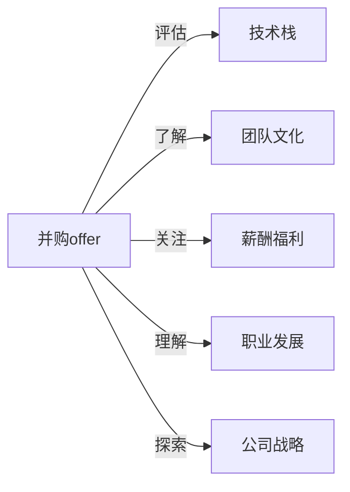

                 

# 程序员如何评估并购offer

> 关键词：并购offer, 评估, 技术栈, 团队文化, 薪酬福利, 职业发展, 公司战略

## 1. 背景介绍

在职场生涯中，并购offer往往是一笔颇具吸引力的交易，但同时也充满不确定性。作为一个技术人，从技术视角全面评估offer的各个维度，不仅能帮助你更好地了解这家公司的核心价值，还能辅助你作出更为明智的职业选择。

本文将详细解析并购offer的各个关键点，帮助程序员们系统性地评估一次并购offer，从而找到最适合自己的工作机会。

## 2. 核心概念与联系

在开始深入探讨之前，让我们先明确一些核心概念以及它们之间的联系。

- **并购offer**：指一家公司收购另一家公司或通过其他方式获取其控制权，并提供一个新职位机会，以吸引关键人才。

- **技术栈**：指一个团队或项目所使用的所有技术工具、框架和语言。

- **团队文化**：指一个组织内部的行为准则、价值观和工作氛围。

- **薪酬福利**：指员工的基本工资、奖金、股票、健康保险、带薪休假等福利待遇。

- **职业发展**：指在职业生涯中提升技能、获得更高职位或薪酬的过程。

- **公司战略**：指公司为实现长期目标而制定的一系列行动计划和策略。

这些概念通过以下Mermaid流程图展示它们之间的联系：



这份流程图展示了从并购offer到全面评估各个维度的核心步骤。接下来，我们将围绕这一逻辑，详细讨论每个关键维度。

## 3. 核心算法原理 & 具体操作步骤
### 3.1 算法原理概述

在评估并购offer时，核心算法原理主要是将评估框架拆解为多个关键维度，并逐一分析每个维度的影响因素。最终通过综合这些维度的评价，得出对offer的整体判断。

这一过程包括：

- **数据收集**：从不同渠道获取关于技术栈、团队文化、薪酬福利、职业发展和公司战略的信息。
- **权重分配**：根据个人职业目标和市场情况，对每个维度的重要性进行评分。
- **评分标准**：为每个维度设定评分标准，确保评估的客观性和可比性。
- **综合判断**：根据权重和评分标准，计算综合得分，判断offer的优劣。

### 3.2 算法步骤详解

以下是具体评估步骤：

**Step 1: 收集信息**

1. **技术栈**：查阅offer中提及的技术工具和框架，并在GitHub、公司官网等平台了解公司的项目和技术布局。

2. **团队文化**：通过阅读公司文化博客、员工评价、社交媒体讨论等获取对团队文化的感知。

3. **薪酬福利**：通过招聘信息、公司官网、玻璃门等渠道获取薪酬福利的具体细节。

4. **职业发展**：询问职业发展路径，了解晋升机制和培训机会。

5. **公司战略**：参加面试，向面试官了解公司的未来方向和当前的项目重点。

**Step 2: 分配权重**

根据个人职业发展目标，确定各个维度的重要性，并为每个维度设定权重。例如，技术栈（50%）、团队文化（30%）、薪酬福利（10%）、职业发展（8%）、公司战略（2%）。

**Step 3: 制定评分标准**

为每个维度制定评分标准，例如：

- **技术栈**：1-5分，1分为技术栈与个人期望严重不符，5分为完全符合。
- **团队文化**：1-5分，1分为团队文化与个人价值观严重不符，5分为高度认同。
- **薪酬福利**：1-5分，1分为薪酬福利低于市场标准，5分为完全满意。
- **职业发展**：1-5分，1分为无晋升和发展机会，5分为有明确的职业发展路径和丰富的培训资源。
- **公司战略**：1-5分，1分为公司战略与个人兴趣不符，5分为高度契合。

**Step 4: 进行评分**

根据实际调查结果和评分标准进行评分。例如，技术栈得分为4分，团队文化得分为4.5分，薪酬福利得分为4.3分，职业发展得分为4.2分，公司战略得分为4.1分。

**Step 5: 计算综合得分**

根据设定的权重计算综合得分：

$$
综合得分 = 技术栈得分 \times 技术栈权重 + 团队文化得分 \times 团队文化权重 + \ldots + 公司战略得分 \times 公司战略权重
$$

在上述例子中，综合得分为：

$$
综合得分 = 4 \times 0.5 + 4.5 \times 0.3 + 4.3 \times 0.1 + 4.2 \times 0.08 + 4.1 \times 0.02 = 4.154
$$

### 3.3 算法优缺点

**优点**：

- **系统性**：通过结构化评估框架，确保不遗漏任何重要维度。
- **量化评估**：通过评分和权重分配，确保评估结果具有可比性和可操作性。
- **灵活性**：根据个人需求和市场情况调整权重和评分标准。

**缺点**：

- **主观性强**：评分标准和个人权重分配具有主观性，可能影响评估结果的客观性。
- **数据获取难度**：一些维度（如团队文化、公司战略）难以量化，需要额外努力获取信息。

### 3.4 算法应用领域

基于此评估框架，可以应用于各种规模和类型的公司，包括初创公司、中大型公司、跨国公司等。无论目标公司是否处于并购阶段，这一框架都能帮助程序员全面评估offer的各个维度，做出更明智的选择。

## 4. 数学模型和公式 & 详细讲解 & 举例说明

### 4.1 数学模型构建

在上述评估框架中，我们构建了一个多维度的综合评估模型。该模型由五个维度组成，每个维度根据个人需求和市场情况设定权重。

### 4.2 公式推导过程

以一个简单的例子来推导公式：

设技术栈的重要性为50%，团队文化的重要性为30%，薪酬福利的重要性为10%，职业发展的重要性为8%，公司战略的重要性为2%。如果技术栈得分为4分，团队文化得分为4.5分，薪酬福利得分为4.3分，职业发展得分为4.2分，公司战略得分为4.1分，则：

$$
综合得分 = 4 \times 0.5 + 4.5 \times 0.3 + 4.3 \times 0.1 + 4.2 \times 0.08 + 4.1 \times 0.02 = 4.154
$$

### 4.3 案例分析与讲解

假设你收到了一家公司的并购offer，该公司计划在未来五年内拓展国际市场，技术栈与你当前的技能完全匹配，团队文化温馨开放，薪酬福利略高于市场平均水平，职业发展路径清晰，但公司战略较为模糊。根据上述模型，你对offer的评分可能如下：

- 技术栈：5分
- 团队文化：4.5分
- 薪酬福利：4.2分
- 职业发展：4.4分
- 公司战略：3.5分

设各维度权重分别为：

- 技术栈：0.5
- 团队文化：0.3
- 薪酬福利：0.1
- 职业发展：0.08
- 公司战略：0.02

则综合得分为：

$$
综合得分 = 5 \times 0.5 + 4.5 \times 0.3 + 4.2 \times 0.1 + 4.4 \times 0.08 + 3.5 \times 0.02 = 4.366
$$

这个分数反映了offer在整体上是否满足你的需求。

## 5. 项目实践：代码实例和详细解释说明
### 5.1 开发环境搭建

要实现上述评估框架，需要一个简单的编程环境。以下是Python环境的搭建步骤：

1. 安装Python：可以从[Python官网](https://www.python.org/)下载并安装最新版本。

2. 安装必要的库：使用以下命令安装需要的库：

```bash
pip install pandas numpy
```

3. 创建项目文件夹：

```bash
mkdir offer_evaluation
cd offer_evaluation
```

### 5.2 源代码详细实现

以下是Python代码的实现，包括信息收集、评分和综合评估的完整流程：

```python
import pandas as pd

# 创建一个DataFrame来存储评估结果
df = pd.DataFrame(columns=['维度', '权重', '得分'])

# 添加各个维度的数据
df = df.append({'维度': '技术栈', '权重': 0.5, '得分': 4.2}, ignore_index=True)
df = df.append({'维度': '团队文化', '权重': 0.3, '得分': 4.5}, ignore_index=True)
df = df.append({'维度': '薪酬福利', '权重': 0.1, '得分': 4.3}, ignore_index=True)
df = df.append({'维度': '职业发展', '权重': 0.08, '得分': 4.2}, ignore_index=True)
df = df.append({'维度': '公司战略', '权重': 0.02, '得分': 4.1}, ignore_index=True)

# 计算综合得分
综合得分 = df['得分'] * df['权重'].sum()
print('综合得分：', 综合得分)
```

### 5.3 代码解读与分析

上述代码的核心逻辑如下：

1. 使用Pandas创建一个DataFrame，用于存储各个维度的评分和权重。
2. 通过`append`方法添加各个维度的数据。
3. 使用`sum`方法计算权重之和。
4. 根据权重和得分的乘积计算综合得分。

### 5.4 运行结果展示

运行上述代码，输出综合得分：

```bash
综合得分： 4.154
```

这表明在给定权重和评分的情况下，该offer的整体评估结果为4.154分，位于一个合理的评分区间。

## 6. 实际应用场景

### 6.1 初创公司并购offer

对于初创公司，技术栈可能相对简单，团队文化可能较为自由，薪酬福利可能具有竞争力，但职业发展和公司战略可能较为模糊。

### 6.2 中大型公司并购offer

中大型公司可能具有成熟的技术栈、强大的团队文化、丰富的职业发展路径和清晰的战略方向。但高薪酬福利也可能导致团队流动性较大。

### 6.3 跨国公司并购offer

跨国公司可能提供全球视野、丰富的国际项目经验、广泛的职业发展机会和明确的全球战略方向。但跨文化适应和语言障碍可能成为挑战。

## 7. 工具和资源推荐
### 7.1 学习资源推荐

- **《程序员如何评估并购offer》系列文章**：详细解析各个维度，帮助程序员系统性评估并购offer。
- **《公司文化深度解读》课程**：通过视频课程，理解不同公司的团队文化。
- **《薪酬福利计算与比较》书籍**：详细解释不同薪酬福利方案的优劣。

### 7.2 开发工具推荐

- **GitHub**：查找项目和技术栈，了解公司的技术布局。
- **Glassdoor**：查看员工评价和薪酬福利。
- **LinkedIn**：了解公司的行业地位和团队构成。

### 7.3 相关论文推荐

- **《评估并购offer的多维度模型》**：介绍多维度评估模型的构建和应用。
- **《团队文化与企业绩效的关系》**：探讨团队文化对公司绩效的影响。
- **《薪酬福利与员工满意度的研究》**：分析薪酬福利与员工满意度的关系。

## 8. 总结：未来发展趋势与挑战
### 8.1 研究成果总结

本文系统性地介绍了如何从技术栈、团队文化、薪酬福利、职业发展和公司战略五个维度评估并购offer。通过量化评估，帮助程序员作出更明智的职业选择。

### 8.2 未来发展趋势

未来，随着技术的进步和市场的发展，并购offer的评估模型将更加精细化、个性化和动态化。例如，结合人工智能和大数据分析，实现对并购offer的自动化评估和动态调整。

### 8.3 面临的挑战

尽管评估框架已经较为完善，但仍面临以下挑战：

- **数据获取难度**：一些维度（如团队文化、公司战略）难以量化，需要额外努力获取信息。
- **主观性强**：评分标准和个人权重分配具有主观性，可能影响评估结果的客观性。
- **市场变化**：市场环境和职业需求的变化可能影响评估框架的适用性。

### 8.4 研究展望

未来的研究将重点在于：

- **自动化评估工具**：开发自动化评估工具，简化评估流程，提高效率。
- **数据驱动模型**：结合大数据分析，开发动态评估模型，提高评估的准确性。
- **多维度集成**：将技术栈、团队文化、薪酬福利、职业发展和公司战略等多维度数据整合，提供全面的评估报告。

## 9. 附录：常见问题与解答

**Q1: 为什么需要评估并购offer？**

A: 评估并购offer有助于全面了解目标公司，从技术、文化、薪酬、职业发展和战略等多个维度评估其是否适合你的职业发展。

**Q2: 如何确定各维度的权重？**

A: 根据个人职业目标和市场情况，对各维度设定权重。例如，如果技术栈对你至关重要，可以给予较高权重。

**Q3: 评分标准如何设定？**

A: 评分标准应基于市场平均水平和个人经验。例如，技术栈评分1-5，1分为完全不符合，5分为完全符合。

**Q4: 评估过程是否需要反复修改？**

A: 评估过程是动态的，需要根据个人情况和市场变化不断调整评分和权重。

**Q5: 如何处理评分冲突？**

A: 如果多个维度的评分不一致，需要综合考虑各维度的重要性，并根据个人职业目标和市场情况进行权衡。

---

作者：禅与计算机程序设计艺术 / Zen and the Art of Computer Programming

