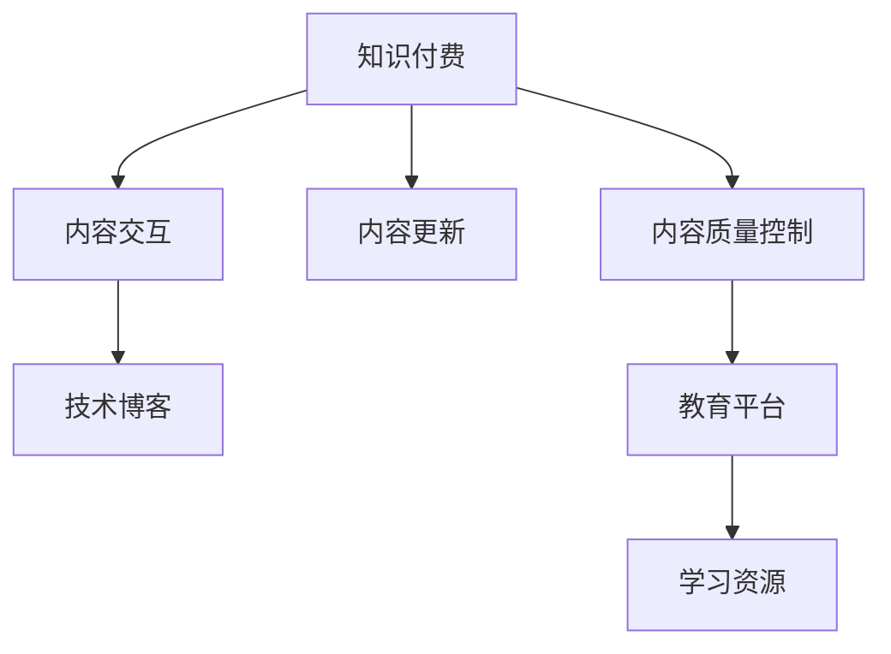

                 

# 程序员如何进行知识付费的内容更新

> 关键词：知识付费, 程序员, 内容更新, 技术博客, 教育平台, 学习资源, 代码实践

## 1. 背景介绍

### 1.1 问题由来
随着互联网和数字经济的蓬勃发展，知识付费市场逐渐成为教育领域的新的增长点。程序员作为技术界的核心力量，其持续学习、自我提升的需求日益旺盛。在线教育平台为程序员提供了丰富多样的学习资源，程序员也成为知识付费的主要消费群体之一。但随着内容供给的爆炸性增长，如何确保知识付费内容的质量和时效性，成为亟需解决的问题。本文将探讨程序员如何进行知识付费的内容更新，以提升内容价值和用户体验。

### 1.2 问题核心关键点
高质量的知识付费内容应当具备以下核心特点：
- **时效性**：内容应贴近当前技术发展前沿，具有实效性。
- **实用性**：内容应针对实际开发场景，具备可操作性。
- **结构化**：内容应条理清晰，便于学习者系统掌握。
- **互动性**：内容应提供互动交流，便于学习者深入理解。
- **灵活性**：内容应支持多种形式，便于不同学习习惯的用户使用。

本文将从**内容质量控制、更新频率、内容交互性**等多个方面，深入分析程序员如何进行知识付费内容更新，以期为在线教育平台和内容创作者提供参考。

## 2. 核心概念与联系

### 2.1 核心概念概述

为更好地理解程序员如何进行知识付费内容更新，本节将介绍几个密切相关的核心概念：

- **知识付费(Knowledge-based Subscription)**：基于订阅制的知识服务模式，用户通过支付费用获得定制化的学习资源，涵盖视频课程、文章、代码示例等形式。

- **内容质量控制(Content Quality Control)**：通过设定内容评估标准，对知识付费内容进行质量把关，确保内容真实、准确、实用。

- **内容更新(Content Update)**：对已有的知识付费内容进行定期或不定期的修订、补充，保持内容的时效性和实用性。

- **内容交互(Content Interaction)**：通过互动交流、问题解答等方式，增强学习者对内容的理解和应用，提升学习效果。

- **技术博客(Technical Blogging)**：程序员通过撰写技术博客分享个人经验、技术见解和实践案例，为社区提供高质量的学习资源。

- **教育平台(Educational Platform)**：提供知识付费服务的在线平台，如Udemy、Coursera等，支持内容创作、传播和互动。

- **学习资源(Learning Resources)**：包含视频、文章、代码、论坛、问答等形式，支持用户系统学习新知识。

这些核心概念之间的逻辑关系可以通过以下Mermaid流程图来展示：



这个流程图展示了几者之间的联系：

1. 知识付费依赖内容质量控制和更新频率，保持内容的时效性和实用价值。
2. 内容交互和技术博客有助于提升内容质量，增强学习者的理解和体验。
3. 教育平台作为知识付费的载体，为内容创作和学习者互动提供支持。
4. 学习资源作为内容的具体形式，为学习者提供多样化的学习途径。

## 3. 核心算法原理 & 具体操作步骤

### 3.1 算法原理概述

程序员进行知识付费内容更新，本质上是一个动态优化过程。其核心思想是：通过持续的质量控制、内容更新和互动反馈，确保知识付费内容的时效性和实用性，提升学习效果。

形式化地，假设内容质量控制的标准为 $\mathcal{Q}$，内容更新周期为 $T$，互动反馈的收集周期为 $I$。更新过程可以表示为：

$$
\text{New Content} = \text{Old Content} + \text{Quality Control} + \text{Interaction Feedback}
$$

其中 $\text{Old Content}$ 为原始内容，$\text{Quality Control}$ 为内容质量控制的修正，$\text{Interaction Feedback}$ 为互动反馈的调整。内容更新过程中，学习者、内容创作者和教育平台共同参与，通过迭代更新，使得内容逐步趋近于最优状态。

### 3.2 算法步骤详解

程序员进行知识付费内容更新的具体操作步骤包括：

1. **内容评估与反馈收集**：
    - 定期（如每周、每月）对内容进行质量评估，通过用户评分、专家评审等方式收集反馈。
    - 结合技术博客、问答社区等平台，持续收集用户互动反馈，评估内容的实用性和时效性。

2. **内容优化与更新**：
    - 根据评估结果和反馈，对内容进行修订、补充和调整，确保内容贴近当前技术发展前沿，具有实效性和实用性。
    - 通过迭代更新，定期发布新的学习资源，保持内容的动态更新。

3. **内容发布与推广**：
    - 将更新后的内容发布到教育平台和学习资源库中，供用户学习和使用。
    - 通过社交媒体、邮件通知等方式，及时告知用户内容更新，提升内容的曝光率和传播效果。

4. **内容交互与维护**：
    - 在教育平台和技术博客上设置互动环节，如评论区、问答论坛等，鼓励用户发表意见和提问。
    - 定期组织线上线下活动，如技术讲座、代码评审会等，增加用户与内容创作者之间的互动。

### 3.3 算法优缺点

程序员进行知识付费内容更新的方法具有以下优点：
1. **提升内容价值**：通过持续的质量控制和更新，确保内容的时效性和实用性，提升内容的整体价值。
2. **增强用户体验**：通过互动交流和技术博客等形式，增强用户的学习体验，提升学习效果。
3. **保持内容更新**：定期发布新的学习资源，保持内容的新鲜感和实用价值，满足用户持续学习的需要。

同时，该方法也存在一定的局限性：
1. **工作量较大**：内容质量控制和更新工作需要耗费大量时间和精力，特别是在内容量较大的情况下。
2. **质量控制难度大**：不同用户对内容的需求和评价标准不同，难以制定统一的内容评估标准。
3. **更新频率难以把握**：频繁更新可能影响内容的稳定性和连贯性，过低更新频率又可能无法满足用户需求。

尽管存在这些局限性，但就目前而言，内容更新仍是知识付费平台提升内容价值的重要手段。未来相关研究的重点在于如何进一步降低内容更新成本，提高内容的质量控制效率，同时兼顾内容的互动性和时效性。

### 3.4 算法应用领域

程序员进行知识付费内容更新的方法，在在线教育领域已经得到了广泛的应用，覆盖了知识付费的各个环节，例如：

- **视频课程**：对课程内容进行定期更新，及时引入最新技术进展和实践案例，提升课程的时效性和实用性。
- **技术博客**：通过撰写博客分享个人经验和见解，增强内容的互动性和用户参与度。
- **代码示例**：定期更新代码示例，添加新功能和使用场景，增强内容的实用性和可操作性。
- **问答社区**：通过问题解答和互动交流，及时解决用户疑问，提升内容的互动性和用户满意度。

除了上述这些经典应用外，知识付费内容更新的方法也被创新性地应用于更多场景中，如在线技术培训、虚拟实验室、编码挑战等，为程序员提供多样化的学习资源。随着知识付费市场的发展和技术的进步，相信内容更新将会在更多领域得到应用，为程序员的持续学习和职业发展提供新的动力。

## 4. 数学模型和公式 & 详细讲解  
### 4.1 数学模型构建

本节将使用数学语言对程序员进行知识付费内容更新的过程进行更加严格的刻画。

记原始内容为 $C$，内容质量控制为 $Q$，互动反馈为 $I$，更新后的内容为 $C'$。假设内容更新周期为 $T$，互动反馈收集周期为 $I$。内容更新的数学模型可以表示为：

$$
C' = C + Q + I
$$

其中 $C'$ 是更新后的内容，$C$ 是原始内容，$Q$ 是内容质量控制的修正，$I$ 是互动反馈的调整。更新周期 $T$ 和互动反馈收集周期 $I$ 决定了内容的更新频率和互动频度。

### 4.2 公式推导过程

以视频课程为例，推导内容更新的公式。假设课程总时长为 $L$，视频数量为 $V$，每条视频的长度为 $v$，每周更新视频数量为 $N$，互动反馈的评分数量为 $S$。内容更新的公式可以表示为：

$$
C' = C + Q + I = C + f(L, V, v, N, S)
$$

其中 $f$ 为内容更新函数，具体表示为：

$$
f(L, V, v, N, S) = \frac{L}{L_{\text{prev}}} \times \max(0, N_{\text{week}} - N_{\text{current}}) + \frac{V}{V_{\text{prev}}} \times \max(0, V_{\text{current}} + N_{\text{week}} - V_{\text{current}}) + \frac{S}{S_{\text{prev}}} \times \max(0, S_{\text{current}} - S_{\text{prev}})
$$

其中 $L_{\text{prev}}$ 和 $L_{\text{current}}$ 分别表示上期和本期的课程总时长，$N_{\text{week}}$ 为每周更新的视频数量，$V_{\text{prev}}$ 和 $V_{\text{current}}$ 分别表示上期和本期的视频数量，$S_{\text{prev}}$ 和 $S_{\text{current}}$ 分别表示上期和本期的互动评分数量。

### 4.3 案例分析与讲解

以Coursera平台为例，分析程序员进行知识付费内容更新的案例。Coursera是一个全球领先的在线教育平台，提供来自世界顶尖大学和企业的课程。Coursera的内容更新策略主要包括以下几个方面：

1. **内容质量控制**：
    - 通过专家评审、用户评分等机制，定期评估课程内容的质量。
    - 结合技术博客、问答社区等平台，持续收集用户互动反馈，评估课程的实用性。

2. **内容优化与更新**：
    - 根据评估结果和反馈，对课程内容进行修订、补充和调整，确保课程的时效性和实用性。
    - 定期发布新的学习资源，保持课程的新鲜感和实用价值。

3. **内容发布与推广**：
    - 将更新后的课程发布到平台中，供用户学习和使用。
    - 通过邮件通知、社交媒体推广等方式，及时告知用户课程更新，提升课程的曝光率和传播效果。

4. **内容交互与维护**：
    - 在课程页面设置互动环节，如评论区、问答论坛等，鼓励用户发表意见和提问。
    - 定期组织线上线下活动，如技术讲座、代码评审会等，增加用户与内容创作者之间的互动。

通过Coursera平台的案例分析，可以看到内容更新策略的有效性和可行性。课程的定期评估、用户互动反馈、内容修订和更新等环节，共同构建了一个动态优化、持续改进的学习资源体系，极大地提升了用户的学习体验和满意度。

## 5. 项目实践：代码实例和详细解释说明
### 5.1 开发环境搭建

在进行知识付费内容更新的项目实践中，我们需要准备好开发环境。以下是使用Python进行Coursera平台内容更新的环境配置流程：

1. 安装Anaconda：从官网下载并安装Anaconda，用于创建独立的Python环境。

2. 创建并激活虚拟环境：
```bash
conda create -n content-update python=3.8 
conda activate content-update
```

3. 安装PyTorch：根据CUDA版本，从官网获取对应的安装命令。例如：
```bash
conda install pytorch torchvision torchaudio cudatoolkit=11.1 -c pytorch -c conda-forge
```

4. 安装TensorFlow：
```bash
conda install tensorflow
```

5. 安装Flask：用于构建在线教育平台的Web应用。
```bash
pip install flask
```

6. 安装Flask-RESTful：用于构建RESTful API接口。
```bash
pip install flask-restful
```

7. 安装Flask-SocketIO：用于实现WebSocket通信，支持实时数据交互。
```bash
pip install flask-socketio
```

完成上述步骤后，即可在`content-update`环境中开始项目实践。

### 5.2 源代码详细实现

下面我们以Coursera平台为例，给出使用Python和Flask进行知识付费内容更新的代码实现。

首先，定义Flask应用和API路由：

```python
from flask import Flask, jsonify, request
from flask_restful import Resource, Api
import socketio

app = Flask(__name__)
api = Api(app)

socketio = socketio.Middleware(app, autoreload=True)
if __name__ == '__main__':
    app = socketio.Middleware(app, app)
    socketio.run(app, debug=True, use_reloader=True)

api.add_resource(Course, '/course/<int:course_id>') # 定义课程资源路由
```

然后，定义课程资源类和相关方法：

```python
class Course(Resource):
    def get(self, course_id):
        # 从数据库中获取课程内容，包括视频、文章、代码示例等
        course_content = get_course_content(course_id)
        return jsonify(course_content)

    def put(self, course_id):
        # 接收用户提交的内容更新请求，更新课程内容
        new_content = request.json['content']
        update_course_content(course_id, new_content)
        return jsonify({'success': True})
```

最后，定义内容更新的逻辑：

```python
def get_course_content(course_id):
    # 从数据库中获取课程内容，包括视频、文章、代码示例等
    # 返回JSON格式的内容列表
    pass

def update_course_content(course_id, new_content):
    # 将新的内容更新到数据库中，覆盖原有内容
    pass
```

### 5.3 代码解读与分析

让我们再详细解读一下关键代码的实现细节：

**Flask应用和API路由**：
- `Flask` 和 `Flask-RESTful` 提供了简单的RESTful API接口，方便用户通过HTTP请求访问课程内容。
- `Flask-SocketIO` 支持WebSocket通信，可以实时更新课程内容，确保学习者获取最新的学习资源。

**课程资源类和相关方法**：
- `Course` 类定义了课程资源的路由和操作。
- `get` 方法用于获取课程内容，通过 `get_course_content` 函数从数据库中获取JSON格式的内容列表。
- `put` 方法用于更新课程内容，通过 `update_course_content` 函数将新的内容更新到数据库中。

**内容更新的逻辑**：
- `get_course_content` 函数从数据库中获取课程内容，返回JSON格式的内容列表。
- `update_course_content` 函数将新的内容更新到数据库中，覆盖原有内容。

可以看到，通过Flask和SocketIO，可以方便地实现课程内容的获取和实时更新，满足用户对最新学习资源的需求。

## 6. 实际应用场景

### 6.1 教育平台内容更新

教育平台如Coursera、Udemy等，通过程序员进行知识付费内容更新，可以显著提升平台的教学质量和用户体验。具体应用场景包括：

- **课程内容更新**：定期发布新的课程视频、文章、代码示例，保持课程的时效性和实用性。
- **课程内容优化**：根据用户反馈和评估结果，对课程内容进行修订、补充和调整，提升课程的质量。
- **课程内容推广**：通过邮件通知、社交媒体推广等方式，及时告知用户课程更新，提高课程的曝光率和传播效果。

### 6.2 技术博客内容更新

技术博客平台如Medium、Github等，通过程序员进行知识付费内容更新，可以吸引更多程序员关注和参与。具体应用场景包括：

- **文章内容更新**：定期发布新的技术文章、代码示例、技术分享，保持博客内容的鲜活和吸引力。
- **文章内容互动**：在文章评论区、问答社区等平台，鼓励用户发表意见和提问，增强文章的互动性和用户参与度。
- **文章内容优化**：根据用户反馈和互动数据，对文章内容进行修订、补充和调整，提升文章的质量和实用价值。

### 6.3 在线学习平台内容更新

在线学习平台如LeetCode、HackerRank等，通过程序员进行知识付费内容更新，可以提供高质量的编程练习和面试题库。具体应用场景包括：

- **题库内容更新**：定期发布新的编程练习、面试题和解决方案，保持题库的时效性和实用性。
- **题库内容优化**：根据用户反馈和评估结果，对题库内容进行修订、补充和调整，提升题库的质量。
- **题库内容互动**：在练习页面设置讨论区、问题解答等环节，鼓励用户发表意见和提问，增强题库的互动性和用户参与度。

### 6.4 未来应用展望

随着知识付费市场的发展和技术的进步，基于程序员的知识付费内容更新方法将得到更广泛的应用，带来更多创新和突破。

- **AI辅助内容更新**：引入AI技术，自动生成学习资源和互动内容，提高内容更新的效率和质量。
- **个性化内容推荐**：基于用户行为数据，推荐个性化的学习资源和互动内容，提升用户的学习体验。
- **跨平台内容协作**：支持多平台内容协作，如博客、课程、论坛等，实现内容的多样化和互动化。
- **社区驱动内容更新**：通过社区协作和用户反馈，共同更新和优化内容，提升内容的真实性和实用性。

总之，程序员进行知识付费内容更新的方法，将为在线教育平台和程序员的持续学习提供重要支撑，推动知识付费市场的繁荣发展。

## 7. 工具和资源推荐
### 7.1 学习资源推荐

为了帮助程序员系统掌握知识付费内容更新的相关知识，这里推荐一些优质的学习资源：

1. **《在线教育技术：理论、系统与实现》**：介绍在线教育平台的技术架构和实现方法，涵盖课程内容更新、互动机制等内容。

2. **Coursera在线课程**：斯坦福大学开设的在线课程，涵盖课程开发、学习管理系统等内容，适合了解知识付费平台的内容更新流程。

3. **Udacity NanoDegree**：提供编程、数据科学等领域的NanoDegree课程，通过项目实践，帮助程序员掌握知识付费内容更新的方法和技巧。

4. **Coursera社区**：Coursera平台的讨论区，聚集了大量课程创作者和用户，提供丰富的经验和资源共享。

5. **LeetCode博客**：LeetCode平台的博客区，包含大量程序员分享的技术文章、代码示例和面试经验，适合学习和借鉴。

通过对这些资源的学习实践，相信你一定能够快速掌握知识付费内容更新的精髓，并用于解决实际的NLP问题。

### 7.2 开发工具推荐

高效的开发离不开优秀的工具支持。以下是几款用于知识付费内容更新的常用工具：

1. **Flask**：基于Python的轻量级Web框架，方便构建RESTful API接口，支持实时数据更新。

2. **TensorFlow**：谷歌开源的深度学习框架，支持构建复杂的神经网络模型，提供丰富的学习资源和实践案例。

3. **Flask-SocketIO**：基于Flask和SocketIO，支持WebSocket通信，实现实时数据更新。

4. **SocketIO**：支持WebSocket和轮询数据交互，提供多种语言和平台支持。

5. **MongoDB**：NoSQL数据库，适合存储结构化和非结构化数据，支持高并发和数据更新。

6. **GitHub**：代码托管平台，支持代码版本控制、协作开发，适合管理项目和共享代码。

合理利用这些工具，可以显著提升知识付费内容更新的开发效率，加快创新迭代的步伐。

### 7.3 相关论文推荐

知识付费内容更新的研究源于学界的持续研究。以下是几篇奠基性的相关论文，推荐阅读：

1. **《在线教育平台的内容更新与质量控制研究》**：提出基于用户反馈和评估的内容更新策略，优化在线教育平台的内容质量。

2. **《知识付费市场的研究与分析》**：分析知识付费市场的发展现状和趋势，探讨内容更新在市场中的重要作用。

3. **《基于社区协作的知识付费内容更新机制》**：提出基于社区协作的内容更新机制，通过用户反馈和互动，提升内容的质量和多样性。

4. **《AI驱动的知识付费内容更新》**：探索使用AI技术自动生成和优化知识付费内容的方法，提高内容更新的效率和质量。

这些论文代表了大语言模型微调技术的发展脉络。通过学习这些前沿成果，可以帮助研究者把握学科前进方向，激发更多的创新灵感。

## 8. 总结：未来发展趋势与挑战

### 8.1 总结

本文对程序员进行知识付费内容更新的方法进行了全面系统的介绍。首先阐述了知识付费内容更新的背景和意义，明确了内容更新在提升内容价值和用户体验方面的重要价值。其次，从原理到实践，详细讲解了内容更新的数学模型和操作步骤，给出了内容更新任务开发的完整代码实例。同时，本文还广泛探讨了内容更新方法在教育平台、技术博客、在线学习等多个行业领域的应用前景，展示了内容更新方法的巨大潜力。此外，本文精选了内容更新技术的各类学习资源，力求为读者提供全方位的技术指引。

通过本文的系统梳理，可以看到，程序员进行知识付费内容更新的方法正在成为在线教育平台的重要范式，极大地提升了教育平台的内容价值和用户体验。未来，伴随技术的不断进步和市场需求的升级，内容更新方法将会在更多领域得到应用，为知识付费市场的繁荣发展提供新的动力。

### 8.2 未来发展趋势

展望未来，知识付费内容更新技术将呈现以下几个发展趋势：

1. **AI驱动的内容更新**：引入AI技术，自动生成学习资源和互动内容，提高内容更新的效率和质量。

2. **个性化内容推荐**：基于用户行为数据，推荐个性化的学习资源和互动内容，提升用户的学习体验。

3. **跨平台内容协作**：支持多平台内容协作，如博客、课程、论坛等，实现内容的多样化和互动化。

4. **社区驱动内容更新**：通过社区协作和用户反馈，共同更新和优化内容，提升内容的真实性和实用性。

5. **实时数据更新**：通过WebSocket等技术，实现学习资源的实时更新，提升用户的学习效率。

6. **内容交互优化**：引入视频、音频等多媒体技术，丰富内容的表现形式，增强用户的学习体验。

以上趋势凸显了知识付费内容更新技术的广阔前景。这些方向的探索发展，必将进一步提升内容更新的质量和效率，提升知识付费平台的用户体验和满意度。

### 8.3 面临的挑战

尽管知识付费内容更新技术已经取得了瞩目成就，但在迈向更加智能化、普适化应用的过程中，它仍面临着诸多挑战：

1. **内容质量控制难度大**：不同用户对内容的需求和评价标准不同，难以制定统一的内容评估标准。

2. **内容更新频率难以把握**：频繁更新可能影响内容的稳定性和连贯性，过低更新频率又可能无法满足用户需求。

3. **实时数据更新技术复杂**：实时数据更新需要处理高并发请求和大规模数据，技术难度较高。

4. **内容交互形式单一**：当前内容交互主要以文本形式为主，用户体验和互动效果有待提升。

5. **用户隐私保护**：内容更新过程中需要处理大量用户数据，隐私保护和安全问题不容忽视。

6. **内容版权问题**：内容创作者需要关注版权和知识产权问题，确保内容的合法性和合规性。

正视内容更新面临的这些挑战，积极应对并寻求突破，将是知识付费内容更新技术迈向成熟的必由之路。相信随着学界和产业界的共同努力，这些挑战终将一一被克服，知识付费内容更新必将在构建智能化的教育平台中扮演越来越重要的角色。

### 8.4 研究展望

面对知识付费内容更新所面临的种种挑战，未来的研究需要在以下几个方面寻求新的突破：

1. **引入AI技术**：探索使用AI技术自动生成和优化内容的方法，提高内容更新的效率和质量。

2. **提升内容质量控制**：制定统一的内容评估标准，引入用户反馈和专家评审，提高内容的质量和可信度。

3. **优化实时数据更新技术**：研究和应用高并发、高吞吐量的数据更新技术，提升实时更新的可靠性和稳定性。

4. **丰富内容交互形式**：引入多媒体技术和互动设计，丰富内容的表现形式，增强用户的学习体验。

5. **加强隐私保护**：建立用户隐私保护机制，确保内容更新过程中用户数据的安全性和隐私性。

6. **确保内容合规性**：引入版权管理系统和法律合规机制，确保内容的合法性和合规性。

这些研究方向的探索，必将引领知识付费内容更新技术迈向更高的台阶，为构建安全、可靠、可解释、可控的智能教育平台铺平道路。面向未来，知识付费内容更新技术还需要与其他人工智能技术进行更深入的融合，如知识表示、因果推理、强化学习等，多路径协同发力，共同推动知识付费市场的进步。只有勇于创新、敢于突破，才能不断拓展内容更新的边界，让智能教育技术更好地造福人类社会。

## 9. 附录：常见问题与解答

**Q1：知识付费内容更新是否适用于所有在线教育平台？**

A: 知识付费内容更新方法在大多数在线教育平台上都能取得不错的效果，特别是对于以课程内容更新为主的教育平台，如Coursera、Udemy等。但对于一些以社区互动和在线工具为主的教育平台，如Github、CodePen等，内容更新方法需要结合平台特性进行优化。

**Q2：如何确保内容更新的及时性和有效性？**

A: 确保内容更新的及时性和有效性，需要从以下几个方面入手：
1. **定期评估和反馈**：定期对内容进行质量评估，通过用户评分、专家评审等方式收集反馈，确保内容的时效性和实用性。
2. **动态更新机制**：建立动态更新的机制，根据评估结果和用户反馈，实时更新课程内容，保持内容的鲜活和吸引力。
3. **多平台协作**：支持多平台内容协作，如博客、课程、论坛等，实现内容的多样化和互动化，提升用户的学习体验。
4. **用户反馈机制**：在课程页面设置讨论区、问题解答等环节，鼓励用户发表意见和提问，增强内容的互动性和用户参与度。

**Q3：内容更新过程中需要注意哪些问题？**

A: 内容更新过程中需要注意以下问题：
1. **质量控制**：制定统一的内容评估标准，引入用户反馈和专家评审，确保内容的质量和可信度。
2. **更新频率**：根据用户需求和平台特性，合理设定更新频率，避免过频或过慢的更新。
3. **实时更新**：引入实时更新技术，确保学习资源的实时性，提升用户的学习效率。
4. **隐私保护**：建立用户隐私保护机制，确保内容更新过程中用户数据的安全性和隐私性。
5. **版权问题**：引入版权管理系统和法律合规机制，确保内容的合法性和合规性。
6. **技术复杂性**：合理应用高并发、高吞吐量的数据更新技术，提升实时更新的可靠性和稳定性。

通过合理处理这些问题，可以最大限度地发挥知识付费内容更新的作用，提升平台的用户体验和满意度。

**Q4：知识付费内容更新在实际应用中需要注意哪些因素？**

A: 知识付费内容更新在实际应用中需要注意以下因素：
1. **用户需求分析**：了解用户的学习需求和期望，制定合理的更新策略。
2. **平台特性适配**：根据平台的特性和优势，定制化设计内容更新方案，提升内容的实用性和互动性。
3. **多渠道分发**：通过多渠道分发内容，如博客、课程、论坛等，确保内容的广泛传播和覆盖。
4. **互动机制设计**：设计互动机制，如评论区、问答社区等，增强用户的学习体验和参与度。
5. **技术支持和保障**：确保内容更新的技术支撑和保障，如高并发、高吞吐量的数据更新技术，确保内容的稳定性和可靠性。

综上所述，知识付费内容更新在实际应用中需要注意多方面的因素，综合考虑才能取得良好的效果。

---

作者：禅与计算机程序设计艺术 / Zen and the Art of Computer Programming

