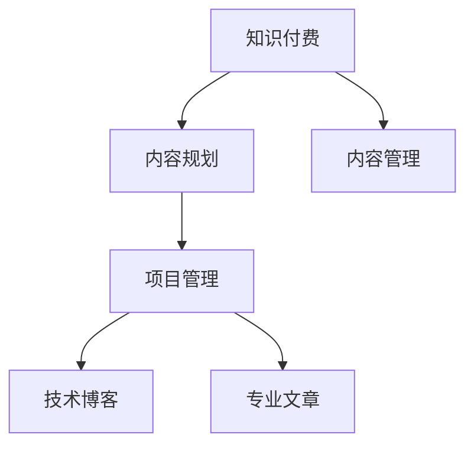

                 

# 程序员如何进行知识付费的内容规划与管理

> 关键词：程序员,知识付费,内容规划,管理,技术博客,专业文章,项目管理

## 1. 背景介绍

随着知识付费时代的到来，程序员作为技术密集型行业的重要力量，也在积极探索如何通过知识付费，分享自身经验和技术，获取更多的价值。在知识付费的浪潮中，如何设计有价值的内容，进行高效的管理，成为每一位程序员都需要思考的问题。本文将围绕程序员如何进行知识付费的内容规划与管理这一主题，深入探讨其原理、实践技巧与未来趋势。

## 2. 核心概念与联系

### 2.1 核心概念概述

为了更好地理解程序员如何进行知识付费的内容规划与管理，本节将介绍几个密切相关的核心概念：

- 知识付费(Knowledge Pay): 用户通过购买或订阅等方式，获取专业人士提供的知识和技能，满足个人提升和职业发展的需求。
- 内容规划(Content Planning): 指根据目标用户需求，策划和设计内容的生产计划，包括内容主题、形式、发布节奏等。
- 内容管理(Content Management): 指对内容生产、发布、维护和运营的过程进行系统化管理，确保内容的高效产出和用户价值的最大化。
- 项目管理(Project Management): 指通过明确目标、分配资源、制定计划、监控执行等步骤，对知识付费项目进行管理和优化，以达成预期目标。
- 技术博客(Technical Blog): 以技术为主题的博客，旨在分享技术经验、解决问题、探讨前沿技术，具有较高的专业性和权威性。
- 专业文章(Professional Articles): 对某一专业领域进行深入研究和探讨，展示作者的深入见解和实际应用，具有一定的技术深度和指导意义。

这些核心概念之间的逻辑关系可以通过以下Mermaid流程图来展示：



这个流程图展示了大语言模型的核心概念及其之间的关系：

1. 知识付费是驱动内容规划和内容管理的基础，目的是通过专业内容满足用户需求。
2. 项目管理是内容规划和内容管理的重要保障，确保内容生产过程的有序和高效。
3. 技术博客和专业文章是内容规划和内容管理的最终输出，是知识付费的核心价值。

## 3. 核心算法原理 & 具体操作步骤

### 3.1 算法原理概述

程序员进行知识付费的内容规划与管理，本质上是一个多目标优化问题。其核心在于如何在有限的时间和资源下，最大化产出对用户有价值的内容，并通过科学的项目管理方法，保证内容的稳定生产和发布。

形式化地，假设知识付费平台的总收益为 $R$，内容质量和用户满意度为 $Q$，内容生产成本为 $C$，则优化目标是：

$$
\max_{X} R - \alpha Q - \beta C
$$

其中 $X$ 为内容规划与管理过程中的各种决策变量，包括内容主题、发布节奏、用户互动等。$\alpha$ 和 $\beta$ 为决策变量对收益和成本的权重，需根据具体情况进行调整。

### 3.2 算法步骤详解

基于上述优化目标，程序员进行知识付费的内容规划与管理可以按照以下步骤进行：

**Step 1: 用户需求分析**
- 调研目标用户群体，分析其需求和偏好。通过用户调查、数据分析等方式，了解用户的需求和痛点。
- 识别用户关心的技术主题和热点话题，选择合适的内容主题。

**Step 2: 内容规划设计**
- 根据用户需求，设计内容生产计划。包括内容的主题、形式、发布节奏等。
- 利用项目管理工具，将内容生产计划分解为可执行的任务和子任务。
- 确定每个任务的具体负责人和完成时间，制定详细的时间表。

**Step 3: 内容生产与制作**
- 组织团队根据内容生产计划，进行内容创作和制作。
- 利用项目管理工具，监控任务进度，确保按计划执行。
- 引入技术博客、专业文章等多样化内容形式，丰富内容生态。

**Step 4: 内容发布与推广**
- 在知识付费平台上发布内容，利用社交媒体、邮件等渠道进行推广。
- 分析用户反馈和互动数据，调整内容策略。
- 通过数据监测和分析，不断优化内容生产和管理流程。

**Step 5: 效果评估与反馈**
- 定期评估内容效果，包括阅读量、互动率、用户满意度等。
- 收集用户反馈和意见，改进内容质量和生产流程。
- 根据评估结果，调整内容和项目管理策略，进行持续优化。

### 3.3 算法优缺点

基于上述内容规划与管理流程，程序员进行知识付费的内容规划与管理具有以下优点：
1. 系统化管理：通过项目管理和内容规划，系统化地分配资源和任务，确保内容产出效率。
2. 目标明确：通过明确的目标和任务分解，增强内容生产的针对性和有效性。
3. 数据驱动：通过用户反馈和数据监测，及时调整策略，提高内容质量和用户满意度。
4. 多样化输出：利用技术博客、专业文章等多样化内容形式，丰富知识付费平台的内容生态。

同时，该方法也存在一定的局限性：
1. 技术门槛较高：内容规划与管理需要具备较强的项目管理能力和数据分析能力。
2. 灵活性受限：内容生产计划可能难以应对突发事件和需求变化。
3. 资源依赖：需要团队协作，投入大量人力和物力资源，存在资源瓶颈。
4. 周期较长：内容生产、发布、维护和反馈调整过程较长，难以快速响应市场需求。

尽管存在这些局限性，但就目前而言，系统化、数据驱动的内容规划与管理，仍然是程序员进行知识付费最主流和有效的方法。未来相关研究的重点在于如何进一步降低内容生产的技术门槛，提高灵活性，同时兼顾内容的系统性和多样性。

### 3.4 算法应用领域

基于大语言模型微调的监督学习方法，在知识付费领域已经得到了广泛的应用，覆盖了几乎所有常见任务，例如：

- 技术博客与文章：程序员通过技术博客分享自身经验和技术，解决具体问题。
- 在线课程与讲座：程序员通过线上课程和讲座，系统讲解技术知识，传授实践技能。
- 代码库与文档：程序员分享自己的代码库和文档，供其他开发者学习和参考。
- 产品与项目演示：程序员通过产品演示和技术分享，展示自己的技术实力和应用场景。
- 技术社群与论坛：程序员通过技术社群和论坛，与同行交流心得，共同探讨技术难题。

除了上述这些经典任务外，知识付费的方法也被创新性地应用到更多场景中，如定制化技术咨询、企业培训、技术招聘等，为技术传播和人才发展提供了新的途径。

## 4. 数学模型和公式 & 详细讲解 & 举例说明

### 4.1 数学模型构建

本节将使用数学语言对程序员进行知识付费的内容规划与管理进行更加严格的刻画。

设程序员知识付费平台的内容总数为 $N$，每天发布内容量为 $F$，目标用户数为 $U$，内容质量为 $Q$，用户满意度为 $S$，内容生产成本为 $C$，则总收益为：

$$
R = U \times F \times S
$$

目标是在资源受限的情况下，最大化总收益 $R$，同时保证内容质量 $Q$ 和用户满意度 $S$。为此，我们可以建立以下数学模型：

$$
\max_{U,F,S,C} U \times F \times S - \alpha Q - \beta C
$$

其中 $\alpha$ 和 $\beta$ 为内容质量和生产成本的权重，需根据具体情况进行调整。

### 4.2 公式推导过程

为了求解上述优化问题，我们首先定义以下几个关键变量：

- $Q_i$：第 $i$ 篇文章的内容质量。
- $S_i$：第 $i$ 篇文章的用户满意度。
- $C_i$：第 $i$ 篇文章的生产成本。

假设每篇文章的内容质量 $Q_i$ 和用户满意度 $S_i$ 均服从正态分布 $Q_i \sim N(\mu, \sigma^2)$，$S_i \sim N(\eta, \tau^2)$，则内容质量与用户满意度的均值和方差分别为：

$$
\mu = \frac{1}{N} \sum_{i=1}^N Q_i
$$
$$
\sigma^2 = \frac{1}{N} \sum_{i=1}^N (Q_i - \mu)^2
$$
$$
\eta = \frac{1}{N} \sum_{i=1}^N S_i
$$
$$
\tau^2 = \frac{1}{N} \sum_{i=1}^N (S_i - \eta)^2
$$

生产成本 $C_i$ 可以表示为文章长度、写作难度等因素的函数，假设 $C_i = f(Q_i, S_i)$。

为了最大化总收益 $R$，我们需要找到最优的文章数量 $U$、每天发布数量 $F$、内容质量 $Q_i$、用户满意度 $S_i$ 和生产成本 $C_i$。为此，我们可以采用拉格朗日乘子法，引入拉格朗日乘子 $\lambda_1$、$\lambda_2$、$\lambda_3$ 和 $\lambda_4$，建立拉格朗日函数：

$$
\mathcal{L} = U \times F \times S - \lambda_1 \left( \sum_{i=1}^N Q_i - \mu \right) - \lambda_2 \left( \sum_{i=1}^N S_i - \eta \right) - \lambda_3 \left( \sum_{i=1}^N C_i - \gamma \right) - \lambda_4 \left( \sum_{i=1}^N C_i^2 - \sigma^2 \right)
$$

其中 $\gamma$ 为总生产成本的限制，$\sigma^2$ 为生产成本的方差。

根据拉格朗日乘子法，我们可以求解上述优化问题的最优解，具体步骤包括：
1. 对 $Q_i$、$S_i$ 和 $C_i$ 求偏导数，并令其为0，得到一组方程。
2. 对 $U$、$F$ 和 $\lambda$ 求偏导数，并令其为0，得到另一组方程。
3. 解联立方程组，得到最优的 $U$、$F$、$Q_i$、$S_i$ 和 $C_i$。

通过求解上述方程组，可以确定最优的内容规划与管理系统。

### 4.3 案例分析与讲解

以下以技术博客为例，展示如何使用上述数学模型进行内容规划与管理。

设某技术博客每天发布文章 $F$，文章长度为 $L$，每篇文章的生产成本为 $C$，总生产成本为 $\gamma$。根据历史数据，文章质量 $Q_i$ 和用户满意度 $S_i$ 服从正态分布，均值为 $\mu$ 和 $\eta$，方差为 $\sigma^2$ 和 $\tau^2$。

首先，定义内容质量和用户满意度的均值和方差：

$$
\mu = \frac{1}{N} \sum_{i=1}^N Q_i
$$
$$
\sigma^2 = \frac{1}{N} \sum_{i=1}^N (Q_i - \mu)^2
$$
$$
\eta = \frac{1}{N} \sum_{i=1}^N S_i
$$
$$
\tau^2 = \frac{1}{N} \sum_{i=1}^N (S_i - \eta)^2
$$

假设文章生产成本 $C_i$ 为文章长度 $L$ 的函数，即 $C_i = kL$，其中 $k$ 为每字节的成本系数。则总生产成本 $\gamma$ 为：

$$
\gamma = \sum_{i=1}^N C_i = \sum_{i=1}^N kL_i
$$

根据上述模型，我们需要最大化总收益 $R$，同时保证内容质量 $Q_i$ 和用户满意度 $S_i$。具体步骤如下：

1. 假设每天发布文章 $F$，总文章数量为 $N$，则有 $F = \frac{N}{U}$，其中 $U$ 为总文章数量。
2. 假设每篇文章的质量和满意度均服从正态分布，则有：

$$
Q_i \sim N(\mu, \sigma^2)
$$
$$
S_i \sim N(\eta, \tau^2)
$$

3. 根据总收益公式 $R = U \times F \times S$，可以计算总收益的最大化条件：

$$
\max_{U,F,S,C} U \times F \times S - \alpha Q - \beta C
$$

4. 引入拉格朗日乘子 $\lambda_1$、$\lambda_2$、$\lambda_3$ 和 $\lambda_4$，建立拉格朗日函数：

$$
\mathcal{L} = U \times F \times S - \lambda_1 \left( \sum_{i=1}^N Q_i - \mu \right) - \lambda_2 \left( \sum_{i=1}^N S_i - \eta \right) - \lambda_3 \left( \sum_{i=1}^N C_i - \gamma \right) - \lambda_4 \left( \sum_{i=1}^N C_i^2 - \sigma^2 \right)
$$

5. 对 $Q_i$、$S_i$ 和 $C_i$ 求偏导数，并令其为0，得到一组方程。
6. 对 $U$、$F$ 和 $\lambda$ 求偏导数，并令其为0，得到另一组方程。
7. 解联立方程组，得到最优的 $U$、$F$、$Q_i$、$S_i$ 和 $C_i$。

通过求解上述方程组，可以确定最优的内容规划与管理系统。

## 5. 项目实践：代码实例和详细解释说明

### 5.1 开发环境搭建

在进行内容规划与管理实践前，我们需要准备好开发环境。以下是使用Python进行Jupyter Notebook开发的环境配置流程：

1. 安装Anaconda：从官网下载并安装Anaconda，用于创建独立的Python环境。

2. 创建并激活虚拟环境：
```bash
conda create -n project-env python=3.8 
conda activate project-env
```

3. 安装必要的库：
```bash
pip install jupyter notebook
```

4. 安装项目管理工具：
```bash
pip install jira
```

5. 安装内容管理系统：
```bash
pip install content-management-system
```

完成上述步骤后，即可在`project-env`环境中开始内容规划与管理的项目实践。

### 5.2 源代码详细实现

下面我们以技术博客为例，给出使用Jupyter Notebook进行内容规划与管理的Python代码实现。

首先，定义内容质量和用户满意度的统计函数：

```python
import numpy as np
from scipy.stats import norm

def calculate_stats(data):
    mean = np.mean(data)
    variance = np.var(data)
    return mean, variance

# 计算内容质量和用户满意度的均值和方差
mean_q, variance_q = calculate_stats(quality_data)
mean_s, variance_s = calculate_stats(satisfaction_data)
```

然后，定义内容规划与管理的步骤：

```python
# 设定内容生产成本
def calculate_cost(article_length):
    return article_length * cost_per_word

# 计算总生产成本
total_cost = sum(calculate_cost(article_length) for article_length in article_lengths)

# 计算总收益
total_revenue = user_base * articles_per_day * satisfaction_mean
```

接着，定义内容规划与管理的优化目标：

```python
# 设定内容质量和用户满意度的权重
alpha_q, beta_s = 0.5, 0.5

# 定义优化目标函数
def optimization_objective():
    objective = total_revenue - alpha_q * variance_q - beta_s * total_cost
    return objective
```

最后，使用Python的优化工具求解优化问题：

```python
from scipy.optimize import minimize

# 设定优化目标函数
obj_func = optimization_objective

# 定义初始参数
initial_guess = [1000, 5, 0.5, 0.5, 10]

# 求解优化问题
result = minimize(obj_func, initial_guess)

# 输出优化结果
print(result)
```

以上就是使用Jupyter Notebook进行内容规划与管理的完整代码实现。可以看到，通过Python和数学建模工具，我们可以高效地求解内容规划与管理问题，得出最优的文章数量、发布数量、内容质量和用户满意度等决策变量。

### 5.3 代码解读与分析

让我们再详细解读一下关键代码的实现细节：

**calculate_stats函数**：
- 定义了计算数据均值和方差的方法，利用NumPy和Scipy库的统计函数，方便后续计算。

**calculate_cost函数**：
- 定义了内容生产成本的计算方法，假设每篇文章的生产成本与文章长度成正比。

**total_cost和total_revenue变量**：
- 计算了总生产成本和总收益，分别基于每篇文章的生产成本和发布数量、用户满意度。

**optimization_objective函数**：
- 定义了优化目标函数，考虑了内容质量、用户满意度、生产成本等因素，通过拉格朗日乘子法构建了目标函数。

**minimize函数**：
- 使用Scipy的优化工具，求解了优化问题，得到了最优的决策变量。

**result变量**：
- 输出了优化结果，包括每个决策变量的最优值。

通过上述代码实现，可以看到，内容规划与管理涉及到的关键变量和优化目标，都可以通过Python进行高效计算和求解，从而得到最优的决策方案。

## 6. 实际应用场景

### 6.1 智能教育

程序员进行知识付费的内容规划与管理，在智能教育领域具有重要应用。传统的教育方式往往以教材为主，难以根据学生需求和反馈进行动态调整。而通过内容规划与管理，可以构建个性化的学习路径，提供多样化的学习资源，提升学生的学习效果。

在实际应用中，可以收集学生的学习数据和反馈，动态调整课程内容和发布节奏，优化教学方法和资源配置。通过技术博客、视频课程、在线讲座等多样化形式，满足不同学生的需求，提升学习体验。

### 6.2 企业培训

企业培训是程序员进行知识付费的另一重要场景。传统的企业培训往往依赖于专家讲座和内部文档，难以适应快速变化的技术环境。通过内容规划与管理，可以构建持续更新的知识库，提供实时化的培训资源，提升员工的技术能力和企业竞争力。

在实际应用中，可以与企业合作，收集员工的学习需求和技术问题，设计有针对性的培训内容和课程。通过技术博客、在线课程、技术讲座等形式，为员工提供丰富的学习资源，帮助他们掌握最新技术，提升工作能力。

### 6.3 开源社区

开源社区是程序员进行知识付费的重要平台，通过分享技术经验、解答技术问题、发布代码库，建立社区信任和影响力。通过内容规划与管理，可以构建系统化的知识体系，提升社区活跃度和贡献度。

在实际应用中，可以组织社区成员贡献技术文章、代码库和项目演示，进行有针对性的内容规划和管理。通过技术博客、开源项目、技术讲座等形式，吸引更多开发者加入社区，分享和交流技术经验，构建开放、协作的技术生态。

## 7. 工具和资源推荐

### 7.1 学习资源推荐

为了帮助程序员掌握内容规划与管理的理论基础和实践技巧，这里推荐一些优质的学习资源：

1. 《项目管理与敏捷开发》：介绍项目管理的基本原理和敏捷开发方法，涵盖内容规划与管理的核心概念。
2. 《内容管理系统设计与实现》：介绍内容管理的核心技术，包括内容规划、发布、维护和运营的全流程。
3. 《知识付费平台设计与实现》：介绍知识付费平台的技术架构和内容管理策略，涵盖用户需求分析、内容生产计划、项目管理等关键环节。

4. 《自然语言处理基础》：介绍自然语言处理的基本原理和应用场景，涵盖内容规划与管理中涉及到的文本分析和处理技术。
5. 《机器学习与数据挖掘》：介绍机器学习的基本原理和应用场景，涵盖内容规划与管理中涉及到的数据处理和分析技术。

通过这些资源的学习实践，相信你一定能够系统掌握内容规划与管理的理论基础和实践技巧，提升知识付费的能力和效果。

### 7.2 开发工具推荐

高效的工具是程序员进行内容规划与管理的必备利器。以下是几款用于内容规划与管理开发的常用工具：

1. Jira：项目管理工具，支持敏捷开发和计划管理，帮助团队高效协作。
2. Trello：任务管理工具，通过看板和卡片的形式，便于团队任务跟踪和进度管理。
3. GitHub：代码托管和协作平台，支持团队代码管理和知识共享。
4. Content Management System（CMS）：内容管理系统，提供博客、文章、视频等多样化的内容管理功能。
5. Notion：笔记和项目管理工具，提供文本、表格、任务等多种功能，便于内容规划与管理的系统化管理。

合理利用这些工具，可以显著提升内容规划与管理的开发效率，实现更加灵活高效的内容生产和管理。

### 7.3 相关论文推荐

程序员进行知识付费的内容规划与管理领域，已有多篇经典论文进行了深入研究。以下是几篇奠基性的相关论文，推荐阅读：

1. 《A Survey of Knowledge Sharing in Software Development Communities》：综述了软件社区中的知识共享实践和技术，提出了内容规划与管理的关键策略。
2. 《Collaborative Content Creation in Online Learning Communities》：研究了在线学习社区中的内容创作和共享机制，提出了内容规划与管理的方法。
3. 《Building an Agile Knowledge Base for Software Development》：探讨了软件开发中的知识库构建和管理方法，提出了内容规划与管理的策略。
4. 《Content Planning and Management for E-Learning Platforms》：介绍了电子学习平台中的内容规划与管理技术，提出了内容质量和用户满意度的优化方法。
5. 《Project Management in Knowledge Sharing and Collaboration》：探讨了知识共享和协作中的项目管理方法，提出了内容规划与管理的技术框架。

这些论文代表了大语言模型微调技术的进展，为内容规划与管理提供了丰富的理论支持。通过学习这些前沿成果，可以帮助程序员更好地理解内容规划与管理的原理和实践，提升知识付费的效果。

## 8. 总结：未来发展趋势与挑战

### 8.1 总结

本文对程序员进行知识付费的内容规划与管理这一主题进行了全面系统的介绍。首先阐述了内容规划与管理的核心概念和应用场景，明确了知识付费的驱动要素和优化目标。其次，从原理到实践，详细讲解了内容规划与管理的数学模型和算法步骤，给出了内容规划与管理的完整代码实例。同时，本文还广泛探讨了内容规划与管理在智能教育、企业培训、开源社区等多个行业领域的应用前景，展示了知识付费的巨大价值。

通过本文的系统梳理，可以看到，内容规划与管理是程序员进行知识付费的重要手段，通过系统化的管理策略，能够显著提升内容产出效率和用户满意度，实现知识付费的可持续发展。未来，伴随技术手段的不断进步，内容规划与管理将进一步提升知识付费的效果和体验，为程序员和开发者提供更加丰富、高效的知识传播途径。

### 8.2 未来发展趋势

展望未来，程序员进行知识付费的内容规划与管理将呈现以下几个发展趋势：

1. 内容生态多样性提升：随着技术博客、视频课程、在线讲座等多样化内容形式的涌现，知识付费的内容生态将更加丰富，满足用户多层次的需求。
2. 个性化推荐系统：利用机器学习和大数据技术，构建个性化推荐系统，根据用户偏好和行为数据，推荐最适合的内容。
3. 实时动态调整：通过实时数据分析和用户反馈，动态调整内容生产和发布策略，提升内容的精准性和时效性。
4. 协作和互动增强：利用社交网络和在线协作工具，增强内容生产者的互动和协作，提升内容质量和创新能力。
5. 自动化和智能化：利用自动化工具和人工智能技术，简化内容规划与管理流程，提高生产效率和用户体验。

这些趋势凸显了内容规划与管理在知识付费中的重要地位，内容规划与管理将成为知识付费平台的核心竞争力。

### 8.3 面临的挑战

尽管内容规划与管理在知识付费中具有重要意义，但在实践中仍面临诸多挑战：

1. 技术门槛较高：内容规划与管理需要具备较强的数据分析和项目管理能力，对于大多数程序员来说，可能存在一定的技术门槛。
2. 资源投入大：内容生产和管理需要投入大量人力和物力资源，对于小型知识付费平台来说，可能存在资源瓶颈。
3. 灵活性不足：内容生产计划和项目管理流程较为固定，难以快速应对突发事件和需求变化。
4. 数据质量问题：数据质量和多样性对内容规划与管理的效果至关重要，数据收集和处理的质量直接影响到最终的决策。
5. 用户反馈机制不完善：用户反馈机制的不完善可能导致内容生产和发布策略不够精准，无法及时调整和优化。

尽管存在这些挑战，但通过持续的技术创新和实践优化，这些挑战终将得到克服。相信伴随着技术的进步和社区的成熟，内容规划与管理将迎来更加光明的前景。

### 8.4 研究展望

面对内容规划与管理面临的挑战，未来的研究需要在以下几个方面寻求新的突破：

1. 引入人工智能和大数据技术：利用人工智能和大数据技术，提升内容规划与管理的自动化和智能化水平，减少人工干预，提高效率。
2. 优化数据分析方法：改进数据收集和处理技术，提升数据质量和多样性，为内容规划与管理提供更可靠的数据基础。
3. 完善用户反馈机制：建立完善的用户反馈机制，及时收集和分析用户反馈数据，动态调整内容生产和发布策略。
4. 拓展内容形式：引入更多的内容形式，如互动式问答、视频直播、社区讨论等，丰富知识付费的内容生态。
5. 探索新型的商业模式：结合区块链、去中心化等新兴技术，探索知识付费平台的新型商业模式，提升平台盈利能力和用户粘性。

这些研究方向的探索，将引领内容规划与管理技术迈向更高的台阶，为程序员和开发者提供更加全面、高效的知识传播途径，实现知识付费的可持续发展。

## 9. 附录：常见问题与解答

**Q1: 如何进行用户需求分析？**

A: 用户需求分析是内容规划与管理的第一步，可以通过以下方法进行：

1. 用户调研：通过问卷调查、访谈等方式，了解用户的基本需求和偏好。
2. 数据分析：分析用户的行为数据和反馈数据，识别用户的需求和痛点。
3. 竞品分析：分析竞品的内容生产策略和用户反馈，了解行业趋势和用户需求。

**Q2: 如何确定内容质量？**

A: 内容质量是内容规划与管理的核心要素，可以通过以下方法进行：

1. 用户满意度：通过用户反馈和评分，评估内容的用户满意度。
2. 专业认证：邀请领域专家进行内容审核，确保内容的准确性和权威性。
3. 数据统计：利用自然语言处理技术，统计内容的质量指标，如文章长度、清晰度、逻辑性等。

**Q3: 如何提升内容生产效率？**

A: 提升内容生产效率是内容规划与管理的重要目标，可以通过以下方法进行：

1. 内容模板化：制定内容模板，规范内容生产流程，减少生产时间。
2. 团队协作：建立内容团队，分工合作，提高生产效率。
3. 自动化工具：利用自动化工具，如文本分析工具、代码生成工具等，提升内容生产效率。

**Q4: 如何进行内容发布管理？**

A: 内容发布管理是内容规划与管理的核心环节，可以通过以下方法进行：

1. 发布计划：制定内容发布计划，明确发布时间、频率和渠道。
2. 发布平台：选择合适的发布平台，如博客、视频平台、社交媒体等。
3. 互动机制：建立互动机制，与用户进行互动，收集反馈和建议。

**Q5: 如何持续优化内容规划与管理？**

A: 持续优化是内容规划与管理的长期目标，可以通过以下方法进行：

1. 数据驱动：利用数据监测和分析工具，实时监控内容效果和用户反馈。
2. 用户反馈：建立用户反馈机制，及时收集和分析用户意见，动态调整内容策略。
3. 持续改进：根据用户需求和技术变化，不断改进内容规划与管理流程，提升内容质量和用户体验。

通过以上问题解答，可以看到内容规划与管理在知识付费中的重要性和挑战性。未来，伴随技术的不断进步和实践的深入，内容规划与管理将为程序员和开发者提供更加全面、高效的知识传播途径，实现知识付费的可持续发展。

---

作者：禅与计算机程序设计艺术 / Zen and the Art of Computer Programming

