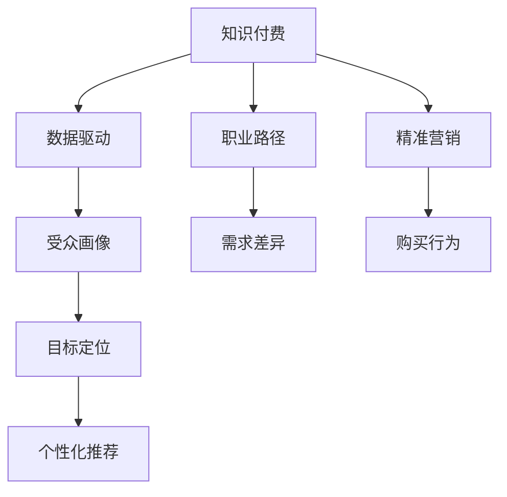

                 

# 程序员如何进行知识付费的受众定位

> 关键词：知识付费, 程序员, 受众定位, 精准营销, 数据驱动

## 1. 背景介绍

### 1.1 问题由来
随着互联网技术的迅猛发展，知识付费平台如雨后春笋般涌现。这一新兴领域带来了巨大的商业价值，但也引发了一系列问题。如何精准定位目标受众，从而提高知识付费产品的销售和用户粘性，成为当前亟待解决的关键问题。程序员作为知识付费的重要受众群体，了解其特点和需求，对知识付费平台的成功运营具有重要意义。

### 1.2 问题核心关键点
程序员受众定位的核心问题包括以下几点：
1. 程序员的常见职业路径和需求。
2. 程序员的技术水平分布及学习需求。
3. 程序员的知识付费行为特征。
4. 如何结合技术手段，构建精准的程序员受众画像。

## 2. 核心概念与联系

### 2.1 核心概念概述

为了深入理解程序员受众定位的逻辑，本节将介绍几个关键概念：

- 知识付费：指通过购买或订阅方式，获取有价值知识或技能的学习平台。知识付费已成为新兴的学习方式，尤其受到高素质人群的青睐。
- 精准营销：利用数据分析技术，将营销信息传递给最有可能产生购买行为的目标受众，提高营销效率和ROI。
- 数据驱动：在知识付费平台的运营过程中，通过数据分析、用户行为追踪等手段，指导产品设计、内容制作和市场推广。
- 受众画像：指通过对用户特征、行为、兴趣等多维度数据的分析，构建用户画像，精准定位目标受众。
- 职业路径：指程序员在职业生涯中的阶段性目标和发展方向，包括初级开发者、中级工程师、高级工程师等不同阶段的需求差异。

这些概念之间的逻辑关系可以通过以下Mermaid流程图来展示：



这个流程图展示的知识付费平台的关键概念及其之间的关系：

1. 知识付费平台通过数据驱动，分析用户行为，构建精准的受众画像。
2. 受众画像涵盖了职业路径、需求差异等多个维度，帮助平台更精准地定位目标受众。
3. 精准营销结合受众画像，进行个性化推荐，提高营销效果和用户粘性。
4. 职业路径的差异对应不同的学习需求，平台需针对不同阶段的程序员设计不同的内容和服务。

## 3. 核心算法原理 & 具体操作步骤

### 3.1 算法原理概述

程序员受众定位的核心算法是基于机器学习的用户画像构建和行为分析。其基本思想是通过对程序员的职业路径、技术水平、学习需求等维度的数据进行分析，构建用户画像，进而实现精准营销。

主要步骤如下：
1. 数据收集：通过问卷调查、网站分析、用户行为追踪等方式收集程序员的各类数据。
2. 数据清洗与预处理：去除噪音数据，进行特征选择和降维处理。
3. 模型训练：选择合适的机器学习模型，如聚类、分类、回归等，训练用户画像模型。
4. 画像构建：利用训练好的模型，生成程序员的精准用户画像。
5. 目标定位：结合职业路径和需求差异，定位程序员的个性化需求和目标受众。
6. 营销策略：根据目标受众特征，制定个性化的营销策略，提升知识付费产品的销售和用户粘性。

### 3.2 算法步骤详解

以下是基于机器学习的程序员受众定位算法的详细步骤：

#### Step 1: 数据收集
数据来源主要包括以下几个方面：

1. 网站行为数据：通过用户在网站上的行为（如浏览、点击、停留时间等）收集用户兴趣和偏好数据。
2. 问卷调查数据：设计问卷，获取程序员的职业路径、技术水平、学习需求等相关信息。
3. 用户反馈数据：通过用户评论、评分等反馈数据，了解用户对知识付费产品的满意度。
4. 第三方数据：借助第三方数据分析平台，如百度统计、Google Analytics等，获取用户行为数据。

#### Step 2: 数据清洗与预处理
数据清洗与预处理的目的是去除噪音数据，确保数据质量和分析结果的准确性。主要包括以下步骤：

1. 数据去重：去除重复记录，避免冗余数据对分析结果的影响。
2. 数据补全：对缺失数据进行插补，保持数据完整性。
3. 数据标准化：将不同来源的数据进行标准化处理，确保数据格式一致。
4. 特征选择：选择与用户特征、行为、需求相关的重要特征，去除无关或弱相关特征。

#### Step 3: 模型训练
选择合适的机器学习模型，并使用训练数据对模型进行训练。常用的模型包括：

1. K-means聚类：用于用户分群，将程序员按照技术水平、学习需求等维度进行聚类。
2. 决策树分类：用于识别程序员的职业路径和阶段性需求。
3. 随机森林回归：用于预测程序员的学习需求和购买意愿。
4. 神经网络模型：用于复杂特征的建模和分类。

#### Step 4: 画像构建
利用训练好的模型，对用户数据进行分析和建模，构建精准的用户画像。主要包括以下步骤：

1. 用户分群：通过K-means聚类将程序员分为不同群体，每组代表一种典型的用户画像。
2. 特征分析：分析各用户群体的特征和需求，识别共性特征和差异特征。
3. 用户画像构建：根据各群体的特征，构建详细的用户画像，包括技术水平、学习需求、职业路径等。

#### Step 5: 目标定位
结合用户画像和职业路径，精准定位程序员的个性化需求和目标受众。主要包括以下步骤：

1. 职业路径分析：通过决策树分类模型，识别程序员的职业路径和阶段性需求。
2. 需求差异分析：利用随机森林回归模型，预测程序员的学习需求和购买意愿。
3. 目标定位：结合职业路径和需求差异，定位程序员的个性化需求和目标受众。

#### Step 6: 营销策略
根据目标受众特征，制定个性化的营销策略，提升知识付费产品的销售和用户粘性。主要包括以下步骤：

1. 个性化推荐：利用用户画像和需求差异，进行个性化推荐，提高用户转化率。
2. 定向营销：根据目标受众特征，进行定向营销，提高营销效率。
3. 用户粘性提升：通过用户行为分析和反馈，提升用户粘性，增加复购率。

### 3.3 算法优缺点

程序员受众定位算法的优点包括：

1. 精准定位：通过数据分析和机器学习模型，精准定位程序员的个性化需求，提高营销效率和ROI。
2. 数据驱动：利用数据驱动的方式，根据程序员的行为和反馈，优化产品设计和营销策略。
3. 可扩展性强：算法模型具有较强的可扩展性，适用于不同规模和类型的知识付费平台。

缺点包括：

1. 数据依赖：算法效果依赖于数据质量和数据量的充足性，数据收集和处理成本较高。
2. 模型复杂：算法模型较为复杂，需要较强的数据科学和机器学习背景，实施成本较高。
3. 隐私问题：数据收集和处理过程中，需注意用户隐私保护，避免侵犯用户权益。

### 3.4 算法应用领域

程序员受众定位算法不仅适用于知识付费平台，还广泛应用于以下领域：

1. 教育培训：通过分析学生特征和需求，提供个性化的教育培训服务。
2. 产品推荐：通过用户画像和行为分析，提供个性化的产品推荐，提升用户体验。
3. 市场分析：通过数据分析，识别市场趋势和用户需求，指导产品设计和市场推广。
4. 营销策划：通过精准定位目标受众，制定个性化的营销策略，提高营销效果。
5. 用户行为分析：通过用户行为追踪和分析，优化用户体验，提升用户满意度。

## 4. 数学模型和公式 & 详细讲解 & 举例说明

### 4.1 数学模型构建

程序员受众定位算法涉及多个机器学习模型，以下以K-means聚类模型为例，介绍其数学模型构建。

设程序员用户数据集为 $D=\{x_i\}_{i=1}^N$，其中 $x_i=(x_{i1},x_{i2},\ldots,x_{in})$ 表示第 $i$ 个用户的 $n$ 个特征向量。聚类目标是最小化簇内平方和损失函数：

$$
\min_{\mu_k} \sum_{i=1}^N \min_{k} ||x_i - \mu_k||^2
$$

其中 $\mu_k$ 表示第 $k$ 个簇的中心点。

### 4.2 公式推导过程

以K-means聚类为例，推导其核心公式和算法步骤：

1. 初始化聚类中心 $\mu_1,\mu_2,\ldots,\mu_k$。
2. 对于每个用户 $x_i$，计算其到每个聚类中心的距离，将其归属于最近的聚类中心。
3. 更新聚类中心的坐标，重新计算距离，直到聚类中心不再变化或达到预设的迭代次数。

### 4.3 案例分析与讲解

以某知识付费平台为例，分析其如何使用K-means聚类算法进行程序员受众定位：

1. 数据收集：通过问卷调查和网站行为分析，收集程序员的技术水平、学习需求、职业路径等信息。
2. 数据预处理：对数据进行去重、补全、标准化等处理，选择重要的特征进行特征选择。
3. 模型训练：使用K-means聚类算法，对程序员数据进行聚类，生成5个典型的用户群体。
4. 画像构建：分析每个用户群体的特征和需求，构建详细的数据画像。
5. 目标定位：根据职业路径和需求差异，定位程序员的个性化需求和目标受众。
6. 营销策略：结合目标受众特征，进行个性化推荐和定向营销，提升产品销售和用户粘性。

## 5. 项目实践：代码实例和详细解释说明

### 5.1 开发环境搭建

在进行程序员受众定位的实践时，我们需要准备好开发环境。以下是使用Python进行Scikit-learn开发的Python环境配置流程：

1. 安装Anaconda：从官网下载并安装Anaconda，用于创建独立的Python环境。

2. 创建并激活虚拟环境：
```bash
conda create -n pydata-env python=3.8 
conda activate pydata-env
```

3. 安装Scikit-learn：从官网获取对应的安装命令。例如：
```bash
conda install scikit-learn 
```

4. 安装各类工具包：
```bash
pip install numpy pandas scikit-learn matplotlib tqdm jupyter notebook ipython
```

完成上述步骤后，即可在`pydata-env`环境中开始项目实践。

### 5.2 源代码详细实现

下面我们以程序员受众定位的K-means聚类模型为例，给出使用Scikit-learn库进行Python代码实现。

首先，定义数据处理函数：

```python
from sklearn.cluster import KMeans
from sklearn.preprocessing import StandardScaler
import pandas as pd
import numpy as np

def load_data(file_path):
    data = pd.read_csv(file_path)
    return data

def preprocess_data(data):
    # 数据清洗和预处理
    # 数据去重
    data = data.drop_duplicates()
    # 数据补全
    data = data.fillna(method='ffill')
    # 数据标准化
    data = StandardScaler().fit_transform(data)
    return data

def cluster_analysis(data):
    # 聚类分析
    kmeans = KMeans(n_clusters=5)
    kmeans.fit(data)
    return kmeans.labels_
```

然后，定义主函数：

```python
if __name__ == "__main__":
    # 数据加载
    data_path = "data.csv"
    data = load_data(data_path)
    # 数据预处理
    data = preprocess_data(data)
    # 聚类分析
    labels = cluster_analysis(data)
    # 结果输出
    print(labels)
```

最后，启动K-means聚类分析程序：

```bash
python kmeans_analysis.py
```

以上就是使用Scikit-learn对程序员受众进行聚类分析的完整代码实现。可以看到，Scikit-learn库的强大封装使得代码实现变得简洁高效。

### 5.3 代码解读与分析

让我们再详细解读一下关键代码的实现细节：

**load_data函数**：
- 从CSV文件中加载程序员数据，将其转换为Pandas数据帧。

**preprocess_data函数**：
- 对数据进行清洗和预处理，包括去重、补全、标准化等操作。
- 标准化处理使用`StandardScaler`实现，将数据缩放到均值为0，标准差为1的标准正态分布。

**cluster_analysis函数**：
- 使用K-means聚类算法进行聚类分析。
- 通过设置`n_clusters`参数，指定聚类的簇数。
- 计算每个用户到聚类中心的距离，将其归属于最近的聚类中心。
- 更新聚类中心的坐标，重新计算距离，直到聚类中心不再变化。

**主函数**：
- 加载数据文件。
- 预处理数据。
- 进行聚类分析。
- 输出聚类结果。

可以看到，通过Scikit-learn库，程序员受众定位的代码实现变得简洁高效。开发者可以将更多精力放在数据处理、模型改进等高层逻辑上，而不必过多关注底层的实现细节。

当然，工业级的系统实现还需考虑更多因素，如模型的保存和部署、超参数的自动搜索、更灵活的任务适配层等。但核心的受众定位算法基本与此类似。

## 6. 实际应用场景

### 6.1 编程教育

编程教育平台可以利用程序员受众定位算法，对学生进行精准定位和个性化推荐。通过分析学生的编程水平、学习兴趣和职业目标，平台可以推荐适合的学习资源和课程，提高学生的学习效果和平台粘性。

### 6.2 软件开发

软件开发平台可以利用程序员受众定位算法，识别出高潜力的开发者，并进行定向招聘和激励。通过分析开发者的技术水平、项目经验、兴趣偏好等特征，平台可以推荐合适的项目和岗位，帮助开发者更好地展示自身技能，提升职业发展。

### 6.3 软件开发工具

软件开发工具可以利用程序员受众定位算法，优化用户界面和功能。通过分析用户的使用习惯和反馈，工具可以推荐最符合用户需求的功能模块和配置选项，提高用户体验和满意度。

### 6.4 未来应用展望

随着程序员受众定位算法的不断演进，其将在更多领域得到应用，为程序员提供更好的服务和体验。

在智慧教育领域，程序员受众定位算法可应用于个性化教育资源的推荐，提升学生的学习效果和平台的粘性。

在软件开发领域，算法可应用于人才识别和招聘，帮助企业找到最合适的开发者，提升企业的创新能力。

在软件开发工具领域，算法可应用于用户行为分析，优化用户界面和功能，提高用户体验和满意度。

此外，在企业培训、软件开发项目、知识管理等众多领域，程序员受众定位算法也将不断涌现，为程序员提供更多的个性化服务。

## 7. 工具和资源推荐

### 7.1 学习资源推荐

为了帮助开发者系统掌握程序员受众定位的理论基础和实践技巧，这里推荐一些优质的学习资源：

1. 《Python数据分析与机器学习》系列书籍：介绍Python在数据分析和机器学习中的应用，包含多个数据科学和机器学习领域的经典算法和案例。
2. Coursera《机器学习》课程：斯坦福大学开设的机器学习课程，有Lecture视频和配套作业，带你入门机器学习和数据科学。
3. Kaggle平台：全球最大的数据科学竞赛平台，汇集了大量的数据集和算法竞赛，是实践程序员受众定位算法的绝佳场所。
4. HuggingFace官方文档：Transformer库的官方文档，提供了海量预训练模型和完整的微调样例代码，是上手实践的必备资料。
5. GitHub开源项目：收集了大量的程序员受众定位算法和应用案例，是学习和参考的绝佳资源。

通过对这些资源的学习实践，相信你一定能够快速掌握程序员受众定位的精髓，并用于解决实际的NLP问题。

### 7.2 开发工具推荐

高效的开发离不开优秀的工具支持。以下是几款用于程序员受众定位开发的常用工具：

1. Python：Python是数据科学和机器学习的主流语言，具有强大的库支持和数据处理能力。
2. Scikit-learn：基于Python的开源机器学习库，提供了多种机器学习算法和工具，是程序员受众定位算法实现的基础。
3. TensorFlow：由Google主导开发的开源深度学习框架，生产部署方便，适合大规模工程应用。
4. Weights & Biases：模型训练的实验跟踪工具，可以记录和可视化模型训练过程中的各项指标，方便对比和调优。
5. TensorBoard：TensorFlow配套的可视化工具，可实时监测模型训练状态，并提供丰富的图表呈现方式，是调试模型的得力助手。
6. Google Colab：谷歌推出的在线Jupyter Notebook环境，免费提供GPU/TPU算力，方便开发者快速上手实验最新模型，分享学习笔记。

合理利用这些工具，可以显著提升程序员受众定位任务的开发效率，加快创新迭代的步伐。

### 7.3 相关论文推荐

程序员受众定位算法的研究源于学界的持续研究。以下是几篇奠基性的相关论文，推荐阅读：

1. "K-means Clustering: Algorithms and Applications"：详细介绍了K-means聚类算法的基本原理和应用。
2. "Data Mining: Concepts and Techniques"：介绍数据挖掘的基本概念和算法，包含聚类、分类、回归等数据挖掘任务。
3. "The Elements of Statistical Learning"：介绍机器学习的基本概念和算法，包含分类、回归、聚类等机器学习任务。
4. "Pattern Recognition and Machine Learning"：介绍模式识别和机器学习的基本概念和算法，包含聚类、分类、回归等机器学习任务。
5. "A Survey of Online Learning and Online Clustering"：综述在线学习与在线聚类的最新进展，包含在线聚类算法的设计和优化。

这些论文代表了大数据聚类和分类算法的最新研究成果，通过学习这些前沿成果，可以帮助研究者把握学科前进方向，激发更多的创新灵感。

## 8. 总结：未来发展趋势与挑战

### 8.1 总结

本文对程序员受众定位的算法原理和操作步骤进行了全面系统的介绍。首先阐述了程序员受众定位的核心问题，明确了数据驱动和机器学习在大数据分析中的应用。其次，从原理到实践，详细讲解了基于K-means聚类算法的程序员受众定位方法，并给出了具体的Python代码实现。同时，本文还广泛探讨了程序员受众定位在编程教育、软件开发、软件开发工具等领域的广泛应用，展示了程序员受众定位算法的巨大潜力。

通过本文的系统梳理，可以看到，基于机器学习的程序员受众定位方法正在成为大数据分析的重要范式，极大地拓展了数据分析的应用边界，催生了更多的落地场景。未来，伴随大数据和人工智能技术的不断进步，程序员受众定位技术还将进一步演进，为程序员提供更加精准和个性化的服务。

### 8.2 未来发展趋势

展望未来，程序员受众定位算法将呈现以下几个发展趋势：

1. 算法模型的融合：未来可能会涌现更多融合不同算法模型的定位方法，如融合聚类、分类、回归等多种算法，提高定位的准确性和鲁棒性。
2. 数据源的多样化：除了传统的网站行为数据，未来的定位算法将更多利用社交媒体、社区论坛等新型数据源，获取更丰富的用户信息。
3. 实时化的需求：随着实时数据流量的增加，程序员受众定位算法也将更注重实时化，及时捕捉用户行为变化，提供实时推荐和服务。
4. 增强学习的应用：增强学习算法将在大数据分析中得到更多应用，通过不断优化算法模型，提升用户定位的准确性和个性化程度。
5. 多模态数据的融合：未来的定位算法将更多利用多模态数据，如文本、图像、语音等，构建更加全面的用户画像。

以上趋势凸显了程序员受众定位算法的广阔前景。这些方向的探索发展，必将进一步提升程序员受众定位的准确性和个性化程度，为程序员提供更好的服务和体验。

### 8.3 面临的挑战

尽管程序员受众定位算法已经取得了一定的成效，但在迈向更加智能化、普适化应用的过程中，它仍面临着诸多挑战：

1. 数据质量和数据隐私：数据质量和数据隐私问题仍然是制约程序员受众定位算法的瓶颈，数据收集和处理过程中，需注意用户隐私保护，避免侵犯用户权益。
2. 算法的复杂度和可解释性：算法模型较为复杂，需要较强的数据科学和机器学习背景，实施成本较高，同时模型的可解释性也是一大难题。
3. 实时化的需求：实时数据流量的增加，对算法的实时处理能力提出了更高的要求，如何实现高效、实时化的处理，还需要进一步优化。
4. 多模态数据的融合：多模态数据的融合和分析较为复杂，需要更多的数据处理和算法优化，才能实现良好的效果。
5. 跨领域的应用：程序员受众定位算法不仅适用于知识付费平台，还广泛应用于其他领域，如何将其应用于更广泛的场景，也需要更多的实践和探索。

正视程序员受众定位算法面临的这些挑战，积极应对并寻求突破，将是大数据聚类和分类技术的未来方向。相信随着技术的不断进步，程序员受众定位算法必将走向更加成熟，为程序员提供更加精准和个性化的服务。

### 8.4 研究展望

面对程序员受众定位算法所面临的种种挑战，未来的研究需要在以下几个方面寻求新的突破：

1. 探索更多算法模型：除了传统的K-means聚类，未来还会涌现更多算法模型，如层次聚类、DBSCAN等，结合不同算法的优劣，提高用户定位的准确性和鲁棒性。
2. 融合多模态数据：未来的定位算法将更多利用多模态数据，如文本、图像、语音等，构建更加全面的用户画像，提高定位的准确性和个性化程度。
3. 优化实时化的需求：实时数据流量的增加，对算法的实时处理能力提出了更高的要求，未来的研究将更多关注算法的实时优化和高效处理。
4. 提高算法的可解释性：通过改进算法模型，提高算法的可解释性和可视化效果，使得用户更容易理解和信任算法结果。
5. 探索新的应用场景：除了知识付费平台，未来的研究将更多关注程序员受众定位算法在其他领域的应用，如编程教育、软件开发、软件开发工具等。

这些研究方向的探索，必将引领程序员受众定位算法迈向更高的台阶，为程序员提供更加精准和个性化的服务。面向未来，程序员受众定位算法还需要与其他人工智能技术进行更深入的融合，如知识表示、因果推理、强化学习等，多路径协同发力，共同推动程序员受众定位技术的进步。只有勇于创新、敢于突破，才能不断拓展程序员受众定位算法的边界，让数据驱动的智能化服务更好地造福程序员群体。

