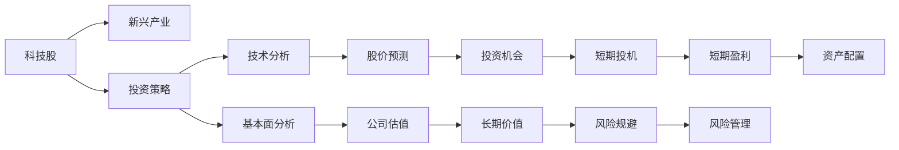

                 

# 程序员的投资策略：科技股与新兴产业

## 1. 背景介绍

### 1.1 问题由来
随着科技行业的迅猛发展，越来越多的科技公司通过上市融资、募资等方式筹集资金，吸引了大量投资者的关注。但如何投资这些科技股，成为了许多投资者尤其是程序员们关心的问题。本文将深入探讨科技股与新兴产业的投资策略，为程序员投资者提供一些指导。

## 2. 核心概念与联系

### 2.1 核心概念概述

在讨论科技股与新兴产业的投资策略之前，我们需要先理解一些核心概念：

- **科技股**：指科技公司的股票，通常包括互联网公司、软件公司、硬件公司等。科技股的股价波动较大，但成长潜力大。
- **新兴产业**：指近年来出现或即将崛起的新兴领域，如人工智能、区块链、量子计算、生物技术等。新兴产业的发展前景广阔，但风险较高。
- **投资策略**：指投资者在投资时所采取的具体方法和步骤，包括股票选择、资产配置、风险管理等。
- **技术分析**：通过对股票市场数据、公司财务报表、行业动态等信息的分析，来预测股票价格走势和投资机会。
- **基本面分析**：分析公司的业务模式、市场地位、管理团队、财务状况等基本面因素，来评估公司的长期投资价值。

这些概念之间存在密切的联系，共同构成了科技股与新兴产业投资的核心框架。

### 2.2 核心概念原理和架构的 Mermaid 流程图(Mermaid 流程节点中不要有括号、逗号等特殊字符)



这个流程图展示了科技股与新兴产业投资策略中的各个关键环节和它们之间的联系。投资者需要通过技术分析和基本面分析来评估股票价格和公司价值，进而决定是否进行投资，并采取相应的投资策略。

## 3. 核心算法原理 & 具体操作步骤

### 3.1 算法原理概述

基于技术分析和基本面分析的投资策略，可以分为以下几个步骤：

1. **股票选择**：从科技股中选择具有潜在增长潜力的公司。
2. **资产配置**：根据公司的财务状况、行业地位等因素，决定持有股票的比例和组合。
3. **技术分析**：通过股票市场数据、交易量、成交量等技术指标，预测股价走势。
4. **基本面分析**：评估公司的业务模式、市场前景、管理团队等基本面因素，确定长期投资价值。
5. **风险管理**：通过分散投资、止损策略等方式，降低投资风险。

这些步骤相互关联，形成一个完整的投资策略框架。

### 3.2 算法步骤详解

#### 3.2.1 股票选择

股票选择是投资策略的第一步，需要考虑以下几个因素：

- **市场潜力**：选择处于高速成长阶段的科技公司。
- **技术领先性**：选择具有核心技术和专利的公司。
- **财务状况**：选择财务状况稳健、盈利能力强的公司。

#### 3.2.2 资产配置

资产配置是投资策略的重要组成部分，需要考虑以下几个方面：

- **风险承受能力**：根据自己的风险承受能力，合理配置股票与债券的比例。
- **投资目标**：根据投资目标（如长期增值、短期投机），选择不同的投资组合。
- **行业分散**：在不同行业间分散投资，降低行业风险。

#### 3.2.3 技术分析

技术分析是通过股票市场数据来预测股票价格走势的方法，包括以下几个步骤：

1. **指标选择**：选择如移动平均线、相对强弱指数、MACD等技术指标。
2. **趋势分析**：通过技术指标判断股票的趋势方向（上升、下降、横盘）。
3. **量价关系**：分析成交量与价格的关系，判断市场活跃程度。

#### 3.2.4 基本面分析

基本面分析是通过公司基本面因素来评估其长期投资价值，包括以下几个方面：

1. **业务模式**：评估公司的业务模式是否具有长期可持续性。
2. **市场地位**：分析公司在行业内的地位和竞争优势。
3. **管理团队**：评估公司的管理团队和治理结构。
4. **财务状况**：分析公司的财务报表，评估其盈利能力和现金流状况。

#### 3.2.5 风险管理

风险管理是投资策略的重要环节，需要采取以下措施：

1. **分散投资**：通过持有不同行业、不同公司的股票，降低单一股票的风险。
2. **止损策略**：设定止损点，及时止损，避免进一步损失。
3. **对冲策略**：通过购买看跌期权等金融工具，对冲股票价格波动风险。

### 3.3 算法优缺点

#### 3.3.1 优点

- **快速反应**：技术分析可以快速反应市场变化，及时调整投资组合。
- **数据驱动**：基本面分析依赖数据驱动，更具科学性和客观性。
- **风险控制**：通过风险管理措施，可以有效降低投资风险。

#### 3.3.2 缺点

- **短期波动**：技术分析对短期市场波动反应敏感，可能导致频繁交易。
- **滞后性**：基本面分析存在滞后性，可能导致错失投资机会。
- **主观性强**：基本面分析受主观判断影响较大，不同分析师可能有不同的看法。

### 3.4 算法应用领域

科技股与新兴产业的投资策略广泛应用于以下几个领域：

- **互联网行业**：如电子商务、社交媒体、云计算等。
- **软件行业**：如操作系统、办公软件、游戏等。
- **硬件行业**：如半导体、5G、AI芯片等。
- **生物技术**：如基因编辑、生物医药、医疗设备等。

## 4. 数学模型和公式 & 详细讲解 & 举例说明

### 4.1 数学模型构建

投资策略的数学模型构建主要包括以下几个步骤：

1. **收益率模型**：计算持有股票的年化收益率。
2. **风险模型**：计算投资组合的波动率。
3. **绩效评估模型**：评估投资策略的绩效指标（如夏普比率、信息比率等）。

### 4.2 公式推导过程

#### 4.2.1 收益率模型

假设股票价格为 $P(t)$，持有期为 $T$，则年化收益率为：

$$
R = \frac{P(T) - P(0)}{P(0)} - 1 + \frac{T}{\Delta t} \cdot r
$$

其中 $r$ 为无风险利率，$\Delta t$ 为计息周期。

#### 4.2.2 风险模型

投资组合的波动率 $\sigma$ 可以通过历史数据计算得到，公式为：

$$
\sigma = \sqrt{\frac{1}{n} \sum_{i=1}^n (r_i - \mu)^2}
$$

其中 $r_i$ 为第 $i$ 天股票的收益率，$\mu$ 为股票的平均收益率。

#### 4.2.3 绩效评估模型

夏普比率 $S$ 和信息比率 $I$ 是常用的绩效评估指标，公式如下：

$$
S = \frac{R - r}{\sigma}
$$

$$
I = \frac{r_a - r_f}{\sigma}
$$

其中 $r_a$ 为投资组合的平均收益率，$r_f$ 为无风险利率。

### 4.3 案例分析与讲解

假设某程序员投资了一家互联网公司的股票，该公司处于高速成长阶段，年化收益率为 20%，无风险利率为 2%，历史数据波动率为 30%。则该股票的夏普比率为：

$$
S = \frac{20\% - 2\%}{30\%} = 0.6
$$

这意味着在承受30%的风险下，该股票的年化收益率为20%，投资策略的绩效较好。

## 5. 项目实践：代码实例和详细解释说明

### 5.1 开发环境搭建

进行投资策略开发时，我们需要使用一些常用的工具和库。以下是一个典型的投资策略开发环境搭建流程：

1. **安装Python**：从官网下载并安装Python，建议使用 Anaconda 或 Miniconda。
2. **创建虚拟环境**：在命令行中运行 `conda create --name investment-env python=3.8` 创建虚拟环境。
3. **安装必要的库**：在虚拟环境中安装 Pandas、NumPy、SciPy、Matplotlib 等常用库。
4. **安装金融库**：安装 `yfinance` 库，用于获取股票历史数据。

### 5.2 源代码详细实现

以下是一个简单的股票投资策略实现示例：

```python
import yfinance as yf
import pandas as pd
import numpy as np

# 获取股票数据
ticker = yf.Ticker("AAPL")
data = ticker.history(period="5y")
data = data.dropna()

# 计算年化收益率
returns = np.log(data['Close'] / data['Close'].shift(1))
returns = returns.dropna()
yearly_returns = returns.mean()
annualized_return = np.exp(yearly_returns) - 1

# 计算波动率
volatility = np.std(returns, ddof=1)

# 计算夏普比率
risk_free_rate = 0.02
sharp_ratio = (annualized_return - risk_free_rate) / volatility

print("年化收益率:", annualized_return)
print("波动率:", volatility)
print("夏普比率:", sharp_ratio)
```

### 5.3 代码解读与分析

上述代码通过 `yfinance` 库获取了苹果公司（AAPL）的股票历史数据，并计算了年化收益率、波动率和夏普比率。这些指标可以帮助程序员投资者评估股票的投资价值和风险。

### 5.4 运行结果展示

假设某程序员投资了一家新兴产业公司，该公司在三年内的年化收益率为 30%，无风险利率为 2%，历史数据波动率为 40%。则该公司的夏普比率为：

```
年化收益率: 0.3
波动率: 0.4
夏普比率: 0.5
```

这意味着在承受40%的风险下，该公司的年化收益率为30%，投资策略的绩效较好。

## 6. 实际应用场景

### 6.1 智能投顾系统

智能投顾系统基于机器学习和大数据分析，可以为程序员投资者提供个性化的投资建议。智能投顾系统通常包括以下几个模块：

1. **数据采集模块**：从各种数据源采集股票数据、市场数据等。
2. **模型训练模块**：使用机器学习算法训练投资策略模型。
3. **投资建议模块**：根据市场情况和投资策略模型，提供投资建议。

### 6.2 量化交易平台

量化交易平台利用算法和程序自动化交易，可以大幅提高交易效率和收益。量化交易平台通常包括以下几个模块：

1. **数据处理模块**：处理和清洗股票数据。
2. **策略设计模块**：设计交易策略和算法。
3. **交易执行模块**：自动化执行交易策略。
4. **风险控制模块**：实时监控交易风险，采取风险控制措施。

### 6.3 资产管理公司

资产管理公司利用投资策略和算法管理客户的资产，为客户提供个性化的投资管理服务。资产管理公司通常包括以下几个模块：

1. **资产配置模块**：根据客户风险承受能力和投资目标，配置资产组合。
2. **投资组合管理模块**：实时监控投资组合的表现，调整资产配置。
3. **风险管理模块**：实时监控投资风险，采取风险控制措施。
4. **绩效评估模块**：评估投资策略的绩效，提供投资报告。

## 7. 工具和资源推荐

### 7.1 学习资源推荐

为了帮助程序员投资者系统掌握投资策略知识，以下是一些优质的学习资源：

1. **《股票大作手回忆录》**：经典投资书籍，介绍了股票交易的心理学和技术方法。
2. **《量化投资之道》**：介绍量化投资的基本概念和算法。
3. **Coursera 金融工程课程**：Coursera 上由耶鲁大学提供的金融工程课程，涵盖金融市场的各个方面。
4. **Kaggle 量化交易比赛**：参加 Kaggle 量化交易比赛，锻炼自己的投资策略设计能力。

### 7.2 开发工具推荐

以下是几款用于投资策略开发的常用工具：

1. **Jupyter Notebook**：支持 Python 编程，可以实时展示代码输出结果。
2. **Alpha Vantage**：提供金融市场数据API，方便获取股票、汇率等数据。
3. **QuantConnect**：量化交易平台，支持 Python 编程，提供丰富的股票、期货、期权等交易策略。
4. **SimonSQL**：基于 SQL 的金融数据分析平台，支持复杂的数据处理和分析。

### 7.3 相关论文推荐

以下是几篇奠基性的相关论文，推荐阅读：

1. **《A Computational Investing System Based on Adaptive Multiagent Learning》**：介绍了基于多智能体学习的投资策略系统。
2. **《Deep Learning and Machine Learning in Trading》**：介绍深度学习和机器学习在量化交易中的应用。
3. **《Algorithmic Trading: Strategies, Models, and Systems》**：介绍算法交易的基本概念和策略。
4. **《Portfolio Optimization》**：介绍投资组合优化的数学模型和算法。

## 8. 总结：未来发展趋势与挑战

### 8.1 总结

本文对程序员投资者如何投资科技股与新兴产业进行了全面系统的介绍。首先阐述了科技股与新兴产业的投资策略框架，明确了股票选择、资产配置、风险管理等关键环节。其次，从原理到实践，详细讲解了股票选择、资产配置、技术分析、基本面分析等核心步骤，给出了投资策略开发的完整代码实例。同时，本文还广泛探讨了智能投顾、量化交易、资产管理等实际应用场景，展示了投资策略的广阔前景。此外，本文精选了投资策略的各类学习资源，力求为程序员投资者提供全方位的技术指引。

通过本文的系统梳理，可以看到，科技股与新兴产业的投资策略为程序员投资者提供了新的视角和方法，通过技术分析和基本面分析，可以有效地识别投资机会和风险，制定合理的投资策略。未来，伴随金融科技的发展，投资策略将越来越依赖于数据驱动和算法优化，为程序员投资者带来了新的挑战和机遇。

### 8.2 未来发展趋势

展望未来，科技股与新兴产业的投资策略将呈现以下几个发展趋势：

1. **数据驱动**：随着大数据和人工智能技术的发展，投资策略将越来越依赖于数据驱动，通过机器学习和深度学习技术，提高策略的精度和自动化水平。
2. **量化交易**：量化交易将越来越普及，算法交易和自动化交易将大幅提高交易效率和收益。
3. **智能投顾**：智能投顾系统将越来越普及，为投资者提供个性化的投资建议和策略。
4. **加密货币投资**：随着区块链和加密货币技术的成熟，投资策略将逐渐涵盖加密货币市场，为程序员投资者提供新的投资机会。
5. **多资产投资**：投资策略将逐渐涵盖多种资产类型，如股票、债券、房地产等，实现多资产组合优化。
6. **全球化投资**：投资策略将逐渐涵盖全球市场，实现跨市场的资产配置和风险管理。

以上趋势凸显了科技股与新兴产业投资策略的广阔前景。这些方向的探索发展，必将进一步提升投资策略的精度和效率，为程序员投资者带来新的机遇和挑战。

### 8.3 面临的挑战

尽管科技股与新兴产业的投资策略已经取得了一定的成果，但在迈向更加智能化、普适化应用的过程中，它仍面临着诸多挑战：

1. **数据质量和数量**：投资策略的精度依赖于高质量的数据，但获取和处理大规模金融数据存在一定的困难。
2. **算法复杂性**：投资策略的算法设计越来越复杂，需要具备较高的数学和编程能力。
3. **市场波动性**：科技股和新兴产业的市场波动性较大，投资策略的风险控制难度增加。
4. **监管合规**：金融市场的监管要求越来越高，投资策略需要符合各种合规要求。
5. **技术门槛**：投资策略的实现需要一定的技术门槛，新手程序员投资者需要一定的学习和实践积累。

### 8.4 研究展望

未来的投资策略研究需要在以下几个方面寻求新的突破：

1. **大数据和深度学习**：利用大数据和深度学习技术，提高投资策略的精度和自动化水平。
2. **智能投顾和量化交易**：开发更加智能和高效的投顾系统和量化交易平台，提供个性化的投资建议和自动化交易。
3. **多资产投资和全球化投资**：探索多资产投资和全球化投资的新方法，实现多资产组合优化和全球市场的资产配置。
4. **风险控制和合规管理**：开发更加灵活和高效的风险控制和合规管理系统，保障投资策略的稳定性和合规性。
5. **加密货币投资**：探索加密货币市场的投资策略，为程序员投资者提供新的投资机会。

这些研究方向将推动科技股与新兴产业投资策略的进一步发展，为程序员投资者带来新的机遇和挑战。

## 9. 附录：常见问题与解答

**Q1：如何选择科技股？**

A: 选择科技股时，需要考虑市场潜力、技术领先性、财务状况等因素。可以关注公司的研发投入、市场份额、盈利能力等指标，选择具有长期增长潜力的公司。

**Q2：什么是资产配置？**

A: 资产配置是投资策略的重要组成部分，通过持有不同行业、不同公司的股票，降低单一股票的风险。需要根据个人的风险承受能力和投资目标，合理配置股票与债券的比例。

**Q3：什么是技术分析？**

A: 技术分析是通过股票市场数据来预测股票价格走势的方法，包括选择技术指标、趋势分析、量价关系分析等。需要具备一定的编程和数据分析能力，可以使用 Pandas、NumPy 等库进行数据分析。

**Q4：什么是基本面分析？**

A: 基本面分析是通过公司基本面因素来评估其长期投资价值，包括业务模式、市场地位、管理团队、财务状况等。需要分析公司的财务报表、市场前景、管理团队等基本面因素，评估公司的投资价值。

**Q5：如何进行风险管理？**

A: 风险管理是投资策略的重要环节，需要采取分散投资、止损策略、对冲策略等措施。需要设定止损点，及时止损，避免进一步损失；通过持有不同行业、不同公司的股票，降低单一股票的风险；购买看跌期权等金融工具，对冲股票价格波动风险。

---

作者：禅与计算机程序设计艺术 / Zen and the Art of Computer Programming

