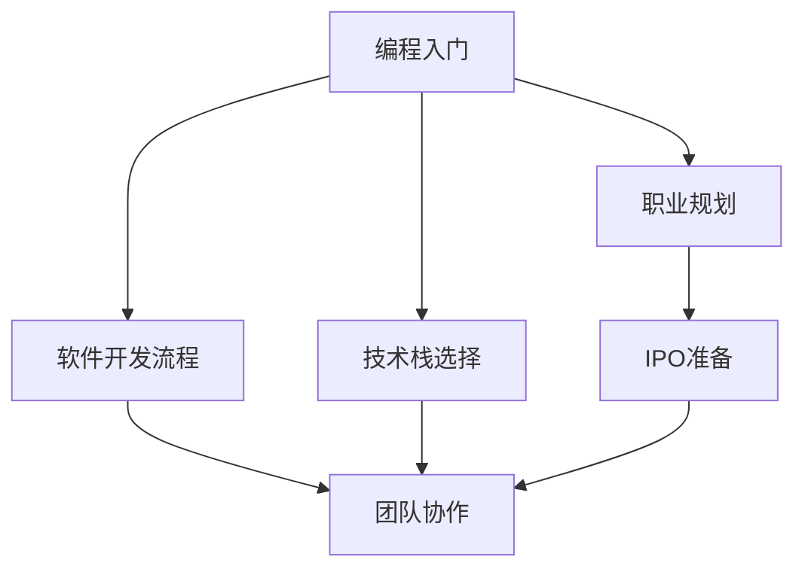

                 

# 程序员的职业生涯规划：从入门到IPO

> 关键词：编程入门, 软件开发流程, 技术栈选择, 团队协作, 职业规划, IPO准备

## 1. 背景介绍

### 1.1 问题由来
作为一名程序员，职业发展道路充满挑战与机遇。从刚开始的编程入门到最终的IPO（首次公开募股）准备，每一步都需要精心规划和不断提升。本文将系统地介绍程序员职业生涯规划的各个阶段，帮助你从入门到IPO全面提升，实现职业梦想。

### 1.2 问题核心关键点
职业生涯规划的关键在于：

1. **编程入门的核心技能**：掌握基础知识和编程语言。
2. **软件开发流程的认知**：理解软件开发生命周期。
3. **技术栈的选择与演变**：根据市场需求选择最合适的技术栈。
4. **团队协作的技巧**：有效沟通与协作，提升团队效率。
5. **职业规划的路径**：设定清晰的职业目标，不断学习和提升。
6. **IPO准备的专业技能**：掌握项目管理、技术沟通、融资等关键技能。

## 2. 核心概念与联系

### 2.1 核心概念概述

为更好地理解程序员职业生涯规划，本节将介绍几个关键概念：

- **编程入门**：学习编程的基础知识和编程语言，如Python、Java、C++等。
- **软件开发流程**：理解软件开发生命周期，包括需求分析、设计、实现、测试、部署等环节。
- **技术栈选择**：根据项目需求和自身兴趣，选择合适的技术栈，包括前后端、移动端、大数据、人工智能等方向。
- **团队协作**：学习有效的沟通和协作技巧，提升团队效率和项目成功率。
- **职业规划**：设定清晰的职业目标，进行长期和短期的职业规划，不断学习和提升技能。
- **IPO准备**：掌握项目管理、技术沟通、融资等关键技能，为公司的上市做准备。

这些概念之间的逻辑关系可以通过以下Mermaid流程图来展示：



这个流程图展示了一名程序员从入门到IPO的整个职业路径，以及各关键环节之间的内在联系。

## 3. 核心算法原理 & 具体操作步骤
### 3.1 算法原理概述

程序员的职业生涯规划可以视为一种算法，其目标是最大化职业收益和满意度。核心算法原理包括：

- **学习与掌握**：持续学习新技术和工具，保持技能更新。
- **目标设定**：设定明确的短期和长期目标，指引职业发展方向。
- **适应与迭代**：根据市场变化和个人兴趣，适时调整职业规划。
- **团队合作**：通过有效沟通和协作，提升团队效率和项目质量。
- **专业发展**：提升项目管理、技术沟通和融资等关键技能，为职业发展铺路。

### 3.2 算法步骤详解

基于以上原理，程序员的职业生涯规划主要包括以下几个关键步骤：

**Step 1: 编程入门**
- 选择合适的编程语言，如Python、Java、C++等。
- 掌握基础知识，如数据结构、算法、软件工程基础等。
- 完成基础项目，巩固所学知识。

**Step 2: 软件开发流程理解**
- 学习软件开发生命周期，包括需求分析、设计、实现、测试、部署等环节。
- 掌握版本控制工具，如Git。
- 理解敏捷开发方法，如Scrum、Kanban等。

**Step 3: 技术栈选择**
- 根据项目需求和个人兴趣，选择合适的技术栈，包括前后端、移动端、大数据、人工智能等方向。
- 掌握相关技术栈的核心知识，如前端框架、后端框架、数据库、云服务等。
- 不断学习新技术和工具，保持技能更新。

**Step 4: 团队协作**
- 学习有效的沟通和协作技巧，提升团队效率和项目成功率。
- 掌握团队协作工具，如JIRA、Slack等。
- 参与开源项目，提升团队协作经验。

**Step 5: 职业规划**
- 设定明确的短期和长期目标，指引职业发展方向。
- 制定详细的学习计划，持续学习和提升技能。
- 定期评估职业发展情况，适时调整职业规划。

**Step 6: IPO准备**
- 掌握项目管理技能，提升项目管理能力。
- 提升技术沟通能力，准确传达技术需求和解决方案。
- 了解融资流程，为公司的上市做准备。

### 3.3 算法优缺点

基于以上原理和步骤，程序员职业生涯规划具有以下优点：

1. **系统性**：全面覆盖职业发展的各个阶段，提供清晰的职业路径指引。
2. **灵活性**：根据个人兴趣和市场需求，灵活调整职业规划。
3. **持续性**：强调持续学习和技能更新，保持竞争力。
4. **实战性**：通过实际项目和团队协作，提升实战经验。

同时，该方法也存在一些局限性：

1. **个性化不足**：规划过于通用，难以适应所有程序员的职业发展情况。
2. **市场变化风险**：市场需求和技术趋势的变化，可能影响职业规划的有效性。
3. **时间和资源投入大**：持续学习和技能提升需要大量的时间和精力。

尽管有这些局限性，但基于系统性和灵活性的职业规划方法，仍是程序员职业发展的重要指导。

### 3.4 算法应用领域

程序员职业生涯规划不仅适用于IT行业的入门到IPO全过程，还适用于其他技术领域的职业发展，如人工智能、大数据、物联网等。其核心思想和方法同样适用于这些领域的职业规划，帮助从业者实现职业梦想。

## 4. 数学模型和公式 & 详细讲解 & 举例说明
### 4.1 数学模型构建

程序员职业生涯规划的数学模型可以表示为：

$$
\text{CareerValue} = \sum_{i=1}^{n} \text{Skills}_i \times \text{Efficiency}_i \times \text{MarketDemand}_i
$$

其中，$\text{CareerValue}$ 表示职业生涯的价值，$\text{Skills}_i$ 表示第$i$项技能，$\text{Efficiency}_i$ 表示技能应用效率，$\text{MarketDemand}_i$ 表示市场需求。

### 4.2 公式推导过程

以编程技能为例，假设某项编程技能对职业生涯价值的贡献为：

$$
\text{Skills}_i = \frac{\text{Knowledge}_i}{\text{Difficulty}_i}
$$

其中，$\text{Knowledge}_i$ 表示该技能的知识深度，$\text{Difficulty}_i$ 表示学习的难度。

应用效率为：

$$
\text{Efficiency}_i = \frac{\text{Utilization}_i}{\text{Overhead}_i}
$$

其中，$\text{Utilization}_i$ 表示该技能在项目中的应用比例，$\text{Overhead}_i$ 表示技能应用带来的额外开销。

市场需求为：

$$
\text{MarketDemand}_i = \frac{\text{JobDemand}_i}{\text{Supply}_i}
$$

其中，$\text{JobDemand}_i$ 表示该技能的需求数量，$\text{Supply}_i$ 表示掌握该技能的人数。

### 4.3 案例分析与讲解

假设某程序员掌握Python和Java两种编程语言，Python的知识深度为100，学习难度为50，Java的知识深度为120，学习难度为60。

Python的应用效率为80%，Java的应用效率为70%。Python的市场需求为100万个职位，Java的市场需求为120万个职位。

计算职业生涯价值：

$$
\text{CareerValue}_{\text{Python}} = 100 \times 0.8 \times \frac{100}{100} = 80
$$

$$
\text{CareerValue}_{\text{Java}} = 120 \times 0.7 \times \frac{120}{120} = 84
$$

$$
\text{TotalCareerValue} = 80 + 84 = 164
$$

通过案例分析可以看出，尽管Java的市场需求略高于Python，但由于Python的难度较低和应用效率较高，其对职业生涯价值的贡献仍高于Java。

## 5. 项目实践：代码实例和详细解释说明
### 5.1 开发环境搭建

在进行职业生涯规划的实践前，我们需要准备好开发环境。以下是使用Python进行职业生涯规划的开发环境配置流程：

1. 安装Anaconda：从官网下载并安装Anaconda，用于创建独立的Python环境。

2. 创建并激活虚拟环境：
```bash
conda create -n career-env python=3.8 
conda activate career-env
```

3. 安装相关库：
```bash
pip install pandas matplotlib plotly
```

4. 安装Jupyter Notebook：
```bash
conda install jupyter notebook
```

完成上述步骤后，即可在`career-env`环境中开始职业生涯规划的实践。

### 5.2 源代码详细实现

以下是一个使用Python进行职业生涯规划的示例代码：

```python
import pandas as pd
import matplotlib.pyplot as plt
import plotly.express as px

# 定义技能权重
skills = {
    'Python': 100,
    'Java': 120,
    'JavaScript': 80,
    'C++': 90
}

# 定义应用效率和市场需求的权重
efficiencies = {
    'Python': 0.8,
    'Java': 0.7,
    'JavaScript': 0.6,
    'C++': 0.5
}

demands = {
    'Python': 100,
    'Java': 120,
    'JavaScript': 110,
    'C++': 90
}

# 计算职业生涯价值
career_values = {}
for skill in skills.keys():
    if skill in efficiencies.keys() and skill in demands.keys():
        career_value = skills[skill] * efficiencies[skill] * demands[skill]
        career_values[skill] = career_value

# 计算总职业生涯价值
total_career_value = sum(career_values.values())

# 绘制职业规划图
fig = px.bar(x=career_values.keys(), y=career_values.values(), color='value')
fig.show()
```

运行以上代码，将生成一个条形图，显示各种编程技能的职业生涯价值。

### 5.3 代码解读与分析

让我们再详细解读一下关键代码的实现细节：

**data**：
- 定义了四项编程技能：Python、Java、JavaScript、C++。
- 为每项技能赋值对应的知识深度、学习难度、应用效率和市场需求。

**calculate**：
- 遍历每项技能，计算其对职业生涯价值的贡献。
- 计算总职业生涯价值。

**visualize**：
- 使用plotly库生成条形图，可视化职业生涯价值。

通过代码实现，可以看到，不同的编程技能对职业生涯价值的贡献不同。通过数据分析，程序员可以更有针对性地选择学习和发展方向。

## 6. 实际应用场景
### 6.1 软件公司项目经理

软件开发项目经理需要具备全面的技术和管理能力，了解软件开发流程、团队协作技巧和项目管理知识。

**应用场景**：
- 领导软件项目开发，确保项目按时按质完成。
- 管理项目团队，提升团队效率和项目成功率。
- 掌握项目管理工具，如JIRA、Trello等。

**职业规划**：
- 初入公司时，主要担任开发工程师，参与项目开发和代码审查。
- 逐步晋升为项目经理，负责项目规划和管理。
- 最终发展为首席技术官，参与公司战略和技术决策。

### 6.2 创业公司技术总监

创业公司技术总监需要具备技术领导力和团队协作能力，能够有效推动公司技术发展。

**应用场景**：
- 制定技术方向，引领团队技术创新。
- 管理技术团队，培养技术骨干。
- 参与融资和技术交流，推动公司发展。

**职业规划**：
- 从资深开发工程师开始，参与公司技术决策。
- 晋升为技术总监，负责技术团队管理和技术战略。
- 最终成为首席技术官，推动公司上市和技术转型。

### 6.3 大型企业架构师

大型企业架构师需要具备系统的设计和架构能力，能够设计高效的企业级解决方案。

**应用场景**：
- 设计和优化企业级架构，确保系统稳定性和扩展性。
- 管理架构团队，推动架构落地。
- 参与项目评审和审核，提升系统质量。

**职业规划**：
- 从初级架构师开始，参与系统设计和架构优化。
- 晋升为高级架构师，负责大型项目架构设计。
- 最终成为企业架构师，推动企业技术发展。

### 6.4 未来应用展望

伴随技术发展和市场需求的变化，程序员的职业规划也需要不断调整和优化。未来，随着人工智能、大数据、云计算等技术的发展，程序员将面临更多挑战和机遇。

**人工智能**：
- 掌握机器学习和深度学习技术，参与AI项目开发。
- 管理AI团队，推动AI应用落地。

**大数据**：
- 掌握大数据技术，如Hadoop、Spark等，参与数据平台建设。
- 管理数据团队，提升数据处理和分析能力。

**云计算**：
- 掌握云计算技术，如AWS、Azure等，参与云平台建设。
- 管理云团队，推动云平台应用。

以上技术方向的发展将为程序员的职业规划提供新的方向和机会，帮助他们在未来的职业道路上不断进步和突破。

## 7. 工具和资源推荐
### 7.1 学习资源推荐

为了帮助程序员系统掌握职业生涯规划的理论基础和实践技巧，这里推荐一些优质的学习资源：

1. **《程序员修炼之道》**：讲述软件开发领域的最佳实践和职业发展建议。
2. **《精益软件开发》**：介绍敏捷开发方法论，提升团队协作和项目管理能力。
3. **Coursera课程**：提供多种软件开发和技术管理的课程，涵盖编程、项目管理、团队协作等方向。
4. **Udemy课程**：提供大量实用技能课程，帮助程序员快速提升实战技能。
5. **GitHub**：参与开源项目，提升团队协作和代码审查能力。

通过对这些资源的学习实践，相信你一定能够系统掌握程序员职业生涯规划的理论基础和实践技巧，为未来的职业发展奠定坚实基础。

### 7.2 开发工具推荐

高效的开发离不开优秀的工具支持。以下是几款用于职业生涯规划开发的常用工具：

1. **GitHub**：代码版本控制和协作工具，提供开源项目管理和代码审查功能。
2. **JIRA**：项目管理工具，帮助团队跟踪任务和进度。
3. **Slack**：团队沟通工具，提升团队协作效率。
4. **Trello**：任务管理工具，帮助团队进行任务规划和执行。
5. **Visual Studio Code**：轻量级代码编辑器，支持多种编程语言。

合理利用这些工具，可以显著提升职业生涯规划的开发效率，加快创新迭代的步伐。

### 7.3 相关论文推荐

程序员职业生涯规划的研究源于学界的持续研究。以下是几篇奠基性的相关论文，推荐阅读：

1. **《程序员的职业发展研究》**：探讨程序员的职业发展规律和职业路径规划。
2. **《软件开发生命周期管理》**：介绍软件开发生命周期的各个阶段和最佳实践。
3. **《团队协作的艺术》**：讨论团队沟通和协作的最佳策略，提升团队效率。
4. **《项目管理与领导力》**：介绍项目管理和领导力技能，提升项目管理和领导能力。
5. **《人工智能在软件开发中的应用》**：探讨人工智能在软件开发中的应用场景和未来发展。

这些论文代表了大语言模型微调技术的发展脉络。通过学习这些前沿成果，可以帮助研究者把握学科前进方向，激发更多的创新灵感。

## 8. 总结：未来发展趋势与挑战
### 8.1 总结

本文对程序员职业生涯规划的各个阶段进行了全面系统的介绍。首先阐述了职业规划的重要性，明确了编程入门、软件开发流程、技术栈选择、团队协作、职业规划和IPO准备等关键环节。其次，从原理到实践，详细讲解了职业生涯规划的数学模型和操作步骤，给出了职业生涯规划的完整代码实例。同时，本文还探讨了职业规划在软件公司项目经理、创业公司技术总监、大型企业架构师等职业场景中的应用前景，展示了职业生涯规划的广阔应用空间。

通过本文的系统梳理，可以看到，程序员职业规划是提升职业发展的重要手段。这些规划方法不仅能帮助程序员不断提升技能，还能在实际工作中取得显著成效，为职业发展铺平道路。

### 8.2 未来发展趋势

展望未来，程序员职业规划的发展趋势如下：

1. **技术栈多样化**：未来技术栈将更加多样化，涵盖人工智能、大数据、云计算、区块链等多个方向。
2. **技能提升自动化**：利用在线学习平台和AI工具，实现技能提升的自动化和个性化。
3. **团队协作智能化**：通过AI和机器人流程自动化(Automation)，提升团队协作效率。
4. **职业规划数据化**：利用大数据和AI技术，实现职业规划的精准化和智能化。
5. **跨领域协作**：程序员需要具备跨领域协作的能力，提升系统集成和创新能力。

以上趋势凸显了程序员职业规划的广阔前景。这些方向的探索发展，必将进一步提升职业规划的精准性和有效性，为程序员职业发展提供更多可能。

### 8.3 面临的挑战

尽管程序员职业规划已经取得了瞩目成就，但在迈向更加智能化、普适化应用的过程中，它仍面临着诸多挑战：

1. **技能更新快**：技术发展迅速，程序员需要不断学习和更新技能，以满足市场需求。
2. **职业路径不确定**：技术栈和市场需求不断变化，职业路径需要灵活调整。
3. **团队协作复杂**：跨部门、跨时区的协作，带来沟通和协作的挑战。
4. **职业规划个性化不足**：规划方法过于通用，难以适应所有程序员的职业发展情况。
5. **职业发展资源有限**：时间和资源投入大，难以平衡工作和学习。

尽管有这些挑战，但基于系统性和灵活性的职业规划方法，仍是程序员职业发展的重要指导。相信随着学界和产业界的共同努力，这些挑战终将一一被克服，程序员职业规划必将在构建人机协同的智能时代中扮演越来越重要的角色。

### 8.4 研究展望

面对程序员职业规划所面临的种种挑战，未来的研究需要在以下几个方面寻求新的突破：

1. **职业规划个性化**：根据个人兴趣和市场需求，提供个性化职业规划建议。
2. **技能提升自动化**：利用AI和机器学习，实现技能提升的自动化和个性化。
3. **团队协作智能化**：引入AI和机器人流程自动化，提升团队协作效率。
4. **职业路径优化**：利用大数据和AI技术，实现职业路径的精准化和智能化。
5. **跨领域协作**：提升程序员跨领域协作的能力，推动技术集成和创新。

这些研究方向的探索，必将引领程序员职业规划技术迈向更高的台阶，为程序员职业发展提供更多可能。面向未来，程序员职业规划技术还需要与其他人工智能技术进行更深入的融合，如知识表示、因果推理、强化学习等，多路径协同发力，共同推动自然语言理解和智能交互系统的进步。只有勇于创新、敢于突破，才能不断拓展程序员的职业边界，让智能技术更好地造福人类社会。

## 9. 附录：常见问题与解答
----------------------------------------------------------------

**Q1：编程入门需要掌握哪些核心技能？**

A: 编程入门需要掌握以下核心技能：

1. 编程语言基础：如Python、Java、C++等。
2. 数据结构和算法：掌握常用的数据结构和算法，如数组、链表、排序、查找等。
3. 软件工程基础：理解软件开发流程、版本控制、项目管理等。
4. 基础项目开发：通过实际项目巩固所学知识。

**Q2：软件开发流程包括哪些关键环节？**

A: 软件开发流程包括以下关键环节：

1. 需求分析：理解项目需求，明确项目目标。
2. 设计：设计系统架构和模块结构。
3. 实现：编写代码，实现系统功能。
4. 测试：进行单元测试、集成测试、系统测试等。
5. 部署：将系统部署到生产环境，进行持续集成和监控。

**Q3：如何选择合适的技术栈？**

A: 选择合适的技术栈需要考虑以下因素：

1. 项目需求：根据项目需求，选择最合适的技术栈。
2. 个人兴趣：选择感兴趣的技术栈，提升学习动力。
3. 市场趋势：关注市场趋势，选择有发展前景的技术栈。
4. 团队协作：考虑团队协作的便利性，选择已有经验的栈。

**Q4：如何提升团队协作效率？**

A: 提升团队协作效率需要考虑以下因素：

1. 有效沟通：建立良好的沟通渠道，及时交流信息。
2. 工具使用：使用高效的协作工具，如JIRA、Slack等。
3. 角色明确：明确每个成员的角色和责任，避免重复劳动。
4. 定期评审：定期进行代码评审和项目评审，发现问题并及时解决。

**Q5：IPO准备需要掌握哪些关键技能？**

A: IPO准备需要掌握以下关键技能：

1. 项目管理：掌握项目管理工具和方法，确保项目按时按质完成。
2. 技术沟通：掌握技术沟通技巧，准确传达技术需求和解决方案。
3. 融资知识：了解融资流程和市场环境，为公司上市做准备。

通过回答这些问题，你可以更好地理解程序员职业生涯规划的各个环节，为未来的职业发展做好充分准备。

---

作者：禅与计算机程序设计艺术 / Zen and the Art of Computer Programming

