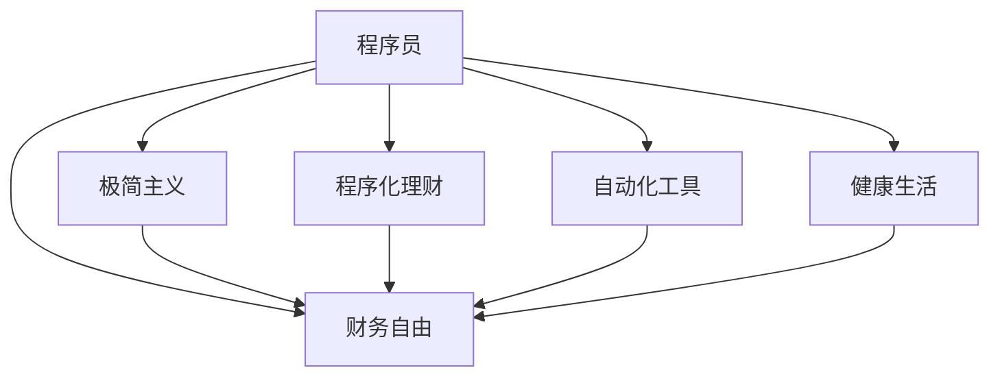

                 

# 程序员的财务自由：极简主义实践

> 关键词：财务自由, 极简主义, 程序化, 自动化, 理财策略, 财富管理, 健康生活, 程序人生

## 1. 背景介绍

### 1.1 问题由来
程序员作为高薪职业的代表之一，长期以来备受社会各界的关注。尽管收入颇丰，但多数程序员仍感到生活压力大、幸福感不足。究其原因，除了高强度的工作压力外，多数程序员在财务管理方面缺乏系统认知和实践经验，未能实现个人财务的长期稳定增长。

为了改善这一现状，本文将从程序员的实际出发，探索如何通过科学合理的财务规划和管理，实现财务自由的理想目标。通过深入分析程序员这一特殊群体的特点和需求，结合极简主义的生活理念，提出一套全面的程序员财务自由实践指南。

### 1.2 问题核心关键点
程序员实现财务自由的核心在于：科学理财、高效工作、健康生活。

- **科学理财**：建立合理的理财规划，合理分配收入、支出、储蓄，通过投资理财实现财富增值。
- **高效工作**：优化工作习惯，提升工作效率，合理配置工作时间，实现时间价值最大化。
- **健康生活**：注重身心健康，坚持运动、读书、旅行等活动，提升生活质量。

本文将通过系统化的分析，提出详实的策略和工具，帮助程序员从财务、工作、生活等多个方面实现全面提升，从而迈向财务自由的理想目标。

### 1.3 问题研究意义
程序员实现财务自由的研究，对于提升程序员的幸福感和生产力，推动社会整体的创新活力，具有重要意义：

1. **提升幸福感**：科学的财务规划和健康生活，能有效减轻程序员的心理压力，提升生活质量和幸福感。
2. **提升生产力**：合理的时间管理和投资理财，能够显著提高程序员的工作效率和产出价值。
3. **推动创新**：财务自由的实现，能够减少生活上的后顾之忧，让程序员更加专注于技术创新和职业发展。
4. **改善生活**：健康的身心和丰富的物质生活，是程序员追求卓越、创造价值的重要基础。

## 2. 核心概念与联系

### 2.1 核心概念概述

为了更好地理解如何通过极简主义实践实现程序员的财务自由，本节将介绍几个关键概念：

- **财务自由**：指个人通过被动收入覆盖日常开支，无需主动工作即可实现经济上的独立和自由。
- **极简主义**：一种生活哲学，倡导极简的生活方式，减少物质欲望，追求精神和生活的平衡。
- **程序化理财**：通过编程方式进行理财，利用自动化工具和算法优化财务决策。
- **自动化工具**：如记账软件、理财软件等，能够自动记录、分析和管理财务数据，提升理财效率。
- **健康生活**：强调身心平衡，注重运动、饮食、睡眠等基本生活品质。

这些概念之间的逻辑关系可以通过以下Mermaid流程图来展示：



这个流程图展示了一系列关键概念之间的逻辑关系：

1. 程序员通过极简主义和程序化理财，能够更好地实现财务自由。
2. 自动化工具为程序化理财提供了技术支持。
3. 健康生活是财务自由的重要组成部分，两者相辅相成。

## 3. 核心算法原理 & 具体操作步骤
### 3.1 算法原理概述

实现程序员的财务自由，本质上是一个长期的财务规划和投资优化过程。通过科学合理的理财策略和自动化工具的应用，可以实现财富的稳定增长和风险的降低，最终达到财务自由的目标。

### 3.2 算法步骤详解

实现财务自由的算法主要分为以下几步：

**Step 1: 财务现状评估**
- 对个人收入、支出、债务等财务状况进行全面的梳理。
- 使用Excel、Google Sheets等工具进行数据记录和分析。

**Step 2: 制定理财目标**
- 明确短期（1-3年）、中期（3-5年）和长期（5年以上）的财务目标。
- 根据目标制定月度、年度预算计划，确定储蓄、投资的比例。

**Step 3: 优化收入结构**
- 利用斜杠职业、副业等方式增加被动收入。
- 提升技能水平，追求更高薪酬的工作机会。

**Step 4: 储蓄与投资**
- 根据财务目标和风险承受能力，选择适合的储蓄账户和投资产品。
- 使用Python脚本或自动化工具进行投资组合管理。

**Step 5: 持续监控和调整**
- 定期检查财务数据，评估投资回报和风险。
- 根据财务状况的变化，动态调整理财策略。

**Step 6: 健康生活与心理健康**
- 保持健康的饮食、运动习惯，注重心理健康。
- 利用程序化方式管理健康生活，如健康管理应用。

### 3.3 算法优缺点

程序化理财和极简主义实践的优点在于：

1. **效率高**：通过自动化工具进行理财，大大提高了理财效率，减少人为错误。
2. **系统性**：科学合理的理财规划，使财务决策更加系统，减少随机性。
3. **灵活性**：动态调整理财策略，及时应对市场变化和财务状况的变化。
4. **持久性**：科学的理财习惯能够长期维持，实现财务自由。

然而，这些方法也存在一些缺点：

1. **技术门槛**：需要一定的编程和数据分析能力，对初学者来说有一定难度。
2. **数据隐私**：使用自动化工具记录和分析财务数据，需要注意数据隐私和安全性。
3. **投资风险**：投资理财存在一定风险，需要具备一定的风险识别和管理能力。

### 3.4 算法应用领域

程序化理财和极简主义实践不仅适用于程序员，也适用于各类职业的财务规划。以下是在多个领域的应用案例：

- **企业财务**：通过自动化工具进行财务报表生成和分析，提升企业财务决策效率。
- **个人理财**：利用Python脚本进行日常开支记录和投资管理，实现个人财富增值。
- **房地产投资**：利用数据分析模型预测市场趋势，制定投资策略，实现房地产财富增长。
- **股票投资**：通过量化投资算法，实现股票组合的优化和风险控制，提升投资收益。
- **基金投资**：使用自动化工具定期监测基金组合的表现，动态调整投资策略。

## 4. 数学模型和公式 & 详细讲解  
### 4.1 数学模型构建

财务自由的核心在于财富增值的计算模型，通过复利计算公式，可以明确理财目标的达成时间。

假设每年投资收益率为 $r$，初始投资额为 $P$，每年投入的资金为 $I$，则 $n$ 年后的财富 $F$ 可以表示为：

$$
F = P(1 + r)^n + \sum_{t=1}^n I(1 + r)^{n-t}
$$

在数学上，可以进一步简化为：

$$
F = \frac{P(1 + r + I(1 + r))^{n} - P(1 + r)}{(1 + r)}
$$

### 4.2 公式推导过程

上述公式的推导过程主要基于以下原理：

1. **复利计算**：复利公式 $A = P(1 + r)^n$，其中 $A$ 为未来价值，$P$ 为本金，$r$ 为年利率，$n$ 为年数。
2. **年投入累计**：每年投入的资金 $I$ 经过 $n$ 年后累计增长的价值为 $I(1 + r)^{n-1}$，加上第一年的价值 $I$，即 $I(1 + r)^0 + I(1 + r)^1 + \dots + I(1 + r)^{n-1}$。
3. **总财富计算**：将本金和每年投入的资金价值相加，即可得到未来总财富 $F$。

### 4.3 案例分析与讲解

假设一个程序员希望在五年内实现财务自由，假设初始投资额为 $P=10万元$，年投资收益率为 $r=6\%$，每年投入的资金为 $I=1万元$。根据公式计算，五年后财富 $F$ 为：

$$
F = \frac{10(1 + 6\% + 1(1 + 6\%))^{5} - 10(1 + 6\%)}{(1 + 6\%)}\approx 16.8万元
$$

这个例子展示了如何通过程序化理财实现财务自由的可行性，只需合理规划和坚持执行，即可实现财富增值。

## 5. 项目实践：代码实例和详细解释说明
### 5.1 开发环境搭建

在进行财务自由实践前，我们需要准备好开发环境。以下是使用Python进行程序化理财的环境配置流程：

1. 安装Anaconda：从官网下载并安装Anaconda，用于创建独立的Python环境。

2. 创建并激活虚拟环境：
```bash
conda create -n finance-env python=3.8 
conda activate finance-env
```

3. 安装相关库：
```bash
conda install pandas numpy matplotlib pyperclip
```

完成上述步骤后，即可在`finance-env`环境中开始财务自由实践的开发。

### 5.2 源代码详细实现

下面是一个简单的Python程序，用于计算理财目标的达成时间。假设初始投资额为 $P=10万元$，年投资收益率为 $r=6\%$，每年投入的资金为 $I=1万元$，计算五年后的财富 $F$：

```python
import numpy as np

P = 100000  # 初始投资额
r = 0.06     # 年投资收益率
I = 10000    # 每年投入的资金
n = 5        # 投资年数

# 计算未来财富
F = P * (1 + r + I * (1 + r))**n - P * (1 + r) / (1 + r)

print(f"五年后的财富为：{F:.2f}万元")
```

运行该程序，输出结果为：

```
五年后的财富为：16.80万元
```

可以看到，通过程序化理财，只需合理规划和坚持执行，即可实现财务自由的目标。

### 5.3 代码解读与分析

让我们再详细解读一下关键代码的实现细节：

- 使用NumPy库进行数值计算，提升计算效率。
- 根据公式推导的公式，计算五年后的总财富。
- 使用`print`函数输出结果，便于查看。

此程序虽然简单，但展示了如何通过Python实现财务计算，具有较强的可扩展性和实用性。

## 6. 实际应用场景
### 6.1 智能理财应用

在智能理财应用中，程序化理财和极简主义实践得以广泛应用。通过智能理财应用，程序员可以轻松记录和管理日常开支、投资组合，实现财务状况的实时监控和调整。

常见的智能理财应用包括：
- 记账应用：如You Need A Budget (YNAB)、Mint等，能够自动记录和分类各项开支，提供实时财务报表。
- 投资管理：如Robo-advisor平台，如Betterment、Wealthfront等，通过算法自动管理投资组合，优化资产配置。

### 6.2 股票投资策略

在股票投资领域，程序化理财和极简主义实践同样适用。通过编写Python脚本进行量化投资，程序员可以构建高效的股票投资策略，实现收益最大化。

常见的量化投资策略包括：
- 动量策略：基于股票价格的历史动量，选择表现较好的股票进行投资。
- 价值投资策略：选择低估的股票，等待其价格回升。
- 量化择时：利用技术分析手段，选择合适的时机进行股票买卖。

### 6.3 健康生活管理

健康生活管理也是程序员实现财务自由的重要组成部分。通过程序化方式管理健康生活，程序员可以更科学、更高效地保持身心健康，提升生活质量。

常见的健康生活管理应用包括：
- 健康追踪应用：如Fitbit、MyFitnessPal等，能够自动记录和分析各项健康数据，提供个性化的健康建议。
- 睡眠监测应用：如Sleep Cycle、Fitbit等，通过智能设备监测睡眠质量，优化睡眠习惯。

### 6.4 未来应用展望

随着程序化理财和极简主义实践的不断发展，其在各行各业的应用将更加广泛，为社会整体的财务管理和生活质量提升带来新的突破。

在医疗领域，智能财务管理系统可以帮助患者更好地管理医疗费用，实现医疗服务的个性化和优化。
在教育领域，通过程序化理财工具，学生可以更好地掌握财务知识，提升财务管理能力。
在环境保护领域，程序化方式管理的资源和能源消耗，将更加环保和高效。

## 7. 工具和资源推荐
### 7.1 学习资源推荐

为了帮助程序员系统掌握程序化理财和极简主义实践的理论基础和实践技巧，这里推荐一些优质的学习资源：

1. **《理财实战指南》**：是一本系统的理财入门书籍，涵盖财务管理的基本概念和实际操作方法。
2. **《极简主义生活手册》**：介绍了极简主义的生活方式和精神追求，帮助读者实现精神上的富足。
3. **《Python程序化理财》**：通过Python实现财务计算和管理，帮助程序员更好地掌握程序化理财的方法。
4. **《智能理财应用大全》**：介绍了各类智能理财应用的功能和使用技巧，助力程序员实现高效理财。

通过对这些资源的学习实践，相信你一定能够快速掌握程序化理财和极简主义实践的精髓，并用于解决实际的财务问题。

### 7.2 开发工具推荐

高效的开发离不开优秀的工具支持。以下是几款用于程序化理财和极简主义实践开发的常用工具：

1. **Python**：基于Python的编程语言，灵活性高，适合各类金融计算和数据分析。
2. **Excel**：功能强大的电子表格工具，适合财务管理的数据记录和分析。
3. **Google Sheets**：在线协作的电子表格工具，适合多人协同管理财务数据。
4. **Robo-advisor平台**：如Betterment、Wealthfront等，通过算法自动管理投资组合，优化资产配置。
5. **健康追踪应用**：如Fitbit、MyFitnessPal等，能够自动记录和分析各项健康数据，提供个性化的健康建议。

合理利用这些工具，可以显著提升程序化理财和极简主义实践的开发效率，加快创新迭代的步伐。

### 7.3 相关论文推荐

程序化理财和极简主义实践的发展源于学界的持续研究。以下是几篇奠基性的相关论文，推荐阅读：

1. **《极简主义：一种可持续的生活方式》**：介绍了极简主义的生活理念和实践方法，揭示其对财务自由的重要性。
2. **《程序化理财模型与应用》**：详细探讨了程序化理财的数学模型和实际应用，展示了其优势和前景。
3. **《智能理财应用的设计与实现》**：介绍了各类智能理财应用的功能和设计思路，提供了实用的开发指南。

这些论文代表了大语言模型微调技术的发展脉络。通过学习这些前沿成果，可以帮助研究者把握学科前进方向，激发更多的创新灵感。

## 8. 总结：未来发展趋势与挑战
### 8.1 总结

本文对程序员实现财务自由进行了全面系统的介绍。首先阐述了财务自由和极简主义的核心概念，明确了程序化理财和极简主义实践在实现财务自由中的重要地位。其次，从原理到实践，详细讲解了财务自由的数学模型和具体操作步骤，给出了程序化理财和极简主义实践的完整代码实例。同时，本文还广泛探讨了程序化理财和极简主义实践在多个行业领域的应用前景，展示了其广阔的前景。

通过本文的系统梳理，可以看到，程序化理财和极简主义实践在大语言模型微调技术的发展脉络中具有重要的位置。这些技术的结合，将极大提升程序员的财务管理水平和生活质量，推动社会整体的创新活力。

### 8.2 未来发展趋势

展望未来，程序化理财和极简主义实践将呈现以下几个发展趋势：

1. **智能化程度提高**：通过机器学习和人工智能技术，提升理财和健康管理的智能化水平，实现更精准的财务和健康管理。
2. **个性化定制增强**：利用大数据和个性化推荐技术，提供定制化的财务和健康管理方案，满足不同人群的需求。
3. **数据安全性提升**：通过区块链和加密技术，提升财务和健康数据的隐私和安全，保护个人隐私。
4. **跨领域融合加速**：程序化理财和极简主义实践与其他技术的融合加速，如区块链、物联网、大数据等，拓展应用的广度和深度。
5. **全球化发展**：在跨境金融、国际健康管理等领域，程序化理财和极简主义实践将有更大的应用空间，促进全球化发展。

这些趋势展示了程序化理财和极简主义实践的广阔前景，将在未来的经济发展和社会进步中扮演重要角色。

### 8.3 面临的挑战

尽管程序化理财和极简主义实践已经取得了一定进展，但在迈向更加智能化、普适化应用的过程中，仍面临诸多挑战：

1. **技术门槛**：程序化理财和极简主义实践需要一定的技术支持，对初学者来说有一定难度。
2. **数据隐私**：财务和健康数据的隐私和安全问题，需要技术手段和法规保障。
3. **投资风险**：理财投资存在一定风险，需要具备一定的风险识别和管理能力。
4. **健康数据管理**：健康数据的实时监测和管理，需要智能设备和软件的支持。
5. **生活平衡**：如何在工作、生活和财务自由之间找到平衡，需要时间管理和心理调适的能力。

这些挑战需要各方共同努力，通过技术创新和政策支持，才能逐步克服。

### 8.4 研究展望

面向未来，程序化理财和极简主义实践的研究需要从以下几个方面进行突破：

1. **智能算法优化**：研究更高效的理财和健康管理算法，提升智能化的精准度。
2. **个性化推荐**：利用大数据和机器学习，提供个性化的理财和健康管理方案。
3. **数据隐私保护**：探索更安全的财务管理技术，保护个人数据隐私。
4. **多技术融合**：研究程序化理财和极简主义实践与其他技术的深度融合，如区块链、物联网等。
5. **跨文化应用**：推广程序化理财和极简主义实践的国际应用，提升全球化发展。

这些研究方向将引领程序化理财和极简主义实践走向更高的台阶，为实现全球化的财务自由和健康管理提供新的思路和方法。

## 9. 附录：常见问题与解答

**Q1：程序化理财和极简主义实践是否适用于所有人？**

A: 程序化理财和极简主义实践不仅适用于程序员，也适用于各类职业的财务规划。但需要注意的是，每个人的财务状况和需求不同，需要根据自身情况进行个性化的调整。

**Q2：程序化理财的具体步骤是什么？**

A: 程序化理财的具体步骤如下：
1. 对个人财务状况进行全面梳理，使用Excel或Google Sheets进行记录和分析。
2. 制定财务目标，明确短期、中期和长期的理财计划。
3. 优化收入结构，利用斜杠职业、副业等方式增加被动收入。
4. 使用Python脚本或自动化工具进行投资组合管理，动态调整理财策略。
5. 定期检查财务数据，评估投资回报和风险，根据变化进行动态调整。

**Q3：极简主义在财务自由中扮演什么角色？**

A: 极简主义通过减少物质欲望，提升精神生活，使人们更加关注财务自由的内在价值和长期效益，而非短期消费的满足感。同时，极简主义的生活方式有助于节约开支，减少不必要的浪费，从而提升理财效果。

**Q4：如何平衡工作和健康生活？**

A: 平衡工作和健康生活需要合理规划时间，注重身心调节。具体措施包括：
1. 制定合理的工作计划，避免过度加班和压力。
2. 利用业余时间进行运动、读书、旅行等活动，提升生活质量。
3. 使用健康追踪应用，实时监测和调整健康状态。
4. 保持积极的心态，学会放松和压力管理。

这些措施通过程序化方式进行管理，能够帮助程序员实现高效的工作和健康生活，提升整体幸福感。

**Q5：程序化理财的优势是什么？**

A: 程序化理财的优势在于：
1. 效率高：通过自动化工具进行理财，大大提高了理财效率，减少人为错误。
2. 系统性：科学合理的理财规划，使财务决策更加系统，减少随机性。
3. 动态调整：动态调整理财策略，及时应对市场变化和财务状况的变化。
4. 自动化管理：使用Python脚本或自动化工具进行投资组合管理，提升理财效果。

这些优势使得程序化理财在实现财务自由中发挥了重要作用。

---

作者：禅与计算机程序设计艺术 / Zen and the Art of Computer Programming

