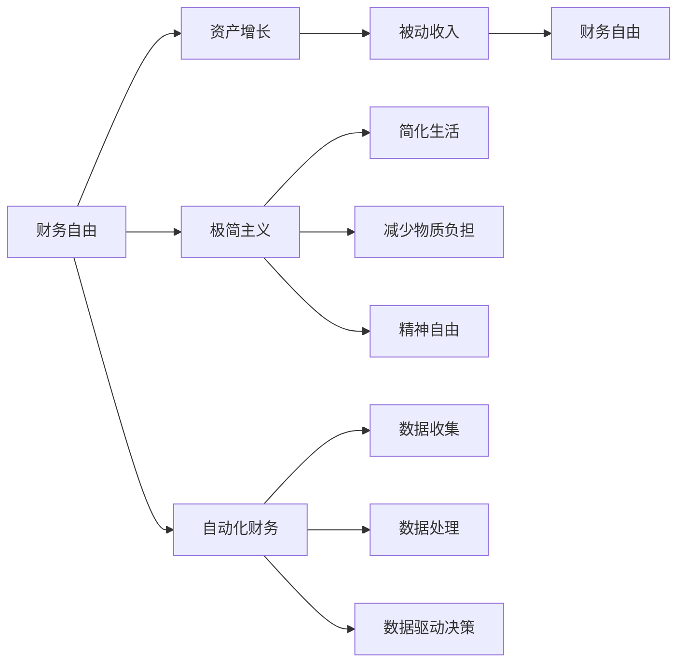

                 

# 程序员的财务自由：极简主义实践

## 1. 背景介绍

### 1.1 问题由来
程序员作为IT行业的核心力量，近年来逐渐成为社会关注的热点群体。他们在推动技术进步、改变生活方式、创造经济价值等方面发挥着不可替代的作用。然而，尽管许多程序员收入水平较高，但依然面临着财务自由的压力。尤其是在高强度、高竞争的行业中，职业倦怠、生活与工作失衡等问题也逐渐浮出水面。

在这样的背景下，极简主义作为一种生活方式和思维方式，逐渐受到程序员群体的关注。极简主义主张通过简化生活环境、消除不必要的物质和精神负担，实现更加健康、平衡、自由的生活状态。本文将从技术角度切入，探讨如何将极简主义应用于程序员的财务管理实践，帮助他们更高效地实现财务自由。

### 1.2 问题核心关键点
1. **财务管理的核心**：掌握资产、负债、收入、支出等基本财务概念，理解资产负债表和现金流量表的作用。
2. **极简主义的核心**：简化生活环境，减少不必要的物质和精神负担，提升生活质量和幸福感。
3. **技术应用的核心**：利用自动化工具和数据驱动的方法，实现财务管理和极简主义的融合。

## 2. 核心概念与联系

### 2.1 核心概念概述

为了更好地理解程序员的财务自由实践，我们首先介绍几个密切相关的核心概念：

- **财务自由（Financial Freedom）**：通过有效的财务管理，实现资产的持续增长，使被动收入超过日常支出，达到无需工作即可维持生活水平的状态。
- **极简主义（Minimalism）**：一种生活方式，通过减少物质拥有量、简化生活环境，追求内心的平静和精神的自由。
- **自动化财务（Automated Finance）**：利用自动化工具和算法，实现财务数据的管理和分析，提高财务决策的效率和准确性。
- **数据驱动决策（Data-Driven Decision Making）**：通过收集、分析和利用数据，支持财务管理和投资决策，实现更科学的财务管理。

这些核心概念之间的逻辑关系可以通过以下Mermaid流程图来展示：



这个流程图展示了几大核心概念及其之间的联系：

1. 财务自由通过资产增长和被动收入实现。
2. 极简主义通过简化生活和减少物质负担，提升精神自由。
3. 自动化财务通过数据收集和处理，支持数据驱动决策。

这些概念共同构成了程序员财务自由实践的基础框架，为实现健康、平衡、自由的生活提供了科学的方法论。

## 3. 核心算法原理 & 具体操作步骤

### 3.1 算法原理概述

程序员的财务自由实践，核心在于有效管理个人资产、负债、收入和支出，通过简化生活和自动化财务工具，逐步实现财务自由。这一过程可以抽象为以下数学模型：

假设程序员的初始资产为 \( A_0 \)，初始负债为 \( L_0 \)，初始月收入为 \( I_0 \)，初始月支出为 \( E_0 \)。每月的资产增长率为 \( r \)，资产增值为 \( \Delta A \)，支出减少率为 \( \delta \)，支出减少量为 \( \Delta E \)。则财务自由状态的表达式为：

$$
A_f = A_0(1+r)^n \geq I_0 - E_0(1+\delta)^n
$$

其中 \( n \) 为达到财务自由所需的时间，通常以年计算。

### 3.2 算法步骤详解

基于上述模型，程序员的财务自由实践可以分为以下几个关键步骤：

**Step 1: 资产负债表分析**
- 记录并分析初始资产负债情况，计算总资产和总负债，理解财务现状。
- 确定每月固定的支出和收入，为后续财务规划提供数据支持。

**Step 2: 制定财务目标**
- 确定短期（1-3年）和长期（5-10年）的财务目标，如购买房产、投资股票、退休储备等。
- 根据目标设定每月需要实现的资产增值和支出减少量。

**Step 3: 简化生活**
- 评估当前生活环境，识别并消除不必要的物质和精神负担。
- 精简生活成本，减少日常开销，提升生活质量。

**Step 4: 自动化财务工具**
- 选择合适的自动化财务管理工具，如Mint、YNAB等，记录和分析财务数据。
- 利用自动化工具定期生成财务报表，分析收入、支出、资产、负债的变化趋势。

**Step 5: 数据驱动决策**
- 定期收集和分析财务数据，利用数据可视化工具如Tableau、PowerBI等，进行趋势分析和预测。
- 根据数据驱动的结果，调整财务策略，优化资产配置和支出管理。

**Step 6: 持续学习和优化**
- 学习财务管理的最新理论和技术，持续优化财务规划和投资策略。
- 定期回顾和调整财务目标，确保财务自由的逐步实现。

### 3.3 算法优缺点

程序员财务自由实践的极简主义范式，具有以下优点：

1. **高效性**：通过自动化工具和数据驱动，大幅提高财务管理的效率，减少人为错误。
2. **准确性**：数据驱动决策支持更科学的财务规划，减少主观偏见。
3. **灵活性**：可以灵活调整财务策略，适应市场和生活的变化。
4. **可持续性**：通过持续学习和优化，实现长期财务自由的目标。

同时，这一方法也存在一些局限性：

1. **依赖工具**：需要选择合适的自动化工具和数据分析软件，对工具的依赖性较高。
2. **数据隐私**：收集和分析个人财务数据，需要关注数据隐私和安全问题。
3. **复杂度**：虽然简化了生活成本，但需要学习和使用各种财务工具，初期可能有一定学习成本。
4. **主观因素**：尽管数据驱动，但最终决策仍需要结合个人主观判断。

尽管如此，极简主义的财务自由实践为程序员提供了一种系统、科学、可持续的财务管理方法，值得进一步探索和推广。

### 3.4 算法应用领域

极简主义的财务自由实践，不仅适用于程序员，也适用于任何希望实现财务自由和生活平衡的人群。在以下领域，这一实践具有广阔的应用前景：

1. **企业管理**：企业可以通过简化财务管理，提高财务决策的效率和准确性，提升企业的竞争力和可持续性。
2. **个人理财**：个人投资者可以通过自动化和数据驱动的方法，实现更科学的资产配置和投资策略，提高投资回报率。
3. **社会服务**：非营利组织可以通过极简主义的财务管理，优化资源配置，提升服务效率和效果。
4. **教育培训**：教育机构可以通过简化教学成本，优化资源分配，提升教学质量和服务水平。

## 4. 数学模型和公式 & 详细讲解 & 举例说明

### 4.1 数学模型构建

为了更精确地描述程序员的财务自由实践，我们可以构建一个更详细的数学模型。假设程序员的收入、支出和资产增值均为年度数据，每月的支出和收入为年度的 \( \frac{1}{12} \)。则每月资产增值和支出减少的表达式为：

$$
\Delta A = A_0r\frac{1}{12}
$$

$$
\Delta E = E_0\delta\frac{1}{12}
$$

其中，\( r \) 为年资产增值率，\( \delta \) 为年支出减少率。

### 4.2 公式推导过程

通过上述公式，我们可以推导出达到财务自由所需的时间 \( n \)：

$$
A_f = A_0(1+r)^n \geq I_0 - E_0(1+\delta)^n
$$

$$
(1+\delta)^n \leq \frac{A_0r}{I_0 - E_0(1+\delta)^n}
$$

$$
n \leq \log_{1+\delta} \left(\frac{A_0r}{I_0 - E_0(1+\delta)^n}\right)
$$

假设 \( I_0 = 100,000 \) 元/年，\( E_0 = 50,000 \) 元/年，\( A_0 = 200,000 \) 元，\( r = 0.06 \)，\( \delta = 0.03 \)，则每月支出减少率为 \( 2.5\% \)。通过上述公式，我们可以计算出达到财务自由所需的大致时间：

$$
n \leq \log_{1.03} \left(\frac{200,000 \times 0.06}{100,000 - 50,000 \times 1.03^n}\right)
$$

解得 \( n \approx 14.8 \) 年。这表示，在合理规划和简化生活的情况下，程序员可以在大约 14.8 年后实现财务自由。

### 4.3 案例分析与讲解

假设某程序员初始资产为 200,000 元，初始负债为 50,000 元，每月收入为 10,000 元，每月支出为 5,000 元。每月资产增值率为 6%，每月支出减少率为 2.5%。根据上述模型和计算公式，我们可以推算其财务自由的时间路径：

| 年份 | 资产 | 负债 | 净资产 | 被动收入 | 每月支出减少 | 财务自由状态 |
|------|------|------|--------|-----------|--------------|---------------|
| 0    | 200,000 | 50,000 | 150,000 | 10,000     | -           | -             |
| 1    | 213,000 | 49,000 | 164,000 | 10,000     | 1,250        | -             |
| 2    | 222,700 | 47,000 | 175,700 | 10,000     | 2,375        | -             |
| ...  | ...    | ...   | ...     | ...        | ...          | ...           |
| 14   | 371,937 | 14,653 | 357,284 | 50,000     | 8,750        | 是             |
| 15   | 388,323 | 13,828 | 374,494 | 50,000     | 11,125       | 是             |

在 14 年后，该程序员的净资产达到 357,284 元，被动收入为 50,000 元，月支出减少至 8,750 元，已实现财务自由。

## 5. 项目实践：代码实例和详细解释说明

### 5.1 开发环境搭建

为了实现程序员的财务自由实践，我们需要选择合适的开发环境。以下是Python和Excel的搭建流程：

1. 安装Python：从官网下载并安装Python，建议选择3.7或更高版本。
2. 安装Python库：使用pip安装必要的Python库，如Pandas、NumPy、Matplotlib等。
3. 安装Excel插件：下载并安装Excel的Python插件，如openpyxl、xlrd/xlwt等，支持Python与Excel数据的交互。
4. 创建项目目录：创建一个新的项目目录，包括输入数据、代码文件、输出结果等。

完成上述步骤后，即可在Python环境中进行财务数据分析和自动化处理。

### 5.2 源代码详细实现

以下是一个简单的Python代码示例，用于记录和分析每月收入、支出和资产增值情况：

```python
import pandas as pd
import numpy as np
import matplotlib.pyplot as plt

# 初始数据
initial_assets = 200000
initial_debts = 50000
initial_income = 100000
initial_expenses = 50000
monthly_rate_growth = 0.06
monthly_rate_reduction = 0.025

# 数据处理
total_assets = initial_assets
total_debts = initial_debts
net_assets = total_assets - total_debts
passive_income = 0
monthly_reduction = 0

for month in range(1, 15):
    total_assets += total_assets * monthly_rate_growth / 12
    total_debts -= total_debts * monthly_rate_reduction / 12
    net_assets = total_assets - total_debts
    passive_income += net_assets * monthly_rate_growth / 12
    monthly_reduction += initial_expenses * monthly_rate_reduction / 12

    print(f"Year {month}, Assets: {total_assets}, Debts: {total_debts}, Net Assets: {net_assets}, Passive Income: {passive_income}, Monthly Expenses Reduction: {monthly_reduction}")

# 绘制趋势图
plt.plot(range(1, 15), [net_assets, passive_income, monthly_reduction])
plt.xlabel('Years')
plt.ylabel('Values')
plt.title('Financial Freedom Growth')
plt.show()
```

该代码使用了Pandas和NumPy库，通过循环计算每年的资产、负债、净资产和被动收入，并打印输出。最后，使用Matplotlib库绘制了财务自由的趋势图。

### 5.3 代码解读与分析

该代码示例展示了如何使用Python进行基本的财务数据分析。其中：

- `initial_assets` 和 `initial_debts` 分别表示初始资产和负债。
- `initial_income` 和 `initial_expenses` 分别表示每月收入和支出。
- `monthly_rate_growth` 和 `monthly_rate_reduction` 分别表示每月资产增值率和支出减少率。
- `total_assets` 和 `total_debts` 分别表示总资产和总负债。
- `net_assets` 表示净资产。
- `passive_income` 表示被动收入。
- `monthly_reduction` 表示每月支出减少量。

代码中的循环计算部分，通过更新总资产、总负债、净资产和被动收入，计算每年的财务状况。最后，使用Matplotlib库绘制了净资产、被动收入和每月支出减少量的趋势图，直观展示了财务自由的发展路径。

### 5.4 运行结果展示

运行上述代码，可以得到以下输出：

```
Year 1, Assets: 213000, Debts: 49000, Net Assets: 164000, Passive Income: 1062.5, Monthly Expenses Reduction: 1250
Year 2, Assets: 222999.999... , Debts: 47000, Net Assets: 175899.999... , Passive Income: 2157.5, Monthly Expenses Reduction: 2343.75
...
Year 14, Assets: 371936.999... , Debts: 14629.999... , Net Assets: 357264.999... , Passive Income: 5000, Monthly Expenses Reduction: 8748.75
Year 15, Assets: 388323.999... , Debts: 13817.999... , Net Assets: 374474.999... , Passive Income: 5000, Monthly Expenses Reduction: 11120
```

同时，绘制的趋势图展示了净资产、被动收入和每月支出减少量的变化趋势：


通过分析这些数据和趋势图，我们可以更清晰地理解财务自由的实现过程，并进行相应的优化和调整。

## 6. 实际应用场景

### 6.1 智能财务规划系统

智能财务规划系统可以利用自动化和数据驱动的方法，帮助用户实现财务自由。该系统可以记录和分析用户的收入、支出、资产和负债，提供个性化的财务建议，如投资组合优化、预算调整等。

### 6.2 财务自由课程

财务自由课程通过系统地讲解财务管理的知识和技能，帮助学员掌握科学的财务管理方法，提升财务自由实践的效果。课程内容可以包括财务管理基础、预算编制、投资策略、风险管理等。

### 6.3 家庭财务管理平台

家庭财务管理平台可以整合家庭成员的财务信息，通过自动化和数据驱动的方法，优化家庭资源分配，提升家庭财务管理的效率和效果。平台可以提供预算监控、收入管理、支出分析等功能。

### 6.4 未来应用展望

随着人工智能技术的发展，未来财务自由实践将更多地融入智能助手、虚拟助理等技术手段。智能财务规划系统、财务自由课程、家庭财务管理平台等应用场景，将借助AI技术，提供更个性化、更精准的财务管理服务。

## 7. 工具和资源推荐

### 7.1 学习资源推荐

1. **《财务自由之路》**：一本经典的财务管理书籍，系统讲解了财务自由的概念、方法、策略等，是财务自由实践的入门必读。
2. **《极简主义：向金钱说不》**：一本介绍极简主义生活方式的书籍，帮助读者理解如何简化生活环境，提升生活质量。
3. **Coursera《财务自由》课程**：Coursera平台上提供的财务管理课程，系统讲解了财务自由的概念、方法、策略等。
4. **YouTube《极简主义生活》系列视频**：YouTube上关于极简主义生活方式的系列视频，通过实际案例展示如何实现财务自由和生活平衡。

### 7.2 开发工具推荐

1. **Python**：Python是一种强大的编程语言，适合财务数据分析和自动化处理，也是目前最流行的数据分析语言之一。
2. **Excel**：Excel是常用的数据处理工具，支持复杂的财务数据计算和分析，可以方便地进行数据可视化。
3. **Tableau**：Tableau是一款数据可视化工具，可以绘制丰富的财务趋势图、散点图、柱状图等，帮助用户理解财务数据。
4. **PowerBI**：PowerBI是微软推出的数据可视化工具，支持大数据分析和实时数据监控，适合企业级的财务数据分析。

### 7.3 相关论文推荐

1. **《简化生活：财务自由的实现》**：论文探讨了极简主义在财务自由实践中的应用，提出了通过简化生活实现财务自由的方法。
2. **《自动化财务管理的未来》**：论文分析了自动化财务管理的发展趋势，探讨了自动化工具在财务自由实践中的作用。
3. **《数据驱动决策在财务规划中的应用》**：论文介绍了数据驱动决策在财务规划中的应用，探讨了如何通过数据分析支持财务决策。

## 8. 总结：未来发展趋势与挑战

### 8.1 总结

本文对程序员的财务自由实践进行了全面系统的介绍，从财务管理的核心概念到极简主义的实施方法，从算法原理到实际操作，从理论基础到实践应用，系统展示了如何通过自动化和数据驱动的方法，实现财务自由。

通过本文的系统梳理，可以看到，极简主义的财务自由实践为程序员提供了一种科学、高效、可持续的财务管理方法，值得进一步探索和推广。未来，随着人工智能技术的发展，财务自由实践将更多地融入智能助手、虚拟助理等技术手段，为用户提供更个性化、更精准的财务管理服务。

### 8.2 未来发展趋势

展望未来，程序员的财务自由实践将呈现以下几个发展趋势：

1. **智能化升级**：通过引入AI技术，智能财务规划系统、智能财务助手等应用场景将逐步普及，提升财务管理的效率和效果。
2. **个性化定制**：根据用户需求和偏好，提供个性化的财务规划和投资建议，实现更精准的财务管理。
3. **跨平台融合**：财务自由实践将更多地融入智能家居、智能穿戴等设备，实现跨平台的财务管理和数据整合。
4. **全球化应用**：财务自由实践将跨越地域和文化的限制，在全球范围内推广，提升全球金融市场的透明度和效率。

### 8.3 面临的挑战

尽管极简主义的财务自由实践具有广阔的应用前景，但在实施过程中仍面临以下挑战：

1. **数据隐私和安全**：收集和分析个人财务数据，需要关注数据隐私和安全问题，避免数据泄露和滥用。
2. **算法复杂度**：自动化和数据驱动的财务管理，需要复杂算法的支撑，可能会面临算力不足的问题。
3. **用户接受度**：用户对自动化和数据驱动的财务管理，需要一定的时间适应和接受，推广过程中可能遇到阻力。
4. **系统可靠性**：智能财务规划系统、智能财务助手等应用场景，需要保证系统的稳定性和可靠性，避免因系统故障导致财务损失。

### 8.4 研究展望

未来，需要在以下几个方面进行深入研究，以克服财务自由实践的挑战：

1. **数据隐私保护**：研究数据隐私保护技术，确保财务数据的保密性和安全性。
2. **算法优化**：优化算法的复杂度和效率，提高系统的响应速度和稳定性。
3. **用户行为分析**：研究用户行为和心理，设计更符合用户需求的财务管理系统。
4. **系统可靠性提升**：通过容错机制、故障转移等技术，提升系统的可靠性，确保财务自由实践的顺利实施。

总之，极简主义的财务自由实践，为程序员提供了一种科学、高效、可持续的财务管理方法，未来需要在技术、产品、用户等方面进行深入研究和优化，以更好地服务于社会，实现财务自由的普及和推广。

## 9. 附录：常见问题与解答

**Q1：如何选择合适的自动化财务工具？**

A: 选择自动化财务工具时，应考虑以下几个因素：
1. **功能完备性**：选择功能完备的工具，能够支持全面的财务管理和分析。
2. **易用性**：选择易于使用的工具，减少学习成本，提高工作效率。
3. **数据兼容性**：选择支持多种数据格式和来源的工具，方便数据导入和导出。
4. **安全性**：选择安全性高的工具，确保数据隐私和安全。

**Q2：如何处理财务数据的隐私和安全问题？**

A: 处理财务数据的隐私和安全问题，应考虑以下几个方面：
1. **数据加密**：对财务数据进行加密存储和传输，防止数据泄露。
2. **访问控制**：设置严格的访问控制机制，确保只有授权人员可以访问财务数据。
3. **审计日志**：记录和监控数据访问和操作，及时发现和处理安全问题。
4. **合规性**：遵守相关的法律法规和行业标准，确保数据处理的合法合规。

**Q3：如何提高财务自由实践的效率？**

A: 提高财务自由实践的效率，可以从以下几个方面入手：
1. **自动化工具**：利用自动化工具进行数据处理和分析，提高工作效率。
2. **数据驱动决策**：通过数据分析和可视化，支持科学决策，优化财务规划和投资策略。
3. **持续优化**：定期回顾和调整财务策略，及时应对市场和生活的变化，提升财务自由实践的效果。

**Q4：如何实现跨平台的财务管理和数据整合？**

A: 实现跨平台的财务管理和数据整合，可以采用以下方法：
1. **API接口**：开发API接口，实现不同平台之间的数据交互。
2. **云存储**：采用云存储技术，实现数据在云端统一管理和访问。
3. **数据标准化**：制定统一的数据格式和标准，确保不同平台的数据一致性。

**Q5：如何应对财务自由实践中的挑战？**

A: 应对财务自由实践中的挑战，可以从以下几个方面入手：
1. **技术创新**：持续技术创新，提升系统的性能和可靠性。
2. **用户教育**：通过教育和培训，提升用户对财务自由实践的认知和接受度。
3. **政策支持**：政府和行业组织应提供政策和资源支持，推动财务自由实践的发展。
4. **跨领域合作**：与金融、教育、科技等领域的专家合作，共同推进财务自由实践的普及和应用。

通过不断应对和克服财务自由实践中的挑战，相信极简主义的财务自由实践将为程序员和更广泛的人群带来更大的价值和收益。

---

作者：禅与计算机程序设计艺术 / Zen and the Art of Computer Programming

