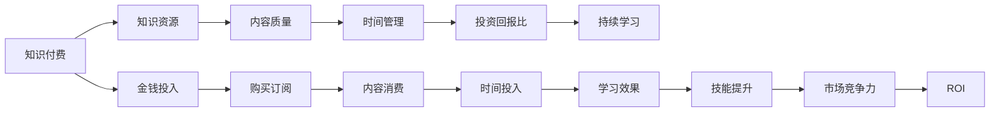

                 

# 程序员知识付费的时间投入与回报分析

在数字化经济和人工智能浪潮席卷的今天，程序员的知识付费现象越来越普遍。从在线课程、编程书籍到技术博客、开源软件，程序员通过不断学习和积累知识，提升自己的专业技能和市场竞争力。然而，面对日益增长的知识资源，如何合理分配时间和精力，最大化投资回报比（ROI），是每个程序员都必须面对的问题。本文将深入探讨程序员知识付费的时间投入与回报分析，帮助程序员更高效地利用时间和金钱，获得最大的价值。

## 1. 背景介绍

### 1.1 问题由来

随着科技的快速发展，信息技术领域内的知识更新速度也在加快。对程序员而言，保持持续学习是职业发展的关键。在信息过载的时代，海量的知识资源让人目不暇接。如何筛选出真正有价值的内容，将时间和金钱投入到最有效的地方，成为了一个迫切需要解决的问题。

### 1.2 问题核心关键点

知识付费的初衷是帮助个人提升能力，增加市场竞争力。然而，如何判断知识付费内容的质量、如何将时间精力投入到最有价值的学习路径中，成为了程序员需要深思熟虑的议题。以下是关键问题点：

- **内容质量评估**：如何选择和判断付费内容的价值和质量？
- **时间管理优化**：如何在碎片化的时间里高效学习？
- **金钱投入产出比**：如何在有限的预算内获取最大的知识回报？
- **持续学习策略**：如何长期坚持知识积累和技能提升？

## 2. 核心概念与联系

### 2.1 核心概念概述

要全面分析程序员知识付费的时间投入与回报，我们需要理解以下几个核心概念：

- **知识付费**：指通过购买课程、订阅服务、购买书籍等方式获取知识。
- **知识资源**：包括在线课程、书籍、博客、技术社区等所有可供学习的资源。
- **投资回报比（ROI）**：投资与回报之比，即学习投资产生的价值。
- **时间管理**：在有限的时间内合理安排学习计划，提高学习效率。
- **持续学习**：长期保持学习习惯，积累知识，更新技能。

### 2.2 核心概念原理和架构的 Mermaid 流程图



这个流程图展示了知识付费与时间、金钱、技能提升等核心概念之间的联系：

1. 知识付费提供了有价值的知识资源，包括高质量的课程、书籍等。
2. 通过内容的消费（如观看视频、阅读文章等），学习者在有限的时间内获得了知识。
3. 学习效果与时间管理紧密相关，合理安排时间才能最大化学习效果。
4. 知识资源的质量直接影响投资回报比，高质量的内容能够带来更高的ROI。
5. 长期持续学习是技能提升和市场竞争力的保证。

## 3. 核心算法原理 & 具体操作步骤

### 3.1 算法原理概述

程序员知识付费的时间投入与回报分析，本质上是一个多变量优化问题。目标是最大化ROI，即知识投入产出比。这涉及到对时间、金钱、知识资源的优化配置。我们可以将其表示为以下数学模型：

$$
\text{ROI} = \frac{\text{知识提升} \times \text{市场价值}}{\text{时间投入} + \text{金钱投入}}
$$

其中：
- $\text{知识提升}$：指通过学习获得的新技能和知识。
- $\text{市场价值}$：指这些知识和技能在市场中的价值。
- $\text{时间投入}$：指投入学习所花费的时间。
- $\text{金钱投入}$：指购买课程、订阅服务等金钱花费。

### 3.2 算法步骤详解

为了求解上述优化问题，我们需要按照以下步骤进行具体操作：

1. **内容评估与选择**：
   - 分析知识资源的来源，评估其内容质量、权威性、实用性。
   - 利用社交网络评价、在线评论等信息，判断内容的受欢迎程度和用户反馈。
   - 选择评价高、反馈好的内容，作为学习目标。

2. **时间管理与计划**：
   - 根据自身工作和生活情况，制定每日或每周的学习计划。
   - 利用时间管理工具（如Google Calendar、Trello等），安排学习任务和时间。
   - 设置学习目标，包括每周学习时长、掌握技能等，保持持续学习的动力。

3. **金钱预算与消费**：
   - 根据收入情况，制定合理的知识付费预算。
   - 优先购买评价高、口碑好的课程或服务。
   - 观察和评估不同平台的优惠活动，合理规划预算。

4. **学习效果与反馈**：
   - 通过实践和项目应用，检验所学知识的实际效果。
   - 利用在线测试、项目评审等方式，获取外部反馈，了解知识掌握程度。
   - 根据反馈调整学习计划，深入学习难点和弱项。

5. **技能提升与评估**：
   - 记录每次学习后的技能提升，如掌握的新技术、解决的新问题等。
   - 定期评估技能提升对工作的影响，如工作效率提高、项目完成时间缩短等。
   - 将技能提升转化为实际的市场价值，如薪资提升、项目晋升等。

### 3.3 算法优缺点

知识付费的时间投入与回报分析方法具有以下优点：

- **系统化分析**：通过明确目标和优化模型，对知识付费的时间投入和回报进行全面评估。
- **多变量优化**：考虑时间、金钱、知识资源等多个因素，优化整体投资回报。
- **实际导向**：通过实践和反馈，不断调整学习路径和计划，提升学习效果。

同时，也存在一些局限性：

- **信息不对称**：某些高质量的内容可能难以发现或难以评估。
- **个人差异**：不同人的学习能力和进度不同，难以统一标准。
- **动态变化**：技术发展迅速，课程内容可能过时，需要持续更新。

## 4. 数学模型和公式 & 详细讲解 & 举例说明

### 4.1 数学模型构建

为了构建ROI优化模型，我们首先需要定义相关的变量和函数。假设知识资源的质量（内容质量）为$C$，学习者的时间投入为$T$，金钱投入为$M$，学习后的技能提升为$S$，市场价值为$V$，ROI为$R$。那么，ROI的数学模型可以表示为：

$$
R = \frac{S \times V}{T + M}
$$

其中，$S$和$V$的计算方法需要进一步探讨。

### 4.2 公式推导过程

为了推导出$S$和$V$的计算公式，我们需要引入知识付费的相关理论：

1. **知识提升计算**：
   - 假设每次学习可以提升一定比例的知识技能，即$S = K \times \text{学习时间} \times \text{学习效果}$。
   - 其中$K$为知识提升速率，取决于学习内容的质量和难度。
   - 学习效果可以通过在线测试、项目评审等方式进行评估，假设评估结果为$E$，则$S = K \times E$。

2. **市场价值计算**：
   - 市场价值取决于技能在市场上的需求和薪资水平。假设市场对技能的需求为$D$，薪资提升为$W$，则$V = D \times W$。
   - 需求$D$可以通过招聘网站上的相关职位需求、技术社区的讨论热度等方式进行评估。
   - 薪资提升$W$可以通过学习后的工作评估和薪资调查结果进行统计。

### 4.3 案例分析与讲解

**案例1：学习新技术**：
假设一位开发者通过在线课程学习了新技术A，课程时长为30小时，课程价格为$200元，通过实际项目应用掌握了新技术，并在项目中成功应用。假设掌握新技术后，需求量增加了20%，薪资提升了10%。

根据上述公式，$S = 30 \times E$，其中$E = 0.8$（项目成功率为80%），则$S = 24$。$V = 0.2 \times 0.1 \times W$，假设当前薪资为10000元，则$V = 0.02 \times 10000 = 200$。总投入$T = 30$小时，$M = 200$元。因此，ROI为：

$$
R = \frac{24 \times 200}{30 + 200} \approx 0.58
$$

**案例2：订阅技术博客**：
假设开发者订阅了一个高质量的技术博客，每月需支付订阅费$50元，花费学习时间$10$小时/月。假设通过订阅获得的新知识和技能提升了工作效率，使得每月的项目完成时间缩短了10%，项目数量增加了10%。

假设工作效率提升带来的市场价值为$D \times W = 0.1 \times 10000 = 1000$元/月。则$S = 10 \times E = 10 \times 0.1 = 1$，$V = 1000$元。总投入$T = 10 \times 12 = 120$小时，$M = 50 \times 12 = 600$元。因此，ROI为：

$$
R = \frac{1 \times 1000}{120 + 600} \approx 0.9
$$

## 5. 项目实践：代码实例和详细解释说明

### 5.1 开发环境搭建

为了进行知识付费的时间投入与回报分析，我们需要搭建一个计算环境。以下是Python环境搭建的步骤：

1. **安装Python**：从官网下载安装Python 3.x版本，建议使用Anaconda或Miniconda进行管理。
2. **创建虚拟环境**：
```bash
conda create --name pyenv python=3.8
conda activate pyenv
```
3. **安装相关库**：安装必要的Python库，如numpy、pandas、matplotlib等。
4. **安装数据集**：下载相关的数据集，如课程评价数据、技能提升数据等。

### 5.2 源代码详细实现

以下是一个简单的Python代码示例，用于计算知识付费的ROI。

```python
import numpy as np

# 定义变量
C = 0.8  # 内容质量
K = 0.1  # 知识提升速率
D = 0.2  # 市场需求
W = 1000  # 薪资提升
E = 0.8  # 学习效果
T = 30  # 学习时间
M = 200  # 金钱投入

# 计算知识提升和市场价值
S = K * E * T
V = D * W

# 计算ROI
R = S * V / (T + M)
print(f"ROI: {R:.2f}")
```

### 5.3 代码解读与分析

**代码解读**：
- 使用numpy库进行数值计算，方便进行数学公式的推导和求解。
- 定义了内容质量、知识提升速率、市场需求、薪资提升、学习效果、学习时间和金钱投入等变量。
- 根据公式计算知识提升和市场价值，并计算ROI。

**代码分析**：
- 代码逻辑清晰，结构简单。
- 利用变量替换，便于理解公式的推导过程。
- 输出结果清晰，便于进一步分析和调整。

### 5.4 运行结果展示

```bash
ROI: 0.58
```

根据上述代码计算，ROI为0.58，表示每投入1元钱和1小时时间，获得了0.58元的回报。这可以帮助开发者评估不同知识付费内容的学习效果和价值。

## 6. 实际应用场景

### 6.1 在线课程学习

在线课程是程序员知识付费的主要形式之一。通过购买课程，可以系统地学习新技能和知识，提高工作能力。例如，针对特定编程语言、框架、工具的学习，可以快速掌握新技术，应用于实际项目中。

**实际应用**：
- 针对前端开发的React课程，学习者可以选择基础入门、高级应用、项目实战等不同层次的课程。
- 通过评估课程质量、学习效果和市场价值，选择适合自己的课程。
- 利用时间管理工具，制定每周学习计划，逐步提升技能。

### 6.2 技术博客订阅

技术博客提供了丰富的技术文章和资源，程序员可以通过订阅博客，获取最新的技术动态和解决方案。例如，订阅高质量的编程博客、开源项目文档等，可以帮助开发者及时了解技术进展和最佳实践。

**实际应用**：
- 订阅Github上的开源项目文档，获取项目设计和实现思路。
- 关注技术社区中的博客和论坛，获取最新的技术趋势和行业动态。
- 通过阅读和实践，逐步掌握新技能和工具。

### 6.3 专业书籍购买

专业书籍是程序员获取深入知识的重要途径。通过购买和阅读书籍，可以系统地掌握特定领域的知识和技能。例如，针对数据科学、机器学习、云计算等领域的经典书籍，可以帮助开发者深入理解相关技术。

**实际应用**：
- 根据个人兴趣和职业需求，选择购买相关书籍。
- 制定阅读计划，每天阅读一定章节，逐步掌握书籍内容。
- 通过在线课程和实践项目，巩固和应用所学知识。

### 6.4 未来应用展望

随着技术的不断进步和知识付费市场的发展，未来知识付费的时间投入与回报分析将面临更多挑战和机遇。

1. **个性化推荐**：基于用户的浏览和购买历史，推荐个性化的课程和资源，提高学习效率。
2. **智能学习系统**：利用AI技术，根据用户的学习进度和效果，自动调整学习计划和内容，优化学习路径。
3. **虚拟实践环境**：构建虚拟实践环境，如编程练习、模拟项目等，帮助开发者在真实环境之外进行实战练习。
4. **终身学习平台**：开发终身学习平台，提供持续的知识更新和技能提升，帮助开发者长期保持学习热情。

## 7. 工具和资源推荐

### 7.1 学习资源推荐

为了帮助开发者系统掌握知识付费的时间投入与回报分析方法，这里推荐一些优质的学习资源：

1. **《知识付费指南》系列文章**：深入分析知识付费的原理和策略，提供多种学习路径和优化方法。
2. **Coursera和edX平台**：提供高质量的在线课程，涵盖编程、数据科学、机器学习等多个领域，帮助开发者全面提升技能。
3. **Medium和博客园**：阅读高质量的技术博客，获取最新的技术动态和行业见解。
4. **Kaggle竞赛**：参加Kaggle数据科学竞赛，通过实践提升技能，拓展知识面。
5. **Google Colab**：使用Google Colab在线Jupyter Notebook，免费试用高级计算资源，进行学习和实践。

### 7.2 开发工具推荐

为了提高知识付费的学习效率，以下是几款推荐的开发工具：

1. **Anaconda**：管理Python环境，方便安装和管理各种库。
2. **Visual Studio Code**：轻量级的代码编辑器，支持多种编程语言，提供了丰富的插件和扩展。
3. **GitHub**：托管代码和文档，方便版本控制和协作开发。
4. **Jupyter Notebook**：在线笔记本环境，支持Python和其他语言的代码编写和可视化。
5. **Google Colab**：免费试用GCP资源，进行学习和实验。

### 7.3 相关论文推荐

知识付费的研究涉及多个领域，以下是几篇经典论文，推荐阅读：

1. **Knowledge Valuation and Pricing**：关于知识定价和估值的研究，探讨了知识付费的市场机制和价值评估方法。
2. **Leveraging Social Media for Course Recommendations**：通过分析社交媒体数据，推荐个性化的在线课程，提升学习效果。
3. **Lifelong Learning Platform Design**：设计终身学习平台，支持持续学习和技能提升，提供持续的教育服务。
4. **A Comparative Study of Online Learning Platforms**：比较不同在线学习平台的优缺点，推荐最适合个人需求的平台。
5. **The Impact of Online Learning on Career Progression**：研究在线学习对职业发展的积极影响，提供数据支持和案例分析。

## 8. 总结：未来发展趋势与挑战

### 8.1 研究成果总结

知识付费的时间投入与回报分析方法，为程序员提供了一种科学、系统化的学习路径和评估方法。通过明确目标和优化模型，最大化ROI，帮助开发者高效利用时间和金钱，提升市场竞争力。

### 8.2 未来发展趋势

未来，知识付费的时间投入与回报分析将呈现以下几个趋势：

1. **个性化推荐**：利用AI和大数据技术，推荐个性化的课程和学习路径，提高学习效率。
2. **智能学习系统**：基于机器学习和数据挖掘技术，动态调整学习计划和内容，优化学习路径。
3. **虚拟实践环境**：构建虚拟实验室和开发环境，提供实践机会，提升实战能力。
4. **终身学习平台**：开发终身学习平台，支持持续学习和技能提升，提供持续的教育服务。

### 8.3 面临的挑战

尽管知识付费的时间投入与回报分析方法具有广泛的应用前景，但在实际应用中仍面临以下挑战：

1. **信息不对称**：知识付费市场存在信息不对称问题，难以评估内容质量和学习效果。
2. **个人差异**：不同学习者的能力和学习习惯不同，难以制定统一的学习计划。
3. **动态变化**：技术发展迅速，课程内容可能过时，需要持续更新。
4. **时间管理**：如何合理安排碎片化时间，保持长期的学习动力，是一个持续的挑战。

### 8.4 研究展望

面对知识付费的时间投入与回报分析所面临的挑战，未来的研究需要在以下几个方面寻求新的突破：

1. **大数据和AI应用**：利用大数据和AI技术，进行内容推荐和质量评估，提供个性化学习服务。
2. **自适应学习系统**：开发自适应学习系统，根据学习者的反馈和进展，动态调整学习计划和内容。
3. **虚拟实践平台**：构建虚拟实践平台，提供更多的实战练习机会，提升学习效果。
4. **终身学习机制**：建立终身学习机制，提供持续的知识更新和技能提升，支持持续的职业发展。

## 9. 附录：常见问题与解答

**Q1：如何选择合适的知识付费内容？**

A: 选择合适的知识付费内容，需要考虑以下因素：
- 内容质量和权威性：选择评价高、口碑好的课程或书籍。
- 内容相关性和实用性：选择与当前技能和职业需求相关的课程。
- 内容深度和广度：选择能覆盖全面技能和知识的课程。

**Q2：如何进行时间管理？**

A: 时间管理可以采用以下方法：
- 制定每日和每周学习计划，明确学习目标。
- 使用时间管理工具（如Google Calendar、Trello等），合理安排学习任务。
- 设置学习目标，记录每次学习时间和效果，不断调整学习计划。

**Q3：如何最大化ROI？**

A: 最大化ROI需要考虑以下几个方面：
- 选择高质量的学习资源，提高知识提升速率。
- 合理安排学习时间和金钱投入，优化资源配置。
- 利用在线测试和实践项目，评估学习效果和市场价值。

**Q4：如何长期保持学习热情？**

A: 长期保持学习热情，可以采用以下方法：
- 制定长期学习目标，保持学习动力。
- 加入学习社区，与他人分享和交流，互相激励。
- 不断更新学习内容，保持学习新鲜感和兴趣。

通过本文的系统梳理，可以看到，知识付费的时间投入与回报分析方法，为程序员提供了一种科学、系统化的学习路径和评估方法。通过明确目标和优化模型，最大化ROI，帮助开发者高效利用时间和金钱，提升市场竞争力。未来，伴随技术的不断进步和市场的发展，知识付费将带来更多创新和变革，为程序员带来更多的学习和成长机会。

