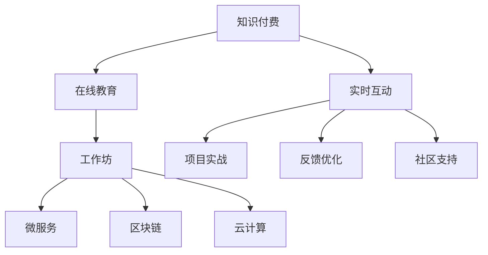

                 

# 程序员知识付费：打造工作坊式学习模式

> 关键词：知识付费, 工作坊, 程序员, 深度学习, 编程, 代码, 微服务, 云计算, 区块链

## 1. 背景介绍

### 1.1 问题由来
随着互联网技术的发展，人们获取知识和技能的方式日益多样化和便捷化。但是，传统的线下课程和书籍学习方式在速度和互动性上存在明显不足。尤其是在编程和软件开发领域，理论与实践相结合、快速迭代更新的需求愈发迫切。

知识付费模式的兴起，为在线学习提供了新的可能性。通过订阅优质内容，用户可以在短时间内获得大量有价值的知识，这大大提升了学习的效率和效果。然而，仅仅通过静态内容，缺乏互动和实践，也难以真正掌握复杂的编程技能。

因此，如何打造一个高效、互动、深入的学习模式，成为在线教育平台和内容创作者需要解决的重要问题。基于此，工作坊式学习模式应运而生，通过模拟线下课程的互动和实战，在在线环境中实现知识的高效传递。

### 1.2 问题核心关键点
工作坊式学习模式的核心在于结合在线课程和实际项目，通过理论与实践的紧密结合，提升学员的技能掌握和应用能力。其关键点包括：

- 实时互动：在线学员与讲师、学员之间可以通过文字、音频、视频等多种方式实时沟通，即时解决学习中的问题。
- 项目实战：学员通过完成实际的项目，将所学知识应用到实践中，提升动手能力和问题解决能力。
- 反馈优化：学员的学习进度和成果可以通过系统反馈，及时调整学习策略，提升学习效果。
- 社区支持：学员可以通过参与社区讨论、分享学习心得，获得更多的学习和灵感。

## 2. 核心概念与联系

### 2.1 核心概念概述

为了更好地理解工作坊式学习模式，本节将介绍几个密切相关的核心概念：

- 知识付费：指用户为获取高质量的知识和技能，通过付费订阅、单次购买等方式支付一定费用。知识付费模式在在线教育中得到了广泛应用，极大地提升了知识传播的效率和质量。
- 工作坊(Workshop)：指一种以项目为导向的互动式学习模式，通过分组讨论、项目实践等方式，实现知识和技能的深度学习。
- 在线教育：指通过互联网技术，将教育资源在线化、互动化，提供大规模、个性化的学习服务。在线教育平台如Coursera、edX、Udacity等，已经成为现代人获取知识的重要渠道。
- 微服务架构：指将复杂的应用系统拆分为多个小型的、独立的服务，每个服务独立运行、互相协作，提升系统的可扩展性和可维护性。微服务架构广泛应用于云计算和互联网应用开发。
- 区块链技术：指一种去中心化的分布式账本技术，通过共识机制和加密技术，实现数据的透明、安全和不可篡改。区块链技术在金融、供应链、版权保护等领域有广泛应用。
- 云计算：指通过互联网提供计算资源和服务的模式，用户可以根据需求动态申请和释放资源，避免硬件资源的闲置和浪费。云计算技术如AWS、Azure、阿里云等，已成为现代企业基础设施的核心。

这些核心概念之间的逻辑关系可以通过以下Mermaid流程图来展示：



这个流程图展示了大语言模型的核心概念及其之间的关系：

1. 知识付费和在线教育为工作坊式学习模式提供了土壤。
2. 工作坊模式通过互动和实战，提升学习效果。
3. 微服务、区块链、云计算等技术为工作坊模式的实现提供了技术基础。
4. 实时互动、项目实战、反馈优化、社区支持为工作坊模式的运行提供了保障。

这些概念共同构成了工作坊式学习模式的理论基础，使其在在线教育中具备独特优势和广泛应用前景。

## 3. 核心算法原理 & 具体操作步骤
### 3.1 算法原理概述

工作坊式学习模式的核心在于结合在线课程和实际项目，通过理论与实践的紧密结合，提升学员的技能掌握和应用能力。其算法原理主要包括以下几个方面：

- 模块化教学设计：将课程内容分解为多个模块，每个模块独立教学，学员可以灵活选择学习内容。
- 项目驱动学习：每个模块以一个实际项目为核心，学员通过完成项目，掌握相关知识和技术。
- 实时互动反馈：学员在学习过程中遇到问题，可以即时向讲师或同学请教，获得反馈和支持。
- 社区化学习：学员可以在社区中分享学习心得，获取更多的学习资源和灵感。
- 数据驱动优化：通过分析学员的学习进度和成果，及时调整教学策略，提升学习效果。

### 3.2 算法步骤详解

工作坊式学习模式的实现步骤如下：

**Step 1: 设计课程模块**
- 根据课程目标，设计多个独立且完整的教学模块，每个模块专注于一个具体主题。
- 每个模块包括理论知识讲解、实战项目演示和学员实践环节。

**Step 2: 搭建在线平台**
- 使用在线教育平台，如Coursera、Udacity、edX等，搭建工作坊式学习平台。
- 配置实时互动功能，如文字聊天、音频讨论、视频会议等，实现学员和讲师的实时沟通。
- 设计社区讨论区，方便学员之间交流和分享学习心得。

**Step 3: 准备项目数据**
- 根据课程主题，收集和准备实际项目所需的数据和资源，如数据集、代码库、文档等。
- 对数据进行预处理和标注，确保其符合项目需求。

**Step 4: 开发实战项目**
- 讲师和学员共同完成项目的开发过程，包括需求分析、设计方案、代码编写、测试调试等环节。
- 鼓励学员独立思考和实践，培养其问题解决能力和创新思维。
- 实时记录学员的学习进度和成果，通过图表和报告反馈给学员和讲师。

**Step 5: 评估和优化**
- 根据项目完成情况和学习进度，对学员进行阶段性评估，包括理论测试、项目评审、实践考核等。
- 根据评估结果和反馈意见，调整教学策略和内容，优化学习效果。
- 收集学员的学习数据和反馈，不断改进和完善课程内容和工作坊模式。

### 3.3 算法优缺点

工作坊式学习模式具备以下优点：
- 理论与实践相结合，提升学员的动手能力和应用能力。
- 实时互动和社区支持，增强学习体验和效果。
- 数据驱动优化，及时调整教学策略，提升学习效率。
- 灵活自主的学习模式，学员可以根据自己的需求和进度选择学习内容。

同时，该模式也存在一些局限性：
- 对讲师和平台的资源要求较高，需要专业讲师和完善的教学工具。
- 需要学员具有一定编程基础，才能较好地参与项目实践。
- 数据和资源准备不足时，会影响项目的实际效果。
- 实时互动的负荷较大，需要优化网络性能和技术架构。

尽管存在这些局限性，但就目前而言，工作坊式学习模式仍是最有效的在线学习模式之一。未来相关研究的重点在于如何进一步降低资源需求，提升教学效果，同时兼顾技术实施的可行性和可持续性。

### 3.4 算法应用领域

工作坊式学习模式在多个领域中得到了广泛应用，主要包括：

- 编程和软件开发：通过实际项目的开发，提升学员的编程能力和项目管理能力。
- 数据科学：通过数据分析项目，提升学员的数据处理、机器学习和数据可视化技能。
- 人工智能：通过AI项目的实现，提升学员的深度学习和模型优化能力。
- 网络安全：通过安全漏洞的分析和修复，提升学员的安全防护和应急响应能力。
- 项目管理：通过项目管理项目的实施，提升学员的计划、执行、监控和沟通能力。
- 设计和技术支持：通过项目设计和实施，提升学员的设计能力和技术支持能力。

除了上述这些典型领域外，工作坊式学习模式也被创新性地应用到更多场景中，如用户体验设计、人力资源管理、金融工程等，为各行业提供了新的技术培训方式。

## 4. 数学模型和公式 & 详细讲解 & 举例说明

### 4.1 数学模型构建

本节将使用数学语言对工作坊式学习模式进行更加严格的刻画。

假设学员总数为 $N$，课程模块数为 $M$，每个模块需要学员完成的任务数为 $T$。设 $x_{ij} \in \{0,1\}$ 表示学员 $i$ 在第 $j$ 模块的任务完成情况，则学员总任务完成度 $X$ 的期望值为：

$$
E[X] = \frac{1}{M} \sum_{j=1}^M \mathbb{E}[\sum_{i=1}^N x_{ij}]
$$

其中 $\mathbb{E}[\cdot]$ 表示数学期望。通过这个模型，可以计算出每个学员和整个班级的学习进度和成果。

### 4.2 公式推导过程

以下我们以编程技能培训为例，推导学员任务完成度的期望值公式。

假设学员在第 $j$ 模块的任务完成度为 $x_{ij}$，其服从二项分布，即 $x_{ij} \sim \text{Bernoulli}(p_j)$，其中 $p_j$ 表示学员在第 $j$ 模块任务完成概率。则学员在第 $j$ 模块任务完成度的期望值为：

$$
\mathbb{E}[x_{ij}] = p_j
$$

根据上述定义，学员总任务完成度 $X$ 的期望值为：

$$
E[X] = \frac{1}{M} \sum_{j=1}^M \mathbb{E}[\sum_{i=1}^N x_{ij}] = \frac{1}{M} \sum_{j=1}^M N p_j = N \frac{1}{M} \sum_{j=1}^M p_j
$$

由于学员在每个模块的任务完成概率 $p_j$ 相等，因此最终期望值简化为：

$$
E[X] = N \frac{p_j}{M}
$$

这个公式可以帮助讲师和管理员评估学员的学习进度和成果，及时调整教学策略和内容。

### 4.3 案例分析与讲解

假设在一个软件开发项目培训课程中，共有50名学员，课程分为5个模块，每个模块需要学员完成2个项目。根据实际数据，每个学员在每个项目上的完成概率为0.8。则学员总任务完成度 $X$ 的期望值为：

$$
E[X] = 50 \times \frac{2}{5} \times 0.8 = 40
$$

这意味着，在课程结束时，平均每个学员可以完成40个项目，占总任务数的80%。如果课程结束时，某学员完成了30个项目，其任务完成度为：

$$
x_{i} = \frac{30}{2 \times 5} = 0.6
$$

表示该学员完成了60%的任务。根据这个模型，讲师可以及时了解学员的学习进度和成果，调整教学策略，帮助学员克服困难，提升学习效果。

## 5. 项目实践：代码实例和详细解释说明
### 5.1 开发环境搭建

在进行工作坊式学习模式的开发实践中，我们需要准备一些必要的开发环境和工具。以下是使用Python进行开发的环境配置流程：

1. 安装Anaconda：从官网下载并安装Anaconda，用于创建独立的Python环境。

2. 创建并激活虚拟环境：
```bash
conda create -n workshop-env python=3.8 
conda activate workshop-env
```

3. 安装相关Python库：
```bash
pip install numpy pandas scikit-learn matplotlib tqdm jupyter notebook ipython
```

4. 安装在线教育平台和开发工具：
```bash
pip install flask django rest_framework websockets django-cors-headers
```

5. 配置实时互动功能：
```bash
pip install channels channels-redis django-channels django-cors-headers channels-rest-framework
```

完成上述步骤后，即可在`workshop-env`环境中开始工作坊式学习模式的开发实践。

### 5.2 源代码详细实现

下面以一个简单的编程技能培训为例，展示如何使用Flask开发工作坊式学习平台：

```python
from flask import Flask, request, jsonify
from channels.routing import ProtocolTypeRouter, URLRouter
from channels.layers import InMemoryChannelLayer, ChannelLayer
from channels.generic.websocket import AsyncWebsocketConsumer
import channels

app = Flask(__name__)

# 配置WebSocket
channel_layer = InMemoryChannelLayer()
app.config['CHANNEL_LAYERS'] = {
    "websocket": {
        "BACKEND": "channels_redis.core.RedisChannelLayer",
        "CONFIG": {
            "hosts": [('127.0.0.1', 6379)],
        },
    },
}
app.config['WSGI_APPLICATION'] = "workshop.wsgi.application"

# 定义课程模块
courses = [
    {
        "name": "Python编程基础",
        "modules": [
            {
                "name": "基础语法",
                "tasks": 5
            },
            {
                "name": "数据结构和算法",
                "tasks": 5
            },
            {
                "name": "Web开发",
                "tasks": 3
            }
        ]
    },
    {
        "name": "Django Web框架",
        "modules": [
            {
                "name": "Django基础",
                "tasks": 5
            },
            {
                "name": "Django ORM",
                "tasks": 5
            },
            {
                "name": "Django模板",
                "tasks": 3
            }
        ]
    }
]

# 定义任务完成度计算函数
def calculate_total_task_complete(course):
    total_tasks = 0
    total_complete = 0
    for module in course["modules"]:
        total_tasks += module["tasks"]
        total_complete += module["tasks"]
    return total_complete / total_tasks

# 定义WebSocket消费者
class WebSocketConsumer(AsyncWebsocketConsumer):
    async def connect(self):
        self.room_name = self.scope['url_route']['kwargs']['room_name']
        self.room_group_name = 'chat_%s' % self.room_name
        # Join room group
        await self.channel_layer.group_add(
            self.room_group_name,
            self.channel_name
        )
        await self.accept()

    async def disconnect(self, close_code):
        # Leave room group
        await self.channel_layer.group_discard(
            self.room_group_name,
            self.channel_name
        )

    async def receive(self, text_data):
        text_data_json = json.loads(text_data)
        message = text_data_json['message']
        # Send message to room group
        await self.channel_layer.group_send(
            self.room_group_name,
            {
                'type': 'chat_message',
                'message': message
            }
        )

    async def chat_message(self, event):
        message = event['message']
        await self.send(text_data=json.dumps({
            'message': message
        }))

# 定义WebSocket路由
app = ProtocolTypeRouter({
    "websocket": WebSocketConsumer.as_asgi(),
})

# 启动服务
if __name__ == "__main__":
    app.run(host='0.0.0.0', port=8000)
```

这段代码定义了一个基于Flask的WebSocket平台，可以实现实时互动功能。用户通过WebSocket连接进入课程模块，参与讨论和任务完成。在实际项目中，还需要添加用户认证、课程管理、任务评估等功能模块，以实现完整的工作坊式学习平台。

### 5.3 代码解读与分析

让我们再详细解读一下关键代码的实现细节：

**Flask初始化**：
- 创建Flask应用，并配置WebSocket相关组件。

**课程模块定义**：
- 定义课程模块的数据结构，包含课程名和模块列表。
- 每个模块包含模块名和任务数量。

**任务完成度计算函数**：
- 计算课程模块中所有任务的总完成度，并返回其期望值。

**WebSocket消费者定义**：
- 定义WebSocket连接、断开和接收消息的函数。
- 当收到消息时，发送消息到房间组，实现实时互动。

**WebSocket路由配置**：
- 将WebSocket消费者映射到具体的路由路径上，并启动服务。

这个工作坊式学习平台展示了如何使用Flask和WebSocket实现实时互动功能，但实际应用中还需要考虑更多的功能模块，如用户认证、课程管理、任务评估等。通过Flask等框架，开发者可以迅速搭建起工作坊式学习平台，为学员提供高质量的学习体验。

## 6. 实际应用场景
### 6.1 智能客服系统

基于工作坊式学习模式，智能客服系统的开发和培训可以变得更加高效和互动。传统客服系统往往需要配备大量人力，高峰期响应缓慢，且客服质量难以保证。而使用工作坊式学习模式的智能客服系统，可以在短时间内培训大量客服人员，提升客服质量和效率。

在技术实现上，可以采用微服务架构，将客服系统的各个模块独立部署，每个模块独立扩展和维护。通过实时互动和社区支持，客服人员可以即时解决问题，提高客户满意度。同时，通过持续学习机制，客服系统可以不断更新知识库，提升系统智能化水平。

### 6.2 金融投资分析

金融投资领域对数据的实时性和准确性要求很高，工作坊式学习模式可以提供优质的数据驱动学习体验。通过在线课程和实战项目，学员可以深入学习金融数据分析和投资策略，掌握金融市场的动态变化。

在实现过程中，可以利用区块链技术确保数据的透明、安全和不可篡改。通过智能合约和去中心化存储，实现金融数据的实时传输和共享。通过云计算资源，提供高效的计算和存储能力，支持大规模的金融数据分析和模型训练。

### 6.3 人工智能研究

人工智能研究需要大量的数据和算法实践，工作坊式学习模式可以为研究人员提供高效的学习工具。通过在线课程和项目实战，研究人员可以学习最新的AI技术和应用，提升自身的研究水平和实践能力。

在实际应用中，可以使用微服务架构和云平台，提供灵活的实验环境和技术支持。通过实时互动和社区支持，研究人员可以共享实验数据和成果，提升研究效率和质量。通过持续学习和优化，工作坊式学习模式可以不断推动AI技术的进步和发展。

### 6.4 未来应用展望

随着工作坊式学习模式的不断发展，其应用领域将更加广泛。未来，在医疗健康、教育培训、智能制造等领域，工作坊式学习模式都将发挥重要作用，提升相关行业的技术水平和服务质量。

在医疗健康领域，可以通过在线课程和项目实战，提升医疗从业人员的诊断和治疗能力。在教育培训领域，可以通过在线课程和社区支持，提供个性化、高效的学习体验。在智能制造领域，可以通过在线课程和实战项目，提升工程师的设计和开发能力。

## 7. 工具和资源推荐
### 7.1 学习资源推荐

为了帮助开发者系统掌握工作坊式学习模式的技术基础和实践技巧，这里推荐一些优质的学习资源：

1. Python编程语言：作为工作坊式学习模式的主要编程语言，Python拥有丰富的第三方库和框架，方便开发者进行各种应用开发。
2. Flask框架：基于Python的轻量级Web框架，简单易用，适合开发小型Web应用。
3. Django框架：功能强大的Web框架，支持多种数据库和ORM，适合开发复杂的Web应用。
4. React和Vue：基于组件的JavaScript框架，方便开发者进行前端页面开发。
5. D3.js和ECharts：用于数据可视化的JavaScript库，方便开发者展示数据分析结果。
6. TensorFlow和PyTorch：广泛使用的深度学习框架，支持大规模数据处理和模型训练。
7. Coursera、edX和Udacity：提供高质量在线课程的平台，涵盖多个学科和技术领域。
8. GitHub和GitLab：源代码托管平台，方便开发者共享和协作开发。
9. VSCode和PyCharm：常用的Python集成开发环境，提供丰富的功能支持。

通过对这些资源的学习实践，相信你一定能够快速掌握工作坊式学习模式的技术要点，并用于解决实际的编程和开发问题。

### 7.2 开发工具推荐

高效的开发离不开优秀的工具支持。以下是几款用于工作坊式学习模式开发常用的工具：

1. VSCode：微软开发的跨平台集成开发环境，支持Python、JavaScript、C++等多种编程语言。
2. PyCharm：JetBrains开发的Python集成开发环境，提供丰富的功能和工具支持。
3. GitHub：Git版本控制系统，方便开发者版本控制和协作开发。
4. GitLab：Git版本控制系统，提供CI/CD和DevOps支持。
5. Docker和Kubernetes：容器和容器编排工具，方便开发者构建和管理应用环境。
6. Jenkins：持续集成和持续部署工具，支持多种编程语言和框架。
7. Selenium和Robot Framework：自动化测试工具，支持Web应用和API测试。
8. PostgreSQL和MySQL：关系型数据库，支持复杂数据结构和事务处理。
9. MongoDB和Elasticsearch：NoSQL数据库，支持大规模数据存储和搜索。

合理利用这些工具，可以显著提升工作坊式学习模式的开发效率，加快创新迭代的步伐。

### 7.3 相关论文推荐

工作坊式学习模式的理论基础来源于现代教育学、认知科学和技术发展的综合成果。以下是几篇奠基性的相关论文，推荐阅读：

1. 《Informed-Based Learning: Knowledge Representation for Intelligent Tutoring Systems》：讨论了基于知识的智能教学系统，如何利用专家知识提高教学效果。
2. 《Collaborative Filtering》：介绍了协作过滤算法，如何通过用户行为数据推荐个性化内容。
3. 《Deep Learning》：由Yann LeCun等人合著的深度学习经典书籍，全面介绍了深度学习理论、算法和应用。
4. 《Human-AI Collaboration》：讨论了人机协作在人工智能领域的应用和挑战，强调了人机协同的重要性。
5. 《Blockchain Technology: Principles and Applications》：介绍了区块链技术的原理和应用场景，探讨了区块链在教育、医疗等领域的应用前景。

这些论文代表了大语言模型微调技术的发展脉络。通过学习这些前沿成果，可以帮助研究者把握学科前进方向，激发更多的创新灵感。

## 8. 总结：未来发展趋势与挑战

### 8.1 总结

本文对工作坊式学习模式进行了全面系统的介绍。首先阐述了工作坊式学习模式的背景和应用场景，明确了其在编程和软件开发领域的重要价值。其次，从原理到实践，详细讲解了工作坊式学习模式的数学模型和操作步骤，给出了代码实例和详细解释说明。同时，本文还广泛探讨了工作坊式学习模式在多个行业领域的应用前景，展示了其巨大的潜力。

通过本文的系统梳理，可以看到，工作坊式学习模式结合了在线教育和编程实战的优点，在提高学习效果和实践能力方面具备独特的优势。未来，随着技术的发展和应用的拓展，工作坊式学习模式必将成为在线教育的重要形式，为各行业提供优质的学习资源和平台支持。

### 8.2 未来发展趋势

展望未来，工作坊式学习模式将呈现以下几个发展趋势：

1. 线上线下结合：未来的工作坊式学习模式将更加注重线上线下结合，提供更丰富的互动和实战体验。
2. 实时互动增强：通过AI技术，实时互动功能将更加智能化和个性化，提升学习效果。
3. 社区化学习深化：学习社区将更加活跃和多样化，提供更多交流和学习机会。
4. 数据驱动优化：通过分析学习数据，及时调整教学策略和内容，提升学习效果。
5. 开源化和标准化：工作坊式学习平台将逐步开源化，标准化技术架构和接口，方便开发者集成和部署。
6. 跨平台支持：工作坊式学习模式将支持多种设备和平台，提供更灵活的学习环境。

以上趋势凸显了工作坊式学习模式的广阔前景。这些方向的探索发展，必将进一步提升在线教育的教学效果和应用价值，为更多人提供优质的学习体验。

### 8.3 面临的挑战

尽管工作坊式学习模式已经取得了显著进展，但在迈向更加智能化、普适化应用的过程中，它仍面临诸多挑战：

1. 数据隐私和安全：在线学习平台需要保护用户数据的隐私和安全，防止数据泄露和滥用。
2. 技术资源需求高：工作坊式学习模式对技术资源的需求较高，需要专业的技术团队支持。
3. 用户基础薄弱：工作坊式学习模式对用户的技术基础要求较高，需要投入更多时间和精力。
4. 互动体验不足：实时互动功能需要优化网络性能和技术架构，才能支持大规模用户同时在线互动。
5. 课程设计复杂：工作坊式学习模式的课程设计需要考虑多方面因素，如学习进度、任务完成度、社区支持等。
6. 学习效果评价：如何客观评价学习效果，量化评估学员的掌握程度，仍然是一个技术难题。

正视工作坊式学习模式面临的这些挑战，积极应对并寻求突破，将使其迈向更加成熟和普及。相信随着技术的发展和应用的拓展，工作坊式学习模式将成为未来教育的重要形式，为更多人提供优质的学习体验。

### 8.4 研究展望

面对工作坊式学习模式所面临的挑战，未来的研究需要在以下几个方面寻求新的突破：

1. 数据隐私保护：开发隐私保护技术，确保用户数据的安全和隐私。
2. 技术资源优化：优化技术架构和资源管理，降低技术资源需求。
3. 用户基础提升：提供更多基础性课程和引导用户参与，提升用户的技术基础。
4. 互动体验优化：优化实时互动功能，提升互动体验和效果。
5. 课程设计优化：设计更加灵活和智能的课程结构，提升学习效果和用户体验。
6. 学习效果评估：开发客观评估技术，量化评估学员的掌握程度，提供科学的学习反馈。

这些研究方向的探索，必将引领工作坊式学习模式迈向更高的台阶，为构建智能、高效、普适化的学习系统铺平道路。面向未来，工作坊式学习模式还需要与其他人工智能技术进行更深入的融合，如知识表示、因果推理、强化学习等，多路径协同发力，共同推动在线教育技术的进步。只有勇于创新、敢于突破，才能不断拓展工作坊式学习模式的边界，让学习更加高效和互动，为更多人提供优质的学习体验。

## 9. 附录：常见问题与解答

**Q1：工作坊式学习模式与传统线下课程相比有何优势？**

A: 工作坊式学习模式相较于传统线下课程，具有以下优势：
1. 灵活自主：学员可以根据自己的时间安排和学习需求选择课程模块，学习更加灵活。
2. 实时互动：学员可以即时向讲师和同学请教问题，获得实时反馈和支持。
3. 社区支持：学员可以参与社区讨论，获得更多学习资源和灵感。
4. 数据驱动：通过分析学习数据，及时调整教学策略，提升学习效果。

**Q2：如何选择合适的学习平台和工作坊模式？**

A: 选择学习平台和工作坊模式时，需要考虑以下几个因素：
1. 课程内容：选择与自身需求和学习目标相匹配的课程内容。
2. 学习方式：选择适合自身学习习惯和时间的学习方式，如在线学习、工作坊式学习等。
3. 技术要求：选择技术要求适中的平台，避免技术障碍影响学习效果。
4. 课程质量：选择资质良好、口碑良好的平台和课程，确保学习效果和体验。
5. 费用和时间：根据自身经济和时间条件，选择适合自己的平台和课程。

**Q3：如何在实际项目中应用工作坊式学习模式？**

A: 在实际项目中应用工作坊式学习模式，需要进行以下步骤：
1. 确定项目目标和需求，设计多个独立且完整的教学模块。
2. 准备项目所需的数据和资源，进行预处理和标注。
3. 搭建在线平台，配置实时互动和社区支持功能。
4. 开发实战项目，引导学员完成每个模块的任务。
5. 实时记录学员的学习进度和成果，及时调整教学策略。
6. 评估和优化学习效果，持续改进和完善课程内容。

**Q4：如何提升工作坊式学习模式的用户体验？**

A: 提升工作坊式学习模式的用户体验，需要从以下几个方面入手：
1. 优化实时互动功能：提升网络性能和技术架构，支持大规模用户同时在线互动。
2. 设计互动性强的任务：通过设计和优化任务，提升学员的参与度和学习兴趣。
3. 提供个性化支持：根据学员的学习进度和需求，提供个性化的学习建议和支持。
4. 优化社区讨论区：设计友好的讨论界面和功能，促进学员之间的交流和互动。
5. 优化课程设计：设计灵活和智能的课程结构，提升学习效果和用户体验。

**Q5：如何保障工作坊式学习模式的数据安全和隐私？**

A: 保障工作坊式学习模式的数据安全和隐私，需要从以下几个方面入手：
1. 数据加密：使用数据加密技术，确保数据在传输和存储过程中的安全性。
2. 访问控制：设置严格的访问控制机制，防止未经授权的访问和数据泄露。
3. 隐私保护：遵循隐私保护法律法规，保护用户数据的隐私和权益。
4. 安全审计：定期进行安全审计和风险评估，及时发现和修复安全漏洞。
5. 用户教育：通过用户教育，提高用户的安全意识和防范能力。

通过这些措施，可以有效保障工作坊式学习模式的数据安全和隐私，确保平台和用户的安全。

---

作者：禅与计算机程序设计艺术 / Zen and the Art of Computer Programming

