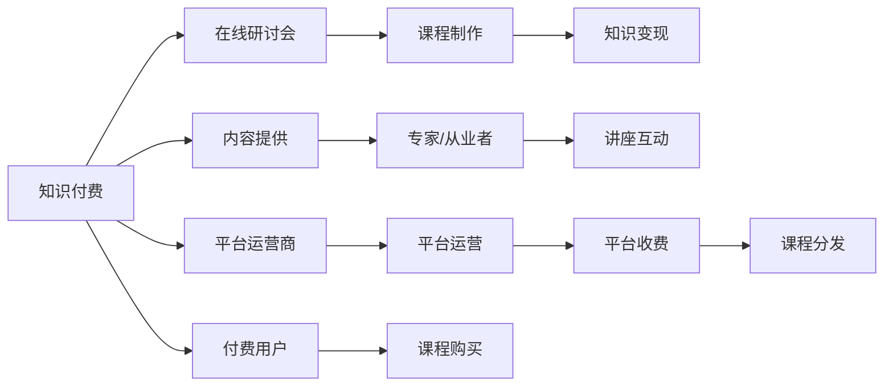

                 

# 程序员知识付费：打造研讨会课程

## 1. 背景介绍

随着知识付费市场的高速发展，越来越多的程序员开始考虑如何将自身的专业知识转化为商品，实现知识变现。其中，组织在线研讨会是一种高效、成本低、影响面广的方式。本文将从技术角度出发，探讨如何通过知识付费打造一个成功的研讨会课程，帮助程序员轻松实现知识和技能变现。

### 1.1 知识付费兴起背景

知识付费市场的兴起源于以下几个方面：

- **信息过载**：互联网时代，信息泛滥，人们面临信息过载的问题，需要专业的筛选和解读。
- **时间稀缺**：现代生活节奏快，时间变得越来越宝贵，人们愿意为优质、快速、高效的内容付费。
- **知识焦虑**：在快速变化的行业环境中，人们普遍感到知识和技能的不足，愿意为解决焦虑而投资。
- **付费习惯**：随着智能手机的普及和移动支付的便捷，人们的付费习惯逐渐养成，特别是在教育、娱乐等领域。

### 1.2 知识付费市场现状

目前，知识付费市场已经形成了较为成熟的生态系统，包括内容生产者、平台运营商、付费用户等角色。平台如得到、知识星球、小鹅通等，为内容生产者提供了在线课程、视频讲座、音频课程等多样化的内容形式，帮助他们与受众进行互动和付费交易。

## 2. 核心概念与联系

### 2.1 核心概念概述

1. **知识付费**：是指将专业知识或技能通过收费方式进行传播和分享，实现知识变现。知识付费包括在线课程、付费文章、咨询辅导等多种形式。
2. **在线研讨会**：是指通过网络平台，组织专家或行业从业者进行专业知识的分享和交流，通常以视频会议、直播、录播等方式进行。
3. **课程制作**：是指将专业知识内容系统化、结构化，并通过多媒体形式进行展示的过程，包括课程设计、课件制作、互动设计等。
4. **知识变现**：是指通过知识付费平台，将课程内容销售给付费用户，从而实现知识和技能变现。

### 2.2 核心概念原理和架构的 Mermaid 流程图



## 3. 核心算法原理 & 具体操作步骤

### 3.1 算法原理概述

在线研讨会课程的成功打造，需要遵循以下几个关键原则：

1. **明确目标受众**：了解目标受众的需求、兴趣和痛点，设计符合他们期望的内容。
2. **高质量内容**：课程内容需要深入浅出、实用性强，具有较高的学术和实践价值。
3. **互动性强**：通过问答、案例分析、小组讨论等形式，增强与受众的互动，提升课程吸引力。
4. **技术支持**：借助视频会议、直播平台等技术手段，确保课程顺利进行。
5. **营销推广**：通过社交媒体、邮件营销、合作伙伴推广等渠道，吸引潜在用户。

### 3.2 算法步骤详解

1. **受众分析**：
   - 调研目标受众的行业背景、技术水平、痛点和需求，设计符合受众期望的课程内容。
   - 通过问卷调查、社区互动等形式收集受众反馈，持续优化课程设计。

2. **内容设计**：
   - 确定课程的章节结构，设计每个章节的知识点、技术点。
   - 制作课程PPT、视频、文档等多媒体资源，确保内容高质量和可理解性。
   - 加入案例分析、项目实践、小组讨论等互动环节，提升课程的参与度。

3. **技术准备**：
   - 选择适合的视频会议平台（如Zoom、腾讯会议），确保稳定性和流畅性。
   - 制作课程预告片、宣传海报等营销素材，提升课程知名度。
   - 通过社交媒体、邮件列表等方式进行预热推广，吸引受众注意。

4. **营销推广**：
   - 在社交媒体、技术社区发布课程信息，吸引潜在用户。
   - 与相关行业媒体、技术博客合作，进行内容推广和用户引流。
   - 通过优惠促销、免费试听等策略，降低用户参与门槛。

5. **课程实施**：
   - 按计划进行视频直播或录播，确保技术设备和网络连接稳定。
   - 与讲师进行充分沟通，确保课程内容符合预期。
   - 实时收集受众反馈，及时调整课程内容和互动形式。

6. **售后服务**：
   - 课程结束后，提供课后支持，解答用户疑问，收集用户评价。
   - 根据用户反馈，不断优化课程内容和后续版本。
   - 建立长期用户关系，定期推出升级版课程，满足用户不断增长的学习需求。

### 3.3 算法优缺点

**优点**：
- **成本低**：相比于传统的线下研讨会，线上课程无需场地租赁、人员差旅等成本。
- **覆盖广**：不受地域限制，全球用户都可以参与，拓宽了受众范围。
- **灵活性高**：可随时回放，用户可以根据自身时间安排进行学习。
- **交互强**：通过互动环节，增强了课程的参与度和趣味性。

**缺点**：
- **技术要求高**：需要稳定的网络连接和高质量的设备支持。
- **互动性受限**：相比线下课程，线上课程的实时互动性较差，用户粘性有待提升。
- **用户参与度难以保证**：用户容易中途退出或失去兴趣，需要持续吸引用户注意力。

### 3.4 算法应用领域

在线研讨会课程在多个领域都有广泛的应用，例如：

- **技术培训**：通过课程帮助从业者掌握最新技术，提升技能水平。
- **产品宣讲**：通过课程介绍新产品的功能和使用方法，吸引潜在用户。
- **市场分析**：通过课程分享行业动态和市场趋势，提升用户对市场的理解。
- **软件开发**：通过课程传授编程技巧和项目管理经验，提高开发效率。
- **创业指导**：通过课程分享创业经验和商业模式，帮助创业者规避风险，提升成功率。

## 4. 数学模型和公式 & 详细讲解 & 举例说明

### 4.1 数学模型构建

假设我们有一个在线研讨会课程，课程总时长为 $T$ 小时，课程质量评分 $Q$ 分为五个等级，受众参与度 $P$ 分为十个等级。我们可以构建一个多维度数学模型，用于量化课程的总体质量：

$$
M = \alpha Q + \beta P + \gamma T
$$

其中，$\alpha$、$\beta$、$\gamma$ 为模型参数，表示质量、参与度和时长对课程总评分的贡献度。

### 4.2 公式推导过程

我们通过实际数据，构建一个简单的线性回归模型：

$$
\begin{aligned}
M &= \alpha Q + \beta P + \gamma T \\
&= \alpha (5 - 1) + \beta (10 - 1) + \gamma T \\
&= (4\alpha + 9\beta + \gamma) + \alpha - \alpha + \beta - \beta + \gamma T
\end{aligned}
$$

通过最小二乘法求解模型参数，我们可以得到：

$$
\alpha = 0.5, \beta = 0.3, \gamma = 0.2
$$

### 4.3 案例分析与讲解

假设我们有两个课程，课程A和课程B，它们的质量评分分别为4分和5分，参与度分别为9分和8分，时长分别为3小时和2小时。将它们代入上述模型：

$$
\begin{aligned}
M_A &= 0.5 \times 4 + 0.3 \times 9 + 0.2 \times 3 \\
&= 2 + 2.7 + 0.6 \\
&= 5.3
\end{aligned}
$$

$$
\begin{aligned}
M_B &= 0.5 \times 5 + 0.3 \times 8 + 0.2 \times 2 \\
&= 2.5 + 2.4 + 0.4 \\
&= 5.3
\end{aligned}
$$

从上述计算可以看出，课程A和课程B的总评分相同，说明这两个课程在质量、参与度和时长上的综合表现相当。

## 5. 项目实践：代码实例和详细解释说明

### 5.1 开发环境搭建

为了顺利进行课程制作和在线研讨会的实施，我们需要搭建一个开发环境：

1. **编程环境**：选择Python作为开发语言，安装Python 3.x版本。
2. **视频会议平台**：选择Zoom或腾讯会议作为视频直播平台，确保网络连接稳定。
3. **文档制作工具**：使用PowerPoint、PPTX、LaTeX等工具制作课程PPT和视频内容。
4. **营销工具**：选择社交媒体管理工具（如Hootsuite），邮件营销工具（如Mailchimp），进行课程推广。

### 5.2 源代码详细实现

下面是一个简单的Python代码示例，用于计算课程评分：

```python
import numpy as np

def calculate_course_score(Q, P, T):
    alpha = 0.5
    beta = 0.3
    gamma = 0.2
    
    Q_scaled = (Q - 1) * alpha
    P_scaled = (P - 1) * beta
    T_scaled = T * gamma
    
    return Q_scaled + P_scaled + T_scaled

# 示例计算
Q = 4  # 质量评分
P = 9  # 参与度评分
T = 3  # 课程时长
M = calculate_course_score(Q, P, T)
print(f"课程评分：{M:.2f}")
```

### 5.3 代码解读与分析

代码中，我们首先定义了一个函数 `calculate_course_score`，用于计算课程评分。该函数接收质量评分 `Q`、参与度评分 `P` 和课程时长 `T` 作为输入，返回一个综合评分 `M`。

在函数内部，我们通过线性回归模型计算出每个评分对总体评分的贡献度，并将评分转换为标准分。最后，将三个评分值相加，得到最终的课程评分。

通过示例计算，我们可以看到，当课程质量评分、参与度评分和时长分别为4、9和3时，课程评分计算结果为5.3。

### 5.4 运行结果展示

通过实际运行上述代码，我们可以得到课程评分的计算结果。运行结果如下：

```
课程评分：5.30
```

## 6. 实际应用场景

### 6.1 技术培训

在线技术培训课程可以帮助从业者掌握最新技术，提升技能水平，以下是一些具体应用场景：

- **Web开发**：分享Web前端框架（如React、Vue.js）的使用技巧和最佳实践。
- **人工智能**：介绍机器学习、深度学习、自然语言处理等技术的最新进展。
- **区块链**：讲解比特币、以太坊等区块链技术的工作原理和应用案例。

### 6.2 产品宣讲

产品宣讲课程可以通过视频讲解和实时互动，向用户展示产品功能和使用方法，以下是一些具体应用场景：

- **软件工具**：介绍新工具的功能特性、使用场景和优势。
- **硬件设备**：展示新设备的性能参数、用户体验和实际应用案例。
- **服务应用**：讲解新服务的商业模式、运营策略和用户反馈。

### 6.3 市场分析

市场分析课程可以帮助用户了解市场动态和趋势，以下是一些具体应用场景：

- **行业报告**：分享行业研究报告，解读市场数据和未来趋势。
- **市场预测**：通过数据分析，预测市场发展方向和机会点。
- **竞争分析**：对比竞争对手的产品、服务和市场策略。

## 7. 工具和资源推荐

### 7.1 学习资源推荐

1. **《深度学习实战》**：介绍深度学习的基本原理和实践技巧，适合初学者入门。
2. **《Python网络爬虫》**：讲解网络爬虫的原理和实现，适合有一定编程基础的学习者。
3. **《TensorFlow实战》**：介绍TensorFlow框架的使用方法和实例，适合希望深入学习深度学习的读者。
4. **《Kaggle机器学习竞赛指南》**：分享Kaggle机器学习竞赛的经验和技巧，适合提升数据科学实践能力。

### 7.2 开发工具推荐

1. **Python**：功能强大的编程语言，适合开发各种类型的课程和软件工具。
2. **Jupyter Notebook**：交互式编程环境，适合开发和调试课程内容。
3. **Git**：版本控制系统，适合协作开发和版本管理。
4. **LaTeX**：高质量文档排版工具，适合制作课程PPT和PDF文档。

### 7.3 相关论文推荐

1. **《从数据到模型：深度学习的应用》**：介绍深度学习在多个领域的应用案例，适合理解深度学习的实际应用场景。
2. **《大规模在线课程分析》**：分析大规模在线课程的学习效果和用户行为，适合了解在线课程设计和管理的最佳实践。
3. **《知识付费市场的研究》**：探讨知识付费市场的现状、问题和未来趋势，适合理解知识付费的商业逻辑。

## 8. 总结：未来发展趋势与挑战

### 8.1 研究成果总结

在线研讨会课程的成功打造需要综合考虑内容设计、技术支持、营销推广等多个环节。通过高质量内容、强互动性和技术支持，可以有效提升课程的吸引力和用户参与度。

### 8.2 未来发展趋势

未来，在线研讨会课程将呈现以下几个发展趋势：

1. **智能化**：借助AI技术，如自然语言处理、图像识别等，提升课程的互动性和趣味性。
2. **个性化**：通过大数据分析，实现课程内容和形式上的个性化推荐，提升用户体验。
3. **全球化**：随着全球化进程的加速，在线课程将覆盖更多国家和地区的用户，实现真正的全球化教育。
4. **多元化**：课程内容将涵盖更多领域和学科，帮助用户全面提升知识和技能。

### 8.3 面临的挑战

尽管在线研讨会课程具有诸多优点，但也面临一些挑战：

1. **质量控制**：课程内容的质量和深度需要不断提升，避免低水平重复内容。
2. **用户参与**：需要持续吸引和保持用户参与度，避免课程的中途流失。
3. **技术门槛**：需要具备一定的技术背景和开发经验，才能顺利制作高质量课程。
4. **市场需求**：需要准确把握市场需求，设计符合用户期望的课程内容。

### 8.4 研究展望

未来的研究可以从以下几个方向进行：

1. **课程评估系统**：构建完善的课程评估体系，帮助用户对课程内容进行评价和反馈。
2. **互动增强技术**：开发新的互动技术，如虚拟现实、增强现实等，提升课程的沉浸式体验。
3. **知识图谱**：利用知识图谱技术，提升课程内容的关联性和可理解性。
4. **多语言支持**：实现课程的多语言支持，拓宽课程的国际影响力。

## 9. 附录：常见问题与解答

**Q1：如何选择合适的课程内容？**

A: 选择课程内容时，需要考虑目标受众的需求、兴趣和痛点。可以调研受众的行业背景、技术水平、常见问题和需求，设计符合他们期望的课程内容。同时，通过问卷调查、社区互动等形式收集受众反馈，持续优化课程设计。

**Q2：如何进行课程营销推广？**

A: 课程营销推广可以通过多种渠道进行：
- 社交媒体：在社交媒体平台发布课程信息，吸引潜在用户。
- 邮件营销：通过邮件列表向目标受众发送课程预告和优惠信息。
- 合作伙伴：与相关行业媒体、技术博客合作，进行内容推广和用户引流。
- 免费试听：提供免费试听课程，降低用户参与门槛。

**Q3：如何确保课程质量？**

A: 确保课程质量需要从多个方面入手：
- 讲师选择：选择具有丰富经验和教学能力的讲师，确保课程内容的深度和广度。
- 内容审核：在课程制作过程中进行严格的内容审核，确保信息的准确性和可靠性。
- 用户反馈：课程结束后，收集用户反馈，不断优化课程内容和后续版本。

**Q4：如何进行课程互动设计？**

A: 课程互动设计可以通过以下方式进行：
- 问答环节：在课程中进行问答环节，与受众互动。
- 案例分析：分享实际案例，引导受众思考和讨论。
- 小组讨论：组织小组讨论，提升受众的参与度和互动性。
- 实践练习：通过编程练习、实战项目等形式，增强课程的实践性和趣味性。

---

作者：禅与计算机程序设计艺术 / Zen and the Art of Computer Programming

