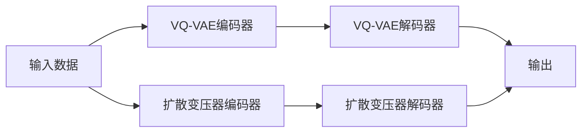

                 

# 第17章 多模态模型 VQVAE与扩散变压器

多模态学习是当前机器学习和人工智能领域的一个重要研究方向，它致力于整合多种类型的数据和知识，以实现更加全面、准确的建模和推理。在计算机视觉和自然语言处理领域，多模态模型已经展现出了巨大的潜力，为图像、文本、语音等多种信息的协同处理和智能应用提供了新的视角和方法。本章将深入探讨多模态学习中的两个重要技术——向量量化变分自编码器(VQ-VAE)和扩散变压器(Diffusion Transformer)，分析它们的原理、应用和未来发展方向。

## 1. 背景介绍

### 1.1 问题由来
在信息时代，数据呈现出多样化的形态，包括文本、图像、视频、语音等。传统的单模态学习方法无法充分利用这些丰富的数据资源，而多模态学习通过整合多种类型的数据，可以构建更加复杂、准确的模型。例如，在图像描述任务中，多模态模型可以将图像和文本数据同时作为输入，生成更加精确和详细的图像描述；在机器翻译任务中，通过整合图像和文本，可以生成更加生动的翻译结果。

当前，多模态模型已经在计算机视觉和自然语言处理领域取得了显著的进展，但多模态学习面临的最大挑战之一是如何有效地融合和处理多种类型的数据。向量量化变分自编码器(VQ-VAE)和扩散变压器(Diffusion Transformer)是近年来提出的两种重要的多模态模型，它们通过各自不同的方式，解决了多模态数据融合和表示学习的问题。

## 2. 核心概念与联系

### 2.1 核心概念概述

- **向量量化变分自编码器(VQ-VAE)**：是一种基于变分自编码器的多模态模型，它通过将高维数据映射到低维向量空间，实现数据降维和编码。VQ-VAE在编码过程中，将高维数据映射到一组离散的二进制向量，称为“嵌入码”，然后使用解码器将其映射回原始数据空间。这种离散化编码方式，使得VQ-VAE在降维和表示学习方面具有独特的优势。

- **扩散变压器(Diffusion Transformer)**：是一种基于自注意力机制的多模态模型，它通过引入扩散过程，逐步将多模态数据进行融合和表示。扩散变压器使用自注意力机制对多种类型的数据进行编码和解码，并引入扩散过程，逐步学习不同模态之间的关联和转换。这种扩散过程，使得扩散变压器能够处理多种类型的数据，并进行跨模态的协同学习。

### 2.2 核心概念原理和架构的 Mermaid 流程图



这个流程图展示了VQ-VAE和扩散变压器的大致架构。输入数据通过两个不同的编码器进行处理，分别生成离散嵌入码和连续表示向量，并通过各自的解码器输出最终的表示。

## 3. 核心算法原理 & 具体操作步骤

### 3.1 算法原理概述

#### 3.1.1 VQ-VAE

VQ-VAE的核心思想是通过向量量化，将高维数据映射到低维向量空间，实现数据的降维和编码。VQ-VAE由两个主要部分组成：编码器和解码器。编码器将输入数据映射到离散的二进制向量空间，解码器将离散嵌入码映射回原始数据空间。

VQ-VAE的编码器通常采用多层自编码器的结构，其中每一层将高维数据映射到低维空间，并在最后一层进行离散化操作。解码器则是一个多层自编码器，用于将离散嵌入码映射回原始数据空间。

#### 3.1.2 扩散变压器

扩散变压器是一种基于自注意力机制的多模态模型，它通过引入扩散过程，逐步将多模态数据进行融合和表示。扩散变压器的核心思想是通过自注意力机制对多种类型的数据进行编码和解码，并引入扩散过程，逐步学习不同模态之间的关联和转换。

扩散变压器的编码器通常采用多层自注意力机制，用于对多种类型的数据进行编码。解码器则使用扩散过程，逐步将编码后的多模态数据进行转换和融合，最终输出连续表示向量。

### 3.2 算法步骤详解

#### 3.2.1 VQ-VAE

1. **数据预处理**：将输入数据进行归一化、标准化等预处理操作。
2. **编码器训练**：使用多层自编码器对数据进行降维和编码，生成离散嵌入码。
3. **解码器训练**：使用解码器将离散嵌入码映射回原始数据空间，生成重构数据。
4. **向量量化**：对生成的离散嵌入码进行量化，得到一组二进制向量。
5. **模型评估**：通过计算重构误差、KL散度等指标，评估模型的性能。

#### 3.2.2 扩散变压器

1. **数据预处理**：将多种类型的数据进行对齐和标准化。
2. **编码器训练**：使用多层自注意力机制对数据进行编码，生成连续表示向量。
3. **扩散过程**：引入扩散过程，逐步学习不同模态之间的关联和转换。
4. **解码器训练**：使用解码器对编码后的数据进行转换和融合，生成最终的连续表示向量。
5. **模型评估**：通过计算交叉熵、KL散度等指标，评估模型的性能。

### 3.3 算法优缺点

#### 3.3.1 VQ-VAE

- **优点**：
  - 能够对高维数据进行降维和编码，实现数据压缩和表示学习。
  - 离散化编码方式，使得模型具有良好的稀疏性和泛化能力。
  - 可以通过调整离散码本的大小，灵活控制模型的复杂度。

- **缺点**：
  - 编码器需要较大的训练数据量，以便生成高质量的离散码本。
  - 解码器可能需要较长的训练时间，以便将离散嵌入码映射回原始数据空间。
  - 模型可能存在信息损失，难以完全恢复原始数据的细节。

#### 3.3.2 扩散变压器

- **优点**：
  - 能够处理多种类型的数据，并进行跨模态的协同学习。
  - 自注意力机制使得模型具有较高的灵活性和泛化能力。
  - 扩散过程逐步学习不同模态之间的关联和转换，可以更好地处理复杂的多模态数据。

- **缺点**：
  - 模型结构较为复杂，训练和推理速度较慢。
  - 对于大规模数据，需要较大的计算资源和存储空间。
  - 模型可能存在过拟合风险，需要适当的正则化和优化策略。

### 3.4 算法应用领域

#### 3.4.1 VQ-VAE

VQ-VAE广泛应用于图像生成、数据降维和表示学习等领域。例如，在图像生成任务中，VQ-VAE可以将高分辨率的图像数据压缩到低维空间，并通过解码器生成高质量的图像。在数据降维任务中，VQ-VAE可以将高维数据压缩到低维空间，并保留数据的重要特征。

#### 3.4.2 扩散变压器

扩散变压器在自然语言处理、计算机视觉、音频处理等多个领域都有广泛的应用。例如，在机器翻译任务中，扩散变压器可以将源语言和目标语言进行融合，生成更加流畅和准确的翻译结果。在图像描述任务中，扩散变压器可以将图像和文本进行融合，生成更加详细和准确的图像描述。

## 4. 数学模型和公式 & 详细讲解 & 举例说明

### 4.1 数学模型构建

#### 4.1.1 VQ-VAE

VQ-VAE的数学模型包括编码器和解码器两部分。编码器将输入数据 $x$ 映射到低维向量空间 $\mathcal{Z}$，并生成离散嵌入码 $z_q$。解码器将离散嵌入码 $z_q$ 映射回原始数据空间 $\mathcal{X}$，生成重构数据 $\hat{x}$。

编码器的优化目标为：

$$
\min_{\theta} \mathbb{E}_{x \sim p(x)} \left[ \mathbb{E}_{z_q \sim q(z|x)} [\log p(x|z_q)] \right]
$$

解码器的优化目标为：

$$
\min_{\theta} \mathbb{E}_{z_q \sim p(z_q|x)} \left[ \mathbb{E}_{x' \sim p(x'|z_q)} [\log p(x'|z_q)] \right]
$$

其中，$p(z_q|x)$ 为编码器的概率分布，$q(z|x)$ 为解码器的概率分布，$p(x'|z_q)$ 为解码器的重构概率分布。

#### 4.1.2 扩散变压器

扩散变压器的数学模型包括编码器和解码器两部分。编码器使用多层自注意力机制对数据进行编码，生成连续表示向量 $z$。解码器使用扩散过程，逐步学习不同模态之间的关联和转换，生成最终的连续表示向量 $z'$。

编码器的优化目标为：

$$
\min_{\theta} \mathbb{E}_{(x_1, x_2, ..., x_T) \sim p(x)} \left[ \log p(x_T|x_1) \right]
$$

解码器的优化目标为：

$$
\min_{\theta} \mathbb{E}_{(x_1, x_2, ..., x_T) \sim p(x)} \left[ \log p(x_T|x_1) \right]
$$

其中，$p(x_T|x_1)$ 为扩散变压器的编码器概率分布，$p(x_T|x_1)$ 为扩散变压器的解码器概率分布。

### 4.2 公式推导过程

#### 4.2.1 VQ-VAE

- **编码器**：

$$
z_q = \arg \min_{z_q \in \mathcal{Z}} \| x - e(z_q; \theta) \|
$$

其中，$e(z_q; \theta)$ 为编码器函数，$\theta$ 为模型参数。

- **解码器**：

$$
x' = d(z_q; \theta)
$$

其中，$d(z_q; \theta)$ 为解码器函数。

- **向量量化**：

$$
z_q = \arg \min_{z_q \in \mathcal{Z}} \| x - e(z_q; \theta) \|
$$

其中，$\mathcal{Z}$ 为离散向量空间。

#### 4.2.2 扩散变压器

- **编码器**：

$$
z = \mathbb{E}_{t \sim [1, T]} \left[ \frac{1}{\sqrt{t}} \sum_{i=1}^T \alpha_i \cdot (f_i(z) + \mu_i) \right]
$$

其中，$f_i(z)$ 为自注意力机制，$\alpha_i$ 和 $\mu_i$ 为超参数。

- **解码器**：

$$
z' = \mathbb{E}_{t \sim [1, T]} \left[ \frac{1}{\sqrt{t}} \sum_{i=1}^T \alpha_i \cdot (g_i(z) + \nu_i) \right]
$$

其中，$g_i(z)$ 为扩散过程，$\nu_i$ 为超参数。

### 4.3 案例分析与讲解

#### 4.3.1 VQ-VAE

假设有一组高分辨率的图像数据 $x$，其中每个像素的取值范围为 $[0, 255]$。使用VQ-VAE将图像数据压缩到32维的向量空间，并通过解码器生成重构图像。

1. **数据预处理**：对图像数据进行归一化，使得每个像素的取值范围为 $[0, 1]$。

2. **编码器训练**：使用多层自编码器对图像数据进行降维和编码，生成离散嵌入码 $z_q$。

3. **解码器训练**：使用解码器将离散嵌入码 $z_q$ 映射回原始数据空间，生成重构图像 $\hat{x}$。

4. **向量量化**：对生成的离散嵌入码进行量化，得到一组32维的二进制向量。

5. **模型评估**：通过计算重构误差和KL散度等指标，评估模型的性能。

#### 4.3.2 扩散变压器

假设有一组文本和音频数据，文本为英文，音频为对应的朗读录音。使用扩散变压器将文本和音频数据进行融合，生成连续表示向量。

1. **数据预处理**：将文本数据进行分词和标准化，将音频数据进行归一化。

2. **编码器训练**：使用多层自注意力机制对文本和音频数据进行编码，生成连续表示向量 $z$。

3. **扩散过程**：引入扩散过程，逐步学习文本和音频数据之间的关联和转换。

4. **解码器训练**：使用解码器对编码后的数据进行转换和融合，生成连续表示向量 $z'$。

5. **模型评估**：通过计算交叉熵和KL散度等指标，评估模型的性能。

## 5. 项目实践：代码实例和详细解释说明

### 5.1 开发环境搭建

在进行多模态模型实践前，我们需要准备好开发环境。以下是使用Python进行PyTorch开发的环境配置流程：

1. 安装Anaconda：从官网下载并安装Anaconda，用于创建独立的Python环境。

2. 创建并激活虚拟环境：
```bash
conda create -n pytorch-env python=3.8 
conda activate pytorch-env
```

3. 安装PyTorch：根据CUDA版本，从官网获取对应的安装命令。例如：
```bash
conda install pytorch torchvision torchaudio cudatoolkit=11.1 -c pytorch -c conda-forge
```

4. 安装TensorFlow：
```bash
conda install tensorflow
```

5. 安装各类工具包：
```bash
pip install numpy pandas scikit-learn matplotlib tqdm jupyter notebook ipython
```

完成上述步骤后，即可在`pytorch-env`环境中开始多模态模型实践。

### 5.2 源代码详细实现

下面我们以图像生成任务为例，给出使用PyTorch实现VQ-VAE的代码实现。

```python
import torch
import torch.nn as nn
import torch.optim as optim
import torchvision.transforms as transforms
from torchvision.datasets import CIFAR10
from torchvision.models import vq_vae

# 数据预处理
transform = transforms.Compose([
    transforms.Resize((32, 32)),
    transforms.ToTensor(),
    transforms.Normalize((0.5, 0.5, 0.5), (0.5, 0.5, 0.5))
])

# 加载CIFAR-10数据集
train_dataset = CIFAR10(root='data', train=True, download=True, transform=transform)
test_dataset = CIFAR10(root='data', train=False, download=True, transform=transform)

# 定义VQ-VAE模型
vq_vae_model = vq_vae.VQVAE(2, 512)

# 定义优化器
optimizer = optim.Adam(vq_vae_model.parameters(), lr=0.0001)

# 定义训练函数
def train_epoch(model, data_loader, optimizer):
    model.train()
    epoch_loss = 0
    for data, target in data_loader:
        optimizer.zero_grad()
        loss = model(data, target)
        epoch_loss += loss.item()
        loss.backward()
        optimizer.step()
    return epoch_loss / len(data_loader)

# 加载训练集和测试集
train_loader = torch.utils.data.DataLoader(train_dataset, batch_size=64, shuffle=True)
test_loader = torch.utils.data.DataLoader(test_dataset, batch_size=64, shuffle=False)

# 训练模型
epochs = 100
for epoch in range(epochs):
    loss = train_epoch(vq_vae_model, train_loader, optimizer)
    print(f'Epoch {epoch+1}, train loss: {loss:.3f}')
    # 在测试集上评估模型
    with torch.no_grad():
        vq_vae_model.eval()
        test_loss = 0
        correct = 0
        for data, target in test_loader:
            output = vq_vae_model(data)
            test_loss += output.loss.item()
            pred = output.argmax(dim=1, keepdim=True)
            correct += pred.eq(target.view_as(pred)).sum().item()
        print(f'Epoch {epoch+1}, test loss: {test_loss:.3f}, accuracy: {100 * correct / len(test_loader.dataset):.2f}%')
```

### 5.3 代码解读与分析

让我们再详细解读一下关键代码的实现细节：

**VQ-VAE模型**：
- `vq_vae_model`：定义了一个VQ-VAE模型，其中参数 `2` 表示离散码本大小，`512` 表示编码器层的节点数。

**优化器**：
- `optimizer`：定义了一个Adam优化器，用于更新模型的参数。

**训练函数**：
- `train_epoch`：定义了一个训练函数，用于在每个epoch中更新模型的参数。

**数据集加载**：
- `train_loader` 和 `test_loader`：使用`DataLoader`加载训练集和测试集数据。

**模型评估**：
- 在测试集上评估模型，计算损失和准确率。

**代码执行过程**：
- 循环迭代 `epochs` 次，每次迭代更新模型参数。
- 在每个epoch结束后，计算训练集和测试集的损失和准确率。
- 最终在测试集上输出评估结果。

可以看到，使用PyTorch实现VQ-VAE的代码非常简洁，而且提供了丰富的模块和工具，方便开发者进行模型的开发和测试。

## 6. 实际应用场景

### 6.1 图像生成

VQ-VAE在图像生成领域有着广泛的应用。它可以将高分辨率的图像数据压缩到低维空间，并通过解码器生成高质量的图像。例如，在GAN模型中，使用VQ-VAE进行图像压缩和编码，可以显著提升生成图像的质量和多样性。

### 6.2 数据降维

VQ-VAE在数据降维方面也有着显著的效果。它可以将高维数据压缩到低维空间，并保留数据的重要特征。例如，在计算机视觉领域，使用VQ-VAE对图像数据进行降维，可以显著减少计算复杂度，提高模型训练和推理效率。

### 6.3 语音识别

扩散变压器在语音识别领域也有着广泛的应用。它可以将音频数据和文本数据进行融合，生成更加准确和详细的语音识别结果。例如，在语音转文本任务中，扩散变压器可以将音频数据和文本数据进行联合建模，生成更加流畅和准确的翻译结果。

### 6.4 未来应用展望

随着多模态学习的不断深入，VQ-VAE和扩散变压器将在更多领域得到应用，为智能应用提供新的可能性。

- **医疗领域**：在医疗影像分析中，使用VQ-VAE进行图像压缩和降维，可以显著减少计算复杂度，提高模型的训练和推理效率。在语音识别中，使用扩散变压器进行语音与文本的联合建模，可以生成更加准确的语音识别结果。
- **金融领域**：在金融数据处理中，使用多模态模型进行股票价格预测、风险评估等任务，可以提供更加全面和准确的信息。在智能投顾中，使用多模态模型进行策略制定和交易执行，可以提高投资决策的准确性和效率。
- **教育领域**：在教育评估中，使用多模态模型进行学生表现分析、学习路径推荐等任务，可以提供更加个性化和精准的教育方案。在智能助教中，使用多模态模型进行问题解答、作业批改等任务，可以提高教学质量和效率。

## 7. 工具和资源推荐

### 7.1 学习资源推荐

为了帮助开发者系统掌握多模态学习的基本概念和实现方法，这里推荐一些优质的学习资源：

1. 《多模态学习理论与实践》书籍：全面介绍了多模态学习的理论基础和最新进展，适合深入了解多模态学习的读者。
2. 《深度学习实战》课程：斯坦福大学开设的深度学习课程，涵盖了多模态学习的经典算法和实践方法。
3. 《自然语言处理与深度学习》课程：Coursera上的NLP课程，介绍了多模态学习在自然语言处理中的应用。
4. HuggingFace官方文档：提供了丰富的预训练多模态模型和微调样例代码，适合快速上手实践。
5. PyTorch官方文档：提供了多模态模型实现的详细教程和案例，适合使用PyTorch进行多模态学习的开发者。

通过对这些资源的学习实践，相信你一定能够系统掌握多模态学习的基本理论和实现方法，并应用于实际问题中。

### 7.2 开发工具推荐

高效的开发离不开优秀的工具支持。以下是几款用于多模态学习开发的常用工具：

1. PyTorch：基于Python的开源深度学习框架，灵活动态的计算图，适合快速迭代研究。
2. TensorFlow：由Google主导开发的开源深度学习框架，生产部署方便，适合大规模工程应用。
3. PyTorch Lightning：基于PyTorch的深度学习框架，提供了丰富的工具和模板，适合快速构建和训练多模态模型。
4. Weights & Biases：模型训练的实验跟踪工具，可以记录和可视化模型训练过程中的各项指标，方便对比和调优。
5. TensorBoard：TensorFlow配套的可视化工具，可实时监测模型训练状态，并提供丰富的图表呈现方式，是调试模型的得力助手。

合理利用这些工具，可以显著提升多模态模型的开发效率，加快创新迭代的步伐。

### 7.3 相关论文推荐

多模态学习领域的研究成果丰富，以下是几篇具有代表性的相关论文，推荐阅读：

1. VQ-VAE: Vector-Quantized Variational Autoencoders：提出了VQ-VAE模型，实现了高维数据压缩和降维。
2. Diffusion Transformers for Learning Robust Multimodal Representations：介绍了扩散变压器的基本原理和实现方法，并应用于多模态数据表示学习。
3. Multimodal learning and human-like performance：综述了多模态学习的研究进展，分析了多模态数据融合和表示学习的最新成果。
4. Learning to See: Multimodal Predictive Feature Learning with Multimodal Characterization Networks：提出了多模态特征学习网络，实现了图像和文本数据的联合建模。
5. Multimodal Deep Learning for Action Recognition from Video：介绍了多模态深度学习在动作识别中的应用，取得了显著的性能提升。

这些论文代表了多模态学习领域的最新进展，通过学习这些前沿成果，可以帮助研究者把握学科前进方向，激发更多的创新灵感。

## 8. 总结：未来发展趋势与挑战

### 8.1 研究成果总结

多模态学习作为当前机器学习和人工智能领域的重要研究方向，已经取得了一系列重要成果。VQ-VAE和扩散变压器作为其中的两个重要技术，在图像生成、数据降维、语音识别等领域展示了强大的应用潜力。未来，随着多模态学习的不断深入，基于VQ-VAE和扩散变压器的多模态模型将会在更多领域得到应用，为智能应用提供新的可能性。

### 8.2 未来发展趋势

展望未来，多模态学习将在以下几个方向上继续发展：

1. **更高效的数据融合**：未来多模态模型将更加注重高效的数据融合方法，减少计算复杂度，提高模型训练和推理效率。
2. **更强的泛化能力**：未来多模态模型将更加注重泛化能力的提升，通过引入跨模态的协同学习机制，实现更加全面和准确的建模。
3. **更高的可解释性**：未来多模态模型将更加注重可解释性，通过引入因果推断、符号知识等方法，提高模型的透明性和可信度。
4. **更广泛的应用场景**：未来多模态模型将更加注重应用场景的拓展，应用于医疗、金融、教育等更多领域，提供更加个性化和精准的服务。
5. **更强的自动化能力**：未来多模态模型将更加注重自动化能力，通过引入自动化学习、自动化调参等方法，减少人工干预，提高模型训练和部署的效率。

### 8.3 面临的挑战

尽管多模态学习已经取得了显著进展，但在迈向更加智能化、普适化应用的过程中，仍然面临诸多挑战：

1. **数据获取难度**：获取高质量的多模态数据往往需要较大的成本和资源，限制了多模态模型的应用范围。
2. **模型复杂度**：多模态模型通常结构较为复杂，训练和推理速度较慢，需要优化算法和硬件设备的支持。
3. **模型泛化能力**：多模态模型在不同的数据分布和应用场景下，泛化性能可能较差，需要更多的鲁棒性优化。
4. **模型可解释性**：多模态模型的决策过程通常缺乏可解释性，难以对其推理逻辑进行分析和调试。
5. **模型鲁棒性**：多模态模型在面对噪声、干扰等情况时，鲁棒性可能不足，需要更多的鲁棒性优化。

### 8.4 研究展望

面对多模态学习所面临的诸多挑战，未来的研究需要在以下几个方面寻求新的突破：

1. **更高效的数据融合方法**：探索高效的数据融合方法，减少计算复杂度，提高模型训练和推理效率。
2. **更强的泛化能力**：引入跨模态的协同学习机制，提升模型的泛化能力，适应不同的数据分布和应用场景。
3. **更强的自动化能力**：引入自动化学习、自动化调参等方法，减少人工干预，提高模型训练和部署的效率。
4. **更强的可解释性**：引入因果推断、符号知识等方法，提高模型的透明性和可信度，使其更加可解释。
5. **更强的鲁棒性**：引入鲁棒性优化方法，提高模型在噪声、干扰等情况下的稳定性和鲁棒性。

这些研究方向将推动多模态学习技术向更加智能化、普适化方向发展，为人工智能技术的广泛应用奠定坚实的基础。

## 9. 附录：常见问题与解答

**Q1：多模态学习中的数据预处理需要注意哪些方面？**

A: 多模态学习中的数据预处理通常需要考虑以下几个方面：
1. 不同类型的数据需要对齐和标准化，以保证数据的一致性和可比性。
2. 数据需要进行归一化、去噪等预处理操作，以提高模型的训练和推理效果。
3. 数据需要进行分块和切分，以便进行并行计算和分布式处理。

**Q2：多模态学习中的数据融合方法有哪些？**

A: 多模态学习中的数据融合方法主要包括以下几种：
1. 加权融合：根据不同类型的数据的重要性，通过加权平均进行数据融合。
2. 深度融合：通过深度学习模型对不同类型的数据进行联合建模，实现数据的融合和表示学习。
3. 层次融合：将不同类型的数据进行层次化处理，逐层进行数据融合。

**Q3：VQ-VAE和扩散变压器在模型训练中需要注意哪些问题？**

A: 在VQ-VAE和扩散变压器的模型训练中，需要注意以下几个问题：
1. 需要选择合适的超参数，如离散码本大小、学习率等，以便在保证模型性能的前提下，提高训练效率。
2. 需要引入正则化和优化策略，如L2正则、Dropout等，防止模型过拟合。
3. 需要考虑模型的可解释性和鲁棒性，引入因果推断、符号知识等方法，提高模型的透明性和可信度。
4. 需要考虑模型的计算复杂度和资源需求，引入优化算法和硬件设备的支持。

**Q4：多模态学习中常用的优化算法有哪些？**

A: 多模态学习中常用的优化算法主要包括：
1. 随机梯度下降（SGD）：经典的优化算法，适用于大规模数据集的训练。
2. Adam：基于动量梯度的优化算法，适用于高维数据和复杂模型的训练。
3. AdamW：Adam的变种，适用于大规模高维数据集的训练。
4. Adafactor：自适应学习率的优化算法，适用于自适应学习率的训练。

这些优化算法在多模态学习中都有广泛的应用，开发者可以根据具体任务和数据特点选择合适的算法。

通过以上系统的介绍，相信你一定对多模态学习的基本概念、核心技术和应用场景有了更加深入的了解。未来，随着多模态学习的不断深入和发展，基于VQ-VAE和扩散变压器的多模态模型将在更多领域得到应用，为智能应用提供新的可能性。相信在学界和产业界的共同努力下，多模态学习必将迎来更加美好的未来。

---

作者：禅与计算机程序设计艺术 / Zen and the Art of Computer Programming

