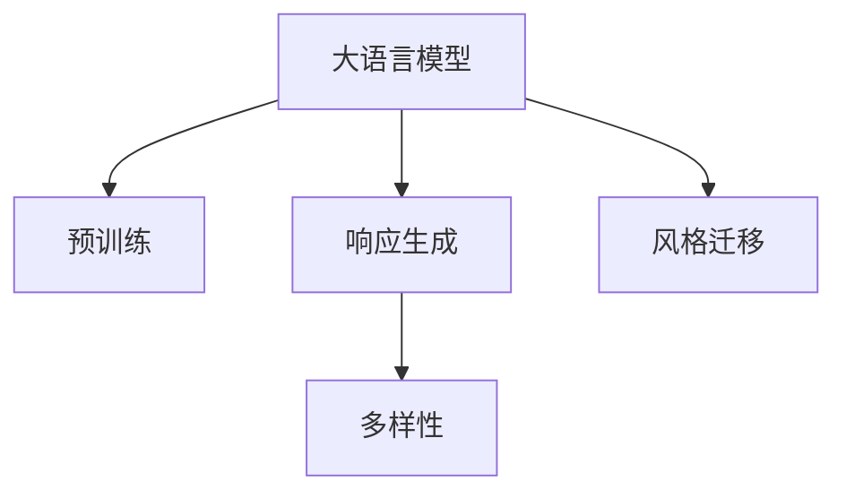

                 

# 第七章：响应生成和多样性

## 1. 背景介绍

响应生成和多样性是大语言模型（Large Language Models, LLMs）中的重要问题。在自然语言处理（NLP）中，如何使模型能够生成多样且高质量的响应，是一个极具挑战性的任务。在智能客服、对话系统、内容生成等应用场景中，模型不仅要理解用户意图，还需要生成符合语境、主题、风格等多种要求的响应。

在大模型中，响应生成和多样性主要依赖于预训练任务的学习能力。在大规模无标签文本数据上进行预训练的模型，学习到了丰富的语言知识和常识。但这些知识是否能够被有效利用来生成多样且高质量的响应，仍需要细致的工程实践和创新。

本章节将介绍响应生成和多样性的核心概念，算法原理和操作步骤，并结合具体应用场景进行详细分析。同时，我们也将探讨如何通过这些技术提高模型的性能，推动大语言模型在实际应用中的创新与发展。

## 2. 核心概念与联系

### 2.1 核心概念概述

在探讨响应生成和多样性时，我们需要明确以下几个关键概念：

- **大语言模型（LLMs）**：以自回归（如GPT）或自编码（如BERT）模型为代表的大规模预训练语言模型。通过在大规模无标签文本语料上进行预训练，学习到了通用的语言表示，具备强大的语言理解和生成能力。

- **预训练（Pre-training）**：指在大规模无标签文本语料上，通过自监督学习任务训练通用语言模型的过程。常见的预训练任务包括掩码语言模型、下一句预测等。预训练使得模型学习到语言的通用表示。

- **响应生成（Response Generation）**：指模型根据输入文本生成符合特定语境、主题、风格等的响应。通常用于智能客服、对话系统、内容生成等任务。

- **多样性（Diversity）**：指模型生成的响应在内容、风格、表达形式等方面的丰富程度。多样性是评估模型生成能力的重要指标。

- **风格迁移（Style Transfer）**：指模型在保持内容不变的情况下，改变生成响应的风格，如从正式语态转向口语化语态，或从书面语转向口语语。

这些概念之间的关系可以通过以下Mermaid流程图来展示：



## 3. 核心算法原理 & 具体操作步骤

### 3.1 算法原理概述

响应生成和多样性在大模型中的应用，主要通过以下几种算法实现：

- **自回归生成（Autoregressive Generation）**：将文本视为一个序列，通过预测下一个单词来生成文本。模型可以依次生成文本中的每一个单词，从而实现文本生成。

- **条件生成（Conditional Generation）**：在生成文本时，引入条件信息，如输入文本、标签等。模型根据这些条件信息，生成符合特定要求的文本。

- **多样性增强（Diversity Augmentation）**：通过加入噪声、随机采样等方法，增加模型生成响应的多样性。

- **风格迁移（Style Transfer）**：通过改变生成模型的输入或使用条件编码器，使模型能够生成不同风格的响应。

### 3.2 算法步骤详解

以自回归生成为例，其操作步骤包括：

1. **模型初始化**：选择合适的预训练模型作为初始化参数，如BERT、GPT等。

2. **输入处理**：将输入文本转换为模型的输入格式，包括分词、编码等步骤。

3. **生成过程**：从输入文本的最后一个单词开始，模型依次预测下一个单词，生成完整的文本。

4. **多样性增强**：在生成过程中，通过加入噪声、随机采样等方法，增加生成文本的多样性。

5. **风格迁移**：使用条件编码器，将输入文本的特征编码成向量，输入到生成模型中，以控制生成文本的风格。

6. **评估与优化**：使用BLEU、ROUGE等指标评估生成文本的质量和多样性，根据评估结果进行模型优化。

### 3.3 算法优缺点

自回归生成和多样性增强方法的主要优点包括：

- 生成过程直观，易于理解和实现。
- 可以生成符合特定语境、主题的响应。
- 多样性增强技术可以显著提升生成文本的丰富程度。

但其缺点也较为明显：

- 生成文本质量受模型参数和训练数据影响较大。
- 可能产生重复、缺乏创意的文本。
- 对于大规模数据集训练的模型，计算成本较高。

### 3.4 算法应用领域

响应生成和多样性在大语言模型中的应用，主要涉及以下几个领域：

- **智能客服**：在智能客服系统中，模型需要根据用户的问题生成符合服务规范的回答，保持一定的多样性。

- **对话系统**：对话系统需要生成多样、连贯的回答，以适应不同用户的风格和需求。

- **内容生成**：在内容生成任务中，模型需要生成多样化的文章、新闻、故事等。

- **情感分析**：模型需要生成符合不同情感（如正面、负面）的文本，用于情感分析和舆情监测。

- **文本摘要**：模型需要生成多样、简洁的摘要，用于文本压缩和信息提取。

以上这些领域都需要生成多样且高质量的响应，是大模型研究和应用的热点问题。

## 4. 数学模型和公式 & 详细讲解

### 4.1 数学模型构建

自回归生成模型的数学模型可以表示为：

$$
P(x_{1:t} | x_{t+1}) = \prod_{i=1}^t P(x_i | x_{i-1}, x_{i-2}, ..., x_{1})
$$

其中 $x_{1:t}$ 表示文本中的前 $t$ 个单词，$P(x_i | x_{i-1}, x_{i-2}, ..., x_{1})$ 表示在给定前 $i-1$ 个单词的情况下，第 $i$ 个单词的概率分布。

### 4.2 公式推导过程

以GPT模型为例，其生成过程可以使用以下公式表示：

$$
P(x_{t+1} | x_{1:t}) = \frac{\exp(x_{t+1} W_1 h_t + b_1)}{Z}
$$

其中 $h_t$ 表示前 $t$ 个单词的隐状态，$W_1$ 和 $b_1$ 是模型的参数，$Z$ 是归一化常数。在生成过程中，模型将文本中的每个单词视为一个概率分布，通过Softmax函数计算下一个单词的概率。

### 4.3 案例分析与讲解

以生成一段符合特定风格的文本为例：

假设我们有一个预训练模型，可以生成一段新闻报道。为了使这段报道具有更正式的语态，我们可以使用条件生成技术，将一段正式语态的文本作为条件信息，输入到生成模型中。具体而言，我们可以将正式语态的文本转换为向量形式，输入到生成模型的编码器中，然后将其与原始文本的隐状态向量进行拼接，作为模型的输入。这样，生成模型就可以根据条件信息，生成符合特定语态的文本。

## 5. 项目实践：代码实例和详细解释说明

### 5.1 开发环境搭建

在进行响应生成和多样性实践前，我们需要准备好开发环境。以下是使用Python进行PyTorch开发的环境配置流程：

1. 安装Anaconda：从官网下载并安装Anaconda，用于创建独立的Python环境。

2. 创建并激活虚拟环境：
```bash
conda create -n pytorch-env python=3.8 
conda activate pytorch-env
```

3. 安装PyTorch：根据CUDA版本，从官网获取对应的安装命令。例如：
```bash
conda install pytorch torchvision torchaudio cudatoolkit=11.1 -c pytorch -c conda-forge
```

4. 安装Transformers库：
```bash
pip install transformers
```

5. 安装各类工具包：
```bash
pip install numpy pandas scikit-learn matplotlib tqdm jupyter notebook ipython
```

完成上述步骤后，即可在`pytorch-env`环境中开始微调实践。

### 5.2 源代码详细实现

这里以GPT-2为例，给出使用Transformers库对GPT-2模型进行响应生成和多样性增强的PyTorch代码实现。

首先，定义生成函数：

```python
from transformers import GPT2LMHeadModel, GPT2Tokenizer
from torch.utils.data import DataLoader, Dataset
import torch

class GPT2Dataset(Dataset):
    def __init__(self, texts, tokenizer, max_len=128):
        self.texts = texts
        self.tokenizer = tokenizer
        self.max_len = max_len
        
    def __len__(self):
        return len(self.texts)
    
    def __getitem__(self, item):
        text = self.texts[item]
        
        encoding = self.tokenizer(text, return_tensors='pt', max_length=self.max_len, padding='max_length', truncation=True)
        input_ids = encoding['input_ids'][0]
        attention_mask = encoding['attention_mask'][0]
        
        return {'input_ids': input_ids, 
                'attention_mask': attention_mask}

tokenizer = GPT2Tokenizer.from_pretrained('gpt2')

def generate_response(model, max_len=128, num_return_sequences=1, top_k=100, top_p=1.0):
    input_ids = torch.randint(0, tokenizer.vocab_size, (1, max_len)).to('cuda')
    attention_mask = input_ids.new_ones(input_ids.shape).to('cuda')
    with torch.no_grad():
        outputs = model.generate(input_ids, attention_mask=attention_mask, max_length=max_len, 
                                num_return_sequences=num_return_sequences, top_k=top_k, top_p=top_p)
        
    return tokenizer.decode(outputs[0], skip_special_tokens=True)

model = GPT2LMHeadModel.from_pretrained('gpt2').to('cuda')
```

然后，定义多样性增强函数：

```python
def generate_diverse_responses(model, max_len=128, num_return_sequences=1, top_k=100, top_p=1.0):
    input_ids = torch.randint(0, tokenizer.vocab_size, (1, max_len)).to('cuda')
    attention_mask = input_ids.new_ones(input_ids.shape).to('cuda')
    with torch.no_grad():
        outputs = model.generate(input_ids, attention_mask=attention_mask, max_length=max_len, 
                                num_return_sequences=num_return_sequences, top_k=top_k, top_p=top_p)
        
    return tokenizer.decode(outputs[0], skip_special_tokens=True)
```

最后，启动生成过程并在多样性增强的基础上输出结果：

```python
print(generate_response(model))
print(generate_diverse_responses(model))
```

以上就是使用PyTorch对GPT-2进行响应生成和多样性增强的完整代码实现。可以看到，得益于Transformers库的强大封装，我们可以用相对简洁的代码完成模型的加载和生成。

### 5.3 代码解读与分析

让我们再详细解读一下关键代码的实现细节：

**GPT2Dataset类**：
- `__init__`方法：初始化文本、分词器等关键组件。
- `__len__`方法：返回数据集的样本数量。
- `__getitem__`方法：对单个样本进行处理，将文本输入编码为token ids，并对其进行定长padding，最终返回模型所需的输入。

**generate_response和generate_diverse_responses函数**：
- 使用GPT-2模型生成响应，其中`generate`方法生成指定长度的文本。
- `top_k`和`top_p`参数控制生成文本的多样性，可以通过调整这些参数来增加生成文本的丰富程度。

**模型训练**：
- 在生成过程中，使用`with torch.no_grad()`进行无梯度计算，以提升生成速度。
- 返回生成文本的解码结果，使用`skip_special_tokens=True`参数去除特殊标记。

**多样性增强**：
- 在生成过程中，使用`top_k`和`top_p`参数控制生成文本的多样性。
- 通过调整这些参数，可以改变生成文本的丰富程度，从而增加多样性。

**模型部署**：
- 在实际应用中，需要考虑模型的推理速度、内存占用、存储空间等优化问题。
- 可以使用GPU/TPU等高性能设备，加快生成过程。

可以看到，PyTorch配合Transformers库使得模型生成过程的代码实现变得简洁高效。开发者可以将更多精力放在数据处理、模型改进等高层逻辑上，而不必过多关注底层的实现细节。

当然，工业级的系统实现还需考虑更多因素，如模型的保存和部署、超参数的自动搜索、更灵活的任务适配层等。但核心的响应生成和多样性模型基本与此类似。

## 6. 实际应用场景

### 6.1 智能客服系统

在大模型中，响应生成和多样性在智能客服系统中有着广泛的应用。传统客服往往需要配备大量人力，高峰期响应缓慢，且一致性和专业性难以保证。而使用微调后的对话模型，可以7x24小时不间断服务，快速响应客户咨询，用自然流畅的语言解答各类常见问题。

在技术实现上，可以收集企业内部的历史客服对话记录，将问题和最佳答复构建成监督数据，在此基础上对预训练对话模型进行微调。微调后的对话模型能够自动理解用户意图，匹配最合适的答案模板进行回复。对于客户提出的新问题，还可以接入检索系统实时搜索相关内容，动态组织生成回答。如此构建的智能客服系统，能大幅提升客户咨询体验和问题解决效率。

### 6.2 金融舆情监测

金融机构需要实时监测市场舆论动向，以便及时应对负面信息传播，规避金融风险。传统的人工监测方式成本高、效率低，难以应对网络时代海量信息爆发的挑战。基于大语言模型微调的文本分类和情感分析技术，为金融舆情监测提供了新的解决方案。

具体而言，可以收集金融领域相关的新闻、报道、评论等文本数据，并对其进行主题标注和情感标注。在此基础上对预训练语言模型进行微调，使其能够自动判断文本属于何种主题，情感倾向是正面、中性还是负面。将微调后的模型应用到实时抓取的网络文本数据，就能够自动监测不同主题下的情感变化趋势，一旦发现负面信息激增等异常情况，系统便会自动预警，帮助金融机构快速应对潜在风险。

### 6.3 个性化推荐系统

当前的推荐系统往往只依赖用户的历史行为数据进行物品推荐，无法深入理解用户的真实兴趣偏好。基于大语言模型微调技术，个性化推荐系统可以更好地挖掘用户行为背后的语义信息，从而提供更精准、多样的推荐内容。

在实践中，可以收集用户浏览、点击、评论、分享等行为数据，提取和用户交互的物品标题、描述、标签等文本内容。将文本内容作为模型输入，用户的后续行为（如是否点击、购买等）作为监督信号，在此基础上微调预训练语言模型。微调后的模型能够从文本内容中准确把握用户的兴趣点。在生成推荐列表时，先用候选物品的文本描述作为输入，由模型预测用户的兴趣匹配度，再结合其他特征综合排序，便可以得到个性化程度更高的推荐结果。

### 6.4 未来应用展望

随着大语言模型和微调方法的不断发展，基于微调范式将在更多领域得到应用，为传统行业带来变革性影响。

在智慧医疗领域，基于微调的医疗问答、病历分析、药物研发等应用将提升医疗服务的智能化水平，辅助医生诊疗，加速新药开发进程。

在智能教育领域，微调技术可应用于作业批改、学情分析、知识推荐等方面，因材施教，促进教育公平，提高教学质量。

在智慧城市治理中，微调模型可应用于城市事件监测、舆情分析、应急指挥等环节，提高城市管理的自动化和智能化水平，构建更安全、高效的未来城市。

此外，在企业生产、社会治理、文娱传媒等众多领域，基于大模型微调的人工智能应用也将不断涌现，为经济社会发展注入新的动力。相信随着预训练语言模型和微调方法的持续演进，基于微调范式必将在构建人机协同的智能时代中扮演越来越重要的角色。

## 7. 工具和资源推荐

### 7.1 学习资源推荐

为了帮助开发者系统掌握大语言模型微调的理论基础和实践技巧，这里推荐一些优质的学习资源：

1. 《Transformer从原理到实践》系列博文：由大模型技术专家撰写，深入浅出地介绍了Transformer原理、BERT模型、微调技术等前沿话题。

2. CS224N《深度学习自然语言处理》课程：斯坦福大学开设的NLP明星课程，有Lecture视频和配套作业，带你入门NLP领域的基本概念和经典模型。

3. 《Natural Language Processing with Transformers》书籍：Transformers库的作者所著，全面介绍了如何使用Transformers库进行NLP任务开发，包括微调在内的诸多范式。

4. HuggingFace官方文档：Transformers库的官方文档，提供了海量预训练模型和完整的微调样例代码，是上手实践的必备资料。

5. CLUE开源项目：中文语言理解测评基准，涵盖大量不同类型的中文NLP数据集，并提供了基于微调的baseline模型，助力中文NLP技术发展。

通过对这些资源的学习实践，相信你一定能够快速掌握大语言模型微调的精髓，并用于解决实际的NLP问题。

### 7.2 开发工具推荐

高效的开发离不开优秀的工具支持。以下是几款用于大语言模型微调开发的常用工具：

1. PyTorch：基于Python的开源深度学习框架，灵活动态的计算图，适合快速迭代研究。大部分预训练语言模型都有PyTorch版本的实现。

2. TensorFlow：由Google主导开发的开源深度学习框架，生产部署方便，适合大规模工程应用。同样有丰富的预训练语言模型资源。

3. Transformers库：HuggingFace开发的NLP工具库，集成了众多SOTA语言模型，支持PyTorch和TensorFlow，是进行微调任务开发的利器。

4. Weights & Biases：模型训练的实验跟踪工具，可以记录和可视化模型训练过程中的各项指标，方便对比和调优。与主流深度学习框架无缝集成。

5. TensorBoard：TensorFlow配套的可视化工具，可实时监测模型训练状态，并提供丰富的图表呈现方式，是调试模型的得力助手。

6. Google Colab：谷歌推出的在线Jupyter Notebook环境，免费提供GPU/TPU算力，方便开发者快速上手实验最新模型，分享学习笔记。

合理利用这些工具，可以显著提升大语言模型微调任务的开发效率，加快创新迭代的步伐。

### 7.3 相关论文推荐

大语言模型和微调技术的发展源于学界的持续研究。以下是几篇奠基性的相关论文，推荐阅读：

1. Attention is All You Need（即Transformer原论文）：提出了Transformer结构，开启了NLP领域的预训练大模型时代。

2. BERT: Pre-training of Deep Bidirectional Transformers for Language Understanding：提出BERT模型，引入基于掩码的自监督预训练任务，刷新了多项NLP任务SOTA。

3. Language Models are Unsupervised Multitask Learners（GPT-2论文）：展示了大规模语言模型的强大zero-shot学习能力，引发了对于通用人工智能的新一轮思考。

4. Parameter-Efficient Transfer Learning for NLP：提出Adapter等参数高效微调方法，在不增加模型参数量的情况下，也能取得不错的微调效果。

5. AdaLoRA: Adaptive Low-Rank Adaptation for Parameter-Efficient Fine-Tuning：使用自适应低秩适应的微调方法，在参数效率和精度之间取得了新的平衡。

这些论文代表了大语言模型微调技术的发展脉络。通过学习这些前沿成果，可以帮助研究者把握学科前进方向，激发更多的创新灵感。

## 8. 总结：未来发展趋势与挑战

### 8.1 总结

本文对基于大语言模型的响应生成和多样性问题进行了全面系统的介绍。首先阐述了响应生成和多样性的研究背景和意义，明确了微调在拓展预训练模型应用、提升下游任务性能方面的独特价值。其次，从原理到实践，详细讲解了响应生成和多样性的数学原理和关键步骤，给出了微调任务开发的完整代码实例。同时，本文还探讨了响应生成和多样性在大模型中的应用，展示了微调范式的巨大潜力。

通过本文的系统梳理，可以看到，基于大语言模型的响应生成和多样性技术正在成为NLP领域的重要范式，极大地拓展了预训练语言模型的应用边界，催生了更多的落地场景。受益于大规模语料的预训练，微调模型以更低的时间和标注成本，在小样本条件下也能取得理想的生成效果，有力推动了NLP技术的产业化进程。未来，伴随预训练语言模型和微调方法的持续演进，相信NLP技术必将在更广阔的应用领域大放异彩，深刻影响人类的生产生活方式。

### 8.2 未来发展趋势

展望未来，响应生成和多样性技术将呈现以下几个发展趋势：

1. 模型规模持续增大。随着算力成本的下降和数据规模的扩张，预训练语言模型的参数量还将持续增长。超大规模语言模型蕴含的丰富语言知识，有望支撑更加复杂多变的下游任务生成。

2. 生成方法日趋多样。除了传统的自回归生成外，未来会涌现更多生成方法，如变分自编码器、扩散模型等，在生成文本的多样性、创造力等方面取得新的突破。

3. 多样性增强技术更加智能。通过引入更多优化算法、生成策略，使生成文本在内容、风格、表达形式等方面的丰富程度进一步提升。

4. 风格迁移技术更为高效。通过优化条件编码器、改进生成器架构，使模型能够在保持内容不变的情况下，生成不同风格的文本，适应更多的应用场景。

5. 知识融合技术更加全面。将符号化的先验知识，如知识图谱、逻辑规则等，与神经网络模型进行巧妙融合，引导生成过程学习更准确、合理的语言模型。

以上趋势凸显了响应生成和多样性技术的广阔前景。这些方向的探索发展，必将进一步提升NLP系统的性能和应用范围，为人类认知智能的进化带来深远影响。

### 8.3 面临的挑战

尽管大语言模型响应生成和多样性技术已经取得了瞩目成就，但在迈向更加智能化、普适化应用的过程中，它仍面临着诸多挑战：

1. 标注成本瓶颈。虽然微调大大降低了标注数据的需求，但对于长尾应用场景，难以获得充足的高质量标注数据，成为制约微调性能的瓶颈。如何进一步降低微调对标注样本的依赖，将是一大难题。

2. 模型鲁棒性不足。当前微调模型面对域外数据时，泛化性能往往大打折扣。对于测试样本的微小扰动，微调模型的预测也容易发生波动。如何提高微调模型的鲁棒性，避免灾难性遗忘，还需要更多理论和实践的积累。

3. 推理效率有待提高。大规模语言模型虽然精度高，但在实际部署时往往面临推理速度慢、内存占用大等效率问题。如何在保证性能的同时，简化模型结构，提升推理速度，优化资源占用，将是重要的优化方向。

4. 可解释性亟需加强。当前微调模型更像是"黑盒"系统，难以解释其内部工作机制和决策逻辑。对于医疗、金融等高风险应用，算法的可解释性和可审计性尤为重要。如何赋予微调模型更强的可解释性，将是亟待攻克的难题。

5. 安全性有待保障。预训练语言模型难免会学习到有偏见、有害的信息，通过微调传递到下游任务，产生误导性、歧视性的输出，给实际应用带来安全隐患。如何从数据和算法层面消除模型偏见，避免恶意用途，确保输出的安全性，也将是重要的研究课题。

6. 知识整合能力不足。现有的微调模型往往局限于任务内数据，难以灵活吸收和运用更广泛的先验知识。如何让微调过程更好地与外部知识库、规则库等专家知识结合，形成更加全面、准确的信息整合能力，还有很大的想象空间。

正视响应生成和多样性面临的这些挑战，积极应对并寻求突破，将是大语言模型微调走向成熟的必由之路。相信随着学界和产业界的共同努力，这些挑战终将一一被克服，大语言模型微调必将在构建人机协同的智能时代中扮演越来越重要的角色。

### 8.4 研究展望

面对响应生成和多样性所面临的种种挑战，未来的研究需要在以下几个方面寻求新的突破：

1. 探索无监督和半监督生成方法。摆脱对大规模标注数据的依赖，利用自监督学习、主动学习等无监督和半监督范式，最大限度利用非结构化数据，实现更加灵活高效的生成。

2. 研究参数高效和计算高效的生成范式。开发更加参数高效的生成方法，在固定大部分预训练参数的同时，只更新极少量的任务相关参数。同时优化生成模型的计算图，减少前向传播和反向传播的资源消耗，实现更加轻量级、实时性的部署。

3. 融合因果和对比学习范式。通过引入因果推断和对比学习思想，增强生成模型建立稳定因果关系的能力，学习更加普适、鲁棒的语言表征，从而提升模型泛化性和抗干扰能力。

4. 引入更多先验知识。将符号化的先验知识，如知识图谱、逻辑规则等，与神经网络模型进行巧妙融合，引导生成过程学习更准确、合理的语言模型。同时加强不同模态数据的整合，实现视觉、语音等多模态信息与文本信息的协同建模。

5. 结合因果分析和博弈论工具。将因果分析方法引入生成模型，识别出模型决策的关键特征，增强输出解释的因果性和逻辑性。借助博弈论工具刻画人机交互过程，主动探索并规避模型的脆弱点，提高系统稳定性。

6. 纳入伦理道德约束。在模型训练目标中引入伦理导向的评估指标，过滤和惩罚有偏见、有害的输出倾向。同时加强人工干预和审核，建立模型行为的监管机制，确保输出符合人类价值观和伦理道德。

这些研究方向的探索，必将引领响应生成和多样性技术迈向更高的台阶，为构建安全、可靠、可解释、可控的智能系统铺平道路。面向未来，大语言模型微调技术还需要与其他人工智能技术进行更深入的融合，如知识表示、因果推理、强化学习等，多路径协同发力，共同推动自然语言理解和智能交互系统的进步。只有勇于创新、敢于突破，才能不断拓展语言模型的边界，让智能技术更好地造福人类社会。

## 9. 附录：常见问题与解答

**Q1：大语言模型生成响应是否具有语义连贯性？**

A: 大语言模型生成的响应通常具有良好的语义连贯性，但也会出现逻辑错误、上下文不匹配等问题。这些问题可以通过调整生成参数、优化训练数据、引入惩罚项等方式加以解决。此外，使用序列到序列（Seq2Seq）模型或变分自编码器等方法，可以提高生成文本的语义连贯性。

**Q2：如何避免大模型生成的响应出现重复内容？**

A: 大语言模型在生成过程中，可能会产生重复的文本内容。这可以通过引入生成多样性技术加以解决，如加入噪声、随机采样等方法。同时，通过调整生成模型参数、优化训练数据等手段，也可以减少重复内容的出现。

**Q3：如何提高大模型生成的文本的多样性？**

A: 提高生成文本的多样性可以通过引入生成多样性技术实现，如加入噪声、随机采样等方法。同时，可以通过调整生成模型参数、优化训练数据等手段，提高生成文本的丰富程度。

**Q4：大语言模型生成响应是否具有风格可控性？**

A: 大语言模型可以通过条件生成技术，在保持内容不变的情况下，改变生成响应的风格。这可以通过将条件信息作为生成模型的输入，引导模型生成特定风格的文本。例如，可以将正式语态的文本作为条件信息，生成口语化的文本。

**Q5：大语言模型生成响应是否具有情感可控性？**

A: 大语言模型可以通过条件生成技术，在保持内容不变的情况下，改变生成响应的情感倾向。这可以通过将情感标签作为生成模型的输入，引导模型生成正面、负面或中性的文本。例如，可以将积极情感的文本作为条件信息，生成积极情感的响应。

总之，大语言模型生成响应和多样性技术正处于快速发展阶段，面临着诸多挑战。通过不断优化算法、丰富数据、提高模型性能，相信未来的生成文本将更加智能、丰富、多样，为NLP技术带来更多的创新和突破。

---

作者：禅与计算机程序设计艺术 / Zen and the Art of Computer Programming

