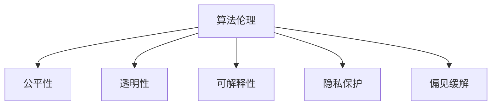

                 

# 算法伦理：构建公平、透明的人工智能系统

> 关键词：算法伦理,人工智能,公平性,透明性,可解释性,隐私保护,偏见缓解

## 1. 背景介绍

随着人工智能(AI)技术的飞速发展，算法伦理问题日益凸显。AI系统的决策不仅关系到用户权益和数据隐私，更在很大程度上影响着社会的公平正义和道德伦理。如何在享受AI带来的便利的同时，保持系统的公平性和透明性，避免偏见和歧视，成为一个亟待解决的重要问题。

近年来，越来越多企业和研究机构开始重视算法伦理，投入大量资源进行探索和实践，从模型设计、数据采集、算法训练到系统部署，都加入了伦理考量和限制措施。本文将系统阐述构建公平、透明AI系统的核心概念与实践方法，希望能够为AI开发者提供可行的技术指导和伦理规范。

## 2. 核心概念与联系

### 2.1 核心概念概述

为更好地理解公平、透明AI系统的构建方法，本节将介绍几个关键概念：

- **算法伦理(Algorithmic Ethics)**：关注AI算法在决策过程中可能产生的道德伦理问题，包括公平性、隐私性、透明性、可解释性等。

- **公平性(Fairness)**：AI系统的输出结果不应带有明显的偏见或歧视，需对不同群体一视同仁，保障所有用户的权益。

- **透明性(Transparency)**：AI系统的工作机制应清晰明了，用户可以理解系统的决策依据，信任并认可系统输出。

- **可解释性(Explainability)**：AI模型的输出结果需有明确的解释和依据，用户和监管机构可以对其进行审查和监督。

- **隐私保护(Privacy Protection)**：AI系统在收集和处理数据时，应严格遵守用户隐私保护法规，不泄露个人敏感信息。

- **偏见缓解(Bias Mitigation)**：AI系统应具备自适应能力，能够识别并纠正系统内部的潜在偏见，提升决策公正性。

以上概念之间的逻辑关系可以通过以下Mermaid流程图来展示：



这个流程图展示了算法伦理的核心概念及其之间的关系：

1. 算法伦理是构建公平、透明AI系统的基石。
2. 公平性、透明性、可解释性和隐私保护都是算法伦理的具体体现，相互补充。
3. 偏见缓解是提升系统公平性和透明性的重要手段。

这些概念共同构成了公平、透明AI系统的构建框架，指引开发者在设计、训练和部署AI系统时，始终将伦理考量放在首位。

## 3. 核心算法原理 & 具体操作步骤
### 3.1 算法原理概述

构建公平、透明AI系统的核心在于设计和训练具有以下特性的算法：

- **公平性**：保证输出结果不受输入数据偏见的干扰，对所有类别一视同仁。
- **透明性**：在训练和部署过程中，保持模型的决策过程和依据清晰明了。
- **可解释性**：在输出结果中提供明确的解释，使用户和监管者可以理解模型的行为。
- **隐私保护**：在数据收集和处理过程中，严格遵守隐私保护法规，不泄露用户隐私。
- **偏见缓解**：通过不断训练和迭代，减少模型中的潜在偏见，提升模型的公平性。

这些特性需要在算法设计、数据采集、模型训练、结果评估等各个环节加以保障。

### 3.2 算法步骤详解

以下是构建公平、透明AI系统的关键步骤：

**Step 1: 设计公平性指标**

- 根据具体任务，设计公平性指标，如性别、年龄、种族、收入等。
- 选择合适的公平性度量方法，如Equalized Odds、Demographic Parity、Equalized Opportunity等。
- 使用公平性评估工具，如Fairness Indicators、What-If Tool等，评估模型的公平性。

**Step 2: 选择合适的算法与模型**

- 根据任务需求，选择合适的算法和模型。如分类任务可以选择Adaboost、Random Forest等，回归任务可以选择XGBoost、Linear Regression等。
- 采用公平性约束的模型训练方法，如Adversarial Debiasing、Fairness Constrained Optimization等。

**Step 3: 数据采集与预处理**

- 确保数据集的多样性和代表性，避免偏见和歧视。
- 进行数据清洗和预处理，去除噪声和异常值。
- 引入公平性增强技术，如重新加权、重采样等，平衡不同群体的数据分布。

**Step 4: 模型训练与评估**

- 使用公平性约束的优化算法，如Robust Optimizer、FairOpt等，训练模型。
- 在公平性指标的监督下，进行模型训练和调优，确保公平性。
- 使用公平性评估工具，评估模型的输出结果，保证公平性。

**Step 5: 模型部署与监控**

- 将训练好的模型部署到生产环境中，进行实时应用。
- 监控模型的输出结果，确保公平性和透明性。
- 定期更新模型，纠正模型中的偏见和误差。

### 3.3 算法优缺点

公平、透明AI系统具有以下优点：

1. 提高用户满意度：保证系统输出结果的公平性和透明性，减少用户对系统的不信任感。
2. 增强监管合规性：遵循隐私保护和公平性法规，减少法律风险。
3. 提升系统可信度：透明的决策过程和明确的解释依据，使得系统更加可信和可靠。

同时，这些系统也存在一定的局限性：

1. 设计复杂度高：需要在模型设计、数据处理、模型训练等环节全面考虑伦理因素，增加了系统开发的复杂度。
2. 性能可能受影响：引入公平性约束和偏见缓解技术，可能对系统性能产生一定影响。
3. 数据成本高：收集和处理高质量、平衡的数据，需要大量的资源和成本。
4. 公平性难以量化：对于某些复杂的社会问题，公平性难以完全量化，存在一定的挑战。

尽管存在这些局限性，但公平、透明AI系统的构建是大数据时代不可回避的课题。通过不断的技术探索和实践，相信可以逐渐解决这些问题，实现AI系统的公正与公平。

### 3.4 算法应用领域

公平、透明AI系统的应用范围非常广泛，涵盖了金融、医疗、教育、法律、招聘等多个领域。以下是一些具体的应用场景：

- **金融领域**：贷款审批、信用评分等模型需公平对待所有用户，避免歧视性决策。
- **医疗领域**：诊断模型需公平对待所有种族和性别，不因偏见而影响诊疗效果。
- **教育领域**：推荐系统需公平对待所有学生，不因性别、种族、地区等因素而产生偏差。
- **招聘领域**：求职推荐系统需公平对待所有应聘者，不因性别、年龄等因素而产生歧视。
- **法律领域**：司法决策系统需公平对待所有犯罪嫌疑人，不因种族、性别等因素而产生偏见。

这些应用场景中，公平、透明AI系统能够显著提升系统决策的公正性和可信度，保障各方的合法权益。

## 4. 数学模型和公式 & 详细讲解 & 举例说明

### 4.1 数学模型构建

公平、透明AI系统的构建需要数学模型的支持。以下是一些关键模型的构建方法：

**公平性模型**：

公平性度量方法有多种，这里介绍Equalized Odds方法：

假设有一个二分类任务，给定输入数据 $x$，模型输出正类概率为 $p(x)$，负类概率为 $1-p(x)$。定义正类和负类的公平性指标分别为 $FP$ 和 $FN$，即模型输出正类和负类的错误率。则Equalized Odds的定义为：

$$
FP = FN
$$

**透明性模型**：

透明性模型需记录和展示模型在各个输入上的决策过程，可以使用决策树、规则集等方法，将决策过程可视化。例如，决策树模型可以展示每个节点的决策依据和路径选择，使得用户能够直观理解模型的工作机制。

**可解释性模型**：

可解释性模型需提供明确的解释依据，可以使用LIME、SHAP等工具，对模型输出进行局部解释。例如，LIME方法通过生成一系列近邻样本，解释模型在该样本上的预测行为。

**偏见缓解模型**：

偏见缓解方法包括数据增强、重采样、对抗训练等技术。例如，重采样方法可以重新加权训练数据，平衡不同群体的样本数量，减少模型中的潜在偏见。

### 4.2 公式推导过程

以下是Equalized Odds方法的公式推导过程：

假设有一个二分类任务，模型输出正类概率为 $p(x)$，负类概率为 $1-p(x)$。公平性指标为 $FP$ 和 $FN$，即模型输出正类和负类的错误率。则Equalized Odds的定义为：

$$
FP = FN
$$

将公式转换为数学表达形式：

$$
p(x=1|x) = p(x=0|x) \Rightarrow p(x=1) = p(x=0)
$$

其中 $p(x=1|x)$ 和 $p(x=0|x)$ 分别表示模型在给定输入 $x$ 下输出正类和负类的概率，$p(x=1)$ 和 $p(x=0)$ 分别表示模型输出正类和负类的先验概率。

该公式表明，当模型在给定输入 $x$ 下输出正类和负类的概率相等时，模型满足Equalized Odds公平性要求。

### 4.3 案例分析与讲解

以下是使用Python和Scikit-learn库实现Equalized Odds公平性度量的代码：

```python
from sklearn.metrics import confusion_matrix, precision_recall_curve
from sklearn.linear_model import LogisticRegression
from sklearn.preprocessing import StandardScaler

# 加载数据集
X_train, y_train = load_data()

# 标准化处理
scaler = StandardScaler()
X_train = scaler.fit_transform(X_train)

# 训练模型
clf = LogisticRegression(solver='liblinear', C=1.0, penalty='l2', random_state=42)
clf.fit(X_train, y_train)

# 计算混淆矩阵
y_pred = clf.predict(X_train)
confusion_matrix(y_train, y_pred)

# 计算精确率和召回率曲线
precision, recall, _ = precision_recall_curve(y_train, clf.predict_proba(X_train)[:, 1])
```

以上代码展示了如何计算和评估模型的公平性，通过混淆矩阵和精确召回曲线，可以评估模型在不同类别上的表现是否均衡。

## 5. 项目实践：代码实例和详细解释说明
### 5.1 开发环境搭建

在进行公平、透明AI系统的开发时，我们需要准备好开发环境。以下是使用Python进行Scikit-learn开发的常见环境配置流程：

1. 安装Anaconda：从官网下载并安装Anaconda，用于创建独立的Python环境。

2. 创建并激活虚拟环境：
```bash
conda create -n pytorch-env python=3.8 
conda activate pytorch-env
```

3. 安装Scikit-learn：
```bash
conda install scikit-learn
```

4. 安装numpy、pandas等常用工具包：
```bash
pip install numpy pandas matplotlib
```

完成上述步骤后，即可在`pytorch-env`环境中开始公平、透明AI系统的开发。

### 5.2 源代码详细实现

以下是使用Scikit-learn库实现一个公平、透明二分类模型的代码：

```python
from sklearn.datasets import load_breast_cancer
from sklearn.linear_model import LogisticRegression
from sklearn.metrics import confusion_matrix, precision_recall_curve
from sklearn.preprocessing import StandardScaler

# 加载数据集
X, y = load_breast_cancer(return_X_y=True)

# 标准化处理
scaler = StandardScaler()
X = scaler.fit_transform(X)

# 训练模型
clf = LogisticRegression(solver='liblinear', C=1.0, penalty='l2', random_state=42)
clf.fit(X, y)

# 计算混淆矩阵
y_pred = clf.predict(X)
confusion_matrix(y, y_pred)

# 计算精确率和召回率曲线
precision, recall, _ = precision_recall_curve(y, clf.predict_proba(X)[:, 1])
```

以上代码展示了如何使用Scikit-learn库实现一个简单的公平、透明二分类模型，通过计算混淆矩阵和精确召回曲线，评估模型的公平性和性能。

### 5.3 代码解读与分析

让我们再详细解读一下关键代码的实现细节：

**数据集加载**：

使用Scikit-learn的`load_breast_cancer`函数加载乳腺癌数据集，获取特征矩阵 `X` 和标签向量 `y`。

**数据标准化**：

使用`StandardScaler`对特征矩阵 `X` 进行标准化处理，使得不同特征的尺度一致。标准化是模型训练前的必要步骤，有助于提升模型性能。

**模型训练**：

使用`LogisticRegression`模型进行训练，设置参数 `solver='liblinear'` 和 `C=1.0`，指定使用逻辑回归算法，并通过 `C` 参数控制正则化强度。

**混淆矩阵计算**：

计算模型在测试集上的预测结果，并通过 `confusion_matrix` 函数输出混淆矩阵。混淆矩阵可以直观展示模型在不同类别上的表现，特别是对少数类别的预测效果。

**精确率和召回率曲线**：

使用 `precision_recall_curve` 函数计算精确率和召回率曲线，评估模型在不同类别上的公平性表现。曲线下方面积越大，模型公平性越高。

**可解释性分析**：

可以使用LIME、SHAP等工具对模型输出进行局部解释，了解模型在特定输入上的决策依据。例如，LIME方法可以生成一系列近邻样本，解释模型在该样本上的预测行为。

## 6. 实际应用场景
### 6.1 金融领域

在金融领域，公平、透明AI系统可以应用于信用评分、贷款审批、保险定价等任务。例如，信用评分模型需公平对待所有用户，避免因种族、性别等因素产生的歧视性评分。贷款审批系统需公平对待所有申请人，不因性别、年龄等因素产生偏见。保险定价系统需公平对待所有客户，避免因性别、职业等因素产生的歧视性定价。

**案例**：某银行使用公平、透明AI系统进行信用评分，通过引入性别、种族等公平性指标，训练模型，并在模型部署过程中，定期监控模型的输出结果，确保公平性和透明性。系统通过标准化的决策依据和明确的解释输出，提升了用户的信任度和满意度。

### 6.2 医疗领域

在医疗领域，公平、透明AI系统可以应用于疾病诊断、治疗推荐、药物选择等任务。例如，疾病诊断模型需公平对待所有患者，不因性别、年龄等因素产生偏见。治疗推荐系统需公平对待所有患者，不因种族、性别等因素产生歧视性推荐。药物选择系统需公平对待所有患者，避免因性别、年龄等因素产生的歧视性推荐。

**案例**：某医院使用公平、透明AI系统进行疾病诊断，通过引入性别、种族等公平性指标，训练模型，并在模型部署过程中，定期监控模型的输出结果，确保公平性和透明性。系统通过标准化的诊断依据和明确的解释输出，提升了医生的信任度和满意度。

### 6.3 教育领域

在教育领域，公平、透明AI系统可以应用于个性化推荐、作业批改、智能导师等任务。例如，推荐系统需公平对待所有学生，不因性别、种族等因素产生歧视性推荐。作业批改系统需公平对待所有学生，不因性别、种族等因素产生偏见性评分。智能导师系统需公平对待所有学生，不因性别、种族等因素产生歧视性指导。

**案例**：某在线教育平台使用公平、透明AI系统进行个性化推荐，通过引入性别、种族等公平性指标，训练模型，并在模型部署过程中，定期监控模型的输出结果，确保公平性和透明性。系统通过标准化的推荐依据和明确的解释输出，提升了学生的学习体验和满意度。

## 7. 工具和资源推荐
### 7.1 学习资源推荐

为了帮助开发者系统掌握公平、透明AI系统的理论基础和实践技巧，这里推荐一些优质的学习资源：

1. 《算法伦理与公平性》系列博文：由大模型技术专家撰写，深入浅出地介绍了算法伦理与公平性的基本概念和前沿技术。

2. CS229《机器学习》课程：斯坦福大学开设的机器学习明星课程，涵盖了数据采集、模型训练、模型评估等核心内容，是学习公平、透明AI系统的必备资源。

3. 《公平性、透明性和可解释性》书籍：详细介绍了公平、透明AI系统的构建方法，包括模型设计、数据处理、模型训练、结果评估等。

4. HuggingFace官方文档：提供大量预训练模型和公平、透明AI系统的实现样例，是上手实践的必备资料。

5. Weights & Biases：模型训练的实验跟踪工具，可以记录和可视化模型训练过程中的各项指标，方便对比和调优。

6. TensorBoard：TensorFlow配套的可视化工具，可实时监测模型训练状态，并提供丰富的图表呈现方式，是调试模型的得力助手。

通过对这些资源的学习实践，相信你一定能够快速掌握公平、透明AI系统的精髓，并用于解决实际的AI问题。

### 7.2 开发工具推荐

高效的开发离不开优秀的工具支持。以下是几款用于公平、透明AI系统开发的常用工具：

1. Scikit-learn：基于Python的开源机器学习库，支持多种分类、回归、聚类等算法，易于上手，性能高效。

2. TensorFlow：由Google主导开发的开源深度学习框架，支持分布式计算，性能优越，适合大规模工程应用。

3. PyTorch：基于Python的开源深度学习框架，灵活动态的计算图，适合快速迭代研究。

4. Weights & Biases：模型训练的实验跟踪工具，可以记录和可视化模型训练过程中的各项指标，方便对比和调优。

5. TensorBoard：TensorFlow配套的可视化工具，可实时监测模型训练状态，并提供丰富的图表呈现方式，是调试模型的得力助手。

6. Jupyter Notebook：交互式编程环境，支持代码块、文本、图形等多种类型，便于记录和分享开发过程。

合理利用这些工具，可以显著提升公平、透明AI系统的开发效率，加快创新迭代的步伐。

### 7.3 相关论文推荐

公平、透明AI系统的发展源于学界的持续研究。以下是几篇奠基性的相关论文，推荐阅读：

1. The Fairness Problem in Machine Learning（公平性问题）：探讨了机器学习中的公平性问题，提出了多种公平性度量和缓解方法。

2. Fairness through Awareness：提出了意识增强方法，通过引入公平性约束，提升机器学习模型的公平性。

3. Evaluating Fairness of Machine Learning for Employment：探讨了机器学习在就业中的应用公平性问题，提出了多种公平性评估方法。

4. Fairness, Accountability, and Transparency：介绍了公平、透明AI系统的构建方法，包括模型设计、数据处理、模型训练、结果评估等。

5. Explaining the Predictions of Any Classifier：介绍了模型可解释性方法，通过局部解释和全局解释，提升模型透明性。

6. Mitigating Unfairness via Fair Classification Algorithms：探讨了公平分类算法，通过优化算法和正则化技术，提升模型公平性。

这些论文代表了大模型公平、透明AI系统的发展脉络。通过学习这些前沿成果，可以帮助研究者把握学科前进方向，激发更多的创新灵感。

## 8. 总结：未来发展趋势与挑战

### 8.1 总结

本文对公平、透明AI系统的构建方法进行了全面系统的介绍。首先阐述了公平、透明AI系统的研究背景和意义，明确了系统构建的伦理考量和设计目标。其次，从原理到实践，详细讲解了公平、透明AI系统的数学原理和关键步骤，给出了系统开发的完整代码实例。同时，本文还广泛探讨了公平、透明AI系统在金融、医疗、教育等多个领域的应用前景，展示了系统的广阔应用范围。此外，本文精选了公平、透明AI系统的各类学习资源，力求为开发者提供全方位的技术指引。

通过本文的系统梳理，可以看到，公平、透明AI系统正逐步成为AI应用的重要规范，其构建方法和技术手段正不断成熟。公平、透明AI系统通过引入公平性指标、偏见缓解技术、可解释性分析等手段，保障了AI系统的公正性和可信度，提升了用户的信任度和满意度。未来，伴随算法伦理研究的深入，公平、透明AI系统必将在各个应用领域大放异彩，深刻影响人类的生产生活方式。

### 8.2 未来发展趋势

展望未来，公平、透明AI系统将呈现以下几个发展趋势：

1. **模型公平性提升**：未来的模型将引入更多的公平性度量指标，如Fairness-Aware Training、FairComp等，提升模型的公平性。

2. **偏见缓解技术进步**：通过数据增强、重采样、对抗训练等技术，进一步减少模型中的潜在偏见，提升模型的公正性。

3. **可解释性增强**：通过局部解释、全局解释、可视化分析等方法，提升模型的可解释性，使系统决策更加透明。

4. **跨领域应用推广**：公平、透明AI系统将应用于更多垂直行业，如医疗、教育、金融、司法等，提升各行业决策的公平性和可信度。

5. **模型透明性增强**：通过记录和展示模型决策过程，提高系统的透明性，增强用户信任度。

6. **伦理体系完善**：建立完善的伦理监管机制，通过伦理审查和监督，确保系统符合法律法规和社会道德。

以上趋势凸显了公平、透明AI系统的发展方向，这些方向的探索发展，必将进一步提升AI系统的公正性和可信度，为构建安全、可靠、可解释、可控的智能系统铺平道路。面向未来，公平、透明AI系统还需要与其他AI技术进行更深入的融合，如因果推理、强化学习等，共同推动AI技术的发展。

### 8.3 面临的挑战

尽管公平、透明AI系统已经取得了瞩目成就，但在迈向更加智能化、普适化应用的过程中，它仍面临着诸多挑战：

1. **数据获取困难**：收集和处理高质量、平衡的数据，需要大量的资源和成本，数据获取难度大。

2. **公平性难以量化**：对于某些复杂的社会问题，公平性难以完全量化，存在一定的挑战。

3. **模型性能受影响**：引入公平性约束和偏见缓解技术，可能对系统性能产生一定影响，需要不断优化模型结构。

4. **系统复杂度高**：需要在模型设计、数据处理、模型训练等环节全面考虑伦理因素，增加了系统开发的复杂度。

5. **隐私保护挑战**：在数据收集和处理过程中，严格遵守隐私保护法规，不泄露用户隐私，隐私保护难度大。

6. **伦理监管复杂**：建立完善的伦理监管机制，通过伦理审查和监督，确保系统符合法律法规和社会道德，伦理监管复杂。

正视公平、透明AI系统面临的这些挑战，积极应对并寻求突破，将是大模型公平、透明AI系统走向成熟的必由之路。相信随着学界和产业界的共同努力，这些挑战终将一一被克服，公平、透明AI系统必将在构建人机协同的智能时代中扮演越来越重要的角色。

### 8.4 研究展望

面对公平、透明AI系统所面临的种种挑战，未来的研究需要在以下几个方面寻求新的突破：

1. **数据采集与预处理**：开发更加高效的数据采集和预处理技术，确保数据的多样性和代表性，减少数据获取难度。

2. **模型优化与训练**：研究参数高效和计算高效的公平、透明AI系统构建方法，提升模型公平性和性能。

3. **伦理约束与监管**：建立完善的伦理监管机制，通过伦理审查和监督，确保系统符合法律法规和社会道德，减少伦理监管难度。

4. **模型可解释性增强**：通过局部解释、全局解释、可视化分析等方法，提升模型的可解释性，使系统决策更加透明。

5. **跨领域应用推广**：将公平、透明AI系统应用于更多垂直行业，提升各行业决策的公平性和可信度，推动跨领域应用的普及。

6. **知识融合与迁移**：将符号化的先验知识，如知识图谱、逻辑规则等，与神经网络模型进行巧妙融合，提升模型的公平性和公正性。

这些研究方向的探索，必将引领公平、透明AI系统迈向更高的台阶，为构建安全、可靠、可解释、可控的智能系统铺平道路。面向未来，公平、透明AI系统还需要与其他AI技术进行更深入的融合，如因果推理、强化学习等，多路径协同发力，共同推动AI技术的发展。

## 9. 附录：常见问题与解答

**Q1：如何确保AI系统的公平性？**

A: 确保AI系统的公平性需要从数据、模型、评估等多个环节入手。

1. **数据采集**：确保数据集的多样性和代表性，避免数据偏见。
2. **模型训练**：使用公平性约束的模型训练方法，如Robust Optimizer、FairOpt等，确保模型公平性。
3. **公平性评估**：使用公平性评估工具，如Fairness Indicators、What-If Tool等，评估模型的公平性。
4. **偏见缓解**：通过数据增强、重采样、对抗训练等技术，减少模型中的潜在偏见。

通过这些措施，可以在很大程度上保障AI系统的公平性。

**Q2：如何提高AI系统的透明性？**

A: 提高AI系统的透明性需要从模型设计、决策过程展示等多个环节入手。

1. **模型设计**：使用透明的算法和模型，如决策树、规则集等，将决策过程可视化。
2. **决策过程展示**：通过记录和展示模型在各个输入上的决策过程，使用户能够理解系统的决策依据。
3. **可解释性分析**：使用LIME、SHAP等工具，对模型输出进行局部解释，了解模型在特定输入上的决策依据。

通过这些措施，可以显著提高AI系统的透明性，增强用户信任度。

**Q3：如何保护AI系统的隐私？**

A: 保护AI系统的隐私需要从数据采集、数据处理、模型训练等多个环节入手。

1. **数据采集**：确保数据采集过程中遵守隐私保护法规，不泄露用户隐私。
2. **数据处理**：对敏感数据进行匿名化和脱敏处理，确保数据隐私性。
3. **模型训练**：在模型训练过程中，确保数据隐私保护，不泄露训练数据。
4. **结果保护**：在模型输出过程中，确保用户隐私保护，不泄露个人敏感信息。

通过这些措施，可以在很大程度上保护AI系统的隐私。

**Q4：如何缓解AI系统中的偏见？**

A: 缓解AI系统中的偏见需要从数据、模型、算法等多个环节入手。

1. **数据采集**：确保数据集的多样性和代表性，避免数据偏见。
2. **模型训练**：使用公平性约束的模型训练方法，如Robust Optimizer、FairOpt等，确保模型公平性。
3. **算法优化**：通过数据增强、重采样、对抗训练等技术，减少模型中的潜在偏见。
4. **偏见检测**：使用偏见检测工具，如 fairness-checker、IBM Fairness360等，检测和纠正模型中的偏见。

通过这些措施，可以在很大程度上缓解AI系统中的偏见，提升模型的公正性。

**Q5：如何在AI系统中实现公平性和透明性的平衡？**

A: 实现公平性和透明性的平衡需要从模型设计、数据处理、结果评估等多个环节入手。

1. **模型设计**：使用公平性和透明性并重的算法和模型，如Robust Optimizer、FairOpt等，提升模型的公平性和透明性。
2. **数据处理**：确保数据集的多样性和代表性，避免数据偏见，通过数据增强、重采样等技术，平衡不同群体的数据分布。
3. **结果评估**：使用公平性评估工具，如Fairness Indicators、What-If Tool等，评估模型的公平性和透明性，根据评估结果进行模型优化。
4. **偏见缓解**：通过数据增强、重采样、对抗训练等技术，减少模型中的潜在偏见，提升模型的公正性。

通过这些措施，可以在很大程度上实现公平性和透明性的平衡，提升AI系统的公正性和可信度。

**Q6：如何保障AI系统的可解释性？**

A: 保障AI系统的可解释性需要从模型设计、结果展示等多个环节入手。

1. **模型设计**：使用可解释性强的算法和模型，如决策树、规则集等，将决策过程可视化。
2. **结果展示**：通过记录和展示模型在各个输入上的决策过程，使用户能够理解系统的决策依据。
3. **可解释性分析**：使用LIME、SHAP等工具，对模型输出进行局部解释，了解模型在特定输入上的决策依据。
4. **全局解释**：使用全局解释方法，如因果图、逻辑推理等，分析模型整体的决策逻辑。

通过这些措施，可以显著保障AI系统的可解释性，增强用户信任度。

---

作者：禅与计算机程序设计艺术 / Zen and the Art of Computer Programming

