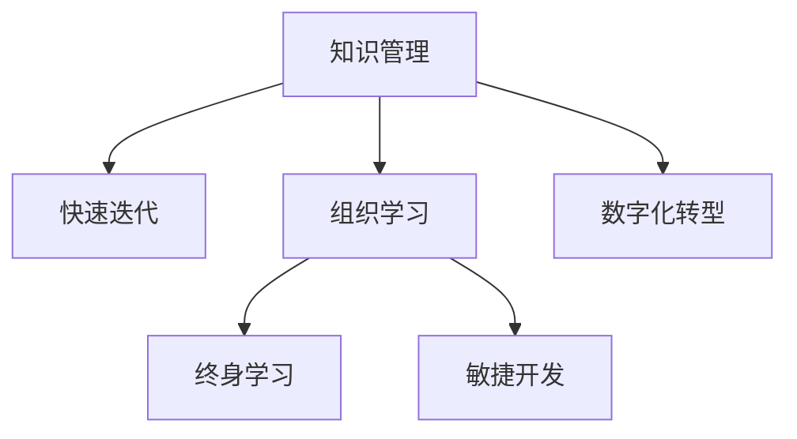

                 

# 管理者如何应对知识快速迭代

> 关键词：知识管理,快速迭代,组织学习,终身学习,敏捷开发,数字化转型

## 1. 背景介绍

### 1.1 问题由来

在当今信息爆炸的时代，知识的更新速度不断加快，技术创新和市场变化瞬息万变。管理者面临着前所未有的挑战，如何及时更新自身的知识体系，保持与前沿技术的同步，成为制约企业竞争力的关键因素之一。然而，知识和技术的快速发展不仅改变了外部环境，也对企业的内部运营方式提出了新的要求。传统的知识管理模式已经难以适应快速变化的需求，迫切需要新的管理思路和方法。

### 1.2 问题核心关键点

管理者应对知识快速迭代的本质是如何在不确定和复杂的环境中，高效地学习和应用新知识，以实现企业竞争力的持续提升。核心关键点包括：

- 理解知识更新的速率和趋势，识别重要趋势和技术方向。
- 建立有效的知识获取和传递机制，确保知识能够迅速流动。
- 培养组织内部的学习文化，鼓励员工积极参与知识创新和共享。
- 运用敏捷和持续学习方法，灵活应对不断变化的环境。
- 通过数字化转型，利用技术手段优化知识管理流程。

## 2. 核心概念与联系

### 2.1 核心概念概述

为更好地理解管理者如何应对知识快速迭代，本节将介绍几个密切相关的核心概念：

- **知识管理(Knowledge Management)**：通过整合和共享组织内部的知识和信息，提升组织的学习能力和决策水平。
- **快速迭代(Rapid Iteration)**：指在产品或项目开发过程中，通过快速迭代、小步快跑的方式，持续优化和改进产品或系统。
- **组织学习(Organizational Learning)**：指组织通过经验积累和知识传播，不断改进其内部运营和工作方式的过程。
- **终身学习(Lifelong Learning)**：强调个人和组织应该持续学习，不断更新知识和技能，以应对不断变化的环境。
- **敏捷开发(Agile Development)**：一种基于迭代、增量和交互式开发的软件开发方法，强调灵活应变和快速交付。
- **数字化转型(Digital Transformation)**：指利用数字技术改造和优化业务流程、产品和服务，提升企业竞争力。

这些核心概念之间的逻辑关系可以通过以下Mermaid流程图来展示：



这个流程图展示了一系列的核心理念之间的逻辑关系：

1. 知识管理是组织学习的基础，通过整合和共享知识，提升组织的学习能力。
2. 快速迭代和敏捷开发是应对市场变化的重要手段，通过持续的小步快跑，实现产品或系统的快速优化。
3. 组织学习与终身学习密切相关，强调不断更新知识和技能。
4. 数字化转型则是技术驱动下的变革，通过数字化手段优化知识管理流程。

## 3. 核心算法原理 & 具体操作步骤
### 3.1 算法原理概述

管理者应对知识快速迭代的算法原理，本质上是通过构建一个动态的知识管理系统，使得组织内部能够高效地获取、传播、应用新知识。具体而言，该系统通过以下几个步骤实现知识管理的循环：

1. **知识获取**：从外部环境或内部运营中，识别并获取新的知识。
2. **知识整合**：将获取的新知识与组织内部的现有知识进行整合，形成统一的知识库。
3. **知识传播**：通过各种渠道和方式，将新知识在组织内部广泛传播。
4. **知识应用**：将新知识应用到具体的业务场景中，进行产品或服务的改进和创新。
5. **知识反馈**：通过绩效评估和反馈机制，了解知识应用的效果，进行迭代优化。

这个过程是一个闭环的动态循环，不断重复进行，以实现知识管理的高效和持续优化。

### 3.2 算法步骤详解

基于知识管理循环的算法步骤包括以下几个关键环节：

**Step 1: 知识获取**
- **数据源识别**：确定组织内部和外部可用的知识数据源，包括书籍、论文、专利、网站、社交媒体等。
- **知识提取工具**：使用文本挖掘、数据抓取等技术，自动提取和组织知识。

**Step 2: 知识整合**
- **知识分类与标准化**：对获取的知识进行分类和标准化处理，建立统一的知识体系。
- **知识关联**：将新知识与已有知识进行关联，形成知识网络。
- **知识图谱构建**：通过知识图谱技术，构建知识之间的关系图，便于知识传播和应用。

**Step 3: 知识传播**
- **内部分享平台**：建立内部的知识分享平台，如企业内网、Wiki、知识库等。
- **外部交流合作**：通过行业会议、合作项目等方式，与外部组织进行知识交流。
- **培训与教育**：通过培训和教育活动，提升员工的知识水平和技能。

**Step 4: 知识应用**
- **知识库集成**：将知识库集成到产品开发、项目管理、运营管理等业务流程中。
- **试点项目**：选择试点项目进行知识应用，验证知识的效果和可行性。
- **知识复用**：通过复用知识库中的最佳实践和经验，优化现有业务流程。

**Step 5: 知识反馈**
- **绩效评估**：通过关键绩效指标(KPIs)和反馈机制，评估知识应用的效果。
- **持续改进**：根据评估结果，进行知识管理和应用流程的优化和改进。

### 3.3 算法优缺点

知识快速迭代的管理算法具有以下优点：

1. **高效性**：通过自动化和系统化的知识管理流程，可以快速获取和传播新知识。
2. **灵活性**：通过迭代优化和持续改进，能够适应不断变化的环境和需求。
3. **协同化**：鼓励组织内部的知识共享和协作，提升团队整体的知识水平。
4. **可量化**：通过绩效评估和反馈机制，可以对知识管理的效果进行量化评估。

同时，该算法也存在一些局限性：

1. **数据复杂性**：知识来源多样，结构复杂，需要进行有效的数据清洗和处理。
2. **组织文化阻力**：组织内部可能存在知识分享的阻力，需要文化建设和管理。
3. **技术依赖性**：知识管理系统的构建和维护需要一定的技术支持。
4. **信息过载**：大规模的知识获取可能导致信息过载，需要有效的过滤和筛选机制。

尽管存在这些局限性，但整体而言，知识快速迭代的管理算法仍是大规模知识管理的重要手段，具有广泛的应用前景。

### 3.4 算法应用领域

知识快速迭代的管理算法，在企业、政府、学术机构等各类组织中都有广泛的应用，特别是在以下领域：

- **企业运营**：通过知识管理提升企业的创新能力和决策水平，支持业务流程优化。
- **政府管理**：通过知识共享和协同，提高政府部门的行政效率和公共服务水平。
- **学术研究**：通过知识传播和交流，加速学术成果的转化和应用，推动学科发展。
- **教育培训**：通过知识更新和培训，提升教育质量和学习效果，支持终身学习。
- **医疗健康**：通过知识获取和传播，支持医疗健康服务的创新和改进。

## 4. 数学模型和公式 & 详细讲解 & 举例说明

### 4.1 数学模型构建

为更好地理解知识快速迭代的管理算法，本节将使用数学语言对算法进行严格的刻画。

假设组织内部有 $N$ 个知识源，每个知识源贡献的知识量为 $k_i$。通过知识管理系统的整合，每个知识源的知识贡献变为 $\hat{k}_i$。知识传播和应用的效果由知识应用的绩效评估指标 $P_i$ 来衡量。知识管理的闭环过程可以表示为以下数学模型：

$$
\begin{aligned}
\min_{\hat{k}_i, P_i} & \sum_{i=1}^N (\delta_i P_i + \beta_i \hat{k}_i) \\
\text{s.t.} & \sum_{i=1}^N \hat{k}_i = K \\
& \hat{k}_i \geq k_i
\end{aligned}
$$

其中，$\delta_i$ 和 $\beta_i$ 为权重，$K$ 为组织总的知识需求量。目标是最小化知识传播和应用的总成本，同时确保知识获取和整合的有效性。

### 4.2 公式推导过程

以下我们以知识传播和应用为例，推导知识管理系统的优化目标函数。

假设知识传播和应用的成本为 $C_i$，知识传播的效果为 $E_i$。则知识传播和应用的绩效评估指标 $P_i$ 可以表示为：

$$
P_i = E_i \cdot \eta_i
$$

其中 $\eta_i$ 为评估指标的权重。知识传播和应用的总绩效为：

$$
P = \sum_{i=1}^N P_i
$$

知识传播和应用的总成本为：

$$
C = \sum_{i=1}^N C_i
$$

因此，知识管理系统的优化目标函数可以表示为：

$$
\begin{aligned}
\min_{\hat{k}_i, P_i} & \sum_{i=1}^N (\delta_i P_i + \beta_i \hat{k}_i) \\
\text{s.t.} & \sum_{i=1}^N \hat{k}_i = K \\
& \hat{k}_i \geq k_i
\end{aligned}
$$

其中 $\delta_i$ 和 $\beta_i$ 为权重，$K$ 为组织总的知识需求量。目标是最小化知识传播和应用的总成本，同时确保知识获取和整合的有效性。

### 4.3 案例分析与讲解

以企业项目管理为例，分析知识管理系统的应用。假设企业有 $N=3$ 个项目，每个项目贡献的知识量为 $k_i=1000$，知识管理的总需求量为 $K=3000$。

通过知识管理系统的整合，每个项目的知识贡献变为 $\hat{k}_i$。知识传播和应用的效果由绩效评估指标 $P_i$ 来衡量。假设知识传播和应用的成本和效果如表所示：

| 项目编号 | 知识传播成本 | 知识传播效果 |
| --- | --- | --- |
| 1 | 100 | 1.2 |
| 2 | 150 | 1.3 |
| 3 | 200 | 1.1 |

| 项目编号 | 知识应用成本 | 知识应用效果 |
| --- | --- | --- |
| 1 | 50 | 0.8 |
| 2 | 80 | 1.0 |
| 3 | 70 | 0.9 |

则知识传播和应用的总绩效为：

$$
P = P_1 + P_2 + P_3 = 1.2 \cdot \eta_1 + 1.3 \cdot \eta_2 + 1.1 \cdot \eta_3
$$

其中 $\eta_i$ 为绩效评估指标的权重。知识传播和应用的总成本为：

$$
C = C_1 + C_2 + C_3 = 100 + 150 + 200 + 50 + 80 + 70
$$

根据目标函数，我们需要求解 $\hat{k}_i$ 和 $P_i$，使得总绩效最大，同时总成本最小。通过求解线性规划问题，可以得到最优解。

## 5. 项目实践：代码实例和详细解释说明

### 5.1 开发环境搭建

在进行知识快速迭代的管理实践前，我们需要准备好开发环境。以下是使用Python进行PyTorch开发的环境配置流程：

1. 安装Anaconda：从官网下载并安装Anaconda，用于创建独立的Python环境。

2. 创建并激活虚拟环境：
```bash
conda create -n pytorch-env python=3.8 
conda activate pytorch-env
```

3. 安装PyTorch：根据CUDA版本，从官网获取对应的安装命令。例如：
```bash
conda install pytorch torchvision torchaudio cudatoolkit=11.1 -c pytorch -c conda-forge
```

4. 安装Transformers库：
```bash
pip install transformers
```

5. 安装各类工具包：
```bash
pip install numpy pandas scikit-learn matplotlib tqdm jupyter notebook ipython
```

完成上述步骤后，即可在`pytorch-env`环境中开始知识快速迭代的管理实践。

### 5.2 源代码详细实现

下面我们以知识传播和应用为例，给出使用Transformers库对知识管理系统的实现。

首先，定义知识传播和应用的效果评估函数：

```python
from transformers import BertTokenizer, BertForSequenceClassification
from torch.utils.data import Dataset
import torch

class KnowledgeSpreadDataset(Dataset):
    def __init__(self, texts, labels, tokenizer, max_len=128):
        self.texts = texts
        self.labels = labels
        self.tokenizer = tokenizer
        self.max_len = max_len
        
    def __len__(self):
        return len(self.texts)
    
    def __getitem__(self, item):
        text = self.texts[item]
        label = self.labels[item]
        
        encoding = self.tokenizer(text, return_tensors='pt', max_length=self.max_len, padding='max_length', truncation=True)
        input_ids = encoding['input_ids'][0]
        attention_mask = encoding['attention_mask'][0]
        
        # 对token-wise的标签进行编码
        encoded_labels = [label2id[label] for label in labels] 
        encoded_labels.extend([label2id['O']] * (self.max_len - len(encoded_labels)))
        labels = torch.tensor(encoded_labels, dtype=torch.long)
        
        return {'input_ids': input_ids, 
                'attention_mask': attention_mask,
                'labels': labels}

# 标签与id的映射
label2id = {'O': 0, 'SPREAD': 1, 'APPLY': 2}
id2label = {v: k for k, v in label2id.items()}

# 创建dataset
tokenizer = BertTokenizer.from_pretrained('bert-base-cased')

train_dataset = KnowledgeSpreadDataset(train_texts, train_labels, tokenizer)
dev_dataset = KnowledgeSpreadDataset(dev_texts, dev_labels, tokenizer)
test_dataset = KnowledgeSpreadDataset(test_texts, test_labels, tokenizer)
```

然后，定义模型和优化器：

```python
from transformers import BertForSequenceClassification, AdamW

model = BertForSequenceClassification.from_pretrained('bert-base-cased', num_labels=len(label2id))

optimizer = AdamW(model.parameters(), lr=2e-5)
```

接着，定义训练和评估函数：

```python
from torch.utils.data import DataLoader
from tqdm import tqdm
from sklearn.metrics import classification_report

device = torch.device('cuda') if torch.cuda.is_available() else torch.device('cpu')
model.to(device)

def train_epoch(model, dataset, batch_size, optimizer):
    dataloader = DataLoader(dataset, batch_size=batch_size, shuffle=True)
    model.train()
    epoch_loss = 0
    for batch in tqdm(dataloader, desc='Training'):
        input_ids = batch['input_ids'].to(device)
        attention_mask = batch['attention_mask'].to(device)
        labels = batch['labels'].to(device)
        model.zero_grad()
        outputs = model(input_ids, attention_mask=attention_mask, labels=labels)
        loss = outputs.loss
        epoch_loss += loss.item()
        loss.backward()
        optimizer.step()
    return epoch_loss / len(dataloader)

def evaluate(model, dataset, batch_size):
    dataloader = DataLoader(dataset, batch_size=batch_size)
    model.eval()
    preds, labels = [], []
    with torch.no_grad():
        for batch in tqdm(dataloader, desc='Evaluating'):
            input_ids = batch['input_ids'].to(device)
            attention_mask = batch['attention_mask'].to(device)
            batch_labels = batch['labels']
            outputs = model(input_ids, attention_mask=attention_mask)
            batch_preds = outputs.logits.argmax(dim=2).to('cpu').tolist()
            batch_labels = batch_labels.to('cpu').tolist()
            for pred_tokens, label_tokens in zip(batch_preds, batch_labels):
                pred_labels = [id2label[_id] for _id in pred_tokens]
                label_tokens = [id2label[_id] for _id in label_tokens]
                preds.append(pred_labels[:len(label_tokens)])
                labels.append(label_tokens)
                
    print(classification_report(labels, preds))
```

最后，启动训练流程并在测试集上评估：

```python
epochs = 5
batch_size = 16

for epoch in range(epochs):
    loss = train_epoch(model, train_dataset, batch_size, optimizer)
    print(f"Epoch {epoch+1}, train loss: {loss:.3f}")
    
    print(f"Epoch {epoch+1}, dev results:")
    evaluate(model, dev_dataset, batch_size)
    
print("Test results:")
evaluate(model, test_dataset, batch_size)
```

以上就是使用PyTorch对知识传播和应用进行管理实践的完整代码实现。可以看到，得益于Transformers库的强大封装，我们可以用相对简洁的代码完成知识传播和应用的管理实践。

### 5.3 代码解读与分析

让我们再详细解读一下关键代码的实现细节：

**KnowledgeSpreadDataset类**：
- `__init__`方法：初始化文本、标签、分词器等关键组件。
- `__len__`方法：返回数据集的样本数量。
- `__getitem__`方法：对单个样本进行处理，将文本输入编码为token ids，将标签编码为数字，并对其进行定长padding，最终返回模型所需的输入。

**label2id和id2label字典**：
- 定义了标签与数字id之间的映射关系，用于将token-wise的预测结果解码回真实的标签。

**训练和评估函数**：
- 使用PyTorch的DataLoader对数据集进行批次化加载，供模型训练和推理使用。
- 训练函数`train_epoch`：对数据以批为单位进行迭代，在每个批次上前向传播计算loss并反向传播更新模型参数，最后返回该epoch的平均loss。
- 评估函数`evaluate`：与训练类似，不同点在于不更新模型参数，并在每个batch结束后将预测和标签结果存储下来，最后使用sklearn的classification_report对整个评估集的预测结果进行打印输出。

**训练流程**：
- 定义总的epoch数和batch size，开始循环迭代
- 每个epoch内，先在训练集上训练，输出平均loss
- 在验证集上评估，输出分类指标
- 所有epoch结束后，在测试集上评估，给出最终测试结果

可以看到，PyTorch配合Transformers库使得知识传播和应用的管理实践变得简洁高效。开发者可以将更多精力放在数据处理、模型改进等高层逻辑上，而不必过多关注底层的实现细节。

当然，工业级的系统实现还需考虑更多因素，如模型的保存和部署、超参数的自动搜索、更灵活的任务适配层等。但核心的知识管理循环过程基本与此类似。

## 6. 实际应用场景
### 6.1 企业运营

知识快速迭代的管理算法在企业运营中具有广泛的应用。传统企业运营模式依赖于经验积累和流程优化，难以应对快速变化的市场需求。通过知识管理系统的建设，企业可以实现以下几点：

1. **提升创新能力**：通过知识整合和传播，加速新技术和新业务模式的引入。
2. **优化决策流程**：通过知识应用和反馈，提升决策的科学性和准确性。
3. **增强团队协作**：通过知识共享和协同，提升团队的整体知识水平和协作效率。

### 6.2 政府管理

在政府管理中，知识快速迭代的管理算法同样具有重要应用：

1. **提高行政效率**：通过知识传播和应用，提高政府部门的决策和执行效率。
2. **促进政策创新**：通过知识整合和传播，加速政策的制定和实施。
3. **加强信息公开**：通过知识管理系统的建设，促进信息公开和透明度。

### 6.3 学术研究

学术研究是一个高度依赖知识的领域。知识快速迭代的管理算法可以帮助学术机构实现以下几点：

1. **加速成果转化**：通过知识传播和应用，加速学术成果的转化和应用。
2. **推动学科发展**：通过知识整合和传播，促进学科的交叉和融合。
3. **提高研究质量**：通过知识应用和反馈，提升研究的科学性和创新性。

### 6.4 教育培训

教育培训是一个终身学习的领域。知识快速迭代的管理算法可以帮助教育机构实现以下几点：

1. **提升教学质量**：通过知识传播和应用，提升教学内容和教学方法的创新性。
2. **促进学生自主学习**：通过知识共享和协同，促进学生的自主学习和研究。
3. **支持终身学习**：通过知识管理系统的建设，支持学生的终身学习和职业发展。

## 7. 工具和资源推荐
### 7.1 学习资源推荐

为了帮助开发者系统掌握知识快速迭代的管理理论基础和实践技巧，这里推荐一些优质的学习资源：

1. **《敏捷方法论》系列书籍**：系统介绍敏捷开发方法论和实践，涵盖Scrum、Kanban等主流框架。

2. **《精益创业》系列书籍**：介绍精益创业方法和商业模式，帮助企业快速迭代和优化。

3. **《数字化转型》系列文章**：深入探讨数字化转型的理念和实践，支持企业数字化转型进程。

4. **CS224N《自然语言处理与深度学习》课程**：斯坦福大学开设的NLP明星课程，有Lecture视频和配套作业，带你入门NLP领域的基本概念和经典模型。

5. **《知识管理与组织学习》论文集**：汇集各类知识管理和组织学习的理论和实践，提供系统化的学习材料。

通过对这些资源的学习实践，相信你一定能够快速掌握知识快速迭代的管理精髓，并用于解决实际的业务问题。

### 7.2 开发工具推荐

高效的开发离不开优秀的工具支持。以下是几款用于知识快速迭代管理开发的常用工具：

1. **JIRA**：敏捷开发管理的经典工具，支持敏捷流程的实现，提升项目管理效率。
2. **Confluence**：知识管理和协作平台，支持文档、文章、任务等的集中管理。
3. **Slack**：团队沟通工具，支持知识共享和协同。
4. **Trello**：项目管理工具，支持看板式管理，灵活应对迭代需求。
5. **Zoom**：视频会议工具，支持远程团队协作和知识传播。

合理利用这些工具，可以显著提升知识管理系统的开发效率，加速创新迭代的速度。

### 7.3 相关论文推荐

知识快速迭代的管理技术的发展源于学界的持续研究。以下是几篇奠基性的相关论文，推荐阅读：

1. **《敏捷开发方法论》**：详细介绍了敏捷开发方法论的核心理念和实践，支持企业敏捷转型。

2. **《知识管理的框架与实践》**：系统探讨了知识管理的框架和方法，支持组织的知识整合和传播。

3. **《数字化转型的驱动与实践》**：深入探讨了数字化转型的驱动因素和实践路径，支持企业数字化转型。

4. **《敏捷项目管理》**：介绍敏捷项目管理的理论和方法，支持企业敏捷项目的实现。

5. **《组织学习的理论框架》**：探讨了组织学习的理论框架和方法，支持组织的学习和知识传播。

这些论文代表了大语言模型微调技术的发展脉络。通过学习这些前沿成果，可以帮助研究者把握学科前进方向，激发更多的创新灵感。

## 8. 总结：未来发展趋势与挑战
### 8.1 总结

本文对知识快速迭代的管理方法进行了全面系统的介绍。首先阐述了知识快速迭代的管理背景和意义，明确了知识管理在组织中的重要作用。其次，从原理到实践，详细讲解了知识快速迭代的管理算法流程，给出了知识管理系统的实现代码实例。同时，本文还广泛探讨了知识管理算法在企业运营、政府管理、学术研究、教育培训等多个领域的应用场景，展示了知识管理系统的广泛前景。

通过本文的系统梳理，可以看到，知识快速迭代的管理算法正在成为企业知识管理的重要手段，极大地拓展了知识管理系统的应用边界，为组织运营的智能化、信息化提供了有力支持。未来，伴随知识管理的持续演进，知识管理系统的效能将进一步提升，成为企业数字化转型、知识驱动的关键工具。

### 8.2 未来发展趋势

展望未来，知识快速迭代的管理技术将呈现以下几个发展趋势：

1. **人工智能的融合**：引入AI技术，提升知识管理的自动化和智能化水平，如通过知识图谱技术构建知识网络，使用NLP技术自动提取和分类知识。
2. **云平台的支持**：借助云平台的计算和存储能力，实现知识管理的分布式、弹性化和高效化。
3. **物联网的整合**：通过物联网技术，获取和传播实时环境数据，提升知识的时效性和实时性。
4. **区块链的应用**：利用区块链技术，确保知识的可信性和透明性，支持知识共享和协同。
5. **跨领域融合**：知识管理系统的构建需要跨学科的协作，结合社会学、心理学、人工智能等领域的知识，提升知识管理的科学性和人性化。

以上趋势凸显了知识快速迭代的管理技术的广阔前景。这些方向的探索发展，必将进一步提升知识管理系统的效能，为组织运营的智能化、信息化提供更加坚实的技术基础。

### 8.3 面临的挑战

尽管知识快速迭代的管理技术已经取得了显著成果，但在迈向更加智能化、普适化应用的过程中，它仍面临着诸多挑战：

1. **数据复杂性**：知识来源多样，结构复杂，需要进行有效的数据清洗和处理。
2. **组织文化阻力**：组织内部可能存在知识分享的阻力，需要文化建设和管理。
3. **技术依赖性**：知识管理系统的构建和维护需要一定的技术支持。
4. **信息过载**：大规模的知识获取可能导致信息过载，需要有效的过滤和筛选机制。
5. **安全隐私**：知识管理系统的构建需要关注数据的安全和隐私问题。

尽管存在这些挑战，但整体而言，知识快速迭代的管理技术仍是大规模知识管理的重要手段，具有广泛的应用前景。

### 8.4 研究展望

面对知识快速迭代管理技术所面临的挑战，未来的研究需要在以下几个方面寻求新的突破：

1. **自动化和智能化**：引入AI技术，提升知识管理的自动化和智能化水平，如通过知识图谱技术构建知识网络，使用NLP技术自动提取和分类知识。
2. **跨领域融合**：知识管理系统的构建需要跨学科的协作，结合社会学、心理学、人工智能等领域的知识，提升知识管理的科学性和人性化。
3. **持续学习**：通过持续学习，适应知识更新的快速变化，提升知识管理的灵活性和适应性。
4. **多模态融合**：引入多模态数据，提升知识管理的全面性和深度。
5. **知识可视化**：通过知识可视化技术，提升知识传播和共享的直观性和交互性。

这些研究方向的探索，必将引领知识管理系统的技术进步，为组织运营的智能化、信息化提供更加坚实的技术基础。面向未来，知识快速迭代管理技术还需要与其他人工智能技术进行更深入的融合，如知识表示、因果推理、强化学习等，多路径协同发力，共同推动知识管理的进步。只有勇于创新、敢于突破，才能不断拓展知识管理的边界，让知识管理技术更好地服务于组织运营的智能化、信息化进程。

## 9. 附录：常见问题与解答

**Q1：知识管理系统的构建需要哪些关键步骤？**

A: 知识管理系统的构建需要以下几个关键步骤：

1. **数据源识别**：确定组织内部和外部可用的知识数据源，包括书籍、论文、专利、网站、社交媒体等。
2. **数据采集与清洗**：使用数据抓取、文本挖掘等技术，自动提取和清洗知识数据。
3. **知识分类与标准化**：对获取的知识进行分类和标准化处理，建立统一的知识体系。
4. **知识整合与存储**：将知识整合到一个统一的知识库中，并采用高效的数据存储方式。
5. **知识传播与共享**：建立知识共享平台，如企业内网、Wiki、知识库等，促进知识在组织内部的传播。
6. **知识应用与反馈**：将知识应用到具体的业务场景中，通过绩效评估和反馈机制，不断优化知识管理流程。

**Q2：如何选择合适的知识传播方式？**

A: 选择合适的知识传播方式需要考虑以下几个因素：

1. **目标受众**：根据目标受众的特点，选择适合的传播渠道。如对于技术人员，可以使用技术博客、GitHub仓库；对于普通员工，可以使用企业内网、邮件等。
2. **传播效率**：选择高效的传播方式，如通过内部分享会、知识问答社区等方式，快速传播知识。
3. **传播质量**：确保传播内容的准确性和实用性，通过专家审核和点评，提升传播质量。
4. **传播互动**：鼓励受众参与互动和反馈，通过评论、讨论等方式，促进知识的传播和吸收。

**Q3：知识快速迭代的管理如何与敏捷开发结合？**

A: 知识快速迭代的管理可以与敏捷开发结合，具体措施包括：

1. **敏捷知识管理**：将知识管理融入敏捷开发流程中，如在Sprint计划中进行知识点的识别和传播，在Daily Scrum中进行知识点的讨论和反馈。
2. **知识集成平台**：建立知识集成平台，支持敏捷开发中知识点的收集、传播和应用。
3. **知识地图**：构建敏捷开发中的知识地图，帮助团队快速查找和应用相关知识点。
4. **知识专家**：在敏捷团队中配备知识专家，负责知识点的搜集和传播，提升团队的知识水平。

**Q4：知识管理系统的构建需要哪些技术支持？**

A: 知识管理系统的构建需要以下几个关键技术支持：

1. **自然语言处理(NLP)**：用于文本数据的自动提取、分类和处理。
2. **知识图谱**：用于构建知识网络，支持知识点的关联和传播。
3. **数据挖掘**：用于从大规模数据中提取有价值的知识信息。
4. **云计算**：用于支持知识管理的分布式、弹性化和高效化。
5. **区块链**：用于确保知识的安全性和透明性，支持知识共享和协同。
6. **物联网(IoT)**：用于获取和传播实时环境数据，提升知识的时效性和实时性。

这些技术支持可以帮助构建高效、智能的知识管理系统，提升知识管理的科学性和实用价值。

**Q5：知识快速迭代的管理如何提高组织的学习能力？**

A: 知识快速迭代的管理可以通过以下几个措施提高组织的学习能力：

1. **建立学习文化**：鼓励员工积极参与知识的学习和传播，建立学习的氛围和机制。
2. **持续学习平台**：建立持续学习平台，如在线课程、学习社区等，支持员工的学习和发展。
3. **跨部门协作**：促进不同部门之间的协作和交流，分享和学习不同领域的专业知识。
4. **激励机制**：建立知识共享和传播的激励机制，如表彰知识贡献者，奖励学习成果等。
5. **反馈机制**：建立知识应用和反馈机制，通过绩效评估和改进建议，不断优化知识管理流程。

这些措施可以帮助组织建立高效的学习机制，提升员工的知识水平和组织的整体学习能力。

---

作者：禅与计算机程序设计艺术 / Zen and the Art of Computer Programming

