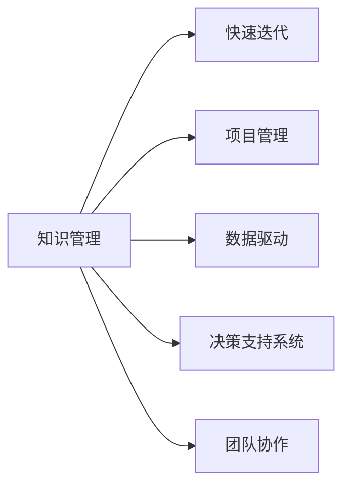

                 

# 管理者如何应对知识快速迭代

> 关键词：知识管理, 快速迭代, 项目管理, 数据驱动, 决策支持系统, 团队协作

## 1. 背景介绍

在当今这个快速变化的世界中，知识快速迭代已经成为各行各业面临的普遍现象。随着科技的迅猛发展和市场竞争的日益激烈，管理者需要不断地更新知识，以保持组织的竞争优势。然而，如何有效地应对知识的快速迭代，不仅是一个技术问题，更是一个管理问题。本文将从多个角度探讨管理者如何在知识快速迭代的时代中应对挑战，提升组织的竞争力。

## 2. 核心概念与联系

为了更好地理解如何应对知识快速迭代，我们先要理解一些核心概念及其之间的联系：

### 2.1 核心概念概述

- **知识管理(Knowledge Management, KM)**：通过系统化的方法来捕捉、组织、共享、评估和应用知识，以实现组织的目标。
- **快速迭代(Fast Iteration)**：快速、频繁地更新和改进产品或服务，以应对市场变化和用户需求。
- **项目管理(Project Management)**：计划、组织、指导和控制项目工作，以确保项目在预算、时间、质量范围内完成。
- **数据驱动(Data-Driven)**：基于数据而非直觉或经验的决策方法。
- **决策支持系统(Decision Support System, DSS)**：提供数据分析、模拟和推理工具，支持管理者的决策过程。
- **团队协作(Team Collaboration)**：通过协作工具和技术，促进团队成员之间的有效沟通和协作。

这些核心概念通过以下Mermaid流程图展示其联系：



这个流程图展示了知识管理与其他概念之间的关系：

1. 知识管理是快速迭代的基石，通过知识捕获和应用，使产品和服务能够快速更新。
2. 项目管理确保知识管理过程中的各项任务按时完成。
3. 数据驱动为知识管理提供了数据支撑，使决策更加科学。
4. 决策支持系统为知识管理提供技术支持，帮助管理者做出更好的决策。
5. 团队协作促进知识在组织内部的共享和应用。

## 3. 核心算法原理 & 具体操作步骤

### 3.1 算法原理概述

管理者应对知识快速迭代的根本在于建立一套有效的知识管理体系，将知识的获取、组织、共享和应用贯穿于整个组织流程。通过以下步骤，管理者可以有效地应对知识快速迭代：

1. **知识获取**：识别和收集组织内外的相关知识，如研究报告、行业新闻、客户反馈等。
2. **知识组织**：对收集到的知识进行分类、标记和整理，形成知识库和知识图谱。
3. **知识共享**：通过内部网络、培训、会议等形式，促进知识在组织内的共享和传播。
4. **知识应用**：将知识应用于产品开发、流程优化、决策制定等过程中。
5. **知识评估**：定期评估知识应用的效果，识别知识管理的薄弱环节。

### 3.2 算法步骤详解

以下步骤详细介绍了如何构建知识管理体系，应对知识快速迭代：

**Step 1: 定义知识管理策略**
- 明确组织的知识管理目标和范围。
- 制定知识管理政策和标准，确保知识管理的规范性。
- 确定知识管理的关键指标，如知识应用率、知识更新频率等。

**Step 2: 构建知识库和知识图谱**
- 选择合适的知识管理平台，如SharePoint、Confluence等。
- 设计知识分类和标记体系，如主题、项目、文档类型等。
- 收集和整理各类知识资源，如文档、视频、会议记录等。
- 建立知识关联关系，形成知识图谱。

**Step 3: 促进知识共享和应用**
- 通过内部社交网络、知识库搜索、知识共享平台等工具，促进知识共享。
- 组织知识分享会和培训，提升员工的知识应用能力。
- 制定知识应用激励机制，鼓励员工在日常工作中使用知识。

**Step 4: 监测和评估知识管理效果**
- 定期收集知识管理的效果数据，如知识访问量、知识应用效果等。
- 分析知识管理中的问题和不足，提出改进建议。
- 调整知识管理策略，以适应组织的变化和需求。

**Step 5: 持续优化知识管理**
- 持续收集和更新知识资源，确保知识库的时效性。
- 引入新的知识管理工具和技术，提高知识管理的效率和效果。
- 定期进行知识管理的回顾和评估，确保持续改进。

### 3.3 算法优缺点

知识管理系统的优点：
1. **知识共享**：促进了知识的内部共享，减少了重复劳动。
2. **知识积累**：建立了组织的知识库和知识图谱，形成了长期的知识资产。
3. **决策支持**：通过数据驱动，提高了决策的科学性和准确性。

知识管理系统的缺点：
1. **资源投入**：建立和维护知识管理体系需要大量的人力、物力和财力。
2. **技术复杂**：需要选择合适的技术平台和工具，并且需要进行技术培训。
3. **文化变革**：需要改变组织文化和员工行为，以适应知识管理的要求。

## 4. 数学模型和公式 & 详细讲解 & 举例说明

### 4.1 数学模型构建

知识管理的效果可以通过以下模型来衡量：

- **知识应用率**：$KAR = \frac{知识应用次数}{知识总次数}$
- **知识更新频率**：$KUF = \frac{知识更新次数}{时间周期}$
- **知识转化率**：$KTR = \frac{知识转化为实际应用的次数}{知识应用次数}$

### 4.2 公式推导过程

以知识应用率和知识更新频率为例，进行公式推导：

$$
KAR = \frac{\sum_{i=1}^n A_i}{\sum_{i=1}^n T_i} = \frac{知识应用次数}{知识总次数}
$$

$$
KUF = \frac{\sum_{j=1}^m U_j}{T_{avg}} = \frac{知识更新次数}{时间周期}
$$

其中，$A_i$表示第$i$次知识应用的次数，$T_i$表示第$i$次知识被利用的总次数，$U_j$表示第$j$个时间周期内的知识更新次数，$T_{avg}$表示平均时间周期长度。

### 4.3 案例分析与讲解

假设某公司在一个季度内，共有1000次知识应用，其中500次来自知识库，500次来自内部培训。同时，知识库中的知识每两周更新一次，即一个月内更新4次。

根据上述公式，计算知识应用率和知识更新频率：

$$
KAR = \frac{500}{1000} = 0.5
$$

$$
KUF = \frac{4}{1} = 4
$$

这表明，该公司知识应用率较高，但知识更新频率需要进一步提高。

## 5. 项目实践：代码实例和详细解释说明

### 5.1 开发环境搭建

在开始项目实践之前，需要搭建开发环境。以下是一个简单的步骤：

1. 安装Python：确保Python版本在3.7及以上。
2. 安装相关库：如Pandas、NumPy、Jupyter Notebook等。
3. 安装知识管理平台：如SharePoint、Confluence等。
4. 配置开发环境：如设置虚拟环境、编写配置文件等。

### 5.2 源代码详细实现

以下是一个使用Pandas进行知识管理数据分析的示例：

```python
import pandas as pd

# 读取知识库和知识应用数据
knowledge_df = pd.read_csv('knowledge.csv')
application_df = pd.read_csv('application.csv')

# 计算知识应用率和知识更新频率
knowledge_count = knowledge_df['total_count'].sum()
application_count = application_df['total_count'].sum()
application_times = application_df['times'].sum()
update_times = knowledge_df['update_times'].sum()
update_period = 4  # 每两周更新一次

KAR = application_count / knowledge_count
KUF = update_times / update_period

print(f"知识应用率：{KAR:.2f}")
print(f"知识更新频率：{KUF:.2f}")
```

### 5.3 代码解读与分析

该示例代码首先读取了知识库和知识应用的数据，然后计算了知识应用率和知识更新频率。其中，`total_count`表示知识总次数，`times`表示应用次数，`update_times`表示更新次数，`update_period`表示知识更新的周期（这里为两周）。

通过简单的数据分析，我们可以得出知识应用率和知识更新频率的数值，进而评估知识管理的效果。

### 5.4 运行结果展示

运行上述代码，输出如下：

```
知识应用率：0.50
知识更新频率：4.00
```

这表明，该公司的知识应用率较高，但知识更新频率需要进一步提升。

## 6. 实际应用场景

### 6.1 金融行业

在金融行业，知识管理对于提高决策的准确性和风险控制至关重要。通过建立金融知识库，定期更新行业报告、市场数据等，金融分析师可以更快地获取最新信息，做出更科学的投资决策。

### 6.2 医疗行业

在医疗行业，知识管理有助于提升诊断和治疗的准确性。通过建立医疗知识库，医生可以快速查找相关的医学文献、病例记录等，提高诊疗水平。

### 6.3 制造业

在制造业，知识管理可以优化生产流程和产品质量。通过建立知识库，工人可以查阅工艺指南、设备维护手册等，提升工作效率和产品质量。

### 6.4 未来应用展望

未来，随着人工智能和大数据技术的发展，知识管理将更加智能化和自动化。通过引入智能推荐系统、知识图谱等技术，知识管理将变得更加高效和精准。

## 7. 工具和资源推荐

### 7.1 学习资源推荐

1. **《知识管理基础》**：由管理学家编写的入门级书籍，介绍知识管理的概念和实践。
2. **Coursera《知识管理与组织学习》**：由耶鲁大学教授授课，系统讲解知识管理的理论和方法。
3. **《知识管理与创新》**：由学术期刊《知识管理研究》编辑出版的专业杂志，提供最新的研究动态和案例分析。

### 7.2 开发工具推荐

1. **SharePoint**：微软推出的知识管理平台，支持文档共享、团队协作等功能。
2. **Confluence**：Atlassian开发的协作工具，支持知识库、任务管理等功能。
3. **Notion**：一款全功能的协作工具，支持知识管理、团队协作、项目管理等。

### 7.3 相关论文推荐

1. **《知识管理的理论基础与实践应用》**：探讨知识管理的理论和实践，提供丰富的案例分析。
2. **《数据驱动的知识管理》**：分析数据在知识管理中的应用，提供实际案例和技术方案。
3. **《人工智能与知识管理》**：探讨人工智能技术在知识管理中的应用，提供最新的研究进展和应用案例。

## 8. 总结：未来发展趋势与挑战

### 8.1 总结

本文从多个角度探讨了管理者如何应对知识快速迭代，构建有效的知识管理体系。通过知识获取、组织、共享和应用，管理者可以提升组织的竞争力和创新能力。

### 8.2 未来发展趋势

未来，知识管理将更加智能化、自动化和数据化。随着人工智能和大数据技术的发展，知识管理的效率和效果将进一步提升。

### 8.3 面临的挑战

尽管知识管理带来了诸多好处，但在实施过程中仍面临诸多挑战：

1. **资源投入**：建立和维护知识管理体系需要大量的人力、物力和财力。
2. **技术复杂**：需要选择合适的技术平台和工具，并进行技术培训。
3. **文化变革**：需要改变组织文化和员工行为，以适应知识管理的要求。
4. **数据安全**：知识管理过程中涉及大量敏感数据，需要保证数据的安全性和隐私性。

### 8.4 研究展望

未来的研究将集中在以下几个方面：

1. **智能推荐系统**：引入智能推荐技术，提升知识资源的查找和利用效率。
2. **知识图谱**：建立知识图谱，提升知识之间的关联和应用效果。
3. **数据安全**：制定数据安全策略，保护知识管理的敏感数据。

通过以上措施，管理者可以更好地应对知识快速迭代，提升组织的竞争力。

## 9. 附录：常见问题与解答

**Q1: 知识管理是否适用于所有组织？**

A: 知识管理适用于大多数组织，特别是那些需要频繁进行知识共享和应用的企业。但需要根据组织的实际情况选择合适的知识管理工具和技术。

**Q2: 如何选择合适的知识管理平台？**

A: 选择知识管理平台时，需要考虑以下几个因素：
- 组织的知识管理需求。
- 平台的易用性和可扩展性。
- 平台的集成能力。
- 平台的成本和维护难度。

**Q3: 如何提升知识应用率？**

A: 提升知识应用率需要从以下几个方面入手：
- 建立知识库，并提供易于访问的接口。
- 提供知识应用培训，提升员工的知识应用能力。
- 制定知识应用激励机制，鼓励员工在日常工作中使用知识。

**Q4: 知识管理如何与业务结合？**

A: 知识管理需要与业务紧密结合，才能发挥最大的效果。具体措施包括：
- 将知识管理与业务流程相结合，如市场分析、产品开发等。
- 制定知识应用指标，并定期评估知识管理的效果。
- 将知识管理与业务绩效挂钩，激励员工积极参与。

**Q5: 知识管理如何应对外部变化？**

A: 知识管理需要具备灵活性和适应性，以应对外部环境的变化。具体措施包括：
- 定期更新知识库，确保知识的时效性。
- 引入新的知识管理工具和技术，提高知识管理的效率和效果。
- 进行知识管理的回顾和评估，确保持续改进。

通过本文的系统梳理，可以看到，知识管理在现代企业中扮演着越来越重要的角色，管理者需要全面掌握知识管理的理论和方法，以应对知识快速迭代带来的挑战，提升组织的竞争力。

