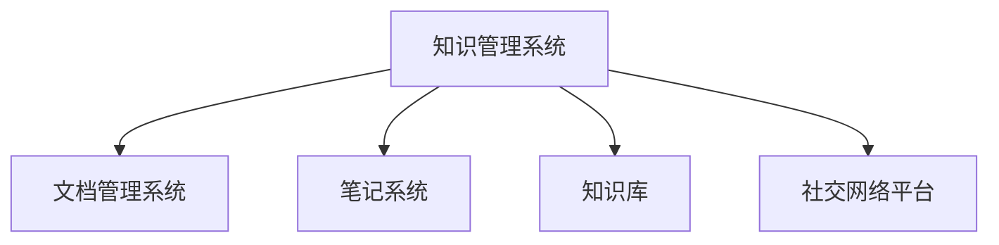

                 

# 管理者如何建立个人知识管理系统

## 1. 背景介绍

### 1.1 问题由来
在现代社会，知识更新速度不断加快，管理者面临着前所未有的信息爆炸压力。如何在海量信息中快速获取、组织、利用关键信息，成为管理者的核心挑战。传统的纸质文件、文件夹管理方式已无法满足需求。因此，构建一个高效、灵活的个人知识管理系统显得尤为重要。

### 1.2 问题核心关键点
管理者知识管理系统的核心目标在于：

1. **高效检索**：能够快速找到所需信息，提升决策效率。
2. **系统化存储**：将知识结构化存储，便于分类检索和复用。
3. **易于扩展**：随着知识积累，系统能灵活扩展，适应新需求。
4. **协作共享**：与团队成员协作，共享知识，促进共同成长。

本文档旨在通过系统性介绍知识管理系统（KMS）的概念、原理、实现方法和应用场景，帮助管理者构建高效的知识管理体系。

## 2. 核心概念与联系

### 2.1 核心概念概述

- **知识管理系统(KMS)**：利用软件工具，帮助个人或团队收集、整理、分享、检索和利用知识的管理系统。KMS通过结构化存储、标签分类、搜索功能等机制，帮助管理者高效管理和利用知识。
- **文档管理系统(DMS)**：是KMS的一个重要组成部分，用于存储、管理和检索文档。文档管理系统强调文件的版本控制和权限管理。
- **笔记系统(Note System)**：记录和管理个人或团队的思想、灵感、待办事项等非结构化信息，通常包括笔记、任务、日程安排等。
- **知识库(Knowledge Base)**：存储特定领域的知识，如技术文档、政策法规、行业分析等，支持结构化查询和知识复用。
- **社交网络平台**：支持知识分享和协作，如企业内网、知识论坛、邮件列表等，促进信息交流和知识传播。

### 2.2 核心概念原理和架构的 Mermaid 流程图



此图展示了KMS的架构和关键组成部分：文档管理系统、笔记系统、知识库、社交网络平台。每个组件通过API接口与其他组件交互，实现数据的共享和集成。

## 3. 核心算法原理 & 具体操作步骤

### 3.1 算法原理概述

知识管理系统的核心算法原理主要包括：

- **分类和标签系统**：通过分类和标签对知识进行结构化组织，便于检索和管理。
- **搜索算法**：支持基于关键词、标签、作者等多种方式的搜索，提高信息检索效率。
- **版本控制**：确保知识文档的更新和变更历史可追溯，避免版本混乱。
- **协作和共享**：支持知识共享和协作编辑，促进团队知识流动。
- **权限管理**：根据用户角色和权限，控制文档的访问和使用。

### 3.2 算法步骤详解

1. **需求分析和规划**：
   - 确定知识管理的范围和目标。
   - 分析现有知识资产，明确需管理的文档、笔记、知识库等。
   - 设计系统的功能模块和数据模型。

2. **系统设计**：
   - 选择合适的KMS软件工具，如Confluence、SharePoint、Notion等。
   - 定义知识分类和标签体系，如按照项目、主题、部门等进行分类。
   - 设计搜索算法，确保快速检索所需信息。
   - 实现版本控制和权限管理功能，保障数据安全。

3. **数据迁移和导入**：
   - 将现有的纸质文件、电子文档、邮件附件等导入系统。
   - 进行数据清洗和分类，确保数据的准确性和完整性。

4. **用户培训和操作手册编写**：
   - 对使用者进行培训，确保其熟悉系统功能和操作流程。
   - 编写操作手册和常见问题解答，指导用户使用。

5. **系统测试和优化**：
   - 进行系统测试，确保各模块功能正常。
   - 收集用户反馈，不断优化系统功能。

6. **持续维护和更新**：
   - 定期更新知识库，确保知识的实时性和准确性。
   - 更新权限和角色设置，适应团队变化。

### 3.3 算法优缺点

**优点**：

- 结构化存储和检索，提升信息管理效率。
- 支持版本控制和权限管理，保障数据安全。
- 促进团队协作和知识共享。

**缺点**：

- 初始设置和数据导入工作量大。
- 系统的灵活性取决于工具的选择和配置。
- 依赖于软件维护和持续更新。

### 3.4 算法应用领域

KMS广泛应用于各种行业和组织，包括企业、政府机构、教育机构等。具体应用领域包括：

- **项目管理**：记录项目文档、计划、进度等，支持团队协作。
- **知识复用**：存储和检索技术文档、流程规范、行业分析等，促进知识复用。
- **客户支持**：记录和检索客户咨询、反馈、投诉等，提升服务质量。
- **培训和教育**：存储和检索培训资料、课件、案例等，支持员工培训。
- **市场营销**：存储和检索市场调研报告、客户分析等，支持市场决策。

## 4. 数学模型和公式 & 详细讲解 & 举例说明

### 4.1 数学模型构建

知识管理系统的数学模型主要涉及以下几个方面：

- **文档分类模型**：将文档分类到不同的主题或项目，使用朴素贝叶斯、K-means等算法。
- **标签管理模型**：对文档进行标签标注，使用TF-IDF、word2vec等算法。
- **搜索排序模型**：根据关键词、标签、作者等条件进行文档排序，使用倒排索引、向量空间模型等算法。

### 4.2 公式推导过程

以文档分类模型为例，使用朴素贝叶斯分类器进行推导：

设文档集为$D=\{d_1,d_2,\ldots,d_n\}$，每个文档$d_i$由$n$个词语组成，$w_{ij}$表示第$i$个文档中的第$j$个词语。假设已知文档集被分为$k$个类别$C=\{c_1,c_2,\ldots,c_k\}$。

朴素贝叶斯分类器的公式推导如下：

$$
P(c_i|d_i) = \frac{P(c_i)P(d_i|c_i)}{\sum_{j=1}^kP(c_j)P(d_i|c_j)}
$$

其中$P(c_i)$为先验概率，$P(d_i|c_i)$为条件概率，表示文档$d_i$属于类别$c_i$的概率。

### 4.3 案例分析与讲解

假设某企业需要在KMS中管理销售文档，使用朴素贝叶斯分类器进行文档分类。首先，收集历史销售文档，进行词频统计和标签标注。然后，使用朴素贝叶斯公式计算每个文档属于各个类别的概率，最终将文档分类到最可能的类别中。

## 5. 项目实践：代码实例和详细解释说明

### 5.1 开发环境搭建

为了搭建一个简单的知识管理系统，可以使用Python和Flask框架。

1. 安装Python和Flask：
   ```
   pip install flask
   ```

2. 创建Flask应用：
   ```python
   from flask import Flask, render_template, request
   app = Flask(__name__)

   @app.route('/')
   def home():
       return render_template('home.html')
   ```

### 5.2 源代码详细实现

接下来，实现文档分类和标签管理功能。

1. 文档分类：
   ```python
   from sklearn.feature_extraction.text import CountVectorizer
   from sklearn.naive_bayes import MultinomialNB

   def classify_documents(documents, categories):
       vectorizer = CountVectorizer()
       X = vectorizer.fit_transform(documents)
       clf = MultinomialNB()
       clf.fit(X, categories)
       return clf.predict(vectorizer.transform(['新的文档']))

   documents = [
       '销售计划', '市场分析', '客户反馈', '产品介绍'
   ]
   categories = ['销售', '市场', '客户', '产品']
   classified_documents = classify_documents(documents, categories)
   print(classified_documents)
   ```

2. 标签管理：
   ```python
   from sklearn.feature_extraction.text import TfidfVectorizer
   from sklearn.cluster import KMeans

   def label_documents(documents):
       vectorizer = TfidfVectorizer()
       X = vectorizer.fit_transform(documents)
       kmeans = KMeans(n_clusters=3)
       kmeans.fit(X)
       return kmeans.labels_

   documents = [
       '销售计划', '市场分析', '客户反馈', '产品介绍'
   ]
   labels = label_documents(documents)
   print(labels)
   ```

### 5.3 代码解读与分析

**文档分类**：
- 使用CountVectorizer将文档转换为词频矩阵。
- 使用MultinomialNB训练朴素贝叶斯分类器，返回文档的分类结果。

**标签管理**：
- 使用TfidfVectorizer将文档转换为TF-IDF向量。
- 使用KMeans进行聚类，将文档分为三个标签。

### 5.4 运行结果展示

运行上述代码，输出文档分类和标签管理的结果。

## 6. 实际应用场景

### 6.1 项目管理

企业可以使用KMS记录和管理项目文档、计划、进度等。通过文档分类和标签管理，快速查找相关信息，提升项目管理效率。

### 6.2 知识复用

在产品研发、市场调研等过程中，企业可以积累大量的技术文档、市场分析、客户反馈等，通过KMS进行分类存储，方便后续复用。

### 6.3 客户支持

客户支持团队可以记录和管理客户咨询、反馈、投诉等文档，通过搜索和分类功能，快速定位相关文档，提升客户服务质量。

### 6.4 培训和教育

培训经理可以记录和管理培训资料、课件、案例等，通过KMS进行分类和标签管理，方便员工学习和检索。

### 6.5 市场营销

市场营销团队可以记录和管理市场调研报告、客户分析等，通过KMS进行分类和标签管理，支持市场决策和策略制定。

## 7. 工具和资源推荐

### 7.1 学习资源推荐

1. **《知识管理：概念、技术和实践》**：该书详细介绍了知识管理的理论、技术和实践，是KMS建设的理论基础。
2. **《Flask Web开发：快速上手》**：该书介绍了使用Flask框架进行Web开发的基础知识和实践方法，适合初学者入门。
3. **《Python自然语言处理》**：该书介绍了Python在NLP领域的应用，包括文档分类、标签管理等技术。

### 7.2 开发工具推荐

1. **Flask**：轻量级的Web框架，适合快速开发简单的KMS应用。
2. **TensorFlow**：强大的机器学习库，支持各种分类和聚类算法。
3. **Jupyter Notebook**：支持交互式编程和数据分析，适合数据处理和算法验证。

### 7.3 相关论文推荐

1. **《信息检索与知识管理》**：该书详细介绍了信息检索和知识管理的理论和技术，是KMS建设的理论基础。
2. **《基于内容的Web搜索与推荐》**：该文介绍了基于内容的搜索和推荐算法，适合KMS的搜索排序功能实现。
3. **《知识管理系统的设计与实现》**：该文介绍了知识管理系统的设计和实现方法，适合KMS的开发实践。

## 8. 总结：未来发展趋势与挑战

### 8.1 未来发展趋势

未来KMS的发展趋势包括：

1. **智能化**：引入AI技术，如自然语言处理、机器学习等，提升知识管理的智能化水平。
2. **移动化**：支持移动端应用，方便用户随时随地访问和管理知识。
3. **集成化**：与其他业务系统（如CRM、ERP等）集成，实现数据共享和协同管理。
4. **可视化**：提供可视化界面，帮助用户快速理解和管理知识。
5. **安全化**：引入安全技术，如数据加密、权限管理等，保障知识安全。

### 8.2 面临的挑战

KMS的建设面临以下挑战：

1. **数据质量**：文档分类和标签管理的准确性依赖于高质量的数据，数据清洗和标注工作量大。
2. **系统复杂性**：KMS功能模块多，系统架构复杂，开发和维护成本高。
3. **用户接受度**：用户习惯和培训成本可能影响KMS的推广和使用。
4. **技术更新**：KMS需不断更新和升级，以适应新需求和新技术。

### 8.3 研究展望

未来KMS的研究方向包括：

1. **深度学习应用**：引入深度学习技术，提升文档分类和标签管理的精度。
2. **自然语言处理**：使用自然语言处理技术，提升知识搜索和推荐的准确性。
3. **智能推荐系统**：引入推荐算法，实现知识推荐和个性化管理。
4. **社交网络整合**：将社交网络与KMS整合，促进知识共享和协作。
5. **云计算和分布式存储**：利用云计算和分布式存储技术，实现知识管理的可扩展性。

## 9. 附录：常见问题与解答

**Q1：如何选择合适的KMS工具？**

A: 选择合适的KMS工具需要考虑以下几个因素：
1. 功能和特性：工具需满足企业的实际需求，如文档分类、标签管理、搜索排序等。
2. 用户体验：工具需易用性好，用户界面友好，操作简便。
3. 成本：工具需成本合理，包括购买、部署、维护等成本。
4. 可扩展性：工具需支持扩展和定制，满足企业未来需求。

**Q2：如何进行文档分类？**

A: 文档分类的主要步骤包括：
1. 收集和整理文档，去除噪声数据。
2. 使用自然语言处理技术，如TF-IDF、word2vec等，提取文档的特征。
3. 选择合适的分类算法，如朴素贝叶斯、SVM等，进行分类。
4. 对分类结果进行评估和优化，提升分类精度。

**Q3：如何进行标签管理？**

A: 标签管理的主要步骤包括：
1. 收集和整理文档，去除噪声数据。
2. 使用自然语言处理技术，如TF-IDF、word2vec等，提取文档的特征。
3. 选择合适的聚类算法，如KMeans、层次聚类等，进行聚类。
4. 对聚类结果进行评估和优化，提升聚类效果。

**Q4：如何进行知识搜索？**

A: 知识搜索的主要步骤包括：
1. 建立索引，将文档转换为可搜索的格式。
2. 使用倒排索引、向量空间模型等算法，建立文档和关键词之间的映射关系。
3. 提供搜索接口，支持关键词、标签、作者等多种搜索方式。
4. 对搜索结果进行排序和展示，提升用户检索体验。

**Q5：如何进行权限管理？**

A: 权限管理的主要步骤包括：
1. 定义用户角色和权限，如管理员、编辑、查看等。
2. 对文档进行权限控制，根据角色和权限设置文档的访问权限。
3. 对文档进行版本控制，记录文档的变更历史，确保数据安全。
4. 对访问记录进行监控和审计，确保数据使用合规。

**Q6：如何提高KMS的智能化水平？**

A: 提高KMS智能化水平的几个方法包括：
1. 引入自然语言处理技术，如文本分类、实体识别等。
2. 引入机器学习技术，如分类、聚类、推荐等。
3. 引入知识图谱技术，建立文档之间的关联关系。
4. 引入AI技术，如深度学习、强化学习等，提升知识管理的智能化水平。

---

作者：禅与计算机程序设计艺术 / Zen and the Art of Computer Programming

