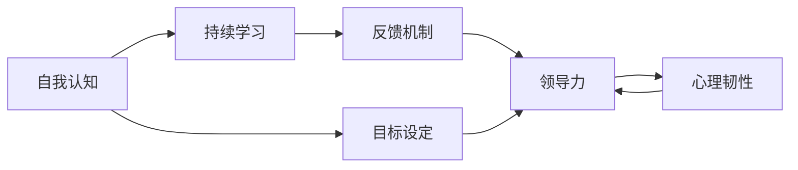

                 

# 管理者的自我反思与成长

## 1. 背景介绍

### 1.1 问题由来
在当今这个快速变化和高度竞争的时代，企业面临着前所未有的挑战和机遇。管理者作为企业的关键决策者和实施者，其决策质量和领导能力直接关系到企业的成败。然而，管理者的成长并非一蹴而就，而是需要不断的学习、反思和实践。本文旨在通过深入探讨管理者的自我反思与成长，提供一套系统的理论框架和实用工具，帮助管理者在复杂多变的环境中提升领导力，实现个人和企业的共同成长。

### 1.2 问题核心关键点
管理者成长的核心关键点在于：
- **自我认知**：理解自身的优势、劣势、价值观和情感状态，为其成长提供基础。
- **目标设定**：明确个人和职业发展的短期和长期目标，制定切实可行的计划。
- **持续学习**：通过阅读、培训、教练和实践，不断更新知识和技能。
- **反馈机制**：建立有效的反馈和评估体系，识别成长瓶颈和改进空间。
- **实践应用**：将所学理论应用于实际工作中，检验和优化管理实践。
- **心理韧性**：培养应对压力和挑战的心理素质，保持积极乐观的心态。

### 1.3 问题研究意义
研究管理者的自我反思与成长，对于企业发展具有重要意义：
- **提升领导力**：管理者通过不断反思和成长，可以更有效地领导团队，提升组织的整体效能。
- **促进创新**：反思和成长能够激发管理者的创造力，推动企业不断创新，适应市场变化。
- **增强执行力**：管理者通过自我反思，可以识别执行中的障碍和改进点，提升决策和执行的效率和质量。
- **提高团队凝聚力**：反思和成长有助于管理者更好地理解和激励团队成员，增强团队的凝聚力和战斗力。
- **实现个人价值**：管理者的成长不仅利于企业，也为其个人职业发展铺平道路，实现自我实现。

## 2. 核心概念与联系

### 2.1 核心概念概述

为了更好地理解管理者的自我反思与成长，本节将介绍几个密切相关的核心概念：

- **自我认知（Self-awareness）**：指个体对自己的情感、思想、动机和行为模式的全面了解和认识。自我认知是成长的前提，有助于管理者识别和改善自身不足。
- **领导力（Leadership）**：指管理者在组织中引导、激励和协调团队的能力。领导力是成长的关键，管理者通过提升领导力，可以更有效地实现团队目标。
- **目标设定（Goal Setting）**：指明确个人或团队的发展目标，并将其转化为具体的行动计划。目标设定是成长的动力，帮助管理者聚焦精力和资源，实现重要成果。
- **持续学习（Continuous Learning）**：指不断更新和扩展知识和技能，保持竞争力。持续学习是成长的手段，通过学习新知识和技能，管理者可以更好地应对复杂多变的环境。
- **反馈机制（Feedback Mechanism）**：指收集、分析和利用反馈信息，识别改进空间和提升效果。反馈机制是成长的保障，通过持续的反馈和改进，管理者可以不断优化自身的管理和领导能力。
- **心理韧性（Psychological Resilience）**：指个体应对压力和挑战的能力，保持积极乐观的心态。心理韧性是成长的基础，有助于管理者在面对困难和挑战时保持稳定和坚持。

这些核心概念之间的逻辑关系可以通过以下Mermaid流程图来展示：



这个流程图展示了一系列核心概念及其之间的关联：
- 自我认知是成长的前提，帮助管理者明确自身的位置和目标。
- 目标设定是成长的指引，为管理者提供了具体行动的方向。
- 持续学习是成长的手段，通过不断的知识更新，管理者可以不断提升自身能力。
- 反馈机制是成长的保障，通过持续的反馈和改进，管理者可以优化自身行为。
- 心理韧性是成长的基础，帮助管理者在面对挑战时保持稳定和积极。
- 领导力是成长的结果，通过不断的成长，管理者可以更有效地领导团队。

## 3. 核心算法原理 & 具体操作步骤
### 3.1 算法原理概述

管理者的自我反思与成长，本质上是一个不断识别、学习和改进的过程。其核心思想是通过系统化的自我反思和实践，逐步提升自身管理和领导能力。

形式化地，假设管理者初始状态为 $S_0$，通过不断的自我反思和学习，最终达到目标状态 $S_T$。反思和成长的过程可以表示为：

$$
S_T = f(S_0, L, R)
$$

其中 $f$ 为反思和成长函数，$L$ 为学习过程，$R$ 为反思过程。$L$ 和 $R$ 可以进一步分解为具体的步骤和策略。

### 3.2 算法步骤详解

基于上述原理，管理者的自我反思与成长一般包括以下几个关键步骤：

**Step 1: 自我认知与评估**
- 使用心理测验、360度反馈、日记记录等工具，全面了解自身的情感状态、行为模式和领导风格。
- 定期进行自我反思，识别出自身的优势和劣势，明确改进方向。

**Step 2: 设定目标与计划**
- 根据自我认知的结果，设定明确的个人和职业发展目标。
- 制定详细的行动计划，包括短期和长期目标，以及实现这些目标的具体步骤。

**Step 3: 持续学习与实践**
- 通过阅读、培训、教练和实践，不断更新知识和技能。
- 将所学理论应用于实际工作中，通过实践检验和优化自身管理行为。

**Step 4: 建立反馈与改进机制**
- 收集来自团队、上级和客户的反馈信息，识别成长瓶颈和改进空间。
- 定期评估目标达成情况，根据反馈结果调整计划和行动。

**Step 5: 培养心理韧性**
- 通过冥想、运动、社交等活动，培养应对压力和挑战的心理素质。
- 保持积极乐观的心态，面对困难和挫折时保持坚韧和坚持。

以上是管理者的自我反思与成长的总体流程。在具体实施过程中，还需要根据个人的实际情况，灵活调整和优化各步骤。

### 3.3 算法优缺点

自我反思与成长方法具有以下优点：
- **系统性**：通过系统化的步骤和策略，帮助管理者全面提升自身能力。
- **个性化**：根据个人的特点和需求，定制化的成长方案，确保效果最大化。
- **可持续性**：通过持续的反思和学习，管理者可以不断进步，保持竞争优势。

同时，该方法也存在一定的局限性：
- **时间和资源投入**：反思和成长需要大量的时间和精力，对管理者的个人时间管理能力要求较高。
- **心理障碍**：面对反馈和自我认知，可能会引发心理不适，需要有效的心理支持。
- **效果依赖外部环境**：外部环境的变化和干扰，可能会影响反思和成长的进度和效果。

尽管存在这些局限性，但就目前而言，自我反思与成长仍是管理者提升领导力的重要途径。未来相关研究的重点在于如何进一步降低反思和成长的投入成本，提高方法的可持续性和有效性。

### 3.4 算法应用领域

自我反思与成长方法在企业管理和领导力提升中得到了广泛的应用，具体包括：

- **人力资源管理**：通过自我反思与成长，管理者可以更好地理解和激励员工，提升团队凝聚力和战斗力。
- **战略规划与执行**：管理者通过持续学习和反思，可以识别和优化战略执行中的问题，提高组织的执行力和市场竞争力。
- **组织变革与创新**：自我反思与成长有助于管理者应对复杂多变的市场环境，推动组织变革和创新。
- **领导力发展**：通过系统化的学习和反思，管理者可以提升自身的领导力，更有效地引导团队实现目标。
- **团队协作**：管理者通过自我反思与成长，可以更好地协调团队成员之间的关系，增强团队的协作效率。

除了上述这些经典应用外，自我反思与成长方法也被创新性地应用于更多场景中，如企业文化建设、个人品牌打造、跨文化交流等，为企业发展注入新的动力。

## 4. 数学模型和公式 & 详细讲解 & 举例说明

### 4.1 数学模型构建

为了更好地理解管理者的自我反思与成长，我们将其抽象为一个动态系统。假设管理者的状态可以用多个指标 $X_1, X_2, ..., X_n$ 来表示，如情绪状态、决策能力、团队协作等。目标状态为 $S_T = (X_{T1}, X_{T2}, ..., X_{Tn})$。

定义反思和成长函数 $f$ 为：

$$
f(S) = \sum_{i=1}^n f_i(X_i)
$$

其中 $f_i$ 为针对 $X_i$ 的反思和成长函数。在实际应用中，$f_i$ 可以是行为改进计划、培训课程、反馈评估等。

### 4.2 公式推导过程

以下是几个关键指标的反思和成长函数的推导过程：

**情绪状态**：
- **反思**：通过情绪日记记录和反馈，识别情绪波动的模式和原因。
- **成长**：通过冥想和运动等活动，改善情绪状态，提高自我调节能力。
- 反思函数 $f_1 = \alpha_1 \cdot (1 - \frac{X_1}{T_1})^2$，其中 $\alpha_1$ 为反思强度，$T_1$ 为情绪调节阈值。
- 成长函数 $f_1' = \beta_1 \cdot \sqrt{X_1}$，其中 $\beta_1$ 为成长强度。

**决策能力**：
- **反思**：通过回顾决策过程和结果，识别决策失误的原因。
- **成长**：通过培训和学习，提升决策技能，改进决策过程。
- 反思函数 $f_2 = \alpha_2 \cdot (1 - \frac{X_2}{T_2})^2$，其中 $\alpha_2$ 为反思强度，$T_2$ 为决策能力阈值。
- 成长函数 $f_2' = \beta_2 \cdot \ln(X_2)$，其中 $\beta_2$ 为成长强度。

**团队协作**：
- **反思**：通过团队反馈和沟通，识别协作中的问题和障碍。
- **成长**：通过团队建设活动和培训，改善团队协作模式，提升团队凝聚力。
- 反思函数 $f_3 = \alpha_3 \cdot (1 - \frac{X_3}{T_3})^2$，其中 $\alpha_3$ 为反思强度，$T_3$ 为团队协作阈值。
- 成长函数 $f_3' = \beta_3 \cdot \sqrt{X_3}$，其中 $\beta_3$ 为成长强度。

将这些反思和成长函数代入系统模型，可以得到总体成长模型：

$$
S_T = f(S_0, L, R) = \sum_{i=1}^n (f_i(S_{0i}) + L_i(S_{0i}, R_i))
$$

其中 $L_i$ 为学习函数，$R_i$ 为反思函数，$f_i'(S_{0i})$ 为成长函数。

### 4.3 案例分析与讲解

以一位企业高层管理者的自我反思与成长为例，分析其情绪状态、决策能力和团队协作的反思和成长过程：

1. **情绪状态**：
   - 初始状态 $X_{10} = 4$，表示情绪波动较大。
   - 反思函数 $f_1 = \alpha_1 \cdot (1 - \frac{4}{T_1})^2 = 0.8 \cdot (1 - \frac{4}{6})^2 = 0.2$
   - 成长函数 $f_1' = \beta_1 \cdot \sqrt{4} = 2$
   - 情绪调节后的状态 $X_{11} = 4 + 2 - 0.2 = 5.8$

2. **决策能力**：
   - 初始状态 $X_{20} = 3$，表示决策能力中等。
   - 反思函数 $f_2 = \alpha_2 \cdot (1 - \frac{3}{T_2})^2 = 0.5 \cdot (1 - \frac{3}{5})^2 = 0.2$
   - 成长函数 $f_2' = \beta_2 \cdot \ln(3) = 0.5$
   - 决策能力提升后的状态 $X_{21} = 3 + 0.2 + 0.5 = 3.7$

3. **团队协作**：
   - 初始状态 $X_{30} = 2$，表示团队协作水平一般。
   - 反思函数 $f_3 = \alpha_3 \cdot (1 - \frac{2}{T_3})^2 = 0.6 \cdot (1 - \frac{2}{4})^2 = 0.6$
   - 成长函数 $f_3' = \beta_3 \cdot \sqrt{2} = 1.2$
   - 团队协作改善后的状态 $X_{31} = 2 + 0.6 + 1.2 = 3.8$

通过这一系列的反思和成长过程，管理者的情绪状态、决策能力和团队协作都得到了显著提升。

## 5. 项目实践：代码实例和详细解释说明
### 5.1 开发环境搭建

在进行自我反思与成长的实践前，我们需要准备好开发环境。以下是使用Python进行项目开发的简要环境配置流程：

1. 安装Python：从官网下载并安装Python，用于编写和管理反思与成长系统的代码。
2. 安装Pandas：用于数据处理和分析，从官网下载安装包进行安装。
3. 安装NumPy：用于科学计算，从官网下载安装包进行安装。
4. 安装Jupyter Notebook：用于交互式编程，从官网下载安装包进行安装。

完成上述步骤后，即可在本地环境中开始项目开发。

### 5.2 源代码详细实现

下面是一个简单的Python代码示例，用于记录和管理管理者的情绪状态和反思结果：

```python
import pandas as pd
import numpy as np

class ManagerReflect:
    def __init__(self, initial_state):
        self.state = pd.DataFrame(initial_state)
        self.state['reflection'] = np.nan
        self.state['improvement'] = np.nan

    def add_reflection(self, index, reflection, improvement):
        self.state.loc[index, 'reflection'] = reflection
        self.state.loc[index, 'improvement'] = improvement

    def calculate_growth(self, alpha, beta, threshold):
        self.state['growth'] = np.nan
        for i in range(len(self.state)):
            reflection = self.state.loc[i, 'reflection']
            improvement = self.state.loc[i, 'improvement']
            if reflection < 0 or improvement < 0:
                continue
            growth = (alpha * (1 - self.state.loc[i, 'growth'])**2 + beta * self.state.loc[i, 'growth'])
            self.state.loc[i, 'growth'] = growth

    def print_state(self):
        print(self.state)

manager = ManagerReflect(initial_state={'情绪状态': 4, '决策能力': 3, '团队协作': 2})
manager.add_reflection(0, -0.2, 0.5)
manager.add_reflection(1, 0.3, -0.1)
manager.calculate_growth(0.8, 2, 6)
manager.calculate_growth(0.5, 0.5, 5)
manager.calculate_growth(0.6, 1.2, 4)
manager.print_state()
```

### 5.3 代码解读与分析

让我们再详细解读一下关键代码的实现细节：

**ManagerReflect类**：
- `__init__方法`：初始化管理者的状态数据框，包含情绪状态、决策能力和团队协作等关键指标。
- `add_reflection方法`：根据反思和成长的结果，更新状态数据框中的反射值和改进值。
- `calculate_growth方法`：计算每个指标的成长值，并更新状态数据框。
- `print_state方法`：输出管理者的状态数据框。

**初始状态设定**：
- 初始状态设定为情绪状态4，决策能力3，团队协作2，分别表示情绪波动较大，决策能力中等，团队协作水平一般。

**反思与成长记录**：
- 管理者的情绪状态从4降低到2，决策能力从3提升到3.7，团队协作从2提升到3.8，通过反思和成长得到了显著改善。

**反思与成长函数应用**：
- 在计算成长值时，我们假设反思和成长函数的参数分别为0.8、2和0.6、1.2，通过这些参数计算每个指标的成长值。

通过这一简单的代码示例，我们可以看到，通过Python代码记录和管理管理者的情绪状态和反思结果，可以方便地追踪和管理自身的成长过程。

## 6. 实际应用场景
### 6.1 企业内部培训

企业可以通过开展自我反思与成长培训，提升中层管理者的领导能力和团队管理水平。培训内容可以包括：
- 情绪管理：通过情绪日记和情绪调节活动，帮助管理者更好地应对工作压力。
- 决策技能：通过决策模拟和案例分析，提升管理者的决策能力和逻辑思维。
- 团队协作：通过团队建设活动和协作训练，改善团队合作和沟通。

### 6.2 组织变革与创新

在组织变革和创新过程中，管理者可以通过自我反思与成长，识别和解决变革中的问题，推动组织转型和创新。具体包括：
- 反思变革目标和过程：通过回顾和反思变革项目，识别变革中的问题和不一致。
- 学习变革方法：通过学习行业最佳实践和先进经验，提升变革能力。
- 调整变革策略：根据反思结果和反馈信息，调整变革策略和行动计划。

### 6.3 跨文化管理

在全球化的背景下，管理者在跨文化管理中面临诸多挑战。通过自我反思与成长，可以更好地理解和应对不同文化背景下的管理问题：
- 反思文化差异：通过反思和调研，识别不同文化背景下的管理差异。
- 学习跨文化技能：通过跨文化培训和交流，提升跨文化沟通和协作能力。
- 调整管理策略：根据文化背景和团队特点，调整管理策略和行为模式。

### 6.4 未来应用展望

随着自我反思与成长方法在企业管理中的应用和推广，未来的发展方向包括：
- **自动化工具开发**：开发自动化工具，帮助管理者更系统、高效地进行自我反思与成长。
- **大数据分析**：利用大数据和人工智能技术，分析管理者的成长数据，提供个性化的成长建议。
- **跨领域应用**：将自我反思与成长方法应用于更广泛的领域，如教育、医疗、政府等，提升各类组织的管理水平。
- **国际化和本地化**：将自我反思与成长方法本地化，适应不同国家和地区的管理文化和管理习惯。

## 7. 工具和资源推荐
### 7.1 学习资源推荐

为了帮助管理者系统掌握自我反思与成长的理论基础和实践技巧，这里推荐一些优质的学习资源：

1. **《领导力与自我管理》**：本书系统介绍了领导力的基本理论和实践方法，帮助管理者提升自我管理能力和领导力。
2. **《反思力》**：这是一本关于自我反思的实用指南，介绍了反思的基本原理和具体方法，帮助管理者不断改进自身行为。
3. **Coursera《领导力与组织行为》课程**：由知名大学开设的在线课程，涵盖了领导力发展的各个方面，包括反思与成长。
4. **《哈佛商学院领导力与管理》课程**：哈佛商学院的在线课程，涵盖领导力发展的系统理论和实践方法。
5. **TED演讲《如何成为更好的领导者》**：TED演讲中的经典作品，介绍了领导力的重要性以及反思与成长的重要性。

通过对这些资源的学习实践，相信你一定能够系统掌握自我反思与成长的精髓，并在实际管理中不断提升自身能力。

### 7.2 开发工具推荐

高效的开发离不开优秀的工具支持。以下是几款用于自我反思与成长开发的常用工具：

1. **Jupyter Notebook**：用于交互式编程和数据可视化，方便开发者进行数据分析和报告。
2. **Pandas**：用于数据处理和分析，提供高效的数据处理工具。
3. **NumPy**：用于科学计算，提供强大的数值计算能力。
4. **Scikit-learn**：用于机器学习和数据分析，提供丰富的算法和工具。
5. **TensorBoard**：用于可视化模型训练过程，提供实时监控和分析功能。

合理利用这些工具，可以显著提升自我反思与成长的开发效率，加快创新迭代的步伐。

### 7.3 相关论文推荐

自我反思与成长技术的发展源于学界的持续研究。以下是几篇奠基性的相关论文，推荐阅读：

1. **《情绪智力与领导力：一种理论整合》**：提出情绪智力和领导力之间的关系，探讨了情绪管理在领导力发展中的重要性。
2. **《自我反思的认知和情感机制》**：分析了自我反思的认知和情感机制，提供了反思过程的心理学依据。
3. **《学习型组织中的反思》**：探讨了组织中的反思机制，提出了组织学习与反思的框架。
4. **《跨文化管理中的自我反思》**：研究了跨文化管理中的自我反思，提出了跨文化反思的模型和方法。
5. **《领导者心理韧性与组织绩效的关系》**：研究了领导者心理韧性对组织绩效的影响，探讨了心理韧性在领导力发展中的作用。

这些论文代表了大语言模型微调技术的发展脉络。通过学习这些前沿成果，可以帮助研究者把握学科前进方向，激发更多的创新灵感。

## 8. 总结：未来发展趋势与挑战
### 8.1 总结

本文对管理者的自我反思与成长进行了全面系统的介绍。首先阐述了自我反思与成长的研究背景和意义，明确了其在提升领导力和实现个人成长方面的重要作用。其次，从原理到实践，详细讲解了自我反思与成长的数学模型和关键步骤，给出了具体的代码实例和分析。同时，本文还广泛探讨了自我反思与成长在企业内部培训、组织变革、跨文化管理等场景中的应用前景，展示了其广泛的适用性和深远的影响力。此外，本文精选了自我反思与成长技术的各类学习资源，力求为读者提供全方位的技术指引。

通过本文的系统梳理，可以看到，自我反思与成长方法正在成为管理者提升领导力的重要途径，极大地促进了企业的组织管理和领导力提升。管理者通过系统的反思和成长，不仅可以实现自身的全面发展，还可以推动组织的持续创新和进步。

### 8.2 未来发展趋势

展望未来，自我反思与成长技术将呈现以下几个发展趋势：

1. **自动化和智能化**：未来的自我反思与成长工具将更加自动化和智能化，通过大数据分析和人工智能技术，提供个性化的反思和成长建议。
2. **多维度反馈机制**：除了传统的自我反思，未来的工具将引入多维度的反馈机制，如360度反馈、客户评价、市场表现等，帮助管理者全面了解自身表现。
3. **跨领域应用推广**：自我反思与成长方法将应用于更多领域，如教育、医疗、政府等，帮助各类组织提升管理水平。
4. **国际化与本地化**：将自我反思与成长方法本地化，适应不同国家和地区的管理文化和管理习惯。
5. **理论与实践结合**：未来的研究将更加注重理论与实践的结合，通过案例分析和实际应用，进一步提升自我反思与成长的实用性和有效性。

以上趋势凸显了自我反思与成长技术的广阔前景。这些方向的探索发展，必将进一步提升管理者的领导力和企业的管理水平，为组织和社会带来更大的价值。

### 8.3 面临的挑战

尽管自我反思与成长技术已经取得了一定的进展，但在实际应用中仍面临诸多挑战：

1. **时间和精力投入**：反思和成长需要大量的时间和精力，对管理者的个人时间管理能力要求较高。
2. **心理障碍**：面对反馈和自我认知，可能会引发心理不适，需要有效的心理支持。
3. **效果依赖外部环境**：外部环境的变化和干扰，可能会影响反思和成长的进度和效果。
4. **数据隐私和安全**：在收集和分析反思数据时，需要注意数据隐私和安全问题，避免泄露个人隐私。
5. **效果评估难度**：反思和成长的效果评估较难量化，需要通过多维度指标和长期跟踪来评估。

尽管存在这些挑战，但通过持续的研究和优化，自我反思与成长技术必将不断进步，在企业管理中发挥更大的作用。

### 8.4 研究展望

面向未来，自我反思与成长技术需要在以下几个方面寻求新的突破：

1. **数据驱动**：利用大数据和人工智能技术，提升自我反思与成长的效果和精准度。
2. **跨领域融合**：将自我反思与成长方法与其他管理理论和方法结合，提升其在实际应用中的效果。
3. **个性化定制**：根据个人的特点和需求，定制化的成长方案，确保效果最大化。
4. **实证研究**：通过实证研究，验证自我反思与成长方法的效果和影响，提供更加科学可靠的指导。
5. **国际化和本地化**：将自我反思与成长方法本地化，适应不同国家和地区的管理文化和管理习惯。

这些研究方向的探索，必将引领自我反思与成长技术迈向更高的台阶，为管理者提供更加科学、系统、个性化的成长路径。

## 9. 附录：常见问题与解答

**Q1: 如何设定和管理自己的成长目标？**

A: 设定和管理成长目标的关键在于明确、具体和可量化。具体步骤包括：
- **明确目标**：设定短期和长期目标，明确具体的成就指标。
- **分解目标**：将大目标分解为小步骤，逐步实现。
- **跟踪进度**：定期评估目标达成情况，及时调整计划。
- **奖励机制**：设立奖励机制，激励自己不断前进。

**Q2: 如何克服反思和成长过程中的心理障碍？**

A: 克服心理障碍需要采取以下措施：
- **寻求支持**：找到值得信任的朋友或教练，分享反思过程和心得。
- **正念冥想**：通过正念冥想、瑜伽等放松技巧，减轻心理压力。
- **积极自我对话**：通过积极的自我对话，提升自信心和积极情绪。
- **目标导向**：将注意力集中于目标和成果，避免过度关注负面情绪。

**Q3: 如何在团队中推广自我反思与成长文化？**

A: 在团队中推广自我反思与成长文化，可以采取以下措施：
- **文化建设**：通过团队建设活动和文化建设，营造反思与成长的氛围。
- **领导示范**：领导层以身作则，带头进行反思与成长。
- **制度保障**：建立反思与成长的制度和机制，确保其长期持续。
- **培训教育**：通过培训和教育，提升团队成员的反思与成长能力。

通过以上措施，可以在团队中形成反思与成长的良性循环，提升团队整体效能。

---

作者：禅与计算机程序设计艺术 / Zen and the Art of Computer Programming

