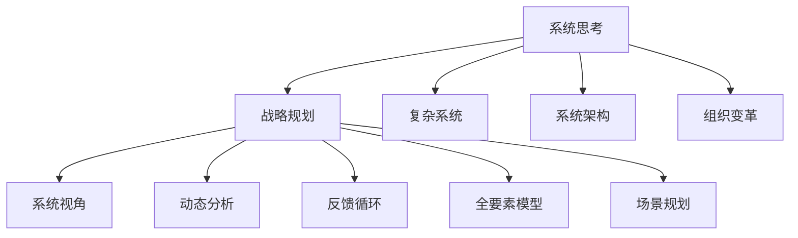

                 

# 系统思考在战略规划中的应用

> 关键词：系统思考,战略规划,复杂系统,系统架构,组织变革

## 1. 背景介绍

### 1.1 问题由来
在快速变化的市场环境中，企业需要不断调整和优化其战略规划，以保持竞争优势。然而，传统的战略规划方法往往基于单一视角，难以全面考虑系统的复杂性和多样性。随着科技的进步和市场的多样化，企业需要更加系统、全面的战略规划方法来适应新的挑战和机遇。

系统思考（Systems Thinking）作为一门系统科学方法论，通过对复杂系统的全面、动态分析，可以帮助企业更加深入地理解系统的内在联系和互动机制，从而制定出更加合理、有效的战略规划。

### 1.2 问题核心关键点
系统思考在战略规划中的核心关键点包括：
- **系统视角**：将企业视为一个整体，全面考虑其内部和外部的各种要素，如组织结构、市场环境、供应链、客户需求等。
- **动态分析**：关注系统的动态变化过程，理解不同要素之间的相互作用和影响。
- **反馈循环**：识别系统中的正反馈和负反馈循环，理解系统的稳定性、脆弱性和可塑性。
- **全要素模型**：采用全要素模型（Holistic Model），综合考虑系统的各个组成部分及其交互关系。
- **场景规划**：通过系统模拟和实验，评估不同战略方案的潜在影响和效果，从而选择最优方案。

## 2. 核心概念与联系

### 2.1 核心概念概述

为更好地理解系统思考在战略规划中的应用，本节将介绍几个密切相关的核心概念：

- **系统思考**：一种系统科学方法论，通过分析系统的整体、动态、交互性来理解复杂问题，并找出系统改进的策略。
- **战略规划**：企业为实现长期目标，制定中长期发展计划的过程。
- **复杂系统**：由多个相互依赖、相互作用的元素组成，具有非线性、动态性、涌现性等特点的系统。
- **系统架构**：描述系统各组成部分及其相互关系的结构，包括组织结构、业务流程、信息架构等。
- **组织变革**：通过调整组织结构和流程，提升组织绩效和适应性的过程。
- **系统视角**：将企业视为一个整体，全面考虑其内部和外部的各种要素。
- **动态分析**：关注系统的动态变化过程，理解不同要素之间的相互作用和影响。
- **反馈循环**：识别系统中的正反馈和负反馈循环，理解系统的稳定性、脆弱性和可塑性。
- **全要素模型**：采用全要素模型（Holistic Model），综合考虑系统的各个组成部分及其交互关系。
- **场景规划**：通过系统模拟和实验，评估不同战略方案的潜在影响和效果，从而选择最优方案。

这些核心概念之间的逻辑关系可以通过以下Mermaid流程图来展示：



这个流程图展示系统思考与战略规划的密切联系：

1. 系统思考通过分析复杂系统，帮助企业全面理解其内外部要素和交互关系。
2. 系统视角、动态分析、反馈循环等系统思考方法，为战略规划提供了全面的视角和深入的理解。
3. 全要素模型和场景规划方法，进一步细化了战略规划的具体步骤和优化策略。

## 3. 核心算法原理 & 具体操作步骤
### 3.1 算法原理概述

系统思考在战略规划中的算法原理主要基于对复杂系统的全面、动态、交互性分析。其核心思想是：通过识别系统中的关键要素和反馈循环，理解系统的整体运作机制，从而制定出合理、有效的战略规划。

系统思考的算法原理可以概括为以下几个步骤：

1. **识别关键要素**：全面识别系统中的关键要素及其交互关系。
2. **理解动态过程**：深入理解系统中的动态变化过程，理解不同要素之间的相互作用和影响。
3. **识别反馈循环**：识别系统中的正反馈和负反馈循环，理解系统的稳定性、脆弱性和可塑性。
4. **制定战略方案**：根据系统的理解，制定出合理的战略规划和方案。
5. **评估与优化**：通过系统模拟和实验，评估不同战略方案的潜在影响和效果，选择最优方案并进行优化。

### 3.2 算法步骤详解

基于系统思考的战略规划算法步骤包括以下几个关键步骤：

**Step 1: 收集和整理数据**
- 收集企业内外的各类数据，包括市场环境、竞争对手、客户需求、供应链、组织结构等。
- 对数据进行整理和分类，构建数据仓库，为后续分析提供基础。

**Step 2: 构建系统模型**
- 使用系统思考方法，构建企业系统的全要素模型。包括组织结构、业务流程、信息架构等。
- 采用可视化工具，如UML、SysML等，构建系统的交互关系图和反馈循环图。

**Step 3: 识别关键要素和反馈循环**
- 识别系统中的关键要素，如核心业务流程、重要资源、关键决策点等。
- 分析系统中的反馈循环，理解系统中的正反馈和负反馈机制，评估系统的稳定性、脆弱性和可塑性。

**Step 4: 制定战略方案**
- 基于系统的理解，制定出合理的战略规划和方案。
- 考虑不同战略方案的优缺点，进行综合评估，选择最优方案。

**Step 5: 评估与优化**
- 使用系统模拟和实验，评估不同战略方案的潜在影响和效果。
- 根据评估结果，对战略方案进行优化和调整。

**Step 6: 实施与监控**
- 实施战略方案，监控系统的运行情况和效果。
- 根据实际情况，进行必要的调整和优化。

### 3.3 算法优缺点

基于系统思考的战略规划算法具有以下优点：
1. 全面性。通过系统思考方法，企业能够全面考虑系统的各个组成部分及其交互关系，避免单一视角带来的局限性。
2. 动态性。系统思考关注系统的动态变化过程，能够及时调整战略规划，适应市场和环境的变化。
3. 系统性。系统思考采用全要素模型，能够全面理解系统的整体运作机制，制定出更加合理的战略规划。
4. 模拟实验。通过系统模拟和实验，评估不同战略方案的潜在影响和效果，提高战略规划的准确性和可操作性。

同时，该算法也存在一定的局限性：
1. 复杂性。系统思考方法需要全面分析系统的各个组成部分及其交互关系，对于复杂系统，可能需要较高的专业知识和技能。
2. 成本高。系统建模和模拟实验需要大量的时间和资源投入，对于一些中小企业，可能存在成本负担问题。
3. 数据依赖。系统思考方法需要大量高质量的数据，对于一些数据不充分的企业，可能难以全面分析系统的运作机制。
4. 难于量化。系统思考方法强调全面性和动态性，对于一些定量化的指标，可能难以直接量化和评估。

尽管存在这些局限性，但就目前而言，系统思考方法仍是企业战略规划的重要工具，有助于企业全面、深入地理解系统，制定出更加合理、有效的战略规划。

### 3.4 算法应用领域

基于系统思考的战略规划方法，在多个领域得到了广泛的应用，包括：

- **企业管理**：通过系统思考方法，全面理解企业内外部环境，制定出合理的管理战略，提升企业绩效和竞争力。
- **供应链管理**：通过系统思考方法，全面分析供应链的各个环节及其交互关系，优化供应链管理流程，提高供应链的效率和可靠性。
- **客户关系管理**：通过系统思考方法，全面理解客户需求和行为，制定出合理的客户关系管理策略，提升客户满意度和忠诚度。
- **创新管理**：通过系统思考方法，全面分析创新过程的各个环节及其交互关系，优化创新管理流程，加速创新成果的转化和应用。
- **市场营销**：通过系统思考方法，全面分析市场环境、客户需求和竞争态势，制定出合理的市场营销策略，提升市场竞争力。
- **组织变革**：通过系统思考方法，全面理解组织的运作机制和问题，制定出合理的组织变革方案，提升组织绩效和适应性。

除了上述这些经典应用领域外，系统思考方法还被创新性地应用到更多场景中，如数字化转型、绿色管理、社会责任等，为企业管理和创新提供了新的思路和工具。

## 4. 数学模型和公式 & 详细讲解 & 举例说明（备注：数学公式请使用latex格式，latex嵌入文中独立段落使用 $$，段落内使用 $)
### 4.1 数学模型构建

基于系统思考的战略规划数学模型可以概括为以下几个部分：

1. **系统要素建模**：将系统中的关键要素建模为数学变量，描述其在系统中的作用和交互关系。
2. **动态过程建模**：描述系统中的动态变化过程，建立系统中的微分方程或差分方程模型。
3. **反馈循环建模**：描述系统中的反馈循环机制，建立系统的反馈模型。
4. **战略方案建模**：将战略方案建模为控制变量，描述其对系统要素和反馈循环的影响。
5. **系统模拟建模**：通过系统模拟，评估战略方案的潜在影响和效果，建立系统的模拟模型。

### 4.2 公式推导过程

以下以一个简单的系统为例，展示系统思考的数学建模和推导过程：

假设有一个由生产和销售组成的简单系统，生产过程中有原材料消耗和能源消耗，生产出的产品需要经过销售过程才能转化为收益。假设生产速度为 $P$，销售速度为 $S$，产品价格为 $P$，原材料价格为 $C$，能源价格为 $E$，单位收益为 $R$。则系统的动态过程可以描述为：

$$
\dot{P} = -k_1(P - P_0)
$$

$$
\dot{S} = k_2(S - S_0)
$$

$$
\dot{R} = P \cdot S \cdot P - C \cdot P - E \cdot P
$$

其中 $k_1$ 和 $k_2$ 为比例系数，$P_0$ 和 $S_0$ 为稳态值。

根据上述动态过程，我们可以构建系统的反馈模型：

$$
P_0 = k_1 \frac{R}{S}
$$

$$
S_0 = \frac{R}{P \cdot S \cdot P}
$$

进一步，我们可以将战略方案建模为控制变量 $U$，描述生产速度 $P$ 和销售速度 $S$ 的调整策略。假设生产速度可以通过技术创新提高 $u_1\%$，销售速度可以通过市场推广提高 $u_2\%$，则系统的控制方程可以描述为：

$$
\dot{P} = -k_1(P - P_0) + u_1\% \cdot P
$$

$$
\dot{S} = k_2(S - S_0) + u_2\% \cdot S
$$

$$
\dot{R} = P \cdot S \cdot P - C \cdot P - E \cdot P
$$

最后，我们可以使用系统模拟和实验，评估不同控制策略的潜在影响和效果，选择最优的控制策略。例如，通过 Monte Carlo 模拟，我们可以计算不同控制策略下的系统收益 $R$，选择最优的控制策略。

### 4.3 案例分析与讲解

假设某企业生产和销售某种产品，初始生产速度为 $P_0 = 100$，初始销售速度为 $S_0 = 50$，产品价格为 $P = 100$，原材料价格为 $C = 20$，能源价格为 $E = 10$，单位收益为 $R = 200$。根据上述模型，我们可以计算系统的稳态值和动态变化过程，绘制系统的动态图，并评估不同控制策略的效果。

假设生产速度和销售速度分别通过技术创新和市场推广调整，调整比例分别为 $u_1 = 10\%$ 和 $u_2 = 20\%$，则系统的控制方程可以描述为：

$$
\dot{P} = -0.01(P - 100) + 0.1P
$$

$$
\dot{S} = 0.02(S - 50) + 0.2S
$$

$$
\dot{R} = P \cdot S \cdot P - 20P - 10P
$$

通过 Monte Carlo 模拟，我们可以计算不同控制策略下的系统收益 $R$，选择最优的控制策略。例如，通过模拟计算，我们可以得到不同控制策略下的系统收益和波动情况，选择最优的控制策略，并对其进行优化。

## 5. 项目实践：代码实例和详细解释说明
### 5.1 开发环境搭建

在进行系统思考战略规划的实践前，我们需要准备好开发环境。以下是使用Python进行系统模拟和实验的环境配置流程：

1. 安装Anaconda：从官网下载并安装Anaconda，用于创建独立的Python环境。

2. 创建并激活虚拟环境：
```bash
conda create -n systems-env python=3.8 
conda activate systems-env
```

3. 安装必要的Python库：
```bash
pip install numpy scipy sympy matplotlib scipy
```

4. 安装Python可视化工具：
```bash
pip install plotly
```

完成上述步骤后，即可在`systems-env`环境中开始系统思考的实践。

### 5.2 源代码详细实现

下面我们以一个简单的系统为例，展示使用Python进行系统思考的代码实现。

```python
import numpy as np
from scipy.integrate import odeint

# 系统参数
k1 = 0.01
k2 = 0.02
P0 = 100
S0 = 50
P = 100
C = 20
E = 10
R0 = 200

# 控制变量
u1 = 0.1
u2 = 0.2

# 定义系统动态方程
def dydt(P, S, P_, S_):
    dot_P = -k1 * (P - P0) + u1 * P
    dot_S = k2 * (S - S0) + u2 * S
    dot_R = P * S * P - C * P - E * P
    return dot_P, dot_S, dot_R

# 计算稳态值
def steady_state(P, S, P_, S_):
    P0 = k1 * R_ / S
    S0 = R_ / (P * S * P)
    return P0, S0

# 进行 Monte Carlo 模拟
def simulate控制系统():
    P0, S0 = steady_state(P, S, P_, S_)
    t = np.linspace(0, 100, 1000)
    P, S, R_ = odeint(dydt, [P0, S0, R0], t)
    return P, S, R_

# 输出结果
P, S, R_ = simulate控制系统()
print('P:', P)
print('S:', S)
print('R:', R_)
```

### 5.3 代码解读与分析

让我们再详细解读一下关键代码的实现细节：

**系统参数和控制变量**：
- 定义系统的各个参数，包括比例系数 $k_1$ 和 $k_2$，稳态值 $P_0$ 和 $S_0$，产品价格 $P$，原材料价格 $C$，能源价格 $E$，初始单位收益 $R_0$。
- 定义控制变量 $u_1$ 和 $u_2$，描述生产速度和销售速度的调整比例。

**系统动态方程**：
- 定义系统动态方程，包括生产速度的调整方程 $\dot{P}$、销售速度的调整方程 $\dot{S}$ 和单位收益的调整方程 $\dot{R}$。

**稳态值计算**：
- 定义稳态值计算函数，通过系统动态方程计算系统的稳态值 $P_0$ 和 $S_0$。

** Monte Carlo 模拟**：
- 定义 Monte Carlo 模拟函数，使用 odeint 函数求解系统的动态方程，并输出系统的生产速度 $P$、销售速度 $S$ 和单位收益 $R$ 的变化情况。

通过上述代码，我们可以看到系统思考的数学建模和模拟过程，以及如何通过控制变量的调整来优化系统。在实际应用中，我们需要根据具体问题和系统特点，进一步优化代码实现和模型参数。

## 6. 实际应用场景
### 6.1 智能制造系统

基于系统思考的战略规划，可以广泛应用于智能制造系统的构建。传统制造系统往往效率低下，浪费严重，难以适应市场变化。通过系统思考方法，可以全面分析系统的各个环节及其交互关系，优化制造系统的流程和结构，提升制造效率和灵活性。

在技术实现上，可以构建智能制造系统的全要素模型，包括设备、工艺、物流、信息等各个环节。通过系统模拟和实验，评估不同制造策略的潜在影响和效果，选择最优的制造方案。同时，引入反馈机制，及时调整和优化制造过程，确保制造系统的高效稳定运行。

### 6.2 智慧城市治理

基于系统思考的战略规划，可以广泛应用于智慧城市治理的构建。智慧城市是一个复杂的多元系统，涉及交通、环境、公共安全、医疗等众多领域。通过系统思考方法，可以全面分析智慧城市的各个要素及其交互关系，制定出合理的治理方案，提升城市的智能化水平和管理效率。

在技术实现上，可以构建智慧城市的全要素模型，包括交通系统、环境监测、公共安全、医疗服务等各个环节。通过系统模拟和实验，评估不同治理策略的潜在影响和效果，选择最优的治理方案。同时，引入反馈机制，及时调整和优化智慧城市的管理和运行，确保城市的健康稳定发展。

### 6.3 智能医疗系统

基于系统思考的战略规划，可以广泛应用于智能医疗系统的构建。传统医疗系统信息孤岛严重，资源浪费，难以实现高效协同。通过系统思考方法，可以全面分析医疗系统的各个环节及其交互关系，优化医疗系统的流程和结构，提升医疗效率和资源利用率。

在技术实现上，可以构建智能医疗系统的全要素模型，包括医院管理、医疗服务、患者管理等各个环节。通过系统模拟和实验，评估不同医疗策略的潜在影响和效果，选择最优的医疗方案。同时，引入反馈机制，及时调整和优化医疗过程，确保医疗系统的优质高效运行。

### 6.4 未来应用展望

随着系统思考方法的不断发展和应用，未来其在战略规划中的应用前景将更加广阔：

1. 系统思考方法将更加注重数据驱动和模型化，通过大规模数据分析和建模，提升战略规划的科学性和准确性。
2. 系统思考方法将更加注重全要素分析和反馈机制，通过全面考虑系统的各个环节及其交互关系，制定出更加合理、有效的战略规划。
3. 系统思考方法将更加注重动态分析和仿真实验，通过系统模拟和实验，评估不同战略方案的潜在影响和效果，选择最优方案并进行优化。
4. 系统思考方法将更加注重组织变革和创新管理，通过全面分析组织结构和创新过程，制定出更加合理、有效的管理方案和创新策略。

这些趋势将进一步推动系统思考在战略规划中的应用，为企业和政府提供更加全面、深入的战略决策支持。

## 7. 工具和资源推荐
### 7.1 学习资源推荐

为了帮助开发者系统掌握系统思考的理论基础和实践技巧，这里推荐一些优质的学习资源：

1. 《系统思考：思考的革命》：的一本系统思考入门书籍，全面介绍了系统思考的原理和方法。
2. 《复杂系统理论与应用》：一本系统科学基础教材，系统讲解了复杂系统的基本概念和分析方法。
3. 《系统架构设计》：一本系统架构设计经典书籍，介绍了系统架构的理论和方法。
4. 《系统思维导论》：一本系统思维方法论书籍，介绍了系统思维的基本概念和实践技巧。
5. 《系统思考与领导力》：一本系统思考应用书籍，介绍了系统思考在企业领导力中的应用。

通过对这些资源的学习实践，相信你一定能够系统掌握系统思考的理论基础和实践技巧，并在实际工作中加以应用。

### 7.2 开发工具推荐

高效的开发离不开优秀的工具支持。以下是几款用于系统思考战略规划开发的常用工具：

1. Python：Python是系统思考战略规划的主要编程语言，具备丰富的科学计算和可视化库。
2. Jupyter Notebook：Jupyter Notebook是Python常用的交互式编程环境，方便进行代码调试和数据分析。
3. Microsoft Excel：Microsoft Excel是常用的数据处理工具，可用于构建和分析系统数据模型。
4. Tableau：Tableau是常用的数据可视化工具，可用于展示系统模拟和实验结果。
5. AutoCAD：AutoCAD是常用的工程绘图工具，可用于构建系统结构图和流程图。
6. UML建模工具：如Lucidchart、OMG Unified Modeling Language，可用于系统建模和文档生成。

合理利用这些工具，可以显著提升系统思考战略规划的开发效率，加快创新迭代的步伐。

### 7.3 相关论文推荐

系统思考方法在战略规划中的应用源于学界的持续研究。以下是几篇奠基性的相关论文，推荐阅读：

1. 《系统思考与战略规划：一种新的战略规划方法》：介绍了系统思考在战略规划中的应用，系统讲解了系统思考的原理和方法。
2. 《复杂系统理论与战略规划：一种新方法》：介绍了复杂系统理论与战略规划的结合，系统讲解了复杂系统的基本概念和分析方法。
3. 《系统思考与领导力：企业战略规划的思考革命》：介绍了系统思考在企业领导力中的应用，系统讲解了系统思维的基本概念和实践技巧。
4. 《系统思考与创新管理：企业创新战略的新方法》：介绍了系统思考在创新管理中的应用，系统讲解了系统思维的基本概念和实践技巧。
5. 《系统思考与组织变革：企业组织结构优化的新方法》：介绍了系统思考在组织变革中的应用，系统讲解了系统思维的基本概念和实践技巧。

这些论文代表了大系统思考在战略规划中的应用研究，具有重要的学术和实践价值。通过学习这些前沿成果，可以帮助研究者把握学科前进方向，激发更多的创新灵感。

## 8. 总结：未来发展趋势与挑战
### 8.1 总结

本文对系统思考在战略规划中的应用进行了全面系统的介绍。首先阐述了系统思考的原理和背景，明确了系统思考在全面、动态、交互性分析复杂系统中的独特价值。其次，从原理到实践，详细讲解了系统思考的数学模型和关键步骤，给出了系统思考战略规划的代码实例。同时，本文还广泛探讨了系统思考方法在智能制造、智慧城市、智能医疗等多个领域的应用前景，展示了系统思考方法的巨大潜力。此外，本文精选了系统思考技术的各类学习资源，力求为读者提供全方位的技术指引。

通过本文的系统梳理，可以看到，系统思考方法正在成为战略规划的重要工具，极大地拓展了系统的理解深度和应用范围，提升了战略规划的科学性和合理性。未来，伴随系统思考方法的不断发展和应用，相信其在战略规划中的应用将更加广泛，为企业管理和创新提供更强的决策支持。

### 8.2 未来发展趋势

展望未来，系统思考在战略规划中的发展趋势将更加显著：

1. 数据驱动。随着大数据和人工智能技术的不断发展，系统思考将更加注重数据驱动和模型化，通过大规模数据分析和建模，提升战略规划的科学性和准确性。
2. 全要素分析。系统思考将更加注重全要素分析和反馈机制，通过全面考虑系统的各个环节及其交互关系，制定出更加合理、有效的战略规划。
3. 动态分析。系统思考将更加注重动态分析和仿真实验，通过系统模拟和实验，评估不同战略方案的潜在影响和效果，选择最优方案并进行优化。
4. 创新管理。系统思考将更加注重创新管理，通过全面分析创新过程和组织结构，制定出更加合理、有效的管理方案和创新策略。
5. 组织变革。系统思考将更加注重组织变革，通过全面分析组织结构和运行机制，制定出更加合理、有效的组织变革方案，提升组织绩效和适应性。
6. 跨学科融合。系统思考将更加注重跨学科融合，与系统科学、组织行为学、心理学等学科结合，进一步拓展系统的理解深度和应用范围。

这些趋势凸显了系统思考方法在战略规划中的广阔前景，为企业管理和创新提供了新的工具和方法。

### 8.3 面临的挑战

尽管系统思考方法已经取得了显著成果，但在迈向更加智能化、普适化应用的过程中，仍然面临诸多挑战：

1. 数据获取难度。系统思考方法需要大量高质量的数据，对于一些数据不充分的企业，可能难以全面分析系统的运作机制。
2. 数据处理复杂。系统思考方法需要复杂的数据处理和分析，对于一些数据质量较差的企业，可能难以准确建模和分析。
3. 模型复杂度。系统思考方法需要构建复杂的系统模型，对于一些数据和问题复杂的场景，可能难以全面建模和分析。
4. 模型可解释性。系统思考模型通常比较复杂，对于一些可解释性要求较高的应用场景，可能难以进行有效的解释和评估。
5. 跨学科协作。系统思考方法需要跨学科协作，对于一些跨学科协作能力较弱的企业，可能难以有效实施系统思考方法。
6. 实施难度。系统思考方法的实施需要组织层面的支持和配合，对于一些组织文化不够开放的企业，可能难以顺利实施系统思考方法。

尽管存在这些挑战，但通过不断改进和完善系统思考方法，相信其在战略规划中的应用将更加广泛和深入，为企业管理和创新提供更强有力的支持。

### 8.4 研究展望

面对系统思考在战略规划中面临的挑战，未来的研究需要在以下几个方面寻求新的突破：

1. 数据驱动和模型化。探索更加数据驱动和模型化的系统思考方法，通过大规模数据分析和建模，提升战略规划的科学性和准确性。
2. 全要素分析和反馈机制。进一步完善全要素分析和反馈机制，通过全面考虑系统的各个环节及其交互关系，制定出更加合理、有效的战略规划。
3. 动态分析和仿真实验。开发更加动态分析和仿真实验的工具和方法，通过系统模拟和实验，评估不同战略方案的潜在影响和效果，选择最优方案并进行优化。
4. 跨学科协作。加强跨学科协作，结合系统科学、组织行为学、心理学等学科，进一步拓展系统的理解深度和应用范围。
5. 模型可解释性。探索更加可解释的系统思考模型，通过可视化工具和解释技术，提升模型的可解释性和可用性。
6. 实施策略。探索更加有效的系统思考实施策略，通过组织变革和领导力提升，确保系统思考方法的顺利实施和效果最大化。

这些研究方向的探索，必将引领系统思考方法在战略规划中的进一步发展，为企业和政府提供更加全面、深入的战略决策支持。

## 9. 附录：常见问题与解答
----------------------------------------------------------------

**Q1：系统思考在战略规划中的关键点是什么？**

A: 系统思考在战略规划中的关键点包括：系统视角、动态分析、反馈循环、全要素模型、场景规划。这些关键点共同构成了系统思考的全面、动态、交互性分析方法，帮助企业全面、深入地理解系统的运作机制，制定出更加合理、有效的战略规划。

**Q2：系统思考在战略规划中如何处理数据和模型？**

A: 系统思考在战略规划中需要大量高质量的数据，并对数据进行处理和分析。具体步骤如下：
1. 数据收集：收集企业内外的各类数据，包括市场环境、竞争对手、客户需求、供应链、组织结构等。
2. 数据整理：对数据进行整理和分类，构建数据仓库，为后续分析提供基础。
3. 数据建模：将数据建模为数学变量，描述其在系统中的作用和交互关系。
4. 动态建模：描述系统中的动态变化过程，建立系统中的微分方程或差分方程模型。
5. 反馈建模：描述系统中的反馈循环机制，建立系统的反馈模型。

**Q3：系统思考在战略规划中的优势是什么？**

A: 系统思考在战略规划中的优势包括：全面性、动态性、系统性、模拟实验。通过系统思考方法，企业能够全面、深入地理解系统的运作机制，制定出更加合理、有效的战略规划。同时，通过系统模拟和实验，评估不同战略方案的潜在影响和效果，提高战略规划的科学性和可操作性。

**Q4：系统思考在战略规划中的劣势是什么？**

A: 系统思考在战略规划中的劣势包括：复杂性、成本高、数据依赖、难于量化。系统思考方法需要全面分析系统的各个组成部分及其交互关系，对于复杂系统，可能需要较高的专业知识和技能。同时，系统建模和模拟实验需要大量的时间和资源投入，对于一些中小企业，可能存在成本负担问题。

**Q5：系统思考在战略规划中的应用领域有哪些？**

A: 系统思考在战略规划中的应用领域包括：企业管理、供应链管理、客户关系管理、创新管理、市场营销、组织变革等。系统思考方法可以全面、深入地分析系统的各个环节及其交互关系，制定出合理的战略规划方案，提升企业的绩效和竞争力。

**Q6：系统思考在战略规划中的实现步骤是什么？**

A: 系统思考在战略规划中的实现步骤包括以下几个关键步骤：
1. 收集和整理数据：收集企业内外的各类数据，包括市场环境、竞争对手、客户需求、供应链、组织结构等。
2. 构建系统模型：使用系统思考方法，构建企业系统的全要素模型。包括组织结构、业务流程、信息架构等。
3. 识别关键要素和反馈循环：识别系统中的关键要素，如核心业务流程、重要资源、关键决策点等，分析系统中的反馈循环机制，理解系统的稳定性、脆弱性和可塑性。
4. 制定战略方案：基于系统的理解，制定出合理的战略规划和方案。
5. 评估与优化：通过系统模拟和实验，评估不同战略方案的潜在影响和效果，选择最优方案并进行优化。
6. 实施与监控：实施战略方案，监控系统的运行情况和效果，根据实际情况进行必要的调整和优化。

**Q7：系统思考在战略规划中的数学模型构建步骤是什么？**

A: 系统思考在战略规划中的数学模型构建步骤如下：
1. 系统要素建模：将系统中的关键要素建模为数学变量，描述其在系统中的作用和交互关系。
2. 动态过程建模：描述系统中的动态变化过程，建立系统中的微分方程或差分方程模型。
3. 反馈循环建模：描述系统中的反馈循环机制，建立系统的反馈模型。
4. 战略方案建模：将战略方案建模为控制变量，描述其对系统要素和反馈循环的影响。
5. 系统模拟建模：通过系统模拟，评估战略方案的潜在影响和效果，建立系统的模拟模型。

**Q8：系统思考在战略规划中的仿真实验步骤是什么？**

A: 系统思考在战略规划中的仿真实验步骤如下：
1. 定义控制变量：根据系统模型，定义控制变量的初始值和调整策略。
2. 定义系统方程：根据系统模型，定义系统的动态方程和反馈方程。
3. 进行仿真实验：使用仿真工具（如Python、Matlab、C++等）进行系统仿真，输出系统的动态变化过程和结果。
4. 评估仿真结果：根据仿真结果，评估不同控制策略的潜在影响和效果，选择最优控制策略。
5. 优化仿真模型：根据仿真结果，优化系统的控制方程和反馈机制，进一步提高仿真精度和效果。

**Q9：系统思考在战略规划中的学习资源有哪些？**

A: 系统思考在战略规划中的学习资源包括：
1. 《系统思考：思考的革命》：一本系统思考入门书籍，全面介绍了系统思考的原理和方法。
2. 《复杂系统理论与应用》：一本系统科学基础教材，系统讲解了复杂系统的基本概念和分析方法。
3. 《系统架构设计》：一本系统架构设计经典书籍，介绍了系统架构的理论和方法。
4. 《系统思维导论》：一本系统思维方法论书籍，介绍了系统思维的基本概念和实践技巧。
5. 《系统思考与领导力》：一本系统思考应用书籍，介绍了系统思考在企业领导力中的应用。

**Q10：系统思考在战略规划中的开发工具有哪些？**

A: 系统思考在战略规划中的开发工具包括：
1. Python：Python是系统思考战略规划的主要编程语言，具备丰富的科学计算和可视化库。
2. Jupyter Notebook：Jupyter Notebook是Python常用的交互式编程环境，方便进行代码调试和数据分析。
3. Microsoft Excel：Microsoft Excel是常用的数据处理工具，可用于构建和分析系统数据模型。
4. Tableau：Tableau是常用的数据可视化工具，可用于展示系统模拟和实验结果。
5. AutoCAD：AutoCAD是常用的工程绘图工具，可用于构建系统结构图和流程图。
6. UML建模工具：如Lucidchart、OMG Unified Modeling Language，可用于系统建模和文档生成。

通过这些学习资源和开发工具，相信你一定能够系统掌握系统思考的理论基础和实践技巧，并在实际工作中加以应用。

**Q11：系统思考在战略规划中的未来发展趋势是什么？**

A: 系统思考在战略规划中的未来发展趋势包括：数据驱动和模型化、全要素分析和反馈机制、动态分析和仿真实验、跨学科协作、模型可解释性、实施策略。这些趋势将进一步推动系统思考方法在战略规划中的应用，为企业和政府提供更加全面、深入的战略决策支持。

**Q12：系统思考在战略规划中面临的挑战是什么？**

A: 系统思考在战略规划中面临的挑战包括：数据获取难度、数据处理复杂、模型复杂度、模型可解释性、跨学科协作、实施难度。这些挑战需要通过不断改进和完善系统思考方法，才能在战略规划中得到有效应对。

**Q13：系统思考在战略规划中的研究展望是什么？**

A: 系统思考在战略规划中的研究展望包括：数据驱动和模型化、全要素分析和反馈机制、动态分析和仿真实验、跨学科协作、模型可解释性、实施策略。这些研究方向的探索，将进一步推动系统思考方法在战略规划中的应用，为企业和政府提供更加全面、深入的战略决策支持。

---

作者：禅与计算机程序设计艺术 / Zen and the Art of Computer Programming

