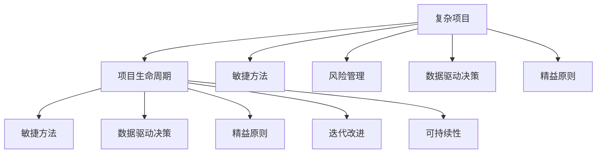
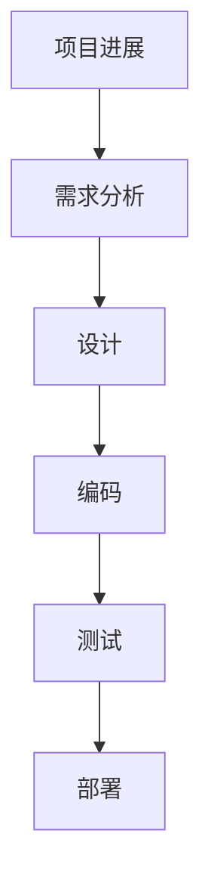

                 

# 系统思考对于管理复杂项目的重要性

> 关键词：系统思考,复杂项目,项目生命周期,风险管理,敏捷方法,数据驱动决策,精益原则,迭代改进,可持续性

## 1. 背景介绍

### 1.1 问题由来

在当今高度复杂和多变的环境中，越来越多的项目变得空前复杂。这些项目不仅涉及多种技术、组织和利益相关者，还面临着快速变化的市场需求、技术和政策法规的不断调整等不确定性因素。如何有效地管理和控制这些复杂项目，使其能够按时、按质、按预算完成，成为了项目经理和组织管理者们的一大挑战。

### 1.2 问题核心关键点

系统思考在系统动力学中是一种管理复杂系统和项目的方法论。它关注整体和系统内各部分的相互作用，而不是孤立地看问题。系统思考方法的核心在于理解系统中的各个组成部分如何相互影响，以及如何通过调整这些影响来改善整个系统的表现。

## 2. 核心概念与联系

### 2.1 核心概念概述

为更好地理解系统思考在管理复杂项目中的应用，本节将介绍几个密切相关的核心概念：

- **系统思考(System Thinking)**：一种管理复杂系统的方法，通过理解系统内各部分之间的相互作用，寻找系统行为背后的驱动因素，从而实现对系统的优化和控制。
- **复杂项目(Complex Project)**：涉及多个部门、技术、利益相关者，目标复杂、风险高、时间跨度长的大型工程项目。
- **项目生命周期(Project Lifecycle)**：项目从启动、规划、执行、监控和收尾的全过程，涵盖项目的不同阶段。
- **风险管理(Risk Management)**：识别、评估和控制项目中潜在的风险，减少项目失败的概率。
- **敏捷方法(Agile Methodology)**：一种基于快速迭代和灵活调整的项目管理方法，旨在提高项目响应市场的速度和灵活性。
- **数据驱动决策(Data-Driven Decision Making)**：基于数据分析和证据支持的决策方法，减少主观判断的误差。
- **精益原则(Lean Principles)**：倡导消除浪费、持续改进和快速交付的精益管理原则。
- **迭代改进(Iterative Improvement)**：通过不断的反馈和迭代，逐步完善项目计划和执行的过程。
- **可持续性(Sustainability)**：在项目执行中考虑长期影响，保护环境、社会和经济利益。

这些核心概念之间的逻辑关系可以通过以下Mermaid流程图来展示：



这个流程图展示了大项目在各个环节中应用系统思考的关键概念，以及这些概念如何相互作用，共同推动项目成功。

## 3. 核心算法原理 & 具体操作步骤

### 3.1 算法原理概述

系统思考在管理复杂项目中的应用，主要基于以下几个基本原理：

1. **整体性(Wholeness)**：系统思考强调系统作为一个整体来理解，而不是孤立地看各个部分。它认为系统的各个部分相互依赖，共同影响整体的行为。
2. **相互作用(Interactions)**：系统思考关注系统内部各个部分之间的相互作用，以及这些相互作用如何影响系统行为。
3. **延迟(Feedback Delay)**：系统中的变化往往不会立即显现，而是需要一定时间才能影响到整个系统。系统思考通过延迟来理解系统行为的动态特性。
4. **非线性(Nonlinearity)**：系统中的关系往往是非线性的，一个部分的微小变化可能会导致系统的显著变化。系统思考通过非线性来理解系统的复杂性和不确定性。
5. **目的性(Purpose)**：系统思考强调系统的目的和目标，以及如何通过调整系统内部的行为来达到这些目的。

这些原理构成了系统思考的核心，帮助项目管理者从整体和系统的角度来理解和管理项目，从而提高项目的成功率。

### 3.2 算法步骤详解

基于系统思考的复杂项目管理，一般包括以下几个关键步骤：

**Step 1: 项目分析和规划**

- 收集和分析项目的背景、目标、需求和约束条件。
- 建立项目的愿景和目标，确保所有利益相关者对这些目标有一致的理解。
- 识别项目的关键成功因素和潜在风险。
- 制定项目的整体规划，包括时间表、预算和资源分配。

**Step 2: 设计和管理项目生命周期**

- 将项目生命周期分为若干阶段，如启动、规划、执行、监控和收尾。
- 定义每个阶段的关键任务和活动。
- 确定阶段之间的依赖关系和转换条件。
- 设置阶段之间的里程碑和检查点，确保进度和质量。

**Step 3: 应用敏捷方法**

- 采用迭代和增量的方式，逐步交付和完善项目的各个部分。
- 建立跨职能的团队，提高沟通和协作效率。
- 使用敏捷工具和技术，如Scrum、Kanban等，进行项目跟踪和优化。
- 持续进行产品反馈和迭代，确保项目始终与市场和需求保持一致。

**Step 4: 实施数据驱动决策**

- 收集和分析项目相关的数据，如进度、成本、质量等。
- 使用数据分析工具和方法，识别项目的关键指标和趋势。
- 基于数据和证据做出决策，减少主观判断的误差。
- 实时监控项目进展，及时调整和优化项目计划。

**Step 5: 引入精益原则**

- 识别和消除项目中的浪费和低效环节。
- 持续改进项目的流程和活动，提高效率和效果。
- 建立快速交付和反馈机制，及时响应市场变化。
- 优化资源利用，提高项目的经济效益。

**Step 6: 实施迭代改进**

- 定期评估项目的进展和绩效，识别改进机会。
- 设计改进方案，并通过试点验证其有效性。
- 根据试点结果，进行大规模推广和实施。
- 建立持续改进的机制，不断优化项目管理和执行。

**Step 7: 确保可持续性**

- 考虑项目对环境、社会和经济的影响。
- 采用可持续的发展理念和技术，减少对环境的负面影响。
- 确保项目的长期利益和价值，为组织的可持续发展提供支持。

### 3.3 算法优缺点

系统思考在复杂项目管理中的应用，具有以下优点：

1. **全面性**：系统思考提供了整体视角，帮助项目管理者全面理解项目的内在联系和复杂性，避免单一视角导致的片面决策。
2. **动态性**：系统思考强调系统的动态特性，帮助项目管理者理解项目变化背后的驱动力，及时调整项目计划和策略。
3. **适应性**：系统思考的迭代改进方法，使得项目管理者能够灵活应对项目中的不确定性和变化，提高项目的适应能力。
4. **透明性**：系统思考的数据驱动决策方法，使得项目决策过程透明、可追溯，有助于增强利益相关者的信任和满意度。

同时，系统思考也有一些缺点：

1. **复杂性**：系统思考涉及多个层面和维度，需要项目管理者具备较高的系统和思维能力。
2. **依赖数据**：系统思考的实施依赖于高质量的数据，数据获取和分析的难度较大。
3. **实施成本**：系统思考的引入需要额外的时间和资源，可能增加项目的实施成本。

尽管存在这些局限性，但系统思考在复杂项目管理中的应用，仍然具有重要价值。通过系统思考的全面性和动态性，项目管理者能够更好地应对复杂项目的挑战，提升项目的成功率。

### 3.4 算法应用领域

系统思考在复杂项目管理中的应用，涵盖了各种不同的领域和项目类型，例如：

- **大型软件开发项目**：通过系统思考，帮助团队理解软件系统的整体架构和各模块之间的相互作用，确保项目的整体一致性和可维护性。
- **基础设施建设项目**：系统思考帮助项目管理者理解工程项目中各阶段之间的依赖关系，优化施工流程和资源分配，确保项目按时按质完成。
- **跨部门协作项目**：系统思考促进不同部门和利益相关者之间的沟通和协作，确保项目的整体目标和愿景一致。
- **产品研发项目**：系统思考帮助项目团队理解市场需求和客户反馈，快速迭代产品设计和功能，提升产品的市场竞争力。
- **环境保护项目**：系统思考考虑项目对环境的长期影响，确保项目的可持续性和环境友好性。

这些领域的应用，展示了系统思考在复杂项目管理中的广泛适用性和深远影响。

## 4. 数学模型和公式 & 详细讲解 & 举例说明

### 4.1 数学模型构建

系统思考的数学模型构建，通常基于系统动力学(System Dynamics)的方法，通过建立系统行为的动力学模型来分析系统的变化和优化。系统动力学模型一般包括系统变量、状态方程、输入和输出变量等组成部分。

设系统状态变量为 $x(t)$，状态方程为：

$$
\frac{dx}{dt} = f(x(t),u(t),p)
$$

其中 $f$ 为状态方程的函数，$u(t)$ 为输入变量，$p$ 为系统参数。系统的输入和输出变量 $u(t)$ 和 $y(t)$ 如下：

$$
u(t) = \begin{cases}
0, & \text{项目启动前} \\
1, & \text{项目启动后}
\end{cases}
$$

$$
y(t) = g(x(t),u(t),p)
$$

其中 $g$ 为输出方程的函数。

### 4.2 公式推导过程

以一个简单的软件开发项目为例，通过系统思考来构建数学模型。项目涉及需求分析、设计、编码、测试和部署等多个阶段，各阶段之间存在依赖关系和反馈机制。

设项目进展为 $x(t)$，各阶段的完成时间分别为 $t_1, t_2, t_3, t_4$，项目的总时间为 $T$，各阶段的输入和输出变量如下：

$$
u(t) = \begin{cases}
1, & \text{需求分析阶段} \\
0, & \text{其他阶段}
\end{cases}
$$

$$
y(t) = \begin{cases}
0, & \text{需求分析阶段} \\
1, & \text{其他阶段}
\end{cases}
$$

其中 $t_1$ 为需求分析阶段的开始时间，$t_2$ 为设计阶段的开始时间，$t_3$ 为编码阶段的开始时间，$t_4$ 为测试阶段的开始时间。项目进展 $x(t)$ 和各阶段的完成时间的关系如下：

$$
x(t) = \begin{cases}
0, & t \leq t_1 \\
\frac{t-t_1}{T}, & t_1 < t \leq t_2 \\
\frac{t-t_1}{T} + \frac{t_2-t_1}{T}, & t_2 < t \leq t_3 \\
\frac{t-t_1}{T} + \frac{t_2-t_1}{T} + \frac{t_3-t_2}{T}, & t_3 < t \leq t_4 \\
1, & t_4 < t \leq T
\end{cases}
$$

通过上述模型，可以分析项目的进展、各阶段的时间分配和资源利用情况，为项目管理者提供决策依据。

### 4.3 案例分析与讲解

假设有一个软件开发项目，涉及需求分析、设计、编码、测试和部署等多个阶段。项目时间跨度为6个月，各阶段的完成时间分别为：

- 需求分析：1个月
- 设计：2个月
- 编码：2个月
- 测试：1个月
- 部署：1个月

项目进展和各阶段的关系如下图所示：



使用上述系统动力学模型，可以计算出项目进展在不同时间点的值：

- 第1个月：$x(1) = \frac{1}{6}$
- 第3个月：$x(3) = \frac{2}{6} = \frac{1}{3}$
- 第5个月：$x(5) = \frac{3}{6} = \frac{1}{2}$
- 第6个月：$x(6) = 1$

根据这些数据，项目管理者可以实时监控项目进展，及时调整各阶段的时间和资源分配，确保项目按时按质完成。

## 5. 项目实践：代码实例和详细解释说明

### 5.1 开发环境搭建

在进行系统思考的复杂项目管理实践前，我们需要准备好开发环境。以下是使用Python进行系统动力学建模的环境配置流程：

1. 安装Anaconda：从官网下载并安装Anaconda，用于创建独立的Python环境。

2. 创建并激活虚拟环境：
```bash
conda create -n systhink-env python=3.8 
conda activate systhink-env
```

3. 安装Sympy和PySDA库：
```bash
pip install sympy pydsa
```

4. 安装SimPy库：
```bash
pip install simpy
```

5. 安装Jupyter Notebook：
```bash
pip install jupyter notebook
```

完成上述步骤后，即可在`systhink-env`环境中开始系统思考的复杂项目管理实践。

### 5.2 源代码详细实现

下面我们以一个简单的软件开发项目为例，给出使用Sympy和PySDA库进行系统思考的Python代码实现。

首先，定义系统状态变量和状态方程：

```python
from sympy import symbols, Eq, solve

# 定义符号变量
t = symbols('t')

# 定义状态变量
x = symbols('x')

# 定义状态方程
dx = symbols('dx')
eq = Eq(dx, (t-1)/(6))

# 求解状态方程
x_value = solve(eq, x)[0]
```

然后，计算不同时间点的系统进展：

```python
# 计算不同时间点的系统进展
t_values = [1, 3, 5, 6]
x_values = [x_value.subs(t, val) for val in t_values]

# 输出计算结果
for val, x_val in zip(t_values, x_values):
    print(f"t={val}, x={x_val}")
```

最后，使用PySDA库绘制系统进展的动态图：

```python
import pydsa

# 创建系统动力学模型
model = pydsa.DynamicsModel()

# 定义状态变量
model.create_variable(x, initial_value=x_value)

# 定义状态方程
model.create_equation(dx, eq)

# 绘制系统进展的动态图
model.plot(t, x)
```

以上代码实现了基于系统思考的软件开发项目进展的建模和可视化，展示了系统思考在复杂项目管理中的应用。

### 5.3 代码解读与分析

让我们再详细解读一下关键代码的实现细节：

**定义符号变量和状态方程**：
- 使用Sympy库定义时间变量 `t` 和状态变量 `x`。
- 定义状态方程 `dx = (t-1)/6`，表示项目进展随时间变化的速率。

**求解状态方程**：
- 使用Sympy库求解状态方程，得到项目进展随时间的变化关系。

**计算不同时间点的系统进展**：
- 定义不同的时间点 `t_values`。
- 计算对应时间点的系统进展 `x_values`。
- 输出计算结果，展示项目进展的变化趋势。

**使用PySDA库绘制动态图**：
- 使用PySDA库创建系统动力学模型。
- 定义状态变量和状态方程。
- 使用PySDA库的绘图功能，展示项目进展随时间的动态变化。

通过上述代码，我们可以看到系统思考的数学模型构建和动态图绘制的具体实现过程。这些工具和方法为项目管理者提供了强大的系统分析和可视化手段，帮助他们更好地理解和管理复杂项目。

## 6. 实际应用场景

### 6.1 智能制造系统

系统思考在智能制造系统的管理中，能够帮助管理者更好地理解系统中的各个组成部分和它们之间的相互作用，从而提高系统的效率和性能。

具体而言，智能制造系统包括生产设备、自动化生产线、物料管理、质量控制等多个子系统。系统思考可以帮助管理者识别这些子系统之间的依赖关系和反馈机制，优化生产流程和资源分配，减少生产中的浪费和瓶颈。

### 6.2 城市交通系统

系统思考在城市交通系统的管理中，可以帮助管理者理解交通流量的变化和影响因素，从而优化交通管理和规划。

例如，系统思考可以帮助管理者识别交通拥堵的原因，如车辆数量、道路条件、天气等因素，以及不同时间段和路线的交通流量变化。通过调整信号灯、优化路线、增加公共交通工具等方式，管理者可以有效缓解交通拥堵，提升交通系统的整体效率。

### 6.3 供应链管理系统

系统思考在供应链管理中，可以帮助管理者理解供应链中各个环节的相互作用和影响，优化供应链的运营效率和成本。

供应链管理涉及采购、生产、库存、物流等多个环节，系统思考可以帮助管理者识别供应链中的瓶颈和冗余环节，优化库存管理、降低运输成本、提高生产效率。通过持续改进和优化，供应链管理系统可以更加高效、灵活和稳定。

### 6.4 未来应用展望

随着系统思考方法论的不断发展和完善，其在复杂项目管理中的应用将越来越广泛和深入。未来，系统思考将广泛应用于各种领域的复杂项目中，例如：

- **智慧城市**：系统思考将帮助管理者理解和优化城市基础设施、能源、交通等子系统的相互作用，提升城市的智能化和可持续发展能力。
- **智能农业**：系统思考将帮助农业管理者理解和优化农业生产、资源利用、市场供应等环节，提升农业的智能化和效益。
- **环境保护**：系统思考将帮助环保管理者理解和优化环境监测、污染控制、资源利用等环节，提升环境保护的效率和效果。

总之，系统思考在复杂项目管理中的应用前景广阔，将为各个领域的项目管理提供强大的系统思维和方法支持。

## 7. 工具和资源推荐

### 7.1 学习资源推荐

为了帮助项目管理者系统掌握系统思考的方法和应用，这里推荐一些优质的学习资源：

1. **系统动力学入门**：Daniel H.kimbook的《系统动力学导论》，深入浅出地介绍了系统动力学的方法和应用。

2. **项目管理方法论**：PMI（项目管理协会）提供的PMP（Project Management Professional）认证课程，涵盖了项目管理的各个方面，包括系统思考的应用。

3. **敏捷方法论**：Scrum Alliance提供的Scrum Master认证课程，介绍了敏捷项目管理的具体方法和工具。

4. **精益管理**：Shing-jiu Lo的《精益思想》，介绍了精益管理的原则和实践。

5. **数据驱动决策**：Tomas A. Petri克的《数据驱动的管理》，介绍了数据驱动决策的方法和工具。

通过这些资源的学习实践，相信你一定能够系统掌握系统思考的方法和应用，提升项目管理的能力。

### 7.2 开发工具推荐

系统思考的复杂项目管理实践，离不开高效的开发工具支持。以下是几款用于系统思考的常用工具：

1. **Sympy**：Python的符号计算库，用于定义和求解系统动力学方程。

2. **PySDA**：Python的系统动力学分析库，用于可视化和管理系统动态过程。

3. **SimPy**：Python的模拟库，用于建模和仿真系统动力学模型。

4. **Jupyter Notebook**：Python的交互式编程环境，方便进行系统动力学建模和分析。

5. **Simulink**：MATLAB的仿真工具，用于建模和仿真复杂系统。

这些工具和方法为项目管理者提供了强大的系统分析和可视化手段，帮助他们更好地理解和管理复杂项目。

### 7.3 相关论文推荐

系统思考在复杂项目管理中的应用，源于学界的持续研究。以下是几篇奠基性的相关论文，推荐阅读：

1. **系统动力学基本原理**：Jay W. Forrester的《系统动力学》，奠定了系统动力学理论的基础。

2. **复杂系统建模与分析**：Ludwig von Bertalanffy的《一般系统论》，介绍了复杂系统的概念和方法。

3. **系统思考在项目管理中的应用**：Joan Magarry、Alan Baird的《System Thinking for Project Management》，介绍了系统思考在项目管理中的应用案例。

4. **敏捷项目管理方法**：Kent Beck的《敏捷软件开发：原则、模式与实践》，介绍了敏捷项目管理的具体方法和工具。

这些论文代表了大系统思考的发展脉络，通过学习这些前沿成果，可以帮助研究者把握学科前进方向，激发更多的创新灵感。

## 8. 总结：未来发展趋势与挑战

### 8.1 总结

本文对系统思考在管理复杂项目中的应用进行了全面系统的介绍。首先阐述了系统思考的背景和重要性，明确了系统思考在复杂项目管理中的独特价值。其次，从原理到实践，详细讲解了系统思考的数学模型和应用步骤，给出了系统思考项目管理的完整代码实例。同时，本文还广泛探讨了系统思考方法在多个行业领域的应用前景，展示了系统思考的广泛适用性和深远影响。此外，本文精选了系统思考技术的各类学习资源，力求为读者提供全方位的技术指引。

通过本文的系统梳理，可以看到，系统思考在复杂项目管理中的应用已经成为不可或缺的方法论。系统思考的全面性和动态性，使得项目管理者能够更好地应对复杂项目的挑战，提升项目的成功率。未来，随着系统思考方法论的不断发展和完善，其在复杂项目管理中的应用将更加深入和广泛，为项目管理带来新的突破。

### 8.2 未来发展趋势

展望未来，系统思考在复杂项目管理中的应用将呈现以下几个发展趋势：

1. **融合数据科学**：系统思考将与数据科学、人工智能等新兴技术进一步融合，提高项目管理的智能化和自动化水平。
2. **引入机器学习**：系统思考将结合机器学习算法，进行复杂系统的预测和优化，提升项目的响应速度和灵活性。
3. **跨领域应用**：系统思考将应用于更多领域，如智能交通、智慧城市、环境保护等，推动各行业的智能化转型。
4. **强调可持续发展**：系统思考将更加重视可持续发展，考虑项目的长期影响，促进绿色环保和社会效益。
5. **提升透明度**：系统思考将通过可视化工具和数据共享，提高项目管理的透明度和可追溯性。

以上趋势凸显了系统思考在复杂项目管理中的广阔前景。这些方向的探索发展，将进一步提升项目管理的效率和效果，为组织带来更大的竞争优势。

### 8.3 面临的挑战

尽管系统思考在复杂项目管理中的应用已经取得了显著成效，但在迈向更加智能化、普适化应用的过程中，仍然面临诸多挑战：

1. **数据获取难度大**：系统思考的实施依赖于高质量的数据，数据获取和分析的难度较大，尤其是在资源有限的条件下。
2. **模型复杂性高**：系统动力学模型的构建和分析较为复杂，需要较高的数学和系统建模能力。
3. **实施成本高**：系统思考的引入需要额外的时间和资源，可能增加项目的实施成本。
4. **跨部门协作困难**：系统思考需要跨部门的协作和沟通，不同部门之间的协调和整合难度较大。

尽管存在这些局限性，但系统思考在复杂项目管理中的应用前景广阔，将为各个领域的项目管理提供强大的系统思维和方法支持。

### 8.4 研究展望

面对系统思考面临的这些挑战，未来的研究需要在以下几个方面寻求新的突破：

1. **简化系统模型**：开发更加简洁、易用的系统动力学模型，降低建模难度和成本。
2. **增强自动化**：结合数据科学和人工智能技术，自动化地进行系统建模和分析，提升效率和准确性。
3. **引入模型解释**：开发系统动力学模型的解释工具和方法，提高模型的可解释性和透明度。
4. **优化跨部门协作**：建立跨部门协作机制，促进不同部门之间的沟通和整合，提高项目管理的效果。

这些研究方向将进一步推动系统思考方法论的发展和应用，为复杂项目管理提供更加全面和高效的支持。

## 9. 附录：常见问题与解答

**Q1：什么是系统思考？**

A: 系统思考是一种管理复杂系统和项目的方法，通过理解系统内各部分之间的相互作用，寻找系统行为背后的驱动力，从而实现对系统的优化和控制。

**Q2：系统思考在项目管理中的应用主要有哪些？**

A: 系统思考在项目管理中的应用主要包括以下几个方面：
1. 项目分析和规划。
2. 设计和管理项目生命周期。
3. 应用敏捷方法。
4. 实施数据驱动决策。
5. 引入精益原则。
6. 实施迭代改进。
7. 确保可持续性。

**Q3：如何有效实施系统思考？**

A: 有效实施系统思考需要以下几个步骤：
1. 收集和分析项目的背景、目标、需求和约束条件。
2. 建立项目的愿景和目标，确保所有利益相关者对这些目标有一致的理解。
3. 识别项目的关键成功因素和潜在风险。
4. 制定项目的整体规划，包括时间表、预算和资源分配。
5. 采用迭代和增量的方式，逐步交付和完善项目的各个部分。
6. 建立跨职能的团队，提高沟通和协作效率。
7. 使用敏捷工具和技术，如Scrum、Kanban等，进行项目跟踪和优化。
8. 持续进行产品反馈和迭代，确保项目始终与市场和需求保持一致。
9. 识别和消除项目中的浪费和低效环节。
10. 持续改进项目的流程和活动，提高效率和效果。
11. 建立快速交付和反馈机制，及时响应市场变化。
12. 优化资源利用，提高项目的经济效益。
13. 定期评估项目的进展和绩效，识别改进机会。
14. 设计改进方案，并通过试点验证其有效性。
15. 根据试点结果，进行大规模推广和实施。
16. 建立持续改进的机制，不断优化项目管理和执行。
17. 考虑项目对环境、社会和经济的影响。
18. 采用可持续的发展理念和技术，减少对环境的负面影响。
19. 确保项目的长期利益和价值，为组织的可持续发展提供支持。

**Q4：系统思考在复杂项目管理中面临哪些挑战？**

A: 系统思考在复杂项目管理中面临以下挑战：
1. 数据获取难度大。
2. 模型复杂性高。
3. 实施成本高。
4. 跨部门协作困难。

**Q5：未来系统思考在项目管理中的应用趋势是什么？**

A: 未来系统思考在项目管理中的应用趋势包括：
1. 融合数据科学和人工智能。
2. 引入机器学习算法。
3. 跨领域应用。
4. 强调可持续发展。
5. 提升透明度。

这些趋势将进一步推动系统思考方法论的发展和应用，为项目管理带来新的突破。

---

作者：禅与计算机程序设计艺术 / Zen and the Art of Computer Programming

