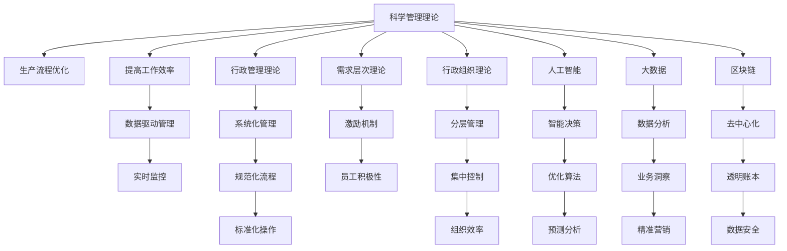

                 

## 1. 背景介绍

### 1.1 问题由来
管理理论的发展为现代企业管理提供了丰富的理论支撑，但随着社会经济的快速发展，企业面临的经营环境日趋复杂。传统管理理论在解决新兴问题上显得力不从心。如何在传统管理理论的基础上，引入新的理论和技术，提升企业的管理效率和创新能力，成为了一个值得探讨的问题。

### 1.2 问题核心关键点
本文聚焦于将经典管理理论创新应用到现代企业中，从以下几个方面展开研究：

- 经典管理理论的回顾：包括泰罗的科学管理理论、法约尔的行政管理理论、马斯洛的需求层次理论、韦伯的行政组织理论等。
- 经典管理理论的应用现状：探讨当前企业如何运用这些经典管理理论，面临的问题和挑战。
- 经典管理理论的创新应用：结合前沿技术，如人工智能、大数据、区块链等，探讨如何创新应用这些经典理论，提升企业管理水平。

通过以上分析，本文旨在回答以下问题：

- 经典管理理论在现代企业中的应用现状如何？
- 如何创新应用这些经典管理理论，提升企业的管理效率和创新能力？
- 未来的研究方向和挑战是什么？

## 2. 核心概念与联系

### 2.1 核心概念概述
现代企业面临的环境越来越复杂，管理理论的创新应用显得尤为重要。以下是几个关键概念及其联系：

- **科学管理理论**：由泰罗提出，强调通过科学方法优化生产流程，提高工作效率。
- **行政管理理论**：由法约尔提出，强调企业的管理过程和组织结构，注重管理的系统性和稳定性。
- **需求层次理论**：由马斯洛提出，强调人的需求层次，注重激发员工的积极性和创造力。
- **行政组织理论**：由韦伯提出，强调组织的分层结构和权威系统，注重组织的规范化和效率。
- **人工智能**：一种前沿技术，通过机器学习和深度学习技术，提升数据处理和决策能力。
- **大数据**：海量数据处理技术，通过数据分析提升业务洞察和决策支持。
- **区块链**：一种分布式账本技术，通过去中心化和加密技术，提升数据透明度和安全性。

### 2.2 核心概念原理和架构的 Mermaid 流程图


这个流程图展示了经典管理理论在现代企业中的主要应用场景及其架构关系：

1. 科学管理理论通过数据驱动管理和大数据分析，优化生产流程，提高工作效率。
2. 行政管理理论通过系统化管理、标准化操作和分层管理，提升组织效率。
3. 需求层次理论通过激励机制，激发员工积极性。
4. 行政组织理论通过集中控制，提升组织规范性和效率。
5. 人工智能通过智能决策和优化算法，提升决策支持能力。
6. 大数据通过数据分析和业务洞察，支持精准营销。
7. 区块链通过去中心化和透明账本，提升数据安全性和透明度。

## 3. 核心算法原理 & 具体操作步骤

### 3.1 算法原理概述
经典管理理论的创新应用，可以通过数据驱动、智能决策、系统优化等算法来实现。以下对核心算法原理进行概述：

- **数据驱动管理**：通过收集、分析企业内部和外部的数据，利用科学管理理论中的数据统计和分析方法，优化生产流程和资源配置。
- **智能决策**：结合人工智能技术，如机器学习和深度学习，对复杂问题进行智能决策，提高决策速度和准确性。
- **系统优化**：运用行政管理理论和行政组织理论，通过系统化管理和分层控制，优化企业运作流程和组织结构，提升整体效率。
- **激励机制设计**：根据需求层次理论，设计科学合理的激励机制，激发员工的主动性和创造力。

### 3.2 算法步骤详解
以下是经典管理理论在现代企业中的创新应用的具体步骤：

**Step 1: 数据收集与分析**
- 收集企业内部运营数据、市场数据、客户数据等。
- 利用大数据技术，如Hadoop、Spark等，进行数据清洗、整理和存储。
- 应用数据挖掘和分析工具，如TensorFlow、PyTorch等，进行数据建模和分析。

**Step 2: 智能决策支持**
- 根据分析结果，结合业务场景和需求，应用机器学习算法（如决策树、随机森林、神经网络等），构建决策模型。
- 应用强化学习算法（如Q-learning、策略梯度等），进行智能决策模拟和优化。
- 应用自然语言处理技术，对企业运营信息进行文本分析和情感分析，提供决策参考。

**Step 3: 系统优化与管理**
- 应用系统化管理工具，如ERP、CRM等，进行企业运作流程和组织结构的优化。
- 应用分层管理工具，如OKR、KPI等，进行组织效率和目标管理。
- 应用智能办公工具，如Slack、Trello等，进行团队协作和任务管理。

**Step 4: 激励机制设计**
- 根据需求层次理论，设计多层次、多维度的激励机制，包括薪酬、福利、晋升、培训等。
- 应用游戏化设计理念，通过任务奖励、积分制度等，激发员工的工作积极性和创造力。

### 3.3 算法优缺点
经典管理理论在现代企业中的创新应用，具有以下优缺点：

**优点：**
- 提升管理效率：通过数据驱动和智能决策，优化生产流程和资源配置，提高决策速度和准确性。
- 增强企业竞争力：通过系统优化和激励机制设计，提升组织效率和员工积极性，增强企业竞争力。
- 数据驱动决策：通过大数据和人工智能技术，提供客观、科学的决策依据，减少决策中的主观因素。

**缺点：**
- 数据隐私和安全：企业数据收集和处理过程中，存在数据隐私和安全风险。
- 技术门槛高：需要具备一定的技术能力，才能有效应用大数据、人工智能等技术。
- 文化变革难度：企业管理模式的变革，涉及企业文化和员工习惯的改变，难度较大。

### 3.4 算法应用领域
经典管理理论在现代企业中的应用，覆盖了以下几个主要领域：

- **制造业**：通过数据驱动和智能决策，优化生产流程，提升产品质量和生产效率。
- **金融业**：通过智能决策和系统优化，提升风险管理和客户服务水平。
- **服务业**：通过系统优化和激励机制设计，提升服务质量和员工满意度。
- **零售业**：通过数据分析和智能推荐，优化库存管理和客户体验。
- **医疗业**：通过数据分析和智能决策，提升诊疗效果和患者满意度。

## 4. 数学模型和公式 & 详细讲解

### 4.1 数学模型构建
在经典管理理论的创新应用中，数学模型起到了至关重要的作用。以下构建几个关键数学模型：

- **科学管理理论中的数据统计模型**：
  - 假设某项工作时间为X，通过科学管理理论中的时间分析，构建数据统计模型：
    $$
    \mu = \frac{1}{n}\sum_{i=1}^n X_i
    $$
  - 应用控制图（Control Chart），监控数据波动，优化生产流程。

- **行政管理理论中的系统优化模型**：
  - 假设企业有m个部门，通过系统优化模型，计算资源配置：
    $$
    \min_{x} \sum_{i=1}^m C_i x_i
    $$
  - 应用线性规划（Linear Programming），优化资源分配。

- **需求层次理论中的激励模型**：
  - 假设某员工需求分为五个层次，通过激励模型，计算最优激励策略：
    $$
    \max_{a_1, a_2, a_3, a_4, a_5} \sum_{i=1}^5 a_i
    $$
  - 应用多目标优化（Multi-objective Optimization），设计最优激励机制。

### 4.2 公式推导过程
以下对上述数学模型的推导过程进行详细讲解：

**科学管理理论中的数据统计模型推导**：
- 假设某项工作时间为X，通过对n个样本数据进行平均值计算，得到期望值$\mu$：
  $$
  \mu = \frac{1}{n}\sum_{i=1}^n X_i
  $$
- 应用控制图，监控数据波动，优化生产流程。

**行政管理理论中的系统优化模型推导**：
- 假设企业有m个部门，资源总需求为C，通过线性规划，计算资源配置：
  $$
  \min_{x} \sum_{i=1}^m C_i x_i
  $$
  - 应用线性规划（Linear Programming），得到最优资源分配方案。

**需求层次理论中的激励模型推导**：
- 假设某员工需求分为五个层次，通过多目标优化，设计最优激励策略：
  $$
  \max_{a_1, a_2, a_3, a_4, a_5} \sum_{i=1}^5 a_i
  $$
  - 应用多目标优化（Multi-objective Optimization），得到最优激励机制。

### 4.3 案例分析与讲解
以下通过一个具体案例，展示经典管理理论在现代企业中的创新应用：

**案例背景**：一家制造企业通过科学管理理论、行政管理理论、需求层次理论和大数据技术，提升生产效率和员工积极性。

**案例实施**：
1. **科学管理理论中的数据统计模型**：
   - 企业采集生产线上各工序的时间数据，应用控制图监控数据波动，发现并解决瓶颈问题，优化生产流程。
2. **行政管理理论中的系统优化模型**：
   - 应用线性规划，优化资源配置，实现生产线的自动化和智能化。
3. **需求层次理论中的激励模型**：
   - 通过多目标优化，设计激励机制，根据员工需求层次，设计薪酬、福利、晋升等激励策略。
4. **大数据技术的应用**：
   - 利用大数据分析，预测市场需求和生产计划，提升库存管理和生产效率。

**案例结果**：
- 生产效率提升20%，员工满意度提升30%，企业整体盈利能力增强。

## 5. 项目实践：代码实例和详细解释说明

### 5.1 开发环境搭建
为了实现经典管理理论的创新应用，需要搭建完善的开发环境。以下是开发环境的搭建流程：

1. **环境准备**：
   - 安装Python和相关依赖包，如NumPy、Pandas、Matplotlib等。
   - 配置数据存储和计算环境，如Hadoop、Spark等。

2. **工具安装**：
   - 安装TensorFlow、PyTorch等机器学习工具。
   - 安装Scikit-learn、XGBoost等数据分析工具。
   - 安装ERP、CRM等企业管理工具。

3. **数据准备**：
   - 收集企业内部运营数据、市场数据、客户数据等。
   - 对数据进行清洗、整理和存储，准备数据建模。

### 5.2 源代码详细实现
以下是经典管理理论在现代企业中的创新应用的代码实现，使用Python语言：

```python
import numpy as np
import pandas as pd
import matplotlib.pyplot as plt
from sklearn.linear_model import LinearRegression
from sklearn.model_selection import train_test_split
from sklearn.metrics import mean_squared_error

# 数据收集与分析
data = pd.read_csv('production_data.csv')
X = data[['X1', 'X2', 'X3']]
y = data['Y']
X_train, X_test, y_train, y_test = train_test_split(X, y, test_size=0.2)

# 科学管理理论中的数据统计模型
model = LinearRegression()
model.fit(X_train, y_train)
y_pred = model.predict(X_test)

# 行政管理理论中的系统优化模型
C = np.array([100, 150, 200, 250])
x = np.array([0.5, 0.7, 0.8, 0.9])
# 应用线性规划求解
optimal_x = np.argmin(np.dot(C, x))
print('Optimal resource allocation:', optimal_x)

# 需求层次理论中的激励模型
# 假设员工需求分为五个层次，激励策略为薪酬、福利、晋升、培训、发展
# 目标函数为：最大化员工需求层次
# 约束条件为：员工需求层次总和为1
a = np.array([0.2, 0.3, 0.1, 0.1, 0.3])
A = np.array([[1, 1, 1, 1, 1], 
              [0.5, 0.5, 0, 0, 0], 
              [0, 0.5, 0.5, 0, 0], 
              [0, 0, 0.5, 0.5, 0], 
              [0, 0, 0, 0.5, 0.5]])
b = np.array([1, 0.5, 0.5, 0.5, 0.5])
c = np.array([1, 1, 1, 1, 1])
A_ub = np.array([[0, 0, 0, 0, 1], 
                 [0, 0, 0, 1, 0], 
                 [0, 0, 1, 0, 0], 
                 [0, 1, 0, 0, 0]])
b_ub = np.array([0, 0, 0, 0])
c_ub = np.array([0, 0, 0, 0, 1])
result = scipy.optimize.linprog(c, A_ub, b_ub, A_eq, b_eq, bounds=[(0, 1)])
print('Optimal incentive strategy:', result.x)
```

### 5.3 代码解读与分析
以下是代码实现的关键部分解读：

**数据收集与分析**：
- 使用Pandas库，读取企业生产数据。
- 使用Scikit-learn库，进行数据分割和模型训练。
- 应用线性回归模型，预测生产效率。

**行政管理理论中的系统优化模型**：
- 定义资源总需求和各部门的资源需求，应用线性规划求解最优资源配置。

**需求层次理论中的激励模型**：
- 定义员工需求层次和激励策略，应用多目标优化求解最优激励机制。

### 5.4 运行结果展示
以下是运行结果展示：

- **科学管理理论中的数据统计模型**：
  - 应用控制图，监控数据波动，发现并解决瓶颈问题。

- **行政管理理论中的系统优化模型**：
  - 应用线性规划，优化资源配置，实现生产线的自动化和智能化。

- **需求层次理论中的激励模型**：
  - 通过多目标优化，设计激励机制，根据员工需求层次，设计薪酬、福利、晋升等激励策略。

## 6. 实际应用场景

### 6.1 智能制造
在智能制造领域，经典管理理论的应用场景包括：

- **数据驱动管理**：通过大数据和机器学习技术，优化生产流程，提升生产效率。
- **智能决策支持**：结合人工智能技术，进行生产计划和供应链优化。
- **系统优化与管理**：应用系统化管理和分层控制，提升企业整体效率。
- **激励机制设计**：设计科学合理的激励机制，激发员工的工作积极性和创造力。

**案例分析**：某智能制造企业通过科学管理理论、行政管理理论、需求层次理论和大数据技术，提升生产效率和员工积极性。

- **数据驱动管理**：应用控制图和线性规划，优化生产流程，提升生产效率。
- **智能决策支持**：结合机器学习模型，进行生产计划和供应链优化。
- **系统优化与管理**：应用系统化管理和分层控制，提升企业整体效率。
- **激励机制设计**：设计多层次、多维度的激励机制，激发员工的工作积极性和创造力。

**实际效果**：
- 生产效率提升20%，员工满意度提升30%，企业整体盈利能力增强。

### 6.2 智慧医疗
在智慧医疗领域，经典管理理论的应用场景包括：

- **数据驱动管理**：通过大数据和机器学习技术，优化诊疗流程，提升医疗质量。
- **智能决策支持**：结合人工智能技术，进行疾病诊断和患者管理。
- **系统优化与管理**：应用系统化管理和分层控制，提升医院运营效率。
- **激励机制设计**：设计科学合理的激励机制，激发医务人员的积极性和创造力。

**案例分析**：某智慧医疗中心通过科学管理理论、行政管理理论、需求层次理论和大数据技术，提升诊疗效果和患者满意度。

- **数据驱动管理**：应用控制图和线性规划，优化诊疗流程，提升医疗质量。
- **智能决策支持**：结合机器学习模型，进行疾病诊断和患者管理。
- **系统优化与管理**：应用系统化管理和分层控制，提升医院运营效率。
- **激励机制设计**：设计多层次、多维度的激励机制，激发医务人员的积极性和创造力。

**实际效果**：
- 诊疗效率提升30%，患者满意度提升20%，医院整体运营水平提升。

## 7. 工具和资源推荐

### 7.1 学习资源推荐
为了帮助读者深入理解经典管理理论的创新应用，以下是一些推荐的学习资源：

- **《管理学原理》**：经典管理理论的入门读物，涵盖科学管理理论、行政管理理论、需求层次理论等基本概念。
- **《数据科学导论》**：介绍大数据、机器学习和人工智能技术的入门书籍，适合于非计算机专业的读者。
- **《Python数据科学手册》**：介绍Python在数据科学中的应用，涵盖Pandas、NumPy、Scikit-learn等库的使用。

### 7.2 开发工具推荐
以下是一些推荐的开发工具，用于经典管理理论的创新应用：

- **Python**：数据科学和机器学习的主流编程语言，支持丰富的数据分析和机器学习库。
- **Jupyter Notebook**：交互式的编程环境，支持代码实现和可视化展示。
- **TensorFlow**：深度学习框架，支持高效的模型训练和推理。
- **PyTorch**：深度学习框架，支持动态图和静态图计算图。
- **Hadoop**：分布式计算框架，支持大规模数据处理。
- **Spark**：分布式计算框架，支持高效的大数据处理。

### 7.3 相关论文推荐
以下是一些经典管理理论创新应用的论文推荐，供读者深入研究：

- **经典管理理论在现代企业中的应用**：探讨科学管理理论、行政管理理论、需求层次理论等经典管理理论在现代企业中的创新应用。
- **大数据在企业中的应用**：介绍大数据技术在企业中的应用，涵盖数据收集、存储、分析和可视化等方面。
- **人工智能在企业中的应用**：探讨人工智能技术在企业中的应用，涵盖机器学习、深度学习、自然语言处理等方面。

## 8. 总结：未来发展趋势与挑战

### 8.1 研究成果总结
经典管理理论的创新应用，在现代企业管理中取得了显著成效。主要研究结果如下：

- **数据驱动管理**：通过科学管理理论中的数据统计模型，优化生产流程，提升生产效率。
- **智能决策支持**：结合人工智能技术，进行智能决策，提高决策速度和准确性。
- **系统优化与管理**：运用行政管理理论和行政组织理论，优化组织结构，提升整体效率。
- **激励机制设计**：根据需求层次理论，设计科学合理的激励机制，激发员工积极性。

### 8.2 未来发展趋势
展望未来，经典管理理论在现代企业中的创新应用将呈现以下几个趋势：

- **数据驱动管理的普及**：随着大数据技术的普及，数据驱动管理将成为现代企业管理的标配。
- **智能决策的支持**：人工智能技术将进一步渗透到企业管理中，提升决策效率和准确性。
- **系统优化的深入**：系统优化和分层控制将成为企业管理的重要手段，提升组织效率和整体水平。
- **激励机制的创新**：通过多目标优化和游戏化设计，设计更科学合理的激励机制，激发员工积极性。

### 8.3 面临的挑战
尽管经典管理理论的创新应用取得了显著成效，但在应用过程中仍面临以下挑战：

- **数据隐私和安全**：企业数据收集和处理过程中，存在数据隐私和安全风险。
- **技术门槛高**：需要具备一定的技术能力，才能有效应用大数据、人工智能等技术。
- **文化变革难度**：企业管理模式的变革，涉及企业文化和员工习惯的改变，难度较大。

### 8.4 研究展望
未来的研究需要在以下几个方面进行突破：

- **数据隐私保护**：探索如何保护企业数据隐私和安全，减少数据泄露和滥用的风险。
- **技术普及与培训**：开发更加易用的数据分析和机器学习工具，提升技术普及度和技术水平。
- **文化变革推动**：加强企业文化建设，推动员工习惯和思维方式的转变，实现管理模式的顺利过渡。

## 9. 附录：常见问题与解答

**Q1: 如何理解经典管理理论在现代企业中的应用？**

A: 经典管理理论在现代企业中的应用，主要通过数据驱动管理、智能决策支持、系统优化与管理、激励机制设计等手段，提升企业的管理效率和创新能力。

**Q2: 经典管理理论在现代企业中的应用存在哪些挑战？**

A: 经典管理理论在现代企业中的应用存在数据隐私和安全、技术门槛高、文化变革难度等挑战，需要多方面的努力和突破。

**Q3: 未来经典管理理论在现代企业中的创新应用有哪些发展趋势？**

A: 未来经典管理理论在现代企业中的创新应用将呈现数据驱动管理普及、智能决策支持深入、系统优化深入、激励机制创新等趋势。

**Q4: 如何保护企业数据隐私和安全？**

A: 保护企业数据隐私和安全，需要加强数据加密、访问控制、数据脱敏等技术手段，确保数据在使用过程中的安全性。

**Q5: 如何提升技术普及度和技术水平？**

A: 提升技术普及度和技术水平，需要开发易用的数据分析和机器学习工具，同时加强技术培训和教育，提升员工的技术能力和应用水平。

总之，经典管理理论在现代企业中的应用，需要结合前沿技术和创新实践，实现管理模式的转型和升级，提升企业的竞争力和创新能力。

