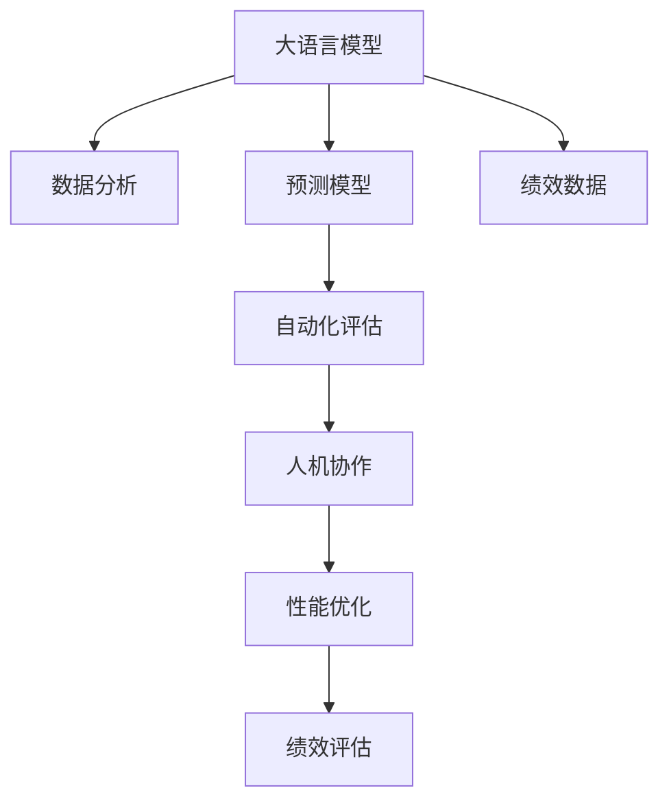

                 

# 绩效管理：LLM 分析驱动

> 关键词：绩效管理, 大语言模型(LLM), 数据分析, 预测模型, 自动化评估, 人机协作, 性能优化, 人才管理

## 1. 背景介绍

### 1.1 问题由来
随着企业规模的不断扩大和业务复杂度的日益提高，传统的绩效管理方法已难以满足现代企业的管理需求。传统的绩效管理方式依赖于人工考核，耗时长、成本高、主观性强，难以全面、客观地反映员工的实际工作表现。大语言模型（Large Language Model, LLM）的出现，为绩效管理提供了一种全新的思路。通过大语言模型对员工绩效数据的分析和理解，可以实现更高效、更公正的绩效管理。

### 1.2 问题核心关键点
大语言模型在绩效管理中的应用，主要依赖于以下几个关键点：
- 数据收集与预处理：通过自动化工具收集员工绩效数据，并进行清洗和预处理，为大语言模型提供高质量的数据输入。
- 数据建模与训练：利用大语言模型，构建预测模型，分析员工绩效的驱动因素。
- 性能评估与优化：基于预测模型的输出结果，自动评估员工绩效，并提出优化建议，提升员工工作表现。
- 人机协作：结合人工审核和调整，确保绩效评估的合理性和公平性，促进绩效管理的智能化和人性化。

### 1.3 问题研究意义
利用大语言模型进行绩效管理，能够帮助企业实现以下几个方面的提升：
- 提升管理效率：自动化数据分析和评估，减少人工工作量，提高管理效率。
- 增强公平性：减少主观偏见，提高绩效评估的客观性，促进人才发展的公平性。
- 优化绩效：基于数据驱动的分析，提出有针对性的改进建议，提升员工绩效。
- 促进人机协作：结合人工经验，提升绩效管理的人性化和合理性。

## 2. 核心概念与联系

### 2.1 核心概念概述

为更好地理解基于大语言模型的绩效管理方法，本节将介绍几个密切相关的核心概念：

- 大语言模型(Large Language Model, LLM)：以自回归(如GPT)或自编码(如BERT)模型为代表的大规模预训练语言模型。通过在大规模无标签文本语料上进行预训练，学习通用的语言表示，具备强大的语言理解和生成能力。

- 性能管理(Performance Management)：通过自动化工具收集和分析员工绩效数据，实现对员工工作表现的全面评估和提升的管理过程。

- 数据分析(Analytical Data)：利用数据科学和机器学习技术，对员工绩效数据进行分析和建模，挖掘其中的规律和驱动因素。

- 预测模型(Predictive Model)：基于员工历史绩效数据和行为特征，构建的预测员工未来绩效的机器学习模型。

- 自动化评估(Automatic Assessment)：利用算法自动对员工绩效进行评估，减少人工评估的误差和主观性。

- 人机协作(Human-AI Collaboration)：结合人工经验和大语言模型的分析结果，提升绩效管理的合理性和公正性。

这些核心概念之间的逻辑关系可以通过以下Mermaid流程图来展示：



这个流程图展示了大语言模型在绩效管理中的应用流程：

1. 大语言模型通过分析绩效数据，构建预测模型。
2. 预测模型对员工未来绩效进行预测。
3. 自动化评估系统根据预测结果，自动评估员工绩效。
4. 人机协作系统结合人工审核和调整，确保绩效评估的合理性。
5. 绩效优化系统根据评估结果，提出有针对性的改进建议。
6. 最终生成全面的绩效评估报告。

## 3. 核心算法原理 & 具体操作步骤
### 3.1 算法原理概述

基于大语言模型的绩效管理，本质上是一种利用机器学习和大数据技术进行数据分析和决策的过程。其核心思想是：利用大语言模型对员工绩效数据进行分析和理解，构建预测模型，自动化评估员工绩效，并提出优化建议。

形式化地，假设员工绩效数据为 $D=\{(x_i,y_i)\}_{i=1}^N, x_i \in \mathbb{R}^n, y_i \in \mathbb{R}$，其中 $x_i$ 为员工 $i$ 的特征向量，$y_i$ 为对应的绩效值。利用大语言模型 $M_{\theta}$ 进行数据分析和建模，得到预测模型 $M_{\theta}'$，其目标是找到一个最优参数 $\theta'$，使得预测值 $\hat{y}_i = M_{\theta}'(x_i)$ 与真实绩效值 $y_i$ 的差异最小化。

优化目标为：

$$
\theta' = \mathop{\arg\min}_{\theta'} \sum_{i=1}^N (y_i - \hat{y}_i)^2
$$

通过梯度下降等优化算法，微调预测模型的参数 $\theta'$，最小化预测误差。最终得到适应员工绩效预测的预测模型。

### 3.2 算法步骤详解

基于大语言模型的绩效管理一般包括以下几个关键步骤：

**Step 1: 数据收集与预处理**
- 利用自动化工具收集员工绩效数据，包括工作量、完成度、客户满意度等关键指标。
- 对数据进行清洗和预处理，去除异常值和噪声，确保数据质量。

**Step 2: 特征工程与选择**
- 根据预测任务，选择相关的特征变量，如工作量、完成时间、团队合作度等。
- 对特征进行归一化和标准化，提升数据的一致性和可解释性。

**Step 3: 模型训练与评估**
- 选择合适的模型结构和参数，如线性回归、随机森林、神经网络等。
- 在训练集上训练模型，调整模型参数以最小化预测误差。
- 在验证集上评估模型性能，选择最优模型。

**Step 4: 预测与评估**
- 利用训练好的预测模型对员工未来绩效进行预测。
- 根据预测结果，自动评估员工绩效，生成绩效报告。
- 结合人工审核和调整，确保绩效评估的合理性和公正性。

**Step 5: 反馈与优化**
- 根据绩效报告，提出有针对性的改进建议，优化员工工作表现。
- 定期收集反馈信息，不断调整和改进预测模型。

### 3.3 算法优缺点

基于大语言模型的绩效管理方法具有以下优点：
1. 自动化数据分析：利用大语言模型自动处理员工绩效数据，减少人工工作量，提高分析效率。
2. 客观性提升：基于数据驱动的预测模型，减少主观偏见，提高绩效评估的客观性。
3. 实时优化：实时分析员工绩效，及时提出改进建议，提升员工工作表现。
4. 人机协作：结合人工经验和系统分析结果，提升绩效管理的合理性和公正性。

同时，该方法也存在一定的局限性：
1. 数据依赖性：绩效管理的效果依赖于数据的准确性和全面性，如果数据缺失或不完整，模型的预测效果将大打折扣。
2. 模型复杂性：构建高质量的预测模型需要较长的训练时间和较大的计算资源。
3. 可解释性不足：大语言模型作为黑盒模型，难以解释其内部决策逻辑，可能缺乏透明性。
4. 公平性挑战：尽管利用数据驱动的模型可以减少主观偏见，但模型本身也可能存在系统性偏差，需要不断校准和优化。

尽管存在这些局限性，但就目前而言，基于大语言模型的绩效管理方法仍是一种高效、公正的员工绩效管理方式。未来相关研究的重点在于如何进一步降低数据依赖，提高模型的泛化能力和可解释性，同时兼顾公平性和合理性等因素。

### 3.4 算法应用领域

基于大语言模型的绩效管理方法在人力资源管理、企业绩效管理、政府绩效考核等领域已得到广泛应用，成为现代绩效管理的重要手段。

- 人力资源管理：利用大语言模型分析员工绩效数据，评估员工工作表现，辅助人力资源决策。
- 企业绩效管理：构建基于员工绩效的预测模型，评估团队和部门的工作效果，指导企业战略调整。
- 政府绩效考核：利用大语言模型分析公共服务绩效，评估政策效果，改进公共服务质量。

除了上述这些经典应用外，大语言模型还将在更多领域得到应用，如教育评估、医疗绩效考核等，为社会治理和组织管理提供新的技术支撑。随着大语言模型和预测模型的不断演进，绩效管理方法必将不断丰富和完善，推动组织管理的智能化和科学化进程。

## 4. 数学模型和公式 & 详细讲解  
### 4.1 数学模型构建

本节将使用数学语言对基于大语言模型的绩效管理过程进行更加严格的刻画。

假设员工绩效数据为 $D=\{(x_i,y_i)\}_{i=1}^N, x_i \in \mathbb{R}^n, y_i \in \mathbb{R}$，其中 $x_i$ 为员工 $i$ 的特征向量，$y_i$ 为对应的绩效值。定义大语言模型 $M_{\theta}$ 的输出为预测值 $\hat{y}_i$，则绩效管理的目标是找到一个最优参数 $\theta'$，使得预测值与真实绩效值之间的差异最小化。优化目标为：

$$
\theta' = \mathop{\arg\min}_{\theta'} \sum_{i=1}^N (y_i - \hat{y}_i)^2
$$

通过梯度下降等优化算法，微调预测模型的参数 $\theta'$，最小化预测误差。具体步骤如下：

**Step 1: 数据预处理**
- 对员工绩效数据进行清洗和预处理，去除异常值和噪声。
- 对特征变量进行归一化和标准化，确保数据的一致性和可解释性。

**Step 2: 模型选择与训练**
- 选择合适的预测模型，如线性回归、随机森林、神经网络等。
- 在训练集上训练模型，调整模型参数以最小化预测误差。

**Step 3: 预测与评估**
- 利用训练好的预测模型对员工未来绩效进行预测。
- 根据预测结果，自动评估员工绩效，生成绩效报告。

**Step 4: 反馈与优化**
- 根据绩效报告，提出有针对性的改进建议，优化员工工作表现。
- 定期收集反馈信息，不断调整和改进预测模型。

### 4.2 公式推导过程

以下我们以线性回归模型为例，推导预测模型的构建和评估过程。

假设大语言模型 $M_{\theta}$ 的输出为预测值 $\hat{y}_i$，则预测模型的线性回归形式为：

$$
\hat{y}_i = \theta_0 + \sum_{j=1}^n \theta_j x_{ij}
$$

其中 $\theta_0, \theta_j$ 为模型参数，$x_{ij}$ 为员工 $i$ 的第 $j$ 个特征。

利用最小二乘法求解模型参数，最小化预测误差，得到：

$$
\theta = \mathop{\arg\min}_{\theta} \sum_{i=1}^N (y_i - \hat{y}_i)^2
$$

通过求导和求解方程组，得到模型参数：

$$
\theta = (X^T X)^{-1} X^T y
$$

其中 $X$ 为特征矩阵，$y$ 为绩效值向量。

利用训练好的模型 $M_{\theta}$，对员工未来绩效进行预测：

$$
\hat{y} = M_{\theta}(x)
$$

最终，利用自动化评估系统对员工绩效进行自动评估，生成绩效报告。

### 4.3 案例分析与讲解

**案例分析**：某企业利用大语言模型进行绩效管理，收集了员工的工作量、完成时间、团队合作度等关键绩效数据，构建了基于这些特征的线性回归预测模型。在训练集上训练模型，并在验证集上评估性能，发现模型预测误差较小，能够较好地反映员工绩效。利用该模型对员工未来绩效进行预测，并根据预测结果自动生成绩效报告。人力资源部门结合人工审核和调整，确保绩效评估的合理性，并提出有针对性的改进建议，优化员工工作表现。

**讲解**：
1. 数据收集与预处理：收集员工绩效数据，并进行清洗和预处理。
2. 特征工程与选择：选择工作量、完成时间、团队合作度等关键特征，并进行归一化和标准化。
3. 模型训练与评估：构建线性回归模型，在训练集上训练模型，并在验证集上评估性能。
4. 预测与评估：利用训练好的模型对员工未来绩效进行预测，并自动评估绩效。
5. 反馈与优化：结合人工审核和调整，提出有针对性的改进建议，优化员工工作表现。

## 5. 项目实践：代码实例和详细解释说明
### 5.1 开发环境搭建

在进行绩效管理项目开发前，我们需要准备好开发环境。以下是使用Python进行Scikit-learn开发的Python环境配置流程：

1. 安装Anaconda：从官网下载并安装Anaconda，用于创建独立的Python环境。

2. 创建并激活虚拟环境：
```bash
conda create -n sklearn-env python=3.8 
conda activate sklearn-env
```

3. 安装Scikit-learn：
```bash
pip install scikit-learn pandas numpy matplotlib
```

4. 安装各类工具包：
```bash
pip install jupyter notebook
```

完成上述步骤后，即可在`sklearn-env`环境中开始项目开发。

### 5.2 源代码详细实现

下面我们以绩效评估为例，给出使用Scikit-learn进行员工绩效数据预测的Python代码实现。

首先，定义数据处理函数：

```python
from sklearn.model_selection import train_test_split
from sklearn.preprocessing import StandardScaler

def preprocess_data(data):
    features = data.drop('performance', axis=1)
    targets = data['performance']
    features_train, features_test, targets_train, targets_test = train_test_split(features, targets, test_size=0.2, random_state=42)
    scaler = StandardScaler()
    features_train = scaler.fit_transform(features_train)
    features_test = scaler.transform(features_test)
    return features_train, targets_train, features_test, targets_test
```

然后，定义模型和评估函数：

```python
from sklearn.linear_model import LinearRegression

def train_model(features_train, targets_train, features_test, targets_test):
    model = LinearRegression()
    model.fit(features_train, targets_train)
    train_score = model.score(features_train, targets_train)
    test_score = model.score(features_test, targets_test)
    return model, train_score, test_score

def evaluate_model(model, features_test, targets_test):
    predictions = model.predict(features_test)
    rmse = np.sqrt(mean_squared_error(targets_test, predictions))
    mae = mean_absolute_error(targets_test, predictions)
    return rmse, mae
```

接着，启动模型训练和评估流程：

```python
# 数据预处理
features_train, targets_train, features_test, targets_test = preprocess_data(data)

# 模型训练与评估
model, train_score, test_score = train_model(features_train, targets_train, features_test, targets_test)

# 预测与评估
rmse, mae = evaluate_model(model, features_test, targets_test)

print(f"训练集得分：{train_score:.3f}")
print(f"测试集得分：{test_score:.3f}")
print(f"RMSE：{rmse:.3f}")
print(f"MAE：{mae:.3f}")
```

以上就是使用Scikit-learn对员工绩效数据进行预测的完整代码实现。可以看到，Scikit-learn提供了丰富的机器学习算法和评估工具，使得模型构建和性能评估变得十分便捷。

### 5.3 代码解读与分析

让我们再详细解读一下关键代码的实现细节：

**preprocess_data函数**：
- 对员工绩效数据进行清洗和预处理，去除异常值和噪声。
- 对特征变量进行归一化和标准化，确保数据的一致性和可解释性。

**train_model函数**：
- 构建线性回归模型，在训练集上训练模型。
- 在训练集和测试集上评估模型性能，返回最优模型和性能指标。

**evaluate_model函数**：
- 利用训练好的模型对员工未来绩效进行预测。
- 根据预测结果和真实绩效，计算RMSE和MAE等性能指标。

**模型训练与评估流程**：
- 数据预处理：对员工绩效数据进行清洗和预处理。
- 特征工程与选择：选择关键特征并进行归一化。
- 模型训练与评估：构建线性回归模型，在训练集上训练模型，并在测试集上评估性能。
- 预测与评估：利用训练好的模型对员工未来绩效进行预测，并自动评估绩效。

可以看到，Scikit-learn提供了完整的机器学习工具链，使得模型构建和性能评估变得十分便捷。开发者可以利用这些工具快速构建预测模型，实现员工绩效的自动化分析和评估。

当然，工业级的系统实现还需考虑更多因素，如模型的保存和部署、超参数的自动搜索、更灵活的任务适配层等。但核心的绩效管理流程基本与此类似。

## 6. 实际应用场景
### 6.1 智能招聘系统

基于大语言模型的绩效管理，可以广泛应用于智能招聘系统的构建。传统招聘往往依赖人工筛选，耗时长、成本高、主观性强，难以全面、客观地反映候选人的实际工作表现。利用大语言模型对候选人绩效数据进行分析和理解，可以实现更高效、更公正的招聘决策。

在技术实现上，可以收集候选人的工作经历、项目成果、团队合作度等数据，将文本数据转换为机器可读的形式，并利用大语言模型进行分析和评估。微调后的预测模型能够自动预测候选人的未来绩效，辅助招聘决策，提高招聘效率和质量。

### 6.2 职业发展规划

大语言模型还可以应用于员工的职业发展规划，帮助员工更好地理解自身绩效，制定科学的职业发展路径。通过收集员工的绩效数据，利用大语言模型进行分析和评估，识别员工的优势和不足，提出有针对性的职业发展建议，提升员工的工作满意度和职业发展速度。

在技术实现上，可以构建员工绩效预测模型，定期对员工的绩效进行评估，并根据评估结果提出职业发展建议。同时，结合员工的个人兴趣和市场需求，制定个性化的职业发展计划，帮助员工实现自我超越。

### 6.3 绩效管理系统

利用大语言模型的绩效管理方法，可以构建全面、科学的绩效管理系统，实现对员工绩效的自动化评估和优化。通过自动化工具收集和分析员工绩效数据，构建预测模型，自动化评估员工绩效，并提出有针对性的改进建议，提升员工工作表现。

在技术实现上，可以构建员工绩效预测模型，定期对员工的绩效进行评估，并根据评估结果提出改进建议。同时，结合人工审核和调整，确保绩效评估的合理性和公正性，促进绩效管理的智能化和科学化。

### 6.4 未来应用展望

随着大语言模型和预测模型的不断演进，基于大语言模型的绩效管理方法将在更多领域得到应用，为组织管理提供新的技术支撑。

在智慧医疗领域，基于大语言模型的绩效管理方法可以应用于医生绩效评估，通过收集医生的诊疗数据、病患反馈等，评估医生的工作表现，辅助医生提升诊疗水平。

在智能教育领域，基于大语言模型的绩效管理方法可以应用于学生绩效评估，通过收集学生的学习数据、考试成绩等，评估学生的学习效果，辅助教育决策。

在智慧城市治理中，基于大语言模型的绩效管理方法可以应用于公共服务绩效评估，通过收集公共服务数据、用户反馈等，评估公共服务效果，改进公共服务质量。

此外，在金融、教育、医疗等众多领域，基于大语言模型的绩效管理方法也将不断涌现，为社会治理和组织管理提供新的技术路径。相信随着技术的日益成熟，基于大语言模型的绩效管理方法必将在更广阔的应用领域大放异彩，深刻影响组织管理的智能化和科学化进程。

## 7. 工具和资源推荐
### 7.1 学习资源推荐

为了帮助开发者系统掌握大语言模型在绩效管理中的应用，这里推荐一些优质的学习资源：

1. 《Performance Management with Machine Learning》系列博文：由大语言模型技术专家撰写，深入浅出地介绍了基于机器学习的绩效管理方法，涵盖数据预处理、模型选择、评估与优化等多个方面。

2. Coursera《Data Science and Machine Learning》课程：由斯坦福大学开设的机器学习课程，有Lecture视频和配套作业，带你入门机器学习和数据分析的基本概念和经典模型。

3. 《Hands-On Machine Learning with Scikit-Learn》书籍：Scikit-learn的官方文档，全面介绍了如何使用Scikit-learn进行机器学习任务开发，包括性能管理在内的诸多范式。

4. Kaggle数据集：Kaggle平台提供了海量数据集，涵盖员工绩效管理、智能招聘等多个领域，用于训练和测试机器学习模型。

5. Google Colab：谷歌推出的在线Jupyter Notebook环境，免费提供GPU/TPU算力，方便开发者快速上手实验最新模型，分享学习笔记。

通过对这些资源的学习实践，相信你一定能够快速掌握大语言模型在绩效管理中的应用，并用于解决实际的组织管理问题。
###  7.2 开发工具推荐

高效的开发离不开优秀的工具支持。以下是几款用于大语言模型绩效管理开发的常用工具：

1. Scikit-learn：基于Python的开源机器学习库，提供丰富的数据预处理、模型选择、评估工具，适合构建预测模型。

2. TensorFlow：由Google主导开发的开源深度学习框架，生产部署方便，适合大规模工程应用。

3. PyTorch：基于Python的开源深度学习框架，灵活动态的计算图，适合快速迭代研究。

4. Weights & Biases：模型训练的实验跟踪工具，可以记录和可视化模型训练过程中的各项指标，方便对比和调优。

5. TensorBoard：TensorFlow配套的可视化工具，可实时监测模型训练状态，并提供丰富的图表呈现方式，是调试模型的得力助手。

6. Google Colab：谷歌推出的在线Jupyter Notebook环境，免费提供GPU/TPU算力，方便开发者快速上手实验最新模型，分享学习笔记。

合理利用这些工具，可以显著提升大语言模型绩效管理的开发效率，加快创新迭代的步伐。

### 7.3 相关论文推荐

大语言模型在绩效管理中的应用源于学界的持续研究。以下是几篇奠基性的相关论文，推荐阅读：

1. "Performance Prediction in Human Resources Management using Machine Learning"（人力资源管理中基于机器学习的绩效预测）：利用机器学习对员工绩效进行预测，评估员工工作表现。

2. "Automated Performance Evaluation in Intelligent Recruitment Systems"（智能招聘系统中基于机器学习的自动化绩效评估）：利用大语言模型分析候选人绩效数据，辅助招聘决策。

3. "A Study on Job Performance Prediction using Machine Learning"（基于机器学习的职位绩效预测研究）：通过机器学习构建预测模型，对员工绩效进行自动化评估。

4. "Fair and Transparent Performance Evaluation using AI"（基于AI的公平透明绩效评估）：结合人工智能和大数据技术，实现公平透明的绩效评估。

5. "Towards a Smart Human Resource Management System with AI"（基于AI的智能人力资源管理系统）：构建基于AI的人力资源管理系统，提升人力资源管理的智能化和科学化水平。

这些论文代表了大语言模型在绩效管理中的应用趋势和研究热点，通过学习这些前沿成果，可以帮助研究者把握学科前进方向，激发更多的创新灵感。

## 8. 总结：未来发展趋势与挑战

### 8.1 总结

本文对基于大语言模型的绩效管理方法进行了全面系统的介绍。首先阐述了绩效管理背景和意义，明确了大语言模型在员工绩效分析中的独特价值。其次，从原理到实践，详细讲解了预测模型的构建和评估过程，给出了绩效管理任务的完整代码实现。同时，本文还广泛探讨了大语言模型在人力资源管理、职业发展规划、绩效管理系统等多个领域的实际应用，展示了其强大的性能和应用潜力。此外，本文精选了绩效管理的各类学习资源，力求为开发者提供全方位的技术指引。

通过本文的系统梳理，可以看到，基于大语言模型的绩效管理方法正在成为现代绩效管理的重要范式，极大地拓展了绩效管理的智能化水平，提升了组织管理的效率和公平性。未来，伴随大语言模型和预测模型的不断演进，绩效管理方法必将不断丰富和完善，推动组织管理的智能化和科学化进程。

### 8.2 未来发展趋势

展望未来，大语言模型在绩效管理中的应用将呈现以下几个发展趋势：

1. 模型规模持续增大。随着算力成本的下降和数据规模的扩张，预测模型的参数量还将持续增长。超大规模预测模型蕴含的丰富语言知识，有望支撑更加复杂多变的绩效评估任务。

2. 模型自动化水平提升。利用自动化工具进行数据预处理、模型训练和评估，减少人工工作量，提升分析效率。

3. 数据质量提升。通过数据清洗和预处理，提升数据的一致性和可解释性，减少噪声和异常值的影响。

4. 性能评估多样化。引入更多评估指标，如准确率、召回率、F1分数等，全面评估员工绩效。

5. 预测精度提升。通过深度学习和多模型融合，提升预测模型的准确性和鲁棒性。

6. 多模态融合。结合文本、图像、语音等多模态数据，实现更加全面、准确的绩效评估。

以上趋势凸显了大语言模型在绩效管理中的巨大潜力。这些方向的探索发展，必将进一步提升绩效管理的智能化水平，推动组织管理的科学化和人性化进程。

### 8.3 面临的挑战

尽管大语言模型在绩效管理中的应用已经取得了显著成效，但在迈向更加智能化、普适化应用的过程中，它仍面临着诸多挑战：

1. 数据依赖性。绩效管理的效果依赖于数据的全面性和准确性，数据缺失或不完整可能影响模型预测效果。

2. 模型复杂性。构建高质量的预测模型需要较长的训练时间和较大的计算资源，需要持续的算法优化和模型改进。

3. 可解释性不足。预测模型的内部决策逻辑难以解释，可能缺乏透明性和可理解性。

4. 公平性挑战。预测模型可能存在系统性偏见，需要不断校准和优化，确保评估的公平性和公正性。

5. 资源消耗大。大规模模型的训练和推理需要大量计算资源和存储空间，可能对硬件设施造成较大压力。

6. 隐私保护。绩效数据的敏感性使得数据隐私保护成为重要问题，需要严格的数据安全和隐私保护措施。

正视绩效管理面临的这些挑战，积极应对并寻求突破，将是大语言模型在绩效管理中持续发展和应用的必由之路。相信随着学界和产业界的共同努力，这些挑战终将一一被克服，大语言模型在绩效管理中的应用将更加广泛和深入。

### 8.4 研究展望

面对大语言模型在绩效管理中面临的挑战，未来的研究需要在以下几个方面寻求新的突破：

1. 探索无监督和半监督绩效管理方法。摆脱对大规模标注数据的依赖，利用自监督学习、主动学习等无监督和半监督范式，最大限度利用非结构化数据，实现更加灵活高效的绩效管理。

2. 研究参数高效和计算高效的绩效管理范式。开发更加参数高效的绩效管理方法，在固定大部分预训练参数的情况下，只更新极少量的任务相关参数。同时优化绩效管理模型的计算图，减少前向传播和反向传播的资源消耗，实现更加轻量级、实时性的部署。

3. 融合因果和对比学习范式。通过引入因果推断和对比学习思想，增强绩效管理模型建立稳定因果关系的能力，学习更加普适、鲁棒的语言表征，从而提升模型泛化性和抗干扰能力。

4. 引入更多先验知识。将符号化的先验知识，如知识图谱、逻辑规则等，与神经网络模型进行巧妙融合，引导绩效管理过程学习更准确、合理的语言模型。

5. 结合因果分析和博弈论工具。将因果分析方法引入绩效管理模型，识别出模型决策的关键特征，增强输出解释的因果性和逻辑性。借助博弈论工具刻画人机交互过程，主动探索并规避模型的脆弱点，提高系统稳定性。

6. 纳入伦理道德约束。在模型训练目标中引入伦理导向的评估指标，过滤和惩罚有偏见、有害的输出倾向。同时加强人工干预和审核，建立模型行为的监管机制，确保输出符合人类价值观和伦理道德。

这些研究方向的探索，必将引领绩效管理方法迈向更高的台阶，为构建安全、可靠、可解释、可控的智能系统铺平道路。面向未来，大语言模型在绩效管理技术还需要与其他人工智能技术进行更深入的融合，如知识表示、因果推理、强化学习等，多路径协同发力，共同推动绩效管理的智能化和科学化进程。只有勇于创新、敢于突破，才能不断拓展语言模型的边界，让智能技术更好地造福组织和社会。

## 9. 附录：常见问题与解答

**Q1：大语言模型在绩效管理中是否适用于所有企业？**

A: 大语言模型在绩效管理中的应用，主要依赖于数据的全面性和准确性。如果企业的数据质量较高，且能够全面覆盖员工绩效相关的关键指标，大语言模型可以发挥其强大的性能优势。但对于一些数据质量较低的企业，可能需要进一步完善数据收集和预处理流程，确保数据的全面性和准确性。

**Q2：大语言模型在预测绩效时，如何避免过拟合？**

A: 大语言模型在预测绩效时，可能面临过拟合的问题。常见的方法包括：
1. 数据增强：通过数据扩充和增强，提升数据的多样性和覆盖面，减少模型对特定数据的依赖。
2. 正则化：使用L2正则、Dropout等正则化技术，防止模型过度拟合。
3. 早停策略：在验证集上监测模型性能，一旦性能不再提升，立即停止训练。
4. 模型选择与优化：选择合适的模型结构和参数，不断优化模型性能，提升泛化能力。

**Q3：大语言模型在绩效管理中是否需要人工干预？**

A: 大语言模型在绩效管理中，需要结合人工审核和调整，以确保绩效评估的合理性和公正性。自动化的预测模型虽然可以提供客观的绩效评估，但模型的内部决策逻辑难以解释，可能缺乏透明性。结合人工经验，可以提升绩效管理的人性化和合理性，确保评估的公正性和准确性。

**Q4：大语言模型在预测绩效时，如何选择特征变量？**

A: 选择关键特征变量是构建预测模型的重要步骤。在选择特征变量时，需要考虑以下几个方面：
1. 相关性：选择与绩效密切相关的特征变量，如工作量、完成时间、团队合作度等。
2. 可解释性：选择易于理解和解释的特征变量，提升模型的可解释性。
3. 数据质量：选择数据质量高、一致性强的特征变量，避免噪声和异常值的影响。

**Q5：大语言模型在预测绩效时，如何评估模型性能？**

A: 评估模型性能是构建预测模型的重要步骤。常见的评估指标包括：
1. 准确率：预测正确的样本数占总样本数的比例。
2. 召回率：预测正确的正样本数占实际正样本数的比例。
3. F1分数：综合考虑准确率和召回率的综合指标，适用于分类任务。
4. RMSE和MAE：预测误差指标，适用于回归任务。

合理选择评估指标，可以全面评估模型的性能，确保预测结果的准确性和可靠性。

---

作者：禅与计算机程序设计艺术 / Zen and the Art of Computer Programming

