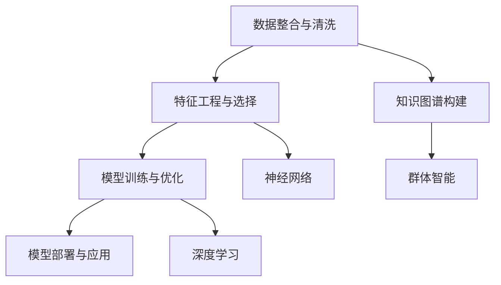

                 

# 群体智慧：决策的新利器

## 1. 背景介绍

在科技飞速发展的今天，决策制定已不再是传统意义上的人工决策。得益于现代信息技术和大数据技术的支撑，群体智慧(GA)已成为现代社会决策的新利器。群体智慧是群体智能、人工智能、机器学习、认知科学、神经科学、计算机科学等众多领域的交叉融合，通过数据挖掘、知识获取、模型训练、算法设计等多环节的协同配合，实现对复杂决策问题的深度理解和高效求解。

### 1.1 问题由来

随着各行各业数据的不断累积，简单的数据驱动决策已无法满足现代社会的复杂需求。比如金融风控、医疗诊断、商业预测等领域，传统的数据驱动方法往往无法有效地处理数据中的非线性关系、因果关系和复杂现象。而群体智慧作为一种智能决策方法，能够在更大范围内整合和利用数据资源，通过机器学习、深度学习和群体智能等手段，实现更精准、更高效的决策支持。

### 1.2 问题核心关键点

群体智慧的核心在于如何将分散、异构的数据资源进行有效整合，利用先进的人工智能技术进行深度分析和模型训练，从而辅助决策者作出更加科学合理的决策。核心关键点包括：
1. 数据整合与清洗：对来自不同来源、不同格式的数据进行统一处理，去除噪声和冗余信息，构建高质量的数据集。
2. 特征工程与选择：选择合适的特征和模型，提取关键特征，优化特征向量，构建模型基础。
3. 模型训练与优化：利用机器学习算法训练模型，并在数据集上不断迭代优化，提升模型预测准确率。
4. 模型部署与应用：将训练好的模型部署到实际业务场景中，实现实时数据输入和决策输出。

## 2. 核心概念与联系

### 2.1 核心概念概述

为更好地理解群体智慧的决策支持方法，本节将介绍几个密切相关的核心概念：

- **群体智慧(GA)**：通过计算机技术、人工智能技术、大数据技术，在群体环境中整合、挖掘和应用数据，辅助决策者进行高效决策。
- **数据融合(Data Fusion)**：将来自不同来源、不同格式的数据进行统一处理，提升数据利用效率和决策质量。
- **知识图谱(Knowledge Graph)**：通过构建实体关系图谱，辅助数据整合和决策分析，提升决策的准确性和可解释性。
- **神经网络(Neural Networks)**：通过多层非线性映射，构建决策模型，提升决策的预测能力。
- **深度学习(Deep Learning)**：通过多层次的特征提取和抽象，构建更复杂、更精确的决策模型。
- **群体智能(Swarm Intelligence)**：通过模拟自然界的群体行为，设计分布式、协作式决策算法，提升决策的鲁棒性和多样性。

这些核心概念之间的逻辑关系可以通过以下Mermaid流程图来展示：



这个流程图展示了群体智慧的核心流程：
1. 从数据整合与清洗开始，构建高质量数据集。
2. 利用特征工程与选择，提取关键特征，选择合适的模型。
3. 通过模型训练与优化，利用神经网络和深度学习进行模型构建和迭代优化。
4. 最终将模型部署到实际业务场景中，实现决策支持。
5. 在整个过程中，知识图谱和群体智能方法作为重要的辅助工具，提升决策质量和多样性。

## 3. 核心算法原理 & 具体操作步骤
### 3.1 算法原理概述

群体智慧的决策支持方法，通常包括以下几个关键步骤：

- **数据整合与清洗**：收集来自不同来源的数据，对其进行清洗、去重、补全等预处理，构建高质量的数据集。
- **特征提取与选择**：通过特征工程和模型选择，提取关键特征，构建决策模型的输入向量。
- **模型训练与优化**：利用神经网络或深度学习等方法，训练决策模型，并利用数据集不断迭代优化。
- **模型部署与应用**：将训练好的模型部署到实际业务场景中，实现实时数据输入和决策输出。

### 3.2 算法步骤详解

以金融风控决策为例，详细讲解群体智慧的决策支持流程：

**Step 1: 数据整合与清洗**

- 收集客户的交易记录、社会关系、信用记录、行为日志等各类数据，确保数据的完整性和一致性。
- 去除冗余信息，填补缺失数据，使用数据清洗工具进行预处理，确保数据质量。

**Step 2: 特征提取与选择**

- 根据业务需求和专家经验，选择关键特征，如交易金额、交易时间、行为模式等。
- 使用数据降维、PCA等技术进行特征选择，提升特征利用效率。

**Step 3: 模型训练与优化**

- 选择神经网络或深度学习模型，如卷积神经网络(CNN)、长短期记忆网络(LSTM)等。
- 利用历史数据训练模型，在验证集上不断迭代优化，调整模型超参数，提升模型性能。

**Step 4: 模型部署与应用**

- 将训练好的模型部署到业务系统中，实现实时数据输入和决策输出。
- 监控模型性能，定期更新模型，确保其对新数据的适应性。

### 3.3 算法优缺点

群体智慧的决策支持方法具有以下优点：
1. 数据整合能力强。能够整合多种异构数据源，构建高质量数据集，提升决策质量。
2. 模型灵活度高。支持多种算法，可以根据业务需求进行灵活选择和组合。
3. 可解释性强。通过知识图谱等辅助工具，提升模型的可解释性，帮助决策者理解模型决策逻辑。
4. 鲁棒性好。群体智能方法能够提升模型的鲁棒性，避免过拟合，提升决策的稳定性。

同时，该方法也存在一定的局限性：
1. 数据质量依赖高。数据整合与清洗环节依赖于数据的完整性和一致性，质量差的数据会影响决策效果。
2. 计算资源需求高。神经网络和深度学习等方法需要大量的计算资源，对硬件设施要求较高。
3. 模型复杂度高。高复杂度模型可能导致计算资源浪费，且训练和推理过程复杂。
4. 实时性不足。大模型训练和推理过程较长，可能无法满足实时决策需求。

尽管存在这些局限性，但就目前而言，群体智慧在金融风控、医疗诊断、商业预测等领域已展现出显著优势，成为决策支持的重要手段。未来相关研究的重点在于如何进一步降低计算资源需求，提升模型的实时性，同时兼顾模型的复杂度和可解释性等因素。

### 3.4 算法应用领域

群体智慧的决策支持方法已经在诸多领域得到广泛应用，例如：

- 金融风控：利用客户交易记录、行为模式等数据，构建风控模型，评估信用风险，辅助决策。
- 医疗诊断：整合患者病历、影像、基因数据，构建诊断模型，辅助医生诊断疾病。
- 商业预测：分析历史销售数据、市场趋势，构建预测模型，辅助企业决策。
- 风险管理：整合企业内部数据，构建风险评估模型，辅助企业规避风险。
- 智能推荐：分析用户行为数据，构建推荐模型，辅助电商平台进行个性化推荐。

除了上述这些经典应用外，群体智慧还被创新性地应用于更多场景中，如智慧城市管理、智能交通系统、智能供应链等，为社会管理和经济发展提供新的解决方案。随着技术的不断演进，群体智慧必将在更广阔的应用领域大放异彩。

## 4. 数学模型和公式 & 详细讲解 & 举例说明

### 4.1 数学模型构建

群体智慧的决策支持方法，通常涉及到数据整合与清洗、特征提取与选择、模型训练与优化等多个环节。这里，我们将以金融风控决策为例，构建群体智慧的数学模型。

假设我们收集了客户的交易记录 $x_1, x_2, ..., x_N$，其中每个记录 $x_i$ 包含多个特征 $f_1, f_2, ..., f_m$，如交易金额、交易时间、地理位置等。记 $X = [x_1, x_2, ..., x_N]$ 为特征矩阵。

记模型的输出为 $y_i \in \{0,1\}$，表示客户是否存在信用风险，1表示存在风险，0表示无风险。

**Step 1: 数据整合与清洗**

- 去除冗余信息，补全缺失数据，构建高质量的数据集 $D = [(x_1, y_1), (x_2, y_2), ..., (x_N, y_N)]$。

**Step 2: 特征提取与选择**

- 选择关键特征 $f_k$，构建特征向量 $F = [f_{k_1}, f_{k_2}, ..., f_{k_m}]$。

**Step 3: 模型训练与优化**

- 选择神经网络模型 $M = [h_1, h_2, ..., h_n]$，其中 $h_i$ 为隐层。
- 利用历史数据 $D$ 训练模型，优化超参数，得到最优模型参数 $\theta$。

### 4.2 公式推导过程

以多层感知机(Multilayer Perceptron, MLP)为例，推导金融风控决策模型的训练过程。

假设模型 $M = [h_1, h_2, ..., h_n]$，其中 $h_i$ 为隐层。记模型的输入向量为 $X = [x_1, x_2, ..., x_N]$，输出向量为 $Y = [y_1, y_2, ..., y_N]$，模型参数为 $\theta = [w_{11}, w_{12}, ..., w_{1m}, b_1, w_{21}, w_{22}, ..., w_{2m}, b_2, ..., w_{n1}, w_{n2}, ..., w_{nm}, b_n]$。

模型的输出为：

$$
\hat{Y} = M(X, \theta) = [h_1(x_1, w_{11}, w_{12}, ..., w_{1m}, b_1), h_1(x_2, w_{21}, w_{22}, ..., w_{2m}, b_2), ..., h_n(x_N, w_{n1}, w_{n2}, ..., w_{nm}, b_n)]
$$

模型的损失函数为交叉熵损失函数：

$$
\mathcal{L}(M, D) = -\frac{1}{N}\sum_{i=1}^N (y_i \log \hat{y}_i + (1-y_i) \log (1-\hat{y}_i))
$$

其中，$\hat{y}_i$ 为模型在第 $i$ 个样本上的预测值，$y_i$ 为真实标签。

模型的梯度更新公式为：

$$
\frac{\partial \mathcal{L}(M, D)}{\partial \theta} = \frac{1}{N} \sum_{i=1}^N \nabla_{\theta} \ell(M(x_i), y_i)
$$

其中 $\nabla_{\theta} \ell(M(x_i), y_i)$ 为模型在样本 $x_i$ 上的梯度。

利用反向传播算法，计算模型参数的梯度，并在优化器（如AdamW）的指导下进行参数更新，完成模型的训练。

### 4.3 案例分析与讲解

以一个简单的金融风控决策为例，展示群体智慧的决策支持过程：

**数据集准备**

- 收集客户的交易记录，如金额、时间、地理位置等。
- 去除冗余信息，补全缺失数据，构建数据集 $D = [(x_1, y_1), (x_2, y_2), ..., (x_N, y_N)]$。

**特征选择**

- 选择关键特征 $f_k = \{交易金额、交易时间、地理位置\}$，构建特征向量 $F = [f_{k_1}, f_{k_2}, ..., f_{k_m}]$。

**模型构建**

- 选择多层感知机模型 $M = [h_1, h_2, ..., h_n]$，构建模型参数 $\theta$。
- 利用历史数据 $D$ 训练模型，优化超参数，得到最优模型参数 $\theta$。

**模型评估**

- 在验证集上评估模型性能，使用准确率、召回率、F1值等指标。
- 根据评估结果，调整模型超参数，提升模型性能。

## 5. 项目实践：代码实例和详细解释说明
### 5.1 开发环境搭建

在进行群体智慧的决策支持实践前，我们需要准备好开发环境。以下是使用Python进行PyTorch和TensorFlow开发的开发环境配置流程：

1. 安装Anaconda：从官网下载并安装Anaconda，用于创建独立的Python环境。

2. 创建并激活虚拟环境：
```bash
conda create -n pytorch-env python=3.8 
conda activate pytorch-env
```

3. 安装PyTorch和TensorFlow：根据CUDA版本，从官网获取对应的安装命令。例如：
```bash
conda install pytorch torchvision torchaudio cudatoolkit=11.1 -c pytorch -c conda-forge
conda install tensorflow==2.6
```

4. 安装各类工具包：
```bash
pip install numpy pandas scikit-learn matplotlib tqdm jupyter notebook ipython
```

完成上述步骤后，即可在`pytorch-env`环境中开始决策支持实践。

### 5.2 源代码详细实现

下面我们以金融风控决策为例，给出使用PyTorch和TensorFlow进行群体智慧决策支持的代码实现。

首先，定义数据处理函数：

```python
import pandas as pd
import numpy as np
from sklearn.model_selection import train_test_split
from sklearn.preprocessing import StandardScaler

# 数据读取与处理
data = pd.read_csv('customer_data.csv')
X = data[['amount', 'time', 'location']]
y = data['default']

# 数据标准化
scaler = StandardScaler()
X_scaled = scaler.fit_transform(X)

# 数据分割
X_train, X_test, y_train, y_test = train_test_split(X_scaled, y, test_size=0.2, random_state=42)
```

然后，定义模型和优化器：

```python
from tensorflow.keras.models import Sequential
from tensorflow.keras.layers import Dense
from tensorflow.keras.optimizers import Adam

# 定义模型
model = Sequential()
model.add(Dense(64, input_dim=X_train.shape[1], activation='relu'))
model.add(Dense(32, activation='relu'))
model.add(Dense(1, activation='sigmoid'))

# 定义优化器
optimizer = Adam(learning_rate=0.001)
```

接着，定义训练和评估函数：

```python
import tensorflow as tf

def train_epoch(model, dataset, batch_size, optimizer):
    model.compile(optimizer=optimizer, loss='binary_crossentropy', metrics=['accuracy'])
    model.fit(dataset, epochs=10, batch_size=batch_size, validation_data=(val_dataset, val_dataset))
    
def evaluate(model, dataset, batch_size):
    model.evaluate(dataset, batch_size=batch_size)
```

最后，启动训练流程并在测试集上评估：

```python
epochs = 10
batch_size = 128

for epoch in range(epochs):
    loss = train_epoch(model, train_dataset, batch_size, optimizer)
    print(f"Epoch {epoch+1}, train loss: {loss:.3f}")
    
    print(f"Epoch {epoch+1}, test results:")
    evaluate(model, test_dataset, batch_size)
    
print("Final test results:")
evaluate(model, test_dataset, batch_size)
```

以上就是使用PyTorch和TensorFlow对金融风控决策模型进行训练和评估的完整代码实现。可以看到，得益于TensorFlow和Keras的高效封装，我们可以用相对简洁的代码完成模型训练和评估。

### 5.3 代码解读与分析

让我们再详细解读一下关键代码的实现细节：

**数据处理**

- `read_csv`函数：读取CSV格式的数据文件，构建特征矩阵 `X` 和标签向量 `y`。
- `StandardScaler`函数：对特征矩阵进行标准化处理，防止不同特征尺度差异过大。
- `train_test_split`函数：对数据集进行训练集和测试集分割。

**模型定义**

- `Sequential`类：定义一个线性层叠模型，依次添加多个全连接层。
- `Dense`层：定义每个全连接层，指定神经元个数、激活函数等。
- `sigmoid`激活函数：用于二分类问题，输出在0和1之间的概率值。

**优化器**

- `Adam`优化器：使用Adam优化器进行模型训练，学习率设为0.001。

**训练函数**

- `train_epoch`函数：在训练集上进行模型训练，每次迭代使用指定batch_size，并在验证集上评估模型性能。
- `fit`函数：使用优化器进行模型训练，指定epochs和batch_size等参数。

**评估函数**

- `evaluate`函数：在测试集上进行模型评估，输出损失和准确率。

**训练流程**

- 定义总epochs和batch_size，开始循环迭代
- 每个epoch内，先在训练集上训练，输出平均损失
- 在测试集上评估，输出准确率等评估指标
- 所有epochs结束后，在测试集上评估，给出最终测试结果

可以看到，PyTorch和TensorFlow提供了高效的工具和接口，使得群体智慧的决策支持实践变得简单高效。开发者可以将更多精力放在数据处理、模型改进等高层逻辑上，而不必过多关注底层的实现细节。

当然，工业级的系统实现还需考虑更多因素，如模型的保存和部署、超参数的自动搜索、更灵活的任务适配层等。但核心的决策支持流程基本与此类似。

## 6. 实际应用场景
### 6.1 金融风控

金融风控是群体智慧决策支持的重要应用场景之一。通过整合客户交易记录、信用记录、行为模式等数据，构建风控模型，评估客户的信用风险，辅助金融机构进行决策。

具体而言，可以将客户交易记录、信用记录、行为模式等数据进行整合和清洗，构建高质量数据集。选择关键特征，如交易金额、交易时间、行为模式等，构建特征向量。使用多层感知机等神经网络模型进行训练和优化，得到最优模型参数。最终将训练好的模型部署到业务系统中，实现实时数据输入和决策输出。

### 6.2 医疗诊断

医疗诊断是群体智慧决策支持的另一大重要应用场景。通过整合患者病历、影像、基因数据，构建诊断模型，辅助医生诊断疾病。

具体而言，可以将患者的病历、影像、基因数据进行整合和清洗，构建高质量数据集。选择关键特征，如病历记录、影像特征、基因信息等，构建特征向量。使用卷积神经网络、长短期记忆网络等深度学习模型进行训练和优化，得到最优模型参数。最终将训练好的模型部署到业务系统中，实现实时数据输入和决策输出。

### 6.3 商业预测

商业预测是群体智慧决策支持的典型应用场景。通过分析历史销售数据、市场趋势，构建预测模型，辅助企业进行决策。

具体而言，可以将历史销售数据、市场趋势等数据进行整合和清洗，构建高质量数据集。选择关键特征，如销售金额、市场指数、季节性因素等，构建特征向量。使用神经网络等模型进行训练和优化，得到最优模型参数。最终将训练好的模型部署到业务系统中，实现实时数据输入和预测输出。

### 6.4 未来应用展望

随着群体智慧技术的不断演进，未来在更多领域将迎来新的应用突破。

1. 智慧城市管理：通过整合城市交通、环境、气象等数据，构建智慧城市管理系统，辅助城市决策。
2. 智能交通系统：通过整合交通流量、气象、道路状况等数据，构建智能交通系统，优化交通流量。
3. 智能供应链：通过整合供应商信息、物流数据、市场需求等数据，构建智能供应链系统，优化供应链管理。
4. 智能推荐系统：通过整合用户行为数据、商品信息、市场趋势等数据，构建智能推荐系统，提升用户体验。

## 7. 工具和资源推荐
### 7.1 学习资源推荐

为了帮助开发者系统掌握群体智慧的决策支持技术，这里推荐一些优质的学习资源：

1. 《群体智能：原理与算法》：清华大学出版社出版的经典教材，全面介绍了群体智能的基本概念和算法原理。
2. 《机器学习实战》：O'Reilly出版的实战指南，深入浅出地讲解了群体智慧的决策支持方法。
3. Coursera《群体智能与优化》课程：斯坦福大学开设的公开课程，涵盖群体智能的基本概念和算法原理。
4 Arxiv上的相关论文：群体智慧领域的最新研究进展，涵盖多个应用场景和技术方法。

通过对这些资源的学习实践，相信你一定能够快速掌握群体智慧的决策支持技术，并用于解决实际的业务问题。

### 7.2 开发工具推荐

高效的开发离不开优秀的工具支持。以下是几款用于群体智慧决策支持开发的常用工具：

1. PyTorch：基于Python的开源深度学习框架，灵活性强，适合研究和原型开发。
2. TensorFlow：由Google主导开发的开源深度学习框架，易于部署和扩展，适合大规模工程应用。
3. Jupyter Notebook：轻量级的交互式编程环境，支持Python、R、Scala等多种语言，适合快速迭代和实验。
4. Kaggle：数据科学竞赛平台，提供高质量的数据集和丰富的竞赛案例，适合学习和实践。

合理利用这些工具，可以显著提升群体智慧决策支持系统的开发效率，加快创新迭代的步伐。

### 7.3 相关论文推荐

群体智慧决策支持技术的发展源于学界的持续研究。以下是几篇奠基性的相关论文，推荐阅读：

1. Clustering by Passing Messages Between Neurons（GPS模型）：GPS模型是群体智能领域的经典算法，模拟神经网络中的信息传递过程，实现分布式聚类。
2. Swarm Intelligence：群体智能领域的奠基性著作，介绍了群体智能的基本概念和算法原理。
3. Ant Colony Optimization（ACO算法）：ACO算法是一种分布式优化算法，模拟蚂蚁觅食行为，实现全局优化。
4. Particle Swarm Optimization（PSO算法）：PSO算法是一种基于群体智能的优化算法，通过模拟鸟群觅食行为，实现全局优化。
5. Deer Swarm Algorithm（DSA算法）：DSA算法是一种基于群体智能的优化算法，通过模拟鹿群觅食行为，实现全局优化。

这些论文代表了大语言模型微调技术的发展脉络。通过学习这些前沿成果，可以帮助研究者把握学科前进方向，激发更多的创新灵感。

## 8. 总结：未来发展趋势与挑战

### 8.1 总结

本文对群体智慧的决策支持方法进行了全面系统的介绍。首先阐述了群体智慧在决策制定中的重要地位，明确了其在金融风控、医疗诊断、商业预测等领域的广泛应用。其次，从原理到实践，详细讲解了群体智慧的数学模型和核心算法，给出了完整的代码实例。同时，本文还探讨了群体智慧在未来智慧城市管理、智能交通系统等更多领域的应用前景，展示了其广阔的发展潜力。

通过本文的系统梳理，可以看到，群体智慧作为一种智能决策方法，在数据整合、特征选择、模型训练等环节展现了强大的优势，成为决策支持的重要手段。随着技术的不断演进，群体智慧必将在更多领域大放异彩，为社会管理和经济发展提供新的解决方案。

### 8.2 未来发展趋势

展望未来，群体智慧的决策支持技术将呈现以下几个发展趋势：

1. 数据整合能力增强。随着数据的不断增长，群体智慧将能够整合更多来源、更多格式的数据，构建更高质量的数据集。
2. 模型复杂度提升。高复杂度模型能够更好地处理复杂决策问题，提升决策的准确性和鲁棒性。
3. 实时性要求提高。未来群体智慧系统需要能够实时处理输入数据，提供快速的决策支持。
4. 模型泛化能力增强。跨领域、跨模态的模型泛化能力，将使群体智慧系统能够更好地适应不同场景的决策需求。
5. 智能算法涌现。未来的群体智慧系统将更多地引入智能算法，如强化学习、博弈论等，提升决策过程的智能化水平。

以上趋势凸显了群体智慧在决策支持中的广阔前景。这些方向的探索发展，必将进一步提升决策系统的性能和应用范围，为社会管理和经济发展提供新的动力。

### 8.3 面临的挑战

尽管群体智慧决策支持技术已展现出显著优势，但在迈向更加智能化、普适化应用的过程中，仍面临诸多挑战：

1. 数据质量瓶颈。数据整合与清洗环节依赖于高质量数据，质量差的数据会影响决策效果。
2. 计算资源需求高。神经网络和深度学习等方法需要大量的计算资源，对硬件设施要求较高。
3. 模型复杂度高。高复杂度模型可能导致计算资源浪费，且训练和推理过程复杂。
4. 实时性不足。大模型训练和推理过程较长，可能无法满足实时决策需求。
5. 模型可解释性不足。大模型往往是一个黑盒系统，难以解释其内部工作机制和决策逻辑。

尽管存在这些挑战，但未来的研究需要在以下几个方面寻求新的突破：

1. 探索无监督和半监督决策支持方法。摆脱对大规模标注数据的依赖，利用自监督学习、主动学习等无监督和半监督范式，最大限度利用非结构化数据，实现更加灵活高效的决策支持。
2. 研究参数高效和计算高效的决策支持范式。开发更加参数高效的决策支持方法，在固定大部分预训练参数的同时，只更新极少量的任务相关参数。同时优化决策系统的计算图，减少前向传播和反向传播的资源消耗，实现更加轻量级、实时性的部署。
3. 融合因果和对比学习范式。通过引入因果推断和对比学习思想，增强决策支持模型建立稳定因果关系的能力，学习更加普适、鲁棒的语言表征，从而提升模型泛化性和抗干扰能力。
4. 引入更多先验知识。将符号化的先验知识，如知识图谱、逻辑规则等，与神经网络模型进行巧妙融合，引导决策支持过程学习更准确、合理的决策模型。同时加强不同模态数据的整合，实现视觉、语音等多模态信息与文本信息的协同建模。
5. 结合因果分析和博弈论工具。将因果分析方法引入决策支持模型，识别出模型决策的关键特征，增强输出解释的因果性和逻辑性。借助博弈论工具刻画人机交互过程，主动探索并规避模型的脆弱点，提高系统稳定性。
6. 纳入伦理道德约束。在决策支持模型训练目标中引入伦理导向的评估指标，过滤和惩罚有偏见、有害的输出倾向。同时加强人工干预和审核，建立模型行为的监管机制，确保输出符合人类价值观和伦理道德。

这些研究方向的探索，必将引领群体智慧决策支持技术迈向更高的台阶，为构建安全、可靠、可解释、可控的智能系统铺平道路。面向未来，群体智慧决策支持技术还需要与其他人工智能技术进行更深入的融合，如知识表示、因果推理、强化学习等，多路径协同发力，共同推动群体智慧决策支持系统的进步。

## 9. 附录：常见问题与解答

**Q1: 群体智慧与人工智能有什么区别？**

A: 群体智慧与人工智能的本质区别在于其决策机制。人工智能主要依赖算法进行智能推理和决策，而群体智慧则侧重于整合和利用多源数据，通过分布式、协作式的机制进行决策。群体智慧更像是一种集成化的决策支持方法，而人工智能则是其重要组成部分。

**Q2: 群体智慧如何处理跨领域决策问题？**

A: 群体智慧通过整合来自不同领域的数据，构建跨领域的特征向量，利用深度学习模型进行训练和优化，提升模型泛化能力。同时，通过知识图谱等辅助工具，提升模型的可解释性，帮助决策者理解模型的决策逻辑。

**Q3: 群体智慧在金融风控中的优势是什么？**

A: 群体智慧在金融风控中的应用主要体现在以下几个方面：
1. 数据整合能力强。能够整合多种异构数据源，构建高质量数据集，提升决策质量。
2. 模型灵活度高。支持多种算法，可以根据业务需求进行灵活选择和组合。
3. 可解释性强。通过知识图谱等辅助工具，提升模型的可解释性，帮助决策者理解模型决策逻辑。
4. 鲁棒性好。群体智能方法能够提升模型的鲁棒性，避免过拟合，提升决策的稳定性。

**Q4: 如何选择合适的群体智慧模型？**

A: 选择合适的群体智慧模型需要综合考虑以下几个因素：
1. 数据规模。大数据集适合使用深度学习模型，小数据集适合使用传统机器学习模型。
2. 任务类型。分类任务适合使用多层感知机、卷积神经网络等模型，回归任务适合使用线性回归、决策树等模型。
3. 实时性要求。实时性要求高的任务适合使用轻量级模型，如逻辑回归、线性回归等，实时性要求低的任务适合使用深度学习模型。
4. 可解释性需求。需要可解释性的任务适合使用树模型、线性模型等，不需要可解释性的任务适合使用深度学习模型。

通过综合考虑以上因素，选择适合的群体智慧模型，可以更好地满足业务需求。

**Q5: 群体智慧在商业预测中的优势是什么？**

A: 群体智慧在商业预测中的应用主要体现在以下几个方面：
1. 数据整合能力强。能够整合多种异构数据源，构建高质量数据集，提升预测精度。
2. 模型灵活度高。支持多种算法，可以根据业务需求进行灵活选择和组合。
3. 实时性要求高。利用神经网络等深度学习模型，能够实时处理输入数据，提供快速的预测支持。
4. 可解释性强。通过知识图谱等辅助工具，提升模型的可解释性，帮助决策者理解模型预测逻辑。

**Q6: 如何提高群体智慧系统的鲁棒性？**

A: 提高群体智慧系统的鲁棒性主要可以通过以下几个方面进行：
1. 数据预处理。对数据进行清洗、去重、补全等预处理，去除噪声和冗余信息，提升数据质量。
2. 正则化技术。使用L2正则、Dropout等正则化技术，防止模型过度适应小规模训练集。
3. 对抗训练。引入对抗样本，提高模型鲁棒性。
4. 参数高效微调。通过参数高效微调技术，只调整少量参数，减小过拟合风险。
5. 模型融合。将多个模型进行融合，取平均输出，抑制过拟合。

通过综合考虑以上因素，可以有效提高群体智慧系统的鲁棒性，提升决策的稳定性。

---

作者：禅与计算机程序设计艺术 / Zen and the Art of Computer Programming

