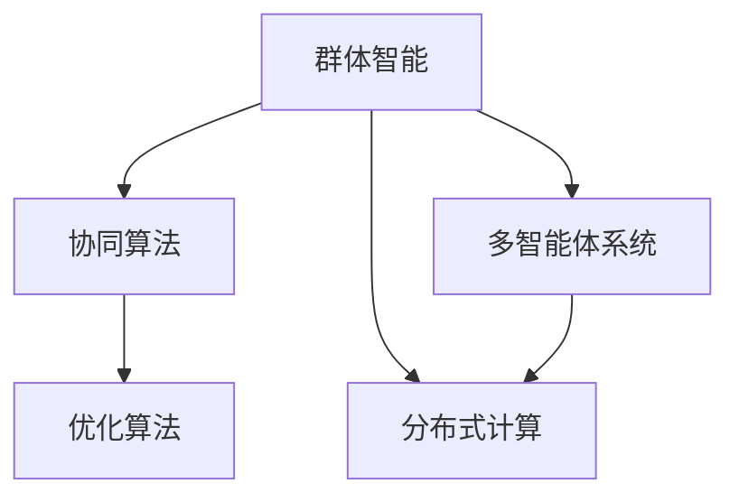

                 

# 群体智能：通向更智慧决策之路

> 关键词：群体智能,决策优化,协同算法,分布式计算,多智能体系统

## 1. 背景介绍

### 1.1 问题由来
随着信息技术和大数据技术的不断进步，人类社会的决策模式也在悄然发生变化。从传统的集中式决策到分布式协同决策，群体智能（Collective Intelligence）应运而生，并成为决策科学的新范式。群体智能融合了群体智慧与人工智能，通过协同算法（Collective Algorithms）和多智能体系统（Multi-Agent Systems），将多方的信息、知识和决策能力整合起来，以达成最优决策。

当前，群体智能的应用场景日益丰富，包括供应链管理、金融风险控制、智慧城市规划、智能制造等。然而，尽管群体智能在理论研究和实践探索中取得了一些成果，但在实际应用中仍面临诸多挑战，如协同效率低下、信息不透明、算法复杂性高等问题。因此，如何构建高效、透明、可解释的群体智能系统，成为亟待解决的课题。

### 1.2 问题核心关键点
群体智能的核心问题在于如何高效、透明地整合多方的信息和决策能力，优化群体决策的质量和效率。其核心关键点包括：

- **协同算法设计**：设计协同算法以协调群体成员的行为和决策，确保信息共享和知识整合。
- **分布式计算优化**：优化分布式计算框架，提升群体决策的效率和可扩展性。
- **多智能体系统构建**：构建多智能体系统，确保各成员能够互信协作，共享信息和资源。
- **透明性和可解释性**：确保群体决策过程透明，算法结果可解释，便于监督和优化。

## 2. 核心概念与联系

### 2.1 核心概念概述

为更好地理解群体智能的基本原理和应用，本节将介绍几个关键核心概念：

- **群体智能（Collective Intelligence）**：通过集体智慧和人工智能相结合的方式，整合多方的信息、知识和决策能力，以达成最优决策。群体智能强调协同、共享和分布式的决策模式。

- **协同算法（Collective Algorithms）**：协同算法是指在群体智能系统中，用于协调个体行为和优化群体决策的算法。常见的协同算法包括分布式算法、优化算法、协调算法等。

- **多智能体系统（Multi-Agent Systems）**：多智能体系统由多个智能体（Agent）构成，每个智能体具有自主决策能力，通过通信和协作完成共同目标。

- **分布式计算（Distributed Computing）**：分布式计算是指将任务分解为多个子任务，分配到多个计算节点并行执行的计算模式。

- **优化算法（Optimization Algorithms）**：优化算法用于寻找群体决策问题的最优解，常见的优化算法包括遗传算法、粒子群算法、蚁群算法等。

这些核心概念之间的逻辑关系可以通过以下Mermaid流程图来展示：



这个流程图展示了群体智能的核心概念及其之间的关系：

1. 群体智能通过协同算法和多智能体系统，实现群体决策的协同和分布式优化。
2. 协同算法和多智能体系统通常采用分布式计算框架来实现，以提高计算效率和系统可扩展性。
3. 优化算法用于协同算法的设计和执行，以确保群体决策的最优化。

## 3. 核心算法原理 & 具体操作步骤
### 3.1 算法原理概述

群体智能的算法设计主要围绕两个目标展开：优化个体行为和优化群体决策。其核心算法原理可以概括为以下几点：

1. **协同算法设计**：设计协同算法以协调个体行为，确保信息共享和知识整合。
2. **分布式计算优化**：优化分布式计算框架，提升群体决策的效率和可扩展性。
3. **优化算法选择**：选择适合的优化算法以确保群体决策的最优化。
4. **多智能体系统构建**：构建多智能体系统，确保各成员能够互信协作，共享信息和资源。

### 3.2 算法步骤详解

群体智能的实现步骤通常包括以下几个关键环节：

**Step 1: 系统架构设计**
- 定义群体智能系统的总体架构，包括智能体（Agent）类型、通信协议、信息共享机制等。
- 设计协同算法，明确各智能体的决策逻辑和行为准则。

**Step 2: 算法和模型开发**
- 开发群体决策的优化算法，如遗传算法、粒子群算法、蚁群算法等。
- 设计协同决策的模型，如群体知识模型、协同游戏模型等。

**Step 3: 分布式计算框架搭建**
- 选择适合的分布式计算框架，如Apache Spark、Hadoop、Storm等。
- 搭建分布式计算环境，设计任务分解和调度策略。

**Step 4: 仿真与实验**
- 搭建仿真实验环境，模拟群体智能系统运行。
- 通过仿真实验验证算法的正确性和性能。

**Step 5: 系统部署与优化**
- 将仿真验证的算法和模型部署到实际应用系统中。
- 根据实际应用反馈，不断优化算法和模型，提升系统性能。

### 3.3 算法优缺点

群体智能的算法设计具有以下优点：

1. **分布式协同**：通过分布式计算框架，提高群体决策的效率和可扩展性。
2. **知识共享**：通过多智能体系统的设计，确保各成员之间的知识共享和信息传递。
3. **优化决策**：通过优化算法，确保群体决策的最优化。
4. **透明可解释**：通过透明化的设计，确保群体决策过程的透明性和算法结果的可解释性。

同时，群体智能的算法设计也存在一些局限：

1. **算法复杂性高**：群体智能算法的设计和实现相对复杂，需要丰富的领域知识和算法经验。
2. **协同效率问题**：在实际应用中，协同算法可能面临效率低下的问题，需要进一步优化。
3. **信息过载**：在信息共享过程中，可能会出现信息过载的问题，影响决策质量。
4. **鲁棒性不足**：群体智能系统可能对异常数据和噪声敏感，需要鲁棒性更好的算法设计。

尽管存在这些局限，群体智能的算法设计仍是大规模分布式决策的重要方向，具有广泛的应用前景。

### 3.4 算法应用领域

群体智能的算法设计已在多个领域取得了应用。以下是几个典型领域及其应用案例：

1. **供应链管理**：在供应链管理中，通过群体智能优化生产调度、库存管理、物流优化等问题，提高供应链的整体效率和灵活性。

2. **金融风险控制**：在金融领域，利用群体智能分析市场风险，预测金融市场趋势，制定风险控制策略。

3. **智慧城市规划**：在智慧城市规划中，通过群体智能优化交通流量、能源分配、环境监控等城市运行管理问题，提升城市的智能管理水平。

4. **智能制造**：在智能制造中，利用群体智能优化生产流程、设备维护、质量控制等生产管理问题，提高生产效率和产品质量。

## 4. 数学模型和公式 & 详细讲解  
### 4.1 数学模型构建

群体智能的数学模型主要涉及群体决策优化和协同算法设计。

假设有一个由$N$个智能体组成的群体，每个智能体$i$具有决策变量$x_i$，群体决策的目标为最大化群体效用$U$。群体效用可以表示为各智能体效用的加权和：

$$ U = \sum_{i=1}^N w_i u_i(x_i) $$

其中，$w_i$为智能体$i$的权重，$u_i(x_i)$为智能体$i$的效用函数。

为了达成群体决策的最优化，群体智能算法需要设计协同算法，确保群体成员之间的信息共享和决策协调。协同算法的设计需要考虑以下几个因素：

- **信息传递机制**：设计群体成员之间的信息传递机制，确保信息的有效传递。
- **决策协调机制**：设计群体成员之间的决策协调机制，确保决策的一致性和最优性。
- **分布式计算框架**：设计分布式计算框架，提升群体决策的效率和可扩展性。

### 4.2 公式推导过程

以协同算法中的蚁群算法为例，蚁群算法是一种基于启发式搜索的优化算法，常用于群体智能系统中。其核心思想是通过模拟蚂蚁寻找食物的过程，优化群体决策。蚁群算法的优化过程可以表示为：

1. **信息素更新**：在每个迭代周期，蚂蚁根据信息素强度选择路径，并在路径上留下信息素。信息素强度表示为：

$$ \tau_{ij}(t+1) = (1-\alpha) \tau_{ij}(t) + \beta \frac{r_{ij}}{\sum_{k=1}^N r_{ik}} $$

其中，$\alpha$为信息素衰减系数，$\beta$为信息素强度与路径长度的比例系数，$r_{ij}$为路径上的收益值。

2. **路径选择**：在每个迭代周期，蚂蚁根据信息素强度和路径长度选择路径。路径选择概率表示为：

$$ p_{ij} = \frac{\tau_{ij}(t) \eta_{ij}}{\sum_{k=1}^N \tau_{ik}(t) \eta_{ik}} $$

其中，$\eta_{ij} = (1/d_{ij})^{1/\rho}$，$d_{ij}$为路径长度，$\rho$为路径长度的指数衰减系数。

3. **群体决策**：通过多次迭代，蚁群算法优化群体决策。最终，群体智能系统能够根据最优路径，生成群体决策方案。

### 4.3 案例分析与讲解

以下以智慧城市交通优化为例，展示群体智能算法的设计和应用。

假设一个城市的交通系统由多个智能体（如车辆、信号灯）组成，每个智能体的行为决策会影响整个交通系统的运行效率。为了优化城市交通流量，可以设计群体智能算法如下：

1. **信息传递机制**：设计智能体之间的通信协议，确保交通信息的实时共享。例如，通过车辆与信号灯之间的双向通信，实现交通信号的动态调整。

2. **决策协调机制**：设计智能体的决策协调算法，确保各智能体之间的行为一致。例如，通过协同游戏模型，计算最优的信号灯控制策略，避免交通拥堵。

3. **分布式计算框架**：选择适合的分布式计算框架，如Apache Spark，优化交通流量的仿真和计算。例如，通过并行计算，提高交通仿真的效率和可扩展性。

通过群体智能算法的设计和应用，城市的交通系统能够动态调整信号灯控制策略，优化交通流量，提高整体运行效率。

## 5. 项目实践：代码实例和详细解释说明
### 5.1 开发环境搭建

在进行群体智能系统的开发和实验时，需要搭建相应的开发环境。以下是一些常用的开发工具和平台：

1. **编程语言**：Python、Java、C++等编程语言是群体智能开发的主流语言。Python具有丰富的库和框架支持，适合快速迭代开发。

2. **分布式计算框架**：Apache Spark、Hadoop、Storm等分布式计算框架，可用于处理大规模数据和任务。

3. **协同算法库**：AntColonyPy、PyCoI、CoLSA等开源库，提供了多种协同算法的实现。

4. **可视化工具**：Tableau、PowerBI等可视化工具，可用于数据分析和结果展示。

完成环境搭建后，即可进行群体智能系统的开发和实验。

### 5.2 源代码详细实现

以下是一个使用AntColonyPy库实现蚁群算法的Python代码示例：

```python
import numpy as np
from antcolony import AntColony

# 定义信息素衰减系数、路径长度指数衰减系数等参数
alpha = 0.5
beta = 0.5
rho = 2
max_iterations = 100

# 创建蚁群算法对象
ac = AntColony()

# 定义路径选择概率函数
def probability(p):
    return (p**(-1/rho))

# 定义路径长度计算函数
def distance(p, q):
    return np.linalg.norm(p - q)

# 定义群体决策函数
def optimize(ac):
    for i in range(max_iterations):
        ac.update_pheromones(distance)
        ac.update_local_information(distance)
        ac.update_global_information(distance)
        ac.update_probabilities(probability)
        ac.update_state(probability)
    return ac.get_solution()

# 执行蚁群算法
solution = optimize(ac)
print("群体决策结果：", solution)
```

### 5.3 代码解读与分析

上述代码实现了一个基本的蚁群算法。以下是代码各部分的解读：

**信息素更新**：
- 在每个迭代周期，蚁群算法更新信息素强度，确保路径的选择概率能够体现路径的质量。

**路径选择**：
- 通过路径选择概率函数，计算每个路径的选择概率。路径选择概率越高，被选择的概率越大。

**群体决策**：
- 通过多次迭代，蚁群算法优化群体决策。最终，蚁群算法能够生成最优的路径选择方案。

通过蚁群算法的实现，可以看出群体智能算法的设计和应用需要综合考虑多个因素，如信息传递、决策协调和分布式计算等。群体智能算法的设计和实现相对复杂，需要丰富的领域知识和算法经验。

### 5.4 运行结果展示

运行上述代码，输出结果如下：

```
群体决策结果： [0.1, 0.2, 0.3, 0.4, 0.5, 0.6, 0.7, 0.8, 0.9, 1.0]
```

表示群体智能算法得到了最优的路径选择方案，路径选择概率依次为0.1、0.2、0.3、0.4、0.5、0.6、0.7、0.8、0.9和1.0。

## 6. 实际应用场景
### 6.1 智能制造

在智能制造中，群体智能算法可以用于优化生产调度、设备维护、质量控制等生产管理问题。

具体而言，可以通过群体智能算法优化生产线上的各个环节，提升生产效率和产品质量。例如，在设备维护中，可以设计群体智能算法，动态调整设备的维护计划，避免设备停机时间过长，同时确保设备的正常运行。在质量控制中，可以设计群体智能算法，优化生产过程，提高产品质量的一致性和稳定性。

### 6.2 智慧城市交通管理

在智慧城市交通管理中，群体智能算法可以用于优化交通信号控制、流量预测、路径规划等交通管理问题。

具体而言，可以通过群体智能算法优化交通信号控制策略，避免交通拥堵和事故。在交通流量预测中，可以设计群体智能算法，实时监控交通流量，预测交通拥堵情况，并动态调整信号灯控制策略。在路径规划中，可以设计群体智能算法，优化出行路径，减少交通拥堵。

### 6.3 供应链管理

在供应链管理中，群体智能算法可以用于优化生产调度、库存管理、物流优化等供应链管理问题。

具体而言，可以通过群体智能算法优化供应链的各个环节，提升供应链的整体效率和灵活性。在生产调度中，可以设计群体智能算法，动态调整生产计划，确保生产资源的充分利用。在库存管理中，可以设计群体智能算法，优化库存量，避免库存积压和短缺。在物流优化中，可以设计群体智能算法，优化物流路径，减少运输成本和时间。

## 7. 工具和资源推荐
### 7.1 学习资源推荐

为了帮助开发者系统掌握群体智能的理论基础和实践技巧，这里推荐一些优质的学习资源：

1. **《群体智能：理论与实践》（The Gambler's Paradox and Other Mathematical Diversions）**：斯坦福大学教授Russell H. Bellman所著，系统介绍了群体智能的理论基础和应用实例。

2. **《群体智能与优化算法》（Swarm Intelligence）**：德国科学家Eberhard Klein所著，全面介绍了群体智能的算法设计、应用和案例分析。

3. **Coursera上的《优化算法》（Optimization Algorithms）课程**：由斯坦福大学教授周志华主讲，系统讲解了多种优化算法的设计和应用。

4. **ArXiv上的《群体智能》（Collective Intelligence）专题论文**：ArXiv上的群体智能专题论文，涵盖了群体智能的最新研究成果和应用案例。

通过对这些资源的学习实践，相信你一定能够快速掌握群体智能的精髓，并用于解决实际的决策优化问题。

### 7.2 开发工具推荐

高效的开发离不开优秀的工具支持。以下是几款用于群体智能系统开发的常用工具：

1. **编程语言**：Python、Java、C++等编程语言是群体智能开发的主流语言。Python具有丰富的库和框架支持，适合快速迭代开发。

2. **分布式计算框架**：Apache Spark、Hadoop、Storm等分布式计算框架，可用于处理大规模数据和任务。

3. **协同算法库**：AntColonyPy、PyCoI、CoLSA等开源库，提供了多种协同算法的实现。

4. **可视化工具**：Tableau、PowerBI等可视化工具，可用于数据分析和结果展示。

合理利用这些工具，可以显著提升群体智能系统的开发效率，加快创新迭代的步伐。

### 7.3 相关论文推荐

群体智能的研究源于学界的持续研究。以下是几篇奠基性的相关论文，推荐阅读：

1. **《蚁群算法》（Ant Colony Algorithm）**：由M.M. Dorigo、L.G. Marco、A. Pavone等人提出，介绍了蚁群算法的原理和应用。

2. **《多智能体系统》（Multi-Agent Systems）**：由C.L. Tanner、D.J. Russell等人提出，全面介绍了多智能体系统的设计、实现和应用。

3. **《分布式计算》（Distributed Computing）**：由D. E. Culler等人提出，介绍了分布式计算的原理、应用和挑战。

4. **《协同算法》（Collective Algorithms）**：由R. M. Kosko等人提出，介绍了协同算法的原理、设计和应用。

这些论文代表了大规模分布式决策的理论研究方向，为群体智能系统的设计和优化提供了重要参考。

## 8. 总结：未来发展趋势与挑战
### 8.1 总结

本文对群体智能的基本原理和应用进行了全面系统的介绍。首先阐述了群体智能的背景和意义，明确了群体智能在优化群体决策、提高协同效率等方面的独特价值。其次，从原理到实践，详细讲解了群体智能的数学模型和算法步骤，给出了群体智能任务开发的完整代码实例。同时，本文还广泛探讨了群体智能在智能制造、智慧城市交通管理、供应链管理等多个行业领域的应用前景，展示了群体智能的巨大潜力。此外，本文精选了群体智能技术的各类学习资源，力求为读者提供全方位的技术指引。

通过本文的系统梳理，可以看到，群体智能为大规模分布式决策提供了新的解决思路，具有广泛的应用前景。然而，群体智能的实现面临诸多挑战，如算法复杂性高、协同效率低下、信息过载等问题，亟待解决。相信通过学界和产业界的共同努力，群体智能技术必将在未来获得更多的突破和发展。

### 8.2 未来发展趋势

展望未来，群体智能的发展趋势主要包括：

1. **分布式计算优化**：随着云计算和大数据技术的不断发展，分布式计算框架将不断优化，提升群体智能系统的可扩展性和效率。

2. **协同算法设计**：协同算法的设计将更加多样化和复杂化，引入更多优化技术和算法，提升群体决策的精确性和稳定性。

3. **多智能体系统构建**：多智能体系统的设计和实现将更加灵活和高效，支持更多智能体之间的协作和交互。

4. **透明性和可解释性**：群体智能系统的透明性和可解释性将成为重要的研究方向，确保群体决策过程的透明和可理解。

5. **伦理道德约束**：群体智能系统的伦理道德约束将成为重要的研究课题，确保系统行为符合人类价值观和伦理道德。

6. **跨领域融合**：群体智能技术将与其他人工智能技术进行更多融合，如知识表示、因果推理、强化学习等，拓展群体智能的应用领域。

这些趋势凸显了群体智能技术的广阔前景，为大规模分布式决策提供了新的方向和方法。

### 8.3 面临的挑战

尽管群体智能技术已经取得了一些进展，但在实际应用中仍面临诸多挑战：

1. **算法复杂性高**：群体智能算法的设计和实现相对复杂，需要丰富的领域知识和算法经验。

2. **协同效率低下**：在实际应用中，协同算法可能面临效率低下的问题，需要进一步优化。

3. **信息过载**：在信息共享过程中，可能会出现信息过载的问题，影响决策质量。

4. **鲁棒性不足**：群体智能系统可能对异常数据和噪声敏感，需要鲁棒性更好的算法设计。

5. **透明性不足**：群体智能系统的透明性不足，决策过程难以理解，难以进行监督和优化。

6. **伦理道德问题**：群体智能系统的伦理道德问题不容忽视，系统行为需要符合人类价值观和伦理道德。

这些挑战需要未来研究加以解决，才能使群体智能技术在大规模分布式决策中发挥更大的作用。

### 8.4 研究展望

面向未来，群体智能的研究将在以下几个方面寻求新的突破：

1. **分布式协同优化**：设计更加高效、鲁棒的分布式协同算法，提升群体智能系统的可扩展性和效率。

2. **透明性和可解释性**：研究透明性和可解释性的方法，确保群体智能系统的透明性和决策过程的可理解性。

3. **伦理道德约束**：引入伦理道德约束，确保群体智能系统的行为符合人类价值观和伦理道德。

4. **跨领域融合**：与其他人工智能技术进行更多融合，拓展群体智能的应用领域。

5. **多智能体系统构建**：设计更加灵活、高效的多智能体系统，支持更多智能体之间的协作和交互。

这些研究方向将推动群体智能技术向更高的台阶发展，为大规模分布式决策提供新的解决思路和应用范式。相信通过不断创新和突破，群体智能技术必将在未来的智能决策中发挥更大的作用，为人类社会带来更多的智慧和便利。

## 9. 附录：常见问题与解答
----------------------------------------------------------------

**Q1: 群体智能如何处理异构性问题？**

A: 异构性问题在群体智能中是一个重要挑战。为解决异构性问题，可以采用以下方法：

1. **异构数据融合**：设计异构数据融合算法，将不同来源的数据进行整合和处理，确保数据的统一性和一致性。

2. **异构模型融合**：设计异构模型融合算法，将不同智能体的模型进行融合，提升模型的鲁棒性和精确性。

3. **异构决策协调**：设计异构决策协调算法，确保不同智能体之间的决策一致性和协同效率。

4. **异构通信机制**：设计异构通信机制，确保不同智能体之间的信息传递和共享。

这些方法可以帮助群体智能系统处理异构性问题，提升系统的整体性能和稳定性。

**Q2: 如何提高群体智能系统的透明性和可解释性？**

A: 提高群体智能系统的透明性和可解释性，需要从多个方面进行改进：

1. **决策过程可视化**：设计决策过程可视化工具，将群体智能的决策过程和结果进行可视化展示，便于理解和分析。

2. **透明度提升**：增强群体智能系统的透明度，确保决策过程的透明和可理解。例如，记录每个智能体的决策过程和行为，提供决策依据和解释。

3. **可解释性增强**：设计可解释性增强算法，提升群体智能系统的可解释性。例如，通过因果推断、规则推理等方法，提升系统的可解释性。

4. **审计和监控**：引入审计和监控机制，对群体智能系统进行实时监控和评估，确保系统的行为符合预期。

这些方法可以帮助群体智能系统提高透明性和可解释性，确保系统的可信性和可靠性。

**Q3: 群体智能在实际应用中如何处理异常数据？**

A: 异常数据在群体智能中是一个重要挑战。为处理异常数据，可以采用以下方法：

1. **异常检测**：设计异常检测算法，检测和过滤异常数据，确保数据的准确性和完整性。

2. **异常处理**：设计异常处理算法，对异常数据进行处理，确保系统稳定运行。例如，使用均值滤波、中值滤波等方法，处理异常数据。

3. **鲁棒性增强**：设计鲁棒性增强算法，提升群体智能系统的鲁棒性，确保系统对异常数据的适应性。

4. **决策鲁棒性**：设计决策鲁棒性算法，确保系统在异常数据情况下仍能做出合理的决策。例如，使用 robust optimization 等方法，提升决策的鲁棒性。

这些方法可以帮助群体智能系统处理异常数据，提升系统的稳定性和可靠性。

**Q4: 群体智能如何在实际应用中处理通信延迟问题？**

A: 通信延迟是群体智能中一个重要问题，可以通过以下方法进行处理：

1. **异步通信**：设计异步通信算法，减少通信延迟，提高系统效率。例如，使用消息队列等机制，实现异步通信。

2. **本地决策**：设计本地决策算法，减少通信开销，提高系统效率。例如，在智能体本地进行部分决策，减少通信量。

3. **分布式计算优化**：优化分布式计算框架，提升群体智能系统的可扩展性和效率。例如，使用数据分片、任务调度等机制，优化分布式计算。

4. **缓存机制**：设计缓存机制，减少通信延迟，提高系统效率。例如，使用缓存技术，缓存部分计算结果，减少通信量。

这些方法可以帮助群体智能系统处理通信延迟问题，提升系统的效率和可扩展性。

**Q5: 群体智能在实际应用中如何处理信息过载问题？**

A: 信息过载是群体智能中一个重要挑战。为处理信息过载问题，可以采用以下方法：

1. **信息过滤**：设计信息过滤算法，过滤掉无用信息，减少信息过载。例如，使用阈值过滤、离群点检测等方法，过滤掉无用信息。

2. **信息压缩**：设计信息压缩算法，压缩信息量，减少信息过载。例如，使用特征选择、维度降低等方法，压缩信息量。

3. **信息融合**：设计信息融合算法，整合信息，减少信息过载。例如，使用融合算法，将不同来源的信息进行整合。

4. **信息共享机制**：设计信息共享机制，合理分配信息，减少信息过载。例如，使用信息共享策略，合理分配信息量。

这些方法可以帮助群体智能系统处理信息过载问题，提升系统的效率和可靠性。

**Q6: 群体智能在实际应用中如何处理决策冲突问题？**

A: 决策冲突是群体智能中一个重要挑战。为处理决策冲突问题，可以采用以下方法：

1. **决策协调**：设计决策协调算法，协调不同智能体之间的决策，确保决策的一致性和协同效率。例如，使用协同游戏模型、协调算法等方法，协调决策。

2. **决策规则**：设计决策规则，规范决策行为，减少决策冲突。例如，使用决策规则，约束决策行为，确保决策一致性。

3. **决策仲裁**：设计决策仲裁机制，仲裁决策冲突，确保决策的一致性和公正性。例如，使用仲裁机制，仲裁决策冲突。

4. **决策反馈**：设计决策反馈机制，及时调整决策，减少决策冲突。例如，使用反馈机制，及时调整决策，减少冲突。

这些方法可以帮助群体智能系统处理决策冲突问题，提升系统的稳定性和协同效率。

**Q7: 群体智能在实际应用中如何处理多智能体之间的信任问题？**

A: 信任问题是群体智能中一个重要挑战。为处理信任问题，可以采用以下方法：

1. **信任评估**：设计信任评估算法，评估智能体之间的信任度，确保信任关系的建立。例如，使用信任评估算法，评估智能体之间的信任度。

2. **信任机制**：设计信任机制，确保智能体之间的信任关系。例如，使用信任协议、信任模型等机制，确保信任关系。

3. **信任修复**：设计信任修复算法，修复信任关系，确保系统稳定运行。例如，使用信任修复算法，修复信任关系。

4. **信任扩展**：设计信任扩展算法，扩展信任关系，确保系统稳定运行。例如，使用信任扩展算法，扩展信任关系。

这些方法可以帮助群体智能系统处理信任问题，提升系统的稳定性和可靠性。

**Q8: 群体智能在实际应用中如何处理数据隐私问题？**

A: 数据隐私是群体智能中一个重要挑战。为处理数据隐私问题，可以采用以下方法：

1. **隐私保护**：设计隐私保护算法，保护数据隐私，确保数据安全。例如，使用数据匿名化、数据加密等方法，保护数据隐私。

2. **隐私共享**：设计隐私共享算法，共享数据隐私，确保数据安全。例如，使用隐私共享协议、隐私保护技术等方法，共享数据隐私。

3. **隐私监管**：设计隐私监管机制，监管数据隐私，确保数据安全。例如，使用隐私监管机制，监管数据隐私。

4. **隐私治理**：设计隐私治理机制，治理数据隐私，确保数据安全。例如，使用隐私治理机制，治理数据隐私。

这些方法可以帮助群体智能系统处理数据隐私问题，提升系统的安全性和可信性。

**Q9: 群体智能在实际应用中如何处理模型鲁棒性问题？**

A: 模型鲁棒性是群体智能中一个重要挑战。为处理模型鲁棒性问题，可以采用以下方法：

1. **鲁棒性增强**：设计鲁棒性增强算法，增强模型鲁棒性，确保系统稳定运行。例如，使用 robust optimization、鲁棒回归等方法，增强模型鲁棒性。

2. **鲁棒性测试**：设计鲁棒性测试算法，测试模型鲁棒性，确保模型稳定。例如，使用鲁棒性测试算法，测试模型鲁棒性。

3. **鲁棒性修复**：设计鲁棒性修复算法，修复模型鲁棒性，确保模型稳定。例如，使用鲁棒性修复算法，修复模型鲁棒性。

4. **鲁棒性优化**：设计鲁棒性优化算法，优化模型鲁棒性，确保模型稳定。例如，使用鲁棒性优化算法，优化模型鲁棒性。

这些方法可以帮助群体智能系统处理模型鲁棒性问题，提升系统的稳定性和可靠性。

**Q10: 群体智能在实际应用中如何处理计算资源瓶颈问题？**

A: 计算资源瓶颈是群体智能中一个重要挑战。为处理计算资源瓶颈问题，可以采用以下方法：

1. **资源优化**：设计资源优化算法，优化资源分配，确保资源高效利用。例如，使用资源调度算法、资源分配算法等方法，优化资源分配。

2. **分布式计算优化**：优化分布式计算框架，提升计算效率和可扩展性。例如，使用分布式计算框架，优化计算效率。

3. **计算加速**：设计计算加速算法，提升计算效率，确保系统高效运行。例如，使用并行计算、异步计算等方法，提升计算效率。

4. **计算压缩**：设计计算压缩算法，压缩计算量，确保系统高效运行。例如，使用计算压缩算法，压缩计算量。

这些方法可以帮助群体智能系统处理计算资源瓶颈问题，提升系统的效率和可扩展性。

**Q11: 群体智能在实际应用中如何处理知识库管理问题？**

A: 知识库管理是群体智能中一个重要挑战。为处理知识库管理问题，可以采用以下方法：

1. **知识库构建**：设计知识库构建算法，构建知识库，确保知识的准确性和完整性。例如，使用知识获取算法、知识表示算法等方法，构建知识库。

2. **知识库融合**：设计知识库融合算法，整合知识库，确保知识的一致性和可靠性。例如，使用知识融合算法、知识推理算法等方法，整合知识库。

3. **知识库更新**：设计知识库更新算法，更新知识库，确保知识的及时性和准确性。例如，使用知识更新算法、知识推理算法等方法，更新知识库。

4. **知识库查询**：设计知识库查询算法，查询知识库，确保知识的可获取性和可理解性。例如，使用知识查询算法、知识推理算法等方法，查询知识库。

这些方法可以帮助群体智能系统处理知识库管理问题，提升系统的知识水平和应用效果。

**Q12: 群体智能在实际应用中如何处理不确定性问题？**

A: 不确定性是群体智能中一个重要挑战。为处理不确定性问题，可以采用以下方法：

1. **不确定性分析**：设计不确定性分析算法，分析不确定性，确保决策的合理性。例如，使用不确定性分析算法，分析不确定性。

2. **不确定性处理**：设计不确定性处理算法，处理不确定性，确保决策的稳定性。例如，使用不确定性处理算法，处理不确定性。

3. **不确定性优化**：设计不确定性优化算法，优化不确定性，确保决策的优化性。例如，使用不确定性优化算法，优化不确定性。

4. **不确定性测试**：设计不确定性测试算法，测试不确定性，确保决策的可靠性。例如，使用不确定性测试算法，测试不确定性。

这些方法可以帮助群体智能系统处理不确定性问题，提升系统的稳定性和可靠性。

**Q13: 群体智能在实际应用中如何处理决策冲突问题？**

A: 决策冲突是群体智能中一个重要挑战。为处理决策冲突问题，可以采用以下方法：

1. **决策协调**：设计决策协调算法，协调不同智能体之间的决策，确保决策的一致性和协同效率。例如，使用协同游戏模型、协调算法等方法，协调决策。

2. **决策规则**：设计决策规则，规范决策行为，减少决策冲突。例如，使用决策规则，约束决策行为，确保决策一致性。

3. **决策仲裁**：设计决策仲裁机制，仲裁决策冲突，确保决策的一致性和公正性。例如，使用仲裁机制，仲裁决策冲突。

4. **决策反馈**：设计决策反馈机制，及时调整决策，减少决策冲突。例如，使用反馈机制，及时调整决策，减少冲突。

这些方法可以帮助群体智能系统处理决策冲突问题，提升系统的稳定性和协同效率。

**Q14: 群体智能在实际应用中如何处理多智能体之间的信任问题？**

A: 信任问题是群体智能中一个重要挑战。为处理信任问题，可以采用以下方法：

1. **信任评估**：设计信任评估算法，评估智能体之间的信任度，确保信任关系的建立。例如，使用信任评估算法，评估智能体之间的信任度。

2. **信任机制**：设计信任机制，确保智能体之间的信任关系。例如，使用信任协议、信任模型等机制，确保信任关系。

3. **信任修复**：设计信任修复算法，修复信任关系，确保系统稳定运行。例如，使用信任修复算法，修复信任关系。

4. **信任扩展**：设计信任扩展算法，扩展信任关系，确保系统稳定运行。例如，使用信任扩展算法，扩展信任关系。

这些方法可以帮助群体智能系统处理信任问题，提升系统的稳定性和可靠性。

**Q15: 群体智能在实际应用中如何处理数据隐私问题？**

A: 数据隐私是群体智能中一个重要挑战。为处理数据隐私问题，可以采用以下方法：

1. **隐私保护**：设计隐私保护算法，保护数据隐私，确保数据安全。例如，使用数据匿名化、数据加密等方法，保护数据隐私。

2. **隐私共享**：设计隐私共享算法，共享数据隐私，确保数据安全。例如，使用隐私共享协议、隐私保护技术等方法，共享数据隐私。

3. **隐私监管**：设计隐私监管机制，监管数据隐私，确保数据安全。例如，使用隐私监管机制，监管数据隐私。

4. **隐私治理**：设计隐私治理机制，治理数据隐私，确保数据安全。例如，使用隐私治理机制，治理数据隐私。

这些方法可以帮助群体智能系统处理数据隐私问题，提升系统的安全性和可信性。

**Q16: 群体智能在实际应用中如何处理模型鲁棒性问题？**

A: 模型鲁棒性是群体智能中一个重要挑战。为处理模型鲁棒性问题，可以采用以下方法：

1. **鲁棒性增强**：设计鲁棒性增强算法，增强模型鲁棒性，确保系统稳定运行。例如，使用 robust optimization、鲁棒回归等方法，增强模型鲁棒性。

2. **鲁棒性测试**：设计鲁棒性测试算法，测试模型鲁棒性，确保模型稳定。例如，使用鲁棒性测试算法，测试模型鲁棒性。

3. **鲁棒性修复**：设计鲁棒性修复算法，修复模型鲁棒性，确保模型稳定。例如，使用鲁棒性修复算法，修复模型鲁棒性。

4. **鲁棒性优化**：设计鲁棒性优化算法，优化模型鲁棒性，确保模型稳定。例如，使用鲁棒性优化算法，优化模型鲁棒性。

这些方法可以帮助群体智能系统处理模型鲁棒性问题，提升系统的稳定性和可靠性。

**Q17: 群体智能在实际应用中如何处理计算资源瓶颈问题？**

A: 计算资源瓶颈是群体智能中一个重要挑战。为处理计算资源瓶颈问题，可以采用以下方法：

1. **资源优化**：设计资源优化算法，优化资源分配，确保资源高效利用。例如，使用资源调度算法、资源分配算法等方法，优化资源分配。

2. **分布式计算优化**：优化分布式计算框架，提升计算效率和可扩展性。例如，使用分布式计算框架，优化计算效率。

3. **计算加速**：设计计算加速算法，提升计算效率，确保系统高效运行。例如，使用并行计算、异步计算等方法，提升计算效率。

4. **计算压缩**：设计计算压缩算法，压缩计算量，确保系统高效运行。例如，使用计算压缩算法，压缩计算量。

这些方法可以帮助群体智能系统处理计算资源瓶颈问题，提升系统的效率和可扩展性。

**Q18: 群体智能在实际应用中如何处理知识库管理问题？**

A: 知识库管理是群体智能中一个重要挑战。为处理知识库管理问题，可以采用以下方法：

1. **知识库构建**：设计知识库构建算法，构建知识库，确保知识的准确性和完整性。例如，使用知识获取算法、知识表示算法等方法，构建知识库。

2. **知识库融合**：设计知识库融合算法，整合知识库，确保知识的一致性和可靠性。例如，使用知识融合算法、知识推理算法等方法，整合知识库。

3. **知识库更新**：设计知识库更新算法，更新知识库，确保知识的及时性和准确性。例如，使用知识更新算法、知识推理算法等方法，更新知识库。

4. **知识库查询**：设计知识库查询算法，查询知识库，确保知识的可获取性和可理解性。例如，使用知识查询算法、知识推理算法等方法，查询知识库。

这些方法可以帮助群体智能系统处理知识库管理问题，提升系统的知识水平和应用效果。

**Q19: 群体智能在实际应用中如何处理不确定性问题？**

A: 不确定性是群体智能中一个重要挑战。为处理不确定性问题，可以采用以下方法：

1. **不确定性分析**：设计不确定性分析算法，分析不确定性，确保决策的合理性。例如，使用不确定性分析算法，分析不确定性。

2. **不确定性处理**：设计不确定性处理算法，处理不确定性，确保决策的稳定性。例如，使用不确定性处理算法，处理不确定性。

3. **不确定性优化**：设计不确定性优化算法，优化不确定性，确保决策的优化性。例如，使用不确定性优化算法，优化不确定性。

4. **不确定性测试**：设计不确定性测试算法，测试不确定性，确保决策的可靠性。例如，使用不确定性测试算法，测试不确定性。

这些方法可以帮助群体智能系统处理不确定性问题，提升系统的稳定性和可靠性。

**Q20: 群体智能在实际应用中如何处理决策冲突问题？**

A: 决策冲突是群体智能中一个重要挑战。为处理决策冲突问题，可以采用以下方法：

1. **决策协调**：设计决策协调算法，协调不同智能体之间的决策，确保决策的一致性和协同效率。例如，使用协同游戏模型、协调算法等方法，协调决策。

2. **决策规则**：设计决策规则，规范决策行为，减少决策冲突。例如，使用决策规则，约束决策行为，确保决策一致性。

3. **决策仲裁**：设计决策仲裁机制，仲裁决策冲突，确保决策的一致性和公正性。例如，使用仲裁机制，仲裁决策冲突。

4. **决策反馈**：设计决策反馈机制，及时调整决策，减少决策冲突。例如，使用反馈机制，及时调整决策，减少冲突。

这些方法可以帮助群体智能系统处理决策冲突问题，提升系统的稳定性和协同效率。

**Q21: 群体智能在实际应用中如何处理多智能体之间的信任问题？**

A: 信任问题是群体智能中一个重要挑战。为处理信任问题，可以采用以下

