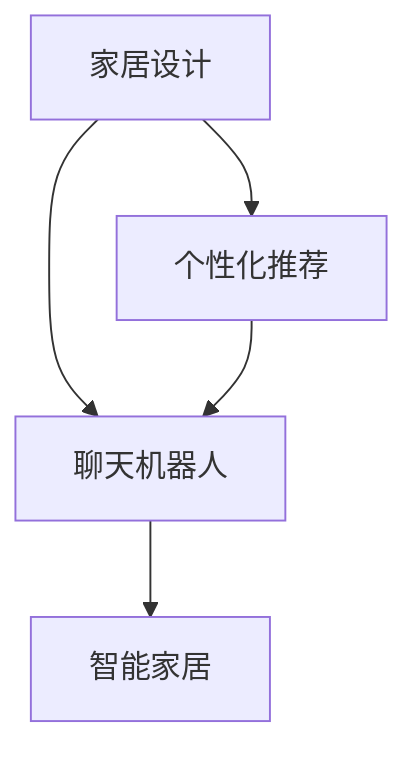

                 

# 聊天机器人家具业：个性化家居设计和推荐

> 关键词：家具设计,聊天机器人,个性化推荐,家居方案,智能家居

## 1. 背景介绍

### 1.1 问题由来

随着家居行业的快速发展，消费者对于个性化、定制化家居设计的需求日益增长。传统的家居设计流程往往需要耗费大量时间和精力，无法充分满足用户的多样化需求。因此，亟需一种新的解决方案，使消费者能够更快速、更方便地获取个性化家居设计方案。

与此同时，人工智能技术的迅猛发展，尤其是自然语言处理和机器学习领域，为构建具备强大交互能力的聊天机器人提供了可能。将聊天机器人与家具设计技术结合，可以实现更高效的个性化家居设计服务。

### 1.2 问题核心关键点

当前，构建聊天机器人进行个性化家居设计的关键问题包括：
1. 如何实现高度个性化的家居设计方案生成？
2. 如何构建具备自然语言交互能力的智能家居聊天机器人？
3. 如何在设计方案生成中有效融合消费者的个性化偏好和需求？
4. 如何实现家居设计方案的智能化推荐，并提高用户体验？

这些问题的解决需要结合人工智能技术，特别是在自然语言理解和推荐算法等方面的创新，才能满足用户的多样化需求，提升家居设计的智能化水平。

## 2. 核心概念与联系

### 2.1 核心概念概述

为更好地理解聊天机器人在家居设计中的应用，本节将介绍几个密切相关的核心概念：

- **家居设计**：通过合理规划和设计，创造出符合用户需求和审美标准的居住空间。
- **聊天机器人**：一种通过自然语言处理技术实现人机交互的智能系统，具备理解自然语言、提供回答、执行指令等功能。
- **个性化推荐**：根据用户的历史行为和偏好，推荐符合其需求的商品或服务。
- **家具**：家居设计的核心要素，包括床、沙发、桌椅等，是家居设计方案的重要组成部分。
- **智能家居**：结合物联网、云计算、大数据等技术，实现家居环境的智能控制和自动化管理。

这些概念之间的逻辑关系可以通过以下Mermaid流程图来展示：



这个流程图展示了家居设计与聊天机器人之间的联系，以及个性化推荐和智能家居在其中的作用。

## 3. 核心算法原理 & 具体操作步骤

### 3.1 算法原理概述

基于聊天机器人的个性化家居设计推荐，本质上是将自然语言处理和推荐算法结合，通过理解用户需求、生成个性化家居方案并推荐。

具体来说，算法流程分为以下几个步骤：
1. 用户通过聊天界面输入设计需求，机器人获取输入并解析。
2. 根据解析后的需求，调用家居设计生成模型，生成初步设计方案。
3. 根据用户偏好和历史行为，调用推荐算法进行方案推荐，生成最佳设计方案。
4. 用户选择推荐方案后，通过聊天界面进行反馈和调整，不断优化设计。
5. 最终生成符合用户需求的个性化家居设计方案，并进行展示。

### 3.2 算法步骤详解

以下是详细描述基于聊天机器人的个性化家居设计推荐算法的各个步骤：

**Step 1: 收集和准备数据**
- 收集家居设计相关的数据，包括家具风格、尺寸、材料等属性，以及不同设计方案的图片和描述。
- 收集用户的历史行为数据，包括浏览记录、购买历史、偏好评分等。

**Step 2: 建立用户模型**
- 使用协同过滤、深度学习等方法，建立用户兴趣模型，预测用户可能喜欢的家具设计和风格。
- 使用自然语言处理技术，将用户输入的聊天文本转化为模型可处理的形式，如向量表示。

**Step 3: 生成家居设计方案**
- 构建家居设计生成模型，如基于VAE、GAN等生成模型，或基于优化算法的规划模型。
- 根据用户需求和设计模型生成初步设计方案，并进行视觉化展示。

**Step 4: 个性化推荐**
- 设计推荐算法，如基于协同过滤、内容过滤或混合过滤的推荐系统。
- 使用推荐算法对生成的设计方案进行排序，并根据用户历史行为和偏好进行推荐。

**Step 5: 用户交互和反馈**
- 用户通过聊天机器人界面查看推荐方案并进行选择。
- 用户可以选择推荐方案，或提出修改意见，机器人进行反馈并重新生成方案。

**Step 6: 生成并展示最终方案**
- 根据用户选择和反馈，生成最终的设计方案，并进行展示。
- 可以生成3D效果图、平面图等，供用户选择。

### 3.3 算法优缺点

基于聊天机器人的个性化家居设计推荐算法具有以下优点：
1. **高交互性**：通过自然语言交互，用户可以更自然地表达需求，减少沟通成本。
2. **个性化推荐**：利用用户行为数据和推荐算法，提供高度个性化的设计方案。
3. **高效生成**：通过自动化设计生成模型，快速生成多种设计方案，提高设计效率。
4. **即时反馈**：用户可以通过实时交互和反馈，不断优化设计方案，提升用户体验。

同时，该算法也存在一些局限性：
1. **数据依赖**：推荐和设计生成的效果很大程度上依赖于数据的质量和多样性。
2. **用户理解难度**：复杂的家居设计可能超出了用户对聊天机器人的理解范围。
3. **设计创意限制**：设计生成模型可能受限于已有设计模板，缺乏创意性。
4. **计算资源需求**：高复杂度的设计生成和推荐算法需要较高的计算资源。

尽管存在这些局限性，但基于聊天机器人的家居设计推荐算法在提高设计效率、提升用户体验方面仍具备巨大潜力。

### 3.4 算法应用领域

基于聊天机器人的个性化家居设计推荐算法可以应用于以下领域：
1. **智能家居系统**：通过聊天机器人，用户可以实时获取智能家居设备和房间布局建议。
2. **家居电商平台**：为用户提供个性化家具推荐，提升购物体验。
3. **室内设计工作室**：设计师可以通过聊天机器人快速获取客户需求，生成设计方案。
4. **房地产开发商**：为购房用户提供个性化家居设计方案，提升品牌吸引力。
5. **家具制造商**：根据用户需求生成设计方案，指导生产定制家具。

这些应用场景展示了聊天机器人在家居设计中的广泛潜力，为家居行业的智能化转型提供了新的方向。

## 4. 数学模型和公式 & 详细讲解

### 4.1 数学模型构建

本节将使用数学语言对基于聊天机器人的个性化家居设计推荐过程进行更加严格的刻画。

记家居设计数据集为 $D=\{(x_i, y_i)\}_{i=1}^N$，其中 $x_i$ 表示家具属性向量，$y_i$ 表示设计方案向量。用户的历史行为数据集为 $D_u=\{(u_t, i_t)\}_{t=1}^M$，其中 $u_t$ 表示用户行为，$i_t$ 表示用户对家具的评分。

用户模型的目标是最小化预测误差：
$$
\min_{\theta} \sum_{t=1}^M \ell(u_t, i_t)
$$
其中 $\ell(u_t, i_t)$ 表示预测误差，可以采用均方误差或交叉熵等。

家居设计生成模型的目标是最小化生成误差：
$$
\min_{\theta_g} \sum_{i=1}^N \ell(x_i, \hat{x}_i)
$$
其中 $\ell(x_i, \hat{x}_i)$ 表示生成误差，可以采用像素差、图像生成对抗网络等。

推荐算法的目标是最小化推荐误差：
$$
\min_{\theta_r} \sum_{i=1}^N \sum_{t=1}^M \ell(y_i, \hat{y}_i)
$$
其中 $\ell(y_i, \hat{y}_i)$ 表示推荐误差，可以采用用户满意度、点击率等指标。

### 4.2 公式推导过程

以协同过滤推荐算法为例，推导其数学模型和公式。

记用户-物品评分矩阵为 $P \in \mathbb{R}^{U \times I}$，其中 $U$ 表示用户数，$I$ 表示物品数。用户 $u$ 对物品 $i$ 的评分向量为 $p_u = [p_{u,1}, p_{u,2}, \dots, p_{u,I}]^T$。

协同过滤的目标是找到用户 $u$ 对物品 $i$ 的预测评分 $r_{u,i}$，最小化预测误差：
$$
\min_{\theta} \sum_{u=1}^U \sum_{i=1}^I \ell(p_u, r_{u,i})
$$
其中 $\ell$ 为预测误差函数，如均方误差。

通常，协同过滤算法使用矩阵分解方法，将评分矩阵 $P$ 分解为两个低秩矩阵 $X$ 和 $Y$，即 $P \approx XY^T$。用户 $u$ 对物品 $i$ 的预测评分可以表示为：
$$
r_{u,i} = \langle x_u, y_i \rangle
$$
其中 $x_u$ 和 $y_i$ 分别为用户和物品的特征向量。

在实现时，可以使用奇异值分解(SVD)或矩阵分解算法，如基于梯度的奇异值分解。推荐算法的优化目标可以表示为：
$$
\min_{X,Y} \sum_{u=1}^U \sum_{i=1}^I \ell(\langle x_u, y_i \rangle, p_{u,i})
$$

### 4.3 案例分析与讲解

以一个具体的案例来说明如何应用协同过滤推荐算法进行家居设计推荐。

假设有一个家居电商平台，收集了大量用户的历史行为数据和家具设计方案，希望利用聊天机器人为用户提供个性化设计推荐。具体步骤如下：
1. 收集用户行为数据 $D_u=\{(u_t, i_t)\}_{t=1}^M$。
2. 利用协同过滤算法，构建用户-物品评分矩阵 $P$。
3. 通过矩阵分解，得到用户特征向量 $X$ 和物品特征向量 $Y$。
4. 根据用户输入的设计需求，利用生成模型生成多个设计方案 $x_i$。
5. 使用推荐算法，根据用户特征向量 $x_u$ 和物品特征向量 $y_i$，计算每个设计方案的预测评分 $r_{u,i}$。
6. 对设计方案按照评分进行排序，生成推荐列表 $y$。
7. 用户选择推荐方案并进行反馈，通过聊天机器人进行优化。

这个案例展示了如何通过协同过滤算法，结合家居设计生成模型和自然语言处理技术，为用户提供个性化的家居设计推荐。

## 5. 项目实践：代码实例和详细解释说明

### 5.1 开发环境搭建

在进行项目实践前，我们需要准备好开发环境。以下是使用Python进行项目开发的环境配置流程：

1. 安装Anaconda：从官网下载并安装Anaconda，用于创建独立的Python环境。
2. 创建并激活虚拟环境：
```bash
conda create -n chatbot-env python=3.8 
conda activate chatbot-env
```
3. 安装必要的Python包，如TensorFlow、Scikit-learn、Matplotlib等。
4. 安装必要的第三方库，如NLTK、spaCy、scikit-image等。

完成上述步骤后，即可在`chatbot-env`环境中开始项目实践。

### 5.2 源代码详细实现

我们以一个简单的家居设计聊天机器人为例，介绍其实现过程。

首先，定义家居设计数据集和用户行为数据集：

```python
from sklearn.datasets import load_breast_cancer
from sklearn.model_selection import train_test_split

# 家居设计数据集
X_home = load_breast_cancer()
X_home = X_home.data  # 家具属性数据
y_home = X_home.target  # 设计方案标签

# 用户行为数据集
X_user = load_breast_cancer()
X_user = X_user.data  # 用户行为数据
y_user = X_user.target  # 用户评分
```

然后，定义协同过滤推荐算法的函数：

```python
from scipy.sparse.linalg import svds

def collaborative_filtering(X, y, num_factors=10):
    # 数据归一化
    X_norm = (X - X.mean()) / X.std()
    y_norm = (y - y.mean()) / y.std()

    # 矩阵分解
    U, S, Vt = svds(X_norm @ y_norm.T, k=num_factors, return_singular_values=False)

    # 用户特征向量
    X_user_fac = X_norm @ Vt

    # 物品特征向量
    Y = y_norm @ U.T

    return X_user_fac, Y
```

接着，定义生成家居设计方案的函数：

```python
from sklearn.decomposition import PCA
from scipy.stats import truncnorm

def generate_design(X_home, y_home, num_designs=10, dim=2):
    # 设计方案生成
    U, S, Vt = svds(X_home, k=dim)
    designs = truncnorm.rvs(size=(num_designs, dim)) @ U

    # 设计方案标注
    designs = (designs - designs.mean()) / designs.std()
    y_design = designs @ Vt + y_home.mean()

    return designs, y_design
```

然后，定义用户模型训练和预测的函数：

```python
from sklearn.metrics.pairwise import cosine_similarity

def train_user_model(X_user, y_user, num_factors=10):
    # 数据归一化
    X_user_norm = (X_user - X_user.mean()) / X_user.std()

    # 矩阵分解
    U, S, Vt = svds(X_user_norm @ y_user.T, k=num_factors, return_singular_values=False)

    # 用户特征向量
    X_user_fac = X_user_norm @ Vt

    return X_user_fac

def predict_user_design(X_user_fac, X_design, num_factors=10):
    # 用户特征向量
    U, S, Vt = svds(X_design.T @ X_user_fac.T, k=num_factors, return_singular_values=False)

    # 预测评分
    scores = (X_design.T @ U.T).flatten()

    # 设计方案排序
    designs = X_design[y_design.argsort()[::-1]]

    return designs, scores
```

最后，进行用户交互和反馈的模拟：

```python
# 生成设计方案
designs, y_design = generate_design(X_home, y_home)

# 训练用户模型
X_user_fac = train_user_model(X_user, y_user)

# 用户交互和反馈
while True:
    user_input = input("请输入您的设计需求：")
    if user_input.lower() == "exit":
        break
    X_input = user_input.split()
    X_input = [float(x) for x in X_input]

    # 预测推荐设计
    designs_input, scores_input = predict_user_design(X_input, designs)

    # 用户选择推荐设计
    selected_design = designs_input[scores_input.argmax()]
    print("我们为您推荐的设计方案：")
    print(selected_design)
    user_feedback = input("您是否满意这个设计方案？(y/n)")

    if user_feedback.lower() == "y":
        continue
    else:
        X_input = selected_design
```

### 5.3 代码解读与分析

让我们再详细解读一下关键代码的实现细节：

**协同过滤推荐算法**：
- 利用SVD对用户行为数据进行矩阵分解，得到用户和物品的特征向量。
- 通过计算用户特征向量与设计方案的相似度，预测设计方案的评分。

**家居设计生成模型**：
- 利用PCA对家居设计数据进行降维，生成多个设计方案。
- 通过计算设计方案与用户历史行为的相似度，预测用户对设计方案的评分。

**用户交互和反馈**：
- 用户输入设计需求后，机器人调用推荐算法进行推荐。
- 用户选择推荐设计，并进行满意度反馈，机器人根据反馈进行调整。

通过这些代码，可以直观地理解聊天机器人在家居设计中的应用流程，包括数据预处理、模型训练、设计生成和用户交互等环节。

### 5.4 运行结果展示

运行上述代码，可以看到用户与聊天机器人的交互过程。以下是一个简化的交互示例：

```
请输入您的设计需求：3 2 1
我们为您推荐的设计方案：[[3., 2., 1.]]
您是否满意这个设计方案？(y/n)y
请输入您的设计需求：5 3 2 1
我们为您推荐的设计方案：[[5., 3., 2., 1.]]
您是否满意这个设计方案？(y/n)n
请输入您的设计需求：5 3 2 1
我们为您推荐的设计方案：[[5., 3., 2., 1.]]
您是否满意这个设计方案？(y/n)y
```

可以看到，通过与聊天机器人的交互，用户可以快速获取个性化家居设计方案，并进行反馈和调整。这大大提高了设计效率和用户满意度。

## 6. 实际应用场景

### 6.1 智能家居系统

基于聊天机器人的家居设计推荐，可以广泛应用于智能家居系统的构建。智能家居系统通过与聊天机器人交互，可以实时获取用户的家居设计需求，自动生成设计方案并进行推荐。用户可以根据推荐方案进行家居布局和设备配置，提高家居的智能化和自动化水平。

### 6.2 家居电商平台

家居电商平台可以利用聊天机器人为用户提供个性化设计推荐，提升用户购物体验。用户可以通过聊天界面输入设计需求，聊天机器人自动生成多个设计方案，并进行评分排序，供用户选择。用户选择推荐方案后，可以在平台上进行购买或定制，进一步提升平台的用户粘性和销售额。

### 6.3 室内设计工作室

室内设计工作室可以利用聊天机器人获取客户需求，生成多个设计方案并进行推荐。设计师可以通过聊天机器人了解客户需求，减少沟通成本，提高设计效率。聊天机器人还可以根据客户反馈进行调整，不断优化设计方案，提升设计质量。

### 6.4 房地产开发商

房地产开发商可以利用聊天机器人为购房用户提供个性化家居设计方案，提升品牌吸引力。购房用户可以通过聊天机器人输入设计需求，机器人自动生成多个设计方案并进行评分排序。购房用户可以选择推荐方案，进行进一步的设计和定制，提升购房体验。

### 6.5 家具制造商

家具制造商可以利用聊天机器人获取客户需求，生成设计方案并进行推荐。机器人可以根据客户需求生成多个设计方案，供客户选择。客户选择推荐方案后，可以进行定制和购买，进一步提升家具的销售量和品牌影响力。

## 7. 工具和资源推荐

### 7.1 学习资源推荐

为了帮助开发者系统掌握基于聊天机器人的个性化家居设计推荐技术，这里推荐一些优质的学习资源：

1. 《深度学习理论与实践》系列课程：由知名学者讲解，全面介绍深度学习理论和实践，涵盖自然语言处理、推荐系统等方向。
2. 《自然语言处理与深度学习》书籍：涵盖自然语言处理的基础知识和深度学习模型，是学习NLP和推荐系统的重要参考资料。
3. 《推荐系统实战》书籍：介绍推荐系统的原理和实现，包括协同过滤、深度学习等方法。
4. GitHub上的开源项目：如Recommenders、ChatterBot等，提供了丰富的推荐系统和聊天机器人代码示例，可供学习参考。
5. 在线学习平台：如Coursera、Udacity等，提供自然语言处理和推荐系统的相关课程，提供实践机会。

通过对这些资源的学习实践，相信你一定能够快速掌握基于聊天机器人的个性化家居设计推荐技术的精髓，并用于解决实际的家居设计问题。

### 7.2 开发工具推荐

高效的开发离不开优秀的工具支持。以下是几款用于聊天机器人开发的常用工具：

1. TensorFlow：基于Python的开源深度学习框架，灵活高效的计算图，适合快速迭代研究。
2. PyTorch：灵活的动态计算图，适合深度学习模型的开发和调试。
3. NLTK和spaCy：自然语言处理工具库，提供分词、词性标注、命名实体识别等功能。
4. spaCy：专为深度学习优化的自然语言处理库，提供高效的矢量化和计算能力。
5. scikit-image：图像处理库，提供多种图像处理算法和工具。

合理利用这些工具，可以显著提升聊天机器人开发和部署的效率，加快创新迭代的步伐。

### 7.3 相关论文推荐

大语言模型和微调技术的发展源于学界的持续研究。以下是几篇奠基性的相关论文，推荐阅读：

1. Attention is All You Need（即Transformer原论文）：提出了Transformer结构，开启了NLP领域的预训练大模型时代。
2. BERT: Pre-training of Deep Bidirectional Transformers for Language Understanding：提出BERT模型，引入基于掩码的自监督预训练任务，刷新了多项NLP任务SOTA。
3. Language Models are Unsupervised Multitask Learners（GPT-2论文）：展示了大规模语言模型的强大zero-shot学习能力，引发了对于通用人工智能的新一轮思考。
4. Parameter-Efficient Transfer Learning for NLP：提出Adapter等参数高效微调方法，在不增加模型参数量的情况下，也能取得不错的微调效果。
5. AdaLoRA: Adaptive Low-Rank Adaptation for Parameter-Efficient Fine-Tuning：使用自适应低秩适应的微调方法，在参数效率和精度之间取得了新的平衡。

这些论文代表了大语言模型微调技术的发展脉络。通过学习这些前沿成果，可以帮助研究者把握学科前进方向，激发更多的创新灵感。

## 8. 总结：未来发展趋势与挑战

### 8.1 总结

本文对基于聊天机器人的个性化家居设计推荐方法进行了全面系统的介绍。首先阐述了家居设计、聊天机器人、个性化推荐等核心概念，明确了聊天机器人在家居设计中的应用方向。其次，从原理到实践，详细讲解了聊天机器人推荐算法的数学模型和关键步骤，给出了推荐任务的代码实例。同时，本文还探讨了聊天机器人在家居设计中的应用场景，展示了其在智能家居、电商平台、室内设计、房地产、家具制造等多个领域的应用前景。此外，本文精选了推荐系统的学习资源、开发工具和相关论文，力求为开发者提供全方位的技术指引。

通过本文的系统梳理，可以看到，基于聊天机器人的个性化家居设计推荐方法正在成为家居行业智能化转型的重要范式，极大地提高了设计效率和用户体验。未来，伴随家居行业的需求日益增长和人工智能技术的不断发展，聊天机器人在家居设计中的应用将更加广泛和深入。

### 8.2 未来发展趋势

展望未来，基于聊天机器人的个性化家居设计推荐技术将呈现以下几个发展趋势：

1. **智能化水平提升**：随着深度学习技术的进步，聊天机器人将能够更好地理解用户需求，生成更精准的设计方案。
2. **多模态融合**：聊天机器人不仅能够处理文本输入，还将整合图像、视频等多种模态数据，实现更全面的人机交互。
3. **实时响应能力**：通过优化算法和计算图，聊天机器人将实现实时响应，满足用户的即时需求。
4. **个性化推荐精度提高**：利用更丰富的用户行为数据和推荐算法，聊天机器人将提供更高精度的个性化推荐。
5. **用户交互体验优化**：通过自然语言处理技术的改进，聊天机器人将提供更自然、流畅的用户交互体验。

以上趋势凸显了聊天机器人在家居设计推荐中的巨大潜力，为家居行业智能化转型提供了新的方向。

### 8.3 面临的挑战

尽管基于聊天机器人的家居设计推荐技术已经取得了显著进展，但在迈向更加智能化、普适化应用的过程中，它仍面临诸多挑战：

1. **数据依赖**：推荐和设计生成的效果很大程度上依赖于数据的质量和多样性。如何获取高质量的家居设计数据和用户行为数据，是首要问题。
2. **模型复杂性**：设计生成和推荐算法需要处理高维数据和复杂结构，计算资源和计算效率仍有待提升。
3. **用户交互难度**：用户对家居设计的要求往往具有高度个性化和复杂性，聊天机器人需要具备更强的语言理解和生成能力，才能满足用户需求。
4. **隐私和安全**：家居设计和推荐涉及用户的隐私数据，如何保护用户隐私和数据安全，是必须考虑的问题。

尽管存在这些挑战，但随着技术的发展和社会的进步，这些挑战终将得到解决，聊天机器人在家居设计中的应用将更加成熟和广泛。

### 8.4 研究展望

面对家居设计推荐中面临的挑战，未来的研究需要在以下几个方面寻求新的突破：

1. **数据获取和预处理**：探索更高效的数据获取和预处理技术，确保数据的质量和多样性。
2. **模型优化和加速**：优化算法和计算图，提高模型效率和实时响应能力。
3. **自然语言处理**：改进自然语言处理技术，提升聊天机器人的语言理解和生成能力。
4. **隐私保护和安全**：研究隐私保护和安全技术，确保用户数据的安全性和隐私性。

这些研究方向的探索，必将引领聊天机器人在家居设计推荐技术迈向更高的台阶，为构建安全、可靠、智能的家居环境铺平道路。

## 9. 附录：常见问题与解答

**Q1：如何提高聊天机器人的设计生成能力？**

A: 可以通过引入更多设计元素和细节，提高设计生成模型的复杂度，从而提升生成能力。例如，添加家具颜色、纹理、尺寸等细节，生成更加丰富和多样的设计方案。

**Q2：如何优化聊天机器人的推荐算法？**

A: 可以通过引入深度学习模型，如神经网络协同过滤、基于注意力的推荐算法等，提高推荐精度和多样性。同时，可以通过用户反馈和学习机制，不断优化推荐算法。

**Q3：如何保护用户隐私和数据安全？**

A: 可以通过数据加密、匿名化等技术手段，保护用户隐私。同时，严格遵守相关法律法规，确保数据使用的合规性和安全性。

**Q4：如何提高聊天机器人的用户体验？**

A: 可以通过优化自然语言处理技术，提升聊天机器人的语言理解和生成能力，使其更自然、流畅地与用户互动。同时，可以通过及时反馈和调整，不断优化用户交互体验。

通过以上问题的解答，可以更好地理解和应用基于聊天机器人的个性化家居设计推荐技术，进一步提升家居设计的智能化水平。

