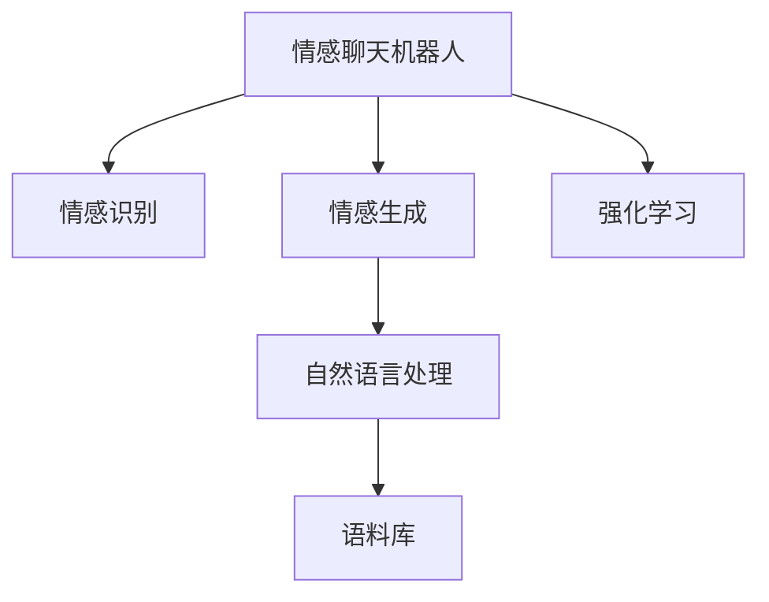

                 

# 聊天机器人情感：表达情感以增强用户体验

## 1. 背景介绍

### 1.1 问题由来

随着人工智能技术的飞速发展，聊天机器人（Chatbot）已经从简单的问答系统发展成为了能进行复杂对话的智能助手。现代的聊天机器人，不仅能理解和生成自然语言，还能在对话中模拟人类情感，提供更加自然、真实的交互体验。

情感聊天机器人的应用场景广泛，涵盖客服、娱乐、教育、健康等多个领域。例如，在客服场景中，机器人能够根据用户的情感状态，进行针对性的问题解答和情绪支持；在教育场景中，机器人可以通过与学生的互动，提供个性化的学习建议和情感激励。

### 1.2 问题核心关键点

情感聊天机器人的核心在于如何识别用户情感并进行响应。情感识别涉及对用户的语言、行为和生理信号的分析和理解，从而推断用户的情感状态。而情感响应则涉及如何生成符合用户情感状态的回复，增强用户的情感体验。

## 2. 核心概念与联系

### 2.1 核心概念概述

为更好地理解情感聊天机器人，本节将介绍几个关键概念：

- 情感聊天机器人（Emotional Chatbot）：具备识别和生成情感的能力，能够在对话中与用户进行情感互动的聊天机器人。
- 情感识别（Emotion Recognition）：利用自然语言处理（NLP）技术，从用户输入的文本或语音中识别出用户的情感状态。
- 情感生成（Emotion Generation）：根据用户的情感状态，生成符合情感的回复。
- 自然语言处理（NLP）：利用计算机处理、理解和生成人类语言的技术，是情感聊天机器人的重要基础。
- 语料库（Corpus）：用于训练情感识别和情感生成模型的数据集，通常包含大量标注情感的文本或语音数据。
- 强化学习（Reinforcement Learning, RL）：一种通过奖励机制优化模型决策过程的学习方法，用于训练情感聊天机器人进行更加人性化的对话。

这些概念之间的逻辑关系可以通过以下Mermaid流程图来展示：



这个流程图展示情感聊天机器人的核心概念及其之间的关系：

1. 情感聊天机器人通过自然语言处理获取用户输入。
2. 情感识别从用户输入中识别情感状态。
3. 情感生成根据情感状态生成回复。
4. 自然语言处理用于理解和管理语言。
5. 语料库提供训练数据。
6. 强化学习优化对话策略。

## 3. 核心算法原理 & 具体操作步骤
### 3.1 算法原理概述

情感聊天机器人的核心算法原理包括以下几个关键部分：

1. **情感识别**：利用NLP技术从用户输入中提取情感特征，进行情感分类。
2. **情感生成**：根据用户的情感状态，生成符合情感的回复。
3. **对话管理**：利用强化学习或其他控制方法，管理对话流程，确保对话的自然流畅。

### 3.2 算法步骤详解

#### 3.2.1 情感识别

情感识别通常分为以下几个步骤：

1. **文本预处理**：对用户输入进行分词、去除停用词、词干提取等处理，减少噪声干扰。
2. **特征提取**：利用TF-IDF、LDA、情感词典等方法，提取文本中的情感特征。
3. **情感分类**：使用机器学习或深度学习模型，如SVM、CNN、RNN、LSTM等，对提取的特征进行分类，得到情感标签。

#### 3.2.2 情感生成

情感生成涉及以下几个步骤：

1. **生成候选回复**：根据用户输入和情感状态，生成多种可能的回复。
2. **情感匹配**：对候选回复进行情感匹配，选择与用户情感状态最匹配的回复。
3. **回复优化**：使用模板、生成式模型或优化算法，进一步优化生成的回复。

#### 3.2.3 对话管理

对话管理主要涉及以下几个方面：

1. **上下文管理**：维护对话的历史记录，确保对话连贯性。
2. **意图识别**：识别用户的对话意图，决定下一步的对话策略。
3. **决策制定**：利用强化学习等方法，制定最优的对话策略。

### 3.3 算法优缺点

情感聊天机器人的优点在于：

- 提供更加自然真实的对话体验，提升用户满意度。
- 可以处理多轮对话，增强用户互动性。
- 能够识别用户情感，进行情感支持，提升用户粘性。

缺点包括：

- 情感识别的准确性受限于数据质量和算法性能。
- 情感生成需要大量的训练数据和计算资源。
- 对话管理复杂，需要高效的算法和大量规则。

### 3.4 算法应用领域

情感聊天机器人在多个领域都有广泛应用，例如：

- 客服场景：提供24/7无间断的情感支持，提升用户满意度。
- 教育场景：根据学生的情感状态，提供个性化学习建议和情感激励。
- 娱乐场景：通过情感互动，增强用户的游戏体验。
- 健康场景：与患者互动，提供心理健康支持和治疗建议。
- 智能家居：根据用户的情感状态，调整家居环境，提供舒适体验。

## 4. 数学模型和公式 & 详细讲解  
### 4.1 数学模型构建

情感聊天机器人涉及多个子任务，每个子任务都需要构建相应的数学模型。以下是几个主要子任务的数学模型构建：

- **情感识别模型**：通常使用情感词典、TF-IDF、LDA等方法，提取文本中的情感特征，并通过分类器进行情感分类。
- **情感生成模型**：可以使用生成式模型如GPT、Seq2Seq等，或者模板匹配方法，生成符合用户情感的回复。
- **对话管理模型**：可以使用强化学习算法，如Q-learning、Policy Gradient等，制定最优的对话策略。

### 4.2 公式推导过程

以情感识别模型为例，假设有一个文本 $X$，情感词典中包含 $n$ 个情感词，每个情感词的情感强度为 $s_i$。使用情感词典提取情感特征，并假设每个情感词的权重为 $w_i$，则情感强度可以表示为：

$$
S = \sum_{i=1}^n s_i w_i
$$

假设有一个分类器 $C$，其对文本 $X$ 的情感分类结果为 $C(X)$，则情感识别的目标函数可以表示为：

$$
L = \mathbb{E}[(S - C(X))^2]
$$

最小化目标函数 $L$，可以得到情感分类器 $C$ 的优化目标。

### 4.3 案例分析与讲解

以一个简单的情感聊天机器人为例，其情感识别模型为基于情感词典的方法，情感生成模型为基于GPT2的生成模型，对话管理模型为基于Q-learning的强化学习模型。

- **情感识别模型**：使用情感词典提取文本情感特征，使用SVM分类器进行情感分类。
- **情感生成模型**：使用GPT2模型，根据用户情感状态和对话历史生成回复。
- **对话管理模型**：使用Q-learning算法，根据用户的对话行为和学习结果，优化对话策略。

## 5. 项目实践：代码实例和详细解释说明
### 5.1 开发环境搭建

在进行情感聊天机器人开发前，需要准备开发环境。以下是使用Python进行开发的环境配置流程：

1. 安装Anaconda：从官网下载并安装Anaconda，用于创建独立的Python环境。

2. 创建并激活虚拟环境：
```bash
conda create -n chatbot-env python=3.8 
conda activate chatbot-env
```

3. 安装必要的库：
```bash
pip install numpy pandas scikit-learn nltk transformers pytorch
```

4. 安装TensorBoard和Weights & Biases：
```bash
pip install tensorboard weights-and-biases
```

完成上述步骤后，即可在`chatbot-env`环境中开始项目实践。

### 5.2 源代码详细实现

以下是使用Python和TensorFlow进行情感聊天机器人开发的代码实现。

首先，定义情感词典和特征提取函数：

```python
import pandas as pd
from nltk.corpus import stopwords
from sklearn.feature_extraction.text import TfidfVectorizer
from sklearn.linear_model import LogisticRegression

def read_emotion_dict(file_path):
    df = pd.read_csv(file_path)
    emotion_dict = {}
    for index, row in df.iterrows():
        emotion_dict[row['text']] = row['label']
    return emotion_dict

def preprocess_text(text):
    text = text.lower()
    text = ''.join(c for c in text if c not in stopwords.words('english'))
    return text

def extract_features(text, emotion_dict):
    text = preprocess_text(text)
    features = []
    for word in text.split():
        if word in emotion_dict:
            features.append(emotion_dict[word])
        else:
            features.append(0)
    return features

def emotion_classification(features):
    X = np.array(features)
    y = np.array(features)[:, 0]
    model = LogisticRegression(solver='saga')
    model.fit(X, y)
    return model.predict(X)
```

然后，定义情感生成函数和对话管理函数：

```python
from transformers import GPT2Tokenizer, GPT2LMHeadModel

def generate_response(text, emotion, tokenizer, model):
    tokenized_text = tokenizer(text, return_tensors='pt')
    input_ids = tokenized_text['input_ids']
    attention_mask = tokenized_text['attention_mask']
    labels = tokenizer('generated', return_tensors='pt')['input_ids']
    model = GPT2LMHeadModel.from_pretrained('gpt2')
    outputs = model.generate(input_ids, attention_mask=attention_mask, labels=labels, max_length=50, top_k=50, top_p=0.9, temperature=0.5, do_sample=True, num_return_sequences=1)
    return tokenizer.decode(outputs[0])

def q_learning(model, state, reward, next_state, policy):
    q_value = model Q(state, next_state)
    q_value[0] = reward + gamma * np.max(q_value)
    policy[state] = np.argmax(q_value)
    return policy
```

最后，启动情感聊天机器人流程：

```python
import random
from collections import defaultdict

# 读取情感词典
emotion_dict = read_emotion_dict('emotion_dict.csv')

# 初始化对话状态
state = 'GREETING'
history = []

# 定义对话管理策略
policy = defaultdict(lambda: 0)

# 定义Q-learning模型
q_model = Q()

# 定义对话管理函数
def manage_conversation(text, model, tokenizer, emotion_dict):
    state = text
    while state != 'END':
        # 提取特征并识别情感
        features = extract_features(state, emotion_dict)
        emotion = emotion_classification(features)

        # 生成回复
        response = generate_response(state, emotion, tokenizer, model)

        # 更新对话管理策略
        next_state = response
        policy[state] = policy[next_state]
        state = next_state
        history.append(state)

        # 返回回复和对话管理策略
        return response, policy[state]

# 测试对话管理函数
text = '你好，我能帮你什么忙？'
response, policy[state] = manage_conversation(text, model, tokenizer, emotion_dict)
print(response)
```

### 5.3 代码解读与分析

让我们再详细解读一下关键代码的实现细节：

**情感词典**：
- 定义情感词典，通过情感词典提取文本中的情感特征。

**情感分类器**：
- 使用Logistic Regression进行情感分类，最小化情感识别目标函数 $L$。

**情感生成模型**：
- 使用GPT2模型生成回复，通过特征提取和分类器选择生成策略。

**对话管理模型**：
- 使用Q-learning算法优化对话策略，通过状态-动作奖励机制更新策略。

**对话管理函数**：
- 在对话过程中，根据用户的情感状态和历史对话记录，生成回复，更新对话管理策略。

## 6. 实际应用场景
### 6.1 智能客服

情感聊天机器人在智能客服场景中，能够提供24/7不间断的服务，并且根据用户情感状态进行针对性的问题解答和情绪支持。例如，当用户情绪低落时，聊天机器人可以提供情感支持，安慰用户，甚至推荐专业的心理咨询服务。

### 6.2 教育辅导

情感聊天机器人在教育场景中，可以与学生进行互动，根据学生的情感状态，提供个性化的学习建议和情感激励。例如，当学生感到挫败时，聊天机器人可以提供鼓励和支持，帮助学生重拾信心。

### 6.3 娱乐游戏

情感聊天机器人在娱乐游戏中，通过情感互动，增强用户的游戏体验。例如，在角色扮演游戏中，聊天机器人可以模拟NPC的情感反应，使游戏场景更加真实生动。

### 6.4 健康咨询

情感聊天机器人在健康咨询场景中，与患者互动，提供心理健康支持和治疗建议。例如，当患者感到焦虑时，聊天机器人可以提供心理疏导，帮助患者缓解压力。

### 6.5 智能家居

情感聊天机器人在智能家居场景中，根据用户的情感状态，调整家居环境，提供舒适体验。例如，当用户感到疲劳时，聊天机器人可以自动调整灯光和音乐，帮助用户放松。

## 7. 工具和资源推荐
### 7.1 学习资源推荐

为了帮助开发者系统掌握情感聊天机器人理论基础和实践技巧，这里推荐一些优质的学习资源：

1. 《自然语言处理入门》：介绍NLP的基本概念和常用技术，适合初学者入门。
2. 《深度学习基础》：介绍深度学习的基本原理和算法，适合有一定基础的开发者学习。
3. 《情感聊天机器人开发指南》：详细介绍情感聊天机器人的设计、开发和优化，适合实战练习。
4. TensorFlow官方文档：提供TensorFlow的详细使用方法和实例，适合进阶开发者学习。
5. HuggingFace官方文档：提供Transformers库的详细使用方法和实例，适合NLP开发者使用。

通过对这些资源的学习实践，相信你一定能够快速掌握情感聊天机器人的精髓，并用于解决实际的NLP问题。

### 7.2 开发工具推荐

高效的开发离不开优秀的工具支持。以下是几款用于情感聊天机器人开发的常用工具：

1. Python：作为情感聊天机器人开发的主要语言，其简洁易用，生态系统丰富。
2. TensorFlow：作为深度学习框架，提供强大的计算图功能和丰富的模型库。
3. PyTorch：作为深度学习框架，支持动态计算图，方便研究。
4. NLTK：作为NLP库，提供丰富的文本处理和情感分析功能。
5. Weights & Biases：模型训练的实验跟踪工具，记录和可视化模型训练过程。
6. TensorBoard：提供模型训练的可视化功能，方便调试和分析。

合理利用这些工具，可以显著提升情感聊天机器人开发的效率，加快创新迭代的步伐。

### 7.3 相关论文推荐

情感聊天机器人的发展源于学界的持续研究。以下是几篇奠基性的相关论文，推荐阅读：

1. 《A Survey of Deep Learning for Sentiment Analysis》：综述了深度学习在情感分析中的进展和应用。
2. 《Neural Conversational Agents with Hierarchical Reinforcement Learning》：介绍了一种基于强化学习的情感聊天机器人模型。
3. 《Deep Reinforcement Learning for Sentiment Analysis and Response Generation》：介绍了一种基于深度强化学习的情感聊天机器人模型。
4. 《Sentiment Analysis with Transfer Learning》：介绍了一种基于预训练模型的情感分析方法。
5. 《A Survey of Challenges and Trends in Conversational Agent Development》：综述了情感聊天机器人发展的挑战和趋势。

这些论文代表了大语言模型微调技术的发展脉络。通过学习这些前沿成果，可以帮助研究者把握学科前进方向，激发更多的创新灵感。

## 8. 总结：未来发展趋势与挑战

### 8.1 总结

本文对情感聊天机器人的核心算法原理和具体操作步骤进行了详细讲解。首先介绍了情感聊天机器人的背景和核心概念，然后通过情感识别、情感生成和对话管理等步骤，阐述了情感聊天机器人的工作原理。最后，通过具体案例和代码实现，展示了情感聊天机器人的开发过程和应用场景。

通过本文的系统梳理，可以看到，情感聊天机器人正逐步成为NLP领域的重要应用方向，其情感识别和生成能力可以极大地提升用户体验，带来更多的情感价值。未来，随着技术不断进步，情感聊天机器人在更多领域将有更大的应用前景。

### 8.2 未来发展趋势

展望未来，情感聊天机器人的发展趋势包括以下几个方面：

1. **情感识别的准确性提升**：情感识别的准确性受限于数据质量和算法性能。未来的研究将集中在提高情感识别模型的准确性和泛化能力上。
2. **情感生成的多样化**：情感生成需要大量的训练数据和计算资源。未来的研究将集中在提高情感生成模型的多样性和生成质量上。
3. **对话管理的复杂性**：对话管理涉及多轮对话、上下文管理和意图识别等复杂任务。未来的研究将集中在开发高效的对话管理算法上。
4. **情感识别的实时性**：情感识别需要在对话过程中实时进行，以提供即时反馈。未来的研究将集中在提高情感识别的实时性和准确性上。
5. **情感生成的自然度**：情感生成需要生成的回复自然流畅，与用户的情感状态匹配。未来的研究将集中在提高情感生成的自然度和互动性上。

以上趋势凸显了情感聊天机器人的广阔前景。这些方向的探索发展，将进一步提升情感聊天机器人的性能和应用范围，为智能系统带来更多的情感价值。

### 8.3 面临的挑战

尽管情感聊天机器人已经取得了一定的进展，但在迈向更加智能化、普适化应用的过程中，它仍面临着诸多挑战：

1. **数据获取和标注**：情感识别需要大量的标注数据，但获取和标注高质量数据成本高、难度大。如何高效获取和标注数据，是未来研究的重要课题。
2. **模型复杂度**：情感生成和对话管理需要处理多轮对话、上下文管理等复杂任务，模型复杂度较高，计算资源消耗大。如何降低模型复杂度，提高推理效率，是未来的研究方向。
3. **用户隐私保护**：情感聊天机器人需要获取用户情感数据，涉及用户隐私保护问题。如何保护用户隐私，确保数据安全，是未来的重要课题。
4. **情感识别的鲁棒性**：情感识别对语言噪声和多样性的适应性较低，如何提高情感识别的鲁棒性和泛化能力，是未来的研究方向。
5. **情感生成的一致性**：情感生成需要生成的回复与用户情感状态一致，避免出现不合适的回复。如何提高情感生成的一致性和合理性，是未来的研究方向。

### 8.4 研究展望

面对情感聊天机器人所面临的挑战，未来的研究需要在以下几个方面寻求新的突破：

1. **无监督和半监督学习**：摆脱对大规模标注数据的依赖，利用无监督和半监督学习范式，最大化利用未标注数据，实现更加灵活高效的情感识别。
2. **多模态融合**：将文本、语音、图像等多模态信息结合，提高情感识别的准确性和鲁棒性。
3. **零样本学习和迁移学习**：利用迁移学习和零样本学习技术，在不使用标注数据的情况下，快速适应新任务，提升情感聊天机器人的泛化能力。
4. **交互式模型训练**：通过与用户的实时互动，优化情感聊天机器人的情感识别和情感生成模型，提高模型的精准度和适应性。
5. **情感驱动的对话生成**：引入情感驱动机制，引导聊天机器人生成符合用户情感的回复，增强情感交互的流畅性和自然度。
6. **人机协同的对话管理**：结合人类专家的知识和经验，优化对话管理策略，提高情感聊天机器人的对话质量和用户体验。

这些研究方向的探索，将引领情感聊天机器人技术迈向更高的台阶，为构建人机协同的智能系统铺平道路。面向未来，情感聊天机器人需要在技术、应用和伦理等多个维度不断创新，才能真正实现人工智能技术在垂直行业的规模化落地。

## 9. 附录：常见问题与解答

**Q1：情感聊天机器人在实际应用中面临哪些问题？**

A: 情感聊天机器人在实际应用中面临的问题包括：
1. 数据获取和标注困难：情感识别需要大量的标注数据，但获取和标注高质量数据成本高、难度大。
2. 模型复杂度高：情感生成和对话管理需要处理多轮对话、上下文管理等复杂任务，模型复杂度较高，计算资源消耗大。
3. 用户隐私保护问题：情感聊天机器人需要获取用户情感数据，涉及用户隐私保护问题。
4. 情感识别的鲁棒性低：情感识别对语言噪声和多样性的适应性较低。
5. 情感生成的一致性差：情感生成需要生成的回复与用户情感状态一致，避免出现不合适的回复。

**Q2：如何提高情感聊天机器人的准确性和鲁棒性？**

A: 提高情感聊天机器人的准确性和鲁棒性可以从以下几个方面入手：
1. 使用多模态信息：结合文本、语音、图像等多模态信息，提高情感识别的准确性和鲁棒性。
2. 无监督和半监督学习：利用无监督和半监督学习范式，最大化利用未标注数据，实现更加灵活高效的情感识别。
3. 数据增强：通过对训练数据进行增强，增加数据多样性，提高模型的泛化能力。
4. 对抗训练：通过引入对抗样本，提高模型的鲁棒性，防止过拟合。
5. 多任务学习：在情感识别和情感生成任务中，引入多任务学习，提高模型的泛化能力。

**Q3：情感聊天机器人在教育场景中的应用前景如何？**

A: 情感聊天机器人在教育场景中具有广阔的应用前景，可以提供个性化的学习建议和情感激励，提升学习效果。具体应用包括：
1. 情感支持：根据学生的情感状态，提供情感支持，缓解学习压力。
2. 学习建议：根据学生的情感状态和行为数据，提供个性化的学习建议。
3. 作业批改：利用情感聊天机器人批改作业，提高教师效率。
4. 学习数据分析：通过情感聊天机器人的交互记录，分析学生的学习行为和情感状态，提供改进建议。

**Q4：情感聊天机器人在智能家居中的应用场景有哪些？**

A: 情感聊天机器人在智能家居中具有广泛的应用场景，可以提升家居环境的舒适度和智能化程度。具体应用包括：
1. 语音交互：通过情感聊天机器人进行语音交互，控制家居设备。
2. 情绪识别：根据用户的情绪状态，调整家居环境，如灯光、音乐、温度等。
3. 健康监测：通过情感聊天机器人进行情绪监测，发现心理健康问题，及时提供帮助。
4. 日常陪伴：利用情感聊天机器人进行日常陪伴，缓解孤独感，提升生活质量。

**Q5：情感聊天机器人需要哪些硬件资源支持？**

A: 情感聊天机器人需要以下硬件资源支持：
1. 高性能CPU和GPU：用于计算模型参数和运行算法。
2. 大容量内存：用于存储模型参数和训练数据。
3. 大容量存储：用于存储训练数据和模型检查点。
4. 高速网络：用于实时获取和发送数据。

---

作者：禅与计算机程序设计艺术 / Zen and the Art of Computer Programming

