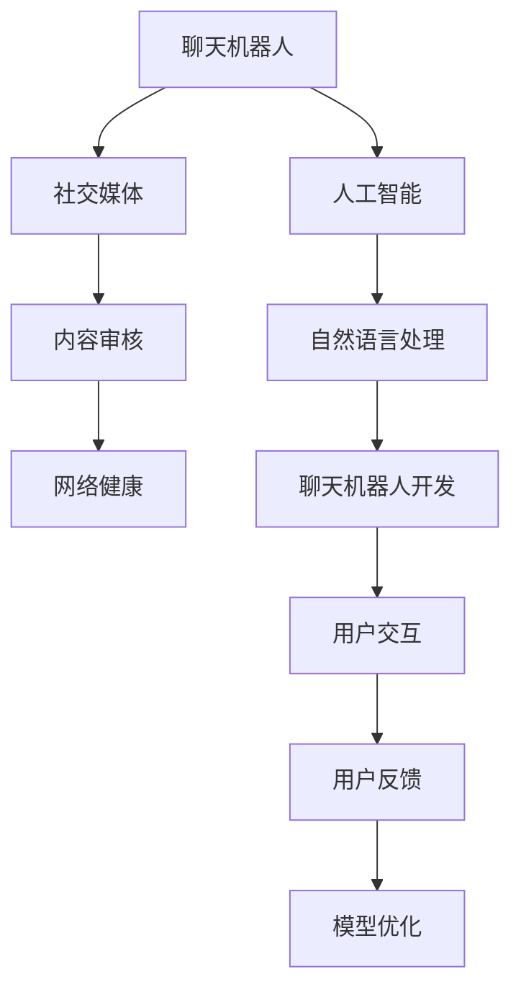

                 

# 聊天机器人社交媒体影响力：内容审核和网络健康

## 1. 背景介绍

随着互联网技术的飞速发展，社交媒体平台已成为人们日常生活和工作中不可或缺的一部分。据统计，全球社交媒体用户数量已超40亿，每天产生的数据量更是惊人。然而，这些数据中夹杂着大量低质量、虚假、有害的信息，对用户心智和社会环境产生了严重影响。

聊天机器人作为社交媒体的重要组成部分，通过自动化对话、提供即时反馈等功能，极大地提升了用户体验和互动效率。但与此同时，聊天机器人也成为信息传播的重要渠道，其内容质量直接影响着网络的健康程度和用户的认知安全。

因此，本文将聚焦于聊天机器人社交媒体影响力，深入探讨如何通过内容审核机制，净化网络环境，保障聊天机器人的健康发展和用户的信息安全。

## 2. 核心概念与联系

### 2.1 核心概念概述

为更好地理解聊天机器人社交媒体影响力及其内容审核机制，本节将介绍几个关键概念：

- 聊天机器人(Chatbot)：一种基于人工智能技术，能够通过自然语言理解(NLU)和生成(NLG)与人进行交流的计算机程序。
- 社交媒体(Social Media)：包括微博、微信、抖音等平台，允许用户创建个人资料、发布内容并与其他用户进行互动。
- 内容审核(Content Moderation)：指通过技术手段检测和处理用户上传内容，特别是有害信息，如虚假信息、违法内容、仇恨言论等。
- 网络健康(Network Well-being)：关注社交媒体中内容的健康程度，旨在打造一个积极、健康、和谐的网络环境。
- 人工智能(AI)：通过机器学习、深度学习等技术，让机器能够模拟人的思考和行为，从而实现复杂任务。

这些核心概念之间的逻辑关系可以通过以下Mermaid流程图来展示：



这个流程图展示了这个系统的主要组成部分及其逻辑关系：

1. 聊天机器人是社交媒体的组成部分，通过AI技术实现自然语言处理。
2. 内容审核机制对聊天机器人发布的内容进行筛选，保障网络健康。
3. 人工智能是聊天机器人的核心技术，特别是自然语言处理。
4. 通过用户交互和反馈，不断优化模型。

## 3. 核心算法原理 & 具体操作步骤
### 3.1 算法原理概述

聊天机器人社交媒体影响力下的内容审核，本质上是一个基于人工智能的自然语言处理(NLP)任务。其核心思想是通过机器学习算法，自动检测并过滤有害、虚假内容，从而净化网络环境。

### 3.2 算法步骤详解

基于人工智能的内容审核方法通常包括以下几个关键步骤：

**Step 1: 数据预处理**
- 收集社交媒体平台上的聊天记录，提取用户对话、表情、图片等数据。
- 对数据进行清洗，去除噪声和无用信息。
- 对对话进行分词、词性标注等预处理操作。

**Step 2: 模型训练**
- 选择适合的内容审核模型，如BERT、GPT等预训练模型，进行微调。
- 使用标注好的有害数据集，如Google Jigsaw的Toxic Comments、Toxic Dialogue等，进行训练。
- 通过交叉验证等方法评估模型性能，优化超参数。

**Step 3: 内容检测**
- 将新的聊天记录输入训练好的模型，计算每个句子或对话的有害度得分。
- 设定阈值，将得分高于阈值的聊天记录标记为有害内容。
- 根据标记结果进行过滤和删除。

**Step 4: 结果反馈**
- 统计被标记和过滤的有害内容数量，评估模型效果。
- 收集用户反馈，进一步优化模型和检测策略。

### 3.3 算法优缺点

基于人工智能的内容审核方法具有以下优点：
1. 高效自动化：通过自动化算法实现大规模内容检测，节省人力成本。
2. 持续优化：模型不断通过反馈优化，逐步提升检测准确性。
3. 可扩展性强：适用于多种社交媒体平台，扩展性较好。
4. 适应性强：能够处理多种类型的有害内容，如文本、图片、视频等。

同时，该方法也存在以下局限性：
1. 数据依赖性：模型依赖标注数据进行训练，数据标注成本较高。
2. 模型过拟合：模型容易在特定平台或特定内容上出现过拟合。
3. 误判风险：模型在处理边缘情况时可能存在误判，影响用户体验。
4. 透明性不足：模型内部决策过程难以解释，用户难以理解为何某些内容被标记或过滤。

尽管存在这些局限性，但就目前而言，基于人工智能的内容审核方法仍是最主流范式。未来相关研究的重点在于如何进一步降低数据标注成本，提高模型的泛化能力，同时兼顾模型的透明性和解释性。

### 3.4 算法应用领域

基于人工智能的内容审核方法，已经在社交媒体平台得到了广泛应用，覆盖了各类有害内容检测任务，例如：

- 虚假信息检测：检测和标记网络上的虚假、假新闻等信息。
- 仇恨言论过滤：识别并删除包含仇恨、歧视、辱骂等内容的对话。
- 暴力内容屏蔽：识别并屏蔽包含暴力、血腥等内容的图像、视频等。
- 隐私保护：识别并保护用户隐私信息，如姓名、地址、电话号码等。
- 广告检测：识别并过滤广告信息，避免对用户产生干扰。
- 垃圾信息屏蔽：识别并屏蔽垃圾信息，如机器人恶意攻击、恶意评论等。

除了上述这些经典任务外，内容审核技术还被创新性地应用到更多场景中，如舆情监测、平台治理等，为社交媒体平台的健康发展提供了重要保障。

## 4. 数学模型和公式 & 详细讲解 & 举例说明

### 4.1 数学模型构建

本节将使用数学语言对聊天机器人社交媒体影响力下的内容审核过程进行更加严格的刻画。

记社交媒体上的聊天记录为 $\mathcal{C}$，其中每个聊天记录 $\mathcal{C}_i$ 由用户对话、表情、图片等组成。定义 $\mathcal{H} \subset \mathcal{C}$ 为有害内容集合，$\mathcal{F} \subset \mathcal{C}$ 为过滤内容集合。内容审核的目标是最大化有害内容的检测率，最小化误判率。

数学上，内容审核模型的输入为 $\mathcal{C}_i$，输出为有害度得分 $s_i \in [0, 1]$。有害度得分越高，表示内容越有可能为有害内容。定义 $s_{\max} \in (0, 1)$ 为有害度得分的阈值，当 $s_i \geq s_{\max}$ 时，将 $\mathcal{C}_i$ 标记为有害内容，并加入 $\mathcal{F}$。

### 4.2 公式推导过程

为了构建内容审核模型，我们可以使用基于监督学习的算法，如分类器。假设模型 $M_{\theta}$ 为非线性函数，其输入为预处理后的聊天记录 $\mathcal{C}_i$，输出为有害度得分 $s_i$。则模型的训练目标为最小化损失函数：

$$
\min_{\theta} \mathcal{L} = \frac{1}{N} \sum_{i=1}^N \ell(s_i, y_i)
$$

其中 $N$ 为训练样本数，$\ell$ 为损失函数，$y_i$ 为标注好的有害度标签，$y_i = 1$ 表示为有害内容，$y_i = 0$ 表示为非有害内容。

常用的损失函数包括交叉熵损失、均方误差损失等。以交叉熵损失为例，损失函数为：

$$
\ell(s_i, y_i) = -y_i \log s_i - (1-y_i) \log (1-s_i)
$$

在得到损失函数后，通过反向传播算法求解参数 $\theta$，得到训练好的内容审核模型 $M_{\theta}$。

### 4.3 案例分析与讲解

假设我们有一个社交媒体平台，使用BERT模型进行有害内容检测。首先，我们收集了500个有害内容和500个正常内容的样本，进行标注。然后，我们将这1000个样本分为训练集和验证集，每个集分别包含500个样本。

我们使用BERT作为基础模型，在训练集上对其进行微调，得到有害度得分模型 $M_{\theta}$。在验证集上，我们计算模型的准确率、召回率和F1值，评估模型性能。最后，我们将模型应用到新的社交媒体数据上，计算有害度得分，设定阈值为0.7，标记为有害内容。

## 5. 项目实践：代码实例和详细解释说明
### 5.1 开发环境搭建

在进行聊天机器人社交媒体影响力下的内容审核实践前，我们需要准备好开发环境。以下是使用Python进行PyTorch开发的环境配置流程：

1. 安装Anaconda：从官网下载并安装Anaconda，用于创建独立的Python环境。

2. 创建并激活虚拟环境：
```bash
conda create -n chatbot-env python=3.8 
conda activate chatbot-env
```

3. 安装PyTorch：根据CUDA版本，从官网获取对应的安装命令。例如：
```bash
conda install pytorch torchvision torchaudio cudatoolkit=11.1 -c pytorch -c conda-forge
```

4. 安装Transformers库：
```bash
pip install transformers
```

5. 安装各类工具包：
```bash
pip install numpy pandas scikit-learn matplotlib tqdm jupyter notebook ipython
```

完成上述步骤后，即可在`chatbot-env`环境中开始内容审核实践。

### 5.2 源代码详细实现

这里我们以BERT模型为例，给出使用Transformers库进行有害内容检测的PyTorch代码实现。

首先，定义有害内容检测的数据处理函数：

```python
from transformers import BertTokenizer
from torch.utils.data import Dataset
import torch

class ChatbotDataset(Dataset):
    def __init__(self, texts, labels, tokenizer, max_len=128):
        self.texts = texts
        self.labels = labels
        self.tokenizer = tokenizer
        self.max_len = max_len
        
    def __len__(self):
        return len(self.texts)
    
    def __getitem__(self, item):
        text = self.texts[item]
        label = self.labels[item]
        
        encoding = self.tokenizer(text, return_tensors='pt', max_length=self.max_len, padding='max_length', truncation=True)
        input_ids = encoding['input_ids'][0]
        attention_mask = encoding['attention_mask'][0]
        
        # 对label进行one-hot编码
        label = torch.tensor(label, dtype=torch.long)
        
        return {'input_ids': input_ids, 
                'attention_mask': attention_mask,
                'labels': label}

# 加载BERT模型和预训练分词器
tokenizer = BertTokenizer.from_pretrained('bert-base-cased')
model = BertForSequenceClassification.from_pretrained('bert-base-cased', num_labels=2)
```

然后，定义训练和评估函数：

```python
from torch.utils.data import DataLoader
from tqdm import tqdm
from sklearn.metrics import classification_report

device = torch.device('cuda') if torch.cuda.is_available() else torch.device('cpu')
model.to(device)

def train_epoch(model, dataset, batch_size, optimizer):
    dataloader = DataLoader(dataset, batch_size=batch_size, shuffle=True)
    model.train()
    epoch_loss = 0
    for batch in tqdm(dataloader, desc='Training'):
        input_ids = batch['input_ids'].to(device)
        attention_mask = batch['attention_mask'].to(device)
        labels = batch['labels'].to(device)
        model.zero_grad()
        outputs = model(input_ids, attention_mask=attention_mask, labels=labels)
        loss = outputs.loss
        epoch_loss += loss.item()
        loss.backward()
        optimizer.step()
    return epoch_loss / len(dataloader)

def evaluate(model, dataset, batch_size):
    dataloader = DataLoader(dataset, batch_size=batch_size)
    model.eval()
    preds, labels = [], []
    with torch.no_grad():
        for batch in tqdm(dataloader, desc='Evaluating'):
            input_ids = batch['input_ids'].to(device)
            attention_mask = batch['attention_mask'].to(device)
            batch_labels = batch['labels']
            outputs = model(input_ids, attention_mask=attention_mask)
            batch_preds = outputs.logits.argmax(dim=1).to('cpu').tolist()
            batch_labels = batch_labels.to('cpu').tolist()
            for pred, label in zip(batch_preds, batch_labels):
                preds.append(pred)
                labels.append(label)
                
    print(classification_report(labels, preds))
```

最后，启动训练流程并在测试集上评估：

```python
epochs = 5
batch_size = 16

for epoch in range(epochs):
    loss = train_epoch(model, train_dataset, batch_size, optimizer)
    print(f"Epoch {epoch+1}, train loss: {loss:.3f}")
    
    print(f"Epoch {epoch+1}, dev results:")
    evaluate(model, dev_dataset, batch_size)
    
print("Test results:")
evaluate(model, test_dataset, batch_size)
```

以上就是使用PyTorch对BERT模型进行有害内容检测的完整代码实现。可以看到，得益于Transformers库的强大封装，我们可以用相对简洁的代码完成BERT模型的加载和微调。

### 5.3 代码解读与分析

让我们再详细解读一下关键代码的实现细节：

**ChatbotDataset类**：
- `__init__`方法：初始化文本、标签、分词器等关键组件。
- `__len__`方法：返回数据集的样本数量。
- `__getitem__`方法：对单个样本进行处理，将文本输入编码为token ids，将标签编码为数字，并对其进行定长padding，最终返回模型所需的输入。

**模型和优化器**：
- 加载BERT模型和预训练分词器，指定分类任务的二元分类标签。

**训练和评估函数**：
- 使用PyTorch的DataLoader对数据集进行批次化加载，供模型训练和推理使用。
- 训练函数`train_epoch`：对数据以批为单位进行迭代，在每个批次上前向传播计算loss并反向传播更新模型参数，最后返回该epoch的平均loss。
- 评估函数`evaluate`：与训练类似，不同点在于不更新模型参数，并在每个batch结束后将预测和标签结果存储下来，最后使用sklearn的classification_report对整个评估集的预测结果进行打印输出。

**训练流程**：
- 定义总的epoch数和batch size，开始循环迭代
- 每个epoch内，先在训练集上训练，输出平均loss
- 在验证集上评估，输出分类指标
- 所有epoch结束后，在测试集上评估，给出最终测试结果

可以看到，PyTorch配合Transformers库使得BERT模型的加载和微调代码实现变得简洁高效。开发者可以将更多精力放在数据处理、模型改进等高层逻辑上，而不必过多关注底层的实现细节。

当然，工业级的系统实现还需考虑更多因素，如模型的保存和部署、超参数的自动搜索、更灵活的任务适配层等。但核心的内容审核范式基本与此类似。

## 6. 实际应用场景
### 6.1 社交媒体平台

聊天机器人社交媒体平台是内容审核技术的主要应用场景。由于聊天机器人需要实时处理用户输入并自动回复，因此需要具备高效的内容审核机制，以快速识别和屏蔽有害信息。

在技术实现上，可以收集社交媒体平台上的聊天记录，使用预先训练好的内容审核模型，对聊天机器人输入的对话进行实时筛选。对于有害内容，机器人将自动屏蔽，并向用户提示合理的内容建议。同时，通过收集用户的反馈，不断优化模型，提升其准确性。

### 6.2 在线教育平台

在线教育平台需要保障教学内容的健康性，避免学生接触到有害信息。聊天机器人可以通过分析学生对话，自动识别有害内容并给予提示。

例如，在学生聊天机器人中，可以通过分析学生的提问内容，自动筛选出含暴力、色情、仇恨等内容的对话，并进行拦截。同时，通过不断优化模型，聊天机器人可以更好地识别和学习新词汇，提高内容审核的准确性。

### 6.3 政府服务热线

政府服务热线是面向公众的便民服务窗口，其内容审核机制直接影响到政府的形象和信誉。聊天机器人可以用于政府服务热线，通过筛选和屏蔽有害信息，保障用户沟通的顺畅和高效。

例如，在12345热线聊天机器人中，可以使用内容审核模型对用户的投诉内容进行筛选，自动屏蔽涉及暴力、色情、辱骂等内容的对话。同时，通过收集用户的反馈，不断优化模型，提升其准确性。

### 6.4 未来应用展望

随着聊天机器人社交媒体影响力下的内容审核技术不断发展，未来的应用场景将更加广阔，具体包括：

1. 实时内容监测：通过聊天机器人实时监测社交媒体上的对话内容，及时发现和屏蔽有害信息，维护网络健康。
2. 舆情分析：利用聊天机器人对用户对话进行情感分析，掌握舆论动态，及时采取应对措施。
3. 应急响应：在突发事件发生时，通过聊天机器人快速处理和反馈用户信息，提升应急处理效率。
4. 智能客服：在企业客服中，通过聊天机器人自动处理用户咨询，保障用户对话质量，提升服务体验。
5. 安全防护：在网络安全领域，通过聊天机器人识别和处理恶意攻击和黑客入侵行为，保护网络安全。

## 7. 工具和资源推荐
### 7.1 学习资源推荐

为了帮助开发者系统掌握聊天机器人社交媒体影响力下的内容审核技术，这里推荐一些优质的学习资源：

1. 《自然语言处理综述》系列博文：由大模型技术专家撰写，深入浅出地介绍了自然语言处理的基础概念和经典模型，包括内容审核技术。

2. 斯坦福大学《深度学习在自然语言处理中的应用》课程：涵盖自然语言处理的基本概念和经典任务，如文本分类、信息检索等。

3. 《深度学习在社交媒体中的应用》书籍：介绍深度学习在社交媒体平台中的应用，包括内容审核、舆情监测等。

4. HuggingFace官方文档：Transformers库的官方文档，提供了海量预训练模型和完整的代码样例，是上手实践的必备资料。

5. Google Jigsaw开源项目：提供了大量的有害内容标注数据，供内容审核模型训练使用。

通过对这些资源的学习实践，相信你一定能够快速掌握聊天机器人社交媒体影响力下的内容审核技术的精髓，并用于解决实际的NLP问题。

### 7.2 开发工具推荐

高效的开发离不开优秀的工具支持。以下是几款用于聊天机器人社交媒体影响力下的内容审核开发的常用工具：

1. PyTorch：基于Python的开源深度学习框架，灵活动态的计算图，适合快速迭代研究。大部分预训练语言模型都有PyTorch版本的实现。

2. TensorFlow：由Google主导开发的开源深度学习框架，生产部署方便，适合大规模工程应用。同样有丰富的预训练语言模型资源。

3. Transformers库：HuggingFace开发的NLP工具库，集成了众多SOTA语言模型，支持PyTorch和TensorFlow，是进行内容审核任务开发的利器。

4. Weights & Biases：模型训练的实验跟踪工具，可以记录和可视化模型训练过程中的各项指标，方便对比和调优。与主流深度学习框架无缝集成。

5. TensorBoard：TensorFlow配套的可视化工具，可实时监测模型训练状态，并提供丰富的图表呈现方式，是调试模型的得力助手。

6. Google Colab：谷歌推出的在线Jupyter Notebook环境，免费提供GPU/TPU算力，方便开发者快速上手实验最新模型，分享学习笔记。

合理利用这些工具，可以显著提升聊天机器人社交媒体影响力下的内容审核任务的开发效率，加快创新迭代的步伐。

### 7.3 相关论文推荐

聊天机器人社交媒体影响力下的内容审核技术的发展源于学界的持续研究。以下是几篇奠基性的相关论文，推荐阅读：

1. Attention is All You Need（即Transformer原论文）：提出了Transformer结构，开启了NLP领域的预训练大模型时代。

2. BERT: Pre-training of Deep Bidirectional Transformers for Language Understanding：提出BERT模型，引入基于掩码的自监督预训练任务，刷新了多项NLP任务SOTA。

3. Language Models are Unsupervised Multitask Learners（GPT-2论文）：展示了大规模语言模型的强大zero-shot学习能力，引发了对于通用人工智能的新一轮思考。

4. Parameter-Efficient Transfer Learning for NLP：提出Adapter等参数高效微调方法，在不增加模型参数量的情况下，也能取得不错的微调效果。

5. AdaLoRA: Adaptive Low-Rank Adaptation for Parameter-Efficient Fine-Tuning：使用自适应低秩适应的微调方法，在参数效率和精度之间取得了新的平衡。

这些论文代表了大语言模型微调技术的发展脉络。通过学习这些前沿成果，可以帮助研究者把握学科前进方向，激发更多的创新灵感。

## 8. 总结：未来发展趋势与挑战
### 8.1 总结

本文对聊天机器人社交媒体影响力下的内容审核方法进行了全面系统的介绍。首先阐述了聊天机器人社交媒体影响力的研究背景和意义，明确了内容审核在保障网络健康、提升用户体验方面的重要作用。其次，从原理到实践，详细讲解了内容审核的数学原理和关键步骤，给出了内容审核任务开发的完整代码实例。同时，本文还广泛探讨了内容审核方法在社交媒体平台、在线教育平台、政府服务热线等众多行业领域的应用前景，展示了内容审核技术的广阔应用空间。

通过本文的系统梳理，可以看到，基于人工智能的内容审核技术正在成为聊天机器人社交媒体影响力下不可或缺的重要范式，极大地提升了聊天机器人的健康度和安全性，为用户提供了更优质的服务体验。未来，伴随内容审核技术的不断演进，聊天机器人将能够更加智能地处理用户对话，保障网络环境的安全和健康。

### 8.2 未来发展趋势

展望未来，聊天机器人社交媒体影响力下的内容审核技术将呈现以下几个发展趋势：

1. 模型规模持续增大。随着算力成本的下降和数据规模的扩张，预训练语言模型的参数量还将持续增长。超大规模语言模型蕴含的丰富语言知识，有望支撑更加复杂多变的有害内容检测。

2. 内容审核模型日趋多样。除了传统的分类器外，未来会涌现更多深度学习模型，如RNN、LSTM、BERT等，以应对不同类型和规模的有害内容。

3. 实时化、动态化检测。实时监测和动态更新模型，以适应数据分布的变化和用户对话的变化，提高内容审核的及时性和准确性。

4. 多模态内容审核。处理文本、图像、视频等多种形式的有害内容，提升内容审核的全面性和准确性。

5. 跨平台协同检测。利用多个聊天机器人社交媒体平台的数据，进行协同内容审核，提升模型泛化能力和鲁棒性。

6. 引入外部知识库。将专家知识库、规则库等与内容审核模型结合，引导模型学习更全面、准确的内容特征。

以上趋势凸显了内容审核技术的广阔前景。这些方向的探索发展，必将进一步提升聊天机器人社交媒体影响力下的内容审核技术，构建更安全、健康、和谐的网络环境。

### 8.3 面临的挑战

尽管聊天机器人社交媒体影响力下的内容审核技术已经取得了瞩目成就，但在迈向更加智能化、普适化应用的过程中，它仍面临着诸多挑战：

1. 标注成本瓶颈。虽然内容审核模型依赖标注数据进行训练，但高质量标注数据的获取成本较高，特别是在长尾领域。如何进一步降低标注成本，提高模型的泛化能力，将是重要研究方向。

2. 模型鲁棒性不足。模型在处理特定平台或特定内容时，容易发生过拟合，导致检测效果下降。如何提高模型的泛化能力和鲁棒性，避免灾难性遗忘，还需要更多理论和实践的积累。

3. 误判风险。模型在处理边缘情况时，可能存在误判，影响用户体验。如何设计更智能、更公平的内容审核模型，降低误判率，将是未来重要的研究方向。

4. 透明性不足。模型内部决策过程难以解释，用户难以理解为何某些内容被标记或过滤。如何赋予模型更强的可解释性，增强用户信任感，将是重要的研究课题。

5. 安全性有待保障。模型学习到的知识可能包含有害信息，如何从数据和算法层面消除模型偏见，避免恶意用途，确保输出安全性，也将是重要的研究方向。

6. 知识整合能力不足。现有的内容审核模型往往局限于文本信息，难以灵活吸收和运用更广泛的先验知识。如何让内容审核过程更好地与外部知识库、规则库等专家知识结合，形成更加全面、准确的信息整合能力，还有很大的想象空间。

正视内容审核面临的这些挑战，积极应对并寻求突破，将是内容审核技术不断进步的必由之路。相信随着学界和产业界的共同努力，这些挑战终将一一被克服，内容审核技术必将为构建安全、可靠、可解释、可控的智能系统铺平道路。

### 8.4 研究展望

面向未来，内容审核技术需要在以下几个方面寻求新的突破：

1. 探索无监督和半监督内容审核方法。摆脱对大规模标注数据的依赖，利用自监督学习、主动学习等无监督和半监督范式，最大限度利用非结构化数据，实现更加灵活高效的内容审核。

2. 研究参数高效和计算高效的内容审核范式。开发更加参数高效的内容审核方法，在固定大部分预训练参数的同时，只更新极少量的任务相关参数。同时优化内容审核模型的计算图，减少前向传播和反向传播的资源消耗，实现更加轻量级、实时性的部署。

3. 融合因果和对比学习范式。通过引入因果推断和对比学习思想，增强内容审核模型建立稳定因果关系的能力，学习更加普适、鲁棒的语言表征，从而提升模型泛化性和抗干扰能力。

4. 引入更多先验知识。将符号化的先验知识，如知识图谱、逻辑规则等，与神经网络模型进行巧妙融合，引导内容审核过程学习更准确、合理的语言模型。同时加强不同模态数据的整合，实现视觉、语音等多模态信息与文本信息的协同建模。

5. 结合因果分析和博弈论工具。将因果分析方法引入内容审核模型，识别出模型决策的关键特征，增强输出解释的因果性和逻辑性。借助博弈论工具刻画人机交互过程，主动探索并规避模型的脆弱点，提高系统稳定性。

6. 纳入伦理道德约束。在模型训练目标中引入伦理导向的评估指标，过滤和惩罚有偏见、有害的输出倾向。同时加强人工干预和审核，建立模型行为的监管机制，确保输出符合人类价值观和伦理道德。

这些研究方向的探索，必将引领内容审核技术迈向更高的台阶，为构建安全、可靠、可解释、可控的智能系统铺平道路。面向未来，内容审核技术还需要与其他人工智能技术进行更深入的融合，如知识表示、因果推理、强化学习等，多路径协同发力，共同推动自然语言理解和智能交互系统的进步。只有勇于创新、敢于突破，才能不断拓展内容审核的边界，让智能技术更好地造福人类社会。

## 9. 附录：常见问题与解答

**Q1：内容审核模型如何有效处理长尾问题？**

A: 内容审核模型通常依赖大规模标注数据进行训练，但在长尾领域，标注数据获取成本较高。为解决长尾问题，可以采用以下方法：

1. 主动学习：利用模型对少量标注数据进行分类，自动发现未标注的有害内容，进一步扩充标注数据集。
2. 少样本学习：在标注数据不足的情况下，通过精炼的标注数据和模型本身的知识，实现高效的少样本学习。
3. 对抗训练：利用对抗样本训练模型，使其更加鲁棒，能够更好处理长尾有害内容。
4. 数据增强：通过数据增强技术，生成更多类似的有害内容，提升模型泛化能力。

**Q2：如何缓解内容审核模型的过拟合问题？**

A: 内容审核模型的过拟合问题可以通过以下方法缓解：

1. 数据增强：通过回译、近义替换等方式扩充训练集，增加模型泛化能力。
2. 正则化：使用L2正则、Dropout、Early Stopping等技术，防止模型过度拟合。
3. 对抗训练：引入对抗样本，提高模型鲁棒性，避免过拟合。
4. 参数高效微调：只更新少量的模型参数，减少需优化的参数量，降低过拟合风险。
5. 集成学习：训练多个内容审核模型，取平均输出，降低单一模型过拟合的风险。

**Q3：内容审核模型在应用中需要注意哪些问题？**

A: 在将内容审核模型应用于实际系统时，需要注意以下问题：

1. 模型裁剪：去除不必要的层和参数，减小模型尺寸，加快推理速度。
2. 量化加速：将浮点模型转为定点模型，压缩存储空间，提高计算效率。
3. 服务化封装：将模型封装为标准化服务接口，便于集成调用。
4. 弹性伸缩：根据请求流量动态调整资源配置，平衡服务质量和成本。
5. 监控告警：实时采集系统指标，设置异常告警阈值，确保服务稳定性。
6. 安全防护：采用访问鉴权、数据脱敏等措施，保障数据和模型安全。

合理利用这些工具，可以显著提升聊天机器人社交媒体影响力下的内容审核任务的开发效率，加快创新迭代的步伐。

---

作者：禅与计算机程序设计艺术 / Zen and the Art of Computer Programming

