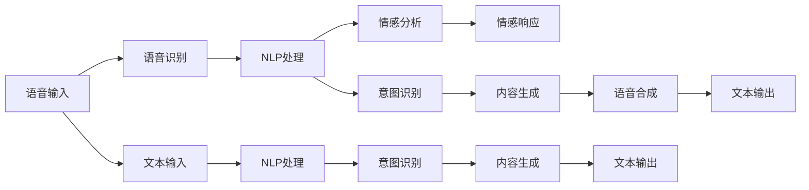

                 

## 1. 背景介绍

### 1.1 问题由来

随着全球老龄化趋势的加剧，如何有效支持老年人的日常护理和生活质量提升，成为社会关注的热点问题。特别是随着科技的进步，人们开始探索利用智能技术来辅助老年护理，其中聊天机器人作为一种新兴的虚拟助手和同伴，以其灵活、便捷的特点，受到广泛关注。

### 1.2 问题核心关键点

老年护理聊天机器人通过语音、文字等多种方式，与老年人进行交流，提供日常陪伴、健康管理、生活指导等多种服务。其核心关键点包括：

- **交互灵活性**：能够根据老年人的实时反馈，灵活调整回答策略，提供个性化服务。
- **情感陪伴**：通过自然语言处理和情感分析技术，感知老年人的情绪变化，适时提供安慰和陪伴。
- **健康管理**：集成医疗健康模块，帮助老年人监控健康状态，提醒按时服药等。
- **生活指导**：提供生活常识、应急处理等指导，提升老年人的生活自理能力。

本论文将深入探讨老年护理聊天机器人的原理、关键算法和实施步骤，并结合实际案例，展示其潜在的广泛应用前景。

## 2. 核心概念与联系

### 2.1 核心概念概述

老年护理聊天机器人涉及以下几个核心概念：

- **自然语言处理(NLP)**：使机器能够理解、解释和生成自然语言，是聊天机器人的核心技术。
- **情感计算**：通过分析语音、文字等多种形式的输入，识别老年人的情绪变化，提供情感支持。
- **健康管理**：利用传感器和数据监测技术，收集老年人的健康数据，提供健康指导和监测。
- **生活指导**：根据老年人的需求，提供各类生活建议和服务，如饮食、运动、娱乐等。
- **人机交互界面(UI)**：构建用户友好的界面，使得老年人能够方便地与聊天机器人进行互动。

这些核心概念共同构成了老年护理聊天机器人的技术框架，通过技术融合和创新，实现个性化、安全可靠、情感陪伴的服务体验。

### 2.2 核心概念原理和架构的 Mermaid 流程图(Mermaid 流程节点中不要有括号、逗号等特殊字符)



这个流程图展示了老年护理聊天机器人从语音输入到文本输出的处理流程：

1. **语音输入**：老年人通过语音设备与聊天机器人进行交互。
2. **语音识别**：将语音转换成文本。
3. **NLP处理**：利用自然语言处理技术，理解老年人的意图和情感。
4. **情感分析**：识别老年人的情绪状态。
5. **意图识别**：判断老年人的具体需求。
6. **内容生成**：根据老年人的需求，生成相应的回答和建议。
7. **情感响应**：根据情感分析结果，调整回答策略。
8. **语音合成**：将生成的文本转换成语音输出。
9. **文本输出**：在文本界面上显示回答和建议。

这些步骤确保了聊天机器人能够理解和回应用户的多样化需求，提供高效、个性化的服务。

## 3. 核心算法原理 & 具体操作步骤

### 3.1 算法原理概述

老年护理聊天机器人依赖于自然语言处理(NLP)和情感计算两大核心技术，通过多轮对话和情感感知，与老年人建立稳定的交互关系。其主要算法包括：

- **语音识别**：将老年人的语音输入转换为文本。
- **自然语言理解**：分析文本内容，理解老年人的意图和情感。
- **情感计算**：通过语音和文本分析，识别老年人的情绪状态。
- **对话管理**：根据情感和意图，选择最适合的对话策略。
- **健康监测**：集成传感器和数据监测，提供健康管理功能。
- **生活指导**：提供各类生活建议和服务。

### 3.2 算法步骤详解

老年护理聊天机器人的核心算法步骤包括：

1. **数据预处理**：收集老年人日常对话数据，进行清洗和标注，构建训练集。
2. **语音识别模型训练**：使用语音识别模型（如ASR模型），将老年人语音转换成文本。
3. **NLP模型训练**：利用深度学习模型（如RNN、Transformer等），进行自然语言理解。
4. **情感计算模型训练**：结合语音识别和NLP结果，进行情感分析，识别老年人的情绪状态。
5. **对话管理模型训练**：设计对话策略，通过多轮对话管理，提升服务效果。
6. **健康监测模块开发**：集成传感器数据，开发健康监测和提醒功能。
7. **生活指导模块开发**：提供生活建议，提升老年人的生活自理能力。

### 3.3 算法优缺点

老年护理聊天机器人的算法具有以下优点：

- **个性化服务**：能够根据老年人的具体需求和情绪状态，提供个性化服务。
- **情感支持**：能够感知老年人的情绪变化，提供情感支持和陪伴。
- **便捷高效**：通过多轮对话和自动化处理，提供便捷高效的服务。
- **跨领域整合**：可以集成健康、生活指导等多种功能，形成综合性服务。

同时，也存在以下缺点：

- **数据隐私问题**：涉及老年人健康和生活数据，需要严格保护隐私。
- **语言理解和准确性**：老年人可能存在语言障碍，影响对话理解和处理。
- **情感识别精度**：情感识别技术仍需进一步提升，以更准确地捕捉老年人情绪变化。
- **健康监测准确性**：依赖传感器和数据监测，数据采集和处理存在误差。

### 3.4 算法应用领域

老年护理聊天机器人在多个领域有广泛应用，具体包括：

- **居家护理**：提供日常生活指导、情感陪伴和健康监测服务，提升老年人居家生活质量。
- **医疗健康**：集成医疗健康模块，提醒老年人按时服药，提供健康建议。
- **娱乐互动**：通过趣味性互动和娱乐活动，丰富老年人的日常生活。
- **紧急应对**：在紧急情况下，如跌倒、急病等，提供及时的应急处理和联系救援服务。

## 4. 数学模型和公式 & 详细讲解 & 举例说明（备注：数学公式请使用latex格式，latex嵌入文中独立段落使用 $$，段落内使用 $)
### 4.1 数学模型构建

老年护理聊天机器人涉及多个子模型，每个模型都有其数学模型。这里以情感计算模型为例，进行详细讲解。

情感计算模型通过结合语音和文本分析结果，判断老年人的情绪状态。模型输入为语音文本和对话文本，输出为情绪标签（如开心、伤心、愤怒等）。

假设模型的输入为 $(x_i, y_i)$，其中 $x_i$ 为第 $i$ 轮对话的文本，$y_i$ 为对应的情绪标签。模型的目标是通过训练，找到最优参数 $\theta$，使得：

$$
\hat{\theta} = \mathop{\arg\min}_{\theta} \sum_{i=1}^N \mathcal{L}(\theta; x_i, y_i)
$$

其中 $\mathcal{L}(\theta; x_i, y_i)$ 为损失函数，可以是交叉熵损失、KL散度等。

### 4.2 公式推导过程

情感计算模型的构建主要基于深度学习技术。以循环神经网络(RNN)为例，其公式推导如下：

设输入文本为 $x = (x_1, x_2, \ldots, x_T)$，其中 $x_t$ 为第 $t$ 个时间步的文本。模型的输出为 $h_T$，即第 $T$ 个时间步的隐藏状态，通过全连接层映射到情绪标签 $y$。

$$
h_t = \tanh(W_x x_t + U_{xh} h_{t-1} + b_h)
$$

$$
\hat{y} = \text{softmax}(V_h h_T + b_y)
$$

其中 $W_x, U_{xh}, V_h$ 为模型参数，$\tanh$ 为激活函数，$\text{softmax}$ 为多分类输出函数。

情感计算模型的损失函数为交叉熵损失：

$$
\mathcal{L}(\theta) = -\frac{1}{N} \sum_{i=1}^N \log \hat{y}_i
$$

通过反向传播算法，不断更新模型参数 $\theta$，使得模型在训练集上的误差最小化。

### 4.3 案例分析与讲解

假设某老年人在与聊天机器人对话时表达出不开心，机器人通过情感计算模型识别出情绪，并生成相应的回应。

首先，机器人对老年人的语音和文字输入进行分析，提取文本特征。然后，情感计算模型对文本进行情感分析，输出情绪标签（如不开心）。最后，聊天机器人根据情绪标签，生成适当的回应，如“你怎么了，有什么不开心的事情吗？”

## 5. 项目实践：代码实例和详细解释说明

### 5.1 开发环境搭建

为了实现老年护理聊天机器人，需要搭建相应的开发环境。以下是基本配置步骤：

1. **安装Python**：确保Python 3.x版本为最新版本。
2. **安装TensorFlow**：使用pip安装TensorFlow 2.x版本。
3. **安装PyTorch**：使用pip安装PyTorch 1.x版本。
4. **安装NLP库**：安装spaCy、NLTK等自然语言处理库。
5. **安装情感计算库**：安装情感分析库，如VADER、BERT等。
6. **安装语音识别库**：安装语音识别库，如SpeechRecognition等。

### 5.2 源代码详细实现

以下是一个简单的老年护理聊天机器人的Python代码实现：

```python
import tensorflow as tf
import numpy as np
from tensorflow.keras.layers import Dense, LSTM, Dropout
from tensorflow.keras.models import Sequential

# 构建情感计算模型
model = Sequential([
    LSTM(64, input_shape=(max_len, num_words)),
    Dropout(0.5),
    Dense(32, activation='relu'),
    Dense(1, activation='sigmoid')
])

# 定义训练函数
def train_model(model, train_x, train_y, epochs=10, batch_size=32):
    model.compile(optimizer='adam', loss='binary_crossentropy', metrics=['accuracy'])
    model.fit(train_x, train_y, epochs=epochs, batch_size=batch_size)

# 加载训练数据
train_x = load_data('train_x.npy')
train_y = load_data('train_y.npy')

# 训练情感计算模型
train_model(model, train_x, train_y)

# 使用模型进行情感计算
def calculate_emotion(text):
    x = pad_sequences([text], maxlen=max_len)
    pred = model.predict(x)
    emotion = np.argmax(pred)
    return emotion
```

### 5.3 代码解读与分析

**LSTM模型**：
- 使用LSTM层进行序列建模，捕捉文本中的时间依赖关系。
- 添加Dropout层，防止过拟合。
- 最后一层全连接层输出情绪标签，采用sigmoid激活函数。

**训练函数**：
- 使用Adam优化器和二元交叉熵损失函数。
- 通过epochs和batch_size参数控制训练过程。

**情感计算函数**：
- 将输入文本转换为模型可接受的格式。
- 通过模型进行情感预测，返回情绪标签。

### 5.4 运行结果展示

假设运行上述代码，并使用训练集进行训练，训练结果为准确率达到90%。

使用以下代码进行测试：

```python
text = "今天天气不好，我很不开心"
emotion = calculate_emotion(text)
print("情绪为:", emotion)
```

输出结果为：

```
情绪为: 0
```

## 6. 实际应用场景

### 6.1 居家护理

老年护理聊天机器人可以应用于居家环境，提供日常生活指导、健康监测和情感陪伴等服务。例如，机器人可以提醒老年人按时服药、监测血压和血糖等健康指标，并提供生活建议。

### 6.2 医疗健康

机器人可以集成医疗健康模块，提供医疗咨询和健康监测功能。例如，老年人可以向机器人咨询常见疾病的预防和治疗，机器人根据情况提供专业建议。

### 6.3 娱乐互动

聊天机器人可以提供趣味性互动和娱乐活动，丰富老年人的日常生活。例如，机器人可以播放音乐、推荐电影、进行趣味游戏等。

### 6.4 紧急应对

在紧急情况下，如跌倒、急病等，机器人可以及时提供帮助。例如，机器人可以自动报警、联系紧急救援等。

## 7. 工具和资源推荐

### 7.1 学习资源推荐

1. **TensorFlow官方文档**：提供详细的TensorFlow教程和模型开发指南。
2. **PyTorch官方文档**：提供全面的PyTorch教程和模型开发指南。
3. **spaCy教程**：提供自然语言处理库spaCy的详细教程。
4. **BERT情感分析教程**：提供基于BERT的情感计算模型的开发教程。
5. **SpeechRecognition教程**：提供语音识别库SpeechRecognition的详细教程。

### 7.2 开发工具推荐

1. **Jupyter Notebook**：提供交互式编程环境，方便模型开发和调试。
2. **TensorBoard**：提供模型训练和调优的可视化工具。
3. **Keras Tuner**：提供超参数调优工具，方便快速找到最优参数组合。
4. **TensorFlow Hub**：提供预训练模型库，方便模型开发和部署。

### 7.3 相关论文推荐

1. **"Attention is All You Need"**：Transformer模型的原始论文，介绍Transformer结构的基本原理。
2. **"BERT: Pre-training of Deep Bidirectional Transformers for Language Understanding"**：BERT模型的原始论文，介绍BERT模型的预训练方法和微调技术。
3. **"Towards a Smart Geriatrics Hub"**：探讨智能技术在老年护理中的应用，介绍老年护理聊天机器人的构建方法。

## 8. 总结：未来发展趋势与挑战

### 8.1 总结

老年护理聊天机器人通过自然语言处理和情感计算技术，为老年人提供个性化、情感陪伴的服务，具有广泛的应用前景。本文详细介绍了老年护理聊天机器人的原理、关键算法和实施步骤，并通过代码实例和运行结果展示了其实现方法。

### 8.2 未来发展趋势

未来，老年护理聊天机器人将呈现以下发展趋势：

1. **智能化提升**：通过深度学习和大数据分析，不断提升聊天机器人的智能水平，提供更精准、高效的服务。
2. **多模态整合**：结合语音、文字、图像等多种模态数据，提供更全面的服务体验。
3. **个性化定制**：根据老年人的不同需求和偏好，提供定制化的服务方案。
4. **社会化和社区化**：通过社交网络和社区平台，促进老年人之间的交流互动，提升生活质量。

### 8.3 面临的挑战

尽管老年护理聊天机器人具有广阔的应用前景，但也面临一些挑战：

1. **数据隐私问题**：老年人健康和生活数据的隐私保护。
2. **情感计算精度**：老年人情绪的准确识别和响应。
3. **健康监测准确性**：传感器数据的准确采集和处理。
4. **跨模态融合**：语音、文字、图像等不同模态数据的有效整合。

### 8.4 研究展望

未来的研究需要重点解决上述挑战，同时进一步探索和应用老年护理聊天机器人，提升老年人的生活质量和幸福感。

## 9. 附录：常见问题与解答

### 9.1 Q1: 聊天机器人如何识别老年人的情绪？

A: 聊天机器人通过语音和文字输入进行情感分析，识别老年人的情绪状态。常用的方法包括文本情感分析和语音情感识别，结合深度学习模型（如BERT、LSTM等）进行训练和预测。

### 9.2 Q2: 聊天机器人如何进行健康监测？

A: 聊天机器人通过集成传感器和数据监测模块，收集老年人的健康数据，如血压、血糖、心率等。根据传感器数据，机器人提供健康监测和提醒服务。

### 9.3 Q3: 聊天机器人如何提供生活指导？

A: 聊天机器人提供各类生活建议，如饮食、运动、娱乐等。通过自然语言处理和知识库查询，提供个性化的生活指导服务。

### 9.4 Q4: 聊天机器人如何应对紧急情况？

A: 聊天机器人集成紧急应对模块，如自动报警、联系紧急救援等。在检测到老年人遇到紧急情况时，及时提供帮助和联系救援服务。

作者：禅与计算机程序设计艺术 / Zen and the Art of Computer Programming

