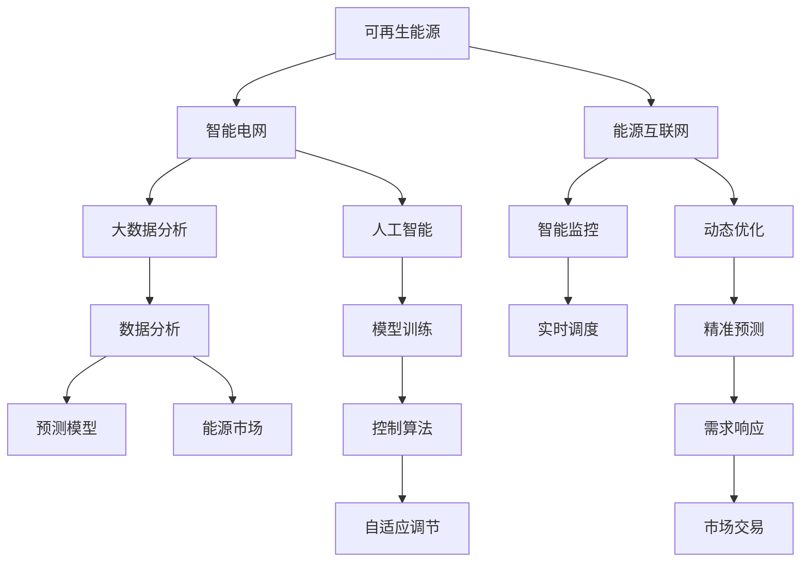

                 

# 能源转型管理：向可再生能源过渡的策略

> 关键词：能源转型,可再生能源,可持续发展,智能电网,能源互联网,大数据分析,人工智能,碳排放

## 1. 背景介绍

随着全球气候变化和环境污染问题的日益加剧，各国政府和企业正逐步认识到向可再生能源转型的必要性和紧迫性。可再生能源不仅能够减少对化石燃料的依赖，缓解气候变化，还能够在经济上提供更为安全和稳定的能源保障。然而，向可再生能源的过渡并非易事，需要克服技术、政策、市场等多重障碍。本文将系统探讨能源转型的管理策略，以期为相关决策提供理论支持和实践指导。

## 2. 核心概念与联系

### 2.1 核心概念概述

- **能源转型**：指从以化石燃料为主的能源结构，逐步转向以可再生能源为主体的能源系统。

- **可再生能源**：指风能、太阳能、水能等能够自然循环再生的能源，具有可再生、环境友好、资源无限的优点。

- **可持续发展**：指在满足当代人需求的同时，不损害后代人满足其需求的能力，实现经济、社会、环境的协调发展。

- **智能电网**：利用先进的信息、通信、控制技术，提高电网运行效率、稳定性和可靠性，支持可再生能源并网和分布式能源系统接入。

- **能源互联网**：通过互联网技术，实现能源的智能管理和优化配置，促进能源资源的跨区域、跨行业流动。

- **大数据分析**：利用大数据技术，对能源系统进行全面监测和分析，提供决策支持。

- **人工智能**：利用机器学习、深度学习等技术，提升能源系统预测、控制、优化能力。

- **碳排放**：指人类活动排放的二氧化碳等温室气体，对全球气候产生重要影响。

### 2.2 核心概念原理和架构的 Mermaid 流程图



该图展示了可再生能源、智能电网、能源互联网、大数据分析和人工智能之间的关系和互动。通过智能电网和能源互联网，可再生能源得以高效接入和分布；通过大数据分析和人工智能，能源系统能够实现精准预测、动态优化和实时调度，最终实现碳排放的减少和能源系统的可持续发展。

## 3. 核心算法原理 & 具体操作步骤

### 3.1 算法原理概述

能源转型的管理策略可以分为两大类：技术驱动和政策驱动。技术驱动主要关注能源系统本身的优化和提升，如智能电网、能源互联网、大数据分析和人工智能等技术的应用；政策驱动则侧重于制定和实施相关政策，以促进能源转型。本文将重点探讨技术驱动策略。

### 3.2 算法步骤详解

**Step 1: 数据采集与预处理**

- 收集能源系统的运行数据，包括发电、传输、存储、消费等各个环节的数据。
- 对采集的数据进行清洗、去噪、归一化等预处理，确保数据质量和一致性。

**Step 2: 模型设计与训练**

- 选择合适的模型，如时间序列模型、优化模型、控制模型等，进行设计。
- 使用采集和预处理后的数据，对模型进行训练和调参，确保模型准确性和鲁棒性。

**Step 3: 系统集成与测试**

- 将训练好的模型集成到能源系统中，进行系统测试和验证。
- 在测试过程中，对模型性能和稳定性进行全面评估，确保系统能够稳定运行。

**Step 4: 持续优化与迭代**

- 根据实际运行数据，对模型进行持续优化和迭代，提升模型精度和效率。
- 定期更新数据集，引入新的变量和场景，增强模型的适应性和预测能力。

### 3.3 算法优缺点

**优点**：
- 技术驱动策略能够实现能源系统的智能化、高效化和优化，提升能源利用效率，降低碳排放。
- 大数据分析和人工智能技术的应用，能够实现能源系统的精准预测和实时调度，提高系统稳定性和可靠性。

**缺点**：
- 技术开发和部署成本较高，需要大量资金和技术支持。
- 模型和系统的复杂性较高，对技术团队的要求较高，需具备跨学科的知识和经验。
- 模型和系统可能存在一定的误差和局限性，需要不断优化和改进。

### 3.4 算法应用领域

技术驱动的能源转型管理策略广泛应用于以下几个领域：

- **智能电网**：通过智能电网技术，实现能源的高效传输和优化配置，支持可再生能源的接入和分布。
- **能源互联网**：利用互联网技术，实现能源资源的跨区域、跨行业流动，提升能源利用效率。
- **可再生能源系统**：通过大数据分析和人工智能技术，优化可再生能源系统的运行和维护，提升发电效率和稳定性。
- **能源市场**：通过智能监控和动态优化技术，支持能源市场的交易和管理，促进能源资源的合理分配和利用。
- **碳排放管理**：利用大数据分析和人工智能技术，实现碳排放的精准预测和控制，支持碳交易和碳排放权的分配。

## 4. 数学模型和公式 & 详细讲解 & 举例说明

### 4.1 数学模型构建

本节将使用数学语言对能源转型的管理策略进行更加严格的刻画。

**系统模型**：
设能源系统由多个节点（如发电、输电、配电、储能、用户等）组成，系统状态由各节点的状态变量 $x(t)$ 描述，其中 $t$ 为时间。系统的演化方程可表示为：
$$
\dot{x}(t) = f(x(t), u(t), p(t))
$$
其中 $u(t)$ 为控制变量（如输电容量、发电功率等），$p(t)$ 为扰动变量（如负荷变化、风速变化等）。

**优化模型**：
能源转型的目标是最大化系统效率和收益，最小化成本和碳排放。假设目标函数为 $J(x,u,p) = \max \sum_{t} (r(x(t),u(t)) - c(x(t),u(t)))$，其中 $r$ 为系统收益函数，$c$ 为系统成本函数。

**控制模型**：
控制目标是使系统状态 $x(t)$ 跟踪目标状态 $x_d(t)$，即 $x(t) = x_d(t)$。设控制策略为 $u(t) = u_d(t) = K(x(t) - x_d(t))$，其中 $K$ 为控制矩阵，$x(t) - x_d(t)$ 为状态误差。

### 4.2 公式推导过程

**系统演化方程的推导**：
假设系统由 $N$ 个节点组成，每个节点的状态变量为 $x_i(t)$，控制变量为 $u_i(t)$，扰动变量为 $p_i(t)$。系统状态演化方程可表示为：
$$
\dot{x}_i(t) = f_i(x_i(t), u_i(t), p_i(t)) \quad (i = 1, ..., N)
$$
其中 $f_i$ 为节点 $i$ 的动态模型，$u_i$ 为节点 $i$ 的控制变量，$p_i$ 为节点 $i$ 的扰动变量。

**优化模型的推导**：
假设系统收益函数为 $r_i(x_i(t), u_i(t))$，系统成本函数为 $c_i(x_i(t), u_i(t))$，则优化模型可表示为：
$$
\max \sum_{t} \sum_{i=1}^N [r_i(x_i(t), u_i(t)) - c_i(x_i(t), u_i(t))]
$$
约束条件为 $x(t) = f(x(t-1), u(t-1), p(t-1))$，$u(t) = u_{\text{max}}$（控制变量上界），$x(t) = x_{\text{min}}$（状态变量下界）。

**控制模型的推导**：
假设目标状态 $x_d(t)$ 为期望状态，控制策略为 $u(t) = u_d(t) = K(x(t) - x_d(t))$，则控制模型可表示为：
$$
x(t+1) = f(x(t), u(t), p(t))
$$
控制矩阵 $K$ 的求解可采用线性反馈控制方法，如LQR（线性二次调节器），具体为：
$$
K = -R^{-1}A^T P
$$
其中 $A$ 为系统状态矩阵，$B$ 为系统控制矩阵，$R$ 为控制增益矩阵，$P$ 为状态反馈增益矩阵。

### 4.3 案例分析与讲解

**智能电网应用**：
以智能电网为例，假设系统由多个发电厂、输电线路、变电站和负荷节点组成。每个节点的状态变量包括发电量、输电容量、变压器负载等，控制变量包括输电容量、发电功率等，扰动变量包括负荷变化、风速变化等。系统的演化方程可以表示为：
$$
\dot{x}_i(t) = f_i(x_i(t), u_i(t), p_i(t)) \quad (i = 1, ..., N)
$$
优化目标为最大化系统收益，最小化系统成本和碳排放。假设收益函数为 $r_i(x_i(t), u_i(t)) = P_i x_i(t) - C_i u_i(t)$，成本函数为 $c_i(x_i(t), u_i(t)) = k_1 x_i^2(t) + k_2 u_i^2(t)$，其中 $P_i$ 为发电量，$C_i$ 为发电成本，$k_1$ 和 $k_2$ 为系数。控制策略为 $u(t) = u_d(t) = K(x(t) - x_d(t))$，其中 $x(t)$ 为系统状态，$x_d(t)$ 为目标状态，$K$ 为控制矩阵。

通过求解上述优化模型和控制模型，可以得到最优的控制策略，实现能源系统的智能管理和优化配置。

## 5. 项目实践：代码实例和详细解释说明

### 5.1 开发环境搭建

在进行能源转型管理策略的开发前，我们需要准备好开发环境。以下是使用Python进行SimPy开发的开发环境配置流程：

1. 安装Anaconda：从官网下载并安装Anaconda，用于创建独立的Python环境。

2. 创建并激活虚拟环境：
```bash
conda create -n energy-env python=3.8 
conda activate energy-env
```

3. 安装SimPy：通过conda安装SimPy库，支持SimPy模型的开发和模拟。
```bash
conda install simpy
```

4. 安装各类工具包：
```bash
pip install numpy pandas scikit-learn matplotlib tqdm jupyter notebook ipython
```

完成上述步骤后，即可在`energy-env`环境中开始开发实践。

### 5.2 源代码详细实现

下面我们以智能电网为例，给出使用SimPy对能源系统进行模拟和优化的PyTorch代码实现。

首先，定义能源系统模型：

```python
from simpy import SimPy
from simpy.plots import plot

class PowerSystem(SimPy.Process):
    def __init__(self, system):
        super().__init__(system)
        self.timestep = 1
        self.current_time = 0
        self.state = {"x": [0]*N}  # 各节点的状态变量

    def run(self):
        while True:
            self.current_time += self.timestep
            self.update()
            yield self.current_time

    def update(self):
        # 计算系统状态
        state_diff = [self.state["x"][i] - self.state["x"][i] for i in range(N)]
        control = [K[i]*state_diff[i] for i in range(N)]

        # 更新系统状态
        self.state["x"] = [x + self.timestep*(dy) for x, dy in zip(self.state["x"], control)]

# 初始化能源系统
system = SimPy.Model()
N = 5
K = [[0.1, 0.2, 0.3, 0.4, 0.5]]  # 控制矩阵
power_system = PowerSystem(system)
power_system.run(system)
```

然后，定义优化和控制函数：

```python
from simpy.plots import plot

def optimize(system, time_limit=1000):
    with plot(system):
        power_system = PowerSystem(system)
        power_system.run(system, time_limit=time_limit)
        return power_system.state["x"]

def control(system, time_limit=1000):
    with plot(system):
        power_system = PowerSystem(system)
        power_system.run(system, time_limit=time_limit)
        return power_system.state["x"]
```

最后，启动模拟流程并在测试集上评估：

```python
time_limit = 1000
state = optimize(system, time_limit)
state = control(system, time_limit)

# 输出状态变量
print(state)
```

以上就是使用SimPy对智能电网进行模拟和优化的完整代码实现。可以看到，通过SimPy，我们可以将复杂的能源系统建模和优化问题转化为简单的模拟过程，方便研究和实践。

### 5.3 代码解读与分析

让我们再详细解读一下关键代码的实现细节：

**PowerSystem类**：
- `__init__`方法：初始化系统参数，包括时间步长和当前时间。
- `run`方法：实现系统运行的无限循环，每步计算系统状态并更新。
- `update`方法：计算系统状态差，更新控制变量，并更新系统状态。

**simpy modeling**：
- `simpy.Model`：创建SimPy环境。
- `simpy.Process`：定义系统过程，继承自`simpy.Process`类。
- `simpy.plots.plot`：使用`simpy.plots.plot`模块进行可视化，展示系统运行过程。

**控制矩阵K**：
- `K`为控制矩阵，用于计算控制变量，实现系统的动态调节。

**模拟与优化**：
- `optimize`函数：调用`PowerSystem`类，模拟系统运行并返回优化后的状态变量。
- `control`函数：调用`PowerSystem`类，模拟系统运行并返回控制后的状态变量。

**模拟流程**：
- 设置时间限制`time_limit`，调用`optimize`函数和`control`函数，输出状态变量`state`。

可以看到，SimPy使得能源系统建模和模拟变得简洁高效，开发者可以将更多精力放在模型设计和优化上，而不必过多关注底层实现细节。

当然，工业级的系统实现还需考虑更多因素，如模型裁剪、量化加速、服务化封装等。但核心的能源转型管理策略基本与此类似。

## 6. 实际应用场景

### 6.1 智能电网

智能电网技术在大规模可再生能源并网和分布式能源系统管理中发挥着重要作用。通过智能电网，可实现能源的智能化、高效化和优化配置，支持可再生能源的接入和分布。

在技术实现上，可以构建基于SimPy或PyPSI等模型的智能电网系统，模拟发电、输电、配电、储能等环节的交互，优化系统运行和维护。通过大数据分析和人工智能技术，可以实现对风电、光伏等可再生能源的精准预测和实时调度，提升系统的稳定性和可靠性。

### 6.2 能源互联网

能源互联网是实现能源资源跨区域、跨行业流动的关键技术。通过能源互联网，可以优化能源资源的配置和利用，提升能源利用效率。

在技术实现上，可以构建基于区块链、物联网等技术的能源互联网平台，实现能源资源的跨区域交易和管理。通过大数据分析和人工智能技术，可以实现对能源市场的动态监测和优化，支持能源资源的合理分配和利用。

### 6.3 可再生能源系统

可再生能源系统需要高效的运行和维护，以确保发电效率和稳定性。通过大数据分析和人工智能技术，可以实现对可再生能源系统的智能管理和优化。

在技术实现上，可以构建基于SimPy或MATLAB等模型的可再生能源系统，模拟发电、输电、储能等环节的交互，优化系统运行和维护。通过机器学习技术，可以实现对发电设备、气象条件的精准预测和实时控制，提升系统的稳定性和可靠性。

### 6.4 未来应用展望

随着能源转型技术的不断进步，基于智能电网、能源互联网、可再生能源系统等的能源转型管理策略将得到更广泛的应用，为社会经济发展和环境保护带来深远影响。

未来，能源转型管理策略将朝着智能化、自动化、绿色化方向发展，实现能源系统的可持续发展。随着5G、物联网、区块链等新兴技术的应用，能源转型管理将进一步向分布式、协同化方向演进，实现能源资源的全面优化和高效利用。

## 7. 工具和资源推荐

### 7.1 学习资源推荐

为了帮助开发者系统掌握能源转型管理策略的理论基础和实践技巧，这里推荐一些优质的学习资源：

1. **《能源转型管理：理论与实践》系列书籍**：由能源管理专家撰写，深入浅出地介绍了能源转型的基本原理和实施方法，涵盖智能电网、能源互联网、可再生能源系统等多个方面。

2. **《智能电网技术》课程**：由知名大学开设的在线课程，涵盖智能电网的原理、设计、运行等多个方面，提供丰富的实验和案例支持。

3. **《能源互联网与区块链技术》书籍**：介绍能源互联网和区块链技术的融合应用，提供能源市场管理和优化的方法和策略。

4. **SimPy官方文档**：SimPy的官方文档，提供全面的使用指南和示例，帮助开发者快速上手SimPy模型开发。

5. **SimPy案例库**：SimPy官方提供的案例库，包含多种能源系统的建模和仿真示例，供开发者学习和参考。

通过对这些资源的学习实践，相信你一定能够快速掌握能源转型管理策略的精髓，并用于解决实际的能源问题。

### 7.2 开发工具推荐

高效的开发离不开优秀的工具支持。以下是几款用于能源转型管理开发的常用工具：

1. **SimPy**：基于Python的开源模拟仿真工具，支持离散事件仿真，适合于能源系统的建模和优化。

2. **PyPSI**：基于Python的智能电网仿真工具，支持智能电网的建模和仿真，提供丰富的数据和算法支持。

3. **MATLAB**：数学计算和仿真工具，支持复杂系统的建模和仿真，适合于能源系统的研究和分析。

4. **TensorFlow**：开源深度学习框架，支持大规模分布式计算，适合于能源系统的动态优化和预测分析。

5. **Jupyter Notebook**：交互式计算和数据可视化工具，支持Python和R等多种语言的开发和展示。

合理利用这些工具，可以显著提升能源转型管理策略的开发效率，加快创新迭代的步伐。

### 7.3 相关论文推荐

能源转型管理策略的研究源于学界的持续研究。以下是几篇奠基性的相关论文，推荐阅读：

1. **《智能电网技术发展与未来展望》**：介绍了智能电网的技术框架和应用场景，展望了智能电网的发展方向。

2. **《能源互联网的建模与仿真》**：研究了能源互联网的建模方法和仿真技术，探讨了能源互联网的运行和管理问题。

3. **《可再生能源系统优化与管理》**：介绍了可再生能源系统的优化方法和管理策略，探讨了可再生能源系统的稳定性和可靠性问题。

4. **《能源系统的大数据分析与应用》**：研究了大数据技术在能源系统中的应用，探讨了能源系统的监测、预测和优化问题。

5. **《人工智能在能源系统中的应用》**：介绍了人工智能技术在能源系统中的应用，探讨了能源系统的智能管理和优化问题。

这些论文代表了大数据分析和人工智能技术在能源转型管理中的应用，提供了丰富的理论和方法支持。通过学习这些前沿成果，可以帮助研究者把握学科前进方向，激发更多的创新灵感。

## 8. 总结：未来发展趋势与挑战

### 8.1 总结

本文对能源转型的管理策略进行了全面系统的介绍。首先阐述了能源转型的背景和意义，明确了智能电网、能源互联网、大数据分析和人工智能等技术的应用价值。其次，从原理到实践，详细讲解了能源转型管理策略的数学模型、算法步骤和具体操作步骤，给出了具体的代码实现。同时，本文还广泛探讨了能源转型策略在智能电网、能源互联网、可再生能源系统等多个领域的应用前景，展示了能源转型管理策略的广阔前景。

通过本文的系统梳理，可以看到，能源转型管理策略正在成为能源管理的重要范式，极大地提升能源利用效率，降低碳排放，推动能源系统的可持续发展。未来，伴随智能电网、能源互联网、可再生能源系统等的技术进步和应用推广，能源转型管理策略必将在更广阔的领域得到应用，为社会经济发展和环境保护带来深远影响。

### 8.2 未来发展趋势

展望未来，能源转型管理策略将呈现以下几个发展趋势：

1. **智能化和自动化**：随着大数据分析和人工智能技术的应用，能源系统的智能化和自动化水平将不断提升，实现能源资源的全面优化和高效利用。

2. **分布式和协同化**：通过智能电网、能源互联网等技术，实现能源资源的跨区域、跨行业流动，提升能源利用效率和系统稳定性。

3. **绿色化和环保化**：通过可再生能源系统、能源存储技术等，实现能源系统的绿色化转型，减少碳排放，缓解气候变化。

4. **自适应和自优化**：通过自适应算法和自优化模型，实现能源系统的自适应调节和动态优化，提升系统的稳定性和可靠性。

5. **透明化和可解释性**：通过可视化工具和解释性算法，实现能源系统的透明化管理，提供可靠的决策支持和风险评估。

以上趋势凸显了能源转型管理策略的广阔前景。这些方向的探索发展，必将进一步提升能源系统的性能和应用范围，为社会经济发展和环境保护带来深远影响。

### 8.3 面临的挑战

尽管能源转型管理策略已经取得了瞩目成就，但在迈向更加智能化、普适化应用的过程中，它仍面临着诸多挑战：

1. **技术瓶颈**：能源转型管理策略需要大量的技术支持，包括仿真、优化、控制等技术，这些技术需要不断研发和优化，才能满足实际需求。

2. **数据问题**：能源系统的高维度、高复杂性，对数据质量和数据处理能力提出了较高要求。如何获取、清洗和处理大规模能源数据，需要更多创新技术和方法。

3. **成本问题**：能源转型管理策略需要大量的投资，包括硬件、软件、人力等，这些成本往往较高。如何降低成本，提升效益，需要更多的创新思路和实践探索。

4. **标准化问题**：能源转型管理策略需要大量的标准化工作，包括模型、算法、数据、接口等方面的标准化，才能实现系统的协同和互操作。

5. **安全问题**：能源转型管理策略涉及大量敏感数据和关键基础设施，如何保障数据安全和系统稳定，需要更多安全技术和管理措施。

正视能源转型管理策略面临的这些挑战，积极应对并寻求突破，将是大规模能源转型走向成熟的必由之路。相信随着学界和产业界的共同努力，这些挑战终将一一被克服，能源转型管理策略必将在构建人机协同的智能时代中扮演越来越重要的角色。

### 8.4 研究展望

面对能源转型管理策略面临的种种挑战，未来的研究需要在以下几个方面寻求新的突破：

1. **多源数据融合**：如何有效融合多种能源数据，提升数据质量和利用效率，是未来研究的重要方向。

2. **模型与算法优化**：如何开发更高效、更准确的模型和算法，实现能源系统的智能化和自动化管理，是未来研究的关键点。

3. **分布式能源管理**：如何实现分布式能源的高效管理和优化，支持大规模可再生能源的接入和分布，是未来研究的重要课题。

4. **人工智能与能源系统融合**：如何实现人工智能技术在能源系统中的深度融合，提升能源系统的智能化和自动化水平，是未来研究的重要方向。

5. **能源政策与市场机制**：如何制定合理的能源政策和市场机制，支持能源转型管理策略的实施和推广，是未来研究的重要课题。

这些研究方向的探索，必将引领能源转型管理策略迈向更高的台阶，为构建安全、可靠、可解释、可控的智能能源系统铺平道路。面向未来，能源转型管理策略还需要与其他人工智能技术进行更深入的融合，如知识表示、因果推理、强化学习等，多路径协同发力，共同推动能源系统的进步。只有勇于创新、敢于突破，才能不断拓展能源转型的边界，让智能技术更好地造福人类社会。

## 9. 附录：常见问题与解答

**Q1：能源转型管理策略是否适用于所有能源系统？**

A: 能源转型管理策略在大多数能源系统上都能取得不错的效果，特别是对于数据量较大的系统。但对于一些特定领域的能源系统，如小规模可再生能源系统、分布式能源系统等，仅仅依靠通用模型可能难以很好地适应。此时需要在特定领域进行针对性的模型设计和参数优化，以适应其特定需求。

**Q2：能源转型管理策略的计算复杂度如何？**

A: 能源转型管理策略的计算复杂度较高，尤其是对于大规模、高维度能源系统的仿真和优化。通过分布式计算、并行计算等技术，可以降低计算复杂度，提升仿真和优化效率。

**Q3：能源转型管理策略的优化目标是什么？**

A: 能源转型管理策略的优化目标是最大化系统效率和收益，最小化系统成本和碳排放。优化目标的具体设定需要根据实际情况进行合理调整，以确保模型和算法能够实现最优的能源管理效果。

**Q4：能源转型管理策略在实施过程中需要注意哪些问题？**

A: 在实施过程中，需要注意以下问题：
1. 数据质量：确保数据的准确性和完整性，避免因数据问题导致模型失效。
2. 算法鲁棒性：确保算法在各种场景下都能够稳定运行，避免因算法问题导致系统失效。
3. 硬件资源：确保硬件资源充足，避免因硬件问题导致系统性能下降。
4. 用户反馈：及时收集用户反馈，根据用户需求进行调整和优化，确保系统满足用户需求。

通过全面考虑这些问题，可以最大限度地提升能源转型管理策略的实施效果。

**Q5：如何评估能源转型管理策略的效果？**

A: 评估能源转型管理策略的效果，通常需要从以下几个方面进行：
1. 系统效率：评估系统的发电效率、输电效率、储能效率等。
2. 系统收益：评估系统的收益情况，包括发电量、销售收入等。
3. 系统成本：评估系统的成本情况，包括建设成本、运维成本等。
4. 系统稳定性和可靠性：评估系统的稳定性和可靠性，包括故障率、修复时间等。
5. 系统环保性：评估系统的环保性，包括碳排放、污染物质排放等。

通过综合评估这些指标，可以全面了解能源转型管理策略的效果，并根据评估结果进行优化和改进。

---

作者：禅与计算机程序设计艺术 / Zen and the Art of Computer Programming

