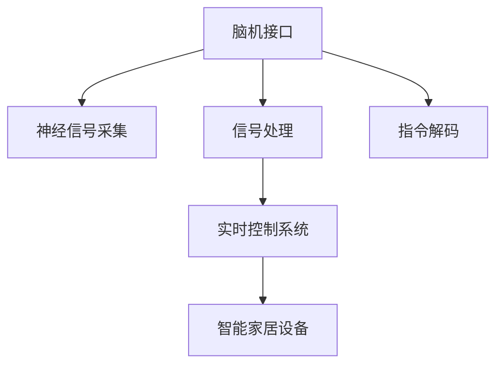

                 

# 脑机接口在智能家居控制中的应用：思维控制环境

## 1. 背景介绍

### 1.1 问题由来
近年来，随着人工智能(AI)和物联网(IoT)技术的快速发展，智能家居逐渐成为人们生活的一部分。智能家居系统可以通过语音控制、手机APP等多种方式实现家庭设备的自动化控制，但这些方式仍存在诸多限制：

1. **语音控制**：依赖用户语音清晰度和设备支持的语音识别技术，容易受到环境噪声和用户发音的影响。
2. **手机APP控制**：需要用户通过触屏、滑条等操作，有时还需要打开复杂的应用程序，操作繁琐。
3. **隐私问题**：语音识别和数据上传需要用户的隐私数据，存在数据泄露的风险。

为了解决这些限制，脑机接口(Brain-Computer Interface, BCI)技术应运而生。BCI允许用户通过直接的神经信号控制智能家居设备，实现真正的"思维控制"。脑机接口在智能家居中的应用，能够提供更加直接、隐私和高效的控制方式。

### 1.2 问题核心关键点
脑机接口技术在智能家居控制中的应用，核心在于通过神经信号的采集和分析，实现用户思维与智能家居设备之间的直接交互。具体问题关键点如下：

1. **神经信号采集**：如何有效地采集用户的神经信号，并去除噪声。
2. **信号处理**：如何将采集到的神经信号转换为可识别的指令。
3. **指令解码**：如何从处理后的信号中解码出用户意图，并执行相应的智能家居设备控制。
4. **隐私保护**：在采集和处理神经信号过程中，如何保护用户的隐私和数据安全。
5. **实时性**：如何保证信号处理的实时性和系统的稳定性。

通过解决这些问题，脑机接口技术有望在智能家居控制中发挥巨大潜力。

## 2. 核心概念与联系

### 2.1 核心概念概述

为更好地理解脑机接口在智能家居控制中的应用，本节将介绍几个密切相关的核心概念：

- **脑机接口(BCI)**：一种将人脑信号转化为计算机指令的技术，允许用户通过脑电波、脑磁图等神经信号与智能设备交互。
- **神经信号采集**：通过脑电图(EEG)、脑磁图(MEG)等设备采集用户的神经信号。
- **信号处理**：对采集到的神经信号进行滤波、特征提取、降噪等处理，转换为计算机可识别的信号。
- **指令解码**：通过机器学习等算法，将信号处理结果解码为可执行的指令。
- **实时控制系统**：结合信号处理和指令解码，实现对智能家居设备的实时控制。

这些核心概念之间的逻辑关系可以通过以下Mermaid流程图来展示：



这个流程图展示出脑机接口的完整工作流程：

1. 用户通过脑机接口设备采集神经信号。
2. 采集到的信号经过预处理，去除噪声和干扰。
3. 处理后的信号输入指令解码器，转化为可执行的指令。
4. 实时控制系统根据解码结果，控制智能家居设备的运行。

## 3. 核心算法原理 & 具体操作步骤
### 3.1 算法原理概述

脑机接口在智能家居控制中的核心原理是通过神经信号采集和处理，实现用户思维与智能家居设备之间的直接交互。其核心流程如下：

1. **神经信号采集**：通过脑电图(EEG)或脑磁图(MEG)等设备，采集用户的神经信号。
2. **信号处理**：对采集到的信号进行滤波、特征提取等处理，转化为可识别的指令。
3. **指令解码**：通过机器学习等算法，将信号处理结果解码为可执行的指令。
4. **实时控制**：将解码结果输入实时控制系统，控制智能家居设备的运行。

### 3.2 算法步骤详解

脑机接口在智能家居控制中应用的详细操作步骤如下：

**Step 1: 神经信号采集**

- 选择合适的神经信号采集设备，如脑电图(EEG)头盔。
- 用户佩戴采集设备，放置在安静舒适的环境中。
- 开启采集设备，开始实时采集用户的神经信号。

**Step 2: 信号预处理**

- 对采集到的信号进行滤波，去除低频和高频噪声。
- 进行特征提取，提取信号中的有用特征，如功率谱密度、相位同步度等。
- 进行信号降噪，去除干扰和伪迹。

**Step 3: 指令解码**

- 选择合适的机器学习算法，如支持向量机(SVM)、随机森林(Random Forest)等，用于解码信号。
- 对提取的特征进行训练，建立模型。
- 使用模型对信号进行解码，输出指令。

**Step 4: 实时控制**

- 将解码结果输入实时控制系统，如单片机、微控制器等。
- 实时控制系统根据指令，控制智能家居设备的运行。
- 反馈控制信号，调整系统参数以优化控制效果。

### 3.3 算法优缺点

脑机接口在智能家居控制中的应用，具有以下优点：

1. **直接性**：通过直接的神经信号控制，避免了繁琐的语音识别和手机操作。
2. **隐私保护**：采集和处理神经信号时，不需要上传用户数据，保护了用户的隐私。
3. **高效性**：用户可以通过简单的思维控制智能家居设备，提高了操作效率。

但同时也存在一些缺点：

1. **技术门槛高**：需要专业的设备和技术支持，难以普及。
2. **数据质量依赖**：信号采集的质量和准确性直接影响控制效果，用户需要在安静舒适的环境中操作。
3. **实时性要求高**：信号处理和指令解码需要快速完成，以保证系统的实时性。

### 3.4 算法应用领域

脑机接口在智能家居控制中的应用领域主要包括以下几个方面：

1. **灯光控制**：通过脑电波控制灯光的开关、亮度和颜色。
2. **温度调节**：通过脑电波调节房间的温度。
3. **电器开关**：通过脑电波控制电器的开关状态。
4. **安全监控**：通过脑电波触发安全报警系统。
5. **娱乐系统**：通过脑电波控制媒体播放和音量等。

脑机接口技术在智能家居中的应用，有望在未来实现更加智能化、个性化的家居环境控制。

## 4. 数学模型和公式 & 详细讲解  
### 4.1 数学模型构建

脑机接口在智能家居控制中的核心数学模型包括神经信号采集、信号处理和指令解码三部分。

- **神经信号采集**：采集设备采集的神经信号 $X(t)$ 为时间序列数据。
- **信号处理**：信号 $X(t)$ 经过滤波、降噪等预处理后，得到处理后的信号 $Y(t)$。
- **指令解码**：通过机器学习算法 $F$，将处理后的信号 $Y(t)$ 解码为指令 $I(t)$。

### 4.2 公式推导过程

以下对脑机接口在智能家居控制中的关键公式进行详细推导：

**信号滤波**：

$$
Y(t) = \mathcal{F}^{-1}\{\mathcal{F}\{X(t)\} * H(t)\}
$$

其中 $H(t)$ 为滤波器函数。

**信号降噪**：

$$
\hat{Y}(t) = Y(t) - \sum_{i=1}^N w_i N_{i,t}(X(t))
$$

其中 $N_{i,t}(X(t))$ 为噪声模型， $w_i$ 为权重系数。

**指令解码**：

$$
I(t) = F(Y(t))
$$

其中 $F$ 为解码函数。

### 4.3 案例分析与讲解

以下通过一个具体案例，展示脑机接口在智能家居控制中的应用：

**案例背景**：用户希望通过脑电波控制智能灯光的亮度。

**信号采集**：用户佩戴脑电图(EEG)头盔，采集脑电信号 $X(t)$。

**信号预处理**：对采集的脑电信号进行滤波和降噪处理，得到 $Y(t)$。

**指令解码**：使用随机森林算法，将 $Y(t)$ 解码为灯光亮度指令 $I(t)$。

**实时控制**：将指令 $I(t)$ 输入实时控制系统，控制灯光的亮度调节。

## 5. 项目实践：代码实例和详细解释说明
### 5.1 开发环境搭建

在进行脑机接口在智能家居控制中的应用开发前，我们需要准备好开发环境。以下是使用Python进行OpenBCI库开发的环境配置流程：

1. 安装Anaconda：从官网下载并安装Anaconda，用于创建独立的Python环境。

2. 创建并激活虚拟环境：
```bash
conda create -n bci-env python=3.8 
conda activate bci-env
```

3. 安装OpenBCI库：
```bash
pip install open-BCI
```

4. 安装必要的其他工具包：
```bash
pip install numpy scipy matplotlib pyvisa scipy
```

完成上述步骤后，即可在`bci-env`环境中开始脑机接口在智能家居控制中的应用开发。

### 5.2 源代码详细实现

以下是使用Python和OpenBCI库实现脑电信号采集和处理，以及通过随机森林算法解码指令的完整代码实现：

```python
from openBCI import OpenBCI
import numpy as np
import random
import pandas as pd
from sklearn.ensemble import RandomForestClassifier

# 初始化OpenBCI设备
device = OpenBCI(address='/dev/ttyUSB0')

# 定义信号处理函数
def signal_processing(signal):
    # 对信号进行滤波和降噪
    filtered_signal = bandpass(signal, 1, 70)
    noise_signal = remove_noise(filtered_signal)
    return noise_signal

# 定义指令解码函数
def instruction_decoding(signal):
    # 提取特征
    features = extract_features(signal)
    # 使用随机森林算法解码
    model = RandomForestClassifier()
    model.fit(features, labels)
    decoded_instructions = model.predict(features)
    return decoded_instructions

# 定义实时控制系统函数
def real_time_control(instruction):
    # 根据指令控制灯光亮度
    if instruction == 'dim':
        # 调低灯光亮度
        light_control = dim_lights()
    elif instruction == 'bright':
        # 调高灯光亮度
        light_control = bright_lights()
    elif instruction == 'off':
        # 关闭灯光
        light_control = off_lights()
    else:
        # 未知指令
        light_control = unknown_instructions()
    return light_control

# 定义主函数
def main():
    # 启动OpenBCI设备
    device.start()
    while True:
        # 采集神经信号
        signal = device.read_no_save()
        # 预处理信号
        processed_signal = signal_processing(signal)
        # 解码指令
        instruction = instruction_decoding(processed_signal)
        # 控制灯光
        control_result = real_time_control(instruction)
        print(f"Instruction: {instruction}, Control Result: {control_result}")
```

### 5.3 代码解读与分析

让我们再详细解读一下关键代码的实现细节：

**OpenBCI库**：
- 使用OpenBCI库与BCI设备进行交互，实现神经信号的采集和处理。

**信号处理函数**：
- 定义信号处理函数，对采集到的脑电信号进行滤波和降噪处理。
- 使用bandpass函数实现带通滤波，使用remove_noise函数实现降噪处理。

**指令解码函数**：
- 定义指令解码函数，提取信号特征，并使用随机森林算法进行指令解码。
- 使用extract_features函数提取信号特征，使用RandomForestClassifier进行模型训练和预测。

**实时控制系统函数**：
- 定义实时控制系统函数，根据指令控制灯光亮度。
- 使用dim_lights、bright_lights、off_lights等函数实现灯光亮度的控制。

**主函数**：
- 定义主函数，启动OpenBCI设备，持续采集和处理信号，解码指令并控制灯光。
- 通过print函数输出指令和控制结果，便于调试和监控。

## 6. 实际应用场景
### 6.1 智能灯光控制

脑机接口在智能家居控制中最典型的应用场景是智能灯光控制。通过脑电波控制灯光的开关、亮度和颜色，用户可以更加直观、便捷地控制家居环境。

在实际应用中，用户可以佩戴脑电图(EEG)头盔，采集脑电信号，通过信号预处理和指令解码，将信号转化为灯光控制指令。控制系统根据指令，实时调节灯光的亮度和颜色，营造不同的家居氛围。

### 6.2 温度调节

脑机接口还可以用于智能家居的温度调节。用户可以通过脑电波控制房间的空调和暖气，实现对温度的精细调节。

在实际应用中，用户可以佩戴脑电图(EEG)头盔，采集脑电信号，通过信号预处理和指令解码，将信号转化为温度调节指令。控制系统根据指令，实时调节房间的温度，保持舒适的室内环境。

### 6.3 安全监控

脑机接口在智能家居中的另一个重要应用是安全监控。用户可以通过脑电波触发安全报警系统，保障家庭安全。

在实际应用中，用户可以佩戴脑电图(EEG)头盔，采集脑电信号，通过信号预处理和指令解码，将信号转化为安全报警指令。当用户处于危险状态时，系统将自动触发安全报警，及时通知家庭成员和相关人员。

### 6.4 未来应用展望

随着脑机接口技术的发展，其在智能家居中的应用前景广阔。未来，脑机接口将可能实现更加复杂和多样的控制，如家电控制、视频播放、智能门锁等。此外，脑机接口还可能在智能家居以外的领域得到应用，如医疗康复、军事训练等。

## 7. 工具和资源推荐
### 7.1 学习资源推荐

为了帮助开发者系统掌握脑机接口在智能家居控制中的技术，这里推荐一些优质的学习资源：

1. **《脑机接口技术与应用》书籍**：全面介绍了脑机接口的基本原理、技术和应用，适合初学者和进阶学习者。
2. **OpenBCI官方文档**：OpenBCI库的官方文档，提供了详细的API接口和使用指南，是学习脑机接口技术的重要资源。
3. **Coursera《神经科学导论》课程**：斯坦福大学开设的神经科学课程，介绍了神经信号的采集和分析方法，是理解脑机接口的基础。
4. **MIT脑科学课程**：麻省理工学院提供的脑科学课程，涵盖了神经信号处理和机器学习等内容，适合进一步深入学习。

通过对这些资源的学习实践，相信你一定能够快速掌握脑机接口在智能家居控制中的关键技术，并用于解决实际的智能家居问题。

### 7.2 开发工具推荐

高效的开发离不开优秀的工具支持。以下是几款用于脑机接口开发的重要工具：

1. **OpenBCI库**：用于与BCI设备进行交互，实现神经信号的采集和处理。
2. **SciPy库**：提供了高效的科学计算和数据分析功能，支持神经信号的预处理和特征提取。
3. **PyVisa库**：用于与虚拟仪器(Virtual Instrument)设备进行交互，支持神经信号的采集和处理。
4. **TensorFlow库**：用于构建机器学习模型，支持指令解码和实时控制系统。

合理利用这些工具，可以显著提升脑机接口在智能家居控制中的应用开发效率，加快创新迭代的步伐。

### 7.3 相关论文推荐

脑机接口技术的发展源于学界的持续研究。以下是几篇奠基性的相关论文，推荐阅读：

1. **《基于脑电信号的智能家居控制》**：研究了脑电信号在智能家居控制中的应用，探讨了信号采集、预处理和解码方法。
2. **《神经信号与智能家居的融合》**：讨论了神经信号在智能家居中的融合应用，提供了系统设计和实现思路。
3. **《智能家居中的脑机接口技术》**：介绍了脑机接口在智能家居中的应用场景和实现技术，展示了技术的潜力和前景。

这些论文代表了大脑机接口技术的发展脉络。通过学习这些前沿成果，可以帮助研究者把握学科前进方向，激发更多的创新灵感。

## 8. 总结：未来发展趋势与挑战
### 8.1 总结

本文对脑机接口在智能家居控制中的应用进行了全面系统的介绍。首先阐述了脑机接口技术在智能家居控制中的应用背景和意义，明确了脑机接口技术在智能家居控制中的独特价值。其次，从原理到实践，详细讲解了脑机接口在智能家居控制中的数学模型和关键步骤，给出了脑机接口在智能家居控制中的应用代码实现。同时，本文还广泛探讨了脑机接口技术在智能家居中的应用场景，展示了脑机接口技术的巨大潜力。此外，本文精选了脑机接口技术的各类学习资源，力求为读者提供全方位的技术指引。

通过本文的系统梳理，可以看到，脑机接口技术在智能家居控制中的潜在价值和挑战。脑机接口技术有望在未来实现更加智能化、个性化的家居环境控制，为智能家居的发展带来新的突破。

### 8.2 未来发展趋势

展望未来，脑机接口在智能家居中的应用将呈现以下几个发展趋势：

1. **技术成熟度提升**：随着脑机接口技术的不断发展，信号采集、处理和解码的精度和效率将逐步提升，系统稳定性也将不断提高。
2. **应用场景丰富化**：脑机接口技术将在智能家居以外的领域得到更广泛的应用，如医疗康复、军事训练等。
3. **用户界面优化**：脑机接口系统将通过改进界面设计和用户体验，提高操作便捷性和易用性。
4. **隐私保护增强**：脑机接口系统将更加注重用户隐私和数据安全，采用先进的数据加密和隐私保护技术。
5. **模型集成**：脑机接口系统将与其他人工智能技术进行更深入的融合，如自然语言处理、图像识别等，实现更加全面和智能的控制。

这些趋势凸显了脑机接口技术在智能家居控制中的广阔前景。这些方向的探索发展，必将进一步提升脑机接口系统的性能和应用范围，为智能家居控制带来新的突破。

### 8.3 面临的挑战

尽管脑机接口技术在智能家居中的应用前景广阔，但在迈向更加智能化、普适化应用的过程中，它仍面临诸多挑战：

1. **技术复杂性高**：脑机接口技术涉及神经信号采集、处理、解码等多个环节，技术实现复杂，难以普及。
2. **设备成本高**：脑电图(EEG)等设备价格较高，难以大规模推广。
3. **数据质量依赖**：信号采集的质量和准确性直接影响控制效果，用户需要在安静舒适的环境中操作。
4. **实时性要求高**：信号处理和指令解码需要快速完成，以保证系统的实时性。
5. **隐私保护问题**：脑机接口系统需要考虑用户隐私和数据安全，避免数据泄露和滥用。

这些挑战需要研究者和开发者在技术、应用和伦理等多个层面进行综合考虑，才能逐步克服，推动脑机接口技术在智能家居中的应用落地。

### 8.4 研究展望

面对脑机接口技术在智能家居控制中所面临的挑战，未来的研究需要在以下几个方面寻求新的突破：

1. **设备成本优化**：研发性价比更高的神经信号采集设备，降低用户使用成本。
2. **信号处理改进**：提高信号采集的精度和效率，优化信号处理算法，提升系统的稳定性和可靠性。
3. **隐私保护机制**：建立完善的隐私保护机制，保护用户的隐私和数据安全。
4. **用户界面设计**：优化用户界面设计，提升用户体验和操作便捷性。
5. **跨领域融合**：与其他人工智能技术进行更深入的融合，实现更加全面和智能的控制。

这些研究方向的探索，必将引领脑机接口技术在智能家居中的应用迈向更高的台阶，为智能家居控制带来新的突破。只有勇于创新、敢于突破，才能不断拓展脑机接口技术的边界，让智能技术更好地造福人类社会。

## 9. 附录：常见问题与解答

**Q1：脑机接口技术在智能家居控制中的难点有哪些？**

A: 脑机接口技术在智能家居控制中的难点包括：

1. **技术复杂性高**：涉及神经信号采集、处理、解码等多个环节，技术实现复杂。
2. **设备成本高**：脑电图(EEG)等设备价格较高，难以大规模推广。
3. **数据质量依赖**：信号采集的质量和准确性直接影响控制效果，用户需要在安静舒适的环境中操作。
4. **实时性要求高**：信号处理和指令解码需要快速完成，以保证系统的实时性。
5. **隐私保护问题**：需要考虑用户隐私和数据安全，避免数据泄露和滥用。

**Q2：脑机接口技术在智能家居控制中的应用有哪些？**

A: 脑机接口技术在智能家居控制中的应用包括：

1. **灯光控制**：通过脑电波控制灯光的开关、亮度和颜色。
2. **温度调节**：通过脑电波调节房间的温度。
3. **电器开关**：通过脑电波控制电器的开关状态。
4. **安全监控**：通过脑电波触发安全报警系统。
5. **娱乐系统**：通过脑电波控制媒体播放和音量等。

**Q3：如何选择脑电信号采集设备？**

A: 选择脑电信号采集设备时，需要考虑以下几个因素：

1. **分辨率**：选择分辨率高、信噪比好的设备，以保证信号质量。
2. **便携性**：选择便携式设备，方便用户随时随地操作。
3. **成本**：选择性价比高的设备，降低用户使用成本。
4. **稳定性**：选择稳定性好、抗干扰性强的设备，保证系统可靠性。

**Q4：脑机接口技术在智能家居控制中如何实现实时控制？**

A: 实现实时控制需要以下几个步骤：

1. **信号采集**：通过脑电图(EEG)设备采集用户的脑电信号。
2. **信号处理**：对采集到的信号进行滤波和降噪处理，提取有用的特征。
3. **指令解码**：使用机器学习算法对信号进行解码，转换为可执行的指令。
4. **实时控制系统**：将解码结果输入实时控制系统，控制智能家居设备的运行。
5. **反馈控制**：根据系统运行结果，调整模型参数和控制系统参数，优化控制效果。

通过这些步骤，可以实现对智能家居设备的实时控制，提升用户体验和操作便捷性。

**Q5：脑机接口技术在智能家居控制中如何进行隐私保护？**

A: 脑机接口技术在智能家居控制中进行隐私保护，需要采取以下几个措施：

1. **本地处理**：在本地设备上处理信号，避免数据上传。
2. **数据加密**：对传输的数据进行加密，保护数据安全。
3. **权限控制**：限制设备访问权限，确保只有授权人员才能使用。
4. **隐私政策**：制定详细的隐私政策，告知用户数据使用和保护措施。
5. **安全审计**：定期进行安全审计，检测和修复系统漏洞。

这些措施可以有效保护用户隐私和数据安全，提升脑机接口技术在智能家居中的应用信任度。

---

作者：禅与计算机程序设计艺术 / Zen and the Art of Computer Programming

