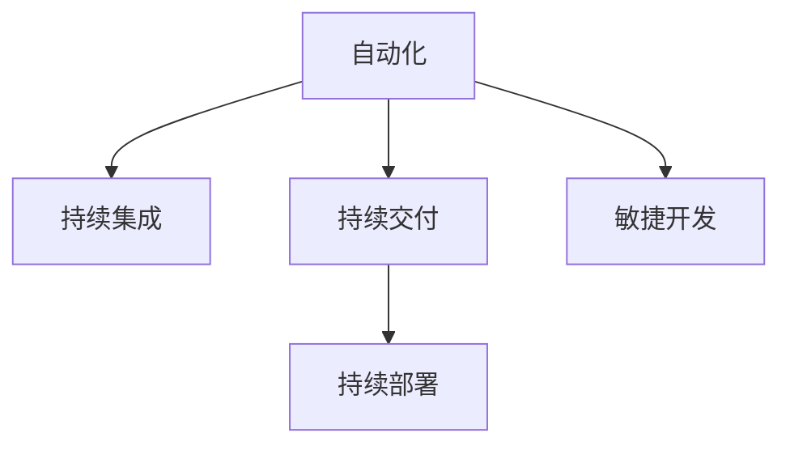

                 

# 自动化创业中的团队管理策略

在当今快速变化的商业环境中，创业公司的成败很大程度上取决于其能否迅速适应市场变化并有效执行其商业策略。自动化技术的崛起为创业公司提供了前所未有的机会，帮助它们提高效率、降低成本、提升创新能力。然而，自动化本身并不能保证成功，有效的团队管理策略才是确保自动化工具和资源发挥最大效用的关键。本文将深入探讨自动化创业中的团队管理策略，通过分析核心概念、算法原理及具体操作步骤，为创业公司提供实用的指导。

## 1. 背景介绍

### 1.1 问题由来
随着技术进步和市场需求的不断变化，越来越多的创业公司开始依赖自动化工具来加速业务发展。然而，由于资源有限、人才短缺和技术复杂性，这些公司往往难以有效管理和协调自动化流程。这不仅浪费了宝贵的时间和金钱，还可能导致业务决策的延迟和执行不力。因此，如何设计并实施有效的团队管理策略，成为了自动化创业成功的关键。

### 1.2 问题核心关键点
成功的自动化团队管理策略需要关注以下几个核心关键点：
- 明确团队目标和角色：确保每个团队成员都清楚自己的职责和目标，避免职责重叠和冲突。
- 优化工作流程：通过流程改进和自动化工具的应用，提高团队的工作效率和生产力。
- 建立有效的沟通机制：促进团队内部和跨团队的沟通，确保信息的及时传递和共享。
- 确保团队适应性和灵活性：在快速变化的市场环境中，团队需要具备快速调整和适应新变化的能力。
- 提升团队的技术水平：持续学习和技能提升，确保团队能够不断适应新技术和工具。

## 2. 核心概念与联系

### 2.1 核心概念概述

为了更好地理解自动化创业中的团队管理策略，我们首先需要定义几个核心概念：

- **自动化（Automation）**：使用软件和工具自动执行重复性任务，减少人工干预，提高效率和准确性。
- **持续集成（Continuous Integration, CI）**：在软件开发中，持续集成是一种开发实践，通过自动化构建、测试和部署来加速软件交付。
- **持续交付（Continuous Delivery, CD）**：持续交付是一种实践，旨在通过自动化流程确保软件产品高质量、快速且可靠地交付给用户。
- **持续部署（Continuous Deployment）**：在持续交付的基础上，持续部署进一步自动化部署流程，确保产品可以迅速上线。
- **敏捷开发（Agile Development）**：敏捷开发是一种迭代、增量开发方法，强调灵活应对变化和快速交付价值。

这些概念之间的联系可以通过以下Mermaid流程图来展示：



这个流程图展示了自动化技术如何通过持续集成、持续交付和持续部署等实践，与敏捷开发方法相结合，形成一个高效的软件交付链条。

## 3. 核心算法原理 & 具体操作步骤
### 3.1 算法原理概述

自动化创业中的团队管理策略，本质上是一种通过技术手段和过程管理来优化团队工作流程的方法。其核心思想是通过自动化工具和流程改进，提高团队的协作效率和决策速度。

从算法原理上，团队管理策略可以抽象为一个“优化目标函数”的问题，目标是最大化团队的生产力和满意度，同时最小化资源消耗和风险。这涉及到以下几个关键环节：

- **任务分解与分配**：将大任务分解为小的可执行任务，并分配给合适的团队成员。
- **流程优化**：通过引入自动化工具和改进流程，减少任务之间的依赖和等待时间。
- **团队协作**：建立有效的沟通机制，确保信息流畅传递和共享。
- **质量控制**：引入自动化测试和监控工具，确保产品高质量交付。
- **性能评估**：通过定期评估团队绩效，及时调整策略和资源分配。

### 3.2 算法步骤详解

自动化创业中的团队管理策略步骤包括以下几个关键步骤：

**Step 1: 任务分解与分配**
- 识别项目的关键任务和子任务。
- 评估团队成员的技能和负荷，合理分配任务。
- 确定任务的优先级和时间线。

**Step 2: 流程优化**
- 识别流程中的瓶颈和改进点。
- 引入自动化工具，如Jenkins、GitLab CI等，优化流程。
- 建立自动化测试和监控机制，确保质量控制。

**Step 3: 团队协作**
- 建立沟通渠道，如Slack、Microsoft Teams等。
- 制定沟通规范和流程，确保信息流畅传递。
- 定期举行团队会议，讨论进展和问题。

**Step 4: 质量控制**
- 引入自动化测试工具，如Selenium、JUnit等。
- 实施代码审查和持续集成流程。
- 定期进行代码审计和风险评估。

**Step 5: 性能评估**
- 定义关键绩效指标（KPIs），如任务完成率、项目交付时间等。
- 使用数据分析工具，如Tableau、Power BI等，监控团队绩效。
- 根据绩效评估结果，调整策略和资源分配。

### 3.3 算法优缺点

自动化创业中的团队管理策略具有以下优点：
1. 提高效率：通过自动化工具和流程优化，减少任务等待时间和人工干预，提高团队效率。
2. 降低成本：减少人力和时间成本，提高资源利用率。
3. 提升质量：通过自动化测试和监控，确保产品高质量交付。
4. 增强灵活性：快速适应市场变化和技术更新，保持竞争优势。

同时，该策略也存在一定的局限性：
1. 技术依赖性：自动化策略依赖于稳定的技术基础设施，一旦技术出现问题，可能导致业务中断。
2. 人员培训成本：团队成员需要掌握新的工具和流程，增加初期培训成本。
3. 数据安全风险：自动化工具和流程可能涉及敏感数据，需要建立严格的安全措施。
4. 文化适应性：团队文化可能对自动化和持续交付方法存在抵触，需要逐步适应和推广。

尽管存在这些局限性，但就目前而言，基于自动化工具的团队管理策略仍是目前主流的实践方法。未来相关研究的重点在于如何进一步降低技术依赖和人员培训成本，提高数据安全和团队文化适应性，以实现更加灵活和高效的团队管理。

### 3.4 算法应用领域

自动化创业中的团队管理策略在软件开发、数据科学、金融科技、医疗健康等多个领域都有广泛应用。例如：

- 软件开发：通过持续集成和持续交付，加速软件产品的开发和交付。
- 数据科学：通过自动化数据处理和模型训练流程，提高数据分析和机器学习项目的效率。
- 金融科技：通过自动化交易和风险管理流程，提升金融服务的速度和准确性。
- 医疗健康：通过自动化电子病历管理和数据分析流程，提高医疗服务的效率和质量。

## 4. 数学模型和公式 & 详细讲解 & 举例说明

### 4.1 数学模型构建

在自动化创业中，我们可以将团队管理策略建模为一个多目标优化问题。假设我们有 $n$ 个团队成员 $T_i$ 和 $m$ 个任务 $J_j$，每个任务需要的时间为 $t_{ij}$。设 $x_{ij}$ 为成员 $i$ 分配给任务 $j$ 的时间，目标是最大化总任务完成率 $P$ 和团队成员的满意度 $S$，同时最小化总任务完成时间 $T$ 和资源消耗 $C$。

数学模型可以表示为：

$$
\begin{aligned}
&\maximize \quad P = \sum_{j=1}^m \frac{1}{t_{j}} \sum_{i=1}^n x_{ij} \\
&\maximize \quad S = \sum_{i=1}^n \log\left( \sum_{j=1}^m x_{ij} \right) \\
&\minimize \quad T = \sum_{j=1}^m t_{j} \sum_{i=1}^n x_{ij} \\
&\minimize \quad C = \sum_{i=1}^n \sum_{j=1}^m x_{ij}
\end{aligned}
$$

其中，约束条件包括任务分配的平衡性、任务时间的连续性等。

### 4.2 公式推导过程

通过将上述模型转换为线性规划问题，我们可以使用优化算法（如线性规划、整数规划等）来求解。以任务完成率 $P$ 为例，目标函数为：

$$
\maximize \quad P = \sum_{j=1}^m \frac{1}{t_{j}} \sum_{i=1}^n x_{ij}
$$

目标函数的梯度为：

$$
\nabla P = \frac{1}{t_{j}} \sum_{i=1}^n \nabla_{x_{ij}} \left( \sum_{i=1}^n x_{ij} \right) = \sum_{j=1}^m \frac{1}{t_{j}} \mathbf{1}_n
$$

在求解过程中，我们可以通过各种优化算法，如单纯形法、内点法等，逐步调整 $x_{ij}$ 的值，直至满足约束条件并达到最优解。

### 4.3 案例分析与讲解

假设我们有一个包含3个成员 $T_1, T_2, T_3$ 和4个任务 $J_1, J_2, J_3, J_4$ 的团队，每个任务的时间分别为 $t_{1}=3$, $t_{2}=2$, $t_{3}=5$, $t_{4}=4$。设 $x_{ij}$ 为成员 $i$ 分配给任务 $j$ 的时间，目标是最小化总任务完成时间 $T$ 和资源消耗 $C$，同时最大化总任务完成率 $P$ 和团队成员的满意度 $S$。

根据模型，我们可以列出以下约束条件：

1. 每个任务必须被完成：$\sum_{i=1}^n x_{ij} = t_j$ 对所有 $j$ 成立。
2. 成员时间总和不超过可用时间：$\sum_{j=1}^m x_{ij} \leq T_i$ 对所有 $i$ 成立。
3. 成员时间不能为负：$x_{ij} \geq 0$ 对所有 $i,j$ 成立。

使用优化算法求解上述模型，可以得到最优的任务分配方案，例如 $T_1$ 分配给 $J_2$ $2$ 小时，$T_2$ 分配给 $J_1$ $2$ 小时，$T_3$ 分配给 $J_4$ $4$ 小时，$T_3$ 分配给 $J_3$ $1$ 小时。

## 5. 项目实践：代码实例和详细解释说明
### 5.1 开发环境搭建

在进行团队管理策略的开发实践前，我们需要准备好开发环境。以下是使用Python进行项目开发的环境配置流程：

1. 安装Anaconda：从官网下载并安装Anaconda，用于创建独立的Python环境。

2. 创建并激活虚拟环境：
```bash
conda create -n team-management python=3.8 
conda activate team-management
```

3. 安装必要的Python库：
```bash
pip install pandas numpy matplotlib scikit-learn pyyaml
```

4. 安装自动化工具：
```bash
pip install jenkins joblib
```

完成上述步骤后，即可在`team-management`环境中开始项目开发。

### 5.2 源代码详细实现

下面以一个简单的持续集成和持续交付（CI/CD）项目为例，给出使用Jenkins和Jenkins Pipeline进行自动化任务调度和管理的PyTorch代码实现。

首先，定义项目的基本参数：

```python
from jenkins.api import Jenkins
from jenkins import JenkinsError

# Jenkins配置
url = 'http://jenkins.example.com'
username = 'your_username'
password = 'your_password'

# Jenkins客户端
jenkins = Jenkins(url, username, password)
```

接着，定义CI/CD流程：

```python
from jenkins.api.builder import PipelineBuilder

# 创建PipelineBuilder实例
pipeline = PipelineBuilder(jenkins)

# 定义构建步骤
pipeline.start('build', actions={
    'steps': [
        {
            'stage': 'Source Control',
            'steps': [
                'git clone https://github.com/your/repo.git'
            ]
        },
        {
            'stage': 'Build',
            'steps': [
                'pip install -r requirements.txt'
            ]
        },
        {
            'stage': 'Test',
            'steps': [
                'python test.py'
            ]
        },
        {
            'stage': 'Deploy',
            'steps': [
                'scp -r dist/* deploymentserver:'
            ]
        }
    ]
})

# 保存Pipeline
pipeline.save('ci-pipeline')
```

最后，启动CI/CD流程并在测试结果页面查看：

```python
pipeline.run()
print(pipeline.get_output('test.py'))
```

以上就是使用Jenkins和Jenkins Pipeline进行持续集成和持续交付的Python代码实现。可以看到，通过Jenkins和Pipeline的封装，我们可以轻松实现复杂的多阶段自动化任务管理。

### 5.3 代码解读与分析

让我们再详细解读一下关键代码的实现细节：

**Jenkins配置**：
- 使用`Jenkins`类创建Jenkins实例，传入Jenkins服务器地址、用户名和密码。
- 使用`PipelineBuilder`类创建Pipeline实例，指定Pipeline名称。

**Pipeline流程**：
- `actions`属性指定了各个构建阶段的任务，每个阶段包含一个或多个步骤。
- `steps`属性定义了每个阶段的具体任务，如克隆代码、安装依赖、执行测试、部署等。
- 使用`stage`属性定义每个任务的执行顺序，确保任务之间的依赖关系正确。
- 使用`pipeline.run()`方法启动Pipeline，执行所有定义的构建任务。

**Pipeline输出**：
- 使用`pipeline.get_output('test.py')`方法获取测试结果，输出测试日志和结果。

通过上述步骤，我们可以轻松搭建和运行一个基本的CI/CD Pipeline，实现代码的自动化构建、测试和部署。

## 6. 实际应用场景

### 6.1 软件开发

持续集成和持续交付在软件开发中的应用最为广泛。通过CI/CD，开发者可以自动化地进行代码合并、构建、测试和部署，快速发现和修复问题，确保代码质量。

**具体实践**：
- 在代码托管平台（如GitHub）上配置Jenkins Pipeline，自动拉取最新的代码变更。
- 定义测试任务，使用Selenium等自动化测试工具进行单元测试和集成测试。
- 定义部署任务，使用Docker和Kubernetes进行容器化和自动化部署。

**效果**：
- 快速发现和修复代码问题，提高代码质量。
- 缩短开发周期，提升开发效率。
- 确保产品稳定可靠，快速上线新功能。

### 6.2 数据科学

数据科学项目通常涉及大量数据处理和模型训练，持续集成和持续交付可以有效提升数据处理和模型训练的效率。

**具体实践**：
- 在数据处理流程中引入自动化工具，如Hadoop、Spark等。
- 使用持续集成和持续交付框架，自动化地进行数据预处理、特征工程和模型训练。
- 定期运行模型评估任务，生成性能报告和调整模型参数。

**效果**：
- 自动化数据处理流程，提高数据处理效率。
- 自动化模型训练和评估，提升模型精度和可靠性。
- 快速迭代模型参数，加速模型优化过程。

### 6.3 金融科技

金融科技行业对数据处理和模型训练的需求尤为旺盛，持续集成和持续交付可以显著提升金融科技项目的数据处理和模型训练效率。

**具体实践**：
- 在金融数据处理流程中引入自动化工具，如Kafka、Hadoop等。
- 使用持续集成和持续交付框架，自动化地进行数据预处理、特征工程和模型训练。
- 定期运行模型评估任务，生成性能报告和调整模型参数。

**效果**：
- 自动化数据处理流程，提高数据处理效率。
- 自动化模型训练和评估，提升模型精度和可靠性。
- 快速迭代模型参数，加速模型优化过程。

### 6.4 医疗健康

医疗健康行业对数据处理和模型训练的需求同样巨大，持续集成和持续交付可以有效提升医疗健康项目的数据处理和模型训练效率。

**具体实践**：
- 在医疗数据处理流程中引入自动化工具，如Hadoop、Spark等。
- 使用持续集成和持续交付框架，自动化地进行数据预处理、特征工程和模型训练。
- 定期运行模型评估任务，生成性能报告和调整模型参数。

**效果**：
- 自动化数据处理流程，提高数据处理效率。
- 自动化模型训练和评估，提升模型精度和可靠性。
- 快速迭代模型参数，加速模型优化过程。

## 7. 工具和资源推荐
### 7.1 学习资源推荐

为了帮助开发者系统掌握自动化创业中的团队管理策略，这里推荐一些优质的学习资源：

1. 《DevOps：软件开发的自动化实践》书籍：详细介绍了持续集成、持续交付和持续部署的实践方法和工具。

2. 《Jenkins官方文档》：Jenkins的官方文档提供了丰富的API和插件，帮助开发者快速搭建和管理CI/CD Pipeline。

3. 《Kubernetes官方文档》：Kubernetes的官方文档提供了详细的部署和运维指南，帮助开发者实现容器化应用的高效管理和扩展。

4. 《Ansible官方文档》：Ansible的官方文档提供了完整的自动化运维解决方案，帮助开发者快速搭建和管理自动化运维环境。

5. 《Continuous Integration and Continuous Delivery》（持续集成和持续交付）课程：由Udemy平台提供的在线课程，系统介绍了持续集成和持续交付的实践方法和工具。

通过对这些资源的学习实践，相信你一定能够快速掌握自动化创业中的团队管理策略，并用于解决实际的业务问题。

### 7.2 开发工具推荐

高效的开发离不开优秀的工具支持。以下是几款用于自动化创业中的团队管理策略开发的常用工具：

1. Jenkins：开源的持续集成和持续交付工具，支持丰富的插件和扩展，易于集成各种自动化任务。

2. GitLab CI/CD：GitLab提供的持续集成和持续交付工具，支持流水线定义和版本控制集成，方便开发者进行自动化构建和部署。

3. Docker：开源的容器化技术，支持快速构建、部署和管理应用，提高应用的可移植性和可靠性。

4. Kubernetes：开源的容器编排工具，支持高效的自动化部署和管理，确保应用的稳定性和扩展性。

5. Ansible：开源的自动化运维工具，支持自动化配置、部署和管理，提高运维效率。

合理利用这些工具，可以显著提升自动化创业中团队管理策略的开发效率，加快创新迭代的步伐。

### 7.3 相关论文推荐

自动化创业中的团队管理策略的研究源于学界的持续研究。以下是几篇奠基性的相关论文，推荐阅读：

1. "Automating Software Development with Jenkins"：介绍如何使用Jenkins实现持续集成和持续交付。

2. "Continuous Delivery: Principles and Practices"：阐述持续交付的核心原则和实践方法。

3. "The Promise of Microservices: How the Industry Can Use It to Accelerate Development"：介绍微服务的核心思想和应用方法，帮助企业提升开发效率。

4. "Principles of Distributed Systems"：阐述分布式系统的核心原则和实践方法，帮助企业构建可扩展、高可靠的系统。

这些论文代表了大规模自动化创业中的团队管理策略的发展脉络。通过学习这些前沿成果，可以帮助研究者把握学科前进方向，激发更多的创新灵感。

## 8. 总结：未来发展趋势与挑战

### 8.1 总结

本文对自动化创业中的团队管理策略进行了全面系统的介绍。首先阐述了自动化创业中团队管理策略的研究背景和意义，明确了持续集成、持续交付和持续部署在提升团队效率和产品质量中的重要价值。其次，从原理到实践，详细讲解了持续集成和持续交付的数学模型和算法步骤，给出了持续集成和持续交付任务开发的完整代码实例。同时，本文还广泛探讨了持续集成和持续交付在软件开发、数据科学、金融科技、医疗健康等多个领域的应用前景，展示了持续集成和持续交付的巨大潜力。此外，本文精选了持续集成和持续交付技术的各类学习资源，力求为读者提供全方位的技术指引。

通过本文的系统梳理，可以看到，持续集成和持续交付在自动化创业中发挥着重要作用，极大地提升了团队的协作效率和开发速度。得益于持续集成和持续交付工具和流程的不断演进，更多的企业开始采用这一实践方法，逐步摆脱传统的手工管理和调试方式，提升企业竞争力和市场响应速度。未来，随着自动化技术的持续进步和工具的不断优化，持续集成和持续交付将进一步普及，为企业的自动化创业提供更强大的技术支持。

### 8.2 未来发展趋势

展望未来，持续集成和持续交付技术将呈现以下几个发展趋势：

1. 自动化程度不断提高：随着自动化工具和技术的不断进步，持续集成和持续交付将变得更加高效和智能。自动化部署、自动化测试等环节将得到优化，进一步提升开发效率。

2. 云计算和边缘计算的结合：云计算和边缘计算技术的结合将带来更灵活和可扩展的自动化环境，支持大规模、高并发的自动化需求。

3. 微服务和容器化的普及：微服务架构和容器化技术的应用将进一步推动持续集成和持续交付的普及，提高应用的可扩展性和可维护性。

4. 持续交付和DevSecOps的融合：DevSecOps（开发、安全和运营）的融合将提升持续交付的安全性和稳定性，确保应用的可靠性和安全性。

5. 自动化与人工智能的融合：自动化工具将引入更多人工智能技术，如自动化测试生成、自动化代码优化等，提升持续集成和持续交付的智能化水平。

以上趋势凸显了持续集成和持续交付技术的广阔前景。这些方向的探索发展，必将进一步提升企业的自动化管理水平，为企业的持续创新和市场竞争力提供新的动力。

### 8.3 面临的挑战

尽管持续集成和持续交付技术已经取得了瞩目成就，但在迈向更加智能化、普适化应用的过程中，它仍面临着诸多挑战：

1. 技术复杂性：持续集成和持续交付涉及大量的自动化工具和流程，开发者需要具备较高的技术水平和实践经验。

2. 文化适应性：持续集成和持续交付需要组织内部文化和流程的彻底变革，对企业文化和管理方式提出了新的要求。

3. 资源投入：持续集成和持续交付需要一定的技术投入和资源支持，对中小型企业可能存在较高的成本压力。

4. 安全性问题：持续集成和持续交付涉及大量的代码和数据，需要建立严格的安全措施，防止数据泄露和恶意攻击。

5. 数据质量问题：持续集成和持续交付依赖高质量的数据和代码，数据不完整或不准确会导致错误的测试和部署。

尽管存在这些挑战，但就目前而言，持续集成和持续交付仍是自动化创业中的主流实践方法。未来相关研究的重点在于如何降低技术复杂性，提高文化适应性和资源利用率，同时增强数据安全和提升数据质量，以实现更加高效和可靠的自动化管理。

### 8.4 研究展望

面对持续集成和持续交付所面临的种种挑战，未来的研究需要在以下几个方面寻求新的突破：

1. 引入更多人工智能技术：通过引入自动化测试生成、自动化代码优化等技术，提升持续集成和持续交付的智能化水平。

2. 引入更多先进的管理工具：引入更多先进的管理工具，如DevOps平台、Kubernetes等，提升持续集成和持续交付的效率和灵活性。

3. 优化持续交付的安全性和稳定性：通过引入DevSecOps方法，确保持续交付的安全性和稳定性，防止数据泄露和恶意攻击。

4. 优化持续交付的资源利用率：通过优化持续交付的资源配置和利用率，降低成本，提高持续交付的效率和可靠性。

5. 优化持续交付的效率和可靠性：通过引入更多的自动化工具和流程，提升持续交付的效率和可靠性，减少人工干预和错误。

这些研究方向的探索，必将引领持续集成和持续交付技术迈向更高的台阶，为企业的持续创新和市场竞争力提供更强大的技术支持。面向未来，持续集成和持续交付技术还需要与其他技术进行更深入的融合，如微服务、容器化、DevSecOps等，多路径协同发力，共同推动企业自动化创业的成功。

## 9. 附录：常见问题与解答

**Q1：自动化工具对团队管理有什么影响？**

A: 自动化工具能够显著提升团队管理效率，减少人工干预，降低错误率。通过自动化工具，团队可以更加快速地响应市场变化，提升产品交付速度和质量。

**Q2：持续集成和持续交付对开发流程有什么影响？**

A: 持续集成和持续交付对开发流程的影响主要体现在以下几个方面：
1. 加速迭代速度：通过自动化测试和部署，可以加速新功能的迭代和交付。
2. 提高开发效率：通过自动化任务管理，可以显著减少开发人员的工作量，提高开发效率。
3. 增强代码质量：通过持续集成和持续交付，可以及时发现和修复代码问题，提高代码质量。

**Q3：持续集成和持续交付需要哪些技术支持？**

A: 持续集成和持续交付需要以下技术支持：
1. 自动化测试工具：如Selenium、JUnit等。
2. 持续集成工具：如Jenkins、GitLab CI等。
3. 持续部署工具：如Docker、Kubernetes等。
4. 版本控制工具：如Git、SVN等。
5. 自动化运维工具：如Ansible、Puppet等。

**Q4：如何平衡持续集成和持续交付的效率和质量？**

A: 持续集成和持续交付需要在效率和质量之间找到平衡点。具体来说：
1. 确保自动化测试覆盖率：通过编写高质量的自动化测试用例，确保测试覆盖率足够高。
2. 引入持续反馈机制：通过持续集成工具，实时反馈测试结果和性能指标，及时发现和解决问题。
3. 优化流程设计：优化持续集成和持续交付流程，减少瓶颈和等待时间，提高效率。

通过上述步骤，可以确保持续集成和持续交付既高效又高质量，提升团队管理效率和产品质量。

**Q5：持续集成和持续交付在实际应用中需要注意哪些问题？**

A: 持续集成和持续交付在实际应用中需要注意以下问题：
1. 技术复杂性：持续集成和持续交付涉及大量的自动化工具和流程，需要具备较高的技术水平和实践经验。
2. 文化适应性：持续集成和持续交付需要组织内部文化和流程的彻底变革，对企业文化和管理方式提出了新的要求。
3. 资源投入：持续集成和持续交付需要一定的技术投入和资源支持，对中小型企业可能存在较高的成本压力。
4. 安全性问题：持续集成和持续交付涉及大量的代码和数据，需要建立严格的安全措施，防止数据泄露和恶意攻击。
5. 数据质量问题：持续集成和持续交付依赖高质量的数据和代码，数据不完整或不准确会导致错误的测试和部署。

尽管存在这些挑战，但持续集成和持续交付仍然是企业自动化创业中的主流实践方法。未来相关研究的重点在于如何降低技术复杂性，提高文化适应性和资源利用率，同时增强数据安全和提升数据质量，以实现更加高效和可靠的自动化管理。

---

作者：禅与计算机程序设计艺术 / Zen and the Art of Computer Programming

