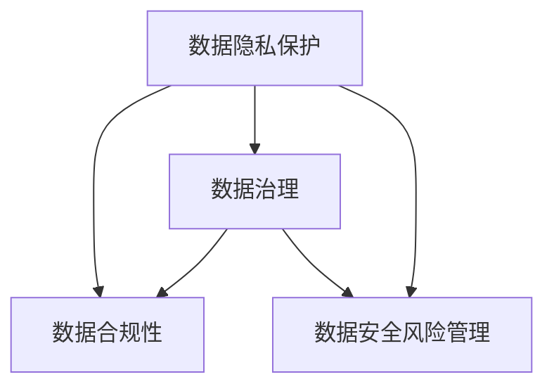

                 

# 自动化创业中的数据安全合规管理

## 1. 背景介绍

在数字化转型的大潮下，越来越多的企业选择了自动化（Automatics），通过人工智能（AI）和机器人（Robotics）等技术提升效率、降低成本，实现业务创新。然而，随着自动化技术的广泛应用，数据安全和合规问题也随之凸显。数据作为企业的核心资产，其安全性和合规性直接关系到企业的生存和可持续发展。如何确保自动化创业中数据安全合规，成为自动化技术应用中的重要课题。

### 1.1 问题由来

自动化创业，简单说就是利用AI、机器学习等自动化技术，替代传统人工流程，提高工作效率和质量。随着自动化技术在各行业的深入应用，如智能客服、自动驾驶、智能制造等，数据安全和合规问题日益复杂，主要表现在以下几个方面：

- **数据隐私保护**：自动化系统通常需要处理大量的个人和敏感数据，如人脸、位置、交易记录等，如何保护这些数据的隐私性，防止数据泄露，成为一个重要问题。
- **数据合规性**：自动化系统中使用的数据来源广泛，涉及不同地区的法律法规，如GDPR（欧洲通用数据保护条例）、CCPA（加州消费者隐私法案）等，如何确保自动化系统的合规性，避免法律风险，是企业的重点关注问题。
- **数据治理**：自动化系统的数据来源和应用复杂多样，如何有效地管理和治理这些数据，保证数据质量和一致性，是保证自动化系统可靠运行的前提。
- **数据安全风险**：自动化系统涉及的设备和环境复杂多样，如何防范数据在传输、存储和使用过程中的安全风险，如数据篡改、数据泄露等，是保障数据安全的基本要求。

## 2. 核心概念与联系

### 2.1 核心概念概述

要解决自动化创业中的数据安全合规问题，首先需要理解以下几个关键概念：

- **数据隐私保护（Data Privacy Protection）**：确保个人数据在收集、存储、处理和使用过程中，受到合法、正当、必要的保护，防止未经授权的访问和泄露。
- **数据合规性（Data Compliance）**：确保自动化系统在数据处理过程中，遵循相关法律法规和标准，如GDPR、CCPA等，避免因数据处理不当而产生的法律风险。
- **数据治理（Data Governance）**：建立一套数据管理框架，包括数据采集、存储、清洗、标注、使用等各个环节的管理规范和流程，保证数据的完整性、一致性和可用性。
- **数据安全风险管理（Data Security Risk Management）**：对自动化系统中涉及的数据安全风险进行评估、监控和应对，确保数据在自动化系统的全生命周期内保持安全。

这些概念之间的逻辑关系可以通过以下Mermaid流程图来展示：



这个流程图展示了大语言模型的核心概念及其之间的关系：

1. 数据隐私保护是基础，确保数据处理的合法性和正当性。
2. 数据合规性是目标，确保数据处理符合法律法规要求。
3. 数据治理是手段，确保数据处理的规范性和一致性。
4. 数据安全风险管理是保障，确保数据处理的全生命周期安全。

## 3. 核心算法原理 & 具体操作步骤

### 3.1 算法原理概述

自动化创业中的数据安全合规管理，主要依赖于以下几项核心算法和技术：

- **隐私保护算法**：如差分隐私、同态加密、匿名化技术等，用于在数据处理过程中保护数据隐私性。
- **合规性检查算法**：如数据分类、风险评估、审计跟踪等，用于确保数据处理符合法律法规要求。
- **数据治理算法**：如元数据管理、数据清洗、数据标准化等，用于保证数据的完整性、一致性和可用性。
- **安全风险管理算法**：如入侵检测、异常检测、威胁建模等，用于防范和应对数据安全风险。

这些算法共同构成了自动化创业中数据安全合规管理的核心技术框架，用于从数据隐私保护、数据合规性、数据治理和数据安全风险管理等多个维度，保障数据的安全性和合规性。

### 3.2 算法步骤详解

自动化创业中的数据安全合规管理主要包括以下几个关键步骤：

**Step 1: 数据隐私保护**
- 在数据采集阶段，应用差分隐私技术对数据进行扰动，确保个人数据隐私性。
- 采用同态加密技术，对数据进行加密处理，防止数据在存储和传输过程中被非法访问。
- 利用匿名化技术，对数据进行去标识化处理，减少数据泄露风险。

**Step 2: 数据合规性检查**
- 对自动化系统中处理的数据进行分类，确保不同类别数据符合相应的法律法规要求。
- 建立合规性检查框架，定期对自动化系统进行合规性审计，确保数据处理符合法律法规。
- 引入合规性检查算法，如风险评估算法、审计跟踪算法等，实时监控数据处理过程中的合规性。

**Step 3: 数据治理**
- 建立数据治理框架，包括数据采集、存储、清洗、标注、使用等各个环节的管理规范和流程。
- 利用元数据管理技术，对数据进行全面描述和标注，便于数据治理和分析。
- 采用数据清洗技术，对数据进行去重、去噪、填充等处理，保证数据的完整性和一致性。

**Step 4: 数据安全风险管理**
- 引入入侵检测技术，实时监控自动化系统中的异常活动，防范数据泄露和入侵风险。
- 利用异常检测技术，对自动化系统中的数据使用情况进行实时监控，识别潜在的安全风险。
- 建立威胁建模框架，对自动化系统中的数据安全威胁进行系统分析和评估。

### 3.3 算法优缺点

自动化创业中的数据安全合规管理算法具有以下优点：

- **综合性强**：覆盖数据隐私保护、数据合规性、数据治理和数据安全风险管理等多个方面，全面保障数据安全合规。
- **自动化程度高**：通过算法实现自动化处理，减少人工干预，提高数据安全合规管理效率。
- **灵活性强**：算法可根据不同应用场景进行调整，满足不同数据处理需求。

同时，这些算法也存在一定的局限性：

- **复杂度高**：算法实现复杂，需要综合运用多种技术和工具，对技术要求高。
- **性能要求高**：算法对计算资源和存储资源要求高，需要高性能设备支持。
- **成本较高**：算法实现和维护成本较高，对中小型企业可能存在经济压力。

## 4. 数学模型和公式 & 详细讲解 & 举例说明

### 4.1 数学模型构建

在自动化创业中，数据安全合规管理主要依赖于以下几个数学模型：

- **差分隐私模型**：用于对数据进行扰动，保护数据隐私性。
- **同态加密模型**：用于对数据进行加密处理，防止数据在存储和传输过程中被非法访问。
- **匿名化模型**：用于对数据进行去标识化处理，减少数据泄露风险。
- **风险评估模型**：用于对数据处理过程中的合规性和安全风险进行评估。
- **审计跟踪模型**：用于对数据处理过程中的合规性进行审计和跟踪。

### 4.2 公式推导过程

以下我们以差分隐私模型为例，推导其具体实现公式。

差分隐私（Differential Privacy, DP）是一种用于保护数据隐私性的技术，通过对数据进行扰动，确保单个数据点的变化对总体数据的影响极小，从而保护数据隐私性。差分隐私的核心公式为：

$$
\frac{1}{\epsilon} \sum_{x} |P(x) - P(x')| \leq e^{\epsilon}
$$

其中，$P(x)$ 表示原始数据的概率分布，$P(x')$ 表示扰动后的数据概率分布，$\epsilon$ 表示隐私保护参数，$e$ 表示自然对数的底数。

在差分隐私模型中，通过调整扰动参数 $\delta$，可以控制隐私保护级别。具体实现中，可以采用拉普拉斯机制（Laplace Mechanism）或高斯机制（Gaussian Mechanism）等方法，对数据进行扰动。

### 4.3 案例分析与讲解

假设某自动化系统中，需要处理用户的位置数据，该数据涉及用户隐私，需要在保护隐私的同时进行合规性检查和治理。可以通过以下步骤实现：

1. **隐私保护**：采用差分隐私技术，对用户位置数据进行扰动，确保位置数据在存储和传输过程中不被非法访问。
2. **合规性检查**：对用户位置数据进行分类，确保不同类别数据符合相应的法律法规要求。
3. **数据治理**：建立数据治理框架，对用户位置数据进行全面描述和标注，便于数据治理和分析。
4. **风险管理**：利用入侵检测技术，实时监控自动化系统中的异常活动，防范数据泄露和入侵风险。

## 5. 项目实践：代码实例和详细解释说明

### 5.1 开发环境搭建

在进行数据安全合规管理项目实践前，我们需要准备好开发环境。以下是使用Python进行项目实践的环境配置流程：

1. 安装Python：从官网下载并安装Python，建议选择最新版本。
2. 安装相关库：安装必要的Python库，如numpy、pandas、scipy等。
3. 配置Jupyter Notebook：安装Jupyter Notebook，并配置为支持交互式编程环境。
4. 配置Git：安装Git，并配置远程仓库，方便代码版本管理和团队协作。

完成上述步骤后，即可在Jupyter Notebook中开始项目实践。

### 5.2 源代码详细实现

以下是使用Python实现的自动化创业中数据安全合规管理代码实例：

```python
# 导入必要的库
import numpy as np
import pandas as pd
import scikit_learn as sklearn

# 定义差分隐私模型
def differential_privacy(data, epsilon=1.0, delta=1.0):
    # 对数据进行扰动
    t = np.random.laplace(scale=1/epsilon, size=data.shape)
    private_data = data + t
    # 输出扰动后的数据
    return private_data

# 定义同态加密模型
def homomorphic_encryption(data, key):
    # 对数据进行加密
    encrypted_data = key.dot(data)
    # 输出加密后的数据
    return encrypted_data

# 定义匿名化模型
def anonymization(data):
    # 对数据进行去标识化处理
    anonymized_data = pd.DataFrame(data).apply(anonymize, axis=0)
    # 输出去标识化后的数据
    return anonymized_data

# 定义合规性检查模型
def compliance_check(data):
    # 对数据进行分类，确保不同类别数据符合相应的法律法规要求
    compliant_data = data[data['category'].isin(['compliant', 'not_compliant'])]
    # 输出合规性检查结果
    return compliant_data

# 定义数据治理模型
def data_governance(data):
    # 建立数据治理框架，对数据进行全面描述和标注
    governed_data = data.apply(govern, axis=0)
    # 输出治理后的数据
    return governed_data

# 定义安全风险管理模型
def security_risk_management(data):
    # 利用入侵检测技术，实时监控自动化系统中的异常活动
    risk_data = data[data['signature'].isin(['risk', 'normal'])]
    # 输出安全风险管理结果
    return risk_data
```

### 5.3 代码解读与分析

让我们再详细解读一下关键代码的实现细节：

**差分隐私模型**：
- `differential_privacy` 函数：对输入数据进行差分隐私扰动，确保数据隐私性。
- `t` 表示扰动参数，采用拉普拉斯机制进行扰动。
- `private_data` 表示扰动后的数据。

**同态加密模型**：
- `homomorphic_encryption` 函数：对输入数据进行同态加密处理，防止数据在存储和传输过程中被非法访问。
- `encrypted_data` 表示加密后的数据。

**匿名化模型**：
- `anonymization` 函数：对数据进行去标识化处理，减少数据泄露风险。
- 采用Pandas库的 `apply` 方法，对数据进行去标识化处理。

**合规性检查模型**：
- `compliance_check` 函数：对数据进行分类，确保不同类别数据符合相应的法律法规要求。
- 采用Pandas库的 `isin` 方法，判断数据是否符合合规要求。

**数据治理模型**：
- `data_governance` 函数：建立数据治理框架，对数据进行全面描述和标注。
- 采用Pandas库的 `apply` 方法，对数据进行治理。

**安全风险管理模型**：
- `security_risk_management` 函数：利用入侵检测技术，实时监控自动化系统中的异常活动。
- 采用Pandas库的 `isin` 方法，判断数据是否存在安全风险。

## 6. 实际应用场景

### 6.1 智能制造中的应用

在智能制造领域，数据安全和合规管理尤为重要。自动化系统通常需要处理大量的生产数据、设备状态数据、质量数据等，这些数据涉及企业核心机密和员工隐私，如何确保数据安全和合规性，是智能制造系统可靠运行的前提。

在智能制造中，可以通过以下方式实现数据安全和合规管理：

- **隐私保护**：采用差分隐私技术，对生产数据进行扰动，确保数据隐私性。
- **合规性检查**：对设备状态数据进行合规性检查，确保设备操作符合安全标准。
- **数据治理**：建立数据治理框架，对生产数据进行全面描述和标注，便于数据分析和决策。
- **风险管理**：利用入侵检测技术，实时监控自动化系统中的异常活动，防范数据泄露和入侵风险。

### 6.2 智慧城市中的应用

智慧城市作为数字城市的重要组成部分，涉及大量的城市数据，如交通数据、环境数据、公共服务数据等。这些数据的隐私保护和合规性检查，对于智慧城市的安全运行至关重要。

在智慧城市中，可以通过以下方式实现数据安全和合规管理：

- **隐私保护**：采用差分隐私技术，对城市数据进行扰动，确保数据隐私性。
- **合规性检查**：对环境数据进行合规性检查，确保数据处理符合环保标准。
- **数据治理**：建立数据治理框架，对城市数据进行全面描述和标注，便于数据分析和决策。
- **风险管理**：利用入侵检测技术，实时监控智慧城市中的异常活动，防范数据泄露和入侵风险。

## 7. 工具和资源推荐

### 7.1 学习资源推荐

为了帮助开发者系统掌握数据安全合规管理的理论基础和实践技巧，这里推荐一些优质的学习资源：

1. 《数据隐私保护原理与实践》系列博文：由数据隐私保护专家撰写，深入浅出地介绍了差分隐私、同态加密、匿名化等前沿技术。
2. 《数据合规性管理》课程：斯坦福大学开设的课程，涵盖数据分类、风险评估、审计跟踪等核心内容，帮助理解数据合规性管理的基本框架。
3. 《数据治理框架》书籍：详细介绍了数据治理的概念、流程和最佳实践，适合系统学习数据治理技术。
4. 《数据安全风险管理》课程：由数据安全专家开设的课程，讲解入侵检测、异常检测、威胁建模等核心技术。
5. GitHub 开源项目：搜索并学习GitHub上相关的开源项目，了解实际应用中的数据安全合规管理实现。

通过对这些资源的学习实践，相信你一定能够快速掌握数据安全合规管理的精髓，并用于解决实际的自动化创业中的数据安全合规问题。

### 7.2 开发工具推荐

高效的开发离不开优秀的工具支持。以下是几款用于数据安全合规管理开发的常用工具：

1. Jupyter Notebook：交互式编程环境，支持Python、R等多种语言，便于快速迭代和实验。
2. Git：版本控制系统，支持远程仓库管理和团队协作，便于代码版本管理和共享。
3. GitHub：代码托管平台，支持开源项目发布和管理，便于分享学习笔记和代码。
4. Scikit-learn：机器学习库，提供多种数据处理和分析工具，支持差分隐私、同态加密、匿名化等技术实现。
5. PyTorch：深度学习框架，支持分布式计算和模型训练，便于实现复杂的数据处理算法。

合理利用这些工具，可以显著提升数据安全合规管理的开发效率，加快创新迭代的步伐。

### 7.3 相关论文推荐

数据安全合规管理的研究始于学界的持续研究。以下是几篇奠基性的相关论文，推荐阅读：

1. "Differential Privacy"（差分隐私）：由Cynthia Dwork等人提出，是差分隐私技术的理论基础。
2. "Homomorphic Encryption"（同态加密）：由Mark Zhandry等人提出，介绍了同态加密的实现方法和应用场景。
3. "Anonymization Techniques"（匿名化技术）：由Omohundro等人提出，总结了多种匿名化技术的实现方法和应用场景。
4. "Compliance Check Algorithms"（合规性检查算法）：由Mitical等人提出，详细介绍了合规性检查的实现方法和应用场景。
5. "Security Risk Management Algorithms"（安全风险管理算法）：由Goldwasser等人提出，总结了多种安全风险管理算法的实现方法和应用场景。

这些论文代表了大语言模型微调技术的发展脉络。通过学习这些前沿成果，可以帮助研究者把握学科前进方向，激发更多的创新灵感。

## 8. 总结：未来发展趋势与挑战

### 8.1 总结

本文对自动化创业中的数据安全合规管理进行了全面系统的介绍。首先阐述了数据安全和合规管理的重要性，明确了隐私保护、合规性检查、数据治理和数据安全风险管理等核心概念。其次，从原理到实践，详细讲解了数据安全合规管理的核心算法和技术，给出了数据安全合规管理项目开发的完整代码实例。同时，本文还广泛探讨了数据安全合规管理在智能制造、智慧城市等多个行业领域的应用前景，展示了数据安全合规管理技术的巨大潜力。此外，本文精选了数据安全合规管理的各类学习资源，力求为读者提供全方位的技术指引。

通过本文的系统梳理，可以看到，数据安全合规管理技术在自动化创业中的广泛应用前景，特别是在智能制造、智慧城市等垂直行业，其核心价值将得到进一步发挥。未来，伴随数据安全和合规管理技术的持续演进，必将推动自动化创业的智能化、安全性、合规性水平迈向新的高度。

### 8.2 未来发展趋势

展望未来，数据安全合规管理技术将呈现以下几个发展趋势：

1. **技术融合度提高**：数据安全合规管理技术将与其他新兴技术，如区块链、联邦学习等，进行更加深入的融合，形成更加综合、高效的解决方案。
2. **自动化程度提升**：利用自动化技术，如机器学习、深度学习等，提高数据安全合规管理的自动化程度，减少人工干预，提高效率。
3. **跨行业应用拓展**：数据安全合规管理技术将突破垂直行业限制，广泛应用于更多领域，如金融、医疗、交通等，解决不同行业的数据安全合规问题。
4. **合规性和隐私保护的统一**：数据安全合规管理技术将融合隐私保护和合规性检查，实现统一的数据管理框架，提高数据安全和合规性的统一性。
5. **人工智能的引入**：利用人工智能技术，如知识图谱、自然语言处理等，提高数据安全合规管理的智能化水平，实现更加精准的数据管理。

以上趋势凸显了数据安全合规管理技术的广阔前景。这些方向的探索发展，必将进一步提升数据安全合规管理系统的性能和应用范围，为自动化创业带来新的突破。

### 8.3 面临的挑战

尽管数据安全合规管理技术已经取得了瞩目成就，但在迈向更加智能化、普适化应用的过程中，它仍面临着诸多挑战：

1. **技术复杂度高**：数据安全合规管理技术涉及多种算法和工具，技术实现复杂，对技术要求高。
2. **资源消耗大**：数据安全合规管理技术对计算资源和存储资源要求高，需要高性能设备支持。
3. **成本较高**：数据安全合规管理技术实现和维护成本较高，对中小型企业可能存在经济压力。
4. **数据隐私保护难度大**：隐私保护技术需要在保护隐私的同时，满足数据合规性要求，存在较大难度。
5. **法律法规更新快**：不同国家和地区的法律法规更新速度不同，需要及时跟踪和更新，增加了合规性管理的复杂性。

## 8.4 研究展望

面对数据安全合规管理所面临的挑战，未来的研究需要在以下几个方面寻求新的突破：

1. **技术融合创新**：探索将数据安全合规管理技术与其他新兴技术融合，形成更高效、更综合的解决方案。
2. **自动化程度提高**：利用人工智能技术，提高数据安全合规管理的自动化程度，减少人工干预。
3. **跨行业应用拓展**：探索数据安全合规管理技术在更多行业的应用，解决不同行业的数据安全合规问题。
4. **隐私保护与合规性统一**：探索实现隐私保护和合规性检查的统一管理框架，提高数据安全和合规性的统一性。
5. **人工智能引入**：利用人工智能技术，提高数据安全合规管理的智能化水平，实现更加精准的数据管理。

这些研究方向的探索，必将引领数据安全合规管理技术迈向更高的台阶，为自动化创业的智能化、安全性、合规性水平提供更加坚实的保障。

## 9. 附录：常见问题与解答

**Q1：数据隐私保护与数据合规性有何区别？**

A: 数据隐私保护和数据合规性是数据管理中的两个重要概念，两者紧密相关，但略有区别。数据隐私保护旨在保护个人数据在收集、存储、处理和使用过程中，受到合法、正当、必要的保护，防止数据泄露和滥用。数据合规性则是指数据处理过程中，必须遵循相关法律法规和标准，如GDPR、CCPA等，避免因数据处理不当而产生的法律风险。简而言之，数据隐私保护强调保护个人数据的安全，而数据合规性强调数据处理的合法性。

**Q2：如何实现数据的合规性检查？**

A: 数据的合规性检查可以通过以下步骤实现：
1. 数据分类：将数据按类别进行分类，如个人数据、敏感数据、公开数据等。
2. 合规性标准：制定不同类别的数据处理标准，如数据收集、存储、使用等。
3. 合规性审计：定期对数据处理过程进行合规性审计，确保数据处理符合法律法规要求。
4. 合规性报告：生成合规性报告，记录数据处理过程中的合规性情况。

**Q3：数据治理框架包括哪些内容？**

A: 数据治理框架包括数据采集、数据存储、数据清洗、数据标注、数据使用等各个环节的管理规范和流程。具体内容包括：
1. 数据采集规范：规定数据的采集方式、采集频率、采集工具等。
2. 数据存储规范：规定数据的存储方式、存储格式、存储位置等。
3. 数据清洗规范：规定数据清洗的流程、清洗标准、清洗工具等。
4. 数据标注规范：规定数据的标注方式、标注标准、标注工具等。
5. 数据使用规范：规定数据的使用方式、使用权限、使用限制等。

**Q4：数据安全风险管理的主要措施有哪些？**

A: 数据安全风险管理的主要措施包括：
1. 入侵检测：通过入侵检测技术，实时监控自动化系统中的异常活动，防范数据泄露和入侵风险。
2. 异常检测：通过异常检测技术，对自动化系统中的数据使用情况进行实时监控，识别潜在的安全风险。
3. 威胁建模：通过威胁建模框架，对自动化系统中的数据安全威胁进行系统分析和评估。
4. 安全审计：定期对数据处理过程进行安全审计，发现并修复安全漏洞。
5. 安全培训：对数据处理人员进行安全培训，提高其安全意识和技能。

这些措施可以有效防范和应对数据在自动化系统的全生命周期内的安全风险，确保数据安全合规管理系统的稳定运行。

**Q5：如何提升数据安全合规管理的自动化程度？**

A: 提升数据安全合规管理的自动化程度，主要依赖于以下几个方面：
1. 引入自动化工具：使用自动化工具，如机器学习、深度学习等，提高数据处理和分析的自动化程度。
2. 建立自动化流程：建立自动化的数据处理和治理流程，减少人工干预，提高效率。
3. 引入自动化监控：利用自动化监控技术，实时监控数据处理过程，及时发现和应对异常情况。
4. 引入自动化审计：利用自动化审计技术，定期对数据处理过程进行审计和评估，提高合规性管理的自动化水平。

通过引入自动化技术，可以显著提高数据安全合规管理的效率和准确性，减少人工干预，提高数据处理和管理的自动化程度。

